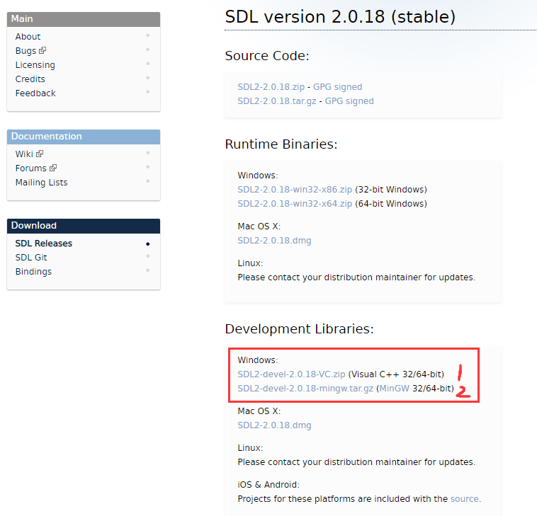

## SDL 简介

### 什么是 SDL？

Simple DirectMedia Layer 是一个跨平台开发库，旨在通过 OpenGL 和 Direct3D 提供对音频、键盘、鼠标、游戏杆和图形硬件的低级访问。它被视频播放软件、模拟器和流行游戏使用，包括[Valve](http://valvesoftware.com/)的获奖目录和许多[Humble Bundle](https://www.humblebundle.com/)游戏。

SDL 正式支持 Windows、Mac OS X、Linux、iOS 和[Android](https://wiki.libsdl.org/Android)。可以在源代码中找到对其他平台的支持。

SDL 是用 C 编写的，在本机上与 C++ 一起使用，并且有适用于其他几种语言的绑定，包括 C# 和 Python。

SDL 2.0 在[zlib 许可](http://www.gzip.org/zlib/zlib_license.html)下分发。此许可证允许您在任何软件中自由使用 SDL。简单直接媒体层库 (SDL) 是一个通用 API，它提供对音频、键盘、鼠标、游戏杆、通过 OpenGL 的 3D 硬件以及跨多个平台的 2D 帧缓冲区的低级别访问。

### SDL 可以做什么？

**视频**

- 3D图形：SDL 可与 OpenGL API 或 Direct3D API 结合使用，用于 3D 图形
- 加速 2D 渲染 API：支持简单的旋转、缩放和 alpha 混合，所有这些都使用现代 3D API 加速，使用 OpenGL 和 Direct3D 支持加速
- 创建和管理多个窗口

**输入事件**

- 提供的事件和 API 函数用于：
  - 应用程序和窗口状态更改
  - 鼠标输入
  - 键盘输入
  - 操纵杆和游戏控制器输入
  - 多点触控手势
- 可以使用[SDL_EventState](https://wiki.libsdl.org/SDL_EventState) ()启用或禁用每个事件
- 事件在发布到内部事件队列之前通过用户指定的过滤器函数
- 线程安全事件队列

**力反馈**

- Windows、Mac OS X 和 Linux 支持力反馈

**音频**

- 设置8位和16位音频、单声道立体声或5.1环绕声的音频播放，如果硬件不支持格式，可选择转换
- 音频在单独的线程中独立运行，通过用户回调机制填充
- 专为定制软件混音器设计，但[SDL_mixer](http://www.libsdl.org/projects/SDL_mixer/)提供完整的音频/音乐输出库

**文件 I/O 抽象**

- 用于打开、读取和写入数据的通用抽象
- 对文件和内存的内置支持

**共享对象支持**

- 加载共享对象（Windows 上的 DLL，Mac OS X 上的 .dylib，Linux 上的 .so）
- 共享对象中的查找函数

**线程**

- 简单的线程创建API
- 简单线程本地存储API
- 互斥体、信号量和条件变量
- 无锁编程的原子操作

**计时器**

- 获取经过的毫秒数
- 等待指定的毫秒数
- 在单独的线程中创建与代码一起运行的计时器
- 使用高分辨率计数器进行分析

**CPU 特性检测**

- 查询CPU数量
- 检测 CPU 特性和支持的指令集

**大端小端支持**

- 检测当前系统的字节序
- 用于快速交换数据值的例程
- 读取和写入指定字节序的数据

**电池管理**

- 查询电源管理状态

### SDL 在哪些平台上运行？

**视窗**

- 使用 Win32 API 进行显示，利用 Direct3D 进行硬件加速
- 使用 DirectSound 和 XAudio2 作为声音

**Mac OS X**

- 使用 Cocoa 进行视频显示，利用 OpenGL 进行硬件加速
- 使用 Core Audio 播放声音

**Linux**

- 使用 X11 进行视频显示，利用 OpenGL 进行硬件加速
- 使用 ALSA、OSS 和 PulseAudio API 来处理声音

**IOS**

- 使用 UIKit 进行视频显示，利用 OpenGL ES 2.0 进行硬件加速
- 使用 Core Audio 播放声音

**安卓**

- 使用 JNI 接口进行视频显示，利用 OpenGL ES 1.1 和 2.0 进行硬件加速
- 对声音使用 JNI 音频回调


## 如何获取和安装 SDL

### SDL2库下载

+ SDL2 核心库 [SDL2](https://libsdl.org/download-2.0.php)

+ SDL2 拓展库 [SDL2_image、SDL2_ttf、SDL2_mixer、SDL2_net](https://libsdl.org/projects/)

+ SDL2 第三方绘图库[SDL2_gfx 官网](https://www.ferzkopp.net/wordpress/2016/01/02/sdl_gfx-sdl2_gfx/)     [SDL2_gfx Github](https://github.com/topics/sdl2-gfx)

### 安装SDL2

1. 点击[SDL2 核心库下载](https://libsdl.org/download-2.0.php)下载SDL2库，如下图根据编译器选择不同版本(Visual Studo系列选择第一个)。



2. 下载出来会有一个压缩包，放到一个合适的目录(记住这个目录哦，经常要用的)，解压。


3. 进入解压后的目录，如下图：

+ docs：文档目录，只不过都是英文的
+ include：头文件目录，编程需要的
+ lib：库目录(静态库和动态库都有)


4. 给环境变量添加库目录，让程序运行的时候能够找到动态库。<font style="color:red">PS：配置好了记得重启Vs</font>


### 在Visual Studio中使用SDL

1. 创建一个空项目，如下图：


2. 进入菜单栏的项目->属性->VC++ 目录，配置包含目录和库目录(详见下图)，注意库目录的版本和你的项目版本要一直哦(图中两个三角形标记的位置，我这是x64的)。


3. 不要离开，还有静态库需要配置，进入链接器->输入->点击附加依赖项->填入SDL2.lib和SDLmain2.lib，然后确定就好


4. 最后加入如下代码，Ctrl+F5运行

```c
#include<SDL.h>

int main(int argc,char*argv[])
{
	//初始化SDL
	if (SDL_Init(SDL_INIT_VIDEO) <0)
	{
		SDL_Log("can not init SDL:%s", SDL_GetError());
		return -1;
	}

	return 0;
}
```


如果能出现黑窗口并且，没有任何错误提示，那么就恭喜你啦，SDL配置完成~(不过麻烦的是每次创建新项目和在x86、x64之间切换时，都要进行配置~后面将讲解更方便的方法)！


### SDL2教程

+ [SDL2 维基文档](https://wiki.libsdl.org/wiki/index)

+ [SDL2各种教程集合](https://wiki.libsdl.org/Tutorials)


