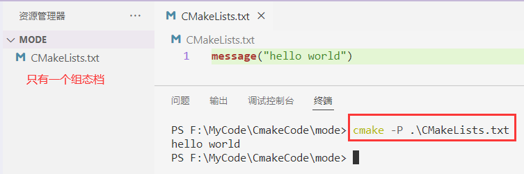

# CMake使用

## 1 hello-cmake

对于简单的项目，只需要一个三行`CMakeLists.txt`文件即可。

### 文件树

```txt
|——CMakeLists.txt
|——main.cpp
```

#### CMakeLists.txt

```cmake
cmake_minimum_required(VERSION  3.23)
```

要求cmake的最小版本，低于指定版本的cmake构建，会报错：

> CMake 4.0 or higher is required.  You are running version 3.23.0

```cmake
porject(hello_cmake)
```

project命令用于指定cmake工程的名称。

```cmake
add_executable(hello_cmake main.cpp)
```

使用指定的源文件来生成目标可执行文件。

#### main.cpp

```cpp
#include <iostream>

int main(int argc, char *argv[])
{
   std::cout << "Hello CMake!" << std::endl;
   return 0;
}
```

### 构建与生成

**构建**出指定构建系统的文件(如.sln、makefile)

```shell
cmake -G "NMake Makefiles" -B build
```

+ -G 指定构建系统生成器()
+ -B 指定生成目录(中间文件、可执行文件等)


**生成**可执行程序

```shell
cmake --build build
```

+ --build  指定要构建的项目二进制目录


## 2 直译和非直译模式

直译模式简单解释就是不生成Makefile的模式。这很方便我们验证一些CMakeLists.txt的语法及验证一些数学运算等。

**直译模式：**

输入 **-P 参数**指定CMakeLists.txt脚本以直译模式解析(不需要C/C++源文件)。其中，message是CMakeLists.txt中用于输出信息的命令。以直译模式解析就不会生成Makefile文件，并且终端输出的信息就是我们CMakeLists.txt指定输出的内容。



**非直译模式(正常模式):**

以非直译模式解析则会生成Makefile文件，并且终端多输出了一些核查编译器相关的信息。

```shell
cmake  .\CMakeLists.txt -G "MinGW Makefiles" -B build
```


## 2  cmake变量

cmake支持变量，内置变量保存了很多信息，当然也可以自定义变量。

一、变量的引用方式是使用`“${}”`，在if中，不需要使用这种方式，直接使用变量名即可

二、自定义变量使用`SET(VAR_NAME xxxx)`，使用时`${VAR_NAME}`

三、cmake的常用变量：

| 变量                     | 解释                                       |
| ------------------------ | ------------------------------------------ |
| CMAKE_SOURCE_DIR         | 根源目录。                                 |
| CMAKE_CURRENT_SOURCE_DIR | 当前所在的源目录（如果使用子项目）。       |
| CMAKE_BINARY_DIR         | 根构建目录（运行 cmake 命令的目录）。      |
| CMAKE_CURRENT_BINARY_DIR | 当前所在的构建目录。                       |
| PROJECT_SOURCE_DIR       | 当前项目的源目录。                         |
| PROJECT_BINARY_DIR       | 当前项目的构建目录。                       |
| CMAKE_INSTALL_PREFIX     | 安装路径。                                 |
|                          |                                            |
| CMAKE_CXX_FLAGS          | C++ Flags。                                |
| CMAKE_C_FLAGS            | C Flags。                                  |
| CMAKE_LINKER_FLAGS       | 链接器 Flags。                             |
| CMAKE_MODULE_PATH        | CMake 查找模块（find_package）的搜索路径。 |
| CMAKE_C_COMPILER         | 用于编译 C 的程序。                        |
| CMAKE_CXX_COMPILER       | 用于编译 C++ 的程序。                      |
| CMAKE_LINKER             | 用于链接的程序。                           |
| CMAKE_CXX_STANDARD       | 指定需要的 C++ 标准（CMake 3.1 后可用）。  |
| PROJECT_NAME             | 当前使用 project() 创建的项目名称。        |
| name_SOURCE_DIR          | 名为“name”的项目的源目录。                 |
| name_BINARY_DIR          | 名为“name”的项目的二进制目录。             |

### 平台相关

| 变量                 | 解释                                                     |
| -------------------- | -------------------------------------------------------- |
| CMAKE_SYSTEM_VERSION | 操作系统版本，如：10.0.19044                             |
| CMAKE_SYSTEM_NAME    | 操作系统名，如：Windows                                  |
| CMAKE_SYSTEM         | 上面两个的结合，如：Windows-10.0.19044                   |
| CMAKE_SIZEOF_VOID_P  | void指针的大小。 x64位8个字节，x32位4个字节              |
| CMAKE_BUILD_TYPE     | 构建类型（Release、Debug、MinSizeRel 或 RelWithDebInfo） |

### 自定义变量

set

unset

## 4.3 message命令

我们在使用 cmake 构建工程的编译系统时，需要查看 CMakeLists.txt 中某些变量的值是否正确，尤其是遇到 CMake Error 时。但是 cmake 无法像编程语言一样进行单步调试。好在 cmake 中有 **message 命令**。cmake 中的 message 命令就像是 C 语言中的 printf 函数，该命令可以将变量的值显示到终端。因此我们可以使用 message 命令查看变量值是否正确。但是，message 命令要比 printf 函数的功能强大，该命令可以**终止**编译系统的构建。而且这通常也是我们想要的效果。

### 语法格式

```cmake
message([<mode>] "message text" ...)
```

**mode** 的值包括 **FATAL_ERROR**、**WARNING**、**AUTHOR_WARNING**、**STATUS**、**VERBOSE**等。我主要使用其中的 2 个——**FATAL_ERROR**、**STATUS**。

**FATAL_ERROR**：产生 CMake Error，**会停止编译系统的构建过程**；

**STATUS**：最常用的命令，常用于查看变量值，类似于编程语言中的 DEBUG 级别信息。

**"message text"**为显示在终端的内容。

### 具体使用

+ 输出基本信息

```cmake
message(STATUS "Hello cmake")
```

构建时会输出如下信息：


+ 输出变量

```cmake
message(STATUS "CMAKE_SOURCE_DIR "  ${CMAKE_SOURCE_DIR})
#也可以把变量写到字符串中，但是会没有提示
message(STATUS "CMAKE_SOURCE_DIR ${CMAKE_SOURCE_DIR}")
```

**output：**

> [cmake] Not searching for unused variables given on the command line.
> [cmake] -- CMAKE_SOURCE_DIR C:/Users/maye/Code/hello_cmake
> [cmake] -- Configuring done
> [cmake] -- Generating done
> [cmake] -- Build files have been written to: C:/Users/maye/Code/hello_cmake/build

## 4.4 条件判断

### 基本语法

```cmake
if(条件)
	命令
elseif(条件)
	命令
else()
	命令
endif()
```

if、endif必须要有，其他的可有可无

### 具体使用

+ 判断构建平台

```cmake
if(CMAKE_SYSTEM_NAME EQUAL "Windows")
    message(STATUS "This is the Windows platform")
elseif(CMAKE_SYSTEM_NAME EQUAL "Linux")
    message(STATUS "This is the Linux platform ")
elseif(CMAKE_SYSTEM_NAME EQUAL "Darwin")
    message(STATUS "This is the Macos platform ")
else()
    message(STATUS "This is the ${CMAKE_SYSTEM_NAME} platform ")
endif()
```

+ 是否定义了变量

```cmake
if(CMAKE_SIZEOF_VOID_P EQUAL 4)
    message(STATUS "CMAKE_SIZEOF_VOID_P 4")
    set(x86 TRUE)
else()
    message(STATUS "CMAKE_SIZEOF_VOID_P  8")
    set(x64 TRUE)
endif()
#判断是否定义了变量
if(CMAKE_SIZEOF_VOID_P EQUAL 4)
    message(STATUS "CMAKE_SIZEOF_VOID_P 4")
    set(x86 TRUE)
else()
    message(STATUS "CMAKE_SIZEOF_VOID_P  8")
    set(x64 TRUE)
endif()
```

## 4.5 定义宏

我们可以再cmake中定义宏，以便再C/C++代码中使用。

+ 添加宏定义

```cmake
add_compile_definitions(<definition> ...)
```

+ 给目标添加宏定义：名称`<target>`必须是由命令创建的，例如 `add_executable()`或者`add_library()`并且不能是 ALIAS 目标。

```cmake
target_compile_definitions(<target>）
```

## 4.5 生成库和使用库


# 附录

## 1 命令

+ CMAKE命令通用理解：

```cmake
command(<target> [E] <A|B|C>)  
```

**尖括号`<>`：** 必选变量，`<target>`;

**方括号`[]`：** 可选变量，`[E]`;

**竖线`|`：** 或的意思，`A|B|C`;