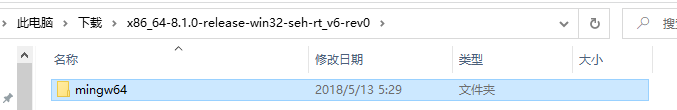
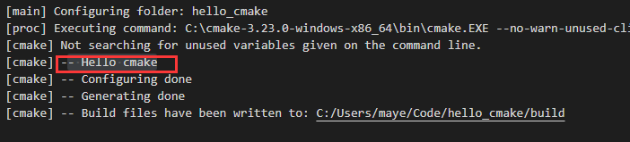

# 1. MinGW

## 1.1 MinGW简介

MinGW 的全称是：Minimalist GNU on Windows 。它实际上是将经典的开源 C语言 编译器 GCC 移植到了 Windows 平台下，并且包含了 Win32API ，因此可以将源代码编译为可在 Windows 中运行的可执行程序。而且还可以使用一些 Windows 不具备的，Linux平台下的开发工具。一句话来概括：MinGW 就是 GCC 的 Windows 版本 。

以上是 MinGW 的介绍，MinGW-w64 与 MinGW 的区别在于 MinGW 只能编译生成32位可执行程序，而 MinGW-w64 则可以编译生成 64位 或 32位 可执行程序。

正因为如此，MinGW 现已被 MinGW-w64 所取代，且 MinGW 也早已停止了更新，内置的 GCC 停滞在了 4.8.1 版本，而 MinGW-w64 内置的 GCC 则更新到了 8.1.0 版本。

## 1.2 下载与安装

### 1.2.1 下载

1） 打开 [MinGW 官网](https://www.mingw-w64.org/downloads)，往下滑动，找到如下图所示位置，点击SourceForge。


2）点击之后进入如下页面


3）往下翻，找到如下图所示位置


**最后面的后缀是不同的异常处理模型**

+ 如果你之前选择了 64位，则这里有两个异常处理模型供你选择，seh 是新发明的，而 sjlj 则是古老的。seh 性能比较好，但不支持 32位。 sjlj 稳定性好，支持 32位。
  **操作**：我这里选择了 seh 。

+ 如果选择了 32位 ，则可以用 dwarf 和 sjlj 两种异常处理模型。同样的，dwarf 的性能要优于 sjlj ，可以它不支持 64位 。
  **操作**：建议选择 dwarf 。

4）点击之后，进入缓慢的下载时间 QAQ！！(我偷偷使用迅雷下载了)


5）下载之后得到了.7z的压缩包，解压出来


6）解压出来的目录中有一个mingw64目录，把它复制到合适的位置



`我放到了C盘根目录`


7）最后把`C:\mingw64\bin`目录配置到环境变量


 配置好后别忘了点击 **确认！确认！确认！**

8）来，验证一下是否配置成功！

打开`cmd`输入`gcc --version`，出现如图所示内容，表示配置成功


## 1.3 基本使用

先来一段代码，命名为main.c。

```c
#include<stdio.h>

int main()
{
    printf("hello world");
    getchar();
    return 0;
}
```

在cmd输入命令：`gcc main.c -o hello`

# 2. VS Code

## 2.1 VS Code简介

Visual Studio Code（简称“VS Code” ）是Microsoft在2015年4月30日Build开发者大会上正式宣布一个运行于 Mac OS X、Windows和Linux 之上的，针对于编写现代Web和云应用的跨平台源代码编辑器， 可在桌面上运行，并且可用于Windows，macOS和Linux。它具有对JavaScript，TypeScript和Node.js的内置支持，并具有丰富的其他语言（例如C++，C＃，Java，Python，PHP，Go）和运行时（例如.NET和Unity）扩展的生态系统。

## 2.2 下载与安装

1） 打开 [Visual Studio Code 官网](https://code.visualstudio.com/)，点击Download for Windows按钮下载。(如果需要Linux版本，或者Mac版本可以点击后面的下拉箭头选择)


2）下载之后得到VSCodeUserSetup-x64-1.66.1.exe，鼠标左键双击安装


3）同意协议，点击下一步


4）选择VS Code安装位置，点击下一步


5）一直下一步，直到选择附加任务，把其他里面的 创建上下文菜单选上，即在桌面右键时，会在右键菜单中显示用vs code打开。


6）然后下一步等待安装完成


7）几秒之后安装即可完成！！


## 2.3 界面介绍

VS Code安装完毕之后，打开界面如下图


## 2.4 安装插件

### 2.4.1 汉化插件

1）进入插件商店：搜索chinese > 选择简体中文 >在右边窗口中点击`install`


2）安装完成，右下角会弹出一个提示框，点击`Restart`重启VS Code即可汉化成功！


3）看成果~~


### 2.4.2 C/C++插件


### 2.4.3 CMake插件


## 2.5 C/C++开发

Vs Code是基于文件夹管理项目的，所以每个C/C++项目都需要一个单独的目录。

1）在合适的位置创建一个文件夹，如hello(我在Code目录是专门用来存放项目的)


2）进入hello目录，右键`通过Code打开`


3）打开的时候会提示`是否信任此文件夹中的文件的作者`，点击信任即可~~


4）创建源文件`main.c`,并写入输出`hello word`的代码


5）Ctrl+F5运行，或者点击菜单栏->运行->以非调试模式运行，然后会弹出窗口，需要选择一下

+ F5可以进入调试模式

+ 选择C++（GDB/LLDB）


+ 选择C/C++:gcc.exe


+ 在最下面会显示执行结果：hello world


<font style="color:red">注意：调试的时候，需要先选中源文件，不要点击别的文件，否则会出现错误</font>

## 2.6 CMake + VSCode C/C++开发

C/C++插件、CMake插件安装好之后，就可以使用VsCode结合CMake进行C/C++开发了

1）先创建一个文件夹，然后用Vs Code打开


2）按快捷键`Ctrl+Shift+P`，或者点击菜单栏->帮助->显示所有命令，输入cmake

+ 选择列表中的`CMake:快速入门`


+ 紧接着选择一个编译器套件，这里就只有一个，有多个可以看着来


+ 再给你的项目取个名字，一般和你的项目文件夹名一样即可，选好了之后按回车


+ 接下来选择你需要生成的目标(Libary 库   Executable 可执行程序)
  + 咱们当然要可执行程序啦


+ 选择之后，稍等一下，即可自动配置完成！！


3）按Shitf+F5就可以编译，并运行程序啦！

+ 按Ctrl+F5可以进入调试模式哦


# 3. CMake

## 3.1 CMake简介

CMake是一个跨平台的安装（[编译](https://baike.baidu.com/item/编译/1258343)）工具，可以用简单的语句来描述所有平台的安装(编译过程)。

## 3.2 下载与安装

1） 打开 [CMake 官网](https://cmake.org/)，点击Download 。


2）往下翻，找到如下图所示位置，这里选择64位压缩包版


3）下载下来得到`cmake-3.23.0-windows-x86_64.zip`压缩包，解压出来


4）拷贝到合适的位置


5）把bin目录`C:\cmake-3.23.0-windows-x86_64\bin`配置到path环境变量


5）打开cmd，输入cmake --version测试是否配置成功！


如上图所示，ok，配置成功！！

[VS Code CMake 插件安装](#2.4.3 CMake插件)

## 3.3 基本使用

还是用前面创建的`main.c`文件，先在同级目录中创建`CMakeLists.txt`并写入如下cmake指令。

```cmake
cmake_minimum_required(VERSION 3.2)

project(hello)

add_executable(hello main.c)
```

+ 内部构建

打开控制台，输入`cmake -G "MinGw Makefiles"`会生成如下文件：


+ 外部构建

```cmake
cmake -G "MinGW Makefiles" -B build
```

最后，输入命令`mingw32-make`生成可执行文件。


# 4. CMake使用

## 4.1 hello-cmake

 先来一个最简单的CMake项目。

### 文件树

```txt
|——CMakeLists.txt
|——main.cpp
```

#### main.cpp

```cpp
#include <iostream>

int main(int argc, char *argv[])
{
   std::cout << "Hello CMake!" << std::endl;
   return 0;
}
```

#### CMakeLists.txt

```cmake
cmake_minimum_required(VERSION  3.23)
porject(hello_cmake)
add_executable(hello_cmake main.cpp)
```

### 命令解析

+ CMAKE命令通用理解：

```cmake
command(<target> [E] <A|B|C>)  
```

**尖括号`<>`：** 必选变量，`<target>`;

**方括号`[]`：** 可选变量，`[E]`;

**竖线`|`：** 或的意思，`A|B|C`;


```cmake
cmake_minimum_required(VERSION  4.0)
```

要求cmake的最小版本，低于指定版本的cmake构建，会报错：

> CMake 4.0 or higher is required.  You are running version 3.23.0

```cmake
porject(hello_cmake)
```

project命令用于指定cmake工程的名称。

```cmake
add_executable(hello_cmake main.cpp)
```

使用指定的源文件来生成目标可执行文件。

## 4.2  cmake变量

cmake支持变量，内置变量保存了很多信息，当然也可以自定义变量。

一、变量的引用方式是使用`“${}”`，在if中，不需要使用这种方式，直接使用变量名即可

二、自定义变量使用`SET(VAR_NAME xxxx)`，使用时`${VAR_NAME}`

三、cmake的常用变量：

| 变量                     | 解释                                       |
| ------------------------ | ------------------------------------------ |
| CMAKE_SOURCE_DIR         | 根源目录。                                 |
| CMAKE_CURRENT_SOURCE_DIR | 当前所在的源目录（如果使用子项目）。       |
| CMAKE_BINARY_DIR         | 根构建目录（运行 cmake 命令的目录）。      |
| CMAKE_CURRENT_BINARY_DIR | 当前所在的构建目录。                       |
| PROJECT_SOURCE_DIR       | 当前项目的源目录。                         |
| PROJECT_BINARY_DIR       | 当前项目的构建目录。                       |
| CMAKE_INSTALL_PREFIX     | 安装路径。                                 |
|                          |                                            |
| CMAKE_CXX_FLAGS          | C++ Flags。                                |
| CMAKE_C_FLAGS            | C Flags。                                  |
| CMAKE_LINKER_FLAGS       | 链接器 Flags。                             |
| CMAKE_MODULE_PATH        | CMake 查找模块（find_package）的搜索路径。 |
| CMAKE_C_COMPILER         | 用于编译 C 的程序。                        |
| CMAKE_CXX_COMPILER       | 用于编译 C++ 的程序。                      |
| CMAKE_LINKER             | 用于链接的程序。                           |
| CMAKE_CXX_STANDARD       | 指定需要的 C++ 标准（CMake 3.1 后可用）。  |
| PROJECT_NAME             | 当前使用 project() 创建的项目名称。        |
| name_SOURCE_DIR          | 名为“name”的项目的源目录。                 |
| name_BINARY_DIR          | 名为“name”的项目的二进制目录。             |

### 平台相关

| 变量                 | 解释                                                     |
| -------------------- | -------------------------------------------------------- |
| CMAKE_SYSTEM_VERSION | 操作系统版本，如：10.0.19044                             |
| CMAKE_SYSTEM_NAME    | 操作系统名，如：Windows                                  |
| CMAKE_SYSTEM         | 上面两个的结合，如：Windows-10.0.19044                   |
| CMAKE_SIZEOF_VOID_P  | void指针的大小。 x64位8个字节，x32位4个字节              |
| CMAKE_BUILD_TYPE     | 构建类型（Release、Debug、MinSizeRel 或 RelWithDebInfo） |

### 自定义变量

set

unset

## 4.3 message命令

我们在使用 cmake 构建工程的编译系统时，需要查看 CMakeLists.txt 中某些变量的值是否正确，尤其是遇到 CMake Error 时。但是 cmake 无法像编程语言一样进行单步调试。好在 cmake 中有 **message 命令**。cmake 中的 message 命令就像是 C 语言中的 printf 函数，该命令可以将变量的值显示到终端。因此我们可以使用 message 命令查看变量值是否正确。但是，message 命令要比 printf 函数的功能强大，该命令可以**终止**编译系统的构建。而且这通常也是我们想要的效果。

### 语法格式

```cmake
message([<mode>] "message text" ...)
```

**mode** 的值包括 **FATAL_ERROR**、**WARNING**、**AUTHOR_WARNING**、**STATUS**、**VERBOSE**等。我主要使用其中的 2 个——**FATAL_ERROR**、**STATUS**。

**FATAL_ERROR**：产生 CMake Error，**会停止编译系统的构建过程**；

**STATUS**：最常用的命令，常用于查看变量值，类似于编程语言中的 DEBUG 级别信息。

**"message text"**为显示在终端的内容。

### 具体使用

+ 输出基本信息

```cmake
message(STATUS "Hello cmake")
```

构建时会输出如下信息：



+ 输出变量

```cmake
message(STATUS "CMAKE_SOURCE_DIR "  ${CMAKE_SOURCE_DIR})
#也可以把变量写到字符串中，但是会没有提示
message(STATUS "CMAKE_SOURCE_DIR ${CMAKE_SOURCE_DIR}")
```

**output：**

> [cmake] Not searching for unused variables given on the command line.
> [cmake] -- CMAKE_SOURCE_DIR C:/Users/maye/Code/hello_cmake
> [cmake] -- Configuring done
> [cmake] -- Generating done
> [cmake] -- Build files have been written to: C:/Users/maye/Code/hello_cmake/build

## 4.4 条件判断

### 基本语法

```cmake
if(条件)
	命令
elseif(条件)
	命令
else()
	命令
endif()
```

if、endif必须要有，其他的可有可无

### 具体使用

+ 判断构建平台

```cmake
if(CMAKE_SYSTEM_NAME EQUAL "Windows")
    message(STATUS "This is the Windows platform")
elseif(CMAKE_SYSTEM_NAME EQUAL "Linux")
    message(STATUS "This is the Linux platform ")
elseif(CMAKE_SYSTEM_NAME EQUAL "Darwin")
    message(STATUS "This is the Macos platform ")
else()
    message(STATUS "This is the ${CMAKE_SYSTEM_NAME} platform ")
endif()
```

+ 是否定义了变量

```cmake
if(CMAKE_SIZEOF_VOID_P EQUAL 4)
    message(STATUS "CMAKE_SIZEOF_VOID_P 4")
    set(x86 TRUE)
else()
    message(STATUS "CMAKE_SIZEOF_VOID_P  8")
    set(x64 TRUE)
endif()
#判断是否定义了变量
if(CMAKE_SIZEOF_VOID_P EQUAL 4)
    message(STATUS "CMAKE_SIZEOF_VOID_P 4")
    set(x86 TRUE)
else()
    message(STATUS "CMAKE_SIZEOF_VOID_P  8")
    set(x64 TRUE)
endif()
```

## 4.5 定义宏

我们可以再cmake中定义宏，以便再C/C++代码中使用。

+ 添加宏定义

```cmake
add_compile_definitions(<definition> ...)
```

+ 给目标添加宏定义：名称`<target>`必须是由命令创建的，例如 `add_executable()`或者`add_library()`并且不能是 ALIAS 目标。

```cmake
target_compile_definitions(<target>）
```

## 4.5 生成库和使用库

