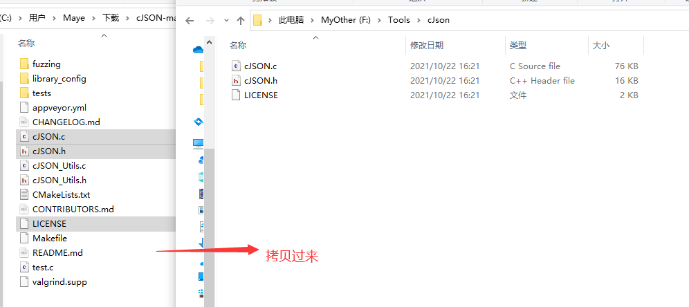
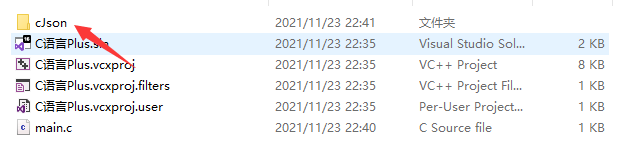
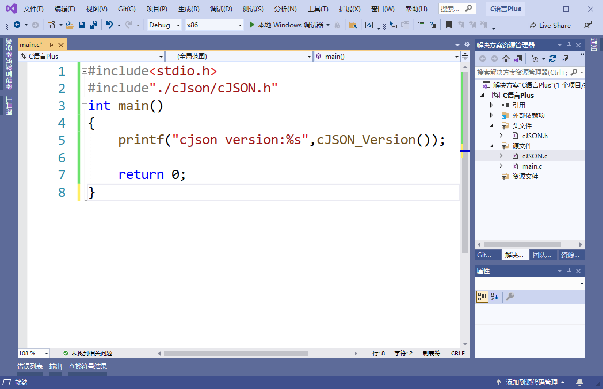

# JSON介绍

JSON(JavaScript Object Notation,JS对象表示法) 是一种轻量级的数据交换格式。它基于 ECMAScript (欧洲计算机协会制定的js规范)的一个子集，采用完全独立于编程语言的文本格式来存储和表示数据。简洁和清晰的层次结构使得 JSON 成为理想的数据交换语言。 易于人阅读和编写，同时也易于机器解析和生成，并有效地提升网络传输效率。

JSON 数据格式与语言无关，脱胎自JavaScript，但当前很多编程语言都支持 JSON 格式数据的生成和解析。JSON 的官方 MIME 类型是 `application/json`，文件扩展名是 `.json`。

[json官方介绍](https://www.json.org/json-zh.html)

## 格式

JSON是一个标记符的序列。这套标记符包含六个**构造字符**、**字符串**、**数字**和三个**字面名**。

+ 1，六个构造字符
  + 开始和结束数组：[  ]
  + 开始和结束对象：{  }
  + 名称分隔：:	 (冒号)
  + 值分隔：,		(逗号)

+ 2，字符串用双引号包含
+ 3，数字直接表示，不用引号包含
+ 4，三个字面量
  + true
  + flase
  + null

JSON是一个序列化的**对象**或**数组**。

+ **对象**由花括号括起来的逗号分割的成员构成，成员是字符串键和值(**值**可以是**对象**、**数组**、**数字**、**字符串**或者三个**字面值**(false、null、true)中的一个)组成

  ```json
  {"name":"maye","age":18,"address":{"country":"china","city":"changsha"}}
  ```

+ **数组**是由方括号括起来的一组值构成

  ```json
  {"city":["长沙","南京","北京"]}
  ```

# cJson下载、配置

cJSON是C语言中的一个JSON编解码器，非常轻量级，代码只有千把行，代码的可读性也很好，很适合作为C语言项目进行学习。

[cJSON github地址](https://github.com/DaveGamble/cJSON)


乍看项目文件还挺多，其实核心代码都在上图红框中的两个文件中。

## 配置cJson

**1，下载项目**

咱们先直接把整个项目download下来，然后把cJSON.h和cJSON.c以及版权文件LICENSE 拷贝到cJson目录中。



**2，把头文件和源文件添加到项目**

用vs创建项目，并把cJson目录复制一份到项目目录下。



然后右击项目->添加->添加现有项，把cJSON.c和cJSON.h两个文件添加到项目中。并包含cJSON.h，写入如下代码，查看是否配置成功。



若运行代码，看到以下结果，则表示环境配置成功~来，给生活比个耶！

```css
output: cjson version:1.7.15
```

# cJson使用


# Cjson类型和函数

| 函数                                                   | 描述                        |
| ------------------------------------------------------ | --------------------------- |
| <font color='green'>const char* cJSON_Version()</font> | 以字符串形式返回cJSON的版本 |

