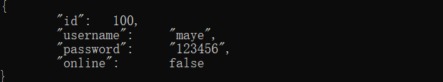
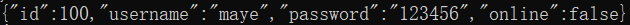
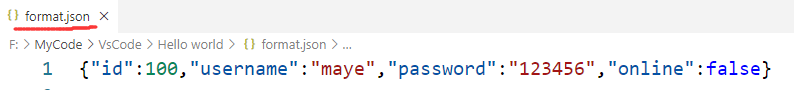

# JSON介绍

JSON(JavaScript Object Notation,JS对象表示法) 是一种轻量级的数据交换格式。它基于 ECMAScript (欧洲计算机协会制定的js规范)的一个子集，采用完全独立于编程语言的文本格式来存储和表示数据。简洁和清晰的层次结构使得 JSON 成为理想的数据交换语言。 易于人阅读和编写，同时也易于机器解析和生成，并有效地提升网络传输效率。

JSON 数据格式与语言无关，脱胎自JavaScript，但当前很多编程语言都支持 JSON 格式数据的生成和解析。JSON 的官方 MIME 类型是 `application/json`，文件扩展名是 `.json`。

[json官方介绍](https://www.json.org/json-zh.html)

## 格式

JSON是一个标记符的序列。这套标记符包含六个**构造字符**、**字符串**、**数字**和三个**字面名**。

+ 1，六个构造字符
  + 开始和结束数组：[  ]
  + 开始和结束对象：{  }
  + 名称分隔：:	 (冒号)
  + 值分隔：,		(逗号)

+ 2，字符串用双引号包含
+ 3，数字直接表示，不用引号包含
+ 4，三个字面量
  + true
  + flase
  + null

JSON是一个序列化的**对象**或**数组**。

+ **对象**由花括号括起来的逗号分割的成员构成，成员是字符串键和值(**值**可以是**对象**、**数组**、**数字**、**字符串**或者三个**字面值**(false、null、true)中的一个)组成

  ```json
  {"name":"maye","age":18,"address":{"country":"china","city":"changsha"}}
  ```

+ **数组**是由方括号括起来的一组值构成

  ```json
  {"city":["长沙","南京","北京"]}
  ```

[json在线解析和格式化](https://www.json.cn/)

# cJson下载、配置

cJSON是C语言中的一个JSON编解码器，非常轻量级，代码只有千把行，代码的可读性也很好，很适合作为C语言项目进行学习。

[cJSON github地址](https://github.com/DaveGamble/cJSON)


乍看项目文件还挺多，其实核心代码都在上图红框中的两个文件中。

## 配置cJson

**1，下载项目**

咱们先直接把整个项目download下来，然后把cJSON.h和cJSON.c以及版权文件LICENSE 拷贝到cJson目录中。


**2，把头文件和源文件添加到项目**

用vs创建项目，并把cJson目录复制一份到项目目录下。


然后右击项目->添加->添加现有项，把cJSON.c和cJSON.h两个文件添加到项目中。并包含cJSON.h，写入如下代码，查看是否配置成功。


若运行代码，看到以下结果，则表示环境配置成功~来，给生活比个耶！

```css
output: cjson version:1.7.15
```

# cJson使用

有如下json数据，我们学习如何解析它：

```json
{
    "id":100,
    "username":"maye",
    "password":"123456",
    "online":false
}
```

## 从文件读取json数据

首先我们从文件中获取json数据：

```cpp
const char* jsonFromFile(const char* filename)
{
	FILE* fp = fopen(filename, "r");
	if (!fp)
	{
		return NULL;
	}
	fseek(fp, 0, SEEK_END);
	long len = ftell(fp);
	fseek(fp, 0, SEEK_SET);

	char* buf = calloc(len+1, sizeof(char));
	fread(buf, sizeof(char), len, fp);

	fclose(fp);
	return buf;
}
int main()
{
    const char* jsondata = jsonFromFile("test.json");
	printf("%s\n", jsondata);
    cJSON* root = cJSON_Parse(jsondata);	//解析json数据
	free(jsondata);							//释放内存
    //TODO
    cJSON_free(root);
    return 0;
}
```


## 获取cJSON文本

在解析或者生成json数据之后，如果需要从cJSON实体中获得文本，可以使用以下四种方式。

#### cJSON_Print

函数原型：`char * cJSON_Print(const cJSON *item);`

该函数将一个cJSON实体渲染为字符串(有格式)，**注意：返回的字符串需要手动释放内存**

```cpp
char* cjson = cJSON_Print(root);
printf("%s\n", cjson);
cJSON_free(cjson);	//释放
```



#### cJSON_PrintUnformatted

函数原型：`char * cJSON_PrintUnformatted(const cJSON *item);`

该函数将一个cJSON实体渲染为字符串(无格式，所占内存更小，便于传输)，**注意：返回的字符串需要手动释放内存**

```cpp
cjson = cJSON_PrintUnformatted(root);
printf("%s\n", cjson);
cJSON_free(cjson);  //释放
```



#### cJSON_PrintBuffered

函数原型：`char * cJSON_PrintBuffered(const cJSON *item, int prebuffer, cJSON_bool fmt)`

使用缓冲策略将一个cJSON实体呈现为文本。 Prebuffer是对最终大小的猜测。 “猜得好”减少了再分配，提升了效率。 Fmt  指定是否格式化json数据。**注意：返回的字符串需要手动释放内存**

```cpp
cjson = cJSON_PrintBuffered(root, strlen(jsondata) + 5, cJSON_True);
printf("%s\n", cjson);
cJSON_free(cjson);  //释放
```


#### cJSON_PrintPreallocated

使用已经在内存中分配的具有给定长度的缓冲区将一个cJSON实体渲染为文本。 成功时返回1，失败时返回0。  **注意：返回值为是否渲染成功，使用缓冲区之前先进行判断**

```cpp
char buf[1024] = { 0 };		//预先准备缓冲区
cJSON_bool ret = cJSON_PrintPreallocated(root, buf, sizeof(buf), cJSON_True);
if (ret)
{
	printf("%s\n", buf);
}
//这里就不需要释放了
```

## json数据写入文件

获得json文本之后，我们就可把它保存起来了，同样使用文件操纵，非常滴简单！

```cpp
//把json数据写入文件，返回写入成功的字节数
int jsonSaveFile(const char* filename,const char* cjson)
{
	FILE* fp = fopen(filename, "w");
	if (!fp)
	{
		return NULL;
	}
	size_t len = fwrite(cjson, sizeof(char), strlen(cjson), fp);
	fclose(fp);
	return len;
}
int main()
{
	const char* jsondata = jsonFromFile("test.json");
	cJSON* root = cJSON_Parse(jsondata);	//解析json数据
	free(jsondata);							//释放内存

	//将一个cJSON实体渲染为字符串(无格式，所占内存更小，便于传输)，注意：同上
	cjson = cJSON_PrintUnformatted(root);
	printf("%s\n", cjson);
	jsonSaveFile("format.json", cjson);
	cJSON_free(cjson);

	cJSON_free(root);
	
	return 0;
}
```

结果：


# Cjson类型和函数

| 函数                                                   | 描述                        |
| ------------------------------------------------------ | --------------------------- |
| <font color='green'>const char* cJSON_Version()</font> | 以字符串形式返回cJSON的版本 |

