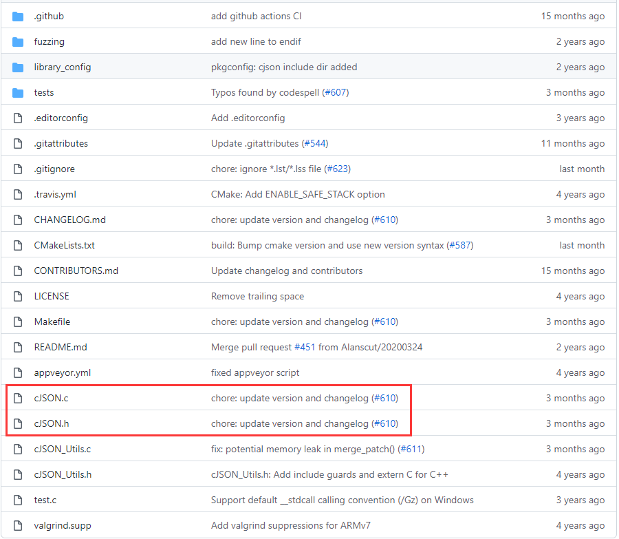

# JSON介绍

JSON(JavaScript Object Notation,JS对象表示法) 是一种轻量级的数据交换格式。它基于 ECMAScript (欧洲计算机协会制定的js规范)的一个子集，采用完全独立于编程语言的文本格式来存储和表示数据。简洁和清晰的层次结构使得 JSON 成为理想的数据交换语言。 易于人阅读和编写，同时也易于机器解析和生成，并有效地提升网络传输效率。

JSON 数据格式与语言无关，脱胎自JavaScript，但当前很多编程语言都支持 JSON 格式数据的生成和解析。JSON 的官方 MIME 类型是 `application/json`，文件扩展名是 `.json`。

[json官方介绍](https://www.json.org/json-zh.html)

## 格式

JSON是一个标记符的序列。这套标记符包含六个**构造字符**、**字符串**、**数字**和三个**字面名**。

+ 1，六个构造字符
  + 开始和结束数组：[  ]
  + 开始和结束对象：{  }
  + 名称分隔：:	 (冒号)
  + 值分隔：,		(逗号)

+ 2，字符串用双引号包含
+ 3，数字直接表示，不用引号包含
+ 4，三个字面量
  + true
  + flase
  + null

JSON是一个序列化的**对象**或**数组**。

+ **对象**由花括号括起来的逗号分割的成员构成，成员是字符串键和值(**值**可以是**对象**、**数组**、**数字**、**字符串**或者三个**字面值**(false、null、true)中的一个)组成

  ```json
  {"name":"maye","age":18,"address":{"country":"china","city":"changsha"}}
  ```

+ **数组**是由方括号括起来的一组值构成

  ```json
  {"city":["长沙","南京","北京"]}
  ```

[json在线解析和格式化](https://www.json.cn/)

# cJson下载、配置

cJSON是C语言中的一个JSON编解码器，非常轻量级，代码只有千把行，代码的可读性也很好，很适合作为C语言项目进行学习。

[cJSON github地址](https://github.com/DaveGamble/cJSON)



乍看项目文件还挺多，其实核心代码都在上图红框中的两个文件中。

## 配置cJson

**1，下载项目**

咱们先直接把整个项目download下来，然后把cJSON.h和cJSON.c以及版权文件LICENSE 拷贝到cJson目录中。


**2，把头文件和源文件添加到项目**

用vs创建项目，并把cJson目录复制一份到项目目录下。


然后右击项目->添加->添加现有项，把cJSON.c和cJSON.h两个文件添加到项目中。并包含cJSON.h，写入如下代码，查看是否配置成功。


若运行代码，看到以下结果，则表示环境配置成功~来，给生活比个耶！

```css
output: cjson version:1.7.15
```

# cJson使用

有如下json数据，我们学习如何解析它：

```json
{
    "id":100,
    "username":"maye",
    "password":"123456",
    "online":false
}
```

## 从文件读取json数据

首先我们从文件中获取json数据：

```cpp
const char* jsonFromFile(const char* filename)
{
	FILE* fp = fopen(filename, "r");
	if (!fp)
	{
		return NULL;
	}
	fseek(fp, 0, SEEK_END);
	long len = ftell(fp);
	fseek(fp, 0, SEEK_SET);

	char* buf = calloc(len+1, sizeof(char));
	fread(buf, sizeof(char), len, fp);

	fclose(fp);
	return buf;
}
int main()
{
    const char* jsondata = jsonFromFile("test.json");
	printf("%s\n", jsondata);
    cJSON* root = cJSON_Parse(jsondata);	//解析json数据
	free(jsondata);							//释放内存
    //TODO
    cJSON_free(root);
    return 0;
}
```


## 获取cJSON文本

在解析或者生成json数据之后，如果需要从cJSON实体中获得文本，可以使用以下四种方式。

#### cJSON_Print

函数原型：`char * cJSON_Print(const cJSON *item);`

该函数将一个cJSON实体渲染为字符串(有格式)，**注意：返回的字符串需要手动释放内存**

```cpp
char* cjson = cJSON_Print(root);
printf("%s\n", cjson);
cJSON_free(cjson);	//释放
```


#### cJSON_PrintUnformatted

函数原型：`char * cJSON_PrintUnformatted(const cJSON *item);`

该函数将一个cJSON实体渲染为字符串(无格式，所占内存更小，便于传输)，**注意：返回的字符串需要手动释放内存**

```cpp
cjson = cJSON_PrintUnformatted(root);
printf("%s\n", cjson);
cJSON_free(cjson);  //释放
```


#### cJSON_PrintBuffered

函数原型：`char * cJSON_PrintBuffered(const cJSON *item, int prebuffer, cJSON_bool fmt)`

使用缓冲策略将一个cJSON实体呈现为文本。 Prebuffer是对最终大小的猜测。 “猜得好”减少了再分配，提升了效率。 Fmt  指定是否格式化json数据。**注意：返回的字符串需要手动释放内存**

```cpp
cjson = cJSON_PrintBuffered(root, strlen(jsondata) + 5, cJSON_True);
printf("%s\n", cjson);
cJSON_free(cjson);  //释放
```


#### cJSON_PrintPreallocated

使用已经在内存中分配的具有给定长度的缓冲区将一个cJSON实体渲染为文本。 成功时返回1，失败时返回0。  **注意：返回值为是否渲染成功，使用缓冲区之前先进行判断**

```cpp
char buf[1024] = { 0 };		//预先准备缓冲区
cJSON_bool ret = cJSON_PrintPreallocated(root, buf, sizeof(buf), cJSON_True);
if (ret)
{
	printf("%s\n", buf);
}
//这里就不需要释放了
```

## json数据写入文件

获得json文本之后，我们就可把它保存起来了，同样使用文件操纵，非常滴简单！

```cpp
//把json数据写入文件，返回写入成功的字节数
int jsonSaveFile(const char* filename,const char* cjson)
{
	FILE* fp = fopen(filename, "w");
	if (!fp)
	{
		return NULL;
	}
	size_t len = fwrite(cjson, sizeof(char), strlen(cjson), fp);
	fclose(fp);
	return len;
}
int main()
{
	const char* jsondata = jsonFromFile("test.json");
	cJSON* root = cJSON_Parse(jsondata);	//解析json数据
	free(jsondata);							//释放内存

	//将一个cJSON实体渲染为字符串(无格式，所占内存更小，便于传输)，注意：同上
	cjson = cJSON_PrintUnformatted(root);
	printf("%s\n", cjson);
	jsonSaveFile("format.json", cjson);
	cJSON_free(cjson);

	cJSON_free(root);
	
	return 0;
}
```

结果：


# cJson数据解析

### 1, cJson核心结构体

 cJSON的核心结构体就是一个cJSON，理解了这个结构体，基本上对cJSON的使用就有了个基本概念了。该结构体具体定义如下：

```c
typedef struct cJSON
{
    struct cJSON *next;		//双向链表的前后向指针
    struct cJSON *prev;
    
    struct cJSON *child;	//指向数组或对象的子链

    int type;				//元素类型

    char *valuestring;		//如果元素是字符串类型，则直接代表值

    int valueint;			//已经弃用

    double valuedouble;		//数值(包含小数和整数)

    char *string;			//key的名称
} cJSON;
```

#### 说明：

1、cJSON是使用链表来存储数据的，其访问方式很像一颗树。每一个节点可以有兄弟节点，通过next/prev指针来查找，它类似双向链表；每个节点也可以有孩子节点，通过child指针来访问，进入下一层。只有节点是对象或数组时才可以有孩子节点。

2、type是键（key）的类型，一共有7种取值，分别是：False，Ture，NULL，Number，String，Array，Object。

​	 若是Number类型，则valuedouble中存储着值。访问valuedouble，可以得到值。

​	 若是String类型的，则valuestring中存储着值，可以访问valuestring得到值。

3、string中存放的是这个节点的名字，可理解为key的名称。

### 2，解析key/value

首先是一个简单的键值对字符串，要解析的目标如下：

```json
{
    "name":"maye"
}
```

要进行解析，也就是要分别获取到键与值的内容。我们很容易就能看出键为name，值为maye，可是，使用cJSON怎么解析呢？ 

对于这个简单的例子，只需要调用cJSON的三个接口函数就可以实现解析了，这四个函数的原型如下：

```c
cJSON * cJSON_Parse(const char *value);
cJSON * cJSON_GetObjectItem(const cJSON * const object, const char * const string);
char * cJSON_GetStringValue(const cJSON * const item);
void cJSON_Delete(cJSON *item)
```

**面按解析过程来描述一次：**

1. 首先调用cJSON_Parse()函数，解析JSON数据包，并按照cJSON结构体的结构序列化整个数据包。使用该函数会通过malloc()函数在内存中开辟一个空间，使用完成需要手动释放。
   + json_string表示json数据，可以从文件中读取，也可以直接用数组存储。

```c 
cJSON* root=cJSON_Parse(json_string); 
```


2. 调用cJSON_GetObjectItem()函数，可从cJSON结构体中查找某个子节点名称（键名称），如果查找成功可把该子节点序列化到cJSON结构体中。

```c
cJSON* item=cJSON_GetObjectItem(root,"name"); 
```


3. 如果需要使用cJSON结构体中的内容，可通过cJSON结构体中的valuedouble和valuestring取出有价值的内容（即键的值）。
   + 本例子中，我们直接访问 item->valuestring 就获取到 "maye" 的内容了。
   + 同时cJson给我们提供了函数用来获取字符串和数值(`cJSON_GetStringValue `,`cJSON_GetNumberValue`)

```c
	cJSON* item = cJSON_GetObjectItem(root, "name");
	if (item)
	{
		puts(cJSON_GetStringValue(item));
        //或
        item->valuestring;
	}
```


（4）       通过cJSON_Delete()，释放cJSON_Parse()分配出来的内存空间。

```c 
cJSON_Delete(root);
```

这样就完成了一次cJSON接口调用，实现了解析工作。使用起来其实也很简单的啊。

### 3，解析对象

接下来，我们来个复杂一点的，解析一个对象，要解析的目标如下：

```cpp
{
    "student":
    {
        "name":"maye",
        "age":18,
        "email":"zcmaye@gmail.com",
        "isMarried":false               
    }
}
```

看起来比一个键值对复杂多了，我们又需要学习新的接口函数了吗？为了更严谨，我们对key的类型进行判断即可，其他的一样。

```c
void parserObject(const char* json)
{
	//1，将json数据解析成为cjson对象
	cJSON*root = cJSON_Parse(json);
	//2，调用cJSON_GetObjectItem()函数，获取到对象student
	cJSON* objItem = cJSON_GetObjectItem(root,"student");
	if (cJSON_IsObject(objItem))	//如果查找到的确实是个对象，不是其他(比如字符串，值...)
	{
		//对我们刚取出来的对象student，多次调用cJSON_GetObjectItem()函数，来获取对象的成员。此时要注意，不同的成员，访问的方法不一样：
		cJSON* item = NULL;
		item = cJSON_GetObjectItem(objItem, "name");
		printf("name:%s\n", cJSON_GetStringValue(item));

		item = cJSON_GetObjectItem(objItem, "age");
		printf("age:%d\n",(int)cJSON_GetNumberValue(item));

		item = cJSON_GetObjectItem(objItem, "email");
		printf("name:%s\n", item->valuestring/*cJSON_GetStringValue(item)*/);

		item = cJSON_GetObjectItem(objItem, "isMarried");
		//下面if中两种方法都可判断bool类型的值
		if (cJSON_IsTrue(item) || item->type == cJSON_True)
		{
			printf("isMarried:%s\n","true");
		}
		else
		{
			printf("isMarried:%s\n", "false");
		}	
	}
    cJSON_Delete(root);
}
```


### 4，解析数组

最后，我们来个更复杂一些的，来解析一个数组，数组的成员是对象！要解析的JSON串如下：

```c
{
	"students":
	[
		{
			"name":"maye",
			"age" : 18,
			"email" : "zcmaye@gmail.com",
			"isMarried" : false
		},
		{
			"name":"顽石",
			"age" : 20,
			"email" : "xxxx@gmail.com",
			"isMarried" : false
		},
		{
			"name":"jack",
			"age" : 26,
			"email" : "jack@qq.com",
			"isMarried" : true
		}
	]
}
```

 此时，我们又需要学习新的接口了，一个是获取数组长度，一个是取数组成员，函数原型如下：

```c
int    cJSON_GetArraySize(cJSON *array);
cJSON*cJSON_GetArrayItem(cJSON *array,int item); 
```


```c
//解析student对象
void parserStudent(cJSON* item)
{
	if (!cJSON_IsObject(item))
		return;
	cJSON* subitem = NULL;
	subitem = cJSON_GetObjectItem(item, "name");
	printf("name:%s\n", cJSON_GetStringValue(subitem));

	subitem = cJSON_GetObjectItem(item, "age");
	printf("age:%d\n", (int)cJSON_GetNumberValue(subitem));

	subitem = cJSON_GetObjectItem(item, "email");
	printf("name:%s\n", subitem->valuestring/*cJSON_GetStringValue(subitem)*/);

	subitem = cJSON_GetObjectItem(item, "isMarried");
	//下面if中两种方法都可判断bool类型的值
	if (cJSON_IsTrue(subitem) || subitem->type == cJSON_True)
	{
		printf("isMarried:%s\n", "true");
	}
	else
	{
		printf("isMarried:%s\n", "false");
	}
}
//解析数组
void parserArray(const char* json)
{
	cJSON* root = cJSON_Parse(json);
	cJSON* arrayitem = cJSON_GetObjectItem(root, "students");
	if (cJSON_IsArray(arrayitem))
	{
		//获取数组大小
		int len = cJSON_GetArraySize(arrayitem);
		//遍历数组的每个元素
		for (int i = 0; i < len; i++)
		{
			cJSON* item = cJSON_GetArrayItem(arrayitem, i);
			//解析数组的每个元素
			printf("\n%d student obj\n",i);
			parserStudent(item);
		}
	}
	cJSON_Delete(root);
}
```


# cJson数据生成

### 1，生成数据流程

如果要生成如下的Json串：

```c
{
	"name":"maye",
	 "age" : 18,
	 "email" : "zcmaye@gmail.com",
	 "isMarried" : false,
     "family":["爸爸","妈妈","爷爷","奶奶"]
},
```

+ 首先调用cJSON_ CreateObject ()函数，创建一个JSON对象，之后便可向这个对象中添加string或int等内容的数据项了。使用该函数会通过malloc()函数在内存中开辟一个空间，使用完成需要手动释放。

```c
//创建一个cjson对象
cJSON* root = cJSON_CreateObject();
```

+ 添加数据

  + 调用cJSON_CreateString ()函数，由一个字符串生成一个cJSON的数据项，并将生成的数据项与其键值（"name"）一起添加到root对象中。

  ```c
  cJSON* item = cJSON_CreateString("Maye");
  cJSON_AddItemToObject(root,"name",item);
  ```

  

  + 调用cJSON_AddStringToObject()函数，直接把键值对添加到root对象中。

  ```c
  cJSON_AddStringToObject(root, "name", "maye");
  ```


+ 其实到这一步，我们在内存中的cJSON对象就已经构建完成了，后面是展示结果了。

  + 将cJSON对象的内容解析为字符串，并展示出来。

  ```c
  char * json =cJSON_Print(root);
  puts(json);
  ```

  + 通过cJSON_Delete()，释放cJSON_CreateObject ()分配出来的内存空间。

  ```c
  cJSON_Delete(root);
  ```

  +  释放cJSON_Print ()分配出来的内存空间。

  ```c
  cJSON_free(json);
  ```

这样就完成了一次cJSON接口调用，实现了字符串的创建工作。

### 2，创建结构体数组的JSON串

创建数组的json传稍微复杂一点，比如要生成如下数组json串。

```c
{
     "family":["爸爸","妈妈","爷爷","奶奶"]
}
```

+ 先添加一个数组到指定的json对象中，然后向数组添加项

```c
cJSON * arrItem = cJSON_AddArrayToObject(root, "family");
cJSON_AddItemToArray(arrItem, cJSON_CreateString("爸爸"));
```

+ 或者使用已经存在的C语言数组快捷创建一个json 数组对象。

```c
const char* fam[] = { "爸爸","妈妈","爷爷","奶奶" };
cJSON* item = cJSON_CreateStringArray(fam, 4);
cJSON_AddItemToObject(root, "fam", item);
```


# 其他

一般的json文件是有格式的，这样才方便我们阅读，但是在网络上传输时，数据越小越好，就需要压缩了(即无格式json数据)。

```c
void cJSON_Minify(char *json);
```

