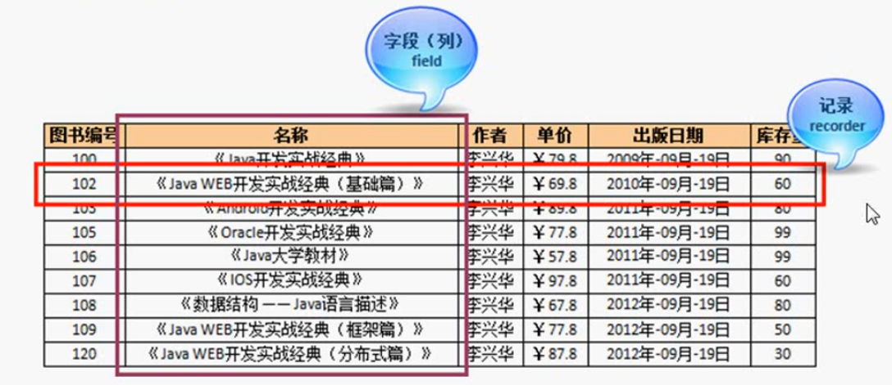

# 数据库系统概述

## 数据(Data)

> 描述事务的符号记录成为数据。

数据是数据库中存储的基本对象，出了基本的数字之外、像图书的名称、价格、作者等都可以称为数据。

列如：在日常生活之中，可以这样描述一本书的信息，《C Primer Plus》是人民邮电出版社出版的图书，作者是普拉塔(Prata S.)，定价是89.00，出版日期是2005年2月1日，这样的信息在计算机中就可以使用下面的方式来描述：

+ （C Primer Plus，人民邮电出版社，普拉塔(Prata S.)，89.00,2005-2-1）
+ 即，将信息按照“（图书名称，出版社，作者，价格，出版日期）”的方式组织在一起，这样就组成了一条记录。

如果现在有多条这种记录，那么就可以列成一张表，通过表来管理数据。

如有几种数据类型：

+ 图书编号、库存：整型数据
+ 图书名称、作者、出版社：字符串类型
+ 价格：小数类型

每一行的数据都成为记录，那么每一列的内容都称为字段。每一列都有自己的数据类型。

## 数据库(Database)

> 存放数据的仓库。

所有的数据在计算机存储设备上保存，而且保存的数据会按照一定的格式进行存储。

数据库是长期存储在计算机内，有组织的、可共享的大量数据的集合。数据库中的数据按照一定的数据模型组织、描述和存储，具有娇小的冗余度、教导的数据独立性和易拓展性，并可以为各种用户共享，所以数据库具有永久存储、有组织和课共享三个基本特点。

而除了有数据库之外，还要有数据库管理系统，才能对数据很好的管理。

## 数据库管理系统(Database Management System,DBMS)

> 科学的组织和存储数据，可以高效的获取和维护数据。

数据库管理系统和操作系统一样时计算机的基础软件，也是一个大型复杂的软件系统，主要功能包括以下几个方面：数据操作功能，数据库的事务管理和运行管理、数据定义功能，数据组织、存储和管理数据的建立和维护功能。

## 数据库系统(Database System,DBS)

> 数据库系统（Database System，DBS）由硬件和软件共同构成

硬件主要用于存储数据库中的数据，包括计算机、存储设备等。软件部分主要包括数据库管理系统、支持数据库管理系统运行的操作系统，以及支持多种语言进行应用开发的访问技术等。

数据库系统是指在计算机系统中引入数据库后的系统。

它是一整个数据库运行的基础，所有的数据库都需要通过开发工具编写的应用程序进行数据的访问，而数据平时需要被数据库管理员（Database Administrator，DBA）维护。

##  什么是SQL

> 结构化查询语言

SQL其发音为字母 S-Q-L 或 sequel，是 Structure Query Language（结构化查询语言）的缩写，是目前广泛使用的关系数据库标准语言。

该语言由 IBM在20世纪70年代开发出来，被作为IBM关系数据库 System R的原型关系语言，实现关系数据库中信息的检索。

由于 SQL 简单易学、功能丰富和使用灵活，因此受到众多人的追捧。经过不断的发展、完善和扩充，SOL 被美国国家标准局（ANSI）确定为关系型数据库语言的美国标准，后来又被国际标准化组织（ISO）采纳为关系数据库语言的国际标准。几乎所有的关系型数据库管理系统软件都支持SQL，许多厂商还对SQL基本命令进行了不同程度的扩充。

SQL 语言有以下几个部分：

+ 数据操作语言（Data Manipulation Language，DML）

  > 实现对数据的操作，用于检索或修改数据。

+ 数据定义语言（Data Definition Language，DDL）

  > 用于定义数据的结构，创建、修改或者删除数据库对象。

+ 数据控制语言（Data Control Language，DCL）

  > 用于控制数据库用户的权限。

+ 事务控制 （Transaction Control，TCL）

  > 定义了包含事务开始喝结束的相关命令。

+  DDL包含的子部分
  + 完整性约束（integrity constraint ）
  + 视图定义  (View Definition)

SQL具有如下优点∶

+ SQL 不是某个特定数据库供应商专有的语言。几乎所有重要的数据库管理系统都支持 SQL，
  所以只要学习了SQL 就能与所有数据库进行交互。
+ SQL 简单易学，该语言的语句都是由描述性很强的英语单词组成，而且这些单词的数目不多。
+ SQL 高度非过程化，即用SQL进行数据库操作，只需指出"做什么"，无须指明"怎么做"，存取路径的选择和操作的执行由数据库管理系统自动完成。
