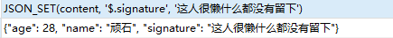
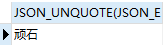

## 数据类型简介

数据类型（data_type）是指系统中所允许的数据的类型。MySQL 数据类型定义了列中可以存储什么数据以及该数据怎样存储的规则。

在 MySQL 中，选择合适的数据类型对于数据库的性能优化至关重要。MySQL 支持多种数据类型，这些类型大致可以分为三大类：**数值类型**、**日期/时间类型**和**字符串（字符）**类型。

### 数值类型

#### 整数类型

##### 类型介绍

MySQL 支持 SQL 标准的整数类型 INTEGER（或 INT）和 SMALLINT。作为对标准的扩展，MySQL 还支持整数类型 TINYINT、MEDIUMINT 和 BIGINT。下表显示了每种整数类型所需的存储空间和取值范围。

| 类型                   | 大小(字节) |
| ---------------------- | ---------- |
| TINYINT [UNSIGNED]     | 1          |
| SMALLINT [UNSIGNED]    | 2          |
| MEDIUMINT [UNSIGNED]   | 3          |
| INT/INTEGER [UNSIGNED] | 4          |
| BIGINT [UNSIGNED]      | 8          |

##### 使用场景

<font style="color:rgb(207,120,52)">TINYINT</font>：一般用于枚举类型，比如系统设定取值范围很小且固定的场景。

<font style="color:rgb(207,120,52)">SMALLINT</font>：可以用于较小范围的统计数据，比如统计工厂的固定资产库存数量等。

<font style="color:rgb(207,120,52)">MEDIUMINT</font>：用于较大整数的计算，比如车站每日的客流量等。

<font style="color:rgb(207,120,52)">INT、INTEGER</font>：取值范围足够大，一般情况下不用考虑超限问题，用的最多，比如商品编号。

<font style="color:rgb(207,120,52)">BIGINT</font>：只有当你处理特别巨大的整数时才会用到，比如双十一的交易量、大型门户网站点击量、证券公司衍生产品持仓等。

##### 如何选择

在评估用哪种整数类型的时候，你需要考虑`存储空间`和`可靠性`的平衡问题：一方面，用占用字节数少的整数类型可以节省存储空间；另一方面，要是为了节省存储空间，使用的整数类型取值范围太小，一旦遇到超出取值范围的情况，就可能引起`系统错误`，影响可靠性。

举个栗子，商品编号采用的数据类型是INT。原因就在于，客户门店中流通的商品种类较多，而且，每天都有旧的商品下架，新的商品上架，这样不断迭代，日积月累。

如果使用 SMALLINT  类型，虽然占用字节数比 INT 类型的证书少，但是却不能保证数据不会超出 655345。相反，使用INT 就能确保有足够大的取值范围，不用担心数据超出范围影响可靠性。

你要注意的是，在实际工作中，<font style="color:red">`系统故障产生的成本远远超过增加几个字段存储空间所产生的成本`</font>。因此，我建议你首先确保数据不会超过取值范围，在这个前提下，再去考虑如何节省存储空间。

#### 定点类型

 `DECIMAL` 和 `NUMERIC` 类型存储精确的数字数据值。这些类型在某些情况下使用保持精确是很重要的，例如货币数据。MySQL中 `NUMERIC` 实现为 `DECIMAL` ，所以如下 `DECIMAL` 的用法同样适用于 `NUMERIC` 。

##### 类型介绍

**定点数类型**为 DECIMAL。

| 类型         | 说明               | 大小(字节) |
| ------------ | ------------------ | ---------- |
| DECIMAL(M,D) | 压缩的“严格”定点数 | M+2        |

DECIMAL(M,D)，其中`M`称为精度，表示总共的位数；`D`称为刻度，表示小数的位数。0<=M<=65，0<=D<=30，D<M。例如：定义为DECIMAL(5,2)，表示该列的取值范围是[-999.99，999.99]。

+ DECIMAL(M,D)的最大值范围与DOUELE类型一样，但是有效的数据方位是由M和D决定的。DECIMAL的存储空间并不固定，由精度M决定，总共占用的存储空间为M+2个字节。也就是说，在一些对精度要求不高的场景下，比起占用同样字节长度的定点数，浮点数表达的数值范围可以更大。
+ 定点数在MySQL内部是以字符串的形式进行存储的，这就决定了它一定是精确的。
+ 当DECIMAL类型不指定精度和标度时，其默认为DECIMAL(10,0)，当数据的精度超出了定点数的精度范围时，则MySQL同样会进行四舍五入。

#### 浮点类型

##### 类型介绍

**浮点数类型**包括 FLOAT、DOUBLE。

| 类型   | 说明         | 大小(字节) |
| ------ | ------------ | ---------- |
| FLOAT  | 单精度浮点数 | 4          |
| DOUBLE | 双精度浮点数 | 8          |

##### 精度说明

因为浮点值是近似值，而不是存储为精确值，尝试在比较中将其视为精确值导致问题。

所以，在对精度要求比较高的时候（如货币、科学数据），使用 DECIMAL 的类型比较好，另外两个浮点数进行减法和比较运算时也容易出问题，所以在使用浮点数时需要注意，并尽量避免做浮点数比较。

要比较可以使用如下方式：

```sql
ABS(a - b) <= 0.0001
```

#### BIT 类型

BIT 数据类型用于存储位值。BIT(M) 类型能够存储 M 位的值。M 表示每个值的位数，范围为 1～64。如果 M 被省略，默认值为 1。如果为 BIT(M) 列分配的值的长度小于 M 位，在值的左边用 0 填充。

要表示位值，可以使用`b'value'`这种表示法。value 是用零和一组成的二进制值。例如，b'111' 和 b'10000000' 分别代表 7 和 128。

### 日期/时间类型

包括 YEAR、TIME、DATE、DATETIME 和 TIMESTAMP。

| 类型      | 说明                | 日期范围                                          | 大小(字节) |
| --------- | ------------------- | ------------------------------------------------- | ---------- |
| DATE      | YYYY-MM-DD          | 1000-01-01 ~ 9999-12-03                           | 3          |
| TIME      | HH:MM:SS            | -838:59:59 ~ 838:59:59                            | 3          |
| DATETIME  | YYYY-MM-DD HH:MM:SS | 1000-01-01 00:00:00 ~ 9999-12-31 23:59:59         | 8          |
| TIMESTAMP | YYYY-MM-DD HH:MM:SS | 1970-01-01 00:00:00 UTC ~ 2038-01-19 03:14:07 UTC | 4          |
| YEAR      | YYYY                | 1901~2155                                         | 1          |

#### DATE 类型

DATE 类型用于仅需要日期值时，没有时间部分，在存储时需要 3 个字节。日期格式为 'YYYY-MM-DD'，其中 YYYY 表示年，MM 表示月，DD 表示日。

在给 DATE 类型的字段赋值时，可以使用字符串类型或者数字类型的数据插入，只要符合 DATE 的日期格式即可。如下所示：

- 以 'YYYY-MM-DD' 或者 'YYYYMMDD' 字符中格式表示的日期，取值范围为 '1000-01-01'～'9999-12-3'。例如，输入 '2015-12-31' 或者 '20151231'，插入数据库的日期为2015-12-31。
- 以 'YY-MM-DD' 或者 'YYMMDD' 字符串格式表示日期，在这里YY表示两位的年值。MySQL 解释两位年值的规则：'00～69' 范围的年值转换为 '2000~2069'，'70~99' 范围的年值转换为 '1970～1999'。例如，输入 '15-12-31'，插入数据库的日期为 2015-12-31；输入 '991231'，插入数据库的日期为 1999-12-31。
- 使用 CURRENT_DATE() 或者 NOW()，插入当前系统日期。

> 提示：MySQL 允许“不严格”语法：任何标点符号都可以用作日期部分之间的间隔符。例如，'98-11-31'、'98.11.31'、'98/11/31'和'98@11@31' 是等价的，这些值也可以正确地插入数据库。

```mysql
CREATE TEMPORARY TABLE test_date1
(
	f1 DATE
);

INSERT INTO test_date1 VALUES('2022-04-16'),('20220416'),(20220416);
INSERT INTO test_date1 VALUES('22-04-16'),('220416'),
						     ('69-04-16'),('690416'),
						     ('70-04-16'),('700416'),
						     ('99-04-16'),('990416');
INSERT INTO test_date1 VALUES(220416),(690416),(700416),(990416);
INSERT INTO test_date1 VALUES(CURRENT_DATE()),(NOW());
```

#### TIME 类型

TIME 类型用于只需要时间信息的值，在存储时需要 3 个字节。格式为 HH:MM:SS。HH 表示小时，MM 表示分钟，SS 表示秒。

TIME 类型的取值范围为 -838：59：59～838：59：59，小时部分如此大的原因是 TIME 类型不仅可以用于表示一天的时间（必须小于 24 小时），还可能是某个事件过去的时间或两个事件之间的时间间隔（可大于 24 小时，或者甚至为负）。

可以使用各种格式指定 TIME 值，如下所示。

- 'D HH：MM：SS' 格式的字符串。还可以使用这些“非严格”的语法：'HH：MM：SS'、'HH：MM'、'D HH' 或 'SS'。这里的 D 表示日，可以取 0～34 之间的值。在插入数据库时，D 被转换为小时保存，格式为 “D*24+HH”。
- 'HHMMSS' 格式、没有间隔符的字符串或者 HHMMSS 格式的数值，假定是有意义的时间。例如，'101112' 被理解为'10：11：12'，但是 '106112' 是不合法的（它有一个没有意义的分钟部分），在存储时将变为 00：00：00。
- 使用 CURRENT_TIME() 或者 NOW()，插入当前系统时间。

> 提示：为 TIME 列分配简写值时应注意：如果没有冒号，MySQL 解释值时，假定最右边的两位表示秒。（MySQL 解释 TIME 值为过去的时间而不是当前的时间）。例如，读者可能认为 '1112' 和 1112 表示 11：12：00（即 11 点过 12 分钟），但MySQL 将它们解释为 00：11：12（即 11 分 12 秒）。同样 '12' 和 12 被解释为00：00：12。相反，TIME 值中如果使用冒号则肯定被看作当天的时间，也就是说，'11：12' 表示 11：12：00，而不是 00：11：12。

```mysql
CREATE TEMPORARY TABLE test_time1
(
	f1 TIME
);
INSERT INTO test_time1 
VALUES('10:35:30'),('2 10:35:30'),('10:35'),('2 10:35'),('1 35'),('30')

INSERT INTO test_time1 VALUES('103530'),(103530),(1035);
INSERT INTO test_time1 VALUES(NOW()),(CURRENT_TIME());
```

#### DATETIME 类型

DATETIME 类型用于需要同时包含日期和时间信息的值，在存储时需要 8 个字节。日期格式为 'YYYY-MM-DD HH：MM：SS'，其中 YYYY 表示年，MM 表示月，DD 表示日，HH 表示小时，MM 表示分钟，SS 表示秒。

在给 DATETIME 类型的字段赋值时，可以使用字符串类型或者数字类型的数据插入，只要符合 DATETIME 的日期格式即可，如下所示。

- 以 'YYYY-MM-DD HH：MM：SS' 或者 'YYYYMMDDHHMMSS' 字符串格式表示的日期，取值范围为 '1000-01-01 00：00：00'～'9999-12-3 23：59：59'。
- 以 'YY-MM-DD HH：MM：SS' 或者 'YYMMDDHHMMSS' 字符串格式表示的日期，在这里 YY 表示两位的年值。与前面相同，'00～79' 范围的年值转换为 '2000～2079'，'80～99' 范围的年值转换为 '1980～1999'。
- 以 YYYYMMDDHHMMSS 或者 YYMMDDHHMMSS 数字格式表示的日期和时间。

> 提示：MySQL 允许“不严格”语法：任何标点符号都可用作日期部分或时间部分之间的间隔符。例如，'98-12-31 11：30：45'、'98.12.31 11+30+35'、'98/12/31 11*30*45' 和 '98@12@31 11\^30\^45' 是等价的，这些值都可以正确地插入数据库。

```mysql
CREATE TEMPORARY TABLE test_datetime1
(
	dt DATETIME
);
INSERT INTO test_datetime1 VALUES('2022-04-16 18:50:30'),('20220416185030');
INSERT INTO test_datetime1 VALUES('99-04-16 18:50:30'),('990416185030'),
								 ('22-04-16 18:50:30'),('220416185030');
INSERT INTO test_datetime1 VALUES(20220202000000);
INSERT INTO test_datetime1 VALUES(CURRENT_TIMESTAMP()),(NOW());
```


#### TIMESTAMP 类型

TIMESTAMP 的显示格式与 DATETIME 相同，显示宽度固定在 19 个字符，日期格式为 YYYY-MM-DD HH：MM：SS，在存储时需要 4 个字节。但是 TIMESTAMP 列的取值范围小于 DATETIME 的取值范围，为 '1970-01-01 00：00：01'UTC～'2038-01-19 03：14：07'UTC。在插入数据时，要保证在合法的取值范围内。

> 提示：协调世界时（英：Coordinated Universal Time，法：Temps Universel Coordonné）又称为世界统一时间、世界标准时间、国际协调时间。英文（CUT）和法文（TUC）的缩写不同，作为妥协，简称 UTC。

TIMESTAMP 与 DATETIME 除了存储字节和支持的范围不同外，还有一个最大的区别是：

- DATETIME 在存储日期数据时，按实际输入的格式存储，即输入什么就存储什么，与时区无关；
- 而 TIMESTAMP 值的存储是以 UTC（世界标准时间）格式保存的，存储时对当前时区进行转换，检索时再转换回当前时区。即查询时，根据当前时区的不同，显示的时间值是不同的。

> 提示：如果为一个 DATETIME 或 TIMESTAMP 对象分配一个 DATE 值，结果值的时间部分被设置为 '00：00：00'，因此 DATE 值未包含时间信息。如果为一个 DATE 对象分配一个 DATETIME 或 TIMESTAMP 值，结果值的时间部分被删除，因此DATE 值未包含时间信息。

```mysql
CREATE TEMPORARY TABLE test_timestamp
(
	ts TIMESTAMP
);
INSERT INTO test_timestamp VALUES('1999-01-01 01:02:03'),('1999-01-01 01:02:03'),
								 ('99-01-01 01:02:03'),('990101010203');
INSERT INTO test_timestamp VALUES('2022@01@02@11@22@33');
INSERT INTO test_timestamp VALUES(CURRENT_TIMESTAMP()),(NOW());
```

##### **TIMESTAMP 和 DATETIME区别**

```mysql
CREATE TEMPORARY TABLE temp_time
(
	d1 DATETIME,
    d2 TIMESTAMP
);
INSERT INTO temp_time VALUES('2022-04-16 19:09:55','2022-04-16 19:09:55');
INSERT INTO temp_time VALUES(NOW(),NOW());

SELECT * FROM temp_time;

SET time_zone = '+9:00'

SELECT * FROM temp_time;	#设置之后再查询一次
```

+ 设置时区

```mysql
SET time_zone = '+9:00'
```

##### TIMESTAMP妙用

TIMESTAMP时间戳在创建的时候可以有多重不同的特性，如：

1.在创建新记录和修改现有记录的时候都对这个数据列刷新：

```sql
field_name TIMESTAMP DEFAULT CURRENT_TIMESTAMP ON UPDATE CURRENT_TIMESTAMP
```

2.在创建新记录的时候把这个字段设置为当前时间，但以后修改时，不再刷新它：

```sql
field_name TIMESTAMP DEFAULT CURRENT_TIMESTAMP
```

3.在创建新记录的时候把这个字段设置为0，以后修改时刷新它：

```sql
field_name TIMESTAMP ON UPDATE CURRENT_TIMESTAMP
```

4.在创建新记录的时候把这个字段设置为给定值，以后修改时刷新它：

```sql
field_name TIMESTAMP DEFAULT 'yyyy-mm-dd hh:mm:ss' ON UPDATE CURRENT_TIMESTAMP
```

#### YEAR类型

YEAR 类型是一个单字节类型，用于表示年，在存储时只需要 1 个字节。可以使用各种格式指定 YEAR，如下所示：

- 以 4 位字符串或者 4 位数字格式表示 YEAR，范围为 '1901'～'2155'。输入格式为 'YYYY' 或者 YYYY，例如，输入 '2010' 或 2010，插入数据库的值均为 2010。
- 以 2 位字符串格式表示的 YEAR，范围为 '00' 到 '99'。'00'～'69' 和 '70'～'99' 范围的值分别被转换为 2000～2069 和 1970～1999 范围的 YEAR 值。'0' 与 '00' 的作用相同。插入超过取值范围的值将被转换为 2000。

```mysql
CREATE TEMPORARY TABLE test_year
(
	y YEAR
);

INSERT INTO test_year VALUES('2021'),(2022);
INSERT INTO test_year VALUES('2155');
-- out of range value for column 'f1' at row 1
INSERT INTO test_year VALUES('2156');
INSERT INTO test_year VALUES('69'),('70');	#2069 1970
INSERT INTO test_year VALUES(0),('0');
```

### 字符串类型

字符串类型用来存储字符串数据，还可以存储图片和声音的二进制数据。字符串可以区分或者不区分大小写的串比较，还可以进行正则表达式的匹配查找。

#### 常规字符串

下表中列出了 MySQL 中的字符串数据类型，括号中的`M`表示可以为其指定长度。

| 类型名称   | 说明                                           | 长度范围         | 占用的存储空间                                             |
| ---------- | ---------------------------------------------- | ---------------- | ---------------------------------------------------------- |
| CHAR(M)    | 固定长度                                       | 0<=M<=255        | M 个字节                                                   |
| VARCHAR(M) | 变长字符串                                     | 0<=M<=65535      | M+1个字节                                                  |
| TINYTEXT   | 非常小字符串                                   | 0<=L<=255        | L+1字节                                                    |
| TEXT       | 小的字符串                                     | 0<=L<=65535      | L+2字节                                                    |
| MEDIUMTEXT | 中等大小的字符串                               | 0<=L<=16777215   | L+3字节                                                    |
| LONGTEXT   | 大的字符串                                     | 0<=L<=4294967295 | L+4字节                                                    |
| ENUM       | 枚举类型，只能有一个枚举字符串值               | 0<=L<=65535      | 1或2个字节，取决于枚举值的数目 (最大值为65535)             |
| SET        | 字符串集合，字符串对象可以有零个或 多个SET成员 | 0<=L<=64         | 1、2、3、4或8个字节，取决于集合 成员的数量（最多64个成员） |

##### CHAR 和 VARCHAR 类型

CHAR 和 VARCHAR 类型都可以存储比较短的字符串，但在存储和检索方式上有所不同。它们的最大长度也不同，并且在是否保留尾部空格方面也存在差异。

| 类型       | 特点     | 长度 | 长度范围    | 占用存储空间         |
| ---------- | -------- | ---- | ----------- | -------------------- |
| CHAR(M)    | 固定长度 | M    | 0<=M<=255   | M个字节              |
| VARCHAR(M) | 可变长度 | M    | 0<=M<=65535 | (实际长度+1/2)个字节 |

###### CHAR类型

+ CHAR(M) 为固定长度字符串，在定义时指定字符串长度。如果不指定，则默认为1个字符。
+ 如果保存时，数据的实际长度比CHAR类型声明的长度小，则会在`右侧填充空格`以达到指定的长度。当检索 CHAR 值时，尾部的空格将被删除。

+ 定义CHAR类型字段时，申明的字段长度即为CHAR类型字段所占的存储空间的字节数。

```mysql
CREATE TEMPORARY TABLE test_char
(
	f1 CHAR,
	f2 CHAR(5)
);

DESC test_char;

INSERT INTO test_char(f1) VALUES('h');
#Data too long for column 'f1' at row 1
INSERT INTO test_char(f1) VALUES('he');
INSERT INTO test_char(f1) VALUES('你');

INSERT INTO test_char(f2) VALUES('C语言');
#Data too long for column 'f2' at row 1
INSERT INTO test_char(f2) VALUES('C语言Plus');

#测试在右侧填充的空格，会在查询的时候去掉的情况
SELECT CONCAT(f2,'***') FROM test_char;
#注意：自己插入的空格也会被去掉
INSERT INTO test_char(f2) VALUES('fk  ');

SELECT * FROM test_char;
```

###### VARCHAR类型

+ VARCHAR(M) 定义时，必须指定长度M，否则会报错。

+ VARCHAR(M)指的是能存储M个字符，而实际占用的空间为字符串的实际长度加 1或者2。

+ VARCHAR 在值保存和检索时尾部的空格仍保留。

```mysql
#错误，没有指定长度
CREATE TEMPORARY TABLE test_varchar
(
	name VARCHAR
);

CREATE TEMPORARY TABLE test_varchar
(
	name VARCHAR(5)
);

INSERT INTO test_varchar VALUES('顿开'),('顿开顽石');
#Data too long forcolumn 'NAME' at row 1
INSERT INTO test_varchar VALUES('顿开顽石老师');
```

##### TEXT 类型

TEXT用来保存文本类型的字符串，如文章内容、评论等。当保存或查询 TEXT 列的值时，不删除尾部空格。

TEXT 类型分为 4 种：TINYTEXT、TEXT、MEDIUMTEXT 和 LONGTEXT。不同的 TEXT 类型的存储空间和数据长度不同。

在向TEXT类型的字段插入数据时，系统自动按照实际长度存储，不需要预先定义长度。

| 类型       | 说明         | 大小(字节)                       |
| ---------- | ------------ | -------------------------------- |
| TINYTEXT   | 小文本       | 0<=L<=255                        |
| TEXT       | 普通文本     | 0<=L<=65535                      |
| MEDIUMTEXT | 中等大小文本 | 0<=L<=16777215                   |
| LONGTEXT   | 长文本       | 0<=L<=4294967295 (相当于4GB字符) |

TEXT文本类型，可以存储比较大的文本段，搜索速度稍慢，因此如果不是特别大的内容，建议使用CHAR，VARCHAR来替代。还有TEXT类型不用加默认值，加了也没用。

##### ENUM 类型

ENUM 类型也叫作枚举类型，ENUM类型的取值范围需要在定义字段是进行指定。设置字段值时，ENUM类型只允许从成员中选取单个值，不能一次选取多个值。如果创建的成员中有空格，尾部的空格将自动被删除。

| 类型 | 长度范围    | 占用存储空间 |
| ---- | ----------- | ------------ |
| ENUM | 1<=L<=65535 | 1或2个字节   |

###### 创建和使用ENUM列

枚举值必须是带引号的字符串常量。例如，您可以这样创建一个具有枚举列的表：

```sql
CREATE  TEMPORARY TABLE shirts(
    name VARCHAR(32),
    size ENUM('x-small', 'small', 'medium', 'large', 'x-large')
);
INSERT INTO shirts (name, size) VALUES ('dress shirt','large'), ('t-shirt','medium'),
  ('polo shirt','small');
  
SELECT * FROM shirts WHERE size = 'medium';
+---------+--------+
| name    | size   |
+---------+--------+
| t-shirt | medium |
+---------+--------+
1 row in set (0.00 sec)

UPDATE shirts SET size = 'small' WHERE size = 'large';
```

向此表中插入 100 万行，每行值为“medium”，将需要 100 万字节的存储空间，而如果将实际的字符串“medium”存储在 VARCHAR 列中，则需要 600 万字节的存储空间。

###### 枚举字面量的索引值

每个枚举值都有一个索引：

+ 列规范中列出的各个元素都被赋予了索引编号，编号从 1 开始。
+ 空字符串错误值的索引值为 0。这意味着您可以使用以下 SELECT 语句来查找那些被赋予了无效 ENUM 值的行。
+ NULL` 值的索引为 `NULL

例如，一个被指定为 `ENUM('Mercury', 'Venus', 'Earth')` 的列，可以取下面所示的任意值。每个值的索引也一并列出。

| Value 价值  | Index 指数 |
| :---------- | :--------- |
| `NULL`      | `NULL`     |
| `''`        | 0          |
| `'Mercury'` | 1          |
| `'Venus'`   | 2          |
| `'Earth'`   | 3          |

> `ENUM` 可以有最多65535个不同的元素。

诸如 SUM() 或 AVG() 这类函数如果需要一个数值参数，会根据需要将该参数转换为数字。对于 ENUM 类型的值，计算时会使用其索引编号。

ENUM 值依照列索引顺序排列，并且空字符串排在非空字符串前，NULL 值排在其他所有枚举值前。

> 提示：ENUM 列总有一个默认值。如果将 ENUM 列声明为 NULL，NULL 值则为该列的一个有效值，并且默认值为 NULL。如果 ENUM 列被声明为 NOT NULL，其默认值为允许的值列表的第 1 个元素。

+ 查看enum字段的所有值

```mysql
SELECT COLUMN_TYPE  
FROM INFORMATION_SCHEMA.COLUMNS  
WHERE  
    TABLE_SCHEMA = 'your_database_name' AND  -- 数据库名  
    TABLE_NAME = 'your_table_name' AND       -- 表名  
    COLUMN_NAME = 'your_enum_column_name';   -- 列名（枚举字段）
-- 列如
SELECT
column_type
FROM
information_schema. COLUMNS
WHERE
#TABLE_SCHEMA = "test" AND
DATA_TYPE = 'enum'
AND table_name="test_enum"
AND column_name="ch";
```

+ 测试

```mysql
CREATE TABLE test_enum
(
	gender ENUM('男','女','unknown')
);

INSERT INTO test_enum VALUES('男');
#Data truncated for column 'ch' at row 1
INSERT INTO test_enum VALUES('中');
#可以使用索引来插入枚举元素(注意：索引从1开始)
INSERT INTO test_enum VALUES(1),('2');

#当enum字段没有申明为NOT NULL时,插入NULL也是合法的
INSERT INTO test_enum VALUES(NULL);

SELECT * FROM test_enum;
```

##### SET 类型

SET 是一种字符串对象，它可以包含零个或多个值，每个值都必须从创建表时指定的允许值列表中选取。由多个 SET 成员组成的列值应使用逗号（，）分隔各成员来指定。由此产生的一个结果是，SET 成员值本身不应包含逗号。

| 成员个数范围 | 占用的存储空间 |
| ------------ | -------------- |
| 1<=L<=8      | 1个字节        |
| 9<=L<=16     | 2个字节        |
| 17<=L<=24    | 3个字节        |
| 25<=L<=32    | 4个字节        |
| 33<=L<=64    | 8个字节        |

+  `SET` 列可以有最大值 64个不同的成员。

+ 与 ENUM 类型相同，SET 值在内部用整数表示，列表中每个值都有一个索引编号。当创建表时，SET 成员值的尾部空格将自动删除。

+ 但与 ENUM 类型不同的是，ENUM 类型的字段只能从定义的列值中选择一个值插入，而 SET 类型的列可从定义的列值中选择多个字符的联合。

> 提示：如果插入 SET 字段中的列值有重复，则 MySQL 自动删除重复的值；插入 SET 字段的值的顺序并不重要，MySQL 会在存入数据库时，按照定义的顺序显示；

##### 测试

```mysql
CREATE TABLE test_set
(
	hobby SET('吃饭','睡觉','写Bug')
);

INSERT INTO test_set VALUES('吃饭');

INSERT INTO test_set VALUES('吃饭,睡觉');

#重复插入时，会自动删除重复数据
INSERT INTO test_set VALUES('吃饭,睡觉,吃饭');
#插入的值在set中不存在时，会报错
INSERT INTO test_set VALUES('吃饭,睡觉,花钱');

SELECT * FROM test_set;
```


#### 二进制字符串

MySQL中的二进制字符串类型主要存储一些二进制数据，比如可以存储图片、音频、视频等二进制数据。

包括 BIT、BINARY、VARBINARY、TINYBLOB、BLOB、MEDIUMBLOB 和 LONGBLOB。

下表中列出了 MySQL 中的二进制数据类型，括号中的`M`表示可以为其指定长度。

| 类型名称       | 说明                 | 大小(字节)             |
| -------------- | -------------------- | ---------------------- |
| BINARY(M)      | 固定长度二进制字符串 | M 字节                 |
| VARBINARY (M)  | 可变长度二进制字符串 | M+1 字节               |
| TINYBLOB (M)   | 非常小的BLOB         | L+1 字节，在此，L<2^8  |
| BLOB (M)       | 小 BLOB              | L+2 字节，在此，L<2^16 |
| MEDIUMBLOB (M) | 中等大小的BLOB       | L+3 字节，在此，L<2^24 |
| LONGBLOB (M)   | 非常大的BLOB         | L+4 字节，在此，L<2^32 |

##### BINARY 和 VARBINARY 类型

BINARY 和 VARBINARY 类型类似于 CHAR 和 VARCHAR，不同的是它们包含二进制字节字符串。使用的语法格式如下：

列名称 BINARY(M) 或者 VARBINARY(M)

BINARY 类型的长度是固定的，指定长度后，不足最大长度的，将在它们右边填充 “\0” 补齐，以达到指定长度。例如，指定列数据类型为 BINARY(3)，当插入 a 时，存储的内容实际为 “a\0\0”，当插入 ab 时，实际存储的内容为“ab\0”，无论存储的内容是否达到指定的长度，存储空间均为指定的值 M。

VARBINARY 类型的长度是可变的，指定好长度之后，长度可以在 0 到最大值之间。例如，指定列数据类型为 VARBINARY(20)，如果插入的值长度只有 10，则实际存储空间为 10 加 1，实际占用的空间为字符串的实际长度加 1。

##### BLOB 类型

BLOB 是 "Binary Large Object" 的缩写，用于存储可变数量的数据。它通常用于存储图像、音频、视频或其他非文本数据。

MySQL 提供了几种不同大小的 `BLOB` 类型，以满足不同的需求：

| 数据类型   | 存储范围                               |
| ---------- | -------------------------------------- |
| TINYBLOB   | 最大长度为255 (2^8-1)字节              |
| BLOB       | 最大长度为65535 (2^16-1)字节           |
| MEDIUMBLOB | 最大长度为16777215 (2^24-1)字节        |
| LONGBLOB   | 最大长度为4294967295或4GB (2^32-1)字节 |

当你需要在 MySQL 数据库中存储非文本数据时，你可能会选择使用 `BLOB` 类型。但是，需要注意的是，当你经常查询或操作 `BLOB` 字段时，性能可能会受到影响，因为 `BLOB` 数据通常存储在磁盘上的不同位置，而不是与表的其余部分一起存储。

##### 加载文件

当你存储和检索 `BLOB` 数据时，你通常需要使用 MySQL 的各种函数和命令，如 `LOAD_FILE()`、`UNHEX()`、`HEX()` 等。

而load_file函数只有在满足两个条件的情况下才可以使用：

+ 文件权限：chmod a+x pathtofile

+ 文件大小：必须小于max_allowed_packet

可以先查看确定一下变量的值：

```cpp
SHOW VARIABLES LIKE 'secure_file_priv';		-- 查看
SHOW VARIABLES LIKE 'max_allowed_packet';	-- 查看允许的最大文件大小
```

创建表插入数据：

```mysql
-- 从本地文件加载，文件必须放在secure_file_priv安全路径中
DROP TABLE IF EXISTS images;
CREATE TEMPORARY TABLE images(
  img_name VARCHAR(128) COMMENT '图片名',
  img_data MEDIUMBLOB COMMENT '图片数据'
);

-- 加载并查看数据
SELECT LOAD_FILE("E:\\MySQL\\MySQL Server 8.4\\Uploads\\R-C.gif");
-- 加载并查看十六进制数据
SELECT HEX(LOAD_FILE("E:\\MySQL\\MySQL Server 8.4\\Uploads\\R-C.gif")) ;
-- 插入到表中
INSERT INTO images(img_name,img_data) VALUE("hello.png",LOAD_FILE("F:\\ProgramData\\MySQL\\MySQL Server 8.3\\Uploads\\hello.png"));
```

**注意**：

- 使用 `LOAD_FILE()` 函数时，文件必须位于 MySQL 服务器上的某个位置，并且 MySQL 进程需要有读取该文件的权限。
- `BLOB` 数据通常以二进制形式存储和检索，因此在显示或处理之前，你可能需要对其进行解码或转换。
- 考虑到性能和存储需求，应谨慎使用 `BLOB` 类型，并考虑是否真的需要将其存储在数据库中。有时，将文件存储在文件系统或专门的存储服务中，并在数据库中仅存储文件路径或引用可能更为合适。 

### JSON类型

MySQL 支持一种由 RFC 8259 规定的原生 JSON（JavaScript 对象表示法）数据类型，该类型能够实现对 JSON 文档中数据的高效访问。与将 JSON 格式字符串存储在字符串列中相比，JSON 数据类型具有以下优势：

+ 对存储在 JSON 列中的 JSON 文档进行自动验证。无效的文档会引发错误。
+ 优化的存储格式。存储在 JSON 列中的 JSON 文档会被转换为一种内部格式，以便能够快速读取文档元素。当服务器稍后必须读取以这种二进制格式存储的 JSON 值时，无需从文本表示形式中解析该值。这种二进制格式的结构使得服务器能够通过键或数组索引直接查找子对象或嵌套值，而无需在文档中读取它们之前或之后的所有值。

存储一个 JSON 文档所需的空间与存储 LONGBLOB 或 LONGTEXT 数据所需的空间大致相同；需要记住的是，存储在 JSON 列中的任何 JSON 文档的大小受 max_allowed_packet 系统变量值的限制。（当服务器在内存中内部处理 JSON 值时，其大小可以大于此限制；而当服务器存储它时，则受此限制的约束。）您可以使用 JSON_STORAGE_SIZE() 函数获取存储一个 JSON 文档所需的空间大小。

#### 简介

MySQL 支持由 RFC 7159 定义的原生JSON 数据类型，该数据类型可以有效访问 JSON（JavaScript Object Notation）中的元素数据。

MYSQL 8.0，除了提供JSON 数据类型，还有一组 SQL 函数可用于操作 JSON 的值，例如创建JSON对象、增删改查JSON数据中的某个元素。

#### JSON字段

##### 创建表

创建表时，要把字段类型设置为JSON类型：

```mysql
CREATE TABLE t_json(
	id INT,
	content JSON
);
```

##### 插入数据

插入数据可以像插入varchar类型的数据一样，把json串添加单引号进行插入：

```mysql
-- JSON对象
INSERT INTO t_json(id,content) VALUE(1,'{"name":"maye","age":28}');
-- JSON数组
INSERT INTO t_json(id,content) VALUE(3,'[1,2,3,4,5,6]');
-- 混合使用
INSERT INTO t_json(id,content) VALUE(5,'{"name":"hello","numbers":[1,2,3,4,5]}');
```

当然也可以使用mysql提供的`JSON_OBJECT`或`JSON_ARRAY`函数创建对象或数组：

```mysql
-- JSON对象
INSERT INTO t_json(id,content) VALUE(2,JSON_OBJECT("name","maye","age",28));
-- JSON数组
INSERT INTO t_json(id,content) VALUE(4,JSON_ARRAY(1,2,3,4,5,6));
-- 混合使用
INSERT INTO t_json(id,content) VALUE(6,JSON_OBJECT("name","hello","numbers",JSON_ARRAY(1,2,3,4,5)));
```

#### JSON元素操作

##### JSON_SET 插入

使用JSON_SET函数可以向JSON文档中插入键值对。

+ 如果键存在则修改值

  ```mysql
  SELECT  JSON_SET(content, '$.name', '顽石') FROM t_json WHERE id = 1;
  ```

  

+ 如果键不存在则插入键值对

  ```mysql
  SELECT  JSON_SET(content, '$.signature', '这人很懒什么都没有留下') FROM t_json WHERE id = 1;
  ```

  

**注意：**通过SELECT进行的修改不会影响表中的数据，如果需要更新表中的数据，需要使用UPDATE语句。

```mysql
UPDATE t_json SET content = JSON_SET(content, '$.name', '顽石') WHERE id = 1;
```

与JSON_SET类似的函数有`JSON_INSERT`和`JSON_REPLACE`，不同点在于`JSON_INSERT`插入时，如果键存在什么都不做，如果键不存在则插入；`JSON_REPLACE`键存在时替换旧值，键不存在时什么都不做。

##### JSON_REMOVE 删除

使用JSON_REMOVE函数可以从JSON文档中删除键值对。

```mysql
SELECT  JSON_REMOVE(content, '$.name') FROM t_json WHERE id = 1;
```

##### JSON_EXTRACT 提取

###### 函数形式

使用JSON_EXTRACT函数可以从JSON文档中提取需要的键值对。

```mysql
SELECT  JSON_EXTRACT(content, '$.name') FROM t_json WHERE id = 1;
```


结果是带双引号的，使用`JSON_UNQUOTE`函数可以去掉双引号。

```mysql
SELECT  JSON_UNQUOTE(JSON_EXTRACT(content, '$.name')) FROM t_json WHERE id = 1;
```



提取数组中的数据也是类似的：

```mysql
-- 1 
SELECT  
JSON_EXTRACT(content, '$.name'),
JSON_EXTRACT(content, '$.numbers'),
JSON_EXTRACT(content, '$.numbers[0]') ,
JSON_EXTRACT(content, '$.numbers[1]') ,
JSON_EXTRACT(content, '$.numbers[2]') ,
JSON_EXTRACT(content, '$.numbers[3]') ,
JSON_EXTRACT(content, '$.numbers[4]') ,
JSON_EXTRACT(content, '$.numbers[5]')		-- 越界数据为NULL
FROM t_json WHERE id = 5;
-- 2
SELECT JSON_EXTRACT('[1,2,3,4]', '$[0]'),
JSON_EXTRACT('[1,2,3,4]', '$[1]','$[2]')
```

###### 简写形式

每次都写JSON_EXTRACT非常麻烦，因此MYSQL提供了简写形式。

+ column->path

  当与两个参数一起使用时，->操作符用作JSON_EXTRACT()函数的别名，左边是列标识符，右边是JSON路径(字符串文字)，该路径根据JSON文档(列值)进行计算。在SQL语句中出现列引用的任何地方，都可以使用这种表达式来代替列引用。

```mysql
SELECT  
SON_EXTRACT(content, '$.name'),	-- 函数形式
content->"$.name"  				-- ->形式
FROM t_json WHERE id =1;
```

数组也可以：

```mysql
SELECT  
JSON_EXTRACT(content, '$.numbers[0]'),	-- 函数形式
content->"$.numbers[0]"				    -- ->形式
FROM t_json WHERE id = 5;
```

+ column->>path

  这是一个改进的无引号提取操作符。虽然操作符只是提取一个值，但操作符还将提取的结果取消引号。换句话说，给定一个JSON列值column和一个路径表达式path(字符串字面值)，以下三个表达式返回相同的值:

  + JSON_UNQUOTE(JSON_EXTRACT(*column*, *path*) )
  + JSON_UNQUOTE(*column* `->` *path*)
  + column`->>`path

```MYSQL
SELECT  
JSON_EXTRACT(content, '$.name'),	-- 函数形式
content->>"$.name"  			    -- ->>形式
FROM t_json WHERE id =1;

SELECT  
JSON_EXTRACT(content, '$.numbers[0]'),
content->>"$.numbers[0]"
FROM t_json WHERE id = 5;
```

###### 其他函数

其他函数请参考[MySQL 8.3 参考手册 ::14.17.1 JSON函数参考](https://dev.mysql.com/doc/refman/8.3/en/json-function-reference.html)

## 生成列

**生成列（Generated Column）** 是指，由表中其他列通过计算或表达式生成的列，其值并非手动插入，而是由数据库自动根据定义的规则计算得出。生成列分为**虚拟生成列（Virtual）** 和**存储生成列（Stored）** 两种类型，MySQL 5.7 及以上版本开始支持该特性。

生成列常用于简化查询、保证数据一致性（如计算总价、拼接字符串、格式转换等），避免在应用层重复计算。

### 生成列的类型

生成列有两种类型，如下表所示：

| 类型       | 英文名称 | 存储方式                       | 计算时机                   | 性能特点                   |
| ---------- | -------- | ------------------------------ | -------------------------- | -------------------------- |
| 虚拟生成列 | Virtual  | 不实际存储，仅在查询时计算     | SELECT 时动态计算          | 节省存储空间，查询略耗性能 |
| 存储生成列 | Stored   | 实际存储在磁盘中，与普通列一致 | INSERT/UPDATE 时计算并存储 | 占用存储空间，查询速度更快 |

**默认类型**：若未显式指定类型，MySQL 默认为**虚拟生成列（Virtual）**。

### 生成列基本语法

#### 创建表时定义生成列

```sql
CREATE TABLE 表名 (
    列名1 数据类型,
    列名2 数据类型,
    -- 虚拟生成列（默认）
    生成列名 数据类型 GENERATED ALWAYS AS (表达式) VIRTUAL,
    -- 存储生成列
    生成列名 数据类型 GENERATED ALWAYS AS (表达式) STORED
);
```

**关键说明**：

- `GENERATED ALWAYS AS`：固定语法，表示该列为生成列。
- `(表达式)`：生成列的计算规则，可使用列名、函数、运算符等（如算术运算、字符串拼接、日期函数等）。
- 生成列的表达式中**不能使用**子查询、存储过程、自定义函数、变量等。

#### 修改表时添加生成列

```sql
ALTER TABLE 表名 ADD COLUMN 生成列名 数据类型 GENERATED ALWAYS AS (表达式) [VIRTUAL/STORED];
```

#### 修改 / 删除生成列

- **修改生成列**：MySQL 不支持直接修改生成列的表达式，需先删除再重新添加。

- 删除生成列：与普通列删除语法一致。

  ```sql
  ALTER TABLE 表名 DROP COLUMN 生成列名;
  ```

### 实战示例

以订单表 `tb_orders` 为例，演示生成列的常见使用场景。

#### 示例1：计算订单总价（算术运算）

假设订单表包含 `price`（单价）和 `quantity`（数量），生成列 `total_amount` 计算总价：

```sql
CREATE TABLE tb_orders(
  id INT PRIMARY KEY AUTO_INCREMENT COMMENT 'ID',
  order_no VARCHAR(32) UNIQUE NOT NULL COMMENT '订单号',
  price DECIMAL(5,2) NOT NULL COMMENT '单价',
  quantity INT NOT NULL DEFAULT 1 COMMENT '数量',
  total_amount DECIMAL(10,2) GENERATED ALWAYS AS (price * quantity) VIRTUAL COMMENT '总价格，根据单价和数量自动计算',
  create_at DATETIME NOT NULL DEFAULT CURRENT_TIMESTAMP COMMENT '创建时间'
);
```

查看一下表结构，可以看到`total_amount`的Extra字段是`VIRTUAL GENERATED`，虚拟生成列：

```sql
mysql> DESC tb_orders;
+--------------+---------------+------+-----+-------------------+-------------------+
| Field        | Type          | Null | Key | Default           | Extra             |
+--------------+---------------+------+-----+-------------------+-------------------+
| id           | int           | NO   | PRI | NULL              | auto_increment    |
| order_no     | varchar(32)   | NO   | UNI | NULL              |                   |
| price        | decimal(5,2)  | NO   |     | NULL              |                   |
| quantity     | int           | NO   |     | 1                 |                   |
| total_amount | decimal(10,2) | YES  |     | NULL              | VIRTUAL GENERATED |
| create_at    | datetime      | NO   |     | CURRENT_TIMESTAMP | DEFAULT_GENERATED |
+--------------+---------------+------+-----+-------------------+-------------------+
6 rows in set (0.00 sec)
```

插入数据测试：

```sql
-- 1，插入自动计算total_amount
INSERT INTO tb_orders(order_no,price,quantity) VALUES('hdy20250604','23.5','2');

-- 2，更新自动计算total_amount
UPDATE tb_orders SET quantity = 3 WHERE id = 1;

-- 查询数据
mysql> SELECT * FROM tb_orders;
+----+-------------+-------+----------+--------------+---------------------+
| id | order_no    | price | quantity | total_amount | create_at           |
+----+-------------+-------+----------+--------------+---------------------+
|  1 | hdy20250604 | 23.50 |        3 |        70.50 | 2025-12-23 13:58:45 |
+----+-------------+-------+----------+--------------+---------------------+
1 row in set (0.00 sec)
```

#### 示例 2：拼接订单描述（字符串操作）

生成列 `order_desc` 拼接订单号和商品名称：

```sql
ALTER TABLE tb_orders ADD COLUMN product_name VARCHAR(100) NOT NULL,
-- 存储生成列：拼接订单描述
ADD COLUMN order_desc VARCHAR(150) GENERATED ALWAYS AS (CONCAT('订单', order_no, '：', product_name)) STORED;
```

插入测试数据：

```sql
INSERT INTO tb_orders (order_no, price, quantity, product_name) 
VALUES ('hdy20251223002', 199.00, 1, '红米手机');
```

输出如下：

```sql
mysql> SELECT * FROM tb_orders;
+----+----------------+--------+----------+--------------+---------------------+--------------+------------------------------+
| id | order_no       | price  | quantity | total_amount | create_at           | product_name | order_desc                   |
+----+----------------+--------+----------+--------------+---------------------+--------------+------------------------------+
|  1 | hdy20250604    |  23.50 |        3 |        70.50 | 2025-12-23 13:58:45 |              | 订单hdy20250604：            |
|  2 | hdy20251223002 | 199.00 |        1 |       199.00 | 2025-12-23 14:50:15 | 红米手机     | 订单hdy20251223002：红米手机 |
+----+----------------+--------+----------+--------------+---------------------+--------------+------------------------------+
2 rows in set (0.00 sec)
```

#### 示例 3：提取日期中的年份（日期函数）

生成列 `order_year` 提取订单创建时间的年份：

```sql
ALTER TABLE tb_order 
ADD COLUMN order_year INT GENERATED ALWAYS AS (YEAR(create_time)) VIRTUAL;
```

插入测试数据：

```sql
ALTER TABLE tb_orders 
ADD COLUMN order_year INT GENERATED ALWAYS AS (YEAR(create_at)) VIRTUAL;
```

输出如下：

```sql
mysql> SELECT * FROM tb_orders;
+----+----------------+--------+----------+--------------+---------------+--------------+------------+------------+
| id | order_no       | price  | quantity | total_amount | create_at     | product_name | order_desc | order_year |
+----+----------------+--------+----------+--------------+---------------+--------------+------------+------------+
|  1 | hdy20250604    |  23.50 |        3 |        70.50 | 2025-12-23... |              | ...        |   2025     |
|  2 | hdy20251223002 | 199.00 |        1 |       199.00 | 2025-12-23... | 红米手机      | ...         |   2025    |
+----+----------------+--------+----------+--------------+---------------+--------------+------------+------------+
2 rows in set (0.00 sec)
```

### 生成列的使用规则与限制

#### 表达式限制

- 生成列的表达式只能引用本表的列，且不能引用其他生成列（避免循环依赖）。
- 不支持子查询、存储过程、自定义函数、用户变量、系统变量（如 `@var`、`@@version`）。
- 支持 MySQL 内置函数（如 `CONCAT`、`YEAR`、`ROUND` 等）和算术 / 字符串运算符。

+ **数据类型匹配**生成列的计算结果类型必须与定义的列数据类型一致，否则会报错。例如：

  - 算术运算结果为小数时，生成列需定义为 `DECIMAL` 而非 `INT`。

  - 字符串拼接结果需与生成列的 `VARCHAR` 长度匹配。

+ **索引支持**生成列（无论是 Virtual 还是 Stored）都可以创建索引，也可作为主键 / 唯一键的一部分（需保证值唯一）。

  ```sql
  -- 为虚拟生成列 total_amount 创建索引
  CREATE INDEX idx_total_amount ON tb_orders (total_amount);
  ```

+ **插入 / 更新规则**

  - 不能手动为生成列赋值（包括 `INSERT`/`UPDATE`），否则会报错（`Error 3105 - The value specified for generated column 'xxx' in table 'xxx' is not allowed`）。

  - 当生成列依赖的列值发生变化时，生成列的值会自动更新（Virtual 列查询时重新计算，Stored 列实时存储新值）。

+ **存储引擎支持**生成列仅支持 InnoDB 和 MyISAM 存储引擎，其他引擎（如 Memory）不支持。

### 生成列的适用场景

1. **简化复杂查询**：将常用的计算逻辑（如总价、日期提取）定义为生成列，避免查询时重复写表达式。
2. **数据一致性**：由数据库保证计算结果的准确性，避免应用层计算错误。
3. **索引优化**：对复杂的查询条件（如函数计算后的列）创建生成列并建立索引，提升查询性能（如 `WHERE YEAR(create_time) = 2025` 可替换为 `WHERE order_year = 2025`，利用索引）
