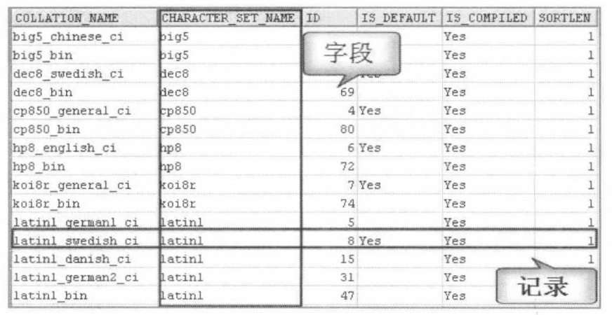
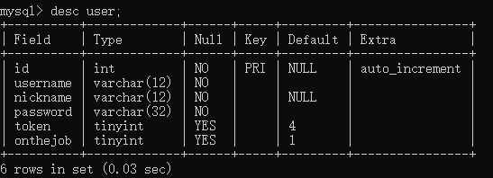
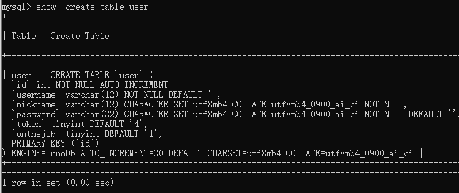

# 创建和管理表

## 1. 基础知识

### 1.1 表的基本概念

在MySQL数据库中，表是一种很重要的数据库对象，是组成数据库的基本元素，由若干个字段组成，主要用来实现存储数据记录。表的操作包含创建表、查看表、删除表和修改表，这些操作是数据库对象的表管理中最基本、最重要的操作。
通过本节的学习，可以掌握在数据库中操作表，内容包含:

+ 表的相关概念;
+ 表的基本操作:创建、查看、更新和删除; 
+ 表的使用策略。

表是包含数据库中所有数据的数据库对象。数据在表中的组织方式与在电子表格中相似，都是按行和列的格式组织的。其中每一行代表一条唯一的记录，每一列代表记录中的一个字段，如下图所示。



### 1.2 标识符命名规范

1. 数据库名、表名不得超过30个字符，变量名限制为29个
2. 只能包含大写、小写、数字字符以及下划线
3. 同一个MySQL软件中，数据库不能同名；同一个库中，表不能重名；同一个表中，字段不能重名
4. 不能和保留字、函数名冲突
5. 保值字段名和类型的一致性：假如某个字段在一个表里面是整型，那在另一个表里面可就别变成字符串了

### 1.3 MySQL中的数据类型

| 类型             | 具体类型                                                     |
| ---------------- | ------------------------------------------------------------ |
| 整数类型         | TINYINT、SMALLINT、MEDIUMINT、INT(或INTEGER)、BIGINT         |
| 浮点类型         | FLOAT、DOUBLE                                                |
| 定点数类型       | DECIMAL                                                      |
| 位类型           | BIT                                                          |
| 日期时间类型     | YEAR、TIME、DATE、DATETIME、TIMESTAMP                        |
| 文本字符串类型   | CHAR、VARCHAR、TINYTEXT、TEXT、MEDIUMTEXT、LONGTEXT          |
| 枚举类型         | ENUM                                                         |
| 集合类型         | SET                                                          |
| 二进制字符串类型 | BINARY、VARBINARY、TINYBLOB、BLOB、MEDIUMBLOB、LONGBLOB      |
| json类型         | JSON对象、JSON数组                                           |
| 空间数据类型     | 单值：GEOMETRY、POINT、LINESTRING、POLYGON<br>集合：MULTPOINT、MULTILINESTRING、MULTIPOLGON、GEOMTRYCOLLECTION |

其中，常用的几类类型介绍如下：

| 类型          | 描述                                                         |
| ------------- | ------------------------------------------------------------ |
| INT           | 4个字节                                                      |
| CHAR(size)    | 定长字符数据，若未指定，默认为一个字符，最大长度255          |
| VARCHAR(size) | 可变字符数据，更具字符串实际长度保存，必须指定长度           |
| FLOAT(M,D)    | 单精度，4个字节。M=整数位+小数位，D=小数位（D<=M<=255,0<=D<=30）,默认M+D<=6 |
| DOUBLE(M,D)   | 双精度，8个字节。D<=M<=255,0<=D<=30，默认M+D<=15             |
| DECIMAL(M,D)  | 高精度，M+2个字节。D<=M<=65,0<=D<=30,默认最大取值范围和DOUBLE一样 |
| DATE          | 日期类型，格式‘YYY-MM-DD’                                    |
| BLOD          | 二进制心事的长文本数据，最大可达4G                           |
| TEXT          | 长文本数据，最大可达4G                                       |


## 2. 创建和管理数据库

### 2.1 创建数据库

+ 方式1：创建数据库

  ```mysql
  CREATE DATABASE 数据库名;
  ```

+ 方式2：创建数据库并指定字符集

  ```mysql
  CREATE DATABASE 数据库名 CHARACTER SET "uft8";
  ```

+ 方式3：判断数据库是否已经存在，不存在则创建（推荐）

  ```mysql
  CREATE DATABASE IF NOT EXISTS 数据库名;
  ```
  > 注意：数据库不能改名。一些可视化工具可以改名，它是创建新库，然后把所有表复制到新库，再把旧库删掉完成的。

数据库创建完成之后，可以通过`SHOW CREATE DATABASE 数据库名;`查看创建数据库时使用的语句。

### 2.2 使用数据库

+ 查看当前连接中有哪些数据库

```mysql
SHOW DATABASES;
```

+  切换数据库

在多个数据库之间切换

```mysql
USE 数据库名;
```

+ 查看当前使用的数据库

```mysql
SHOW DATABASE();
```

+ 查看指定数据库所有表

```mysql
SHOW TABLES FROM 数据库名;
```

### 2.3 修改数据库

修改数据库字符集

```mysql
ALTER DATABASE 数据库名 CHARACTER SET 字符集;	#比如 gbk、utf8
#查看默认字符集
SHOW VARIABLES LIKE '%character%';
#查看所有字符集
SHOW CHARSET;
```

### 2.4 删除数据库

+ 直接删除

  ```mysql
  DROP DATABASE 数据库名;
  ```

+ 如果数据库存在则删除，否则报一个警告(不会报错)

  ```mysql
  DROP DATABASE IF EXISTS 数据库名;
  ```

  


## 3.创建表

>  在 MySQL数据库管理系统中创建表通过SQL语句CREATE TABLE 来实现

### 3.1 创建方式1

> 自己指定字段和数据类型

**语法：**

```mysql
CREATE TABLE [IF NOT EXISTS] 表名(
	字段名 数据类型，
    字段名 数据类型，
    ...
    字段名 数据类型，
);
```

**范例：**

```mysql
CREATE TABLE myemp
(
    id INT COMMENT '员工编号',
    ename VARCHAR(20) COMMENT '员工名称',
    deptno INT COMMENT '所在部门编号',
    sal INT COMMENT '工资'
);
```


### 3.2 创建方式2

> 基于现有表创建新表

+ 基于现有表创建新表,同时导入数据

  ```mysql
  #单个表
  CREATE TABLE myemp1
  AS
  SELECT empno,ename,sal FROM emp;
  
  #多个表
  CREATE TABLE myemp2
  AS
  SELECT e.empno,e.ename,e.sal,d.dname 
  FROM emp e JOIN dept d
  ON e.deptno=d.deptno;
  ```

+ 基于现有表创建新表，只复制表结构，不导入数据

  ```mysql
  CREATE TABLE myemp3
  AS
  SELECT empno,ename,sal FROM emp WHERE 1 = 2;
  ```

  


### 3.3 查看表结构

创建完表，如果需要查看一下表的结构，可以通过执行SQL语句 DESCRIBE来实现，其语法形式如下:

```mysql
DESC/DESCRIBE table_name;
```

DESC为DESCRIBE的简写形式，更为方便。



还有一种更详细查看表结构的语句：

```mysql
SHOW CREATE TABLE table_name;
```




## 4. 修改表

修改数据表的前提是数据库中已经存在该表。修改表指的是修改数据库中已经存在的数据表的结构。修改数据表的操作也是数据库管理中必不可少的，就像画素描一样，画多了可以用橡皮擦掉，画少了可以用笔加上。

### 4.1 修改数据表

#### 4.1.1 修改表名

**方法一：**通过 ALTER TABLE 语句来修改表名，语法规则如下：

```mysql
ALTER TABLE <旧表名> RENAME [TO] <新表名>;
```

其中，TO 为可选参数，使用与否均不影响结果。

只能对一张表的表名进行修改。

**范例：**

```mysql
ALTER TABLE myemp RENAME memp;
```


**方法二：**通过 RENAME TABLE 语句来修改表名，语法规则如下

```mysql
RENAME TABLE <旧表名> TO <新表名>[,旧表名2 TO 新表名2]
```

**范例：**

```mysql
RENAME memp TO myemp,myemp1 TO memp1;
```


可以同时修改多个表的表名。

#### 4.1.2 修改字符集

通过 ALTER TABLE 语句来实现表字符集的修改，语法规则如下：

```mysql
ALTER TABLE <表名> [DEFAULT] CHARACTER SET <字符集名> [DEFAULT] COLLATE <校对规则名>;
```

其中，DEFAULT 为可选参数，使用与否均不影响结果。

```mysql
ALTER TABLE myemp CHARACTER SET gb2312;
```


### 4.2 增加字段

对于表，可以看成是由列和行来构成的，其中“列”经常被称为字段。

#### 4.2.1 在最后添加字段

在创建表之后如果要增加一列，需要使用下面的语句。

```mysql
ALTER TABLE table_name ADD 字段名 数据类型;
```

**范例：**

```mysql
ALTER TABLE myemp ADD job VARCHAR(10);
```


#### 4.2.2 在第一个位置添加字段

```mysql
ALTER TABLE table_name ADD 字段名 数据类型 FIRST;
```

#### 4.2.3 在指定位置添加字段

把字段1 添加到字段2之后

```mysql
ALTER TABLE table_name ADD 字段名1 数据类型 AFTER 字段名2;
```

### 4.3 删除字段

```mysql
ALTER TABLE table_name DROP 字段名;
```

### 4.4 修改字段

#### 4.4.1 修改字段的数据类型

```mysql
ALTER TABLE table_name MODIFY 字段名 数据类型;
```

#### 4.4.2 修改字段名

```mysql
ALTER TABLE table_name CHANGE 旧字段名 新字段名 数据类型;
```

如果数据类型和原来的数据类型一样，则只会修改字段名，如果数据类型不同，则同时会修改数据类型。

#### 4.4.3 修改字段的顺序

```mysql
ALTER TABLE table_name MODIFY	字段名 数据类型 FIRST;
ALTER TABLE table_name MODIFY	字段名1 数据类型 AFTER 字段名2;	
```

+ 第一个语句：把字段移动到第一个
+ 第二个语句：把字段1 移动到字段2之后


## 5. 删除表

```mysql
DROP TABLE [IF EXISTS] table_name[,表1,表2...];
```

