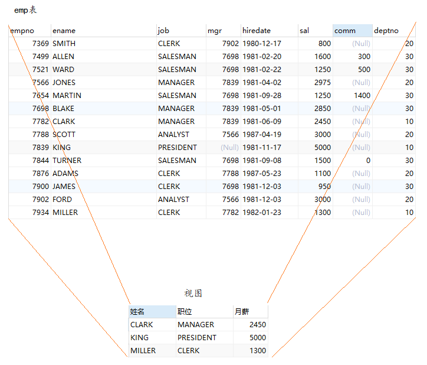
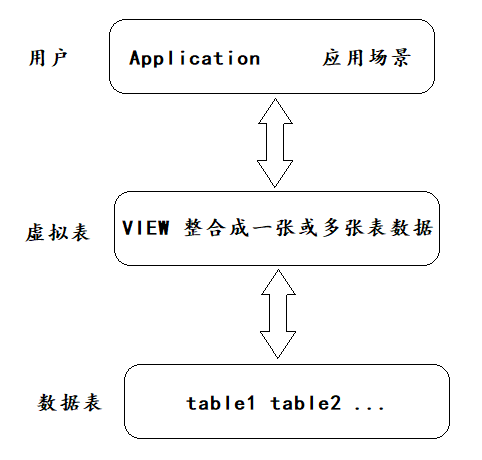

# **第12章 视图**

## 1. 视图概述



### 1.1 为什么使用视图？

视图一方面可以帮我们使用表的一部分而不是整个表，另一方面也可以针对不同的用户顶置不同的查询视图。比如，针对公司的销售人员，我们只想给他看部分数据，而某些特殊的数据，比如采购价格，则不会提供给他。再比如，员工薪资是个敏感字段，那么只给某个级别以上的人员开放，其他人的查询视图中则不提供这个字段。

### 1.2 视图的理解

+ 视图是一种`虚拟表` ，本身是`不具有数据` 的，占用很少的内存空间，它是 SQL 中的一个重要概念。
+ 视图建立在已有表的基础上， 视图赖以建立的这些表称为**基表**。



+ 视图的创建和删除只影响视图本身，不影响对应的基表。但是当对视图中的数据进行增加、删除和修改操作时，基表中的数据会相应地发生变化，反之亦然。
+ 向视图提供数据内容的语句为SELECT语句，可以将视图理解为存储起来的SELECT语句
+ 视图，是向用户提供基表数据的另一种表现形式。通常情况下，小型项目的数据库可以不使用视图，但是在大型项目中，以及数据表比较复杂的情况下，视图的价值就凸显出来了，它可以帮助我们把经常查询的结果集放到虚拟表中，提升使用效率。理解和使用起来都非常方便。

## 2.创建视图

### **2.1 视图语法**

+ 完整的创建视图语法

```mysql
CREATE [OR REPLACE] [ALGORITHM = {UNDEFINED | MERGE | TEMPTABLE}] 
VIEW 视图名称 [(字段列表)] 
AS 查询语句 
[WITH [CASCADED|LOCAL] CHECK OPTION]
```

+ 超简版本

```mysql
CREATE VIEW 视图名称
AS 查询语句
```

### **2.2 创建单表视图**

**范例：**创建视图“v_emp1”，显示员工的姓名，工作以及薪资。

```mysql
CREATE VIEW v_emp1
AS
SELECT ename,job,sal FROM emps;
```

查询视图：

```mysql
SELECT * FROM v_emp1;
```

针对别名的处理，可以在创建视图的子查询中指定对应的别名

```mysql
CREATE VIEW v_emp1_1
AS
SELECT ename 姓名,job 工作,sal 薪资 FROM emps;
```

也可以在创建视图的视图名称后添加对应的别名字段

```mysql
CREATE OR REPLACE VIEW v_emp1_2(姓名,工作,薪资)
AS
SELECT ename,job,sal FROM emps;
```

我们在创建视图的时候还可以封装不是基表中存在的字段的情况

**范例：**创建视图“v_emp2”,显示每个部门的编号，以及平均工资

```mysql
CREATE VIEW v_emp2(deptno,avg_sal)
AS
SELECT deptno,AVG(sal) FROM emps GROUP BY deptno;
```

### **2.2 创建多表视图**

  上面是基于单表创建的视图，当然我们也可以基于多表查询的结果来封装为对应的视图。

**范例：**创建视图“v_emp_dept”，显示部门编号以及部门人数

```mysql
CREATE VIEW v_emp_dept
AS 
SELECT d.deptno,COUNT(d.deptno)
FROM emps e JOIN depts d
ON e.deptno=d.deptno GROUP BY d.deptno;
```

查询视图

```mysql
SELECT * FROM v_emp_dept;
```

当然别名的处理方式在多表中同样的适用。

### **2.3 基于视图创建视图**

  当我们创建好一张视图之后，还可以在它的基础上继续创建视图。

```mysql
CREATE VIEW v_sal_personNum
AS
SELECT v1.deptno,v1.avg_sal,v2.dPersonNum FROM v_emp2 v1 JOIN v_emp_dept v2 ON v1.deptno=v2.deptno;
```

查看视图

```mysql
select * from v_sal_personNum;
```

到这其实我们能够发现，视图的创建还是非常灵活的。

## **3.查看视图**

语法1：查看数据库的表对象、视图对象

```mysql
SHOW TABLES;
```

语法2：查看视图的结构

```mysql
DESC/DESCRIBE 视图名称;
```

语法3：查看视图的属性信息

```mysql
# 查看视图信息（显示数据表的存储引擎、版本、数据行数和数据大小等）
SHOW TABLE STATUS LIKE '视图名称';
```

执行结果显示，注释Comment为VIEW，说明该表为视图，其他的信息为NULL，说明这是一个[虚表](https://www.zhihu.com/search?q=虚表&search_source=Entity&hybrid_search_source=Entity&hybrid_search_extra={"sourceType"%3A"answer"%2C"sourceId"%3A2354022451})。

语法4：查看视图的详细定义信息

```mysql
SHOW CREATE VIEW 视图名称;
```

## **4.更新视图数据**

### **4.1 一般情况**

  MySQL支持使用INSERT、UPDATE和DELETE语句对视图中的数据进行插入、更新和删除操作。当视图中的数据发生变化时，数据表中的数据也会发生变化，反之亦然。

**范例：**通过视图v_emp1，把姓名为’WARD‘的员工的薪资改为1234。

```mysql
#更新视图的数据，基表中的数据也会修改
UPDATE v_emp1 SET sal=1234 WHERE name='WARD';
#更新基本中的数据，视图中的数据也会修改
UPDATE emps SET sal=1000 WHERE name='WARD';
```

**范例：**通过视图v_emp1，把姓名为’WARD‘的员工删掉

```mysql
DELETE FROM v_emp1 WHERE name='WARD';
```

### **4.2 不可更新的视图**

要使视图可更新，视图中的行和底层基本表中的行之间必须存在 一对一 的关系。另外当视图定义出现如

下情况时，视图不支持更新操作：

- 在定义视图的时候指定了“ALGORITHM = TEMPTABLE”，视图将不支持INSERT和DELETE操作；
- 视图中不包含基表中所有被定义为非空又未指定默认值的列，视图将不支持INSERT操作；
- 在定义视图的SELECT语句中使用了 JOIN联合查询 ，视图将不支持INSERT和DELETE操作；
- 在定义视图的SELECT语句后的字段列表中使用了 数学表达式 或 子查询 ，视图将不支持INSERT，也不支持UPDATE使用了数学表达式、子查询的字段值；
- 在定义视图的SELECT语句后的字段列表中使用 DISTINCT 、 聚合函数 、 GROUP BY 、 HAVING 、 UNION 等，视图将不支持INSERT、UPDATE、DELETE；
- 在定义视图的SELECT语句中包含了子查询，而子查询中引用了FROM后面的表，视图将不支持 INSERT、UPDATE、DELETE；

**范例：**通过视图v_emp2（统计平均薪资的视图），把20号部门平均薪资改为5000

```mysql
UPDATE v_emp2 SET avg_sal=5000 WHERE deptno=20;
-- The target table v_emp2 of the UPDATE is not updatable

DELETE FROM v_emp2 WHERE deptno=10;
-- The target table v_emp2 of the DELETE is not updatable
```

注意：虽然可以更新视图数据，但总的来说，视图作为虚拟表 ，主要用于方便查询 ，不建议更新视图的数据。**对视图数据的更改，都是通过对实际数据表里数据的操作来完成的。**

## **5.修改视图**

方式1：使用CREATE **OR REPLACE** VIEW 子句**修改视图**

```mysql
CREATE OR REPLACE VIEW v_emp1
AS 
SELECT ename,job,sal FROM emps WHERE deptno=20;
```

方式2：ALTER VIEW

```mysql
ALTER VIEW v_emp1
AS 
SELECT ename,job,sal FROM emps WHERE deptno=10;
```

## **6.删除视图**

删除视图只是删除视图的定义，并不会删除基表的数据。

删除视图的语法是：

```mysql
DROP VIEW IF EXISTS 视图名称;
DROP VIEW IF EXISTS 视图名称1,视图名称2,视图名称3,...;
```

举例：

```mysql
DROP VIEW v_emp1;
```

说明：基于视图a、b创建了新的视图c，如果将视图a或者视图b删除，会导致视图c的查询失败。这样的视图c需要手动删除或修改，否则影响使用。

