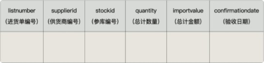
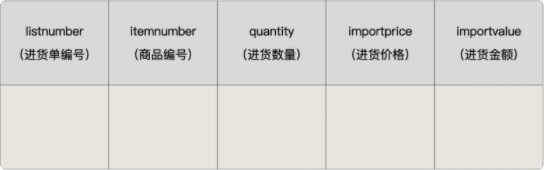

# 第15章 触发器

在实际开发中，我们经常会遇到这样的情况：有 2 个或者多个相互关联的表，如商品信息和库存信息分别存放在 2 个不同的数据表中，我们在添加一条新商品记录的时候，为了保证数据的完整性，必须同时在库存表中添加一条库存记录。

这样一来，我们就必须把这两个关联的操作步骤写到程序里面，而且要用事务包裹起来，确保这两个操作成为一个原子操作 ，要么全部执行，要么全部不执行。要是遇到特殊情况，可能还需要对数据进行手动维护，这样就很容易忘记其中的一步 ，导致数据缺失。

这个时候，咱们可以使用触发器。**你可以创建一个触发器，让商品信息数据的插入操作自动触发库存数据的插入操作。**这样一来，就不用担心因为忘记添加库存数据而导致的数据缺失了。

 

## **1.** 触发器概述

MySQL从 5.0.2 版本开始支持触发器。MySQL的触发器和存储过程一样，都是嵌入到MySQL服务器的一段程序。

触发器是由 事件来触发 某个操作，这些事件包括INSERT、UPDATE、DELETE 事件。所谓事件就是指用户的动作或者触发某项行为。如果定义了触发程序，当数据库执行这些语句时候，就相当于事件发生了，就会自动激发触发器执行相应的操作。

当对数据表中的数据执行插入、更新和删除操作，需要自动执行一些数据库逻辑时，可以使用触发器来实现。

 

## **2.** 触发器的创建

### 2.1 创建触发器语法

创建触发器的语法结构是：

 ```mysql
CREATE TRIGGER 触发器名称
{BEFORE|AFTER} {INSERT|UPDATE|DELETE} ON 表名
FOR EACH ROW
触发器执行的语句块;
 ```

说明：

+ <font style="color:rgb(232,105,0)">表名</font> ：表示触发器监控的对象。

+ <font style="color:rgb(232,105,0)">BEFORE|AFTER</font>：表示触发的时间。BEFORE 表示在事件之前触发；AFTER 表示在事件之后触发。

+ <font style="color:rgb(232,105,0)">INSERT|UPDATE|DELETE </font>：表示触发的事件。
  + INSERT 表示插入记录时触发； 
  + UPDATE 表示更新记录时触发； 
  + DELETE 表示删除记录时触发。

+ <font style="color:rgb(232,105,0)">触发器执行的语句块 </font>：可以是单条SQL语句，也可以是由BEGIN…END结构组成的复合语句块。

**范例1：**

1、创建数据表

```mysql
CREATE TABLE users(number INT, money DECIMAL(10,2));
```

2、创建触发器

```mysql
CREATE TRIGGER t_insert BEFORE INSERT ON users
FOR EACH ROW SET @sum = @sum+1;
```

3、使用触发器

在使用触发器之前，先将累加器变量设置为零，执行一条INSERT语句，然后查看该变量的值。

```mysql
SET @sum = 0;
INSERT INTO users VALUES(1,35000);
SELECT @sum;
```

### 2.2 OLD 和 NEW

在触发器正文中，OLD 和 NEW 关键字使您能够访问受触发器影响的行中的列。 OLD 和 NEW 是 MySQL 对触发器的扩展；它们不区分大小写。

在 INSERT 触发器中，只能使用 NEW.col_name；没有旧行。在 DELETE 触发器中，只能使用 OLD.col_name；没有新行。在 UPDATE 触发器中，您可以使用 OLD.col_name 来引用行更新之前的列，使用 NEW.col_name 来引用行更新后的列。

以 OLD 命名的列是只读的。您可以参考它（如果您有 SELECT 权限），但不能修改它。如果您具有 SELECT 权限，则可以引用以 NEW 命名的列。在 BEFORE 触发器中，如果您具有 UPDATE 权限，您还可以使用 SET NEW.col_name = value 更改其值。这意味着您可以使用触发器来修改要插入新行或用于更新行的值。 （这样的 SET 语句在 AFTER 触发器中无效，因为行更改已经发生。）

在 BEFORE 触发器中，AUTO_INCREMENT 列的 NEW 值为 0，而不是实际插入新行时自动生成的序列号。

**范例1：**

1、插入触发器

```mysql
-- 插入只有NEW，没有OLD
CREATE TRIGGER t_insert_val BEFORE INSERT ON users
FOR EACH ROW 
BEGIN
	#在插入之前可以通过new访问字段，并修改值(在ALTER触发器中无效)
	SET NEW.money = NEW.money - 1000;
END; 

INSERT INTO users VALUES(1,2000)
```

2、删除触发器

```mysql
-- 创建一个保存已经删除的数据的表
CREATE TABLE users_del(number INT, money DECIMAL(10,2));

-- 删除只有OLD，没有NEW
CREATE TRIGGER t_delete_val BEFORE DELETE ON users
FOR EACH ROW
BEGIN
	#把删除的记录插入到users_del表
	INSERT INTO users_del(number,money) VALUES(OLD.number,OLD.money) ;
END;

DELETE FROM users WHERE number = 5;

SELECT * FROM users;
SELECT * FROM users_del;

DELETE FROM users;
DELETE FROM users_del;
```

3、更新触发器

```mysql
-- 更新有OLD，也有NEW（更新之前）
CREATE TRIGGER t_update_val BEFORE UPDATE ON users
FOR EACH ROW
BEGIN
	#把旧数据和新数据都插入users_del表
	INSERT INTO users_del(number,money) VALUES(OLD.number,OLD.money);
	INSERT INTO users_del(number,money) VALUES(NEW.number,NEW.money);
END;

UPDATE users SET money = 100 WHERE number = 6;
```


**举例2**：定义触发器“t_sal_check”，基于员工表“emps”的INSERT事件，在INSERT之前检查    将要添加的新员工薪资是否大于他领导的薪资，如果大于领导薪资，则报sqlstate_value为'HY000'的错误，从而使得添加失败。

 ```mysql
CREATE TRIGGER t_sal_check BEFORE INSERT ON emps
FOR EACH ROW
BEGIN
	DECLARE mgr_sal INT;
	#获取插入员工的领导的薪资
	SELECT sal INTO mgr_sal FROM emps WHERE empno = NEW.mgr;
	
	IF NEW.sal > mgr_sal THEN
		SIGNAL SQLSTATE 'HY000' SET MESSAGE_TEXT = '薪资高于领导薪资-禁止插入';
	END IF;
	
END;

INSERT INTO emps(empno,job,mgr,sal) VALUES(1,'打工人',7566,3400);
INSERT INTO emps(empno,job,mgr,sal) VALUES(2,'捡垃圾',7566,3300);
 ```

上面触发器声明过程中的NEW关键字代表INSERT添加语句的新记录。

 

## 3. 查看、删除触发器

### 3.1 查看触发器

查看触发器是查看数据库中已经存在的触发器的定义、状态和语法信息等。

方式1：查看当前数据库的所有触发器的定义

```mysql
SHOW TRIGGERS;
```

方式2：查看当前数据库中某个触发器的定义

```mysql
SHOW CREATE TRIGGER 触发器名
```

方式3：从系统库information_schema的TRIGGERS表中查询指定数据库的触发器的信息。

```mysql
SELECT * FROM information_schema.TRIGGERS WHERE trigger_schema='db_14';
```


### 3.2 删除触发器

+ 触发器也是数据库对象，删除触发器也用DROP语句：
+ 如果您删除一个表，该表的所有触发器也会被删除。

```mysql
DROP TRIGGER IF EXISTS 触发器名称;
```

 

## 4. 触发器的优缺点

### 4.1 优点

#### 1、触发器可以确保数据的完整性。

假设我们用 进货单头表 （demo.importhead）来保存进货单的总体信息，包括进货单编号、供货商编号、仓库编号、总计进货数量、总计进货金额和验收日期。

 

用 进货单明细表 （demo.importdetails）来保存进货商品的明细，包括进货单编号、商品编号、进货数量、进货价格和进货金额。


  

每当我们录入、删除和修改一条进货单明细数据的时候，进货单明细表里的数据就会发生变动。这个时候，在进货单头表中的总计数量和总计金额就必须重新计算，否则，进货单头表中的总计数量和总计金额就不等于进货单明细表中数量合计和金额合计了，这就是数据不一致。

为了解决这个问题，我们就可以使用触发器，**规定每当进货单明细表有数据插入、修改和删除的操作**  **时，自动触发** **2** **步操作：**

1） 重新计算进货单明细表中的数量合计和金额合计；

2） 用第一步中计算出来的值更新进货单头表中的合计数量与合计金额。

这样一来，进货单头表中的合计数量与合计金额的值，就始终与进货单明细表中计算出来的合计数量与  合计金额的值相同，数据就是一致的，不会互相矛盾。

#### 2、触发器可以帮助我们记录操作日志

利用触发器，可以具体记录什么时间发生了什么。比如，记录修改会员储值金额的触发器，就是一个很  好的例子。这对我们还原操作执行时的具体场景，更好地定位问题原因很有帮助。

#### 3、触发器还可以用在操作数据前，对数据进行合法性检查

比如，超市进货的时候，需要库管录入进货价格。但是，人为操作很容易犯错误，比如说在录入数量的时候，把条形码录进去了；录入金额的时候，看串了行，录入的价格远超售价，导致账面上的巨亏……   这些都可以通过触发器，在实际插入或者更新操作之前，对相应的数据进行检查，及时提示错误，防止错误数据进入系统。

### 4.2 缺点

#### 1、触发器最大的一个问题就是可读性差

因为触发器存储在数据库中，并且由事件驱动，这就意味着触发器有可能 不受应用层的控制 。这对系统维护是非常有挑战的。

比如，创建触发器用于修改会员储值操作。如果触发器中的操作出了问题，会导致会员储值金额更新失  败。我用下面的代码演示一下：

```mysql
mysql> update demo.membermaster set memberdeposit=20 where memberid = 2;
ERROR 1054 (42S22): Unknown column 'aa' in 'field list'
```

结果显示，系统提示错误，字段“aa”不存在。

这是因为，触发器中的数据插入操作多了一个字段，系统提示错误。可是，如果你不了解这个触发器，  很可能会认为是更新语句本身的问题，或者是会员信息表的结构出了问题。说不定你还会给会员信息表  添加一个叫“aa”的字段，试图解决这个问题，结果只能是白费力。

#### 2、相关数据的变更，可能会导致触发器出错。

特别是数据表结构的变更，都可能会导致触发器出错，进而影响数据操作的正常运行。这些都会由于触  发器本身的隐蔽性，影响到应用中错误原因排查的效率。

### 4.3 注意点

注意，如果在子表中定义了外键约束，并且外键指定了ON UPDATE/DELETE CASCADE/SET NULL子句，此时修改父表被引用的键值或删除父表被引用的记录行时，也会引起子表的修改和删除操作，此时基于子  表的UPDATE和DELETE语句定义的触发器并不会被激活。

例如：基于员工表（emp）的DELETE语句定义了触发器t_del_emps，而emp表的部门编号（deptno）字段定 义了外键约束引用了部门表（dept）的主键列部门编号（deptno），并且该外键加了“ON DELETE SET NULL”子句，那么如果此时删除父表（部门表dept）在子表员工表（emp） 有匹配记录的部门记录时，会引起子表员工表（emp）匹配记录的部门编号（deptno）修改为NULL，

但是此时不会激活触发器t_del_emps。只有直接对子表员工表（emps）执行DELETE语句时才会激活触发器t_del_emps。