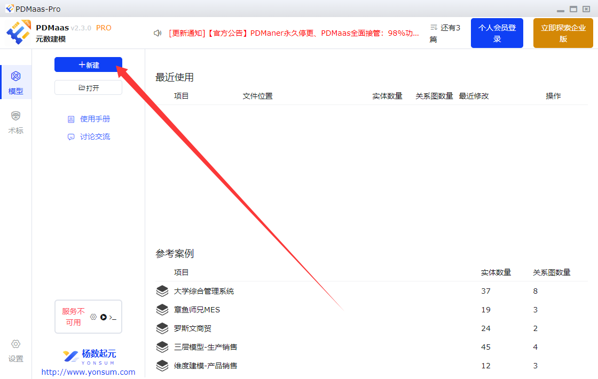
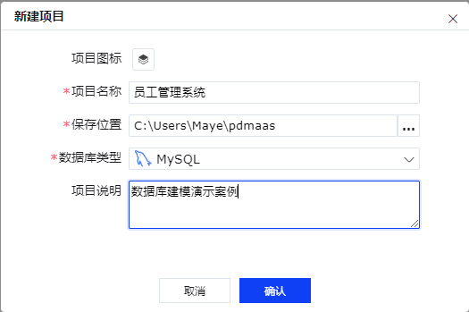
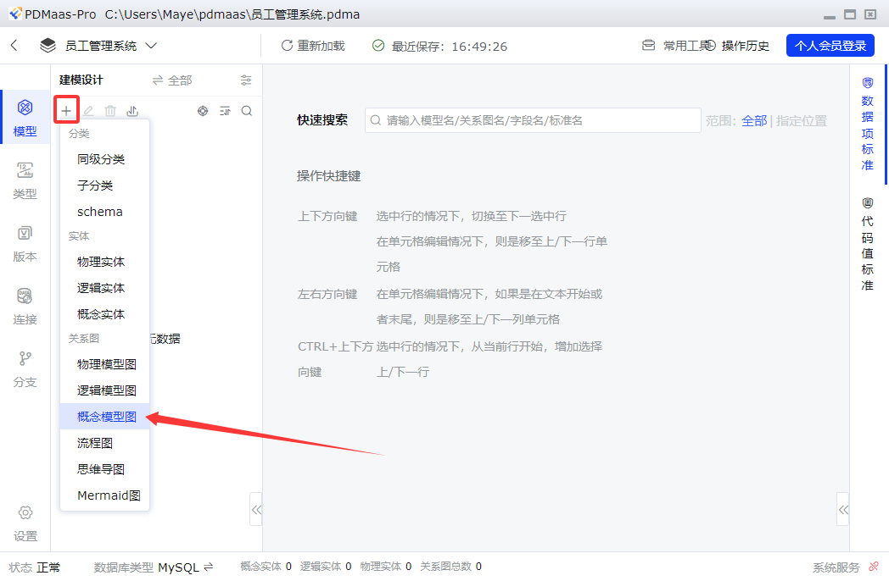
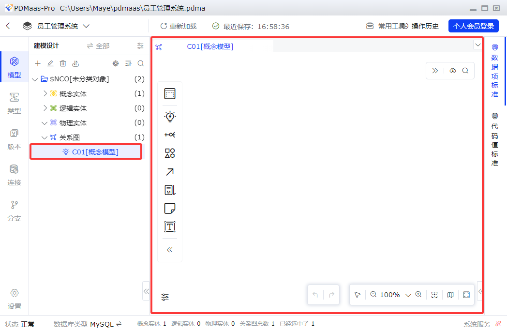
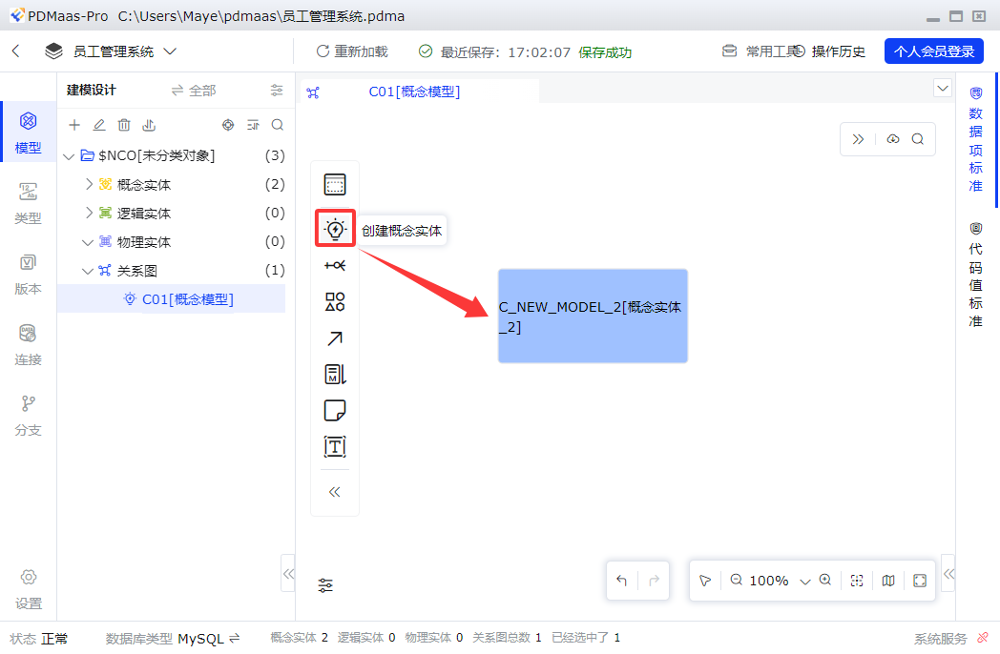
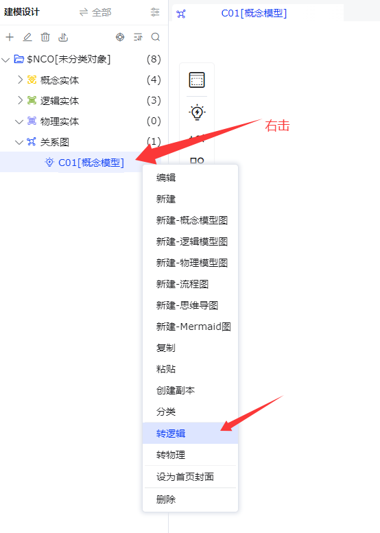
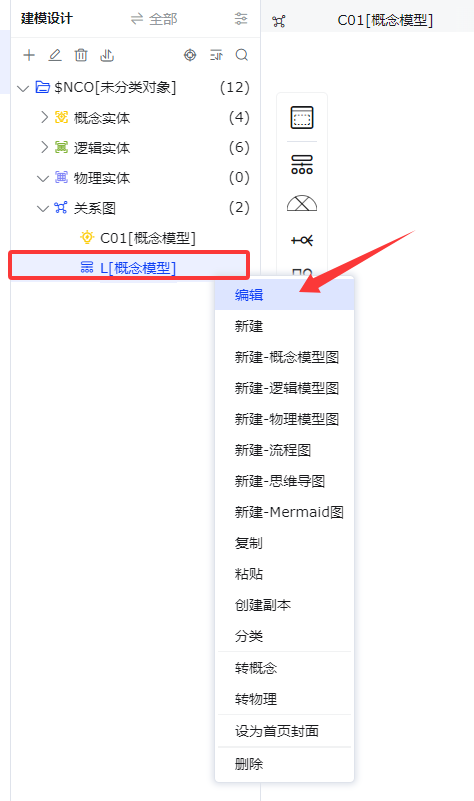
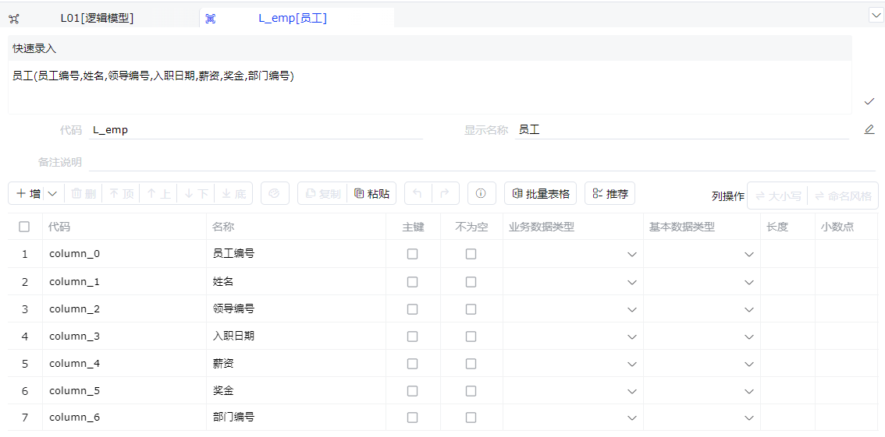

# ER图

ER图是一种图形工具，用于可视化数据库中的实体（Entity）和它们之间的关系（Relationship）。这个概念源于数据库设计的实体关系模型（Entity-Relationship Model），由彼得·钱（Peter Chen）于1976年首次提出。ER图以直观的方式呈现了数据模型的结构，帮助人们理解数据库中不同实体之间的联系。

## ER图核心元素

在深入探讨ER图之前，让我们先了解一些关键元素：

+ **实体（Entity）：**实体是数据库中的主题或对象，它可以是现实世界中的任何事物，如人、地方 、物品或概念。每个实体都有一组属性（Attributes）来描述它。
+  **属性（Attributes）：**属性是实体的特征或特性，用于描述实体。例如，一个"人"实体可以有属性如姓名、年龄、性别等。
+  **关系（Relationship）：**关系表示不同实体之间的联系或互动。关系可以是一对一、一对多或多对多的。
+  **主键（Primary Key）：**主键是用来唯一标识实体的一个或一组属性。它保证了每个实体都有唯一的标识。

## ER图的符号和表示法

为了创建ER图，我们需要了解它的符号和表示法。以下是一些常见的符号：

+ **实体用矩形**表示，矩形内写上实体的名称。
+ **属性用椭圆**形表示，椭圆内写上属性的名称。
+ **关系用菱形**表示，菱形内写上关系的名称。
+ 实体与关系之间用**无箭头实线**连接，线条可以用来连接实体、属性和关系，表示它们之间的联系。

如下，学生选课系统ER图：

# 数据建模

数据库建模是一个将现实世界的业务需求转化为数据库结构的过程，它通常包括**概念模型**、**逻辑模型**和**物理模型**三个阶段。这三个阶段从抽象到具体，逐步细化，最终形成可以在数据库系统中实现的结构。

通过这三个阶段的建模，可以确保数据库结构既能满足业务需求，又能保证数据的完整性和效率。每个阶段都是基于前一个阶段的结果进行的，确保了整个建模过程的连贯性和系统性。

## 概念模型（CDM）

概念模型（Conceptual Data Model）是数据库建模的第一步，它关注于识别出业务需求中的**核心实体以及实体之间的关系**。在这个阶段，不涉及实体的具体属性和主键的定义，而是专注于实体间的高层次关系。概念模型通常使用**E-R图**来表示，它包括**实体（Entity）**、**属性（Property）**和关系**（Relationship）**。

它主要沟通的对象是**业务人员、领域专家和系统分析师**，用于确保对业务需求的理解一致。

例如，在开发一个校园管理系统时，概念模型会识别出学生、班级和老师这些核心实体，以及它们之间的归属关系，如班级与学生的一对多关系，老师与班级的多对多关系等。

### 核心目标

概念数据模型的核心目标可以概括为以下四点：

1. **捕捉和定义业务需求与规则**
   - 这是其最根本的目标。通过与业务方沟通，将模糊的业务需求（如“客户可以下订单”、“一个订单包含多个产品”）转化为清晰、无歧义的图形化表示。
   - 明确业务中需要管理的“事物”（实体）以及它们之间如何相互作用（关系）。
2. **在业务和技术团队之间建立沟通桥梁**
   - 提供一种双方都能理解的“通用语言”。业务人员能看懂ER图中的实体和关系，技术人员能据此进行后续的数据库设计。
   - 减少因理解偏差导致的返工和错误。
3. **为逻辑和物理数据模型奠定坚实基础**
   - CDM是后续**逻辑数据模型**（细化属性、规范化）和**物理数据模型**（针对具体DBMS优化）的蓝图和依据。
   - 一个稳固的概念模型能确保后续的设计始终围绕正确的业务核心展开。
4. **识别核心业务实体及其关系，形成全局视图**
   - 帮助项目团队从宏观上理解业务领域，避免早期陷入细节。
   - 可以识别出业务流程中的关键数据对象（如客户、产品、合同、订单等）以及它们之间最重要的联系。

### 设计步骤

设计概念数据模型是一个迭代的过程，通常遵循以下步骤：

**步骤1：需求收集与分析**

- **活动**：通过访谈、研讨会、文档分析（如业务流程、报表、表单）等方式，全面收集业务需求。
- **关键问题**：
  - 业务要解决什么问题？
  - 需要管理和记录哪些“东西”？（例如：人员、地点、物品、事件、概念）
  - 这些“东西”之间有什么业务规则？（例如：一个客户可以有多个订单，但一个订单只能属于一个客户。）
- **产出**：业务需求文档、术语表。

**步骤2：识别实体**

- **活动**：从收集到的需求中，找出需要被持久化记录的核心业务对象或概念。实体通常是名词或名词短语。
- **例如**：在销售系统中，核心实体可能包括：`客户`、`产品`、`订单`、`员工`、`供应商`等。
- **注意**：实体代表一类事物，而非单个实例（如“客户”是一个实体，“张三”是一个实例）。

**步骤3：识别实体间的重要关系**

- **活动**：分析实体之间存在的、具有业务意义的关联。关系通常是动词或动词短语。
- **例如**：`客户` **下达** `订单`， `产品` **被包含在** `订单`中。
- **定义关系的基数**：明确关联的数量关系，这是业务规则的核心。
  - **一对一**：一个`员工`对应一个`员工档案`。
  - **一对多**：一个`客户`可以下达多个`订单`。
  - **多对多**：一个`订单`可以包含多个`产品`，一个`产品`也可以出现在多个`订单`中。（在概念模型中可以直接表示，在逻辑模型中需要分解）

**步骤4：识别实体的关键属性**

- **活动**：为每个实体定义描述其特征的属性。在概念阶段，**只关注核心的、能够标识实体或对业务有重要意义的属性**，无需列出全部细节。
- **关键属性通常包括**：
  - **标识符**：能唯一确定一个实体实例的属性（如 `客户ID`、`订单编号`）。
  - **描述性属性**：核心特征（如 `客户姓名`、`产品名称`、`订单日期`）。
- **注意**：避免添加技术性、计算性或衍生属性。

**步骤5：绘制实体-关系图**

- **活动**：使用标准的ER图符号（如Chen表示法、Crow‘s Foot表示法）将步骤2-4的结果可视化。
  - **矩形**代表实体。
  - **菱形**或**连线**代表关系。
  - **椭圆**或直接在矩形内列出关键属性。
  - **连线上的标记**（如 1, M）表示关系的基数。
- **工具**：可以使用绘图工具（如Lucidchart, [Draw.io](https://draw.io/)）、专业建模工具（如 ERwin, PowerDesigner, PDMaas）或简单的白板。

**步骤6：评审与验证**

- **活动**：与业务领域专家和项目干系人一起评审ER图。
- **关键问题**：
  - 模型是否准确地反映了业务现实？
  - 是否遗漏了重要的实体或关系？
  - 所有的业务规则（特别是关系的基数）是否正确？
- **迭代**：根据反馈进行修改和优化，直到各方达成共识。

**步骤7：定稿与文档化**

- **活动**：生成最终版本的概念数据模型图，并辅以必要的文字说明，形成正式文档。
- **文档内容**：应包括模型图、每个实体和关系的详细定义、关键假设和重要的业务规则说明。

## 逻辑模型（LDM）

逻辑模型（Logical Data Model）是在**概念模型的基础上进一步细化**的阶段。在这个阶段，每个实体会被赋予具体的属性，同时定义实体的**主键和实体间的关系**约束。逻辑模型还需要遵循数据库范式原则，以减少数据冗余并保证数据一致性。

在逻辑模型阶段，例如对于班级这个实体，我们会定义班级ID、班级名称等属性，并确定这些属性的数据类型和约束。多对多的关系，如老师与班级的关系，通常需要通过建立关系表来处理。

### 核心目标

逻辑数据模型的五大核心目标如下：

1. **细化并结构化业务需求**
   - 将概念模型中高层次的业务实体和关系，转化为精确、详细、无歧义的数据结构。
   - 明确定义所有**属性、数据类型、长度、约束**，使业务规则数据化、具体化。
2. **实现数据结构的规范化**
   - 应用**规范化理论**（通常到第三范式或更高），消除数据冗余、更新异常、插入异常和删除异常。
   - 确保数据的**一致性、完整性**和**高效存储**，这是高质量数据库设计的理论基础。
3. **建立完整的数据规则与完整性约束**
   - 定义**主键、外键、候选键**。
   - 明确**属性级的约束**（如非空、唯一性、默认值、值域检查）。
   - 定义**关系间的参照完整性规则**（如级联更新/删除、限制等）。
4. **为物理数据库设计提供直接输入**
   - LDM是所有关系型数据库（如Oracle, MySQL, PostgreSQL）和许多非关系型数据库设计的直接前提。
   - 物理设计人员可以几乎直接地将LDM中的实体映射为表，关系映射为外键，并根据性能需求进行反规范化等调整。
5. **促进跨系统和集成的数据理解**
   - 由于LDM独立于技术实现，它可以作为不同系统间数据交换和集成的**共享语义模型**，确保各方对数据含义和关系理解一致。

### 设计步骤

设计逻辑数据模型是一个承上启下的精细过程，通常遵循以下步骤：

**步骤1：细化实体，定义其为逻辑表**

- **活动**：将概念模型中的每个“实体”明确定义为逻辑模型中的“逻辑表”。
- **关键任务**：
  - 为每个表确定一个清晰的、符合规范的名称。
  - 确保每个实体都代表一个单一、明确的主题。

**步骤2：细化属性，定义其为表的列**

- **活动**：为每个逻辑表定义其详细的列（字段）。
- **关键任务**：
  - **补充所有属性**：从业务文档中挖掘出概念阶段未列出的所有必要属性。
  - **定义数据类型**：如字符型、数值型、日期型、布尔型等（使用逻辑类型，如 `STRING`，`INTEGER`，`DATE`，而非 `VARCHAR(50)` 等物理类型）。
  - **定义数据精度/长度**：如字符串的最大长度，数值的精度和小数位。
  - **标识键**：
    - **主键**：确定能唯一标识表中每一行的列或列组合。
    - **候选键/备用键**：具有唯一性但未被选为主键的列。
    - **外键**：明确指向其他表主键的列，用以建立关系。
  - **定义约束**：
    - `NULL/NOT NULL`：列是否允许为空值。
    - `UNIQUE`：列值是否必须唯一。
    - `DEFAULT`：列的默认值。
    - **值域/检查约束**：定义有效的取值范围（如 `状态 IN (‘待支付’， ‘已发货’， ‘已完成’)`）。

**步骤3：解析多对多关系**

- **活动**：这是逻辑模型的关键一步。概念模型中的 `M:N` 关系在关系型逻辑模型中**无法直接实现**，必须通过引入**关联实体**来分解。
- **方法**：创建一个新的逻辑表（通常称为“交叉表”或“联结表”）。该表的主键通常由原两个实体的外键组合构成，并可包含关系本身的属性。
  - **概念模型**：`学生` ← M:N → `课程`
  - **逻辑模型**：`学生表` ← 1:N → `选课记录表` ← N:1 → `课程表`
  - `选课记录表` 包含列：`学生ID`（FK）， `课程ID`（FK）， `选课日期`， `成绩`。

**步骤4：应用数据规范化**

- **活动**：系统地应用规范化规则，检查并优化表结构。
- **常用级别**：
  - **第一范式**：确保每列都是原子的，不可再分；每行有唯一标识（主键）。
  - **第二范式**：确保所有非主键列都**完全依赖于**整个主键（针对组合主键）。
  - **第三范式**：确保所有非主键列都**直接依赖于**主键，消除传递依赖。
- **目的**：通过分解表来消除冗余和异常，得到稳定、灵活的数据结构。

**步骤5：定义详细的业务规则与关系**

- **活动**：精确描述表与表之间的关系。
- **关键任务**：
  - **明确基数**：用精确的符号（如 `(1,1)` 和 `(0,N)`）或文字描述关系的强制性（是否可选）和数量。
  - **定义参照完整性动作**：当父表记录被更新或删除时，子表记录应如何处理？
    - `RESTRICT` / `NO ACTION`：禁止操作。
    - `CASCADE`：级联操作。
    - `SET NULL`：将外键设为空。
    - `SET DEFAULT`：将外键设为默认值。

**步骤6：评审与验证**

- **活动**：与业务代表（确认是否满足需求）和技术团队（确认是否合理可行）共同评审LDM。
- **验证要点**：
  - **数据完整性**：能否支持所有必要的业务查询和报表？
  - **业务规则覆盖**：所有规则是否都已体现在约束和关系中？
  - **规范性**：是否已充分规范化？是否存在明显的性能隐患？
  - **可扩展性**：未来业务变更是否容易纳入？

**步骤7：生成逻辑数据模型文档**

- **活动**：创建最终的、标准化的交付物。
- **文档内容**：
  - **完整的实体关系图**（通常使用更偏向表的符号，如“鸡爪图”）。
  - **数据字典**：这是核心，列出**每个表的详细定义**，包括表名、表说明、以及**每一列的名称、数据类型、是否为空、默认值、约束、业务含义说明**。
  - **关系与约束说明**：详细描述每个外键关系及其完整性规则。
  - **重要的业务规则说明**。

## 物理模型（PDM）

物理模型（Physical Data Model）阶段是**将逻辑模型转换为具体的数据库实现**的过程。在这个阶段，确定如何将逻辑模型中的实体、关系和属性映射到数据库的表、主键和外键。此外，还需要考虑数据库表字段的其他特性，如默认值、是否非空、触发器等。

例如，逻辑模型中的班级实体将转换为数据库中的班级信息表，其中包括了字段的数据类型、长度、是否可以为空、默认值等物理特性。此外，还可能根据技术需求对模型进行必要的调整，如添加冗余字段或创建额外的数据库表。

在物理模型阶段完成后，可以直接生成DDL（Data Definition Language）语句，用于在数据库系统中创建所需的表和结构。

### 核心目标

物理数据模型的六大核心目标如下：

1. **实现性能优化**
   - 这是PDM最核心、最区别于LDM的目标。它的一切设计决策都围绕**提升数据存取效率**展开。
   - 通过索引、分区、聚簇、物化视图等手段，针对高频、关键的业务操作（如查询、插入）进行针对性优化。
2. **确保数据完整性、安全性与可恢复性**
   - 在数据库层面实施数据完整性约束（如主键、外键、检查约束、触发器）。
   - 规划数据安全策略（如用户权限、视图、加密列）。
   - 考虑备份与恢复需求，影响表空间和文件组的规划。
3. **高效管理存储资源**
   - 根据数据量、增长预测和访问模式，设计合理的物理存储结构。
   - 包括表空间/文件组规划、数据文件位置、存储引擎选择、数据类型映射、大对象存储策略等，以平衡I/O性能和磁盘空间。
4. **为特定数据库管理系统进行定制与映射**
   - 将逻辑模型中通用的数据类型、结构转换为**目标DBMS**所支持的具体类型和特性（如Oracle的序列、SQL Server的标识列、MySQL的存储引擎选项）。
   - 充分利用特定DBMS的高级功能（如Oracle的位图索引、PostgreSQL的数组类型）。
5. **生成可执行的数据库构建脚本**
   - PDM的最终输出是**DDL脚本**，可以直接在目标数据库中创建或修改表、索引、约束等所有对象。
   - 确保脚本的准确性、可重复性和版本可控。
6. **指导部署与运维**
   - 为DBA提供初始的数据库配置、性能调优和容量规划的基线依据。

### 设计步骤

这是一个将理论化的逻辑设计转化为可落地、高性能的物理实现的过程。

**步骤1：确定目标DBMS与环境**

- **活动**：明确数据库产品（如Oracle 19c, MySQL 8.0, PostgreSQL 14）及其版本，了解部署的硬件环境（如磁盘类型、内存大小）。
- **关键决策**：选择存储引擎（如MySQL的InnoDB vs MyISAM）、表空间管理等基础架构。

**步骤2：表与列的物理映射**

- **活动**：将逻辑表映射为物理表，逻辑列映射为物理列。
- **关键任务**：
  - **命名转换**：遵循团队或DBMS的命名规范（如大小写、分隔符）。
  - **数据类型映射**：将逻辑类型（`STRING`, `INTEGER`）转换为具体物理类型（`VARCHAR(255)`, `NVARCHAR(50)`, `INT`, `BIGINT`, `NUMBER(10,2)`），需考虑存储空间和精度。
  - **处理大对象**：决定`BLOB`, `CLOB`, `TEXT` 或文件系统存储策略。
  - **列属性设置**：`DEFAULT`值、`AUTO_INCREMENT` / `IDENTITY`（自增列）、`COMPRESSED`（压缩）等。

**步骤3：定义物理键与索引策略**

- **活动**：设计主键、外键和各类索引以实现性能目标。
- **关键任务**：
  - **主键设计**：选择具体的主键列和类型（自然键还是代理键/序列？），并决定其物理组织（如索引组织表）。
  - **外键实现**：明确是否在数据库层面启用外键约束，并定义`ON UPDATE`和`ON DELETE`的具体动作（`CASCADE`, `SET NULL`, `RESTRICT`）。
  - **索引设计**（核心）：
    - **哪些列需要索引？**：高频查询的WHERE条件列、JOIN列、ORDER BY/GROUP BY列。
    - **索引类型选择**：B-tree（默认）、位图索引（低基数列）、全文索引、哈希索引、空间索引等。
    - **复合索引设计**：列的顺序至关重要，应遵循最左前缀匹配原则。
    - **唯一索引与非唯一索引**：根据业务规则确定。
    - **索引存储选项**：填充因子、表空间位置、是否分区。

**步骤4：进行反规范化设计（有目的的冗余）**

- **活动**：**在规范化模型的基础上**，为了**性能**而**谨慎地**引入可控的数据冗余。
- **常用技术**：
  - **增加冗余列**：将常用查询中的关联字段（如名称）直接加入主表，避免JOIN。
  - **创建派生列**：存储计算结果（如订单总金额），避免实时聚合计算。
  - **使用汇总表/物化视图**：为复杂报表预先计算和存储聚合数据。
  - **表的分割**：
    - **水平分割/分区**：按时间、范围等将大表分成多个物理部分。
    - **垂直分割**：将频繁访问的列与不常访问的列（如长文本、LOB）分开存储。
- **关键原则**：必须有明确的性能收益，并建立同步机制（通过触发器、应用逻辑或ETL任务）来维护冗余数据的一致性。

**步骤5：规划存储结构与分区**

- **活动**：设计数据在磁盘上的物理组织方式。
- **关键任务**：
  - **表空间/文件组规划**：将不同的表、索引分配到不同的物理文件组，以分散I/O负载。
  - **分区设计**：对大表进行分区（如按日期范围），可以极大提升查询和维护性能（分区修剪）。
  - **聚簇设计**：在Oracle中，将相关表的数据物理存储在一起（聚簇表）；在SQL Server/MySQL中，指索引组织表。

**步骤6：定义安全、备份与审计策略**

- **活动**：在模型层面考虑非功能性需求。
- **关键任务**：
  - **权限规划**：设计角色、用户组，规划表和列的访问权限。
  - **视图设计**：创建视图以简化复杂查询或隐藏敏感数据。
  - **审计需求**：确定哪些表需要记录数据变更历史，可能引入审计跟踪表或启用数据库审计功能。
  - **备份策略影响**：考虑表的数据量和更新频率，影响备份恢复方案。

**步骤7：生成DDL脚本与部署文档**

- **活动**：将最终设计转化为可执行的代码和指导文档。
- **关键产出**：
  - **完整的DDL脚本**：按正确顺序创建所有数据库对象（表、约束、索引、视图、序列、存储过程等）。
  - **初始化数据脚本**：如代码表、默认配置数据的插入脚本。
  - **物理模型图**：展示表、列、键和主要索引的图表。
  - **部署与配置指南**：说明执行顺序、参数设置等。

**步骤8：性能模拟与评审**

- **活动**：在可能的情况下，对关键数据量和查询进行压力测试或模拟。
- **验证要点**：评估索引有效性、分区策略、SQL执行计划是否达到预期性能目标。

## 总结

通过这三个阶段的建模，可以确保数据库结构既能满足业务需求，又能保证数据的完整性和效率。每个阶段都是基于前一个阶段的结果进行的，确保了整个建模过程的连贯性和系统性。

# PDMaas的使用

PDMaas是一款优秀的国产数据建模工具，所有操作系统都能用，主打轻便好看效率高。它能帮你：

1. 拖拽画数据表和ER关系图，概念/逻辑/物理三层建模
2. 把流程图、思维导图整合到一起看
3. 主流数据库（如MySQL、PostgreSQL）、国产数据库、大数据MPP库全兼容
4. 有标准字段库和枚举代码库
5. 自动生成Word、HTML、Markdown文档和Java/Python等代码
6. 模型和数据库双向同步，自动生成DDL差异脚本
7. 支持多版本管理，便捷追溯模型历史变更

- **核心定位**：社区开源版（CE）面向开发者，支持全流程数据模型设计与管理。
- **适用场景**：开发者、技术爱好者

## 下载与安装

进入官网[PDMaas数据建模](https://www.pdmaas.cn/Download)下载。

在接下来进入的下载页面中，选择百度网盘下载！

安装就不用多说了，直接安装即可！

## 创建项目

进入开始界面，点击新建一个项目。

输入项目名称、选择保存位置、数据库以及项目说明，点击确定！！！

这样就创建好了一个项目。

## 数据模型

我们可以把数据建模想象成盖房子的设计过程。接下来，我们就从描绘业务蓝图的**概念模型**开始，逐步细化为技术设计的**逻辑模型**，最终落地为可执行的**物理模型**。

### 概念数据模型

#### 创建模型

点击左侧`+`按钮，选择概念模型图，创建概念模型：

然后输入模型图的代码和现实名称即可，代码不能是中文！

然后就能在左边看到模型了，右边就是模型图设计区域：

#### 创建实体

接下来，在概念模型图上创建实体，点击侧边栏的创建概念实体按钮，然后拖到设计器中，即可看到实体：

然后双击实体，即可修改文本和样式了：

修改后的实体如下：

按照员工实体的方式，创建部门实体和薪资等级实体：

#### 创建实体关系

用箭头将实体连接起来，并标明关系：

### 逻辑数据模型

#### 概念模型转为逻辑模型

你可以新建逻辑数据模型，也可以直接从概念数据模型进行转换！

这里就直接默认(自动重命名创建新模型)即可：

然后将逻辑实体代码前面的C替换为L即可(实体代码一定要和概念实体代码不一样)，然后点击开始转换：

新创建出来的逻辑模型，名字不太好，右击然后选择编辑，修改一下：

#### 给逻辑实体添加字段

默认创建的逻辑实体如下，直接双击逻辑实体，进去编辑界面即可！

有两种方式可以录入字段，分为快速录入和单字段录入：

**快速录入**

在编辑界面的最上面有快速录入的编辑框，每个字段之间使用逗号分隔，输入完成后点击右下角的`√`按钮：

然后就能在下面看到所有的字段了，当然字段代码是默认生成的：

### 物理数据模型

