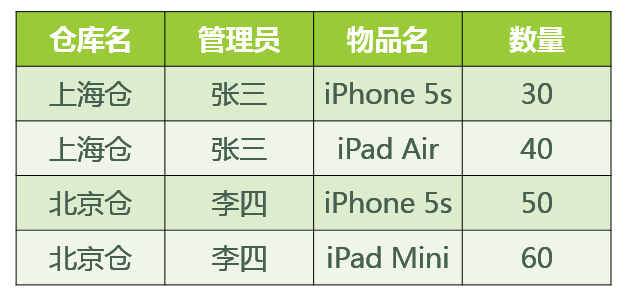

# 数据库的设计规范

## **1.** 为什么需要数据库设计  

**我们在设计数据表的时候，要考虑很多问题。**比如:

+ 用户都需要什么数据?需要在数据表中保存哪些数据?
+ 如何保证数据表中数据的正确性，当插入、删除、更新的时候该进行怎样的约束检查?。
+ 如何降低数据表的数据冗余度，保证数据表不会因为用户量的增长而迅速扩张?
+ 如何让负责数据库维护的人员更方便地使用数据库?
+ 使用数据库的应用场景也各不相同，可以说针对不同的情况，设计出来的数据表可能千差万别。

**现实情况中，面临的场景:**

+ 当数据库运行了一段时间之后，我们才发现数据表设计的有问题。重新调整数据表的结构，就需要做数据迁移，还有可能影响程序的业务逻辑，以及网站正常的访问。

**如果是糟糕的数据库设计可能会造成以下问题:**

+ 数据冗余、信息重复，存储空间浪费
+ 数据更新、插入、删除的异常
+ 无法正确表示信息
+ 丢失有效信息。
+ 程序性能差

**良好的数据库设计则有以下优点:**

+ 节省数据的存储空间
+ 能够保证数据的完整性Ⅰ
+ 方便进行数据库应用系统的开发

总之，开始设置数据库的时候，我们就需要重视数据表的设计。为了建立冗余较小、结构合理的数据库，设计数据库时必须遵循一定的规则。

## 2. 范 式

### 范式简介

**在关系型数据库中，关于数据表设计的基本原则、规则就称为范式。**可以理解为，一张数据表的设计结  构需要满足的某种设计标准的级别 。要想设计一个结构合理的关系型数据库，必须满足一定的范式。

目前关系数据库有七种范式，其中第三范式应用最广泛，从低到高分别是：

- **第一范式（1NF）：**拆分复合字段，确保每列的原子属性。
- **第二范式（2NF）：**在第一范式基础之上，要求表中的每列都完全依赖于所有主属性，消除部分依赖。
- **第三范式（3NF）：**在第二范式基础之上，要求每列都和主属性直接相关，而不是间接相关，消除传递依赖。
- **鲍依斯-科得（Boyce-Codd）范式（BCNF）：**在第三范式基础之上，进一步消除部分依赖和传递依赖，要求主属性不依赖于主属性。
- **第四范式（4NF）：**在 Boyce-Codd 范式基础之上，消除多值依赖，要求表中非主属性不能存在多值。
- **第五范式（5NF）：**在第四范式基础之上，消除连接依赖，处理相互依赖的多值情况。
- **第六范式（6NF）：**在第五范式基础之上，要求表中每个事实都与时间维度相关联，且每个表只包含一个时间的事实，以支持时间序列数据分析查询、历史数据追踪、复杂数据依赖的场景。

项目开发过程中，通常会要求数据库设计符合第三范式，而 BCNF 可以看作是对第三范式的补充。

4NF、5NF、6NF 一般只在处理特殊场景时，例如处理多值依赖、支持时间序列数据分析查询时才会得到应用。

### 键和相关属性的概念

在关系数据库中，**键（Key）**是用于唯一标识表中元组（行）的一个或多个属性集合，也是建立表间关系和保证数据完整性的重要机制。

+ **超键（Super Key）** 能够唯一标识元组的属性集称为超键，可以是单个属性，也可以是多个属性的组合。例如（学号）或（学号, 姓名）都可能是超键。超键可能包含多余属性。

+ **候选键（Candidate Key）** 候选键是**最小超键**，即在保证唯一性的前提下不包含多余属性。例如（学号）是候选键，但（学号, 姓名）若学号已唯一，则不是候选键。

+ **主键（Primary Key）** 从候选键中选定一个作为主键，用于唯一标识记录。主键必须**唯一且非空**，一个表只能有一个主键。例如学生表中的学号字段。

+ **外键（Foreign Key）** 外键是一个表中的属性，它引用另一个表的主键，用于建立表间关系并保证**参照完整性**。例如订单表中的CustomerID引用客户表的CustomerID。

+ **代理键（Surrogate Key）与自然键（Natural Key）**

  - **代理键：**无业务含义，由系统生成（如自增ID），适合主键不稳定或过长的场景。

  - **自然键：**来源于现实世界的唯一标识（如身份证号），直观但可能变更或冗长。

**举例：**

这里有两个表：

球员表：球员编号 | 姓名 | 身份证号 | 年龄 | 球队编号

球队表(team) ：球队编号 | 主教练 | 球队所在地

+ 超键 ：对于球员表来说，超键就是包括球员编号或者身份证号的任意组合，比如（球员编号）（球员编号，姓名）（身份证号，年龄）等。
+ 候选键 ：就是最小的超键，对于球员表来说，候选键就是（球员编号）或者（身份证号）。
+ 主键 ：我们自己选定，也就是从候选键中选择一个，比如（球员编号）。
+ 外键 ：球员表中的球队编号。
+ 主属性 、 非主属性 ：在球员表中，主属性是（球员编号）（身份证号），其他的属性（姓名）（年龄）（球队编号）都是非主属性。

### 函数依赖

**函数依赖**是数据库设计中的核心概念，用于描述表中**属性之间的关系**。若属性集`X`的值唯一决定属性集`Y`的值，则称Y函数依赖于X，记为X → Y。这种依赖关系在数据库规范化中至关重要。

+ **完全函数依赖**指Y完全依赖于X的所有属性组合。例如，在关系模式(Sno, Cno, Grade)中，成绩Grade完全依赖于学号Sno和课程号Cno的组合，单独的Sno或Cno无法确定Grade。

+ **部分函数依赖**是指Y依赖于X，但仅依赖于X的部分属性。例如，在(Sno, Cno, Sname)中，学生姓名Sname仅依赖于学号Sno，而不需要依赖课程号Cno。

+ **传递函数依赖**是指若X → Y，且Y → Z，则X通过Y传递决定Z。例如，在(Sno, Sdept, Mname)中，学号Sno决定系名Sdept，系名Sdept决定系主任姓名Mname，因此Sno传递决定Mname。

> 当我们讨论 **X→Y** 时，如果 **Y 是 X 的子集**（即 **Y ⊆ X**），这种依赖被称为 **平凡函数依赖**。

**阿姆斯特朗公理**是函数依赖推理的基本规则，包括：

- **自反律**：若Y是X的子集，则X → Y。
- **增广律**：若X → Y，则X和Z的组合也决定Y和Z的组合。
- **传递律**：若X → Y且Y → Z，则X → Z。

通过理解这些函数依赖及其类型，可以优化数据库设计，消除冗余和异常，确保数据的完整性和一致性。

## 3 第一范式(1stNF)

**第一范式（First Normal Form）** 要求数据库表中的每一列都是**不可再分的基本数据项**，且**每一行都有唯一标识**（主键）。简单来说，就是：

1. **列不可再分**（原子性）
2. **每行有唯一标识**
3. **列值单一**（同一列中不能有多个值）

### 案例一、订单表设计（违反1NF）

```sql
-- 违反1NF的表设计
CREATE TABLE Orders (
    order_id INT,
    customer_name VARCHAR(50),
    order_date DATE,
    products VARCHAR(200),  -- 多个产品用逗号分隔
    quantities VARCHAR(100), -- 多个数量用逗号分隔
    total_price DECIMAL(10,2)
);

-- 示例数据
INSERT INTO Orders VALUES 
(1, '张三', '2023-10-01', '手机,耳机,充电宝', '1,2,1', 2500.00),
(2, '李四', '2023-10-02', '笔记本电脑,鼠标', '1,2', 6500.00);
```

#### 问题分析

1. **`products` 列包含多个值**：存储了"手机,耳机,充电宝"等多个产品
2. **`quantities` 列包含多个值**：存储了"1,2,1"等多个数量
3. **数据操作困难**：
   - 难以查询购买了特定产品的订单
   - 难以统计某个产品的总销量
   - 更新单个产品信息困难
   - 无法确保数据完整性

#### 解决方案

将包含多个值的列进行拆分，标准的解决方案是创建一个订单详细表，存储此订单中不同的产品。

```sql
-- 符合1NF的订单主表
CREATE TABLE Orders_1NF (
    order_id INT PRIMARY KEY,
    customer_name VARCHAR(50),
    order_date DATE,
    total_price DECIMAL(10,2)
);

-- 符合1NF的订单详情表
CREATE TABLE OrderDetails (
    detail_id INT PRIMARY KEY AUTO_INCREMENT,
    order_id INT,
    product_name VARCHAR(50),
    quantity INT,
    price DECIMAL(10,2),
    FOREIGN KEY (order_id) REFERENCES Orders_1NF(order_id)
);

-- 示例数据
INSERT INTO Orders_1NF VALUES 
(1, '张三', '2023-10-01', 2500.00),
(2, '李四', '2023-10-02', 6500.00);

INSERT INTO OrderDetails (order_id, product_name, quantity, price) VALUES
(1, '手机', 1, 2000.00),
(1, '耳机', 2, 400.00),
(1, '充电宝', 1, 100.00),
(2, '笔记本电脑', 1, 6000.00),
(2, '鼠标', 2, 500.00); 
```

### 案例二、原子性的相对性

属性的原子性是主观的 。例如，emp关系中雇员姓名应当使用1个（fullname）、2个（firstname 和lastname）还是3个（firstname、middlename和lastname）属性表示呢？答案取决于应用程序。如果应   用程序需要分别处理雇员的姓名部分（如：用于搜索目的），则有必要把它们分开。否则，不需要。

#### 单个 fullname 列（在某些场景下仍符合1NF）

```sql
CREATE TABLE Employees (
    emp_id INT PRIMARY KEY,
    fullname VARCHAR(100)  	-- 如 "John David Smith"
);
```

- **符合1NF的情况**：如果应用程序**从不**需要单独处理姓、名、中间名（如只在报表中完整显示）。
- **此时 `fullname` 就是业务上的“原子单位”**。

#### 拆分为first_name, last_name

```sql
CREATE TABLE Employees (
    emp_id INT PRIMARY KEY,
    first_name VARCHAR(50),
    last_name VARCHAR(50)
);
```

- **当需要**：按姓氏排序/分组、按姓氏查询、个性化问候（"Dear John"）时。
- **此时姓和名在业务上不是原子的**。

#### 拆分为first_name, middle_name, last_name

```sql
CREATE TABLE Employees (
    emp_id INT PRIMARY KEY,
    first_name VARCHAR(50),
    middle_name VARCHAR(50),
    last_name VARCHAR(50)
);
```

- **当需要**：法律文件、正式文档、某些文化背景下的精确称呼时。

### 总结

第一范式是数据库设计的基础要求，确保数据的**原子性**和**结构性**。虽然简单的应用可能暂时容忍违反1NF的设计，但随着数据量增长和业务复杂度提高，违反1NF的设计会导致：

- 查询困难
- 数据不一致
- 维护成本增加
- 扩展性差

合理应用1NF原则，是构建健壮、可维护数据库系统的第一步。

## 4 第二范式(2nd NF)

**第二范式**要求：首先满足1NF，然后**所有非主属性完全函数依赖于整个主键**（不能存在部分函数依赖）

**关键概念**：

- **部分函数依赖**：非主属性只依赖于**部分**主键（在复合主键情况下）
- **完全函数依赖**：非主属性依赖于**整个**主键

### 案例一：学生选课系统（违反2NF）

```sql
CREATE TABLE StudentCourses (
    -- 复合主键
    student_id INT,
    course_id INT,
    
    -- 学生信息
    student_name VARCHAR(50),
    student_major VARCHAR(50),
    
    -- 课程信息
    course_name VARCHAR(100),
    course_credit INT,
    instructor VARCHAR(50),
    
    -- 选课信息
    grade DECIMAL(4,2),
    semester VARCHAR(20),
    
    PRIMARY KEY (student_id, course_id, semester)
);
```

**示例数据：**

| student_id | student_name | student_major | course_id | course_name | course_credit | instructor | grade | semester |
| :--------- | :----------- | :------------ | :-------- | :---------- | :------------ | :--------- | :---- | :------- |
| 1001       | 张三         | 计算机科学    | CS101     | 数据库系统  | 3             | 王老师     | 85.5  | 2023秋季 |
| 1001       | 张三         | 计算机科学    | CS102     | 数据结构    | 4             | 李老师     | 90.0  | 2023秋季 |
| 1002       | 李四         | 软件工程      | CS101     | 数据库系统  | 3             | 王老师     | 78.0  | 2023秋季 |
| 1001       | 张三         | 计算机科学    | CS101     | 数据库系统  | 3             | 王老师     | 88.0  | 2024春季 |

#### 问题分析

主要是要识别是否存在部分函数依赖。

1. **完全函数依赖**（依赖于整个主键）：
   -  `(student_id, course_id, semester)`→  `grade`✓
     - （学生+课程+学期共同决定**成绩**）
2. **部分函数依赖**（只依赖于部分主键）：
   - `student_id` → `student_name` ❌
     - 学生姓名只依赖于`student_id`，与`course_id`和`semester`无关
   - `student_id` → `student_major` ❌
   - `course_id` → `course_name` ❌
     - 课程名称只依赖于`course_id`
   - `course_id` → `course_credit` ❌
   - `course_id`→ `instructor` ❌

#### 存在的问题

1. **数据冗余**：

   - 同一个学生的信息重复存储多次
   - 同一门课程的信息重复存储多次

2. **更新异常**：

   ```sql
   -- 问题：修改学生专业需要更新多条记录
   UPDATE StudentCourses 
   SET student_major = '人工智能' 
   WHERE student_id = 1001;
   -- 需要更新张三的所有选课记录
   ```

3. **插入异常**：

   ```sql
   -- 问题：无法插入未选课的学生信息
   -- 想添加新学生"王五"，但他还没选课
   INSERT INTO StudentCourses (student_id, student_name, student_major) 
   VALUES (1003, '王五', '网络安全');  -- 错误：主键不完整
   ```

4. **删除异常**：

   ```sql
   -- 问题：删除最后一门课程会丢失课程信息
   DELETE FROM StudentCourses 
   WHERE student_id = 1002 AND course_id = 'CS101';
   -- 如果这是唯一的CS101记录，课程信息就丢失了
   ```

#### 解决方案

##### 表拆分

解决方案就是将一个表拆分为三个表，分别为学生表、课程表、学生选课表！

```sql
-- 1. 学生表（消除学生信息的部分依赖）
CREATE TABLE Students (
    student_id INT PRIMARY KEY,
    student_name VARCHAR(50) NOT NULL,
    student_major VARCHAR(50)
);

-- 2. 课程表（消除课程信息的部分依赖）
CREATE TABLE Courses (
    course_id INT PRIMARY KEY,
    course_name VARCHAR(100) NOT NULL,
    course_credit INT,
    instructor VARCHAR(50)
);

-- 3. 选课表（只包含完全依赖的属性）
CREATE TABLE CourseEnrollments (
    student_id INT,
    course_id INT,
    semester VARCHAR(20),
    grade DECIMAL(4,2),
    enrollment_date DATE DEFAULT CURRENT_DATE,
    
    PRIMARY KEY (student_id, course_id, semester),
    FOREIGN KEY (student_id) REFERENCES Students(student_id),
    FOREIGN KEY (course_id) REFERENCES Courses(course_id)
);
```

##### 数据分布

**Students表：**

| student_id | student_name | student_major |
| :--------- | :----------- | :------------ |
| 1001       | 张三         | 计算机科学    |
| 1002       | 李四         | 软件工程      |

**Courses表：**

| course_id | course_name | course_credit | instructor |
| :-------- | :---------- | :------------ | :--------- |
| CS101     | 数据库系统  | 3             | 王老师     |
| CS102     | 数据结构    | 4             | 李老师     |

**CourseEnrollments表：**

| student_id | course_id | semester | grade | enrollment_date |
| :--------- | :-------- | :------- | :---- | :-------------- |
| 1001       | CS101     | 2023秋季 | 85.5  | 2023-09-01      |
| 1001       | CS102     | 2023秋季 | 90.0  | 2023-09-01      |
| 1002       | CS101     | 2023秋季 | 78.0  | 2023-09-01      |
| 1001       | CS101     | 2024春季 | 88.0  | 2024-02-15      |

### 案例二：特殊情况分析

#### 情况1：单属性主键自动满足2NF

```sql
CREATE TABLE Employees (
    emp_id INT PRIMARY KEY,  -- 单属性主键
    emp_name VARCHAR(50),
    dept_id INT,
    dept_name VARCHAR(50)    -- 可能违反3NF，但满足2NF
);
-- 自动满足2NF，因为不存在部分依赖的可能性
```

#### 情况2：全键表（All-Key Table）

```sql
CREATE TABLE TeachingAssignments (
    teacher_id INT,
    course_id INT,
    semester VARCHAR(20),
    
    PRIMARY KEY (teacher_id, course_id, semester)
);
-- 所有属性都是主键，自动满足2NF和3NF（BCNF）
```

#### 情况3：重叠候选键

```sql
CREATE TABLE BookAuthors (
    book_id INT,
    author_id INT,
    author_order INT,
    author_name VARCHAR(50),  -- 违反2NF！
    
    PRIMARY KEY (book_id, author_id),
    UNIQUE (book_id, author_order)
);
-- author_name只依赖于author_id，部分依赖，违反2NF
```

## 5 第三范式(3rd NF)

**第三范式**要求：首先满足2NF，**消除传递函数依赖**（非主属性之间不能有函数依赖）

**关键概念**：

- **传递依赖**：当 `A → B` 且 `B → C` 时，则 `A → C` 是传递依赖
- **直接依赖**：非主属性直接依赖于主键，而不是通过其他非主属性

### 案例一：员工部门表（违反3NF）

```sql
-- 违反3NF的表设计
CREATE TABLE Employees (
    emp_id INT PRIMARY KEY,
    emp_name VARCHAR(50) NOT NULL,
    dept_id INT,              -- 部门ID
    dept_name VARCHAR(100),   -- 部门名称
    dept_location VARCHAR(100), -- 部门地点
    emp_salary DECIMAL(10,2)
);

-- 示例数据
INSERT INTO Employees VALUES
(1001, '张三', 10, '研发部', '北京总部', 15000.00),
(1002, '李四', 10, '研发部', '北京总部', 16000.00),
(1003, '王五', 20, '销售部', '上海分公司', 12000.00),
(1004, '赵六', 20, '销售部', '上海分公司', 13000.00),
(1005, '钱七', 30, '人事部', '北京总部', 10000.00);
```

#### 问题分析

**函数依赖分析**：

1. `emp_id → emp_name, dept_id, dept_name, dept_location, emp_salary` ✓
2. `dept_id → dept_name, dept_location` ✓
3. 因此存在传递依赖：`emp_id → dept_id → dept_name, dept_location`

**具体来说**：

- `dept_name` 和 `dept_location` 不直接依赖于 `emp_id`
- 它们依赖于 `dept_id`，而 `dept_id` 又依赖于 `emp_id`
- 这就是**传递依赖**，违反了3NF

#### 存在问题

##### 1. 数据冗余

```sql
-- 同一部门的信息重复存储
SELECT dept_id, dept_name, dept_location, COUNT(*) as employee_count
FROM Employees
GROUP BY dept_id, dept_name, dept_location;
```

结果：

| dept_id | dept_name | dept_location | employee_count |
| :------ | :-------- | :------------ | :------------- |
| 10      | 研发部    | 北京总部      | 2              |
| 20      | 销售部    | 上海分公司    | 2              |
| 30      | 人事部    | 北京总部      | 1              |

**问题**：部门信息在每个员工记录中重复

##### 2. 更新异常

```sql
-- 场景：研发部搬到了深圳
UPDATE Employees 
SET dept_location = '深圳总部' 
WHERE dept_id = 10;

-- 必须更新多条记录！容易遗漏或出错
-- 如果漏了某个员工：
UPDATE Employees 
SET dept_location = '深圳总部' 
WHERE emp_id = 1001;
-- 但忘记更新1002，导致数据不一致
```

##### 3. 插入异常

```sql
-- 场景：想添加一个新部门"市场部"
INSERT INTO Employees (dept_id, dept_name, dept_location) 
VALUES (40, '市场部', '广州分公司');
-- 错误！因为emp_id是主键且不能为NULL

-- 必须先创建一个虚拟员工，这是不合理的
INSERT INTO Employees (emp_id, emp_name, dept_id, dept_name, dept_location)
VALUES (9999, '临时', 40, '市场部', '广州分公司');
```

##### 4. 删除异常

```sql
-- 场景：删除研发部的所有员工
DELETE FROM Employees WHERE dept_id = 10;

-- 副作用：部门信息也丢失了！
-- 现在系统中没有"研发部"的任何信息了
```

#### 解决方案

##### 拆分为两个表

```sql
-- 1. 部门表（消除部门信息的传递依赖）
CREATE TABLE Departments (
    dept_id INT PRIMARY KEY,
    dept_name VARCHAR(100) NOT NULL,
    dept_location VARCHAR(100),
    UNIQUE (dept_name)  -- 部门名称应该唯一
);

-- 2. 员工表（只包含直接依赖的属性）
CREATE TABLE Employees (
    emp_id INT PRIMARY KEY,
    emp_name VARCHAR(50) NOT NULL,
    dept_id INT,
    emp_salary DECIMAL(10,2),
    
    FOREIGN KEY (dept_id) REFERENCES Departments(dept_id),
    INDEX idx_dept (dept_id)  -- 为外键创建索引
);
```

##### 数据分布

**Departments表：**

| dept_id | dept_name | dept_location |
| :------ | :-------- | :------------ |
| 10      | 研发部    | 北京总部      |
| 20      | 销售部    | 上海分公司    |
| 30      | 人事部    | 北京总部      |
| 40      | 市场部    | 广州分公司    |

**Employees表：**

| emp_id | emp_name | dept_id | emp_salary |
| :----- | :------- | :------ | :--------- |
| 1001   | 张三     | 10      | 15000.00   |
| 1002   | 李四     | 10      | 16000.00   |
| 1003   | 王五     | 20      | 12000.00   |
| 1004   | 赵六     | 20      | 13000.00   |
| 1005   | 钱七     | 30      | 10000.00   |

### 3NF与2NF的区别

#### 对比表格

| 特性         | 2NF                           | 3NF                |
| :----------- | :---------------------------- | :----------------- |
| **关注点**   | 部分函数依赖                  | 传递函数依赖       |
| **适用情况** | 复合主键                      | 所有表             |
| **问题解决** | 非主属性对主键的部分依赖      | 非主属性之间的依赖 |
| **示例**     | `(A,B)→C`，但 `A→C` 就违反2NF | `A→B→C` 就违反3NF  |

#### 典型案例对比

```sql
-- 违反2NF但不一定违反3NF
CREATE TABLE 例子1 (
    学号 INT,
    课程号 INT,
    学生姓名 VARCHAR(50),  -- 只依赖学号，违反2NF
    成绩 DECIMAL(4,2),
    PRIMARY KEY (学号, 课程号)
);

-- 违反3NF但满足2NF
CREATE TABLE 例子2 (
    员工ID INT PRIMARY KEY,
    部门ID INT,
    部门名称 VARCHAR(50),  -- 只依赖部门ID，违反3NF
    工资 DECIMAL(10,2)
);
-- 这是单属性主键，自动满足2NF，但部门名称传递依赖于员工ID
```

### 总结

第三范式的核心是**消除传递依赖**，确保每个非主属性都**直接依赖于主键**，而不是通过其他非主属性间接依赖。

> 符合3NF后的数据模型通俗地讲，2NF和3NF通常以这句话概括：“每个非键属性依赖于键，依赖于整个键，并且除了键别无他物”。


## **6.** 反范式化

对于大多数事务处理系统（OLTP），一个良好范式化的数据库 Schema 是正确的起点。然而，本文将探讨在特定场景下，当读取性能（Read Performance）远比严格的范式要求更重要时，我们可以有意识地偏离这种“纯粹”的设计。

反范式化（Denormalization）并非跳过范式化过程，而是在一个已经范式化的模型上进行的性能优化。当真实的查询、真实的用户和严格的服务等级协议（SLA）要求告诉我们，过多的 Join 操作和即时计算过于缓慢或成本过高时，我们会采用反范式化。实践中，你将以增加存储空间、复杂化写入操作和额外的保持一致性工作为代价，换取更快的读取速度和更简单的查询。

反范式化（Denormalization）是数据库设计中一个**关键且常被误解**的概念。它**不是**简单地违反规范化规则，而是**经过深思熟虑后为了特定目的故意引入冗余**的策略。

### 什么是反范式化？

如果你熟悉范式化和数据库设计，那么简而言之：反范式化是**有目的地**向一个先前范式化的 Schema 中添加冗余数据，以加速读取并简化查询。这是一种有针对性的性能优化，而不是跳过良好建模的借口！

**反范式化**是在已规范化的数据库基础上，**有目的、受控制地引入冗余数据**，以换取：

- 查询性能提升
- 简化复杂查询
- 满足特定业务需求

如果你对数据库设计还比较陌生，那么有必要区分“范式化（Normalized）”、“反范式化（Denormalized）”和“非范式化（Unnormalized）”这三个术语。你会在网上经常听到它们，但混淆它们会带来问题。

- **范式化（Normalized）**：数据被分解为结构良好的表，以最小化冗余并保护数据完整性（例如，满足 3NF/BCNF）。
- **反范式化（Denormalized）**：在范式化模型的基础上，通过添加额外的列、预计算值或预连接的表来重新引入选择性冗余，从而加速常见的读取操作。通过反范式化，你维护一个单一的数据源（范式化表），然后为热点路径（如仪表盘、产品列表、搜索等）保留一个或多个更快的表示形式。你用存储空间和写入复杂性换取读取速度和更简单的查询。
- **非范式化（Unnormalized）**：原始、随意或混乱的数据，其结构和约束从未被正确设计。这与我们在此讨论的反范式化完全不同。

### 案例一：客户表、订单表

以下是一个简单的 SQL 示例，帮助你直观地理解范式化和反范式化建模的区别。

```sql
-- 客户表 (Customers)
CREATE TABLE Customers (
    customer_id INT PRIMARY KEY,
    customer_name VARCHAR(255) NOT NULL,
    customer_tier VARCHAR(50) -- 例如: 'Gold', 'Silver'
);

-- 订单表 (Orders)
CREATE TABLE Orders (
    order_id INT PRIMARY KEY,
    customer_id INT NOT NULL,
    order_date DATE NOT NULL,
    total_amount DECIMAL(10, 2),
    FOREIGN KEY (customer_id) REFERENCES Customers(customer_id)
);
```

在这种范式化设计中，要查询订单的客户名称和等级，需要通过 `customer_id` 进行 Join 操作。

**为报表路径进行反范式化**

```sql
-- 反范式化的订单报表表 (Orders_Report)
CREATE TABLE Orders_Report (
    order_id INT PRIMARY KEY,
    customer_id INT NOT NULL,
    order_date DATE NOT NULL,
    total_amount DECIMAL(10, 2),
    customer_name VARCHAR(255), -- 冗余列：从Customers表复制
    customer_tier VARCHAR(50)   -- 冗余列：从Customers表复制
);
```

在这个示例中，`Customers` 表仍然是数据的单一真实来源（Single Source of Truth）。`Orders_Report` 表中的 `customer_name` 和 `customer_tier` 列是冗余的，它们需要保持与 `Customers` 表的同步（例如，通过 Trigger、CDC 作业或定时回填）。这样，两种表示形式服务于不同的目的，每种都针对不同的任务进行了优化。

### 案例二：学生表、评论表

#### 学生表

```sql
CREATE TABLE student(
    sid INT PRIMARY KEY AUTO_INCREMENT COMMENT '学生ID',
    sname VARCHAR(32) NOT NULL COMMENT '学生姓名',
    create_time DATETIME DEFAULT CURRENT_TIMESTAMP COMMENT '注册时间'
);
```

#### 评论表

```sql
CREATE TABLE course_comment(
	cid INT PRIMARY KEY AUTO_INCREMENT COMMENT '评论ID',
    course_id INT NOT NULL COMMENT '课程ID',
    content TEXT NOT NULL COMMENT '评论内容',
    create_time DATETIME DEFAULT CURRENT_TIMESTAMP COMMENT '评论时间',
    sid INT NOT NULL COMMENT '学生ID'
);
```

#### 反范式化的评论表

```sql
CREATE TABLE course_comment_de(
	cid INT PRIMARY KEY AUTO_INCREMENT COMMENT '评论ID',
    course_id INT NOT NULL COMMENT '课程ID',
    content TEXT NOT NULL COMMENT '评论内容',
    create_time DATETIME DEFAULT CURRENT_TIMESTAMP COMMENT '评论时间',
    sid INT NOT NULL COMMENT '学生ID',
    sname VARCHAR(32) NOT NULL COMMENT '学生姓名'
);
```


#### **实验数据：模拟两张百万量级的数据表**

为了更好地进行 SQL  优化实验，我们需要给学生表和课程评论表随机模拟出百万量级的数据。我们可以通过存储过程来实现模拟数据。

#### **反范式优化实验对比**

如果我们想要查询课程 ID 为 10001 的前 1000 条评论，需要写成下面这样：

```mysql
SELECT p.comment_text, p.comment_time, stu.stu_name FROM class_comment AS p LEFT JOIN student AS stu
ON p.stu_id = stu.stu_id WHERE p.class_id = 10001 ORDER BY p.comment_id DESC
LIMIT 1000;
```

运行结果（1000 条数据行）：

 

运行时长为?秒，对于网站的响应来说，这已经很慢了，用户体验会非常差。

如果我们想要提升查询的效率，可以允许适当的数据冗余，也就是在商品评论表中增加用户昵称字段，  在 class_comment 数据表的基础上增加 stu_name 字段，就得到了 class_comment2 数据表。

这样一来，只需单表查询就可以得到数据集结果：

```mysql
SELECT comment_text, comment_time, stu_name FROM class_comment2
WHERE class_id = 10001
ORDER BY class_id DESC LIMIT 1000;
```

运行结果（1000 条数据）：

 

优化之后只需要扫描一次聚集索引即可，运行时间为0.039秒，查询时间是之前的 1/10，在数据量大的情况下，查询效率会有显著的提升。

### 反范式化解惑

#### 反范式化是“坏设计”吗？

存在一种普遍的误解，认为反范式化仅仅是坏设计的产物。但如果它是经过衡量、有范围限制并持续维护的，情况并非如此。是的，反范式化通常会违反更高的范式（这就是它的目的），但它是**有意为之**的，并且背后有保持数据一致性（Consistency）的计划。真正的坏设计是完全跳过范式化，或者在没有同步策略的情况下随意引入冗余。

#### 何时以及为何选择反范式化？

当真实的业务用户和实际的查询被 Join 操作、聚合（Aggregations）或重复查找所阻塞时，反范式化将变得非常有用。一旦你确认了索引优化、查询调优（Query Tuning）和缓存（Caching）都无法满足需求，你可能需要转向反范式化，以针对可预测的访问模式（Access Patterns）优化快速读取。

#### 反范式弊端

+ 存储空间变大了

+ 一个表中字段做了修改，另一个表中冗余的字段也需要做同步修改，否则数据不一致

+ 若采用存储过程来支持数据的更新、删除等额外操作，如果更新频繁，会非常 消耗系统资源

+ 在 数据量小的情况下，反范式不能体现性能的优势，可能还会让数据库的设计更加 复杂

#### 反范式的适用场景

当冗余信息有价值或者能大幅度提高查询效率的时候，我们才会采取反范式的优化。

在现实生活中，我们经常需要一些冗余信息，比如订单中的收货人信息，包括姓名、电话和地址等。每次发生的订单收货信息 都属于历史快照 ，需要进行保存，但用户可以随时修改自己的信息，这时保存这些冗余信息是非常有必要的。

反范式优化也常用在数据仓库的设计中，因为数据仓库通常存储历史数据 ，对增删改的实时性要求不强，对历史数据的分析需求强。这时适当允许数据的冗余度，更方便进行数据分析。

## 7. BCNF(巴斯范式)

**BCNF（Boyce-Codd）**是比第三范式（3NF）更严格的范式，由Raymond F. Boyce和Edgar F. Codd在1974年提出。

其核心规则是：

- 对于关系模式 R 中的**每一个非平凡函数依赖 X→Y**，X 都必须是 R 的**超键**（包含候选码的集合）。
- 通俗来说：**在一个表中，所有的决定因素都必须是候选键**，不存在 “非候选键属性决定候选键属性” 的情况。
- 满足 BCNF 的关系模式，一定满足 3NF；但满足 3NF 的模式，不一定满足 BCNF

**通俗理解**：

- 每个函数依赖的**左边必须是超键**
- 消除所有**主属性对非键属性的部分依赖和传递依赖**
- 消除**键属性对键属性的依赖**（这是3NF不处理的）

### 案例一：仓储表



在这个表中，一个仓库只有一个管理员，同时一个管理员也只管理一个仓库。我们先来梳理下这些属性之间的依赖关系。

仓库名决定了管理员，管理员也决定了仓库名，同时（仓库名，物品名）的属性集合可以决定`数量`这个属性。这样，我们就可以找到数据表的候选键。

+ 候选键 ：是（管理员，物品名）和（仓库名，物品名），然后我们从候选键中选择一个作为 主键 ，比如（仓库名，物品名）。

+ 主属性 ：包含在任一候选键中的属性，也就是仓库名，管理员和物品名。

+ 非主属性 ：数量这个属性。

####  是否符合三范式

如何判断一张表的范式呢？我们需要根据范式的等级，从低到高来进行判断。首先，数据表每个属性都是原子性的，符合 1NF 的要求；

其次，数据表中非主属性”数量“都与候选键全部依赖，（仓库名，物品名）决定数量，（管理员，物品  名）决定数量。因此，数据表符合 2NF 的要求；

最后，数据表中的非主属性，不传递依赖于候选键。因此符合 3NF 的要求

#### 3. 存在的问题

既然数据表已经符合了 3NF 的要求，是不是就不存在问题了呢？我们来看下面的情况：

1. 增加一个仓库，但是还没有存放任何物品。根据数据表实体完整性的要求，主键不能有空值，因此会出现**插入异常** ；

2. 如果仓库更换了管理员，我们就可能会修改数据表中的**多条记录** ；

3. 如果仓库里的商品都卖空了，那么此时仓库名称和相应的管理员名称也会随之被删除。

你能看到，即便数据表符合 3NF 的要求，同样可能存在插入，更新和删除数据的异常情况。

#### 4. 问题解决

首先我们需要确认造成异常的原因：主属性仓库名对于候选键（管理员，物品名）是部分依赖的关系，  这样就有可能导致上面的异常情况。因此引入BCNF，**它在** **3NF** **的基础上消除了主属性对候选键的部分依赖或者传递依赖关系**。

如果在关系R中，U为主键，A属性是主键的一个属性，若存在A->Y，Y为主属性，则该关系不属于BCNF。

根据 BCNF 的要求，我们需要把仓库管理关系 warehouse_keeper 表拆分成下面这样：

+ 仓库表 ：（仓库名，管理员）

+ 库存表 ：（仓库名，物品名，数量）

这样就不存在主属性对于候选键的部分依赖或传递依赖，上面数据表的设计就符合  BCNF。

### 案例二：学生导师表

有一个 学生导师表 ，其中包含字段：学生ID，专业，导师，专业GPA，这其中学生ID和专业是联合主键。

| **StudentId** | **Major** | **Advisor** | **MajGPA** |
| ------------- | --------- | ----------- | ---------- |
| 1             | 人工智能  | Edward      | 4.0        |
| 2             | 大数据    | William     | 3.8        |
| 1             | 大数据    | William     | 3.7        |
| 3             | 大数据    | Joseph      | 4.0        |

这个表的设计满足三范式，但是这里存在另一个依赖关系，“专业”依赖于“导师”，也就是说每个导师只做一个专业方面的导师，只要知道了是哪个导师，我们自然就知道是哪个专业的了。

所以这个表的部分主键Major依赖于非主键属性Advisor，那么我们可以进行以下的调整，拆分成2个表：  学生导师表：

| **StudentId** | **Advisor** | **MajGPA** |
| ------------- | ----------- | ---------- |
| 1             | Edward      | 4.0        |
| 2             | William     | 3.8        |
| 1             | William     | 3.7        |
| 3             | Joseph      | 4.0        |

导师表：

| **Advisor** | **Major** |
| ----------- | --------- |
| Edward      | 人工智能  |
| William     | 大数据    |
| Joseph      | 大数据    |


## 8. 数据表的设计原则

综合以上内容，总结出数据表设计的一般原则："三少一多"

**1.数据表的个数越少越好**

**2.数据表中的字段个数越少越好**

**3.数据表中联合主键的字段个数越少越好**

**4.使用主键和外键越多越好**

>  注意：这个原则并不是绝对的，有时候我们需要牺牲数据的冗余度来换取数据处理的效率。 


### 5.1 数据库对象编写建议

#### 10.1 关于库

1.  【强制】库的名称必须控制在32个字符以内，只能使用英文字母、数字和下划线，建议以英文字 母开头。

2. 【强制】库名中英文 一律小写 ，不同单词采用 下划线 分割。须见名知意。

3. 【强制】库的名称格式：业务系统名称_子系统名。

4. 【强制】库名禁止使用关键字（如type,order等）。

5. 【强制】创建数据库时必须	显示指定字符集，并且字符集只能是utf8或者utf8mb4。创建数据库SQL举例：CREATE DATABASE crm_fund DEFAULT CHARACTER SET 'utf8' ;

6. 【建议】对于程序连接数据库账号，遵循权限最小原则，使用数据库账号只能在一个DB下使用，不准跨库。程序使用的账号 原则上不准有drop权限 。

7. 【建议】临时库以tmp_为前缀，并以日期为后缀；

8. 备份库以bak_为前缀，并以日期为后缀。


**10.2** **关于表、列**

1. 【强制】表和列的名称必须控制在32个字符以内，表名只能使用英文字母、数字和下划线，建议以英文字母开头

2. 【强制】 表名、列名一律小写 ，不同单词采用下划线分割。须见名知意。

3. 【强制】表名要求有模块名强相关，同一模块的表名尽量使用 统一前缀 。比如：crm_fund_item

4. 【强制】创建表时必须显示指定字符集	为utf8或utf8mb4。

5. 【强制】表名、列名禁止使用关键字（如type,order等）。

6. 【强制】创建表时必须 显式指定表存储引擎 类型。如无特殊需求，一律为InnoDB。

7. 【强制】建表必须有comment。

8. 【强制】字段命名应尽可能使用表达实际含义的英文单词或 缩写 。如：公司 ID，不要使用corporation_id, 而用corp_id 即可。

9. 【强制】布尔值类型的字段命名为 is_描述 。如member表上表示是否为enabled的会员的字段命名为 is_enabled。

10. 【强制】禁止在数据库中存储图片、文件等大的二进制数据通常文件很大，短时间内造成数据量快速增长，数据库进行数据库读取时，通常会进行大量的随  机IO操作，文件很大时，IO操作很耗时。通常存储于文件服务器，数据库只存储文件地址信息。

11. 【建议】建表时关于主键：必须有主键	

    ​	(1)强制要求主键为id，类型为int或bigint，且为auto_increment 建议使用unsigned无符号型。  

    ​	(2)标识表里每一行主体的字段不要设为主键，建议设为其他字段如user_id，order_id等，并建立unique  key索引。因为如果设为主键且主键值为随机插入，则会导致innodb内部页分裂和大量随机I/O，性能下降。

12. 【建议】核心表（如用户表）必须有行数据的 创建时间字段 （create_time）和最后跟新字段（update_time），便于查问题。

13. 【建议】表中所有字段尽量都是 NOT NULL 属性，业务可以根据需要定义 DEFAULT值 。 因为使用NULL值会存在每一行都会占用额外存储空间、数据迁移容易出错、聚合函数计算结果偏差等问  题。

14. 【建议】所有存储相同数据的 列名和列类型必须一致 （一般作为关联列，如果查询时关联列类型不一致会自动进行数据类型隐式转换，会造成列上的索引失效，导致查询效率降低）。

15. 【建议】中间表（或临时表）用于保留中间结果集，名称以tmp_开头。

    备份表用于备份或抓取源表快照，名称以 bak_ 开头。中间表和备份表定期清理。

16. 【示范】一个较为规范的建表语句：

```mysql
CREATE TABLE user_info (
	`id` int unsigned NOT NULL AUTO_INCREMENT COMMENT '自增主键',
	`user_id` bigint(11) NOT NULL COMMENT '用户id',
	`username` varchar(45) NOT NULL COMMENT '真实姓名',
	`email` varchar(30) NOT NULL COMMENT '用户邮箱',
	`nickname` varchar(45) NOT NULL COMMENT '昵称',
	`birthday` date NOT NULL COMMENT '生日',
	`sex` tinyint(4) DEFAULT '0' COMMENT '性别',
	`short_introduce` varchar(150) DEFAULT NULL COMMENT '一句话介绍自己，最多50个汉字',
	`user_resume` varchar(300) NOT NULL COMMENT '用户提交的简历存放地址',
	`user_register_ip` int NOT NULL COMMENT '用户注册时的源ip',
	`create_time` timestamp NOT NULL DEFAULT CURRENT_TIMESTAMP COMMENT '创建时间',
	`update_time` timestamp NOT NULL DEFAULT CURRENT_TIMESTAMP ON UPDATE CURRENT_TIMESTAMP COMMENT '修改时间',
	`user_review_status` tinyint NOT NULL COMMENT '用户资料审核状态，1为通过，2为审核中，3为未通过，4为还未提交审核',
	 PRIMARY KEY (`id`),
	UNIQUE KEY `uniq_user_id` (`user_id`), KEY `idx_username`(`username`),
	KEY `idx_create_time_status`(`create_time`,`user_review_status`)
) ENGINE=InnoDB DEFAULT CHARSET=utf8 COMMENT='网站用户基本信息'
```

17. 【建议】创建表时，可以使用可视化工具。这样可以确保表、字段相关的约定都能设置上。  实际上，我们通常很少自己写 DDL 语句，可以使用一些可视化工具来创建和操作数据库和数据表。

    > 可视化工具除了方便，还能直接帮我们将数据库的结构定义转化成 SQL  语言，方便数据库和数据表结构的导出和导入。

#### **10.3** 关于索引

1. 【强制】InnoDB表必须主键为id int/bigint auto_increment，且主键值 禁止被更新 。

2. 【强制】InnoDB和MyISAM存储引擎表，索引类型必须为 BTREE 。

3. 【建议】主键的名称以`pk_`开头，唯一键以`uni_`或 `uk_` 开头，普通索引以`idx_`开头，一律使用小写格式，以字段的名称或缩写作为后缀。

4. 【建议】多单词组成的columnname，取前几个单词首字母，加末单词组成column_name。如: sample 表 member_id 上的索引：idx_sample_mid。

5. 【建议】单个表上的索引个数 不能超过6个 。

6. 【建议】在建立索引时，多考虑建立联合索引 ，并把区分度最高的字段放在最前面。

7. 【建议】在多表 JOIN 的SQL里，保证被驱动表的连接列上有索引，这样JOIN 执行效率最高。

8. 【建议】建表或加索引时，保证表里互相不存在冗余索引 。 比如：如果表里已经存在key(a,b)， 则key(a)为冗余索引，需要删除。

#### 10.4 SQL编写

1. 【强制】程序端SELECT语句必须指定具体字段名称，禁止写成 。

2. 【建议】程序端insert语句指定具体字段名称，不要写成INSERT INTO t1 VALUES(…)。

3. 【建议】除静态表或小表（100行以内），DML语句必须有WHERE条件，且使用索引查找。

4. 【建议】INSERT INTO…VALUES(XX),(XX),(XX).. 这里XX的值不要超过5000个。 值过多虽然上线很快，但会引起主从同步延迟。

5. 【建议】SELECT语句不要使用UNION，推荐使用UNION  ALL，并且UNION子句个数限制在5个以内。

6. 【建议】线上环境，多表 JOIN 不要超过5个表。

7. 【建议】减少使用ORDER BY，和业务沟通能不排序就不排序，或将排序放到程序端去做。ORDER BY、GROUP BY、DISTINCT 这些语句较为耗费CPU，数据库的CPU资源是极其宝贵的。

8. 【建议】包含了ORDER BY、GROUP BY、DISTINCT 这些查询的语句，WHERE 条件过滤出来的结果集请保持在1000行以内，否则SQL会很慢。

9. 【建议】对单表的多次alter操作必须合并为一次

   对于超过100W行的大表进行alter table，必须经过DBA审核，并在业务低峰期执行，多个alter需整合在一起。 因为alter table会产生 表锁 ，期间阻塞对于该表的所有写入，对于业务可能会产生极大影响。

10. 【建议】批量操作数据时，需要控制事务处理间隔时间，进行必要的sleep。

11. 【建议】事务里包含SQL不超过5个。

    因为过长的事务会导致锁数据较久，MySQL内部缓存、连接消耗过多等问题。

12. 【建议】事务里更新语句尽量基于主键或UNIQUE KEY，如UPDATE… WHERE id=XX;否则会产生间隙锁，内部扩大锁定范围，导致系统性能下降，产生死锁。