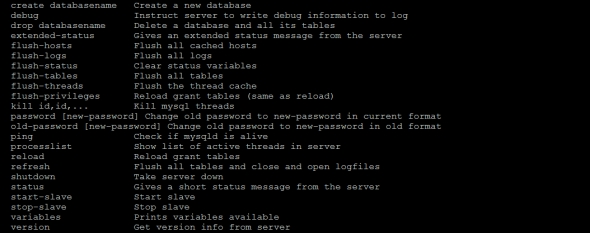

# 第18章_数据库备份与恢复

讲师：顿开教育-顽石老师

----

在任何数据库环境中，总会有**不确定的意外**情况发生，比如例外的停电、计算机系统中的各种软硬件故障、人为破坏、管理员误操作等是不可避免的，这些情况可能会`导致数据的丢失`、`服务器瘫痪`等严重的后果。存在多个服务器时，会出现主从服务器之间的数据同步问题。

为了有效防止数据丢失，并将损失降到最低，应`定期`对MysQL数据库服务器做`备份`。如果数据库中的数据丢失或者出现错误，可以使用备份的`数据进行恢复`。主从服务器之间的数据同步问题可以通过复制功能实现。

## 1. 物理备份与逻辑备份

**物理备份**：备份数据文件，转储数据库物理文件到某一目录。物理备份恢复速度比较快，但占用空间比较大，MySQL中可以用 xtrabackup 工具来进行物理备份。

**逻辑备份**：对数据库对象利用工具进行导出工作，汇总入备份文件内。逻辑备份恢复速度慢，但占用空间小，更灵活。MySQL 中常用的逻辑备份工具为 mysqldump 。逻辑备份就是 备份sql语句 ，在恢复的时候执行备份的sql语句实现数据库数据的重现。

 

## 2. mysqldump命令实现逻辑备份

### 2.1 备份一个数据库

**基本语法：**

```css
mysqldump –u 用户名称 –h 主机名称 –p密码 待备份的数据库名称[tbname, [tbname...]]> 备份文件名称.sql
```

> 说明： 备份的文件并非一定要求后缀名为.sql，例如后缀名为.txt的文件也是可以的。

 

举例：使用root用户备份test数据库：

```css
mysqldump -uroot -p test > test.sql 				#备份文件存储在当前目录下
mysqldump -uroot -p test > /var/lib/mysql/test.sql 	#备份文件存储在指定目录下
```

**备份文件剖析：**

```mysql
-- MySQL dump 10.13  Distrib 8.0.22, for Win64 (x86_64)
--
-- Host: localhost    Database: test
-- ------------------------------------------------------
-- Server version	8.0.22
-- 操作之前先保存一下一些变量
-- 40101 表明这些语句只有在mysql版本为4.01.01或者更高版本的条件下才可以执行
/*!40101 SET @OLD_CHARACTER_SET_CLIENT=@@CHARACTER_SET_CLIENT */;
/*!40101 SET @OLD_CHARACTER_SET_RESULTS=@@CHARACTER_SET_RESULTS */;
/*!40101 SET @OLD_COLLATION_CONNECTION=@@COLLATION_CONNECTION */;
/*!50503 SET NAMES utf8mb4 */;
/*!40103 SET @OLD_TIME_ZONE=@@TIME_ZONE */;
/*!40103 SET TIME_ZONE='+00:00' */;
/*!40014 SET @OLD_UNIQUE_CHECKS=@@UNIQUE_CHECKS, UNIQUE_CHECKS=0 */;
/*!40014 SET @OLD_FOREIGN_KEY_CHECKS=@@FOREIGN_KEY_CHECKS, FOREIGN_KEY_CHECKS=0 */;
/*!40101 SET @OLD_SQL_MODE=@@SQL_MODE, SQL_MODE='NO_AUTO_VALUE_ON_ZERO' */;
/*!40111 SET @OLD_SQL_NOTES=@@SQL_NOTES, SQL_NOTES=0 */;

--  表' emp '的表结构
-- Table structure for table `emp`
--

DROP TABLE IF EXISTS `emp`;
/*!40101 SET @saved_cs_client     = @@character_set_client */;
/*!50503 SET character_set_client = utf8mb4 */;
CREATE TABLE `emp` (
  `empno` smallint NOT NULL,
  `ename` varchar(10) DEFAULT NULL,
  `job` varchar(9) DEFAULT NULL,
  `mgr` smallint DEFAULT NULL,
  `hiredate` date DEFAULT NULL,
  `sal` smallint DEFAULT NULL,
  `comm` smallint DEFAULT NULL,
  `deptno` smallint DEFAULT NULL,
  PRIMARY KEY (`empno`)
) ENGINE=InnoDB DEFAULT CHARSET=utf8mb4 COLLATE=utf8mb4_0900_ai_ci;
/*!40101 SET character_set_client = @saved_cs_client */;

-- 为表' emp '转储数据
-- Dumping data for table `emp`
--

-- 锁住表方式别的会话同时操作，避免出错
LOCK TABLES `emp` WRITE;	
-- 告诉 MySQL 停止更新非唯一索引(因为更新索引会消耗大量的时间，禁用之后能提高速度)
/*!40000 ALTER TABLE `emp` DISABLE KEYS */;
INSERT INTO `emp` VALUES (7499,'ALLEN','SALESMAN',7698,'1981-02-20',1600,300,30),(7521,'WARD','SALESMAN',7698,'1981-02-22',1250,500,30),(7566,'JONES','MANAGER',7839,'1981-04-02',2975,NULL,20),(7654,'MARTIN','SALESMAN',7698,'1981-09-28',1250,1400,30),(7698,'BLAKE','MANAGER',7839,'1981-05-01',2850,NULL,30),(7782,'CLARK','MANAGER',7839,'1981-06-09',2450,NULL,10),(7788,'SCOTT','ANALYST',7566,'1987-04-19',3000,NULL,20),(7839,'KING','PRESIDENT',NULL,'1981-11-17',5000,NULL,10),(7844,'TURNER','SALESMAN',7698,'1981-09-08',1500,0,30),(7876,'ADAMS','CLERK',7788,'1987-05-23',1100,NULL,20),(7900,'JAMES','CLERK',7698,'1981-12-03',950,NULL,30),(7902,'FORD','ANALYST',7566,'1981-12-03',3000,NULL,20),(7934,'MILLER','CLERK',7782,'1982-01-23',1300,NULL,10);
-- 恢复索引的更新
/*!40000 ALTER TABLE `emp` ENABLE KEYS */;
UNLOCK TABLES;

-- 操作之后恢复变量
/*!40103 SET TIME_ZONE=@OLD_TIME_ZONE */;
/*!40101 SET SQL_MODE=@OLD_SQL_MODE */;
/*!40014 SET FOREIGN_KEY_CHECKS=@OLD_FOREIGN_KEY_CHECKS */;
/*!40014 SET UNIQUE_CHECKS=@OLD_UNIQUE_CHECKS */;
/*!40101 SET CHARACTER_SET_CLIENT=@OLD_CHARACTER_SET_CLIENT */;
/*!40101 SET CHARACTER_SET_RESULTS=@OLD_CHARACTER_SET_RESULTS */;
/*!40101 SET COLLATION_CONNECTION=@OLD_COLLATION_CONNECTION */;
/*!40111 SET SQL_NOTES=@OLD_SQL_NOTES */;
-- 存储完成的详细时间
-- Dump completed on 2022-07-23 15:47:52
```

### 2.2 备份全部数据库

若想用mysqldump备份整个实例，可以使用<font style="color:rgb(232,105,0)">`--all-databases`</font>或<font style="color:rgb(232,105,0)">`-A`</font>	参数：

```mysql
mysqldump -uroot -pxxxxxx --all-databases > all_database.sql 
mysqldump -uroot -pxxxxxx -A > all_database.sql
```


### 2.3 备份部分数据库

使用<font style="color:rgb(232,105,0)">`--databases`</font>	或	<font style="color:rgb(232,105,0)">`-B`</font>参数，该参数后面跟数据库名称，多个数据库间用空格隔开。如果指定databases参数，备份文件中会存在`创建数据库`的语句，如果不指定参数，则不存在。语法如下：

```mysql
mysqldump –u user –h host –p --databases [数据库的名称1 [数据库的名称2...]] > 备份文件名称.sql
```

举例：

```mysql
mysqldump -uroot -p --databases test db > part_database.sql
```

或

 ```mysql
mysqldump -uroot -p -B test db > part_database.sql
 ```

### 2.4 备份部分表

比如，在表变更前做个备份。语法如下：

 ```mysql
mysqldump –u user –h host –p 数据库的名称 [表名1 [表名2...]] > 备份文件名称.sql
 ```

举例：备份test数据库下的emp表

```mysql
mysqldump -uroot -p test emp > emp.sql
```


备份多张表使用下面的命令，比如备份emp和dept表：

```mysql
#备份多张表
mysqldump -uroot -p test emp dept > 2_tables_bak.sql
```


### 2.5 备份单表的部分数据

有些时候一张表的数据量很大，我们只需要部分数据。这时就可以使用<font style="color:rgb(232,105,0)">`--where`</font>选项了，where后面附带带需要满足的条件。

举例：备份student表中id小于10的数据：

```mysql
mysqldump -uroot -p test emp --where="sal < 1000 " > emp_part_sal_greater_1000.sql
```


### 2.6 排除某些表的备份

如果我们想备份某个库，但是某些表数据量很大或者与业务关联不大，这个时候可以考虑排除掉这些表，同样的，选项<font style="color:rgb(232,105,0)">`--ignore-table`</font>可以完成这个功能。

 ```mysql
 mysqldump -uroot -p test --ignore-table=test.emp > no_emp_bakup.sql
 ```

### 2.7 只备份结构或只备份数据

只备份结构的话可以使用<font style="color:rgb(232,105,0)">`--no-data`</font>选项（简写为<font style="color:rgb(232,105,0)">`-d`</font>）。

只备份数据可以使用<font style="color:rgb(232,105,0)">`--no-create-info`</font>选项（简写为<font style="color:rgb(232,105,0)">`-t`</font>）

+ 只备份结构

```mysql
mysqldump -uroot -p test --no-data > test_no_data_bak.sql 
```


+ 只备份数据

```mysql
mysqldump -uroot -p test --no-create-info > test_no_create_info_bak.sql 
```


### 2.8 备份中包含存储过程、函数、事件

mysqldump备份默认是不包含存储过程，自定义函数及事件的。可以使用<font style="color:rgb(232,105,0)">`--routines`</font>或<font style="color:rgb(232,105,0)">`-R`</font>选项来备份存储过程及函数，使用<font style="color:rgb(232,105,0)">`--events`</font>或<font style="color:rgb(232,105,0)">`-E`</font>选项来备份事件。

举例：备份整个atguigu库，包含存储过程及事件：

使用下面的SQL可以查看当前库有哪些存储过程或者函数

 ```mysql
mysql> SELECT SPECIFIC_NAME,ROUTINE_TYPE ,ROUTINE_SCHEMA FROM
information_schema.Routines WHERE ROUTINE_SCHEMA="test";
 ```

下面备份atguigu库的数据，函数以及存储过程。

```mysql
mysqldump -uroot -p -R -E --databases test > fun_test_bakckup.sql
```

### 2.9 mysqldump常用选项

mysqldump其他常用选项如下：

```mysql
--add-drop-database：在每个CREATE DATABASE语句前添加DROP DATABASE语句。

--add-drop-tables：在每个CREATE TABLE语句前添加DROP TABLE语句。

--add-locking：用LOCK TABLES和UNLOCK TABLES语句引用每个表转储。重载转储文件时插入得更快。

--all-database, -A：转储所有数据库中的所有表。与使用--database选项相同，在命令行中命名所有数据库。

--comment[=0|1]：如果设置为0，禁止转储文件中的其他信息，例如程序版本、服务器版本和主机。
--skip-comments与--comments=0的结果相同。默认值为1，即包括额外信息。

--compact：产生少量输出。该选项禁用注释并启用--skip-add-drop-tables、--no-set-names、--skip- disable-keys和--skip-add-locking选项。

--compatible=name：产生与其他数据库系统或旧的MySQL服务器更兼容的输出，值可以为ansi、MySQL323、MySQL40、postgresql、oracle、mssql、db2、maxdb、no_key_options、no_table_options或者no_field_options。

--complete_insert, -c：使用包括列名的完整的INSERT语句。

--debug[=debug_options], -#[debug_options]：写调试日志。
--delete，-D：导入文本文件前清空表。

--default-character-set=charset：使用charsets默认字符集。如果没有指定，就使用utf8。

--delete--master-logs：在主复制服务器上，完成转储操作后删除二进制日志。该选项自动启用-master- data。

--extended-insert，-e：使用包括几个VALUES列表的多行INSERT语法。这样使得转储文件更小，重载文件时可  以加速插入。

--flush-logs，-F：开始转储前刷新MySQL服务器日志文件。该选项要求RELOAD权限。

--force，-f：在表转储过程中，即使出现SQL错误也继续。

--lock-all-tables，-x：对所有数据库中的所有表加锁。在整体转储过程中通过全局锁定来实现。该选项自动关   闭--single-transaction和--lock-tables。

--lock-tables，-l：开始转储前锁定所有表。用READ   LOCAL锁定表以允许并行插入MyISAM表。对于事务表（例如InnoDB和BDB），--single-transaction是一个更好的选项，因为它根本不需要锁定表。

--no-create-db，-n：该选项禁用CREATE DATABASE /*!32312 IF NOT EXIST*/db_name语句，如果给出-
-database或--all-database选项，就包含到输出中。

--no-create-info，-t：只导出数据，而不添加CREATE TABLE语句。

--no-data，-d：不写表的任何行信息，只转储表的结构。

--opt：该选项是速记，它可以快速进行转储操作并产生一个能很快装入MySQL服务器的转储文件。该选项默认开启，   但可以用--skip-opt禁用。

--password[=password]，-p[password]：当连接服务器时使用的密码。

-port=port_num，-P port_num：用于连接的TCP/IP端口号。

--protocol={TCP|SOCKET|PIPE|MEMORY}：使用的连接协议。

--replace，-r –replace和--ignore：控制替换或复制唯一键值已有记录的输入记录的处理。如果指定-- replace，新行替换有相同的唯一键值的已有行；如果指定--ignore，复制已有的唯一键值的输入行被跳过。如果不   指定这两个选项，当发现一个复制键值时会出现一个错误，并且忽视文本文件的剩余部分。

--silent，-s：沉默模式。只有出现错误时才输出。

--socket=path，-S path：当连接localhost时使用的套接字文件（为默认主机）。

--user=user_name，-u user_name：当连接服务器时MySQL使用的用户名。

--verbose，-v：冗长模式，打印出程序操作的详细信息。

--xml，-X：产生XML输出。
```

运行帮助命令<font style="color:rgb(232,105,0)">`mysqldump --help`</font>  ，可以获得特定版本的完整选项列表。

> 提示 如果运行mysqldump没有--quick或--opt选项，mysqldump在转储结果前将整个结果集装入内存。如果转储大数据库可能会出现问题，该选项默认启用，但可以用--skip-opt禁用。如果使用最新版本的mysqldump程序备份数据，并用于恢复到比较旧版本的MySQL服务器中，则不要使用--opt  或-e选项。


## 3. mysql命令恢复数据

基本语法：

```mysql
mysql –u root –p [dbname] < backup.sql
```

### 3.1 单库备份中恢复单库

使用root用户，将之前练习中备份的test.sql文件中的备份导入数据库中，命令如下：

如果备份文件中包含了创建数据库的语句，则恢复的时候不需要指定数据库名称，如下所示

```mysql
mysql -uroot -p < test.sql
```

否则需要指定数据库名称，如下所示

```mysql
mysql -uroot -p db_test< test.sql
```

### 3.2 全量备份恢复

如果我们现在有昨天的全量备份，现在想整个恢复，则可以这样操作：

```mysql
mysql –uroot –p < all.sql
mysql -uroot -pxxxxxx < all.sql
```

执行完后，MySQL数据库中就已经恢复了all.sql文件中的所有数据库。


## 4. 表的导出与导入

### 4.1 表的导出

#### 1. 使用SELECT…INTO OUTFILE导出文本文件

**举例：**使用SELECT…INTO OUTFILE将test数据库中emp表导出到文本文件(不会导出表头)。 

（1）选择数据库test，并查询emp表，执行结果如下所示。

 ```mysql
use test;
select * from emp; 
 ```

（3） 导出emp表到指定的目录，SQL语句如下。

```mysql
SELECT * FROM test.emp INTO OUTFILE 'C:/Users/Maye/backup/emp_0.txt';
#字段值之间用逗号分隔，字符串字段用双引号包裹
SELECT * FROM test.emp INTO OUTFILE 'C:/Users/Maye/backup/emp_2.csv' FIELDS TERMINATED BY ',' ENCLOSED BY '\"';
```

（4） 查看 emp.txt 文件。

 ```mysql
7499	ALLEN	SALESMAN	7698	1981-02-20	1600	300	30
7521	WARD	SALESMAN	7698	1981-02-22	1250	500	30
7566	JONES	MANAGER	7839	1981-04-02	2975	\N	20
7654	MARTIN	SALESMAN	7698	1981-09-28	1250	1400	30
7698	BLAKE	MANAGER	7839	1981-05-01	2850	\N	30
...
 ```

##### 错误及解决方案

+ 错误1：mysql默认对导出的目录有权限限制，也就是说使用命令行进行导出的时候，需要指定目录进行操作。

  ```mysql
  SELECT * FROM test.emp INTO OUTFILE "C:/Users/Maye/backup/emp_0.txt";
  
  #ERROR 1290 (HY000): The MySQL server is running with the --secure-file-priv option so it cannot execute this statement
  ```

  + 查询secure_file_priv值：

    ```mysql
    mysql> SELECT @@secure_file_priv;
    +--------------------+
    | @@secure_file_priv |
    +--------------------+
    | NULL               |
    +--------------------+
    1 row in set (0.00 sec)
    ```

  + 变量secure_file_priv的可选值和作用分别是：

    + 如果设置为empty，表示不限制文件生成的位置，这是不安全的；
    + 如果设置为一个标识路径的字符串，就要求生成的文件只能放在这个指定的目录，或者它的子目录；
    + 如果设置为NULL，就表示禁止在这个MySQL实例上执行select...into outfile操作。

  + 咱们这里查出来是NULL，说明不能导出文件，难怪会报错QAQ！那就需要把这个变量的值设置为empty，也就是没有任何东西。

    + 注意：这个变量是只读变量，不能通过SQL语句修改，只能修改my.ini配置文件，然后重启服务器(变量放到mysqld组中)

      ```ini
      ...
      [mysqld]
      secure_file_priv=
      ...
      ```

      

#### 2. 使用mysqldump命令导出文本文件

> 不会导出表头，只有表数据

**举例**：使用mysqldump命令将将test数据库中emp表中的记录导出到`文本文件`和`SQL文件`(只包含创建表的语句)：

```mysql
#注意：结尾不能加分号
mysqldump -uroot -p -T "C:/Users/Maye/backup" test emp
```

mysqldump命令执行完毕后，在指定的目录`C:/Users/Maye/backup/`下生成了`emp.sql`和`emp.txt`文件。   


**举例**2：使用mysqldump将test数据库中的emp表导出到文本文件，使用FIELDS选项，要求字段之间使用逗号(,)间隔，字符串类型字段值用双引号括起来：

```mysql
mysqldump -uroot -p -T "C:/Users/Maye/backup" test emp --fields-terminated-by=, --fields-optionally-enclosed-by=\"
```

打开account.txt文件，其内容包含创建account表的数据。从文件中可以看出，字段之间用逗号隔开，字  符类型的值被双引号括起来。

```mysql
7369,"SMITH","CLERK",7902,"1980-12-17",800,\N,20
...
```

 

#### **3.** 使用mysql命令导出文本文件

**举例**1：使用mysql语句导出test数据中emp表中的记录到文本文件(会同时导出表头)：

```mysql
mysql -uroot -p --execute="SELECT * FROM emp;" test> "C:/Users/Maye/backup/emp_1.txt"
```

emp.txt

```css
empno	ename	job	mgr	hiredate	sal	comm	deptno
7499	ALLEN	SALESMAN	7698	1981-02-20	1600	300	30
7521	WARD	SALESMAN	7698	1981-02-22	1250	500	30
7566	JONES	MANAGER	7839	1981-04-02	2975	NULL	20
...
```


**举例**2：将test数据库emp表中的记录导出到文本文件，使用--veritcal参数将该条件记录分为多行  显示：

```mysql
mysql -uroot -p --vertical --execute="SELECT * FROM emp;" test > "C:/Users/Maye/backup/emp_11.txt"
```

emp_1.txt

```css
*************************** 1. row ***************************
   empno: 7499
   ename: ALLEN
     job: SALESMAN
     mgr: 7698
hiredate: 1981-02-20
     sal: 1600
    comm: 300
  deptno: 30
*************************** 2. row ***************************
   empno: 7521
   ename: WARD
     job: SALESMAN
     mgr: 7698
hiredate: 1981-02-22
     sal: 1250
    comm: 500
  deptno: 30
```


**举例**3：将test数据库emp表中的记录导出到xml文件，使用--xml参数，具体语句如下。

```mysql
mysql -uroot -p --xml --execute="SELECT * FROM emp" test>"C:/Users/Maye/backup/emp.xml"
```

emp.xml

```xml
  <row>
	<field name="empno">7499</field>
	<field name="ename">ALLEN</field>
	<field name="job">SALESMAN</field>
	<field name="mgr">7698</field>
	<field name="hiredate">1981-02-20</field>
	<field name="sal">1600</field>
	<field name="comm">300</field>
	<field name="deptno">30</field>
  </row>
```

说明：如果要将表数据导出到html文件中，可以使用 --html 选项。然后可以使用浏览器打开。

### 4.2 表的导入

#### 1. 使用LOAD DATA INFILE方式导入文本文件

**举例**1：使用SELECT...INTO OUTFILE将test数据库中emp表的记录导出到文本文件

 ```mysql
SELECT * FROM test.emp INTO OUTFILE 'C:/Users/Maye/backup/emp_2.txt'; 
 ```

删除account表中的数据：

 ```mysql
DELETE FROM test.emp;
 ```

从文本文件emp_1.txt中恢复数据：

 ```mysql
LOAD DATA INFILE 'C:/Users/Maye/backup/emp_2.txt' INTO TABLE test.emp;
 ```


**举例**2：选择数据库test，使用SELECT…INTO OUTFILE将test数据库emp表中的记录导出到文本文件，使用FIELDS选项和LINES选项，要求字段之间使用逗号"，"间隔，所有字段值用双引号括起来：

```mysql
SELECT * FROM test.emp INTO OUTFILE 'C:/Users/Maye/backup/emp_2.csv' FIELDS TERMINATED BY ',' ENCLOSED BY '\"';
```

删除account表中的数据：

```mysql
DELETE FROM test.emp;
```

从`'C:/Users/Maye/backup/emp_2.csv'`中导入数据到account表中：

```mysql
LOAD DATA INFILE 'C:/Users/Maye/backup/emp_2.csv' INTO TABLE test.emp FIELDS TERMINATED BY ',' ENCLOSED BY '\"';
```


#### 2. 使用mysqlimport方式导入文本文件

> 文件名必须是表名

**举例：**导出文件emp.txt，字段之间使用逗号"，"间隔，字符串字段值用双引号括起来：

```mysql
SELECT * FROM test.emp INTO OUTFILE 'C:/Users/Maye/backup/emp.csv' FIELDS TERMINATED BY ',' ENCLOSED BY '\"';
```

删除emp表中的数据：

```mysql
DELETE FROM test.emp;
```

使用mysqlimport命令将emp.txt文件内容导入到数据库test的emp表中：

```mysql
#这个文件名称必须和表明一致(emp.csv  文件名emp就是要导入的表名)
mysqlimport -uroot -p --local test “C:/Users/Maye/backup/emp.csv” --fields-terminated-by=, --fields-optionally-enclosed-by=\"
```

查询account表中的数据：

```mysql
select * from account; mysql> select * from account;
+----+--------+---------+
| id | name	| balance |
+----+--------+---------+
|	1 | 张三	|	90 |
|	2 | 李四	|	100 |
|	3 | 王五	|	0 |
+----+--------+---------+
3 rows in set (0.00 sec)
```

##### 错误及解决方案

+ 错误1：mysql会默认在服务器上加载文件，但是我们的文件确是在本地，所以必须指定参数`--local`

  ```mysql
  mysqlimport -uroot -p --local test  'C:/Users/Maye/backup/emp.txt'		#正确
  mysqlimport -uroot -p  test  'C:/Users/Maye/backup/emp.txt'				#错误
  
  #mysqlimport: Error: 29, File 'E:\Tool\mysql-8.0.22-winx64\data\'C:\Users\Maye\backup\emp.txt'' not found (OS errno 2 - No such file or directory), when using table: emp
  ```

+ 错误2：加载本地数据被禁用；这必须在客户端和服务器端都启用才能使用`--local`

  ```mysql
  #如果执行一下命令出现错误，则必须先启用全局变量local_infile
  mysqlimport -uroot -p --local test  'C:/Users/Maye/backup/emp.txt'	
  
  #mysqlimport: Error: 3948, Loading local data is disabled; this must be enabled on both the client and server sides, when using table: emp
  ```

  + 启用`local_infile`全局变量

    ```mysql
    SET @@global.local_infile = ON;
    #或
    SET GLOBAL local_infile = ON;
    ```

    

+ 错误3：mysqlimport命令的路径不能用单引号包裹，只能用双引号或者不加引号

  ```mysql
  mysqlimport -uroot -p --local test  'C:/Users/Maye/backup/emp.txt'		#错误
  mysqlimport -uroot -p --local test  "C:/Users/Maye/backup/emp.txt"		#正确
  mysqlimport -uroot -p --local test  C:/Users/Maye/backup/emp.txt		#正确
  
  #mysqlimport: Error: 2, File ''C:\Users\Maye\backup\emp.txt'' not found (OS errno 2 - No such file or directory), when using table: emp
  ```

  

## 5. 数据库迁移

### **5.1** **概述**

数据迁移（data  migration）是指选择、准备、提取和转换数据，并**将数据从一个计算机存储系统永久地传输到另一个计算机存储系统的过程**。此外，  <font style="color:rgb(232,105,0)">`验证迁移数据的完整性`</font>和 <font style="color:rgb(232,105,0)">`退役原来旧的数据存储`</font> ，也被认为是整个数据迁移过程的一部分。

数据库迁移的原因是多样的，包括服务器或存储设备更换、维护或升级，应用程序迁移，网站集成，灾难恢复和数据中心迁移。

根据不同的需求可能要采取不同的迁移方案，但总体来讲，MySQL 数据迁移方案大致可以分为 <font style="color:rgb(232,105,0)">`物理迁移`</font>和 <font style="color:rgb(232,105,0)">`逻辑迁移`</font>两类。通常以尽可能 <font style="color:rgb(232,105,0)">`自动化`</font>的方式执行，从而将人力资源从繁琐的任务中解放出来。

### 5.2 迁移方案

+ 物理迁移

物理迁移适用于大数据量下的整体迁移。使用物理迁移方案的优点是比较快速，但需要停机迁移并且要  求 MySQL 版本及配置必须和原服务器相同，也可能引起未知问题。

物理迁移包括拷贝数据文件和使用 XtraBackup 备份工具两种。

不同服务器之间可以采用物理迁移，我们可以在新的服务器上安装好同版本的数据库软件，创建好相同目录，建议配置文件也要和原数据库相同，然后从原数据库方拷贝来数据文件及日志文件，配置好文件组权限，之后在新服务器这边使用 mysqld 命令启动数据库。

+ 逻辑迁移

逻辑迁移适用范围更广，无论是<font style="color:rgb(232,105,0)">`部分迁移 `</font>还是<font style="color:rgb(232,105,0)">`全量迁移 `</font>，都可以使用逻辑迁移。逻辑迁移中使用最多的就是通过 mysqldump 等备份工具。

### 5.3 迁移注意点

**1.** **相同版本的数据库之间迁移注意点**

> 指的是在主版本号相同的MySQL数据库之间进行数据库移动。

<font style="color:rgb(232,105,0)">`方式1：`</font> 因为迁移前后MySQL数据库的主版本号相同 ，所以可以通过复制数据库目录来实现数据库迁移，但是物理迁移方式只适用于MyISAM引擎的表。对于InnoDB表，不能用直接复制文件的方式备份数据库。

<font style="color:rgb(232,105,0)">`方式2： `</font> 最常见和最安全的方式是使用 mysqldump命令导出数据，然后在目标数据库服务器中使用MySQL命令导入。

举例：

```mysql
#host1的机器中备份所有数据库,并将数据库迁移到名为host2的机器上
mysqldump –h host1 –uroot –p –-all-databases| mysql –h host2 –uroot –p
```

在上述语句中，“|”符号表示管道，其作用是将mysqldump备份的文件给mysql命令；“--all-databases”表   示要迁移所有的数据库。通过这种方式可以直接实现迁移。

**2.** **不同版本的数据库之间迁移注意点**

例如，原来很多服务器使用5.7版本的MySQL数据库，在8.0版本推出来以后，改进了5.7版本的很多缺陷，  因此需要把数据库升级到8.0版本

旧版本与新版本的MySQL可能使用不同的默认字符集，例如有的旧版本中使用latin1作为默认字符集，而最新版本的MySQL默认字符集为utf8mb4。如果数据库中有中文数据，那么迁移过程中需要对<font style="color:rgb(232,105,0)">`默认字符集`</font>进行修改 ，不然可能无法正常显示数据。

高版本的MySQL数据库通常都会 兼容低版本 ，因此可以从低版本的MySQL数据库迁移到高版本的MySQL 数据库。

**3.** **不同数据库之间迁移注意点**

不同数据库之间迁移是指从其他类型的数据库迁移到MySQL数据库，或者从MySQL数据库迁移到其他类  型的数据库。这种迁移没有普适的解决方法。

迁移之前，需要了解不同数据库的架构， 比较它们之间的差异 。不同数据库中定义相同类型的数据的关键字可能会不同。例如，MySQL中日期字段分为DATE和TIME两种，而ORACLE日期字段只有DATE；SQL Server数据库中有ntext、Image等数据类型，MySQL数据库没有这些数据类型；MySQL支持的ENUM和SET类型，这些SQL Server数据库不支持。

另外，数据库厂商并没有完全按照SQL标准来设计数据库系统，导致不同的数据库系统的<font style="color:rgb(232,105,0)">` SQL语句 `</font>有差别。例如，微软的SQL Server软件使用的是T-SQL语句，T-SQL中包含了非标准的SQL语句，不能和MySQL 的SQL语句兼容。

不同类型数据库之间的差异造成了互相<font style="color:rgb(232,105,0)">`迁移的困难 `</font>  ，这些差异其实是商业公司故意造成的技术壁垒。但是不同类型的数据库之间的迁移并不是完全不可能 。例如，可以使用<font style="color:rgb(232,105,0)">`MyODBC `</font>  实现MySQL和SQL Server之间的迁移。

MySQL官方提供的工具<font style="color:rgb(232,105,0)">` MySQL Migration Toolkit  `</font>也可以在不同数据库之间进行数据迁移。MySQL迁移到Oracle时，需要使用mysqldump命令导出sql文件，然后，手动更改sql文件中的CREATE语句。

### 5.4 迁移小结


 

 

## 6. 删库了不敢跑，能干点啥？

### 6.1 delete：误删行

**经验之谈：**

1. 恢复数据比较安全的做法，是<font style="color:rgb(232,105,0)">`恢复出一个备份`</font>，或者找一个从库作为<font style="color:rgb(232,105,0)">`临时库 `</font>，在这个临时库上执行这些操作，然后再讲确认过的临时库的数据，恢复回主库。如果直接修改主库，可能导致对数据库的<font style="color:rgb(232,105,0)">`二次破坏 `</font>

2. 当然，针对预防误删数据的问题，建议如下：
   1. 把 sql_safe_updates 参数设置为 on 。这样一来，如果我们忘记在delete或者update语句中写where条件，或者where条件里面没有包含索引字段的话，这条语句的执行就会报错。

      > 如果确定要把一个小表的数据全部删掉，在设置了sql_safe_updates=on情况下，可以  在delete语句中加上where条件，比如where id>=0。

   2.  代码上线前，必须经过 SQL审计 。

### 6.2 truncate/drop：误删库表

**方案：**

这种情况下，要想恢复数据，就需要使用<font style="color:rgb(232,105,0)">`全量备份  `</font> ，加<font style="color:rgb(232,105,0)">`增量日志  `</font> 的方式了。这个方案要求线上有定期的全量备份，并且实时备份binlog。

在这两个条件都具备的情况下，假如有人中午12点误删了一个库，恢复数据的流程如下：

1. 取最近一次 全量备份 ，假设这个库是一天一备，上次备份是当天 凌晨2点 ；

2. 用备份恢复出一个临时库 ；

3. 从日志备份里面，取出凌晨2点之后的日志；

4. 把这些日志，除了误删除数据的语句外，全部应用到临时库。


### 6.3 延迟复制备库

如果有<font style="color:rgb(232,105,0)">`非常核心的业务  `</font>，不允许太长的恢复时间，可以考虑**搭建延迟复制的备库。**一般的主备复制结构存在的问题是，如果主库上有个表被误删了，这个命令很快也会被发给所有从库，进而导致所有从库的  数据表也都一起被误删了。

延迟复制的备库是一种特殊的备库，通过  CHANGE MASTER TO MASTER_DELAY = N 命令，可以指定这个备库持续保持跟主库有<font style="color:rgb(232,105,0)">`N秒的延迟  `</font>。比如你把N设置为3600，这就代表了如果主库上有数据被误删了，并且在1小时内发现了这个误操作命令，这个命令就还没有在这个延迟复制的备库执行。这时候到这个备  库上执行stop slave，再通过之前介绍的方法，跳过误操作命令，就可以恢复出需要的数据。

### 6.4 预防误删库/表的方法

1. 账号分离 。这样做的目的是，避免写错命令。比如：
   + 只给业务开发同学DML权限，而不给truncate/drop权限。而如果业务开发人员有DDL需求的话，可以通过开发管理系统得到支持。

   + 即使是DBA团队成员，日常也都规定只使用只读账号 ，必要的时候才使用有更新权限的账号。

2. 制定操作规范 。比如：
   		+ 在删除数据表之前，必须先对表做改名操作。然后，观察一段时间，确保对业务无影响以后再删除这张表。
      		+ 改表名的时候，要求给表名加固定的后缀（比如加 _to_be_deleted )，然后删除表的动作必须通过管理系统执行。并且，管理系统删除表的时候，只能删除固定后缀的表。

### 6.5 rm：误删MySQL实例

对于一个有高可用机制的MySQL集群来说，不用担心<font style="color:rgb(232,105,0)">`rm删除数据   `</font> 了。只是删掉了其中某一个节点的数据的话，HA系统就会开始工作，选出一个新的主库，从而保证整个集群的正常工作。我们要做的就是在这个节点上把数据恢复回来，再接入整个集群。

 

##  附录：MySQL常用命令

### 1 mysql

该mysql不是指mysql服务，而是指mysql的客户端工具。 

语法 ：

```mysql
mysql [options] [database]
```

#### 1. 连接选项

```mysql
#参数 ：
-u, --user=name	指定用户名
-p, --password[=name]	指定密码
-h, --host=name	指定服务器IP或域名
-P, --port=#	指定连接端口

#示例 ：
mysql -h 127.0.0.1 -P 3306 -u root -p mysql -h127.0.0.1 -P3306 -uroot -p密码
```

#### 2. 执行选项

```mysql
-e, --execute=name	执行SQL语句并退出
```

此选项可以在Mysql客户端执行SQL语句，而不用连接到MySQL数据库再执行，对于一些批处理脚本，这  种方式尤其方便。

```mysql
#示例：
mysql -uroot -p db01 -e "select * from tb_book";
```

 

### 2 mysqladmin

mysqladmin  是一个执行管理操作的客户端程序。可以用它来检查服务器的配置和当前状态、创建并删除数据库等。

可以通过 ： mysqladmin --help 指令查看帮助文档



```mysql
#示例 ：
mysqladmin -uroot -p create 'test01'; 
mysqladmin -uroot -p drop 'test01'; 
mysqladmin -uroot -p version;
```

### 3 mysqlbinlog

由于服务器生成的二进制日志文件以二进制格式保存，所以如果想要检查这些文本的文本格式，就会使用到mysqlbinlog 日志管理工具。

语法 ：

```mysql
mysqlbinlog [options] log-files1 log-files2 ...

#选项：

-d, --database=name : 指定数据库名称，只列出指定的数据库相关操作。

-o, --offset=# : 忽略掉日志中的前n行命令。

-r,--result-file=name : 将输出的文本格式日志输出到指定文件。

-s, --short-form : 显示简单格式， 省略掉一些信息。

--start-datatime=date1 --stop-datetime=date2 : 指定日期间隔内的所有日志。

--start-position=pos1 --stop-position=pos2 : 指定位置间隔内的所有日志。 
```

### 4 mysqldump

mysqldump  客户端工具用来备份数据库或在不同数据库之间进行数据迁移。备份内容包含创建表，及插入表的SQL语句。

语法 ： 

```mysql
mysqldump [options] db_name [tables]
mysqldump [options] --database/-B db1 [db2 db3...] 
mysqldump [options] --all-databases/-A
```

#### 1. 连接选项

 ```mysql
#参数 ：
-u, --user=name	指定用户名
-p, --password[=name]	指定密码
-h, --host=name	指定服务器IP或域名
-P, --port=#	指定连接端口
 ```

#### 2. 输出内容选项

```mysql
#参数：
--add-drop-database		#在每个数据库创建语句前加上 Drop database 语句
--add-drop-table 		#在每个表创建语句前加上 Drop table 语句 , 默认开启 ; 不开启 (--skip-add-drop-table)

-n, --no-create-db		#不包含数据库的创建语句
-t, --no-create-info	#不包含数据表的创建语句
-d --no-data			#不包含数据

-T, --tab=name			#自动生成两个文件：一个.sql文件，创建表结构的语句；一个.txt文件，数据文件，相当于select into outfile
```

 ```mysql
#示例 ：
mysqldump -uroot -p db01 tb_book --add-drop-database --add-drop-table > a

mysqldump -uroot -p -T /tmp test city
 ```


### 5 mysqlimport/source

mysqlimport 是客户端数据导入工具，用来导入mysqldump 加 -T 参数后导出的文本文件。

语法：

```mysql
mysqlimport [options] db_name textfile1 [textfile2...]
```

示例：

 ```mysql
mysqlimport -uroot -p test /tmp/city.txt
 ```

如果需要导入sql文件,可以使用mysql中的source 指令 :

```mysql
source /root/tb_book.sql
```

 

### 6 mysqlshow

mysqlshow  客户端对象查找工具，用来很快地查找存在哪些数据库、数据库中的表、表中的列或者索引。

语法：

```mysql
mysqlshow [options] [db_name [table_name [col_name]]]
```

参数：

```mysql
--count #显示数据库及表的统计信息（数据库，表 均可以不指定）
-i		#显示指定数据库或者指定表的状态信息
```

示例：

```mysql
#查询每个数据库的表的数量及表中记录的数量
[root@node1 Maye]> mysqlshow -uroot -p --count

#查询test库中每个表中的字段书，及行数
[root@node1 Maye]> mysqlshow -uroot -p atguigu --count

#查询test库中book表的详细情况
[root@node1 Maye]> mysqlshow -uroot -p atguigu book --count
```


