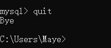
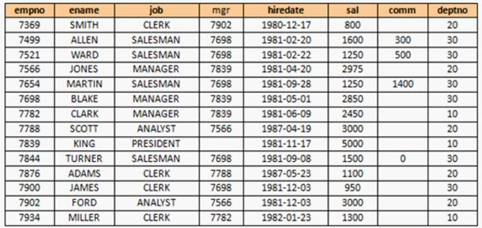

# 数据库概述

## **1.** 为什么要使用数据库

+ 持久化(persistence)：**把数据保存到可掉电式存储设备中以供之后使用**。大多数情况下，特别是企   业级应用，**数据持久化意味着将内存中的数据保存到硬盘上加以”固化”**，而持久化的实现过程大多  通过各种关系数据库来完成。

+ 持久化的主要作用是**将内存中的数据存储在关系型数据库中**，当然也可以存储在磁盘文件、XML数 据文件中。


生活中的例子：QQ账户、好友信息，都存储在腾讯服务器的数据库中。

### **1.1** 数据库的相关概念

| **DB**：数据库（Database）                                   |
| ------------------------------------------------------------ |
| 即存储数据的“仓库”，其本质是一个文件系统。它保存了一系列有组织的数据。 |
| **DBMS**：数据库管理系统（**Database Management System**）   |
| 是一种操纵和管理数据库的大型软件，用于建立、使用和维护数据库，对数据库进行统一管理和控  制。用户通过数据库管理系统访问数据库中表内的数据。 |
| **SQL**：结构化查询语言（**Structured Query Language**）     |
| 专门用来与数据库通信的语言。                                 |

## 2. 数据库与数据库管理系统

### 1.2 数据库与数据库管理系统的关系

数据库管理系统(DBMS)可以管理多个数据库，一般开发人员会针对每一个应用创建一个数据库。为保存  应用中实体的数据，一般会在数据库创建多个表，以保存程序中实体用户的数据。

数据库管理系统、数据库和表的关系如图所示：


### 1.3 常见的数据库管理系统排名(DBMS)

目前互联网上常见的数据库管理软件有Oracle、MySQL、MS SQL Server、DB2、PostgreSQL、Access、Sybase、Informix这几种。以下是2023年**DB-Engines Ranking** 对各数据库受欢迎程度进行调查后的统计结果：（查看数据库最新排名: [**https://db-engines.com/en/ranking** ](https://db-engines.com/en/ranking)）


对应的走势图：(<https://db-engines.com/en/ranking_trend>)


**1.1** **常见的数据库介绍**

**Oracle**

1979 年，Oracle 2 诞生，它是第一个商用的 RDBMS（关系型数据库管理系统）。随着 Oracle 软件的名气越来越大，公司也改名叫 Oracle 公司。

2007年，总计85亿美金收购BEA Systems。

2009年，总计74亿美金收购SUN。此前的2008年，SUN以10亿美金收购MySQL。意味着Oracle 同时拥有了

MySQL 的管理权，至此 Oracle 在数据库领域中成为绝对的领导者。

2013年，甲骨文超越IBM，成为继Microsoft后全球第二大软件公司。

如今 Oracle 的年收入达到了 400 亿美金，足以证明商用（收费）数据库软件的价值。

**SQL Server**

SQL Server 是微软开发的大型商业数据库，诞生于 1989 年。C#、.net等语言常使用，与WinNT完全集成，也可以很好地与Microsoft BackOffice产品集成。

**DB2**

IBM公司的数据库产品，收费的。常应用在银行系统中。

**PostgreSQL**

PostgreSQL   的稳定性极强，最符合SQL标准，开放源码，具备商业级DBMS质量。PG对数据量大的文本以及SQL处理较快。

**SyBase**

已经淡出历史舞台。提供了一个非常专业数据建模的工具PowerDesigner。

**SQLite**

嵌入式的小型数据库，应用在手机端。  零配置，SQlite3不用安装，不用配置，不用启动，关闭或者配置数据库实例。当系统崩溃后不用做任何恢复操作，再下次使用数据库的时候自动恢复。

**informix**

IBM公司出品，取自Information   和Unix的结合，它是第一个被移植到Linux上的商业数据库产品。仅运行于unix/linux平台，命令行操作。  性能较高，支持集群，适应于安全性要求极高的系统，尤其是银行，证券系统的应用。

### 1.4 MySQL简介


MySQL是一个 开放源代码的关系型数据库管理系统 ，由瑞典MySQL AB（创始人Michael Widenius）公司1995年开发，迅速成为开源数据库的 No.1。

2008被Sun收购（10亿美金），2009年Sun被Oracle收购。 MariaDB 应运而生。（MySQL 的创造者担心 MySQL 有闭源的风险，因此创建了 MySQL 的分支项目 MariaDB）

MySQL6.x 版本之后分为`社区版` 和 `商业版 `。

MySQL是一种关联数据库管理系统，将数据保存在不同的表中，而不是将所有数据放在一个大仓库  内，这样就增加了速度并提高了灵活性。

MySQL是开源的，所以你不需要支付额外的费用。

MySQL是可以定制的，采用了 GPL（GNU General Public License） 协议，你可以修改源码来开发自己的MySQL系统。

MySQL支持大型的数据库。可以处理拥有上千万条记录的大型数据库。

MySQL支持大型数据库，支持5000万条记录的数据仓库，32位系统表文件最大可支持 4GB ，64位系统支持最大的表文件为 8TB 。

MySQL使用 标准的SQL数据语言 形式。

MySQL可以允许运行于多个系统上，并且支持多种语言。这些编程语言包括C、C++、Python、Java、Perl、PHP和Ruby等。

### 1.4 表、记录、字段

E-R（entity-relationship，实体-关系）模型中有三个主要概念是： 实体集 、 属性 、 关系集 。

一个实体集（class）对应于数据库中的一个表（table），一个实体（instance）则对应于数据库表   中的一行（row），也称为一条记录（record）。一个属性（attribute）对应于数据库表中的一（column），也称为一个字段（field）。

列如：在日常生活之中，可以这样描述一本书的信息，《C Primer Plus》是人民邮电出版社出版的图书，作者是普拉塔(Prata S.)，定价是89.00，出版日期是2005年2月1日，这样的信息在计算机中就可以使用下面的方式来描述：

+ （C Primer Plus，人民邮电出版社，普拉塔(Prata S.)，89.00,2005-2-1）
+ 即，将信息按照“（图书名称，出版社，作者，价格，出版日期）”的方式组织在一起，这样就组成了一条记录。

如果现在有多条这种记录，那么就可以列成一张表，通过表来管理数据。

如有几种数据类型：

+ 图书编号、库存：整型数据
+ 图书名称、作者、出版社：字符串类型
+ 价格：小数类型


每一行的数据都成为记录，那么每一列的内容都称为字段。每一列都有自己的数据类型。

# MySQL环境搭建

## 1. MySQL卸载

### 步骤1：停止MySQL服务

在卸载之前，先停止MySQL8.0的服务。按键盘上的“Ctrl + Alt + Delete”组合键，打开“任务管理器”对话框，可以在“服务”列表找到“MySQL8.0”的服务，如果现在“正在运行”状态，可以右键单击服务，选择“停  止”选项停止MySQL8.0的服务，如图所示。


## 2. MySQL下载与安装

### 下载 

1，进入MySQL官网[官网地址](<https://www.mysql.com/>)，选择Downloads。


2，往下翻，找到[MySQL Community (GPL) Downloads »](https://dev.mysql.com/downloads/)，点击进入。


3，选择MySQL Community Server


4.1，下载安装版


5，弹出如下页面，选择不登录直接下载(下载过程可能有点慢)


### 解压版安装配置

1，下载之后，解压放到一个自己能找到的目录里面。


2，以管理员身份运行cmd，并切换到mysql的bin目录。


3，输入`mysqld --install`安装mysql服务，移除服务的命令是`mysqld --remove`


4，输入`mysqld --initialize --console`初始化，记一下初始密码哦~


5，然后输入`net start mysql` 启动服务，停止服务命令是`net stop mysql`


6，最后登录一下mysql -uroot -p，出现如下界面说明已经成功登录啦~


7，然后自己修改一下密码 `set password for 'root'@'localhost'='你的新密码'`


8，输入quit可以退出mysql哦



9，为了方便登录操作MySQL，设置一个环境变量，进入bin目录，然后复制路径，添加到系统环境变量


**注意：**如果需要添加my.ini配置文件，操作如下

1. 在mysql程序的根目录下，新建一个my.ini空白文件，用记事本打开，将以下内容复制进去，保存：(注意：记得把22、23行的路径修改为你的目录)

```ini
# For advice on how to change settings please see
# http://dev.mysql.com/doc/refman/5.6/en/server-configuration-defaults.html
# *** DO NOT EDIT THIS FILE. It's a template which will be copied to the
# *** default location during install, and will be replaced if you
# *** upgrade to a newer version of MySQL.
[client]
default-character-set = utf8mb4
[mysql]
default-character-set = utf8mb4
[mysqld]
character-set-client-handshake = FALSE
character-set-server = utf8mb4
collation-server = utf8mb4_bin
init_connect='SET NAMES utf8mb4'
# Remove leading # and set to the amount of RAM for the most important data
# cache in MySQL. Start at 70% of total RAM for dedicated server, else 10%.
innodb_buffer_pool_size = 128M
# Remove leading # to turn on a very important data integrity option: logging
# changes to the binary log between backups.
# log_bin
# These are commonly set, remove the # and set as required.
basedir = D:\MySQL
datadir = D:\MySQL\data
port = 3306
# server_id = .....
# Remove leading # to set options mainly useful for reporting servers.
# The server defaults are faster for transactions and fast SELECTs.
# Adjust sizes as needed, experiment to find the optimal values.
join_buffer_size = 128M
sort_buffer_size = 16M
read_rnd_buffer_size = 16M 
sql_mode=NO_ENGINE_SUBSTITUTION,STRICT_TRANS_TABLES
```

2. 先移除mysql服务

```shell
mysqld --remove;
```

3. 重新安装mysql服务，并指定配置文件

```mysql
mysqld --install "MySQL80" --defaults-file="F:\Tools\mysql-8.0.22-winx64\my.ini"
#"MySQL80" 是服务名称
#--defaults-file 是指定配置文件位置
```

4. 启动新安装的mysql服务

```shell
net start MySQL80;
```

> PS：如果已经安装过了，Mysql服务中间的可执行文件路径和Mysql安装目录不一致，导致mysql服务启动失败，此时需要修改可执行路径。
>
> 1.cmd 输入 regedit，打开注册表。
>
> 2.找到mysql服务注册表，`HKEY_LOCAL_MACHINE\SYSTEM\ControlSet001\Services\MySQL80`，修改imagePath值为正确的路径。
>
> 
>
> 3.然后重启服务应该就好了！

### 安装

1，双击下载的msi文件

 

2，选择安装类型


+ Typical：典型安装，安装MySQL开发所需的所有产品
+ Complete：完整安装，安装所有组件
+ Custom：手动选择需要安装在系统上的产品

这里咱们选择Custom自定义安装，看一下再安装过程中需要选择一些什么组件。

2.5，自定义设置

+ 安装组件：两个(MySQL Server 和 Development Components)都选择第二个(需要时才安装)


+ 安装位置：安装路径不要出现**中文**，其实最好空格都不要有。


3，选择需要安装的产品，选择好安装路径之后，点击下一步即可！然后点击安装。


4，进去到了安装界面，等待安装完成即可！


### 配置

1，安装完成之后，就是对MySQL进行配置了！打开开始菜单，找到MySQL 8.3 Configurator并打开。


配置程序开始界面：


5，选择数据目录(不要有中文)，默认的ProgramData目录是隐藏目录，需要显示隐藏文件夹才能看到。


6，类型和网络


7，设置root用户密码


8，服务配置


9，然后一直点击下一步，直到完成为止。


**注意：**如果在安装过程中出现如下错误：

```css
Attempting to start service MySQL83...
Failed to start service MySQL83.
只有在任务处于完成状态(RanToCompletion、Faulted 或 Canceled)时才能释放它。
Ended configuration step: Starting the server
```


打开服务，找到MySQL83，右击属性。


选择本地系统登录，确定，然后再点击`execute`执行即可！


### 配置环境变量

如果不配置MySQL环境变量，就不能在命令行直接输入MySQL登录命令。下面说如何配置MySQL的环境  变量：

+ Win + S 打开搜索框，输入`系统环境变量`
+ 点击环境变量
+ 编辑Path变量
+ 点击新建，把前面选择的安装目录中的bin目录复制进去


然后启动命令行，输入`mysql --version`，看到如下输出，即配置完成！


## 3. MySQL密码忘记了怎么办？

1. 用**管理员**权限打开cmd，关闭mysql服务；

```css
> net stop mysql83	#mysql83是你的服务名，如果你修改了请用你修改的
```


2. 设置启动mysql服务时跳过权限验证；

```mysql
> mysqld --defaults-file="你的路径\MySQL\MySQL Server 8.3\my.ini" --console --skip-grant-tables --shared-memory
```

如果运行结果如下图所示，光标停留在最后一行闪动，则运行成功，如果没有等待，直接结束，则失败了！


3. 如果上一步操作成功，则以管理员身份打开一个新的cmd窗口；输入如下命令：

```mysql
mysql -uroot
```

直接回车，即可跳过密码登录！


4. 使用指定的数据库

在*MySQL*中就有很多系统自带的数据库,那么在操作数据库之前就必须要确定是哪一个数据库。使用use 命令选择数据库。

```css
> use mysql;
```


5. 修改密码

```mysql
alter user root@localhost identified by '123456';
-- update user set authentication_string=password("123456") where user="root";
```


卧槽，发现报错了，不要慌，关键来了！！

+ 先更新一下权限 `flush privileges;`
+ 再执行修改密码命令 `alter user root@localhost identified by '123456';`

6. 退出mysql

```css
> quit;
```


7. **关闭所有控制台**，**重新打开一个**，重启mysql服务，并登录。

```css
> net start mysql;
```


```css
> mysql -uroot -p -P 33061
```


OK!连接成功~

## 安装Navicat 15 for MySQL

**Navicat 15 for MySQL **是一款针对MySQL数据库而开发的第三方MySQL管理工具，该软件可以用于 MySQL 数据库服务器版本 3.21 或以上的和 MariaDB 5.1 或以上。能够同时连接 MySQL 和 MariaDB 数据库，并与 Amazon RDS、Amazon Aurora、Oracle Cloud、Microsoft Azure、阿里云、腾讯云和华为云等云数据库兼容，支持无缝数据迁移、简单的SQL编辑、智能数据库设计、高级安全连接等功能，为数据库管理、开发和维护提供了一款直观而强大的图形界面，是管理和开发 MySQL 或 MariaDB 的理想解决方案。

**1.下载Navicat for MySQL 15**

[网盘下载 提取码 4ixt](https://pan.baidu.com/s/1eFDCYwjv4H90y6u9dRC6xA )


**2.下载激活工具**

[网盘下载 提取码 09az](https://pan.baidu.com/s/1j2C3qz3zMQc11YUC04l8BQ)


**3.安装Navicat**

按步骤安装即可，安装完毕后先不要打开软件，<font style="color:red">断开网络连接，一定要断开！！！</font>


然后将激活工具复制到Navicat安装路径下，如下图所示。


以**管理员身份运行激活工具**，在弹出界面选择Navicat 15版本， Products选择MySQL，Languages选择Simplefied Chinese 点击Patch，如下：


4.打开Navicat，点击注册


5.返回到激活工具界面，点击Generate会自动填写注册码到软件输入框


6.在点击激活按钮，点击手动激活


7.将请求码复制到激活工具的文本框中，点击Generate激活码会自动填写到Navicat激活码文本框中，点击激活即可。


8. 点击激活，弹出激活成功，over！！！


## Navicat连接MySQL

1. 在Navicat中新建MySQL连接。


2. 默认端口3306，单击测试连接按钮，连接成功！最后点击确定即可。


3. 双击连接名称，即可看到所有数据库。


好了可以尽情使用它了！！！

# SQL规范与测试数据导入

## SQL语句规范

使用SQL语句请遵循以下规范：

+ SQL语句不区分大小写。但字符串常量区分大小写，建议命令大写，表名库名小写；
+ SQL语句可单行或多行书写，以分号结尾；
+ 用空格和缩进来提高语句的可读性。
+ 注释：有三种风格的注释
  1. 单行注释可以用“#”
  2. 单行注释第二种写法用“-- ”，“--" 与注释之间是有空格的。
  3. 多行注释可以用/* */


## 准备测试数据

要学习SQL查询语句，首先必须解决一个问题，数据问题。

为了方便大家学习，在视频目录中提供了一个test.sql文件。

登录MySQL，输入`source  xxx/test.sql`导入sql文件，sql文件实际上是一个脚本文件，里面有多行SQL语句，通过source命令可以批量执行。


执行完毕之后，使用`show databases;`查看所有数据库，发现多了一个名为test的数据库。


使用`show tables;`查看test数据库下所有的数据表，发现有四个表。


**test数据库表**

以后讲解SQL语句的时候，主要使用的是test数据库下的四张表，所以首先就必须对这些表的作用以及列的数据类型做一个基本的了解。


**部门表：dept**

| No.  | 字段名 |    类型     |          描述          |
| :--: | :----: | :---------: | :--------------------: |
|  1   | DEPTNO |  SMALLINT   |        部门编号        |
|  2   | DNAME  | VARCHAR(14) | 部门名称，最多14个字符 |
|  3   |  LOC   | VARCHAR(13) | 部门位置，最多13个字符 |


相关英语翻译：

+ accounting 会计   new york 纽约
+ research 研究员   dallas  达拉斯
+ sales 销售              chicago 芝加哥
+ operarions 运营   boston 波士顿


**雇员表：emp**

| No.  |  字段名  |     类型     |                 描述                 |
| :--: | :------: | :----------: | :----------------------------------: |
|  1   |  EMPNO   |   SMALLINT   |               雇员编号               |
|  2   |  ENAME   | VARCHAR(10)  |               雇员姓名               |
|  3   |   JOB    |  VARCHAR(9)  |              职位(工作)              |
|  4   |   MGR    |   SMALLINT   | 一个员工对应的领导编号，领导也是雇员 |
|  5   | HIREDATE |     DATE     |               雇佣日期               |
|  6   |   SAL    | DECIMAL(7,2) |               基本工资               |
|  7   |   COMM   |   SMALLINT   |     佣金(奖金)，销售人员可以领取     |
|  8   |  DEPTNO  |   SMALLINT   |    雇员所属部门编号，与dept表对应    |



相关英语翻译：

+ clerk 店员

+ salesman 售货员

+ manager 经理

+ analyst 化验员

+ president 董事长

  

**工资等级表：salgrade**

| No.  | 字段名 |   类型   |       描述       |
| :--: | :----: | :------: | :--------------: |
|  1   | GRADE  | SMALLINT |   工资等级编号   |
|  2   | LOSAL  | SMALLINT | 此等级的最低工资 |
|  3   | HISAL  | SMALLINT | 此等级的最高工资 |


**工资补贴表(工资条)：bonus**

| No.  | 字段名 |     类型     |   描述   |
| :--: | :----: | :----------: | :------: |
|  1   | ENAME  | VARCHAR(10)  | 雇员姓名 |
|  2   |  JOB   |  VARCHAR(9)  |   工作   |
|  3   |  SAL   | DECIMAL(7,2) | 基本工资 |
|  4   |  COMM  |   SMALLINT   |   佣金   |

工资补贴表没有数据~

## 数据库的基本操作

在MySQL之中有许多的数据库，可以使用以下命令查看所有数据库:

```mysql
SHOW DATABASES;
+--------------------+
| Database           |
+--------------------+
| information_schema |		#主要存储了系统中的一些数据库对象信息，比如用户表信息、列信息、权限信息、字符集信息和分区信息等。
| mysql              |		#MySQL的核心数据库，主要负责存储数据库用户、用户访问权限等 MySQL 自己需要使用的控制和管理信息。
| performance_schema |		#主要用于收集数据库服务器性能参数。
| sys                |		#sys 数据库主要提供了一些视图，数据都来自于 performation_schema，主要是让开发者和使用者更方便地查看性能问题。
+--------------------+
```

这些数据库彼此之间是可以进行相互切换的。而切换的基本语法：

```mysql
USE <dbname>;
```

要想知道当前使用的是哪个数据库，那么可以使用`select database();`命令来查看：

```mysql
SELECT DATABASE();
```

在一个数据库下一定会存在多张数据表，那么这个时候也可以直接利用以下命令查看所有表:

```mysql
SHOW TABLES;
```

而如果想要知道某些数据表的表结构，那么可以使用DESC命令：

```mysql	
DESC emp;
```

如果想要自己**创建数据库**，则需要使用以下命令：

```mysql
CREATE DATABASE <dbname>;
```

如果数据库已经存在则会报错` Can't create database '<dbname>'; database exists`，我们可以先判断数据库是否存在，不存在就创建，存在则忽略(只有警告没有报错)。

```mysql
CREATE DATABASE IF NOT EXISTS  <dbname>;
```

如果想要删除数据库，则可以使用以下命令：

```mysql
DROP DATABASE <dbname>;
```

如果数据库已经存在则会报错`Can't drop database 'ss'; database doesn't exist`，所有再删除数据库时可以判断是否存在。

```mysql
DROP DATABASE IF EXISTS <dbname>;	#如果数据库存在则删除
```

使用 DROP DATABASE 命令时要**非常谨慎**，在执行该命令后，MySQL 不会给出任何提示确认信息。DROP DATABASE 删除数据库后，数据库中存储的所有数据表和数据也将一同被删除，而且**不能恢复**。