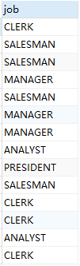
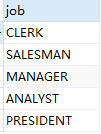
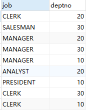
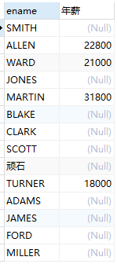
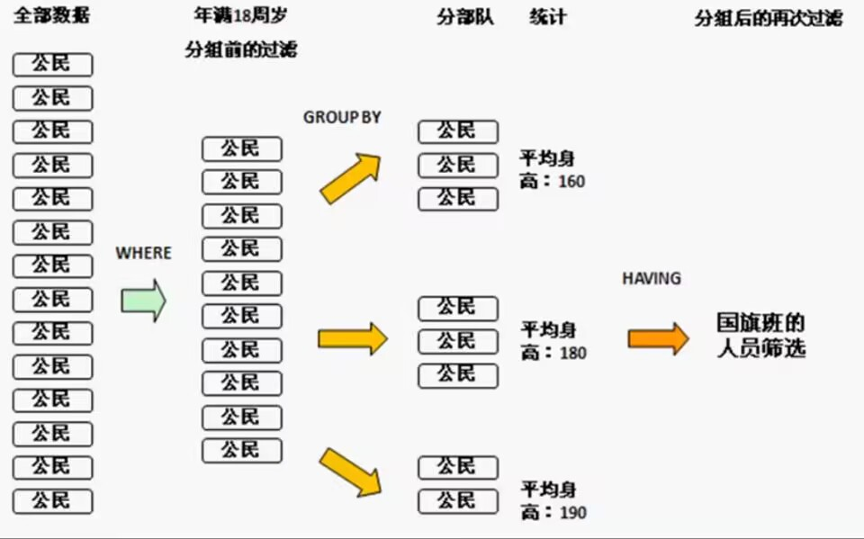

## 基本查询

> MySQL 数据库使用SELECT语句来查询数据。

### **1. 查询字段**

+ 以下为在MySQL数据库中查询数据通用的 SELECT 语法：

```mysql
SELECT 字段名,字段名... FROM 表名;
```

+ 选择全部列

```sql
SELECT * FROM emp;	-- 查询所有字段
```

> 一般情况下，除非需要使用表中所有的字段数据，最好不要使用通配符‘*’。使用通配符虽然可以节省输入查询语句的时间，但是获取不需要的列数据通常会降低查询和所使用的应用程序的效率。通配符的优势是，当不知道所需要的列的名称时，可以通过它获取它们。
>
> 在生产环境下，不推荐你直接使用 SELECT * 进行查询。

+ 选择指定的列

```sql
SELECT empno,ename,job FROM emp;
```

> MySQL中的SQL语句是不区分大小写的，因此SELECT和select的作用是相同的，但是，许多开发人员习惯将关键字大写、数据列和表名小写，大家也应该养成一个良好的编程习惯，这样写出来的代  码更容易阅读和维护。

### 2.列(字段)别名

在很多情况下为了方便查看结果或者简化字段名，会对查询的字段取别名。

+ 语法：

```mysql
SELECT 字段1 [AS 别名],字段2 [AS 别名]... FROM 表名;
```

+ 举例一：

```sql
SELECT empno 员工编号,ename 员工姓名,job 工作 FROM emp;
```

这里直接在字段名后面加个空格，然后写上别名即可。

+ 举例二：

```sql
SELECT empno AS 员工编号,ename AS 员工姓名,job AS 工作 FROM emp;
```

这里在举例一的基础上，在字段名和别名之间插入了一个关键字AS(alias)，表示是取别名。

+ 举例三：

```sql
SELECT empno AS "员工编号",ename AS "员工姓名",job AS "工作" FROM emp;	-- 用双引号包裹别名

SELECT empno AS '员工编号',ename AS '员工姓名',job AS '工作' FROM emp;	-- 用单引号包裹别名
```

还可以用单引号或双引号把别名包裹起来。

当别名中包含空格时，必须用单引号或双引号进行包裹！如下：

```sql
SELECT empno AS 员工 编号 FROM emp;
```

会直接报错：`1064 - You have an error in your SQL syntax; check the manual that corresponds to your MySQL server version for the right syntax to use near '编号 FROM emp' at line 1`

### 3.DISTINCT去重

从表中查询数据时，可能会收到重复的行记录。为了删除这些重复行，可以在`SELECT`语句中使用`DISTINCT`子句。

+ 语法

```mysql
SELECT DISTINCT 字段列表 FROM 表名;
```

+ 举例一：查询员工表(emp)中所有员工的岗位(job)有哪些。

```sql
SELECT job FROM emp;
```

执行SQL语句，得到如下结果：



可看到上面结果中，有好些结果是重复的，比如：`SALESMAN`，`MANAGER`等，那如何做到相同的结果只显示一个呢？要删除重复的记录，请将`DISTINCT`子句添加到`SELECT`语句中，如下所示：

```sql
SELECT DISTINCT job FROM emp;
```

查询到的结果集如下：



可以看到，当使用`DISTINCT`子句时，重复的job在结果集中被消除。

+ 举例二：查询员工表(emp)中，job对应的部门(deptno)，去掉重复记录

```sql
SELECT DISTINCT job,deptno FROM emp;
```



> 注意DISTNCT关键字必须写在所有字段之前

### 4.空值参与运算

先来一个查询案例，查询员工年薪，即 (sal+comm)* 12。

```sql
SELECT ename,(sal + comm)*12 AS '年薪' FROM emp;
```

查询结果集如下：



发现有很多员工的年薪竟然是NULL，白干一年！这是为啥呢，emp表中每个员工都是有薪资的，只不过不是所有员工都有奖金，有的是NULL。

当NULL值参与运算时，计算的结果一定是NULL，所以要进行处理！

```sql
SELECT ename,sal + IFNULL(comm,0)*12 AS '年薪' FROM emp;
```

注意：空值不等于任何值，甚至不等于NULL。

```sql
SELECT NULL=NULL;
```

要想判断是不是NULL值，必须使用`IS NULL`。

```sql
SELECT NULL IS NULL;
```

根据`comm`字段是否为空查询员工信息，必须使用如下SQL语句：

```sql
SELECT * FROM emp WHERE comm IS NULL;		#查询所有comm为NULL的员工信息
SELECT * FROM emp WHERE comm IS NOT NULL;	#查询所有comm不为NULL的员工信息
```

### 5.查询常数

在使用MySQL进行数据查询时，经常需要加入一列常数来进行特定的计算或筛选。通过在SELECT语句中使用常数值和别名，可以方便地在查询结果中添加一列常数。

比如，我们想对emp表中的员工姓名进行查询，同时增加一列字段`corporation`，这个字段固定为“宏定义”，可以这样写：

```sql
SELECT '宏定义' AS 'corporation',ename FROM emp;
```

## 条件查询

条件查询是通过在`SELECT`语句中使用`WHERE`子句来实现的，它允许我们根据特定的条件来过滤查询结果。条件查询可以使用各种运算符来构建这些条件，包括比较运算符、逻辑运算符、范围运算符、列表运算符、模糊匹配符和空值判断符。

**语法**

```mysql
SELECT 字段名 FROM 表名 WHERE 条件;
```

### 关系运算符

MySQL 中的关系运算符（也称为比较运算符）用于比较两个表达式。它们通常用在 WHERE 子句中，用于过滤记录，以及在 JOIN 条件、CASE 表达式等中。

| 关系运算符 | 功能     |
| ---------- | -------- |
| >          | 大于     |
| >=         | 大于等于 |
| <          | 小于     |
| <=         | 小于等于 |
| =          | 等于     |
| <> 或 !=   | 不等于   |

+ 查询工资等于6000的员工：

  ```sql
  SELECT * FROM emp WHERE sal = 6000;
  ```

+ 查询工作职位为`CLERK`职员的员工：

  ```sql
  SELECT * FROM emp WHERE job = 'CLERK';	#在MySQL中，默认情况下，查询操作是不区分大小写的。这意味着，无论是大写还是小写的条件，查询结果都会是相同的。
  ```

+ 查询工资大于5000的员工：

  ```sql
  SELECT * FROM emp WHERE sal > 5000;
  ```

+ 查询工作职位不是`SALESMAN`销售的员工：

  ```sql
  SELECT * FROM emp WHERE job != 'SALESMAN';
  ```

### 逻辑运算符

在 MySQL 中，**逻辑运算符**用于判断表达式的真假，返回值为布尔型，即真值（1 或 true）和假值（0 或 false）。MySQL 支持多种逻辑运算符，包括与（AND 或 &&）、或（OR 或 ||）、非（NOT 或 !）和异或（XOR）等。

> 如果有任何一个操作数为 NULL，则返回 NULL。

| 逻辑运算符   | 功能                         |
| ------------ | ---------------------------- |
| AND 或 &&    | 并且（多个条件同时成立）     |
| OR  或  \|\| | 或者（多个条件任意成立一个） |
| NOT 或 ！    | 非，不是                     |
| XOR          | 逻辑异或 （一真一假才为真）  |

+ 查询有奖金的员工（排除为空和为0的）：

```mysql
SELECT * FROM emp WHERE comm > 0 AND comm IS NOT NULL;
```

+ 查询工资在4200到4800之间的员工(包含4200和4800)：

```mysql
SELECT * FROM emp WHERE sal >= 4200 AND sal <=4800;
```

+ 查询职位为推销员(SALESMAN)，且工资小于4500的员工：

```mysql
SELECT * FROM emp WHERE job = 'SALESMAN' AND sal < 4500;
```

+ 查询工资为3800 或 6000 或 8000的员工：

```sql
SELECT * FROM emp WHERE sal = 3800 OR sal = 6000 OR sal = 8000;
```

+ 查询职位不是`SALESMAN`、`CLERK`、`ANALYST`任何一个的员工：

```sql
SELECT * FROM emp WHERE NOT (job = 'SALESMAN' OR job = 'CLERK' OR job = 'ANALYST');
```

+ 查询职位为`CLERK` 但是部门不为20号或者职位不为`CLERK`但部门为20号的的员工：

```sql
SELECT * FROM emp WHERE job = 'CLERK' XOR deptno = 20;
```

### 算术运算符

| 算术运算符 | 描述 |
| ---------- | ---- |
| +          | 加法 |
| -          | 减法 |
| *          | 乘法 |
| /（DIV）   | 除法 |
| %（MOD）   | 求余 |

+ 查询员工姓名和薪资以及薪资增加1000后的薪资：

```sql
SELECT ename,sal,sal + 1000 new_sal  FROM emp;
```

+ 除法（DIV用于执行整数除法，即它将两个数相除并返回一个整数结果；而'/'运算符执行除法并可以返回浮点数结果。）

```sql
SELECT 3 / 2,3 DIV 2;

+--------+---------+
| 3 / 2  | 3 DIV 2 |
+--------+---------+
| 1.5000 |       1 |
+--------+---------+
```


### 其他运算符

| 其他             | 功能                                       |
| ---------------- | ------------------------------------------ |
| BETWEEN...AND... | 在某个范围之间（含最小、最大值）           |
| [NOT] IN(...)    | 在in之后的列表中的值，多选一               |
| LIKE             | 模糊匹配（_匹配单个字符，%匹配任意个字符） |
| IS [NOT] NULL    | 是 NULL                                    |
| RLIKE/REGEXP     | 正则表达式运算符                           |

+ 查询工资在4200到4800之间的员工(包含4200和4800)：

```sql
SELECT * FROM emp WHERE sal >= 4200 AND sal <=4800;	#前面我们用AND实现的
SELECT * FROM emp WHERE sal BETWEEN 4200 AND 4800;	#现在可直接使用BETWEEN...AND...实现，更加方便
```

+ 查询工资为3800 或 6000 或 8000的员工：

```sql
SELECT * FROM emp WHERE sal = 3800 OR sal = 6000 OR sal = 8000; #前面我们用OR实现的
SELECT * FROM emp WHERE sal IN(3800,6000,8000); 				#现在可以直接使用IN(...)实现，更加方便
```

+ 查询姓名为四个字的员工

```mysql
SELECT * FROM emp WHERE ename LIKE '____';
SELECT * FROM emp WHERE ename RLIKE '^.{4}$';
```

+ 查询姓名最后一位是S的员工

```mysql
SELECT * FROM emp WHERE ename LIKE '%S';
SELECT * FROM emp WHERE ename RLIKE 'S$';
```


## 排序查询

通过条件查询语句可以查询到符合用户需求的数据，但是查询到的数据一般都是按照数据最初被添加到表中的顺序来显示。为了使查询结果的顺序满足用户的要求，MySQL 提供了 ORDER BY 关键字来对查询结果进行排序。

在实际应用中经常需要对查询结果进行排序，比如，在网上购物时，可以将商品按照价格进行排序；在医院的挂号系统中，可以按照挂号的先后顺序进行排序等。

**语法**

```mysql
SELECT 字段名 FROM 表名 ... ORDER BY 排序字段名 [ASC|DESC],[排序字段名 [ASC|DESC]];
```

语法说明：

- 排序字段名：表示需要排序的字段名称，多个字段时用逗号隔开。
- ASC|DESC：`ASC`表示字段按升序排序；`DESC`表示字段按降序排序。其中`ASC`为默认值。

**特点**

+ ORDER BY子句一般放到查询语句的最后面，LIMIT字句除外。

- 当排序的字段中存在空值时，ORDER BY 会将该空值作为最小值来对待。
- ORDER BY 指定多个字段进行排序时，MySQL 会按照字段的顺序从左到右依次进行排序。
- **注意**：在对多个字段进行排序时，排序的第一个字段必须有相同的值，才会对第二个字段进行排序。如果第一个字段数据中所有的值都是唯一的，MySQL 将不再对第二个字段进行排序。


### 查询需求

1. 根据姓名对员工进行排序(升序)

```mysql
SELECT * FROM emp ORDER BY ename;
```

2. 查询入职时间大于2011年6月6日的员工信息，并按照入职时间升序排列

```mysql
SELECT * FROM emp WHERE hiredate > '2011-06-06' ORDER BY hiredate;
```

3. 根据工作职位，进行升序排列，职位相同的情况下，再根据入职时间降序排列

```mysql
SELECT * FROM emp ORDER BY job,hiredate DESC;
```

4. 查询工资不在4000到5000之间的员工的姓名和工资，工资按降序排列

```mysql
SELECT * FROM emp WHERE NOT sal BETWEEN 4000 AND 5000 ORDER BY sal DESC;
```

## 分页查询

> 对于比较多的数据，如果在一个页面全部显示，查看起来会眼花缭乱。如果能进行分页显示，将更加快捷、清新的浏览！


有两种写法，如下所示：

**LIMIT** 

```mysql
SELECT 字段名 FROM 表名 LIMIT 起始索引,查询记录数;
```

**LIMIT  OFFSET**

```sql
SELECT 字段名 FROM 表名 LIMIT 查询记录数 OFFSET 起始索引;
```

特点：

+ 起始索引从0开始，起始索引 = (查询页码 - 1) * 每页显示记录数;
+ 如果查询的是第一页数据，起始索引可以省略，直接简写为LIMIT 10。

> 假如page是要查询的页数，pageSize是每页大小，则LIMIT语句为：
>
> + LIMIT (page-1)*pageSize,pageSize 或者
> + LIMIT pageSize OFFSET (page-1)*pageSize

**查询需求**

1. 查询第一页员工数据，每页展示10条记录

```mysql

```

2. 查询工资大于4500的员工数据，按工资升序排列，并分页，每页展示5条数据

```mysql

```

## 聚合函数(统计函数)

> SQL 允许对表中的数据进行计算，将一列数据作为一个整体，进行纵向计算。

| 函数名               | 作用                               |
| -------------------- | ---------------------------------- |
| MAX(column)          | 返回某列的最低值（没有则返回NULL） |
| MIN(column)          | 返回某列的最高值（没有则返回NULL） |
| COUNT(column)        | 返回某列的行数（不包括 NULL 值）   |
| COUNT(*\|1)          | 返回被选列行数（包括NULL）         |
| SUM(column)          | 求和                               |
| AVG(column)          | 求平均值                           |
| GROUP_CONCAT(column) | 将分组中的多个值连接成一个字符串   |

其中 COUNT 函数可用于任何数据类型 (因为它只是计数)，而 SUM 、AVG 函数都只能对数值类型做计算，MAX 和 MIN 可用于数值、字符串或是日期时间数据类型。

1. 统计该企业员工数量

```mysql
SELECT COUNT(*) FROM emp;
```

2. 统计该企业员工的平均工资

```mysql
SELECT AVG(sal) FROM emp;
```

3. 查询该企业员工的最高工资

```mysql
SELECT MAX(sal) FROM emp;
```

4. 查询该企业员工的最低工资

```mysql
SELECT MIN(sal) FROM emp;
```

5. 计算所有销售的工资之和

```mysql
SELECT SUM(sal) FROM emp WHERE job = 'SALESMAN';
```

**GROUP_CONACT：**分组连接函数，有很多可选项，具体如下：

```sql
GROUP_CONCAT([DISTINCT] 					#可选，去除重复值
             column_name 					#必选，连接的字段名
             [ORDER BY order_expression] 	#可选，指定连接顺序
             [SEPARATOR 'separator'])		#可选，指定分隔符（默认是逗号 ,）
```

+ 将所有员工姓名拼接在一起

```sql
SELECT GROUP_CONCAT(ename) FROM emp;		#SMITH,ALLEN,WARD,...
SELECT GROUP_CONCAT(ename,'_hdy') FROM emp;	#在每个姓名后面加上_hdy并拼接在一起 SMITH_hdy,ALLEN_hdy,...
```

+ 将所有员工职位拼接在一起，要求职位不重复。

```sql
SELECT GROUP_CONCAT(DISTINCT job) FROM emp;						#升序：ANALYST,CLERK,MANAGER,PRESIDENT,SALESMAN
SELECT GROUP_CONCAT(DISTINCT job  ORDER BY job DESC) FROM emp;	#降序：SALESMAN,PRESIDENT,MANAGER,CLERK,ANALYST
```

+ 将默认的分隔符`,`逗号改为`_`下划线：

```sql
SELECT GROUP_CONCAT(DISTINCT job SEPARATOR '_') FROM emp;
```

## 分组查询

分组查询使用`GROUP BY`语句，用于将查询结果按一个或多个列进行分组，并常与聚合函数（如 **COUNT**、**SUM**、**AVG**、**MAX**、**MIN**、**GROUP_CONCAT**）结合使用，以便对每个分组进行统计计算。

### 什么是分组

分组这个概念在生活中其实是很常见的，比如有以下需求：

+ 在一个班级之中，要求男女各一组进行辩论赛
+ 在公司中，要求每个部门一组进行拔河比赛

对于第一个需求，假设存在学生表，那么在学生表之中一定会存在一个性别字段，性别只可能是男或者女。

而在公司之中，如果要进行部门分组，肯定需要一个部门列的内容存在重复。

分组只对数据有重复的字段才有意义，我们可以查看emp表，找到可以分组的字段job 和 deptno。

### 分组查询

**语法**

```mysql
SELECT 分组字段/聚合函数 FROM 表名 [WHERE 条件] GROUP BY 分组字段 [HAVING 分组后条件];
```

**查询需求**

1. 统计出每个工作岗位的人数

```mysql
SELECT job,COUNT(*) FROM emp GROUP BY job;
```

2. 统计出每种职位的最低和最高工资

```mysql
SELECT job,COUNT(*),MIN(sal) losal,MAX(sal) hisal FROM emp GROUP BY job;
```

以上两个查询就实现了分组的基本操作，而且这些代码都按照标准格式进行了编写。可是在分组之中，个人认为最麻烦的地方就是在于分组操作的若干限制。

### 生成汇总行

当需要对数据库数据进行分类统计的时候，往往会用上`GROUP BY`进行分组。而在`GROUP BY`后面还可以加入`WITH ROLLUP`关键字对数据进行汇总。

例如，查询每个部门的人数：

```sql
> SELECT job,COUNT(job) people_count FROM emp GROUP BY job ORDER BY job DESC;

+-----------+--------------+
| job       | people_count |
+-----------+--------------+
| SALESMAN  |            4 |
| PRESIDENT |            1 |
| MANAGER   |            3 |
| CLERK     |            4 |
| ANALYST   |            2 |
+-----------+--------------+
5 rows in set (0.00 sec)
```

如果想要增加一行，同于对总人数进行统计，则比较困难。

```sql
> SELECT '总数',COUNT(*) people_count FROM emp;

+------+--------------+
| 总数 | people_count |
+------+--------------+
| 总数 |           14 |
+------+--------------+
1 row in set (0.00 sec)
```

将两个表拼接在一起：

```sql
SELECT job,COUNT(*) people_count FROM emp GROUP BY job 
UNION ALL
SELECT '总数' job,COUNT(*) people_count FROM emp
```

> 在 MySQL 中，*UNION* 和 *UNION ALL* 是用于组合多个 *SELECT* 查询结果的操作符，唯一的要求就是多个查询中的字段数量必须相同，字段名以第一个查询的字段名为准。它们的主要区别在于是否去除重复记录。

使用`WITH ROLLUP`来增加汇总行：

```sql
> SELECT job,COUNT(job) FROM emp GROUP BY job WITH ROLLUP ORDER BY job DESC;

+-----------+------------+
| job       | COUNT(job) |
+-----------+------------+
| SALESMAN  |          4 |
| PRESIDENT |          1 |
| MANAGER   |          3 |
| CLERK     |          4 |
| ANALYST   |          2 |
| NULL      |         14 |
+-----------+------------+
6 rows in set (0.00 sec)
```

看结果，我们注意到汇总行的job列是NULL，我们可以通过`IFNULL`或`COALESCE`函数来设置内容：

```sql
SELECT IFNULL(job,'总数') job,COUNT(job) FROM emp GROUP BY job WITH ROLLUP -- ORDER BY job DESC;
SELECT COALESCE(job,'总数') job,COUNT(job) FROM emp GROUP BY job WITH ROLLUP -- ORDER BY job DESC;
```

### 注意事项

1. 如果一个查询之中不存在`GROUP BY`子句，那么在`SELECT`子句之中只允许出现统计函数，其他任何字段都不允许出现。

```mysql
#错误的语句
SELECT ename,COUNT(job) FROM emp;
#正确的语句
SELECT COUNT(job) FROM emp;
```

2. 在统计查询之中(存在`GROUP BY`子句)，`SELECT`子句之中只允许出现分组字段(`GROUP BY`之后定义的字段)和统计函数，其他的任何字段都不允许出现。

```mysql
#错误的语句
SELECT ename,COUNT(job) FROM emp GROUP BY job;
#正确的语句
SELECT job,COUNT(job) FROM emp GROUP BY job;
```

在以后进行分组操作的时候，本着一个原则：`GROUP BY`子句之中允许出现的字段才是`SELECT`子句中允许出现的字段。

### HAVING

`HAVING` 用于**对分组后的结果进行筛选**，通常与 `GROUP BY` 搭配，用来过滤聚合函数（如 *SUM*、*COUNT*、*AVG*）的计算结果。

例如：查询部门人数大于3个人的部门。

```sql
SELECT deptno,COUNT(*) cnt FROM emp GROUP BY deptno HAVING cnt > 3;
```

+ 查询不同部门薪资大于等于4500的人数，并且只需要输出人数大于等于3的部门。

```sql
SELECT deptno,COUNT(*) cnt FROM emp WHERE sal >= 4500 GROUP BY deptno HAVING cnt >= 3;
```

+ 显示非销售人员(salesman)工作名称以及从事同一工作的员工的月工资的总和，并且要满足从事同一工作的员工的月工资合计大于等于**8000**。

```mysql
#先查找所有非销售人员的工作名称
SELECT job FROM emp WHERE job!='salesman';

#再对工作进行分组，统计各个职位的总工资
SELECT job,SUM(sal) FROM emp WHERE job!='salesman' GROUP BY job;

#最后加上HAVING对月工资大于8000的进行筛选
SELECT job,SUM(sal) FROM emp WHERE job!='salesman' 
GROUP BY job
HAVING SUM(sal)>8000;
```

### WHERE和HAVING区别

+ WHERE：是在分组之前使用(可以没有GROUP BY)，不允许使用统计函数；
+ HAVING：是在分组之后使用(必须结合GROUP BY)，允许使用统计函数。



