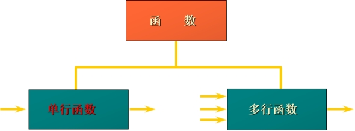
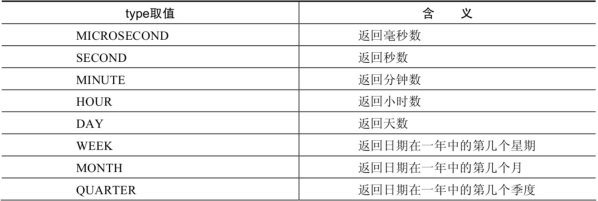
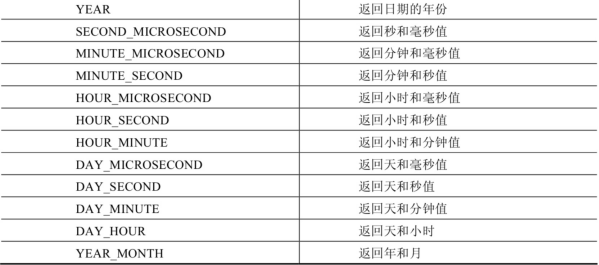

# 单行函数

## 函数的理解

MySQL 函数会对传递进来的参数进行处理，并返回一个处理结果，也就是返回一个值。

从函数定义的角度出发，我们可以将函数分成内置函数和自定义函数 。在 SQL语言中，同样也包括了内置函数和自定义函数。内置函数是系统内置的通用函数，而自定义函数是我们根据自己的需要编写的，本章咱们主要学习的是 SQL 的内置函数。

MySQL 包含了大量并且丰富的函数，咱们讲解几十个常用的，剩下的比较罕见的函数我们可以到「[MySQL 参考手册](https://dev.mysql.com/doc/refman/8.0/en/functions.html)」查询。<a href='https://www.sjkjc.com/mysql-ref/' style='color:white'>MySQL参考资料</a>

### 不同DBMS函数的差异

我们在使用  SQL  语言的时候，不是直接和这门语言打交道，而是通过它使用不同的数据库软件，即DBMS。**DBMS**  **之间的差异性很大，远大于同一个语言不同版本之间的差异。**实际上，只有很少的函数是被 DBMS 同时支持的。比如，大多数 DBMS 使用（||）或者（+）来做拼接符，而在 MySQL 中的字符串拼接函数为concat()。大部分 DBMS  会有自己特定的函数，这就意味着**采用** **SQL**  **函数的代码可移植性是很差的**，因此在使用函数的时候需要特别注意。

### MySQL的内置函数及分类

MySQL提供了丰富的内置函数，这些函数使得数据的维护与管理更加方便，能够更好地提供数据的分析  与统计功能，在一定程度上提高了开发人员进行数据分析与统计的效率。

MySQL提供的内置函数从 实现的功能角度 可以分为数值函数、字符串函数、日期和时间函数、流程控制函数、加密与解密函数、获取MySQL信息函数、聚合函数等。这里，我将这些丰富的内置函数再分为两类： 单行函数 、 聚合函数（或分组函数） 。

**两种SQL函数**


 


**单行函数**

+ 操作数据对象

+ 接受参数返回一个结果

+ **只对一行进行变换**
+ **每行返回一个结果**
+ 可以嵌套

+ 参数可以是一列或一个值

## 字符串函数

| 函数                                                         | 作用                                                         |
| ------------------------------------------------------------ | ------------------------------------------------------------ |
| UPPER(列\|字符串)<br>UCASE(str)                              | 将字符串每个字符转为大写                                     |
| LOWER(列\|字符串)<br>LCASE(str)                              | 将字符串每个字符转为小写                                     |
| CONCAT(str1,str2,...)                                        | 将所有字符串连接成一个字符串                                 |
| REPLACE(列\|字符串,新字符串)                                 | 使用新字符串替换旧字符串                                     |
| INSERT(列\|字符串,idx,len,newStr)                            | 将字符串中idx开始长度为len的字符串，替换为newStr             |
| LENGTH(列\|字符串)                                           | 求字符串长度(字节大小)                                       |
| CHAR_LENGTH(列\|字符串)                                      | 求字符串长度(字符长度，与编码有关)                           |
| SUBSTR(列\|字符串,开始点[,长度])                             | 字符串截取                                                   |
| LEFT(str,len)                                                | 获取字符串左边len个字符组成的字符串                          |
| RIGHT(str,len)                                               | 获取字符串右边len个字符组成的字符串                          |
| MID(str,pos,len)                                             | 获取字符串中从pos(第几个)位置开始，长度为len的字符串         |
| ASCII(字符)                                                  | 返回与指定字符对应的十进制整数                               |
| CHR(数字)                                                    | 返回与整数对应的字符                                         |
| RPAD(列\|字符串,长度,填充字符)<br>LPAD(列\|字符串,长度,填充字符) | 用指定的字符在字符串右或左填充(长度是指，输出的数据总长度)   |
| LTRIM(字符串)、RTRIM(字符串)                                 | 去掉字符串左或右的空格                                       |
| TRIM(列\|字符串)                                             | 去掉字符串左右空格                                           |
| TRITRIM([BOTH \| LEADING \| TRAILING] rmStr FROM str)        | 去掉字符串str中的rmStr。BOTH表示去掉前后，LEADING表示只去掉前面的，TRAILING表示是去掉后面的(默认为BOTH) |
| INSTR(str,subStr)<br>LOCATR(subStr,str)<br>POSITION(subStr IN str) | 查找subStr是否在str中出现，返回index                         |
| REPEAT(str,count)                                            | 返回str重复count次的结果                                     |
| SPACE(n)                                                     | 返回n个空格                                                  |
| STRCMP(str1,str2)                                            | str1大于str2返回1，str1等于str2返回0，str1小于str2返回-1     |
| ELT(n,str1,str2,str3,...)                                    | 返回指定位置的字符串，若n=1返回str1，n=2返回str2，以此类推   |
| FIELD(str,str1,str2,str3,...)                                | 返回str在字符串列表中第一次出现的位置(若str=str2，则返回2)   |
| FIND_IN_SET(str,strlist)                                     | 同上，只不过strlist是一个字符串，里面的子串用逗号分隔;如：FIND_IN_SET('maye','moying,maye,liqi,qiangseng') 返回2 |
| REVERSE(str)                                                 | 反转字符串                                                   |
| NULLIF(expr1,expr2)                                          | 如果expr1=expr2，返回NULL，不相等返回expr1                   |

1. 把员工姓名首字母大写

```mysql

```

2. 查询出姓名长度是5的所有员工信息

```mysql

```

3. 查询出员工姓名前三个字母是‘JAM’的员工

```mysql

```

4. 查询所有员工信息，但是不显示姓名的前三个字母

```mysql

# 只显示后三个字符

```

5. 填充

```mysql

```


## 日期和时间函数

### 获取日期、时间

| 函数                                                         | 作用                      |
| ------------------------------------------------------------ | ------------------------- |
| CURDATE()，CURRENT_DATE()                                    | 返回当前日期(年月日)      |
| CURTIME()，CURRENT_TIME()                                    | 返回当前时间(时分秒)      |
| NOW()，CURRENT_TIMESTAMP()，LOCALTIME()，<br/>SYSDATE()，LOCALTIMESTAMP() | 返回会当前日期和时间      |
| UTC_DATE()                                                   | 返回UTC(世界标准时间)日期 |
| UTC_TIME()                                                   | 返回UTC(世界标准时间)时间 |

> CURRENT_DATE、CURRENT_TIME、LOCALTIME、CURRENT_TIMESTAMP、LOCALTIMESTAMP后面的括号可以省略不写(不写则是类似于变量)。

举例：

```mysql
SELECT CURDATE(),CURRENT_DATE+1,
			 CURTIME(),CURRENT_TIME,
			 NOW(),LOCALTIME,CURRENT_TIMESTAMP,SYSDATE(),LOCALTIMESTAMP;
```


### 日期与时间戳的转换

> UNIX 时间戳值是距离 UTC 时间 `1970-01-01 00:00:00` 的秒数。

| 函数                     | 作用                                     |
| ------------------------ | ---------------------------------------- |
| UNIX_TIMESTAMP()         | 以UNIX时间戳的形式返回当前时间。         |
| UNIX_TIMESTAMP(date)     | 将时间date以UNIX时间戳的形式返回。       |
| FROM_UNIXTIME(timestamp) | 将UNIX时间戳的时间转换为普通格式的时间。 |

举例：

```mysql
SELECT 
	UNIX_TIMESTAMP(),
	FROM_UNIXTIME(UNIX_TIMESTAMP(NOW()));
```


### 获取月份、星期、星期数、天数等函数

| **函数**                                 | **用法**                                        |
| ---------------------------------------- | ----------------------------------------------- |
| YEAR(date) / MONTH(date) / DAY(date)     | 返回具体的日期值                                |
| HOUR(time) / MINUTE(time) / SECOND(time) | 返回具体的时间值                                |
| MONTHNAME(date)                          | 返回月份：January，...                          |
| DAYNAME(date)                            | 返回星期几：MONDAY，TUESDAY	SUNDAY           |
| WEEKDAY(date)                            | 返回周几，注意，周1是0，周2是1，。。。周日是6   |
| QUARTER(date)                            | 返回日期对应的季度，范围为1～4                  |
| WEEK(date) ， WEEKOFYEAR(date)           | 返回一年中的第几周                              |
| DAYOFYEAR(date)                          | 返回日期是一年中的第几天                        |
| DAYOFMONTH(date)                         | 返回日期位于所在月份的第几天                    |
| DAYOFWEEK(date)                          | 返回周几，注意：周日是1，周一是2，。。。周六是7 |


### 日期操作函数

| **函数**                | **用法**                                                     |
| ----------------------- | ------------------------------------------------------------ |
| EXTRACT(type FROM date) | 指定的日期/时间中**提取**指定的部分并返回,type表示需要提取的部分。 |

函数中type的取值与含义如下：





举例：

```mysql
SELECT EXTRACT(DAY FROM NOW()),EXTRACT(HOUR FROM NOW());
```


### 时间和秒钟转换函数

| **函数**             | **用法**                                                     |
| -------------------- | ------------------------------------------------------------ |
| TIME_TO_SEC(time)    | 将 time 转化为秒并返回结果值。转化的公式为： 小时*3600+分钟*60+秒 |
| SEC_TO_TIME(seconds) | 将 seconds 描述转化为包含小时、分钟和秒的时间                |

举例：

```sql
SELECT TIME_TO_SEC('1:0:0'),SEC_TO_TIME(60);
```


### 计算日期和时间的函数

#### 第一组

| **函数**                                                     | **用法**                                       |
| ------------------------------------------------------------ | ---------------------------------------------- |
| DATE_ADD(datetime, INTERVAL expr type)， ADDDATE(date,INTERVAL expr type) | 返回与给定日期时间相差INTERVAL时间段的日期时间 |
| DATE_SUB(date,INTERVAL expr type)， SUBDATE(date,INTERVAL expr type) | 返回与date相差INTERVAL时间间隔的日期           |

上述函数中type的取值：


举例：

```sql
SELECT DATE_ADD(NOW(),INTERVAL 1 DAY),
			 ADDDATE(NOW(),INTERVAL 1 DAY),ADDDATE(NOW(),1);
```


#### 第二组

| **函数**                     | **用法**                                                     |
| ---------------------------- | ------------------------------------------------------------ |
| ADDTIME(time1,time2)         | 返回time1加上time2的时间。当time2为一个数字时，代表的是秒 ，可以为负数 |
| SUBTIME(time1,time2)         | 返回time1减去time2后的时间。当time2为一个数字时，代表的是 秒 ，可以为负数 |
| DATEDIFF(date1,date2)        | 返回date1 - date2的日期间隔天数                              |
| TIMEDIFF(time1, time2)       | 返回time1 - time2的时间间隔                                  |
| FROM_DAYS(N)                 | 返回从0000年1月1日起，N天以后的日期。注意：根据mysql官方文档描述，如果将此函数的参数设置为较小的数字(大约 N < 1582*365)，则它是不可靠的。 |
| TO_DAYS(date)                | 返回日期date距离0000年1月1日的天数                           |
| LAST_DAY(date)               | 返回date所在月份的最后一天的日期                             |
| PERIOD_ADD(period,n)         | 在指定年月上加上指定的月数将结果作为年月返回。period使用 `YYYYMM` 或 `YYMM` 格式表示的日期 |
| MAKEDATE(year,n)             | 根据年份和一年中天数创建一个日期并返回。                     |
| MAKETIME(hour,minute,second) | 将给定的小时、分钟和秒组合成时间并返回                       |

举例：

+ PERIOD_ADD

  ```sql
  SELECT PERIOD_ADD(202301,20);
  ```

+ MAKEDATE、MAKETIME

  ```sql
  SELECT MAKEDATE(2024,31),MAKEDATE(2024,60),MAKETIME(15,16,3);
  ```

  

### 日期格式化与解析函数

| **函数**                          | **用法**                                   |
| --------------------------------- | ------------------------------------------ |
| DATE_FORMAT(date,fmt)             | 按照字符串fmt格式化日期date值              |
| TIME_FORMAT(time,fmt)             | 按照字符串fmt格式化时间time值              |
| GET_FORMAT(date_type,format_type) | 返回日期字符串的显示格式                   |
| STR_TO_DATE(str, fmt)             | 按照字符串fmt对str进行解析，解析为一个日期 |

上述 非GET_FORMAT 函数中fmt参数常用的格式符：

| **格式符** | **说明**                                                    | **格式符** | **说明**                                                    |
| ---------- | ----------------------------------------------------------- | ---------- | ----------------------------------------------------------- |
| %Y         | 四位数字表示年份                                            | %y         | 表示两位数字表示年份                                        |
| %M         | 月名表示月份（January,	）                                | %m         | 两位数字表示月份（01,02,03。。。）                          |
| %b         | 缩写的月名（Jan.，Feb.，	）                              | %c         | 数字表示月份（1,2,3,...）                                   |
| %D         | 英文后缀表示月中的天数（1st,2nd,3rd,...）                   | %d         | 两位数字表示月中的天数(01,02...)                            |
| %e         | 数字形式表示月中的天数（1,2,3,4,5.....）                    |            |                                                             |
| %H         | 两位数字表示小数，24小时制（01,02..）                       | %h和%I     | 两位数字表示小时，12小时制（01,02..）                       |
| %k         | 数字形式的小时，24小时制(1,2,3)                             | %l         | 数字形式表示小时，12小时制（1,2,3,4....）                   |
| %i         | 两位数字表示分钟（00,01,02）                                | %S和%s     | 两位数字表示秒(00,01,02...)                                 |
| %W         | 一周中的星期名称（Sunday...）                               | %a         | 一周中的星期缩写（Sun.，Mon.,Tues.，..）                    |
| %w         | 以数字表示周中的天数(0=Sunday,1=Monday	)                 |            |                                                             |
| %j         | 以3位数字表示年中的天数(001,002...)                         | %U         | 以数字表示年中的第几周，（1,2,3。。）其中Sunday为周中第一天 |
| %u         | 以数字表示年中的第几周，（1,2,3。。）其中Monday为周中第一天 |            |                                                             |
| %T         | 24小时制                                                    | %r         | 12小时制                                                    |
| %p         | AM或PM                                                      | %%         | 表示%                                                       |

GET_FORMAT函数中date_type和format_type参数取值如下：


> EUR 欧盟
>  	   USA 美国
> 	    JIS 日本工业标准
>  	   ISO 国际标准
> 	    INTERNAL MYSQL内部？

举例：

+ GET_FORMAT

```sql
SELECT GET_FORMAT(DATE, 'ISO'),
			 GET_FORMAT(TIME, 'ISO'),
			 GET_FORMAT(DATETIME, 'ISO'),
			 GET_FORMAT(TIMESTAMP, 'ISO'),
			 '---------------',
			GET_FORMAT(DATE, 'INTERNAL'),
			 GET_FORMAT(TIME, 'INTERNAL'),
			 GET_FORMAT(DATETIME, 'INTERNAL'),
			 GET_FORMAT(TIMESTAMP, 'INTERNAL');	
```


+ STR_TO_DATE

```sql
SELECT STR_TO_DATE('2024*02*18','%Y*%m*%d');
```


## 数学函数

| 函数                      | 作用                                                         |
| ------------------------- | ------------------------------------------------------------ |
| ROUND(数字[,保留位数])    | 根据指定的保留位数对小数进行四舍五入，如果不指定保留位数，则小数点之后的数字全部进行全部四舍五入 |
| TRUNCATE(数字[,截取位数]) | 保留指定位数的小数，如果不指定，则表示不保留                 |
| CEIL(数字)，CEILING(数字) | 对小数向上取整                                               |
| FLOOR(数字)               | 对小数向下取整                                               |
| RAND([n])                 | 随机返回0到1.0之间的小数，如果指定n每次产生的就都是重复的    |
| ABS(x)                    | 返回x的绝对值                                                |
| SIGN(X)                   | 返回X的符号。正数返回1，负数返回-1，0返回0                   |
| PI()                      | 返回圆周率的值                                               |

通过数据库的函数，生成一个六位数字的随机验证码。

```mysql
SELECT LPAD(TRUNCATE(RAND()*1000000,0),6,'0');
```


## 条件判断函数

| 函数           | 作用                                               |
| -------------- | -------------------------------------------------- |
| IF(expr,v1,v2) | 如果表达式expr成立，返回结果v1；否则，返回结果v2。 |
| IFNULL(v1,v2)  | 如果v1的值不为NULL，则返回v1，否则返回v2           |
| CASE           | 分支(详见下面)                                     |

+ `IF(expr,v1,v2)`

```mysql
SELECT IF(1>0,'true','false');
->true
```

+ `IFNULL(v1,v2)`

```mysql
SELECT IFNULL(NULL,'maye');
->maye
```

+ `CASE`

  **语法1：**

```mysql
CASE
	WHEN expr1 THEN V1
	WHEN expr2 THEN V2
	...
	ELSE vn
END	
```

```mysql
SELECT CASE 
　　WHEN 1 > 0
　　THEN '1 > 0'
　　WHEN 2 > 0
　　THEN '2 > 0'
　　ELSE '3 > 0'
　　END
->1 > 0
```

**语法2：**

```mysql
CASE expr 
　　WHEN e1 THEN v1
　　WHEN e1 THEN v1
　　...
　　ELSE vn
END
```

```mysql
SELECT CASE 1 
　　WHEN 1 THEN '我是1'
　　WHEN 2 THEN '我是2'
ELSE '你是谁'
```


## 系统信息函数

> 系统信息函数用来查询MySQL数据库的系统信息。

| 函数                                                         | 作用                        |
| ------------------------------------------------------------ | --------------------------- |
| VERSION()                                                    | 返回数据库的版本号          |
| CONNECTION_ID()                                              | 返回服务器的连接数          |
| DATABASE()、SCHEMA()                                         | 返回当前数据库名            |
| USER()、SYSTEM_USER()、SESSION_USER()、CURRENT_USER()、CURRENT_USER | 返回当前用户                |
| CHARSET(str)                                                 | 返回字符串str的字符集       |
| COLLATION(str)                                               | 返回字符串str的字符排列方式 |

## 加密函数

> 加密函数是MySQL用来对数据进行加密的函数.

| 函数                           | 作用                                                         |
| ------------------------------ | ------------------------------------------------------------ |
| MD5(str)                       | 对字符串str进行散列(得到32位字符串)，可以用于一些普通的不需要解密的数据加密，如密码 |
| SHA(str)                       | 对字符串str进行散列(得到40位字符串)，可以用于一些普通的不需要解密的数据加密，如密码，比MD5更安全 |
| AES_ENCRYPT(str,key_str)       | 返回使用key_str加密str之后的二进制字符串                     |
| AES_DECRYPT(crypt_str,key_str) | 返回使用key_str解密crypt_str的原字符串(crypt_str必须是通过AES_ENCRYPT加密的) |


## 其他函数

### 1.进制转换

| 函数                      | 作用                                |
| ------------------------- | ----------------------------------- |
| BIN(x)                    | 返回x的二进制                       |
| HEX(x)                    | 返回x的十六进制                     |
| OCT(x)                    | 返回x的八进制                       |
| CONV(x,from_base,to_base) | 将from_base进制的x，转成to_base进制 |

```mysql
SELECT BIN(10),HEX(10),OCT(10),CONV(16,16,10);
->1010 A 12 22
```

### 2.IP地址转换

| 函数              | 作用                         |
| ----------------- | ---------------------------- |
| INET_ATON(IP)     | 将点分十进制的IP地址转为数字 |
| INET_NTOA(number) | 将数字形式的IP转为点分十进制 |

```mysql
SELECT INET_ATON('192.168.0.1')
    ->3232235521
SELECT INET_NTOA(3232235521)
    ->192.168.0.1
```

### 3.类型、编码转换

| 函数                                 | 作用                                   |
| ------------------------------------ | -------------------------------------- |
| CONVERT(expr,type)                   | 将expr转换成type类型                   |
| CONVERT(expr USING transcoding_name) | 将expr转换成transcoding_name对应的编码 |

举例：

```sql
SELECT CONVERT('20240129',DATE),CONVERT('12:36:2',TIME)
```

```sql
SELECT CONVERT('maye' USING latin1),CONVERT('你好' USING 'latin1'),CONVERT('你好' USING 'utf8mb4')
```

