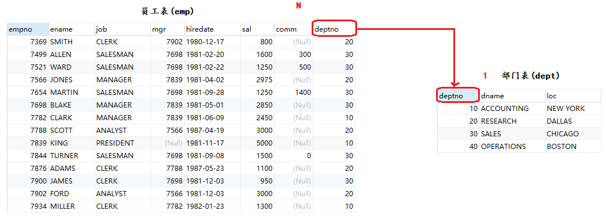
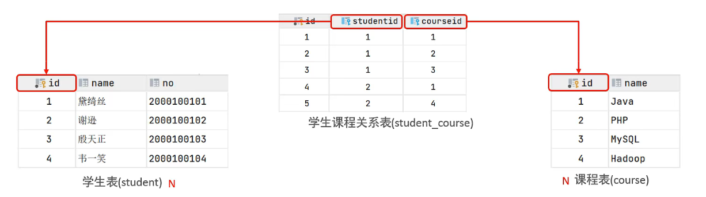
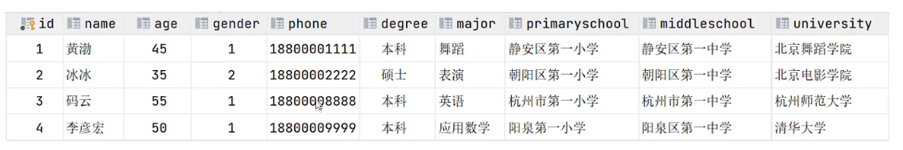
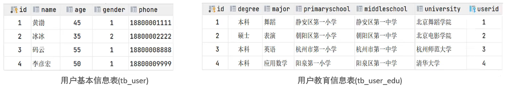

## 多表关系

项目开发中，在进行数据库表结构设计时，会根据业务需求及业务模块之间的关系，分析并设计表结构，由于业务之间相互关联，所以各个表结构之间也存在着各种联系，基本上分为三种：

+ 一对多（多对一）
+ 多对多
+ 一对一


### 一对多(多对一)

案例：部门与员工的关系

关系：一个部门对应多个员工，一个员工对应一个部门

实现：在多的一方建立外键，关联另一方的主键



### 多对多

案例：学生与课程的关系

关系：一个学生可以选修多门课程，一门课程也可以供多个学生选择

实现：建立第三张中间表，中间表至少包含两个外键，分别关联两方主键




### 一对一

案例：用户与用户详细的关系

关系：一对一关系，多用于单表拆分，将一张表的基础字段放在一张表中，其他详情字段放在另一张表中，以提升操作效率。



实现：在任意一方加入一个外键，关联另一方的主键，并且设置外键为唯一约束




## 连接查询

SELECT查询不但可以从一张表查询数据，还可以从多张表同时查询数据。MySQL的连接查询（Join Query）允许我们将多个表中的数据组合在一起，以便进行更复杂的查询和分析。

连接查询是一种将两个或多个表中的数据组合在一起的查询方式。通过连接查询，我们可以根据某些条件将不同表中的行关联起来，从而获取更丰富的数据集。

连接查询分为**交叉连接**、**内连接**、**外连接**查询三种方式。

在MySQL中，常见的连接类型包括：

- **内连接（INNER JOIN）**：返回两个表中满足连接条件的行。
- **左连接（LEFT JOIN）**：返回左表中的所有行，以及右表中满足连接条件的行。如果右表中没有匹配的行，则结果中右表的列将包含NULL。
- **右连接（RIGHT JOIN）**：返回右表中的所有行，以及左表中满足连接条件的行。如果左表中没有匹配的行，则结果中左表的列将包含NULL。
- **全外连接（FULL OUTER JOIN）**：返回左表和右表中的所有行。如果某一行在另一个表中没有匹配的行，则结果中对应的列将包含NULL。

> MySQL不支持FULL OUTER JOIN，但可以通过UNION操作来模拟。

### 交叉连接(CROSS JOIN)

**交叉连接（CROSS JOIN）** 是一种用于生成两个表之间所有可能组合的连接方式。它不需要任何条件来匹配行，而是简单地将第一个表的每一行与第二个表的每一行进行组合。交叉连接的结果集是两个表的笛卡尔积。

> 笛卡尔积是指两个集合之间所有可能有序对的集合，通常表示为**A×B**，其中每个有序对的第一个元素来自集合**A**，第二个元素来自集合**B**。

#### 语法

交叉连接语法如下：

```sql
SELECT 字段名 FROM 表1 CROSS JOIN 表2;
```

或者你也可以用以下等效语法：

```sql
SELECT 字段名 FROM 表1,表2;
```

> 虽然第二种语法更简洁，但为了代码的可读性和明确性，建议使用`CROSS JOIN`关键字。

#### 示例

我们对`emp`和`dept`两个表执行交叉连接：

```mysql
SELECT * FROM emp CROSS JOIN dept;　
```

emp表有14条记录，dept表中有4条记录，交叉连接查询得出的结果集，记录条数为56条。也就是说emp表中的每一行都与dept表中的每一行进行了组合。

> 交叉连接会生成大量的数据，尤其是在表中有大量行的情况下。因此，在使用交叉连接时，务必谨慎，确保不会对数据库性能产生负面影响

####  表别名

当使用多表连接查询时，如果多个表中有相同的字段名，那么会有二义性问题！

```sql
SELECT deptno FROM emp CROSS JOIN dept;

-- 1052 - Column 'deptno' in field list is ambiguous
```

我们必须使用**表名.字段名**这种方式来使用字段名，但是这种方法实在是太麻烦，尤其是当表明比较长的时候！

```sql
SELECT emp.deptno FROM emp CROSS JOIN dept;
```

所以SQL还允许给表设置一个别名，这样在使用时直接使用别名就好了：**实际上，当你取了别名之后，原来的名字就不能用了，必须使用别名。**

```sql
SELECT e.ename,e.deptno,d.dname FROM emp e CROSS JOIN dept d;
```


#### 等值连接（Equijoin）、非等值连接（Non-equijoin）

交叉连接会生成大量的数据，尤其是在表中有大量行的情况下，所以现在必须想办法消除掉笛卡尔积的无效记录。

想要消除笛卡尔积的无效记录，需要使用关联字段，根据不同情况可以使用等值连接和非等值连接。

##### 等值连接

等值连接是最常见的连接类型，它基于两个表之间的相等条件来连接记录。这通常意味着连接条件中的两个字段通过等于（`=`）操作符进行比较。

比如我们要查询每个员工对应的部门信息，可以使用如下SQL语句：

```sql
SELECT * FROM emp CROSS JOIN dept WHERE emp.deptno=dept.deptno;
```

在这个例子中，`emp`表和`dept`表通过`dept`字段进行了等值连接。

得到的结果是两个表中deptno相等的记录结合在一起，形成一条记录，结果集记录条数为14条。

##### 非等值连接

非等值连接则不使用等于（`=`）操作符来比较字段，而是可能使用其他比较操作符（如`>`、`<`、`>=`、`<=`、`<>`等）或者不使用任何直接的字段比较，而是通过表达式或函数来连接两个表。

比如我们要查询每个员工的薪资等级：

```sql
SELECT * FROM emp e CROSS JOIN salgrade s WHERE  e.sal BETWEEN s.losal AND s.hisal;
```

在这个例子中，`emp`表和`salgrade`表之间的连接是基于一个非等值条件，即`e.sal`位于`salgrade`表的`s.losal`和`s.hisal`之间。

### 内连接(INNER JOIN)

**内连接（INNER JOIN）** 是一种用于从多个表中提取相关数据的查询方式。它通过匹配两个表中的共同字段（通常是主键和外键）来返回满足条件的记录。

其实**交叉连接**加上WHERE条件在逻辑上就与内连接等价，但**强烈建议始终使用INNER JOIN语法**，因为：

1. 代码意图更明确
2. 更符合SQL标准
3. 减少错误风险
4. 更易于维护和调试

有两种，显式的和隐式的，返回连接表中符合连接条件和查询条件的数据行。（所谓的链接表就是数据库在做查询形成的中间表）。

#### 语法

内连接语法：

```mysql
SELECT * FROM 表1 [INNER] JOIN 表2 ON 条件; 
```

如果连接条件是等值的，并且两表中的字段名相同，则可以使用USING语法简化条件：

```sql
SELECT * FROM 表1 [INNER] JOIN 表2 USING(共同字段); 
```

#### 示例

直接把上面的交叉连接，加了条件的方式进行修改：

```sql
SELECT * FROM emp INNER JOIN dept ON emp.deptno=dept.deptno;
SELECT * FROM emp INNER JOIN dept USING(deptno);
```

结果一模一样。

查询薪资等级，同理：

```sql
SELECT * FROM emp e INNER JOIN salgrade s ON  e.sal BETWEEN s.losal AND s.hisal;
```


### 外连接(Outer Join)

**外连接**（Outer Join）是一种用于从多个表中检索数据的查询方式。与内连接（Inner Join）不同，外连接不仅返回匹配的行，还会返回不匹配的行。这使得外连接在处理数据时更加灵活，尤其是在需要保留所有记录的情况下。

外连接使用语法如下：

```mysql
SELECT * FROM 表1 LEFT|RIGHT|FULL [OUTER] JOIN 表2 ON 条件; 
```

#### 左外连接(LEFT JOIN)

**LEFT JOIN** 返回左表中的所有记录，以及右表中与左表匹配的记录。如果右表中没有匹配的记录，则结果中右表的部分将显示为 `NULL`。

##### 语法

左外连接如下：

```sql
SELECT * FROM 左表 LEFT [OUTER] JOIN 右表 ON 条件;
```

##### 示例

首先，插入一条部门编号为NULL的数据(关于插入后面会讲)

```mysql
INSERT INTO emp(empno,ename,job,mgr,hiredate,sal,comm,deptno) VALUES(6666,'顽石','teacher',7369,CURDATE(),800,100,NULL);
```

然后，查询员工及对应的部门信息（没有部门的员工也**显示**出来，没有员工的部门**不显示**）

```mysql
SELECT * FROM emp e LEFT JOIN dept d ON e.deptno=d.deptno;
```


#### 右外连接(RIGHT JOIN)

**RIGHT JOIN** 与 `LEFT JOIN` 相反，它返回右表中的所有记录，以及左表中与右表匹配的记录。如果左表中没有匹配的记录，则结果中左表的部分将显示为 `NULL`。

##### 语法

右外连接如下：

```sql
SELECT * FROM 左表 RIGHT [OUTER] JOIN 右表 ON 条件;
```

##### 示例

查询员工及对应的部门信息（没有部门的员工**不显示**，没有员工的部门**显示**）

```mysql
SELECT * FROM emp e RIGHT OUTER JOIN dept d ON e.deptno=d.deptno;
```


#### 全外连接(FULL JOIN)

**FULL OUTER JOIN** 返回左表和右表中的所有记录。如果某一行在其中一个表中没有匹配的记录，则结果中对应的部分将显示为 `NULL`。

> 注意：MySQL 本身不支持 `FULL OUTER JOIN`，但可以通过 `UNION` 实现类似的效果。

查询员工及对应的部门信息（没有部门的员工**显示**，没有员工的部门**显示**）:

```sql
SELECT * FROM emp e LEFT JOIN dept d ON e.deptno=d.deptno
UNION
SELECT * FROM emp e RIGHT JOIN dept d ON e.deptno=d.deptno;
```


### 自连接

**自连接（Self Join）** 是一种特殊的表连接方式，它允许我们将同一张表与其自身进行连接。自连接通常用于处理表中数据之间的层次结构或关系，例如员工与经理的关系、分类与子分类的关系等。

自连接是指将一张表与其自身进行连接。虽然听起来有些奇怪，但在某些场景下，这种操作非常有用。例如，我们有一张员工表，其中包含员工的ID、姓名以及经理的ID。如果我们想要查询每个员工及其经理的姓名，就需要使用自连接。

自连接的语法与其他连接（如内连接、左连接）类似，只是表名相同。我们可以通过为表设置别名来区分它们。

```mysql
SELECT e.ename,e.mgr,me.ename 领导 FROM emp e,emp me WHERE e.mgr=me.empno;
```

## 七种JOINS实现

### 图


### 左上图

左上图是左外连接：

```sql
SELECT * FROM emp LEFT JOIN dept USING(deptno);
```

### 右上图

右上图是右外连接：

```sql
SELECT * FROM emp RIGHT JOIN dept USING(deptno);
```

### 左中图

左中图是左外连接，但是去掉了右表中满足条件的记录，只保留在左表中但不在右表中的记录。

```sql
SELECT * FROM emp LEFT JOIN dept ON emp.deptno = dept.deptno
WHERE dept.deptno IS NULL;
```

### 右中图

右中图是右外连接，但是去掉了左表中满足条件的记录，只保留在右表中但不在左表中的记录。

```sql
SELECT * FROM emp RIGHT JOIN dept USING(deptno) 
WHERE emp.deptno IS NULL;
```

### 中图

中图是内连接。

```sql
SELECT * FROM emp JOIN dept USING(deptno) 
```

### 左下图

左下图是全连接，因为MySQL不支持全连接，所以必须通过UNION进行合成，合成方式有很多：

#### 左上和右中图合成

```sql
SELECT * FROM emp LEFT JOIN dept USING(deptno)
UNION -- 把两个结果集连接在一起，形成一个新的结果集(两个结果集的字段数量和类型必须一致)
SELECT * FROM emp RIGHT JOIN dept USING(deptno) 
WHERE emp.deptno IS NULL;
```

#### 右上图和左中图合成

```sql
SELECT * FROM emp RIGHT JOIN dept USING(deptno)
UNION
SELECT * FROM emp LEFT JOIN dept USING(deptno)
WHERE dept.deptno IS NULL;
```

### 只查询不满足条件的

直接将用左中图和右中图联合起来即可！

```sql
SELECT * FROM emp LEFT JOIN dept USING(deptno) 
WHERE dept.deptno IS NULL
UNION
SELECT * FROM emp RIGHT JOIN dept USING(deptno) 
WHERE emp.deptno IS NULL;
```

## 多表查询练习

查询出雇佣日期在2011年的所有员工的编号、姓名、雇佣日期、工作、领导姓名、雇佣月工资、雇佣年工资(基本工资+奖金)，工资等级、部门编号、部门名称、部门位置，并且求这些员工的月基本工资在4500~6500之间，将最后的结果按照年工资的降序排列，如果年工资相等，则按照工作进行排序。

**需求很多，逐步分析**

+ 确定所需要的数据表
  + emp：编号、姓名、雇佣日期，工作、月工资、年薪
  + emp：领导姓名
  + dept：部门编号、名称、位置
  + salgrade：工资等级
+ 确定一致的关联字段
  + 员工和领导：e.mgr=e1.empno
  + 员工和部门：e.deptno=dept.deptno
  + 员工和工资等级：e.sal BETWEEN s.losal AND s.hisal

**步骤一：**查询出所有在2011年雇佣的雇员编号、姓名、御用日期、工作、月工资、年工资，并且月薪在4500~6500之间。只需要emp单张表即可。

```mysql
SELECT e.empno,e.ename,e.hiredate,e.sal,(e.sal+IFNULL(e.comm,0))*12 年薪
FROM emp e
WHERE DATE_FORMAT(e.hiredate,'%Y')='2011' AND e.sal BETWEEN  4500 AND 6500;
```

**步骤二：**加入领导信息，使用自身关联。

```mysql
SELECT e.empno,e.ename,e.hiredate,e.sal,(e.sal+IFNULL(e.comm,0))*12 年薪,m.ename 领导
FROM emp e,emp m
WHERE DATE_FORMAT(e.hiredate,'%Y')='2011' AND e.sal BETWEEN  4500 AND 6500
AND e.mgr=m.empno;
```

**步骤三：**加入部门信息。

```mysql
SELECT e.empno,e.ename,e.hiredate,e.sal,(e.sal+IFNULL(e.comm,0))*12 年薪,m.ename 领导,d.deptno,d.dname,d.loc
FROM emp e,emp m,dept d
WHERE DATE_FORMAT(e.hiredate,'%Y')='2011' AND e.sal BETWEEN  4500 AND 6500
AND e.mgr=m.empno AND e.deptno=d.deptno;
```

**步骤四：**加入工资等级

```mysql
SELECT e.empno,e.ename,e.hiredate,e.sal,(e.sal+IFNULL(e.comm,0))*12 年薪,m.ename 领导,d.deptno,d.dname,d.loc,
s.grade
FROM emp e,emp m,dept d,salgrade s
WHERE DATE_FORMAT(e.hiredate,'%Y')='2011' AND e.sal BETWEEN  4500 AND 6500
AND e.mgr=m.empno AND e.deptno=d.deptno
AND e.sal BETWEEN s.losal AND s.hisal;
```

**步骤五：**排序

```mysql
SELECT e.empno,e.ename,e.hiredate,e.sal,(e.sal+IFNULL(e.comm,0))*12 年薪,m.ename 领导,d.deptno,d.dname,d.loc,
s.grade
FROM emp e,emp m,dept d,salgrade s
WHERE DATE_FORMAT(e.hiredate,'%Y')='2011' AND e.sal BETWEEN  4500 AND 6500
AND e.mgr=m.empno AND e.deptno=d.deptno
AND e.sal BETWEEN s.losal AND s.hisal
ORDER BY 年薪 DESC;
```


