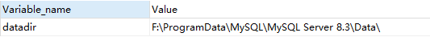

# 数据管理

## 插入数据

使用`INSERT INTO`语句来向表中插入数据。

**语法**

1. 给指定字段添加数据

```mysql
INSERT INTO 表名 (字段1，字段2...) VALUES	(value1，value2...);  
```

2. 给全部字段添加数据

```mysql
INSERT INTO 表名 VALUES	(value1，value2...);  
```

3. 批量添加数据（用单条 INSERT 语句处理多个插入要比使用多条 INSERT 语句更快）

```mysql
INSERT INTO 表名 (字段1，字段2...) VALUES	
									(value1，value2...),
									(value1，value2...),
									...;  
```

语法说明如下。

- `<表名>`：指定被操作的表名。
- `<列名>`：指定需要插入数据的列名。若向表中的所有列插入数据，则全部的列名均可以省略，直接采用 INSERT<表名>VALUES(…) 即可。
- `VALUES` 或 `VALUE` 子句：该子句包含要插入的数据清单。数据清单中数据的顺序要和列的顺序相对应。


**范例**

+ 向myemp表中添加一条新的数据

  ```mysql
  -- 推荐
  INSERT INTO myemp(empno,ename,job,mgr,hiredate,sal,comm,deptno)
  VALUES (7777,'顿开','CLERK',7369,'1989-09-19',600,NULL,20)
  -- 不推荐
  INSERT INTO myemp VALUES (8888,'maye'，'CLERK',7369,'1989-09-19',600,NULL,20)
  ```

  

+ 增加一个没有领导、没有部门也没有奖金的新员工

  ```mysql
  -- 1
  INSERT INTO myemp VALUES (6666,'李浩','CLERK',NULL,'1989-09-19',600,NULL,NULL);
  -- 2
  INSERT INTO myemp (empno,ename,job,hiredate,sal) VALUES (6667,'王二','CLERK','1989-09-19',600);
  
  SELECT * FROM myemp WHERE empno IN (6666,6667);
  ```

  

+ 编写完整格式将所有20部门的员工信息，插入到myemp表中。

  ```mysql
  INSERT INTO myemp(empno,ename,job,mgr,hiredate,sal,comm,deptno)
  SELECT * FROM emp WHERE deptno=20
  ```

  

+ 编写简写格式将10部门雇员的信息插入到myemp表之中

  ```mysql
  INSERT INTO myemp SELECT * FROM emp WHERE deptno=20
  ```

  

## 修改数据

使用`UPDATE ... SET`语句来修改表中的数据。

**语法**

```mysql
UPDATE 表名 SET 字段=value[，字段1=value,...] [WHERE 字句] [ORDER BY 子句] [LIMIT 子句];
```

语法说明如下：

- `<表名>`：用于指定要更新的表名称。
- `SET` 子句：用于指定表中要修改的列名及其列值。其中，每个指定的列值可以是表达式，也可以是该列对应的默认值。如果指定的是默认值，可用关键字 DEFAULT 表示列值。
- `WHERE` 子句：可选项。用于限定表中要修改的行。若不指定，则修改表中所有的行。
- `ORDER BY` 子句：可选项。用于限定表中的行被修改的次序。
- `LIMIT` 子句：可选项。用于限定被修改的行数。
- <font style='color:red'>注意：</font>在不使用 WHERE 条件的时候，将修改所有记录的字段

**范例**

+ 将SMITH（雇员编号为7369）的工资修改为3000元，并且每个月都有500元的奖金

  ```mysql
  UPDATE myemp SET sal=3000,comm=500 WHERE empno=7369;
  ```


**相关更新**

使用相关子查询依据一个表中的数据更新另一个表的数据。

+ 题目：在emp中增加一个dname字段，数据为员工对应的部门名称。

  + 先添加字段

  ```mysql
  ALTER TABLE emp ADD  dname VARCHAR(20);
  ```

  + 再更新数据

  ```mysql
  -- 错误
  UPDATE emp e
  SET dname=
  	(
          SELECT dname FROM dept d
          WHERE e.deptno = d.deptno
      );
  ```

  报错`You can't specify target table 'e1' for update in FROM clause`意思是`不能在FROM子句中指定更新的目标表'e1'`，说人话<font color=red>不能先select出同一表中的某些值，再update这个表(在同一语句中)</font>

  ```mysql
  -- 正确    
  DELETE FROM emp e1 WHERE e1.hiredate <
  (
  	SELECT * FROM (
  			SELECT e2.hiredate FROM emp e2
  			WHERE e2.empno = e1.mgr
  	) tmp
  );
  ```

  正确的写法，是把子查询当做一个表，再查询一次(这个时候结果集就相当于于emp没有关系了)


## 删除数据

使用`DELETE FROM`语句来删除表中的数据。

**语法**

```mysql
DELETE FROM 表名 [WHERE 子句] [ORDER BY 子句] [LIMIT 子句]; 
```

语法说明：

- `<表名>`：指定要删除数据的表名。
- `ORDER BY` 子句：可选项。表示删除时，表中各行将按照子句中指定的顺序进行删除。
- `WHERE` 子句：可选项。表示为删除操作限定删除条件，若省略该子句，则代表删除该表中的所有行。
- `LIMIT` 子句：可选项。用于告知服务器在控制命令被返回到客户端前被删除行的最大值。
- <font style='color:red'>注意：</font>在不使用 WHERE 条件的时候，将删除所有数据。

**查询需求：**

+ 删除30号部门的所有员工

```mysql
DELETE FROM emp WHERE deptno=30;
```

+ 按部门编号降序排列，并删除前6条数据

```mysql
DELETE FROM emp ORDER BY deptno DESC LIMIT 6;
```

+ 删除所有数据(清空)

```mysql
-- DELETE 是一条一条的删除，比较慢；删除的数据可以回滚；自增长列计数不会重置
DELETE FROM emp;
-- TRUNCATE 直接截断表，速度快；删除的数据不能回滚；自增长列计数重置
TRUNCATE emp;
```


**相关删除**

使用相关子查询依据一个表中的数据删除另一个表的数据。

+ 题目：删除表emp中，入职日期早于领导的入职日期的员工


## 实用的语句

### 删除重复数据

一张表里面以两个字段为唯一字段，当几条记录的这两个字段完全相同时，需要删除重复项

```mysql
#按指定的重复字段分组，然后求出每一组中ID最小的记录
SELECT MIN(id) FROM freecustomers GROUP BY qq,entrytime;
#除了上面求出的ID最小的记录之外，其他的记录都可以删除
DELETE FROM freecustomers WHERE id 
NOT IN (
				SELECT s1.min_id FROM 			#不能在删除freecustomers表的子查询中使用freecustomers表，所以要套一层
							(
                                SELECT MIN(id) min_id FROM freecustomers GROUP BY qq,entrytime
                            ) s1
			 );
```

### 插入时判断数据是否重复

```mysql
INSERT INTO freecustomers(qq,weixin,userid,assistant,entrytime,source,images,creater,createtime,deptName) 
SELECT ?,?,?,?,?,?,?,?,?,? FROM DUAL
WHERE NOT EXISTS(SELECT 1 FROM freecustomers
WHERE qq=? AND entrytime=? AND assistant=? AND creater=?);
```

# 数据库管理

## 1. 创建和管理数据库

### 1.1 创建数据库

+ 方式1：创建数据库

  ```mysql
  CREATE DATABASE 数据库名;
  ```

+ 方式2：创建数据库并指定字符集

  ```mysql
  CREATE DATABASE 数据库名 CHARACTER SET "uft8";
  ```

+ 方式3：判断数据库是否已经存在，不存在则创建（推荐）

  ```mysql
  CREATE DATABASE IF NOT EXISTS 数据库名;
  ```

  > 注意：数据库不能改名。一些可视化工具可以改名，它是创建新库，然后把所有表复制到新库，再把旧库删掉完成的。

数据库创建完成之后，可以通过`SHOW CREATE DATABASE 数据库名;`查看创建数据库时使用的语句。

### 1.2 使用数据库

+ 查看当前连接中有哪些数据库

```mysql
SHOW DATABASES;
```

+  切换数据库

在多个数据库之间切换

```mysql
USE 数据库名;
```

+ 查看当前使用的数据库

```mysql
SHOW DATABASE();
-- 或者
SELECT DATABASE() FROM DUAL;
```

+ 查看指定数据库所有表

```mysql
-- 查看指定数据库所有表
SHOW TABLES FROM 数据库名;
-- 查看当前正在使用的数据库中的表
SHOW TABLES;
```

### 1.3 修改数据库

修改数据库字符集

```mysql
ALTER DATABASE 数据库名 CHARACTER SET 字符集;	#比如 gbk、utf8
#查看默认字符集
SHOW VARIABLES LIKE '%character%';
#查看所有字符集
SHOW CHARSET;
```

### 2.4 删除数据库

+ 直接删除

  ```mysql
  DROP DATABASE 数据库名;
  ```

+ 如果数据库存在则删除，否则报一个警告(不会报错)

  ```mysql
  DROP DATABASE IF EXISTS 数据库名;
  ```

# 表管理

## 1. 基础知识

### 1.1 表的基本概念

在MySQL数据库中，表是一种很重要的数据库对象，是组成数据库的基本元素，由若干个字段组成，主要用来实现存储数据记录。表的操作包含创建表、查看表、删除表和修改表，这些操作是数据库对象的表管理中最基本、最重要的操作。
通过本节的学习，可以掌握在数据库中操作表，内容包含:

+ 表的相关概念;
+ 表的基本操作:创建、查看、更新和删除; 
+ 表的使用策略。

表是包含数据库中所有数据的数据库对象。数据在表中的组织方式与在电子表格中相似，都是按行和列的格式组织的。其中每一行代表一条唯一的记录，每一列代表记录中的一个字段，如下图所示。


### 1.2 标识符命名规范

1. 数据库名、表名不得超过30个字符，变量名限制为29个
2. 只能包含大写、小写、数字字符以及下划线
3. 同一个MySQL软件中，数据库不能同名；同一个库中，表不能重名；同一个表中，字段不能重名
4. 不能和保留字、函数名冲突
5. 保值字段名和类型的一致性：假如某个字段在一个表里面是整型，那在另一个表里面可就别变成字符串了

### 1.3 MySQL中的数据类型

| 类型             | 具体类型                                                     |
| ---------------- | ------------------------------------------------------------ |
| 整数类型         | TINYINT、SMALLINT、MEDIUMINT、INT(或INTEGER)、BIGINT         |
| 浮点类型         | FLOAT、DOUBLE                                                |
| 定点数类型       | DECIMAL                                                      |
| 位类型           | BIT                                                          |
| 日期时间类型     | YEAR、TIME、DATE、DATETIME、TIMESTAMP                        |
| 文本字符串类型   | CHAR、VARCHAR、TINYTEXT、TEXT、MEDIUMTEXT、LONGTEXT          |
| 枚举类型         | ENUM                                                         |
| 集合类型         | SET                                                          |
| 二进制字符串类型 | BINARY、VARBINARY、TINYBLOB、BLOB、MEDIUMBLOB、LONGBLOB      |
| json类型         | JSON对象、JSON数组                                           |
| 空间数据类型     | 单值：GEOMETRY、POINT、LINESTRING、POLYGON<br>集合：MULTPOINT、MULTILINESTRING、MULTIPOLGON、GEOMTRYCOLLECTION |

其中，常用的几类类型介绍如下：

| 类型          | 描述                                                         |
| ------------- | ------------------------------------------------------------ |
| INT           | 4个字节                                                      |
| CHAR(size)    | 定长字符数据，若未指定，默认为一个字符，最大长度255          |
| VARCHAR(size) | 可变字符数据，更具字符串实际长度保存，必须指定长度           |
| FLOAT(M,D)    | 单精度，4个字节。M=整数位+小数位，D=小数位（D<=M<=255,0<=D<=30）,默认M+D<=6 |
| DOUBLE(M,D)   | 双精度，8个字节。D<=M<=255,0<=D<=30，默认M+D<=15             |
| DECIMAL(M,D)  | 高精度，M+2个字节。D<=M<=65,0<=D<=30,默认最大取值范围和DOUBLE一样 |
| DATE          | 日期类型，格式‘YYY-MM-DD’                                    |
| BLOD          | 二进制心事的长文本数据，最大可达4G                           |
| TEXT          | 长文本数据，最大可达4G                                       |

## 2. 创建表

>  在 MySQL数据库管理系统中创建表通过SQL语句CREATE TABLE 来实现

### 2.1 常规创建

> 自己指定字段和数据类型

**语法：**

```mysql
CREATE TABLE [IF NOT EXISTS] 表名(
	字段名 数据类型，
    字段名 数据类型，
    ...
    字段名 数据类型，
);
```

**范例：**

```mysql
CREATE TABLE myemp
(
    id INT COMMENT '员工编号',
    ename VARCHAR(20) COMMENT '员工名称',
    deptno INT COMMENT '所在部门编号',
    sal INT COMMENT '工资'
);
```


### 2.2 基于其他表创建

> 基于现有表创建新表

+ 基于现有表创建新表,同时导入数据

  ```mysql
  #单个表
  CREATE TABLE myemp1
  AS
  SELECT empno,ename,sal FROM emp;
  
  #多个表
  CREATE TABLE myemp2
  AS
  SELECT e.empno,e.ename,e.sal,d.dname 
  FROM emp e JOIN dept d
  ON e.deptno=d.deptno;
  ```

+ 基于现有表创建新表，只复制表结构，不导入数据

  ```mysql
  CREATE TABLE myemp3
  AS
  SELECT empno,ename,sal FROM emp WHERE 1 = 2;
  ```

### 2.3 创建临时表

+ 使用`CREATE TEMPORARY TABLE`创建临时表，临时表最好以#号开头(表名需要用反引号包裹)

  ```mysql
  CREATE TEMPORARY TABLE `#tb_tmp`(
  	id INT,
  	name VARCHAR(20)
  );
  ```

  > 通过`SHOW TABLES;`是查看不到临时表的，没有办法可以查看

### 2.4 查看表结构

创建完表，如果需要查看一下表的结构，可以通过执行SQL语句 DESCRIBE来实现，其语法形式如下:

```mysql
DESC/DESCRIBE table_name;
```

DESC为DESCRIBE的简写形式，更为方便。


还有一种更详细查看表结构的语句：

```mysql
SHOW CREATE TABLE table_name;
```


## 3. 修改表

修改数据表的前提是数据库中已经存在该表。修改表指的是修改数据库中已经存在的数据表的结构。修改数据表的操作也是数据库管理中必不可少的，就像画素描一样，画多了可以用橡皮擦掉，画少了可以用笔加上。

### 3.1 修改数据表

#### 3.1.1 修改表名

**方法一：**通过 ALTER TABLE 语句来修改表名，语法规则如下：

```mysql
ALTER TABLE <旧表名> RENAME [TO] <新表名>;
```

其中，TO 为可选参数，使用与否均不影响结果。

只能对一张表的表名进行修改。

**范例：**

```mysql
ALTER TABLE myemp RENAME memp;
```


**方法二：**通过 RENAME TABLE 语句来修改表名，语法规则如下

```mysql
RENAME TABLE <旧表名> TO <新表名>[,旧表名2 TO 新表名2]
```

**范例：**

```mysql
RENAME memp TO myemp,myemp1 TO memp1;
```


可以同时修改多个表的表名。

#### 3.1.2 修改字符集

通过 ALTER TABLE 语句来实现表字符集的修改，语法规则如下：

```mysql
ALTER TABLE <表名> [DEFAULT] CHARACTER SET <字符集名> [DEFAULT] COLLATE <校对规则名>;
```

其中，DEFAULT 为可选参数，使用与否均不影响结果。

```mysql
ALTER TABLE myemp CHARACTER SET gb2312;
```


### 3.2 增加字段

对于表，可以看成是由列和行来构成的，其中“列”经常被称为字段。

#### 3.2.1 在最后添加字段

在创建表之后如果要增加一列，需要使用下面的语句。

```mysql
ALTER TABLE table_name ADD 字段名 数据类型;
```

**范例：**

```mysql
ALTER TABLE myemp ADD job VARCHAR(10);
```


#### 3.2.2 在第一个位置添加字段

```mysql
ALTER TABLE table_name ADD 字段名 数据类型 FIRST;
```

#### 3.2.3 在指定位置添加字段

把字段1 添加到字段2之后

```mysql
ALTER TABLE table_name ADD 字段名1 数据类型 AFTER 字段名2;
```

### 3.3 删除字段

```mysql
ALTER TABLE table_name DROP 字段名;
```

### 3.4 修改字段

#### 3.4.1 修改字段的数据类型

```mysql
ALTER TABLE table_name MODIFY 字段名 数据类型;
```

#### 3.4.2 修改字段名

```mysql
ALTER TABLE table_name CHANGE 旧字段名 新字段名 数据类型;
```

如果数据类型和原来的数据类型一样，则只会修改字段名，如果数据类型不同，则同时会修改数据类型。

#### 3.4.3 修改字段的顺序

```mysql
ALTER TABLE table_name MODIFY	字段名 数据类型 FIRST;
ALTER TABLE table_name MODIFY	字段名1 数据类型 AFTER 字段名2;	
```

+ 第一个语句：把字段移动到第一个
+ 第二个语句：把字段1 移动到字段2之后

## 4. 删除表

```mysql
DROP TABLE [IF EXISTS] table_name[,表1,表2...];
```


# 字符集设置

## 前言

MySQL 8.0 的默认字符集是 `utf8mb4`。这个字符集支持存储所有的 Unicode 字符，包括 emoji 表情符号，以及那些需要最多 4 个字节来存储的字符。

在 MySQL 8.0 之前，默认的字符集是 `latin1` 或 `utf8`，但 `utf8` 在 MySQL 中只能存储最多 3 个字节的字符，因此它不支持所有的 Unicode 字符。

`utf8mb4` 字符集解决了这个问题，因为它支持所有的 Unicode 字符，并且它向后兼容 `utf8`。这意味着，如果你有一个使用 `utf8` 字符集的数据库或表，并且你想将其迁移到 `utf8mb4`，那么大多数应用程序和工具都不需要做任何修改。

## 查看字符集

使用`SHOW VARIABLES LIKE '%character%';`查看字符集设置。


以下是一些可能出现在结果中的变量及其通常的含义：

- `character_set_client`：客户端使用的字符集。这是从客户端连接到服务器时使用的字符集。
- `character_set_connection`：连接层字符集。它定义了 MySQL 服务器如何解释从客户端发送来的字节。
- `character_set_database`：当前选定数据库的默认字符集。
- `character_set_filesystem`：文件系统字符集。MySQL 用于解释存储在文件系统上的文件名的字符集。
- `character_set_results`：结果集字符集。这是服务器返回给客户端的查询结果的字符集。
- `character_set_server`：服务器字符集。MySQL 服务器的默认字符集。
- `character_set_system`：系统字符集。这是 MySQL 系统元数据（如表名、列名等）使用的字符集，通常是 `utf8mb4`。
- `character_sets_dir`：它指定了字符集安装的目录。这个目录包含了 MySQL 服务器支持的所有字符集的相关文件。


使用`SHOW VARIABLES LIKE '%collation%';`查看校对规则。


## 设置字符集方式

### 创建数据库时指定

```mysql
CREATE DATABASE 数据库名 CHARACTER SET "uft8mb4";
-- 同时指定校对规则
CREATE DATABASE 数据库名 CHARACTER SET "uft8mb4" COLLATE utf8mb4_0900_ai_ci;
```

### 创建表时指定

```mysql
CREATE TABLE `表名`
(
    ...
)DEFAULT CHARSET=utf8mb4 COLLATE=utf8mb4_0900_ai_ci
```

### 修改配置文件

如果不知道配置文件在哪里，可以通过`SHOW VARIABLES LIKE 'datadir';`查看数据目录，配置文件一般也在这里。



然后打开my.ini配置文件，找到两个地方进行修改：

+ 第一个是[mysql]组下的*# default-character-set=*，#号是注释，把它去掉然后再=号后面写上utf8mb4即可！
+ 第二个是[mysqld]组下的*# character-set-server=*，像第一个一样即可！

```mysql
default-character-set=utf8 
character-set-server=utf8
```

**修改完毕后，重启服务器即可！**

### 命令行客户端

在某些时候，通过命令行查看表格，中文会显示乱码！这个时候就可以在登录时，指定客户端的字符集。

```css
mysql -uroot -p -P 33061 --default-character-set=utf8mb4
```