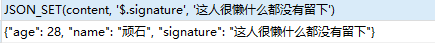
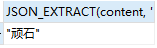
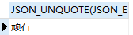

[太实用了！JSON在Mysql中原来可以这么玩](https://zhuanlan.zhihu.com/p/320704431)

[深入了解 MySQL 的 JSON 数据类型（关系型数据库里的 NoSQL 初探）](https://learnku.com/laravel/t/13185/in-depth-understanding-of-json-data-type-of-mysql-nosql-in-relational-database)

[MySQL8系统函数、自定义函数、自定义存储过程及新增JSON类型](https://www.bilibili.com/video/BV1TJ411Q7Wu)

# JSON类型

## 简介

MySQL 支持由 RFC 7159 定义的原生JSON 数据类型，该数据类型可以有效访问 JSON（JavaScript Object Notation）中的元素数据。

MYSQL 8.0，除了提供JSON 数据类型，还有一组 SQL 函数可用于操作 JSON 的值，例如创建JSON对象、增删改查JSON数据中的某个元素。

## JSON字段

### 创建表

创建表时，要把字段类型设置为JSON类型：

```mysql
CREATE TABLE t_json(
	id INT,
	content JSON
);
```

### 插入数据

插入数据可以像插入varchar类型的数据一样，把json串添加单引号进行插入：

```mysql
-- JSON对象
INSERT INTO t_json(id,content) VALUE(1,'{"name":"maye","age":28}');
-- JSON数组
INSERT INTO t_json(id,content) VALUE(3,'[1,2,3,4,5,6]');
-- 混合使用
INSERT INTO t_json(id,content) VALUE(5,'{"name":"hello","numbers":[1,2,3,4,5]}');
```

当然也可以使用mysql提供的`JSON_OBJECT`或`JSON_ARRAY`函数创建对象或数组：

```mysql
-- JSON对象
INSERT INTO t_json(id,content) VALUE(2,JSON_OBJECT("name","maye","age",28));
-- JSON数组
INSERT INTO t_json(id,content) VALUE(4,JSON_ARRAY(1,2,3,4,5,6));
-- 混合使用
INSERT INTO t_json(id,content) VALUE(6,JSON_OBJECT("name","hello","numbers",JSON_ARRAY(1,2,3,4,5)));
```

## JSON元素操作

### JSON_SET 插入

使用JSON_SET函数可以向JSON文档中插入键值对。

+ 如果键存在则修改值

  ```mysql
  SELECT  JSON_SET(content, '$.name', '顽石') FROM t_json WHERE id = 1;
  ```

  

+ 如果键不存在则插入键值对

  ```mysql
  SELECT  JSON_SET(content, '$.signature', '这人很懒什么都没有留下') FROM t_json WHERE id = 1;
  ```

  

**注意：**通过SELECT进行的修改不会影响表中的数据，如果需要更新表中的数据，需要使用UPDATE语句。

```mysql
UPDATE t_json SET content = JSON_SET(content, '$.name', '顽石') WHERE id = 1;
```

与JSON_SET类似的函数有`JSON_INSERT`和`JSON_REPLACE`，不同点在于`JSON_INSERT`插入时，如果键存在什么都不做，如果键不存在则插入；`JSON_REPLACE`键存在时替换旧值，键不存在时什么都不做。

### JSON_REMOVE 删除

使用JSON_REMOVE函数可以从JSON文档中删除键值对。

```mysql
SELECT  JSON_REMOVE(content, '$.name') FROM t_json WHERE id = 1;
```

### JSON_EXTRACT 提取

#### 函数形式

使用JSON_EXTRACT函数可以从JSON文档中提取需要的键值对。

```mysql
SELECT  JSON_EXTRACT(content, '$.name') FROM t_json WHERE id = 1;
```



结果是带双引号的，使用`JSON_UNQUOTE`函数可以去掉双引号。

```mysql
SELECT  JSON_UNQUOTE(JSON_EXTRACT(content, '$.name')) FROM t_json WHERE id = 1;
```



提取数组中的数据也是类似的：

```mysql
-- 1 
SELECT  
JSON_EXTRACT(content, '$.name'),
JSON_EXTRACT(content, '$.numbers'),
JSON_EXTRACT(content, '$.numbers[0]') ,
JSON_EXTRACT(content, '$.numbers[1]') ,
JSON_EXTRACT(content, '$.numbers[2]') ,
JSON_EXTRACT(content, '$.numbers[3]') ,
JSON_EXTRACT(content, '$.numbers[4]') ,
JSON_EXTRACT(content, '$.numbers[5]')		-- 越界数据为NULL
FROM t_json WHERE id = 5;
-- 2
SELECT JSON_EXTRACT('[1,2,3,4]', '$[0]'),
JSON_EXTRACT('[1,2,3,4]', '$[1]','$[2]')
```

#### 简写形式

每次都写JSON_EXTRACT非常麻烦，因此MYSQL提供了简写形式。

+ column->path

  当与两个参数一起使用时，->操作符用作JSON_EXTRACT()函数的别名，左边是列标识符，右边是JSON路径(字符串文字)，该路径根据JSON文档(列值)进行计算。在SQL语句中出现列引用的任何地方，都可以使用这种表达式来代替列引用。

```mysql
SELECT  
SON_EXTRACT(content, '$.name'),	-- 函数形式
content->"$.name"  				-- ->形式
FROM t_json WHERE id =1;
```

数组也可以：

```mysql
SELECT  
JSON_EXTRACT(content, '$.numbers[0]'),	-- 函数形式
content->"$.numbers[0]"				    -- ->形式
FROM t_json WHERE id = 5;
```

+ column->>path

  这是一个改进的无引号提取操作符。虽然操作符只是提取一个值，但操作符还将提取的结果取消引号。换句话说，给定一个JSON列值column和一个路径表达式path(字符串字面值)，以下三个表达式返回相同的值:
  + JSON_UNQUOTE(JSON_EXTRACT(*column*, *path*) )
  + JSON_UNQUOTE(*column* `->` *path*)
  + column`->>`path

```MYSQL
SELECT  
JSON_EXTRACT(content, '$.name'),	-- 函数形式
content->>"$.name"  			    -- ->>形式
FROM t_json WHERE id =1;

SELECT  
JSON_EXTRACT(content, '$.numbers[0]'),
content->>"$.numbers[0]"
FROM t_json WHERE id = 5;
```

### 其他函数

其他函数请参考[MySQL 8.3 参考手册 ::14.17.1 JSON函数参考](https://dev.mysql.com/doc/refman/8.3/en/json-function-reference.html)

