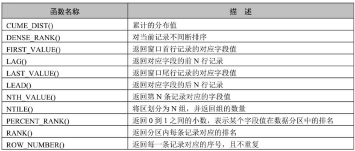
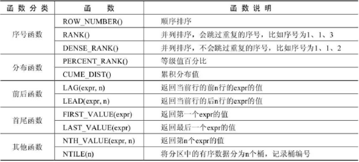

# MySQL8新特性概述

MySQL从5.7版本直接跳跃发布了8.0版本 ，可见这是一个令人兴奋的里程碑版本。MySQL 8版本在功能上做了显著的改进与增强，开发者对MySQL的源代码进行了重构，最突出的一点是多MySQL  Optimizer优化器进行了改进。不仅在速度上得到了改善，还为用户带来了更好的性能和更棒的体验。

## **1.1** MySQL8.0新增特性

**1.** **更简便的**NoSQL支持NoSQL泛指非关系型数据库和数据存储。随着互联网平台的规模飞速发展，传统的关系型数据库已经越来越不能满足需求。从5.6版本开始，MySQL就开始支持简单的NoSQL存储功能。MySQL 8对这一功能做了优化，以更灵活的方式实现NoSQL功能，不再依赖模式（schema）。

**2.** **更好的索引**  在查询中，正确地使用索引可以提高查询的效率。MySQL 8中新增了 **隐藏索引**和**降序索引** 。隐藏索引可以用来测试去掉索引对查询性能的影响。在查询中混合存在多列索引时，使用降序索引可以提高查询的性能。

**3.** **更完善的**JSON支持MySQL从5.7开始支持原生JSON数据的存储，MySQL 8对这一功能做了优化，增加了聚合函数`JSON_ARRAYAGG()`	和 `JSON_OBJECTAGG() `，将参数聚合为JSON数组或对象，新增了行内

操作符 `->>`，是列路径运算符 `->`的增强，对JSON排序做了提升，并优化了JSON的更新操作。

**4.** **安全和账户管理** MySQL 8中新增了 caching_sha2_password 授权插件、角色、密码历史记录和FIPS 模式支持，这些特性提高了数据库的安全性和性能，使数据库管理员能够更灵活地进行账户管理工作。

**5.** **InnoDB**的变化InnoDB是MySQL默认的存储引擎 ，是事务型数据库的首选引擎，支持事务安全表（ACID），支持行锁定和外键。在MySQL  8  版本中，InnoDB在自增、索引、加密、死锁、共享锁等方面做了大量的 改进和优化 ，并且支持原子数据定义语言（DDL），提高了数据安全性，对事务提供更好的支持。

**6.** **数据字典**  在之前的MySQL版本中，字典数据都存储在元数据文件和非事务表中。从MySQL 8开始新增了事务数据字典，在这个字典里存储着数据库对象信息，这些数据字典存储在内部事务表中。

**7.** **原子数据定义语句** MySQL 8开始支持原子数据定义语句（Automic DDL），即 原子DDL 。目前，只有InnoDB存储引擎支持原子DDL。原子数据定义语句（DDL）将与DDL操作相关的数据字典更新、存储引擎   操作、二进制日志写入结合到一个单独的原子事务中，这使得即使服务器崩溃，事务也会提交或回滚。  使用支持原子操作的存储引擎所创建的表，在执行DROP TABLE、CREATE TABLE、ALTER TABLE、RENAME TABLE、TRUNCATE TABLE、CREATE TABLESPACE、DROP TABLESPACE等操作时，都支持原子操作，即事务要么完全操作成功，要么失败后回滚，不再进行部分提交。 对于从MySQL 5.7复制到MySQL 8 版本中的语句，可以添加 IF EXISTS 或 IF NOT EXISTS 语句来避免发生错误。

**8.** **资源管理** MySQL 8开始支持创建和管理资源组，允许将服务器内运行的线程分配给特定的分组，以便线程根据组内可用资源执行。组属性能够控制组内资源，启用或限制组内资源消耗。数据库管理员能够  根据不同的工作负载适当地更改这些属性。 目前，CPU时间是可控资源，由“虚拟CPU”这个概念来表示，此术语包含CPU的核心数，超线程，硬件线程等等。服务器在启动时确定可用的虚拟CPU数量。拥有  对应权限的数据库管理员可以将这些CPU与资源组关联，并为资源组分配线程。 资源组组件为MySQL中的资源组管理提供了SQL接口。资源组的属性用于定义资源组。MySQL中存在两个默认组，系统组和用户  组，默认的组不能被删除，其属性也不能被更改。对于用户自定义的组，资源组创建时可初始化所有的  属性，除去名字和类型，其他属性都可在创建之后进行更改。  在一些平台下，或进行了某些MySQL的配置时，资源管理的功能将受到限制，甚至不可用。例如，如果安装了线程池插件，或者使用的是macOS   系统，资源管理将处于不可用状态。在FreeBSD和Solaris系统中，资源线程优先级将失效。在Linux系统中，只有配置了CAP_SYS_NICE属性，资源管理优先级才能发挥作用。

**9.** **字符集支持** MySQL 8中默认的字符集由 latin1 更改为 utf8mb4 ，并首次增加了日语所特定使用的集合，utf8mb4_ja_0900_as_cs。

**10.** **优化器增强**  MySQL优化器开始支持隐藏索引和降序索引。隐藏索引不会被优化器使用，验证索引的必要性时不需要删除索引，先将索引隐藏，如果优化器性能无影响就可以真正地删除索引。降序索引允许  优化器对多个列进行排序，并且允许排序顺序不一致。

**11.** **公用表表达式** 公用表表达式（Common Table Expressions）简称为CTE，MySQL现在支持递归和非递归两种形式的CTE。CTE通过在SELECT语句或其他特定语句前 使用WITH语句对临时结果集 进行命名。

基础语法如下：

```mysql
WITH cte_name (col_name1,col_name2 ...) AS (Subquery)
SELECT * FROM cte_name;
```

Subquery代表子查询，子查询前使用WITH语句将结果集命名为cte_name，在后续的查询中即可使用cte_name进行查询。

**12.** **窗口函数** MySQL 8开始支持窗口函数。在之前的版本中已存在的大部分 聚合函数 在MySQL 8中也可以作为窗口函数来使用。

 


**13.** **正则表达式支持**  MySQL在8.0.4以后的版本中采用支持Unicode的国际化组件库实现正则表达式操作， 这种方式不仅能提供完全的Unicode支持，而且是多字节安全编码。MySQL增加了REGEXP_LIKE()、EGEXP_INSTR()、REGEXP_REPLACE()和 REGEXP_SUBSTR()等函数来提升性能。另外，regexp_stack_limit和regexp_time_limit 系统变量能够通过匹配引擎来控制资源消耗。

**14.** **内部临时表** TempTable存储引擎取代MEMORY存储引擎成为内部临时表的默认存储引擎 。TempTable存储引擎为VARCHAR和VARBINARY列提供高效存储。internal_tmp_mem_storage_engine会话变量定义了内部   临时表的存储引擎，可选的值有两个，TempTable和MEMORY，其中TempTable为默认的存储引擎。temptable_max_ram系统配置项定义了TempTable存储引擎可使用的最大内存数量。

**15.** **日志记录** 在MySQL 8中错误日志子系统由一系列MySQL组件构成。这些组件的构成由系统变量log_error_services来配置，能够实现日志事件的过滤和写入。

**16.** **备份锁**   新的备份锁允许在线备份期间执行数据操作语句，同时阻止可能造成快照不一致的操作。新备份锁由 LOCK INSTANCE FOR BACKUP 和 UNLOCK INSTANCE 语法提供支持，执行这些操作需要备份管理员特权。

**17.** **增强的**MySQL复制 MySQL 8复制支持对 JSON文档 进行部分更新的 二进制日志记录 ，该记录 使用紧凑的二进制格式  ，从而节省记录完整JSON文档的空间。当使用基于语句的日志记录时，这种紧凑的日志记录会自动完成，并且可以通过将新的binlog_row_value_options系统变量值设置为PARTIAL_JSON来启用。

## **1.2** MySQL8.0移除的旧特性

在MySQL 5.7版本上开发的应用程序如果使用了MySQL8.0 移除的特性，语句可能会失败，或者产生不同的执行结果。为了避免这些问题，对于使用了移除特性的应用，应当尽力修正避免使用这些特性，并尽可能使用替代方法。

**1.** **查询缓存** 查询缓存已被移除 ，删除的项有： 

**（1）语句：**FLUSH QUERY CACHE和RESET QUERY CACHE。 

**（2）系统变量：**query_cache_limit、query_cache_min_res_unit、query_cache_size、query_cache_type、query_cache_wlock_invalidate。 

**（3）状态变量：**Qcache_free_blocks、Qcache_free_memory、Qcache_hits、Qcache_inserts、Qcache_lowmem_prunes、Qcache_not_cached、Qcache_queries_in_cache、Qcache_total_blocks。 

**（4）线程状态：**checking privileges on cached query、checking query cache for query、invalidating query cache entries、sending cached result to client、storing result in query cache、waiting for query cache lock。

**2.** **加密相关** 删除的加密相关的内容有：ENCODE()、DECODE()、ENCRYPT()、DES_ENCRYPT()和DES_DECRYPT()函数，配置项des-key-file，系统变量have_crypt，FLUSH语句的DES_KEY_FILE选项， HAVE_CRYPT CMake选项。  对于移除的ENCRYPT()函数，考虑使用SHA2()替代，对于其他移除的函数，使用AES_ENCRYPT()和AES_DECRYPT()替代。

**3.** **空间函数相关** 在MySQL 5.7版本中，多个空间函数已被标记为过时。这些过时函数在MySQL 8中都已被移除，只保留了对应的ST_和MBR函数。

**4.** **\N**和NULL   在SQL语句中，解析器不再将\N视为NULL，所以在SQL语句中应使用NULL代替\N。这项变化不会影响使用LOAD DATA INFILE或者SELECT...INTO OUTFILE操作文件的导入和导出。在这类操作中，NULL 仍等同于\N。

**5.** **mysql_install_db** 在MySQL分布中，已移除了mysql_install_db程序，数据字典初始化需要调用带着-- initialize或者--initialize-insecure选项的mysqld来代替实现。另外，--bootstrap和INSTALL_SCRIPTDIR CMake也已被删除。

**6.** **通用分区处理程序**  通用分区处理程序已从MySQL服务中被移除。为了实现给定表分区，表所使用的存储引擎需要自有的分区处理程序。 提供本地分区支持的MySQL存储引擎有两个，即InnoDB和NDB，而在MySQL 8中只支持InnoDB。

**7.** **系统和状态变量信息** 在INFORMATION_SCHEMA数据库中，对系统和状态变量信息不再进行维护。

GLOBAL_VARIABLES、SESSION_VARIABLES、GLOBAL_STATUS、SESSION_STATUS表都已被删除。另外，系

统变量show_compatibility_56也已被删除。被删除的状态变量有Slave_heartbeat_period、Slave_last_heartbeat,Slave_received_heartbeats、Slave_retried_transactions、Slave_running。以上被删除的内容都可使用性能模式中对应的内容进行替代。

**8.** **mysql_plugin**工具 mysql_plugin工具用来配置MySQL服务器插件，现已被删除，可使用--plugin-load或-

-plugin-load-add选项在服务器启动时加载插件或者在运行时使用INSTALL   PLUGIN语句加载插件来替代该工具。 

 

# **2.** 新特性1：窗口函数

## **2.1** 使用窗口函数前后对比

假设我现在有这样一个数据表，它显示了某购物网站在每个城市每个区的销售额：

```mysql
CREATE TABLE sales(
	id INT PRIMARY KEY AUTO_INCREMENT, 
    city VARCHAR(15),
	county VARCHAR(15), 
    sales_value DECIMAL
);

INSERT INTO sales(city,county,sales_value) VALUES
('北京','海淀',10.00),
('北京','朝阳',20.00),
('上海','黄埔',30.00),
('上海','长宁',10.00);
```

**需求：**现在计算这个网站在每个城市的销售总额、在全国的销售总额、每个区的销售额占所在城市销售  额中的比率，以及占总销售额中的比率。

如果用分组和聚合函数，就需要分好几步来计算。

**第一步**，计算总销售金额，并存入临时表 a：

```mysql
CREATE TEMPORARY TABLE a	-- 创建临时表
SELECT SUM(sales_value) AS sales_value -- 计算总计金额
FROM sales;
```

查看一下临时表 a ：

```mysql
mysql> SELECT * FROM a;
+-------------+
| sales_value |
+-------------+
|	       70 |
+-------------+
1 row in set (0.00 sec)
```

**第二步**，计算每个城市的销售总额并存入临时表 b：

```mysql
CREATE TEMPORARY TABLE b	-- 创建临时表
SELECT city,SUM(sales_value) AS sales_value -- 计算城市销售合计
FROM sales GROUP BY city;
```

查看临时表 b ：

```mysql
mysql> SELECT * FROM b;
+------+-------------+
| city | sales_value |
+------+-------------+
| 北京 |	         30 |
| 上海 |	         40 |
+------+-------------+
2 rows in set (0.00 sec)
```

**第三步**，计算各区的销售占所在城市的总计金额的比例，和占全部销售总计金额的比例。我们可以通过下面的连接查询获得需要的结果：

```mysql
SELECT s.city AS 城市,s.county AS 区,s.sales_value AS 区销售额,
b.sales_value AS 市销售额,s.sales_value/b.sales_value AS 市比率,
a.sales_value AS 总销售额,s.sales_value/a.sales_value AS 总比率
FROM sales s
JOIN b ON (s.city=b.city) -- 连接市统计结果临时表
JOIN a	-- 连接总计金额临时表
ORDER BY s.city,s.county;
```

结果：

```mysql
+------+------+----------+----------+--------+----------+--------+
| 城 市 | 区	| 区销售额  | 市销售额	| 市比率  | 总销售额  | 总比率  |
+------+------+----------+----------+--------+----------+--------+
| 上海  | 长宁 |	   10 |	40      | 0.2500 |	     70 | 0.1429 |
| 上海  | 黄埔 |	   30 |	40      | 0.7500 |	     70 | 0.4286 |
| 北京  | 朝阳 |	   20 |	30      | 0.6667 |	     70 | 0.2857 |
| 北京  | 海淀 |	   10 |	30      | 0.3333 |	     70 | 0.1429 |
+------+------+----------+----------+--------+----------+--------+
4 rows in set (0.00 sec)
```

结果显示：市销售金额、市销售占比、总销售金额、总销售占比都计算出来了。 同样的查询，如果用窗口函数，就简单多了。我们可以用下面的代码来实现： 

```mysql
SELECT city AS 城市,county AS 区,sales_value AS 区销售额,
SUM(sales_value) OVER(PARTITION BY city) AS 市销售额, -- 计算市销售额
sales_value/SUM(sales_value) OVER(PARTITION BY city) AS 市比率,
SUM(sales_value) OVER() AS 总销售额,	-- 计算总销售额
sales_value/SUM(sales_value) OVER() AS 总比率
FROM sales
ORDER BY city,county;
```

结果显示，我们得到了与上面那种查询同样的结果。

使用窗口函数，只用了一步就完成了查询。而且，由于没有用到临时表，执行的效率也更高了。很显  然，**在这种需要用到分组统计的结果对每一条记录进行计算的场景下，使用窗口函数更好**。


## **2.2** 窗口函数分类

MySQL从8.0版本开始支持窗口函数。窗口函数的作用类似于在查询中对数据进行分组，不同的是，分组  操作会把分组的结果聚合成一条记录，而窗口函数是将结果置于每一条数据记录中。

窗口函数可以分为 静态窗口函数 和 动态窗口函数 。

静态窗口函数的窗口大小是固定的，不会因为记录的不同而不同； 动态窗口函数的窗口大小会随着记录的不同而变化。

[MySQL官方网站窗口函数的网址](https://dev.mysql.com/doc/refman/8.0/en/window-function-descriptions.html#function_row-number)

窗口函数总体上可以分为序号函数、分布函数、前后函数、首尾函数和其他函数，如下表：

 


## 2.3 语法结构

窗口函数的语法结构是：

```mysql
函数 OVER([PARTITION BY 字段名 ORDER BY 字段名 ASC|DESC])
```

或者是：

```mysql
函数 OVER 窗口名 … WINDOW 窗口名 AS ([PARTITION BY 字段名 ORDER BY 字段名 ASC|DESC])
```

OVER 关键字指定函数窗口的范围。

+ 如果省略后面括号中的内容，则窗口会包含满足WHERE条件的所有记录，窗口函数会基于所 有满足WHERE条件的记录进行计算。

+ 如果OVER关键字后面的括号不为空，则可以使用如下语法设置窗口。窗口名：为窗口设置一个别名，用来标识窗口。

+ PARTITION  BY子句：指定窗口函数按照哪些字段进行分组。分组后，窗口函数可以在每个分组中分别执行。

+ ORDER  BY子句：指定窗口函数按照哪些字段进行排序。执行排序操作使窗口函数按照排序后的数据记录的顺序进行编号。

+ FRAME子句：为分区中的某个子集定义规则，可以用来作为滑动窗口使用。


## 2.4 分类讲解

创建表：

```mysql
CREATE TABLE goods(
	id INT PRIMARY KEY AUTO_INCREMENT,
	category_id INT, 
    category VARCHAR(15), 
    NAME VARCHAR(30), 
    price DECIMAL(10,2),
	stock INT, 
    upper_time DATETIME
);
```

添加数据：

```mysql
INSERT INTO goods(category_id,category,NAME,price,stock,upper_time) VALUES
(1, '女装/女士精品', 'T恤', 39.90, 1000, NOW()),
(1, '女装/女士精品', '连衣裙', 79.90, 2500, NOW()),
(1, '女装/女士精品', '卫衣', 89.90, 1500, NOW()),
(1, '女装/女士精品', '牛仔裤', 89.90, 3500, NOW()),
(1, '女装/女士精品', '百褶裙', 29.90, 500, NOW()),
(1, '女装/女士精品', '呢绒外套', 399.90, 1200, NOW()),
(2, '户外运动', '自行车', 399.90, 1000, NOW()),
(2, '户外运动', '山地自行车', 1399.90, 2500, NOW()),
(2, '户外运动', '登山杖', 59.90, 1500, NOW()),
(2, '户外运动', '骑行装备', 399.90, 3500, NOW()),
(2, '户外运动', '运动外套', 799.90, 500, NOW()),
(2, '户外运动', '滑板', 499.90, 1200, NOW());
```

下面针对goods表中的数据来验证每个窗口函数的功能。

### 1. 序号函数

#### **1.** ROW_NUMBER()函数

ROW_NUMBER()函数能够对数据中的序号进行顺序显示。

举例：查询 goods 数据表中每个商品分类下价格降序排列的各个商品信息。

```mysql
mysql> SELECT ROW_NUMBER() OVER(PARTITION BY category_id ORDER BY price DESC) AS row_num,
-> id, category_id, category, NAME, price, stock
-> FROM goods;
+---------+----+-------------+---------------+------------+---------+-------+
| row_num | id | category_id | category	| NAME	| price	| stock |
+---------+----+-------------+---------------+------------+---------+-------+
|	1	|	6	|	1	|	女装/女士精品	| 呢绒外套	|	399.90 |	1200 |
|	2	|	3	|	1	|	女装/女士精品	| 卫衣	|	89.90 |	1500 |
|	3	|	4	|	1	|	女装/女士精品	| 牛仔裤	|	89.90 |	3500 |
|	4	|	2	|	1	|	女装/女士精品	| 连衣裙	|	79.90 |	2500 |
|	5	|	1	|	1	|	女装/女士精品	| T恤	|	39.90 |	1000 |
|	6	|	5	|	1	|	女装/女士精品	| 百褶裙	|	29.90 |	500 |
|	1	|	8	|	2	|	户外运动	| 山地自行车	|	1399.90 |	2500 |
|	2	|	11	|	2	|	户外运动	| 运动外套	|	799.90 |	500 |
|	3	|	12	|	2	|	户外运动	| 滑板	|	499.90 |	1200 |
|	4	|	7	|	2	|	户外运动	| 自行车	|	399.90 |	1000 |
|	5   |   10  |	2   |   户外运动	| 骑行装备	| 399.90 | 3500 |
|	6   |    9  |	2   |   户外运动	| 登山杖	|	59.90 | 1500 |
+---------+----+-------------+---------------+------------+---------+-------+
12 rows in set (0.00 sec)
```

举例：查询 goods 数据表中每个商品分类下价格最高的3种商品信息。 

```mysql
mysql> SELECT *
FROM (
SELECT ROW_NUMBER() OVER(PARTITION BY category_id ORDER BY price DESC) AS
row_num,
id, category_id, category, NAME, price, stock
FROM goods) t
WHERE row_num <= 3;
+---------+----+-------------+---------------+------------+---------+-------+
| row_num | id | category_id | category	| NAME	| price	| stock |
+---------+----+-------------+---------------+------------+---------+-------+
|	1 |	6 |	1 | 女装/女士精品	| 呢绒外套	| 399.90 | 1200 |
|	2 |	3 |	1 | 女装/女士精品	| 卫衣	|	89.90 | 1500 |
|	3 |	4 |	1 | 女装/女士精品	| 牛仔裤	|	89.90 | 3500 |
|	1 |	8 |	2 | 户外运动	| 山地自行车	| 1399.90 | 2500 |
|	2 |	11 |	2 | 户外运动	| 运动外套	| 799.90 |	500 |
|	3 |	12 |	2 | 户外运动	| 滑板	| 499.90 | 1200 |
+---------+----+-------------+---------------+------------+----------+-------+
6 rows in set (0.00 sec)
```

在名称为“女装/女士精品”的商品类别中，有两款商品的价格为89.90元，分别是卫衣和牛仔裤。两款商品  的序号都应该为2，而不是一个为2，另一个为3。此时，可以使用RANK()函数和DENSE_RANK()函数解决。

#### **2.** RANK()函数

使用RANK()函数能够对序号进行并列排序，并且会跳过重复的序号，比如序号为1、1、3。 

举例：使用RANK()函数获取 goods 数据表中各类别的价格从高到低排序的各商品信息。

```mysql
mysql> SELECT RANK() OVER(PARTITION BY category_id ORDER BY price DESC) AS row_num,
-> id, category_id, category, NAME, price, stock
-> FROM goods;
+---------+----+-------------+---------------+------------+---------+-------+
| row_num | id | category_id | category	| NAME	| price	| stock |
+---------+----+-------------+---------------+------------+---------+-------+
|	1	|	6	|	1	|	女装/女士精品	| 呢绒外套	|	399.90 |	1200 |
|	2	|	3	|	1	|	女装/女士精品	| 卫衣	|	89.90 |	1500 |
|	2	|	4	|	1	|	女装/女士精品	| 牛仔裤	|	89.90 |	3500 |
|	4	|	2	|	1	|	女装/女士精品	| 连衣裙	|	79.90 |	2500 |
|	5	|	1	|	1	|	女装/女士精品	| T恤	|	39.90 |	1000 |
|	6	|	5	|	1	|	女装/女士精品	| 百褶裙	|	29.90 |	500 |
|	1	|	8	|	2	|	户外运动	| 山地自行车	|	1399.90 |	2500 |
|	2	|	11	|	2	|	户外运动	| 运动外套	|	799.90 |	500 |
|	3	|	12	|	2	|	户外运动	| 滑板	|	499.90 | 1200 |
|	4	|	7	|	2	|	户外运动	| 自行车	|	399.90 | 1000 |
|	4	|	10	|	2	|	户外运动	| 骑行装备	|	399.90 | 3500 |
```

举例：使用RANK()函数获取 goods 数据表中类别为“女装/女士精品”的价格最高的4款商品信息。

```mysql
mysql> SELECT * FROM
    ->  (
    ->      SELECT RANK() OVER(PARTITION BY category_id ORDER BY price DESC) row_num
    ->      ,id,category_id,category,NAME,price,stock FROM goods
    ->  ) t
    -> WHERE category_id = 1 AND row_num<=4;
+---------+----+-------------+---------------+----------+--------+-------+
| row_num | id | category_id | category      | NAME     | price  | stock |
+---------+----+-------------+---------------+----------+--------+-------+
|       1 |  6 |           1 | 女装/女士精品 | 呢绒外套 | 399.90 |  1200 |
|       2 |  3 |           1 | 女装/女士精品 | 卫衣     |  89.90 |  1500 |
|       2 |  4 |           1 | 女装/女士精品 | 牛仔裤   |  89.90 |  3500 |
|       4 |  2 |           1 | 女装/女士精品 | 连衣裙   |  79.90 |  2500 |
+---------+----+-------------+---------------+----------+--------+-------+
```

可以看到，使用RANK()函数得出的序号为1、2、2、4，相同价格的商品序号相同，后面的商品序号是不连续的，跳过了重复的序号。

#### **3.** DENSE_RANK()函数

DENSE_RANK()函数对序号进行并列排序，并且不会跳过重复的序号，比如序号为1、1、2。

举例：使用DENSE_RANK()函数获取 goods 数据表中各类别的价格从高到低排序的各商品信息。

```mysql
mysql> SELECT DENSE_RANK() OVER(PARTITION BY category_id ORDER BY price DESC) row_num
    -> ,id,category_id,category,NAME,price,stock
    -> FROM goods;
+---------+----+-------------+---------------+------------+---------+-------+
| row_num | id | category_id | category      | NAME       | price   | stock |
+---------+----+-------------+---------------+------------+---------+-------+
|       1 |  6 |           1 | 女装/女士精品 | 呢绒外套   |  399.90 |  1200 |
|       2 |  3 |           1 | 女装/女士精品 | 卫衣       |   89.90 |  1500 |
|       2 |  4 |           1 | 女装/女士精品 | 牛仔裤     |   89.90 |  3500 |
|       3 |  2 |           1 | 女装/女士精品 | 连衣裙     |   79.90 |  2500 |
|       4 |  1 |           1 | 女装/女士精品 | T恤        |   39.90 |  1000 |
|       5 |  5 |           1 | 女装/女士精品 | 百褶裙     |   29.90 |   500 |
|       1 |  8 |           2 | 户外运动      | 山地自行车 | 1399.90 |  2500 |
|       2 | 11 |           2 | 户外运动      | 运动外套   |  799.90 |   500 |
|       3 | 12 |           2 | 户外运动      | 滑板       |  499.90 |  1200 |
|       4 |  7 |           2 | 户外运动      | 自行车     |  399.90 |  1000 |
|       4 | 10 |           2 | 户外运动      | 骑行装备   |  399.90 |  3500 |
|       5 |  9 |           2 | 户外运动      | 登山杖     |   59.90 |  1500 |
+---------+----+-------------+---------------+------------+---------+-------+
```

举例：使用DENSE_RANK()函数获取 goods 数据表中类别为“女装/女士精品”的价格最高的4款商品信息。

```mysql
mysql> SELECT *
    -> FROM(
    ->          SELECT DENSE_RANK() OVER(PARTITION BY category_id ORDER BY price DESC) row_num
    ->          ,id,category_id,category,NAME,price,stock
    ->          FROM goods
    ->          ) t
    -> WHERE category_id = 1 AND row_num<=4;
+---------+----+-------------+---------------+----------+--------+-------+
| row_num | id | category_id | category      | NAME     | price  | stock |
+---------+----+-------------+---------------+----------+--------+-------+
|       1 |  6 |           1 | 女装/女士精品 | 呢绒外套 | 399.90 |  1200 |
|       2 |  3 |           1 | 女装/女士精品 | 卫衣     |  89.90 |  1500 |
|       2 |  4 |           1 | 女装/女士精品 | 牛仔裤   |  89.90 |  3500 |
|       3 |  2 |           1 | 女装/女士精品 | 连衣裙   |  79.90 |  2500 |
|       4 |  1 |           1 | 女装/女士精品 | T恤      |  39.90 |  1000 |
+---------+----+-------------+---------------+----------+--------+-------+
```

可以看到，使用DENSE_RANK()函数得出的行号为1、2、2、3，相同价格的商品序号相同，后面的商品序  号是连续的，并且没有跳过重复的序号。

### 2. 分布函数

#### **1.** PERCENT_RANK()函数

PERCENT_RANK()函数是等级值百分比函数。按照如下方式进行计算。

```mysql
(rank - 1) / (rows - 1)
```

其中，rank的值为使用RANK()函数产生的序号，rows的值为当前窗口的总记录数。

举例：计算 goods 数据表中名称为“女装/女士精品”的类别下的商品的PERCENT_RANK值。

```mysql
#写法一：
SELECT RANK() OVER (PARTITION BY category_id ORDER BY price DESC) AS r,
PERCENT_RANK() OVER (PARTITION BY category_id ORDER BY price DESC) AS pr, id, category_id, category, NAME, price, stock
FROM goods
WHERE category_id = 1;

#写法二：
mysql> SELECT RANK() OVER w AS r,
-> PERCENT_RANK() OVER w AS pr,
-> id, category_id, category, NAME, price, stock
-> FROM goods
-> WHERE category_id = 1 WINDOW w AS (PARTITION BY category_id ORDER BY price DESC);
+---+-----+----+-------------+---------------+----------+--------+-------+
| r | pr  | id | category_id | category	| NAME	| price  | stock |
+---+-----+----+-------------+---------------+----------+--------+-------+
| 1 |	0 |	6 |	1 | 女装/女士精品	| 呢绒外套	|	399.90 |	1200 |
| 2 | 0.2 |	3 |	1 | 女装/女士精品	| 卫衣	|	89.90 |	1500 |
| 2 | 0.2 |	4 |	1 | 女装/女士精品	| 牛仔裤	|	89.90 |	3500 |
| 4 | 0.6 |	2 |	1 | 女装/女士精品	| 连衣裙	|	79.90 |	2500 |
| 5 | 0.8 |	1 |	1 | 女装/女士精品	| T恤	|	39.90 |	1000 |
| 6 |	1 |	5 |	1 | 女装/女士精品	| 百褶裙	|	29.90 |	500 |
+---+-----+----+-------------+---------------+----------+--------+-------+
6 rows in set (0.00 sec) 
```

#### **2.** CUME_DIST()函数

CUME_DIST()函数主要用于查询小于或等于某个值的比例。

举例：查询goods数据表中小于或等于当前价格的比例。

 ```mysql
mysql> SELECT CUME_DIST() OVER(PARTITION BY category_id ORDER BY price ASC) AS cd,
    -> id, category, NAME, price
    -> FROM goods;
+---------------------+----+---------------+------------+---------+
| cd                  | id | category      | NAME       | price   |
+---------------------+----+---------------+------------+---------+
| 0.16666666666666666 |  5 | 女装/女士精品 | 百褶裙     |   29.90 |
|  0.3333333333333333 |  1 | 女装/女士精品 | T恤        |   39.90 |
|                 0.5 |  2 | 女装/女士精品 | 连衣裙     |   79.90 |
|  0.8333333333333334 |  3 | 女装/女士精品 | 卫衣       |   89.90 |
|  0.8333333333333334 |  4 | 女装/女士精品 | 牛仔裤     |   89.90 |
|                   1 |  6 | 女装/女士精品 | 呢绒外套   |  399.90 |
| 0.16666666666666666 |  9 | 户外运动      | 登山杖     |   59.90 |
|                 0.5 |  7 | 户外运动      | 自行车     |  399.90 |
|                 0.5 | 10 | 户外运动      | 骑行装备   |  399.90 |
|  0.6666666666666666 | 12 | 户外运动      | 滑板       |  499.90 |
|  0.8333333333333334 | 11 | 户外运动      | 运动外套   |  799.90 |
|                   1 |  8 | 户外运动      | 山地自行车 | 1399.90 |
+---------------------+----+---------------+------------+---------+
12 rows in set (0.00 sec)
 ```


### **3.** 前后函数

#### **1.** LAG(expr,n)函数

LAG(expr,n)函数返回当前行的前n行的expr的值。

举例：查询goods数据表中前一个商品价格与当前商品价格的差值。

 ```mysql
mysql> SELECT id, category, NAME, price, pre_price, price - pre_price AS diff_price
    -> FROM (
    -> SELECT id, category, NAME, price,LAG(price,1) OVER w AS pre_price
    -> FROM goods
    -> WINDOW w AS (PARTITION BY category_id ORDER BY price)) t;
+----+---------------+------------+---------+-----------+------------+
| id | category      | NAME       | price   | pre_price | diff_price |
+----+---------------+------------+---------+-----------+------------+
|  5 | 女装/女士精品 | 百褶裙     |   29.90 |      NULL |       NULL |
|  1 | 女装/女士精品 | T恤        |   39.90 |     29.90 |      10.00 |
|  2 | 女装/女士精品 | 连衣裙     |   79.90 |     39.90 |      40.00 |
|  3 | 女装/女士精品 | 卫衣       |   89.90 |     79.90 |      10.00 |
|  4 | 女装/女士精品 | 牛仔裤     |   89.90 |     89.90 |       0.00 |
|  6 | 女装/女士精品 | 呢绒外套   |  399.90 |     89.90 |     310.00 |
|  9 | 户外运动      | 登山杖     |   59.90 |      NULL |       NULL |
|  7 | 户外运动      | 自行车     |  399.90 |     59.90 |     340.00 |
| 10 | 户外运动      | 骑行装备   |  399.90 |    399.90 |       0.00 |
| 12 | 户外运动      | 滑板       |  499.90 |    399.90 |     100.00 |
| 11 | 户外运动      | 运动外套   |  799.90 |    499.90 |     300.00 |
|  8 | 户外运动      | 山地自行车 | 1399.90 |    799.90 |     600.00 |
+----+---------------+------------+---------+-----------+------------+
12 rows in set (0.00 sec)
 ```

#### **2.** LEAD(expr,n)函数

LEAD(expr,n)函数返回当前行的后n行的expr的值。

举例：查询goods数据表中后一个商品价格与当前商品价格的差值。

 ```mysql
mysql> SELECT id, category, NAME, price, pre_price, price - pre_price AS diff_price
    -> FROM (
    -> SELECT id, category, NAME, price,LEAD(price,1) OVER w AS pre_price
    -> FROM goods
    -> WINDOW w AS (PARTITION BY category_id ORDER BY price)) t;
+----+---------------+------------+---------+-----------+------------+
| id | category      | NAME       | price   | pre_price | diff_price |
+----+---------------+------------+---------+-----------+------------+
|  5 | 女装/女士精品 | 百褶裙     |   29.90 |     39.90 |     -10.00 |
|  1 | 女装/女士精品 | T恤        |   39.90 |     79.90 |     -40.00 |
|  2 | 女装/女士精品 | 连衣裙     |   79.90 |     89.90 |     -10.00 |
|  3 | 女装/女士精品 | 卫衣       |   89.90 |     89.90 |       0.00 |
|  4 | 女装/女士精品 | 牛仔裤     |   89.90 |    399.90 |    -310.00 |
|  6 | 女装/女士精品 | 呢绒外套   |  399.90 |      NULL |       NULL |
|  9 | 户外运动      | 登山杖     |   59.90 |    399.90 |    -340.00 |
|  7 | 户外运动      | 自行车     |  399.90 |    399.90 |       0.00 |
| 10 | 户外运动      | 骑行装备   |  399.90 |    499.90 |    -100.00 |
| 12 | 户外运动      | 滑板       |  499.90 |    799.90 |    -300.00 |
| 11 | 户外运动      | 运动外套   |  799.90 |   1399.90 |    -600.00 |
|  8 | 户外运动      | 山地自行车 | 1399.90 |      NULL |       NULL |
+----+---------------+------------+---------+-----------+------------+
12 rows in set (0.00 sec)
 ```

### 4. 首尾函数

#### **1.** FIRST_VALUE(expr)函数

FIRST_VALUE(expr)函数返回第一个expr的值。

举例：按照价格排序，查询第1个商品的价格信息。

 ```mysql
mysql> SELECT id, category, NAME, price, stock,FIRST_VALUE(price) OVER w AS first_price
    -> FROM goods WINDOW w AS (PARTITION BY category_id ORDER BY price);
+----+---------------+------------+---------+-------+-------------+
| id | category      | NAME       | price   | stock | first_price |
+----+---------------+------------+---------+-------+-------------+
|  5 | 女装/女士精品 | 百褶裙     |   29.90 |   500 |       29.90 |
|  1 | 女装/女士精品 | T恤        |   39.90 |  1000 |       29.90 |
|  2 | 女装/女士精品 | 连衣裙     |   79.90 |  2500 |       29.90 |
|  3 | 女装/女士精品 | 卫衣       |   89.90 |  1500 |       29.90 |
|  4 | 女装/女士精品 | 牛仔裤     |   89.90 |  3500 |       29.90 |
|  6 | 女装/女士精品 | 呢绒外套   |  399.90 |  1200 |       29.90 |
|  9 | 户外运动      | 登山杖     |   59.90 |  1500 |       59.90 |
|  7 | 户外运动      | 自行车     |  399.90 |  1000 |       59.90 |
| 10 | 户外运动      | 骑行装备   |  399.90 |  3500 |       59.90 |
| 12 | 户外运动      | 滑板       |  499.90 |  1200 |       59.90 |
| 11 | 户外运动      | 运动外套   |  799.90 |   500 |       59.90 |
|  8 | 户外运动      | 山地自行车 | 1399.90 |  2500 |       59.90 |
+----+---------------+------------+---------+-------+-------------+
12 rows in set (0.00 sec)
 ```

 

#### **2.** LAST_VALUE(expr)函数

LAST_VALUE(expr)函数返回最后一个expr的值。

举例：按照价格排序，查询最后一个商品的价格信息。

 ```mysql
mysql> SELECT id, category, NAME, price, stock,LAST_VALUE(price) OVER w AS last_price
    -> FROM goods WINDOW w AS (PARTITION BY category_id ORDER BY price);
+----+---------------+------------+---------+-------+------------+
| id | category      | NAME       | price   | stock | last_price |
+----+---------------+------------+---------+-------+------------+
|  5 | 女装/女士精品 | 百褶裙     |   29.90 |   500 |      29.90 |
|  1 | 女装/女士精品 | T恤        |   39.90 |  1000 |      39.90 |
|  2 | 女装/女士精品 | 连衣裙     |   79.90 |  2500 |      79.90 |
|  3 | 女装/女士精品 | 卫衣       |   89.90 |  1500 |      89.90 |
|  4 | 女装/女士精品 | 牛仔裤     |   89.90 |  3500 |      89.90 |
|  6 | 女装/女士精品 | 呢绒外套   |  399.90 |  1200 |     399.90 |
|  9 | 户外运动      | 登山杖     |   59.90 |  1500 |      59.90 |
|  7 | 户外运动      | 自行车     |  399.90 |  1000 |     399.90 |
| 10 | 户外运动      | 骑行装备   |  399.90 |  3500 |     399.90 |
| 12 | 户外运动      | 滑板       |  499.90 |  1200 |     499.90 |
| 11 | 户外运动      | 运动外套   |  799.90 |   500 |     799.90 |
|  8 | 户外运动      | 山地自行车 | 1399.90 |  2500 |    1399.90 |
+----+---------------+------------+---------+-------+------------+
12 rows in set (0.00 sec)
 ```

> 当前最后一个值即当前值(查询到当前记录时，后面的记录还没有出来，所以当前值即最后值)，所以price和last_value字段的值相同.

### 5. 其他函数

#### **1.** NTH_VALUE(expr,n)函数

NTH_VALUE(expr,n)函数返回第n个expr的值。

举例：查询goods数据表中排名第2和第3的价格信息。

```mysql
mysql> SELECT
    -> RANK() OVER (PARTITION BY category_id ORDER BY price) AS row_num,
    -> id, category, NAME, price,
    -> NTH_VALUE(price,2) OVER w AS second_price,
    -> NTH_VALUE(price,3) OVER w AS third_price
    -> FROM goods WINDOW w AS (PARTITION BY category_id ORDER BY price);
+---------+----+---------------+------------+---------+--------------+-------------+
| row_num | id | category      | NAME       | price   | second_price | third_price |
+---------+----+---------------+------------+---------+--------------+-------------+
|       1 |  5 | 女装/女士精品 | 百褶裙     |   29.90 |         NULL |        NULL |
|       2 |  1 | 女装/女士精品 | T恤        |   39.90 |        39.90 |        NULL |
|       3 |  2 | 女装/女士精品 | 连衣裙     |   79.90 |        39.90 |       79.90 |
|       4 |  3 | 女装/女士精品 | 卫衣       |   89.90 |        39.90 |       79.90 |
|       4 |  4 | 女装/女士精品 | 牛仔裤     |   89.90 |        39.90 |       79.90 |
|       6 |  6 | 女装/女士精品 | 呢绒外套   |  399.90 |        39.90 |       79.90 |
|       1 |  9 | 户外运动      | 登山杖     |   59.90 |         NULL |        NULL |
|       2 |  7 | 户外运动      | 自行车     |  399.90 |       399.90 |      399.90 |
|       2 | 10 | 户外运动      | 骑行装备   |  399.90 |       399.90 |      399.90 |
|       4 | 12 | 户外运动      | 滑板       |  499.90 |       399.90 |      399.90 |
|       5 | 11 | 户外运动      | 运动外套   |  799.90 |       399.90 |      399.90 |
|       6 |  8 | 户外运动      | 山地自行车 | 1399.90 |       399.90 |      399.90 |
+---------+----+---------------+------------+---------+--------------+-------------+
12 rows in set (0.00 sec)
```

#### **2.** NTILE(n)函数

NTILE(n)函数将分区中的有序数据分为n个桶，记录桶编号。

举例：将goods表中的商品按照价格分为3组。

```mysql
mysql> SELECT NTILE(3) OVER w AS nt,id, category, NAME, price
    -> FROM goods WINDOW w AS (PARTITION BY category_id ORDER BY price);
+----+----+---------------+------------+---------+
| nt | id | category      | NAME       | price   |
+----+----+---------------+------------+---------+
|  1 |  5 | 女装/女士精品 | 百褶裙     |   29.90 |
|  1 |  1 | 女装/女士精品 | T恤        |   39.90 |
|  2 |  2 | 女装/女士精品 | 连衣裙     |   79.90 |
|  2 |  3 | 女装/女士精品 | 卫衣       |   89.90 |
|  3 |  4 | 女装/女士精品 | 牛仔裤     |   89.90 |
|  3 |  6 | 女装/女士精品 | 呢绒外套   |  399.90 |
|  1 |  9 | 户外运动      | 登山杖     |   59.90 |
|  1 |  7 | 户外运动      | 自行车     |  399.90 |
|  2 | 10 | 户外运动      | 骑行装备   |  399.90 |
|  2 | 12 | 户外运动      | 滑板       |  499.90 |
|  3 | 11 | 户外运动      | 运动外套   |  799.90 |
|  3 |  8 | 户外运动      | 山地自行车 | 1399.90 |
+----+----+---------------+------------+---------+
12 rows in set (0.00 sec)
```

 

## **2.5** 小 结

窗口函数的特点是可以分组，而且可以在分组内排序。另外，窗口函数不会因为分组而减少原表中的行  数，这对我们在原表数据的基础上进行统计和排序非常有用。

 

# 3.2：公用表表达式

公用表表达式（或通用表表达式）简称为CTE（Common Table Expressions）。CTE是一个命名的临时结果集，作用范围是当前语句。CTE可以理解成一个可以复用的子查询，当然跟子查询还是有点区别的， CTE可以引用其他CTE，但子查询不能引用其他子查询。所以，可以考虑代替子查询。

依据语法结构和执行方式的不同，公用表表达式分为 `普通公用表表达式` 和`递归公用表达式`2 种。

## **3.1** 普通公用表表达式

普通公用表表达式的语法结构是：

```mysql
WITH CTE名称
AS （子查询）
SELECT|DELETE|UPDATE 语句;
```

普通公用表表达式类似于子查询，不过，跟子查询不同的是，它可以被多次引用，而且可以被其他的普通公用表达式所引用。

举例：查询员工所在的部门的详细信息。

 ```mysql
mysql> SELECT * FROM departments
-> WHERE department_id IN (
->	SELECT DISTINCT department_id
->	FROM employees
->	);
+---------------+------------------+------------+-------------+
| department_id | department_name | manager_id | location_id |
+---------------+------------------+------------+-------------+
 ```

这个查询也可以用普通公用表表达式的方式完成：

```mysql
mysql> WITH emp_dept_id
-> AS (SELECT DISTINCT department_id FROM employees)
-> SELECT *
-> FROM departments d JOIN emp_dept_id e
-> ON d.department_id = e.department_id;
+---------------+------------------+------------+-------------+---------------+
| department_id | department_name | manager_id | location_id | department_id |
+---------------+------------------+------------+-------------+---------------+
```

例子说明，公用表表达式可以起到子查询的作用。以后如果遇到需要使用子查询的场景，你可以在查询  之前，先定义公用表表达式，然后在查询中用它来代替子查询。而且，跟子查询相比，公用表表达式有  一个优点，就是定义过公用表表达式之后的查询，可以像一个表一样多次引用公用表表达式，而子查询则不能。

## **3.2** 递归公用表表达式

递归公用表表达式也是一种公用表表达式，只不过，除了普通公用表表达式的特点以外，它还有自己的特点，就是**可以调用自己**。它的语法结构是：

```mysql
WITH RECURSIVE cte_name[(alias,...)] AS 
(
	initial_query  -- anchor member
    UNION ALL
    recursive_query -- recursive member that references to the CTE name
)
SELECT|DELETE|UPDATE 语句;
```

递归公用表表达式的结构如下:

+ 如果你在cte中使用了自己，即使用了递归公用表表达式，则必须添加RECURSIVE关键字，否则会报错

  ```mysql
  ERROR 1146 (42S02): Table 'cte_name' doesn't exist
  ```

+ 递归CTE子查询有两部分，由UNION ALL或UNION [DISTINCT]分隔:

  ```mysql
  initial_query  -- anchor member
  UNION ALL
  recursive_query -- recursive member that references to the CTE name
  ```

递归公用表表达式由 2 部分组成，分别是初始查询和递归查询，中间通过关键字 UNION [ALL]进行连接。

initial_query生成cte初始行，不引用cte名称。用来初始化cte，可在recursive_query中通过cte_name.字段来访问初始值。这个查询只会运行一次。

recursive_query通过引用cte_name进行递归，直到返回一个空结果集为止。

**例如：**

```mysql
WITH RECURSIVE cte_count (n) 
AS (
      SELECT 1
      UNION ALL
      SELECT n + 1 
      FROM cte_count 
      WHERE n < 3
    )
SELECT n 
FROM cte_count;

```

执行时，该语句将生成此结果，即单个包含简单线性序列的列：

```mysql
+------+
| n    |
+------+
|    1 |
|    2 |
|    3 |
+------+
3 rows in set (0.00 sec)
```

**执行过程分析：**

1. 首先，执行初始查询` SELECT 1`，注意：在声明公用表表达式`WITH RECURSIVE cte_count (n) `时，指定了1的别名为n。

2. 然后，执行递归查询`  SELECT n + 1 FROM cte_count WHERE n < 3`，这里的n已经在初始化中进行了初始化。每次让n+1 直到最终的结果等于3。

   

### 案例

#### 案例一：

针对于我们常用的emp表，包含empno，ename和mgr三个字段。如果a是b的管理者，那么，我们可以把b叫做a的下属，如果同时b又是c的管理者，那么c就是b的下属，是a的下下属。

**找出姓名为`Jones`的员工的所有下属！**

#### 代码实现：

```mysql
WITH RECURSIVE cte AS
(
SELECT empno,ename,mgr,1 AS n FROM emp WHERE  ename = 'JONES'	-- 初始查询
UNION ALL
SELECT a.empno,a.ename,a.mgr,n+1 FROM emp AS a JOIN cte ON (a.mgr = cte.empno) -- 递归查询，找出以递归公用表表达式的人为领导的人
)
SELECT empno,ename FROM cte;

+-------+-------+
| empno | ename |
+-------+-------+
|  7566 | JONES |
|  7788 | SCOTT |
|  7902 | FORD  |
|  7369 | SMITH |
|  7876 | ADAMS |
+-------+-------+
5 rows in set (0.00 sec)
```

总之，递归公用表表达式对于查询一个有共同的根节点的树形结构数据，非常有用。它可以不受层级的限制，轻松查出所有节点的数据。如果用其他的查询方式，就比较复杂了。

> cte并不是不受深度限制，而是默认限制深度比较大，可通过`SELECT @@cte_max_recursion_depth;`进行查看。
>
> cte_max_recursion_depth是全局变量，但也可以作为会话变量。

### 3.3 小 结

公用表表达式的作用是可以替代子查询，而且可以被多次引用。递归公用表表达式对查询有一个共同根 节点的树形结构数据非常高效，可以轻松搞定其他查询方式难以处理的查询。

[SQL 题目讲解 —— 窗口函数（一）](https://www.bilibili.com/video/BV1g84y1v7iV)