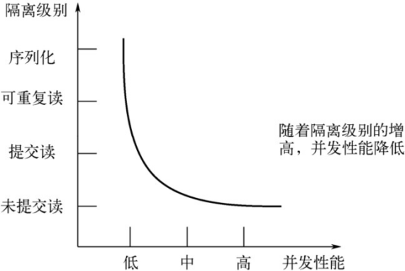

# 事务

## 1.数据库事务概述

### 1.1 基本概念

**事务** 是指在数据库中执行的一组操作，这些操作要么全部成功，要么全部失败。事务的主要目的是确保数据的一致性和完整性。

**事务处理的原则：**保证所有事务都作为一个工作单元 来执行，即使出现了故障，都不能改变这种执行方式。当在一个事务中执行多个操作时，要么所有的事务都被提交( commit )，那么这些修改就 永久 地保存下来；要么数据库管理系统将 放弃所作的所有修改 ，整个事务回滚( rollback )到最初状态。

**比如：**在生活中，我们经常会转账给别人。以下举例，小王和小明的钱包余额均为100元，这时小王要转账给小明50元，这种操作必须两个要么一起成功，要么一起失败。否则结果可能会导致，小王转账成功了，而小明接收转账失败了，这种情况就是导致金钱丢失。为了避免这种情况，我们就需要将这一组SQL语句打包成一个整体，也就是放在事务中，利用事务的特性性来保证该操作过程要么全部成功，要么全部失败。

 ```mysql
UPDATE account SET money = money - 50 WHERE name='小王';
UPDATE account SET money = money + 50 WHERE name='小明'; 
 ```

### 1.2 事务的状态

事务状态指的是一个事务在其生命周期中所处的不同阶段。理解事务状态对于开发高性能、可靠的应用至关重要。MySQL 的事务状态通常与 **InnoDB 存储引擎** 关联，因为它是 MySQL 中支持 ACID 事务的主要引擎。

MySQL根据这些操作所执行的不同阶段把 事务 大致划分成几个状态：

#### 活动（Active）

- 事务已开始，正在执行 DML 语句（如 `INSERT`, `UPDATE`, `DELETE`, `SELECT ... FOR UPDATE`）。
- 这是事务开始后的初始状态。

#### 部分提交（Partially Committed）

- 事务的最后一条语句已执行完成。
- 此时，数据的修改可能已经写入到内存中的 **重做日志缓冲区（redo log buffer）**，但尚未持久化到磁盘的重做日志文件。
- 这是一个非常短暂的状态。

#### 提交中（Committing）

- 当执行 `COMMIT` 语句时，事务进入此状态。
- InnoDB 会执行以下关键操作：
  - **写日志优先（Write-Ahead Logging）**：将重做日志缓冲区的内容**强制刷盘（fsync）** 到重做日志文件（`ib_logfile0/1`）。这是保证持久性的关键步骤。
  - **写入提交标记**：在重做日志中标记事务为已提交。
- 一旦重做日志落盘，即使此时数据页尚未写回磁盘，MySQL 重启后也能通过重做日志恢复已提交的数据。

#### 已提交（Committed）

- 重做日志已成功持久化，事务的提交标记已写入日志。
- 从技术上讲，事务此时已经“成功完成”。数据修改在内存中的脏页，可能尚未写回数据文件。
- 对于客户端来说，事务已经完成，其他事务可以查看到本次修改的结果（取决于隔离级别）。

#### 失败（Failed）

- 在活动状态或部分提交状态，如果检测到错误（如死锁、违反约束、手动 `ROLLBACK`），事务会进入此状态。
- 需要执行回滚操作。

#### 中止中（Rolling Back / Aborting）

- 当执行 `ROLLBACK` 语句或因为失败自动触发回滚时，事务进入此状态。
- InnoDB 会使用**回滚日志（undo logs）** 来撤销所有已做的修改，将数据恢复到事务开始前的状态。

#### 已中止（Rolled Back / Aborted）

- 回滚操作完成，数据库状态恢复到事务开始之前。
- 事务的生命周期结束。

#### 状态转换图

一个基本的状态转换图如下所示：

```css
     开始
       |
       v
[活动 Active] <----\
    |              | 执行语句
    | 最后语句完成   |
    v              |
[部分提交 Partially Committed]
    |              |
    | COMMIT       | ROLLBACK 或 出错
    v              |
[提交中 Committing] |
    |              |
    v              v
[已提交 Committed]  [中止中 Rolling Back]
                         |
                         v
                    [已中止 Rolled Back]
```

###  1.3 事务的ACID特性

事务具有四个重要特性，简称为 **ACID**：原子性、一致性、隔离性和持久性。

#### 原子性（atomicity）

原子性是指事务是一个不可分割的工作单位，要么全部提交，要么全部失败回滚。即要么转账成功，要么转账失败，是不存在中间状态的。如果不发保证原子性会怎么样？就会出现数据不一致的情形，A账户减去100元，而B账户增加100元操作失败，系统将无故丢失100元。

#### 一致性（consistency）

根据定义，一致性是指事务执行前后，数据从一个<font style="color:rgb(232,105,0)">`合法性状态 `</font>变换到另外一个<font style="color:rgb(232,105,0)">`合法性状态 `</font>  。这种状态是 <font style="color:rgb(232,105,0)">`语义上  `</font>的而不是语法上的，跟具体的业务有关。

那什么是合法的数据状态呢？满足 预定的约束 的状态就叫做合法的状态。通俗一点，这状态是由你自己来定义的（比如满足现实世界中的约束）。满足这个状态，数据就是一致的，不满足这个状态，数据就  是不一致的！如果事务中的某个操作失败了，系统就会自动撤销当前正在执行的事务，返回到事务操作之前的状态。

+ 列如：A账户有200元，转账300元出去，此时余额为-100。你自然就发现了此时数据是不一致的，为什么呢？因为你定义了一个状态，余额这列必须>=0。
+ 列如：A账户200元，转账50元给B账户，A账户的钱扣了，但是B账户因为各种意外，余额没有增加。你也知道此时数据是不一致的，为什么呢？因为你定义了一个状态，要求A+B的总余额必须不变。

#### 隔离型（isolation）

事务的隔离性是指一个事务的执行 不能被其他事务干扰 ，即一个事务内部的操作及使用的数据对 并发 的其他事务是隔离的，并发执行的各个事务之间不能互相干扰。

如果无法保证隔离性会怎么样？假设A账户有200元，B账户0元。A账户往B账户转账两次，每次金额为50  元，分别在两个事务中执行。如果无法保证隔离性，会出现下面的情形：

```mysql
UPDATE accounts SET money = money - 50 WHERE name='AA';
UPDATE accounts SET money = money + 50 WHERE name='BB'; 
```


#### 持久性（durability）

持久性是指一个事务一旦被提交，它对数据库中数据的改变就是 永久性的 ，接下来的其他操作和数据库故障不应该对其有任何影响。

持久性是通过 事务日志 来保证的。日志包括了 重做日志 和 回滚日志 。当我们通过事务对数据进行修改的时候，首先会将数据库的变化信息记录到重做日志中，然后再对数据库中对应的行进行修改。这样做的好处是，即使数据库系统崩溃，数据库重启后也能找到没有更新到数据库系统中的重做日志，重新执行，从而使事务具有持久性。

> 总结
>
> ACID是事务的四大特性，在这四个特性中，原子性是基础，隔离性是手段，一致性是约束条件，而持久性是我们的目的。
>
> 数据库事务，其实就是数据库设计者为了方便起见，把需要保证<font style="color:rgb(232,105,0)">`原子性`</font>、<font style="color:rgb(232,105,0)">`隔离性`</font>、<font style="color:rgb(232,105,0)">`一致性`</font>和<font style="color:rgb(232,105,0)">`持久性`</font>的一个或多个数据操作称为一个事务。


### 1.4 存储引擎

我们在使用事务之前要查看一下，MySQL是否支持事务。在MySQl中支持事务的存储引擎是**InnoBD**。

存储引擎是**负责数据存储、检索、索引管理**的底层实现，不同引擎在事务支持、锁机制、性能优化等方面差异显著。MySQL采用**插件式架构**，同一实例可为不同表选择不同引擎，从而灵活匹配业务需求。

#### 1.4.1 所有存储引擎

使用`SHOW ENGINES;`查看所有存储引擎：


从结果可以看到，只有InnoDB存储引擎支持事务，而且刚好默认的就是InnoDB存储引擎，实际上从MySQL 5.5+后就是默认引擎了。

#### 1.4.2 存储引擎设置

+ 查看默认存储引擎

```sql
SELECT @@GLOBAL.default_storage_engine;
SELECT @@SESSION.default_storage_engine;
```

+ 修改默认引擎（全局或会话级）：

```sql
SET GLOBAL default_storage_engine=MyISAM;
SET SESSION default_storage_engine=MEMORY;
```

+ **配置文件设置**（需重启生效）：

```sql
[mysqld]
default-storage-engine=InnoDB
```

如果未指定且默认引擎不可用，MySQL 会回退到可用引擎。

## 2. 如何使用事务

确认存储引擎是InnoDB就可以开始使用事务了，使用事务有两种方式，分别为**显式事务**和**隐式事务 。**

### 2.1 显式事务

显示事务 (Explicit Transaction)，需要明确使用 `START TRANSACTION` 或 `BEGIN` 开启一个事务；需要手动使用 `COMMIT` 或 `ROLLBACK`来结束事务。

**步骤1**：*BEGIN*（或 *START TRANSACTION*）用于**显式开启一个事务**，使多条 SQL 语句作为一个整体执行，要么全部成功提交，要么全部回滚。 

```mysql
mysql> BEGIN;
#或者
mysql> START TRANSACTION
```

`START TRANSACTION `语句相较于 `BEGIN` 特别之处在于，后边能跟随几个 修饰符 ：

+ `READ ONLY `：标识当前事务是一个 只读事务 ，也就是属于该事务的数据库操作只能读取数据，而不能修改数据。

+ `READ WRITE` ：标识当前事务是一个 读写事务，这是默认的 ，也就是属于该事务的数据库操作既可以读取数据， 也可以修改数据。

+ `WITH CONSISTENT SNAPSHOT` ：启动一致性读，MySQL默认就在这个隔离级别下。

**步骤2**：一系列事务中的操作（主要是DML，8.0+支持DDL）

**SQL分类**：SQL语句，根据其功能，主要分为四类：DDL、DML、DQL、DCL。

| 分类 | 全称                       | 说明                                                   |
| :--- | :------------------------- | :----------------------------------------------------- |
| DDL  | Data Definition Language   | 数据定义语言，用来定义数据库对象(数据库，表， 字段)    |
| DML  | Data Manipulation Language | 数据操作语言，用来对数据库表中的数据进行增删改         |
| DQL  | Data Query Language        | 数据查询语言，用来查询数据库中表的记录                 |
| DCL  | Data Control Language      | 数据控制语言，用来创建数据库用户、控制数据库的访问权限 |

**步骤3**：提交事务 或 中止事务（即回滚事务）

```mysql
# 提交事务。当提交事务后，对数据库的修改是永久性的。
mysql> COMMIT;
```

```mysql
# 回滚事务。即撤销正在进行的所有没有提交的修改
mysql> ROLLBACK;
```

### 2.2 隐式事务

MySQL中有一个系统变量 `autocommit `，决定着是否自动提交事务：

- `=1`（默认）：每条 SQL 语句都是一个独立的事务，执行后自动提交。你通常感知不到明确的状态变化。
- `=0`：需要显式地执行 `START TRANSACTION` 或 `BEGIN` 来开始事务，然后使用 `COMMIT` 或 `ROLLBACK` 结束。这让你能完整控制事务的生命周期。

```mysql
mysql> SHOW VARIABLES LIKE 'autocommit';
+---------------+-------+
| Variable_name | Value |
+---------------+-------+
| autocommit	| ON	|
+---------------+-------+
1 row in set (0.01 sec)
```

当然，如果我们想关闭这种 **自动提交** 的功能，可以使用下边两种方法之一：

+ 显式的的使用 START TRANSACTION 或者 BEGIN 语句开启一个事务。这样在本次事务提交或者回滚前会暂时关闭掉自动提交的功能。

+ 把系统变量 autocommit 的值设置为`OFF`，就像这样：

```mysql
SET autocommit = OFF; 
#或
SET autocommit = 0;
```

### 2.4 使用举例

先创建一张账户表：

```sql
CREATE TABLE account(
  id INT PRIMARY KEY AUTO_INCREMENT COMMENT 'ID',
  name VARCHAR(32) NOT NULL COMMENT '姓名',
  balance DECIMAL(12,2) NOT NULL DEFAULT 0 COMMENT '余额'
);

INSERT INTO account(`name`,balance) VALUES
('小王',100),
('小明',100);
```

#### 2.4.1 基本转账示例

```mysql
-- 开始事务
START TRANSACTION;

-- 业务操作
UPDATE account SET balance = balance - 50 WHERE id = 1;
UPDATE account SET balance = balance + 50 WHERE id = 2;

-- 检查业务逻辑
SELECT 
    (SELECT balance FROM account WHERE id = 1) as balance1,
    (SELECT balance FROM account WHERE id = 2) as balance2;
    
-- 确认无误后提交
COMMIT;

-- 或者发现问题时回滚
-- ROLLBACK;  
```

#### 2.4.2 自动提交模式

自动提交模式，即开始隐式事务。

```mysql
-- 查看当前自动提交设置
SELECT @@autocommit;  -- 1表示开启，0表示关闭

-- 临时关闭自动提交
SET autocommit = 0;

-- 业务操作
INSERT INTO account(`name`,balance) VALUES('hdy',9999999);
UPDATE account SET balance = balance - 10000 WHERE `name` = 'hdy';

-- 手动提交
COMMIT;

-- 恢复自动提交
SET autocommit = 1;
```

#### 2.4.3 只读事务

```mysql
-- 开始只读事务
START TRANSACTION READ ONLY;

-- 只能执行SELECT
SELECT * FROM account WHERE id = 1;
-- 更新失败
UPDATE account SET balance = 250 WHERE id = 1;

COMMIT;
```

### 2.5 保存点：SAVEPOINT

当你在数据库插入大量语句后，突然其中一句报错，rollback大量数据的效率极低，如何解决？

 我们在这里提出一个事务“保存点”的概念。

#### 2.5.1 什么是保存点

粗略来讲相当于游戏中的存档，存档之后，下次开始游戏可以从存档点开始继续游戏，而不需要从头开始。

回到MySQL数据库，当你在数据库中插入一条数据后，在这条语句后面设置一个savepoint，当你需要rollback的时候，只需要回滚到这个savepoint点时就可以，这样就节省了大量的时间，提高的工作效率，也不需要消耗过多的数据库的资源。

#### 2.5.2 使用举例

```mysql
DELIMITER //
CREATE PROCEDURE proc_update()
BEGIN
  -- 保存账户余额 
  DECLARE acc_balance INT DEFAULT 0;
  
  -- 开始事务
  START TRANSACTION;
  
  -- 第一步：存款
  UPDATE account SET balance = balance + 500 WHERE id = 1;
  SAVEPOINT after_credi;  -- 创建保存点

  -- 第二步：扣款
  UPDATE account SET balance = balance - 1000 WHERE id = 1;
  SAVEPOINT after_debit;  -- 创建保存点
  
  -- 查询余额
  SELECT balance INTO acc_balance FROM account WHERE id = 1;
  
  -- 根据情况处理
  IF acc_balance < 0 THEN
      -- 只回滚到扣款前的状态，保留存款操作
      ROLLBACK TO SAVEPOINT after_credi;
      -- 记录失败日志
      SET @err_msg = '收款账户余额不足';
      COMMIT;  -- 提交部分操作
  ELSE
      -- 全部成功，提交所有
      RELEASE SAVEPOINT after_debit;
      RELEASE SAVEPOINT after_credit;
      SET @err_msg = '';
      COMMIT;
END IF;
END//
DELIMITER;

CALL proc_update();
SELECT @err_msg;
```


## 3. 事务隔离级别

MySQL是一个**客户端／服务器**架构的软件，对于同一个服务器来说，可以有若干个客户端与之连接，每个客户端与服务器连接上之后，就可以称为一个会话（ Session ）。每个客户端都可以在自己的会话中向服务器发出请求语句，一个请求语句可能是某个事务的一部分，也就是对于服务器来说可能同时处理多个事务。事务有 **隔离性** 的特性，理论上在某个事务对某个数据进行访问 时，其他事务应该进行排队 ，当该事务提交之后，其他事务才可以继续访问这个数据。但是这样对性能影响太大 ，我们既想保持事务的隔离性，又想让服务器在处理访问同一数据的多个事务时性能尽量高些 ，那就看二者如何权衡取舍了。

事务之间具有不同程度的隔离称为事务的隔离级别。不同的隔离级别可能会引发不同的情况，有脏写、脏读、幻读、不可重复读的问题。这里先说一下，什么是脏写、脏读、幻读和不可重复读。

### 3.1 事务并发执行可能引发的问题

#### 3.1.1 脏写（Dirty Write）

一个事务修改了另一个未提交事务的数据。修改的是另一个事务还未提交的数据。

#### 3.1.2 脏读（Dirty Read）

一个事务读取另一个未提交事务的数据。读取的是另一个事务还未提交的数据。

#### 3.1.3 不可重复读（Non-Repeatable Read）

在同一个事务中，多次读取一个事务的**某一行数据**可能会得到不同的结果。

#### 3.1.4 幻读（Phantom Read）

在一个事务中，两次执行相同的查询，得到的**结果集**不同。例如，班上原本只有500个人，后面又新来了一个人。

### 3.3 四种隔离级别

#### 3.3.1 介绍

上面介绍了几种并发事务执行过程中可能遇到的一些问题，这些问题有轻重缓急之分，我们给这些问题  按照严重性来排一下序：

>  脏写 > 脏读 > 不可重复读 > 幻读

我们愿意舍弃`一部分隔离性来换取一部分性能`在这里就体现在：设立一些隔离级别，隔离级别越低，并发问题发生的就越多。 

**SQL标准中设立了4个隔离级别** ：

+ <font style="color:rgb(232,105,0)">`READ UNCOMMITTED`</font> ：**读未提交**，在该隔离级别，所有事务都可以看到其他未提交事务的执行结果。不能避免脏读、不可重复读、幻读。

+ <font style="color:rgb(232,105,0)">`READ COMMITTED`</font> ：**读已提交**，它满足了隔离的简单定义：一个事务只能看见已经提交事务所做的改变。这是大多数数据库系统的默认隔离级别（但不是MySQL默认的）。可以避免脏读，但不可重复读、幻读问题仍然存在。

+ <font style="color:rgb(232,105,0)">`REPEATABLE READ`</font> : **可重复读**，事务A在读到一条数据之后，此时事务B对该数据进行了修改并提 交，那么事务A再读该数据，读到的还是原来的内容。可以避免脏读、不可重复读，但幻读问题仍然存在。这是MySQL的**默认隔离级别**。

+ <font style="color:rgb(232,105,0)">`SERIALIZABLE`</font>：**可串行化**，确保事务可以从一个表中读取相同的行。在这个事务持续期间，禁止 其他事务对该表执行插入、更新和删除操作。所有的并发问题都可以避免，但性能十分低下。能避  免脏读、不可重复读和幻读。

**SQL标准中规定**，针对不同的隔离级别，并发事务可以发生不同严重程度的问题，具体情况如下：


**脏写**怎么没涉及到？因为脏写这个问题太严重了，不论是哪种隔离级别，都不允许脏写的情况发生。

不同的隔离级别有不同的现象，并有不同的锁和并发机制，隔离级别越高，数据库的并发性能就越差，4  种事务隔离级别与并发性能的关系如下：




#### 3.3.2 查看当前隔离级别

MySQL的默认隔离级别为`REPEATABLE READ`，通过全局变量可以查看。

```mysql
-- 全局级别
mysql> SELECT @@GLOBAL.transaction_isolation;
+--------------------------------+
| @@GLOBAL.transaction_isolation |
+--------------------------------+
| REPEATABLE-READ                |
+--------------------------------+
1 row in set (0.00 sec)

-- 会话级别
mysql> SELECT @@SESSION.transaction_isolation;
+---------------------------------+
| @@SESSION.transaction_isolation |
+---------------------------------+
| REPEATABLE-READ                 |
+---------------------------------+
1 row in set (0.00 sec)
```

#### 3.3.3 设置当前隔离级别

通过下面的语句修改事务的隔离级别：

```sql
-- 方式一
SET <SESSION|GLOBAL> TRANSACTION ISOLATION LEVEL 隔离级别名称;

-- 方式二
SET <SESSION|GLOBAL> transaction_isolation = '隔离级别名称';

-- 方式三
SET @@<SESSION|GLOBAL>.transaction_isolation = '隔离级别名称';
```

其中，方式一，使用的隔离级别可以是如下四个之一：

+ READ UNCOMMITTED
+ READ COMMITTED
+ REPEATABLE READ
+ SERIALIZABLE

其他两种方式，需要使用如下格式（把空格用`-`替代）：

+ READ-UNCOMMITTED
+ READ-COMMITTED
+ REPEATABLE-READ
+ SERIALIZABLE

例如：

```sql
SET SESSION TRANSACTION ISOLATION LEVEL SERIALIZABLE;
SET SESSION transaction_isolation = 'REPEATABLE-READ';
SET @@SESSION.transaction_isolation = 'SERIALIZABLE';
```

> 数据库规定了多种事务隔离级别，不同隔离级别对应不同的干扰程度，隔离级别越高，数据一致性  就越好，但并发性越弱。

### 3.1 数据准备

我们需要创建一个表：

```mysql
CREATE TABLE student 
( 
    sno INT PRIMARY KEY AUTO_INCREMENT, 
    name VARCHAR(20) NOT NULL,
	  class varchar(20)
);
```

然后向这个表里插入一条数据：

```mysql
INSERT INTO student VALUES(1, '小宏', '1班');
```

现在表里的数据就是这样的：

```mysql
mysql> select * from student;
+-----------+--------+-------+
| studentno | name	| class |
+-----------+--------+-------+
|	1 | 小宏	| 1班	|
+-----------+--------+-------+
1 row in set (0.00 sec)
```

### 3.2 数据并发问题

针对事务的隔离性和并发性，我们怎么做取舍呢？先看一下访问相同数据的事务在**不保证串行执行**（也就是执行完一个再执行另一个）的情况下可能会出现哪些问题：

#### 脏写（ Dirty Write ）

脏写很严重，所以SQL不允许出现！！！任何隔离级别，都避免了脏写。

对于两个事务 Session A、Session B，如果事务Session A `修改了` 另一个 `未提交` 事务Session B `修改过` 的数据，那就意味着发生了脏写。

| 发生时间编号 |                          Session A                           |                   Session B                   |
| :----------: | :----------------------------------------------------------: | :-------------------------------------------: |
|      ①       |                            BEGIN;                            |                                               |
|      ②       |                                                              |                    BEGIN;                     |
|      ③       |                                                              | UPDATE student SET name='李四' WHERE sno = 1; |
|      ④       | UPDATE student SET name=‘张三’ WHERE sno = 1;<br><font color='red'>等待事务B释放锁</font> |                                               |
|      ⑤       |                           COMMIT;                            |                                               |
|      ⑥       |                                                              |                   ROLLBACK;                   |

Session A和session B各开启了一个事务，Session B中的事务先将sno列为1的记录的name列更新为'李四'，然后session A中的事务接着又把这条sno列为1的记录的name列更新为'张三'。如果之后Session B中的事务进行了回滚，那么Session A中的更新也将不复存在，这种现象就称之为脏写。这时Session A中的事务就没有效果了，明明把数据更新了，最后也提交事务了，最后看到的数据什么变化也没有。这里大家对事务的隔离级比较了解的话，会发现默认隔离级别下，上面SessionA中的更新语句会处于**等待状态**，这里只是跟大家说明一下会出现这样现象。

#### 脏读（ Dirty Read ）

先设置事务隔离级别到`READ UNCOMMITTED`，用以演示脏读问题。

```sql
SET @@SESSION.transaction_isolation = 'READ-UNCOMMITTED';
```

对于两个事务 Session A、Session B，Session A `读取 `了已经被 Session B `更新` 但还 `没有被提交` 的字段。之后若 Session B 回滚 ，Session A `读取` 的内容就是 `临时且无效` 的。

| 发生时间编号 |                          Session A                           |                   Session B                   |
| :----------: | :----------------------------------------------------------: | :-------------------------------------------: |
|      ①       |                            BEGIN;                            |                                               |
|      ②       |                                                              |                    BEGIN;                     |
|      ③       |                                                              | UPDATE student SET name='张三' WHERE sno = 1; |
|      ④       | SELECT * FROM student WHERE sno = 1;<br>（如果读到列name为‘张三’，则意味着发生了脏读） |                                               |
|      ⑤       |                           COMMIT;                            |                                               |
|      ⑥       |                                                              |                   ROLLBACK;                   |

Session A和Session B各开启了一个事务，Session B中的事务先将studentno列为1的记录的name列更新为'张三'，然后Session A中的事务再去查询这条studentno为1的记录，如果读到列name的值为'张三'，而Session  B中的事务稍后进行了回滚，那么Session  A中的事务相当于读到了一个不存在的数据，这种现象就称之为 脏读 。

#### 不可重复读（ Non-Repeatable Read ）

先设置事务隔离级别到`READ-COMMITTED`，用以演示不可重复读问题。

```sql
SET @@SESSION.transaction_isolation = 'READ-COMMITTED';
```

对于两个事务Session A、Session B，Session A `读取` 了一个字段，然后 Session B `更新` 了该字段。 之后Session A 再次读取 `同一个字段`， 值就不同 了。那就意味着发生了不可重复读。

| 发生时间编号 |                          Session A                           |                   Session B                   |
| :----------: | :----------------------------------------------------------: | :-------------------------------------------: |
|      ①       |                            BEGIN;                            |                                               |
|      ②       | SELECT * FROM student WHERE sno = 1<br>（此时读到的列name的值为‘小宏’） |                                               |
|      ③       |                                                              | UPDATE student SET name='张三' WHERE sno = 1; |
|      ④       | SELECT * FROM student WHERE sno = 1<br>（如果读到列name为‘张三’，则意味着发生了不可重复读） |                                               |
|      ⑤       |                                                              | UPDATE student SET name='李四' WHERE sno = 1; |
|      ⑥       | SELECT * FROM student WHERE sno = 1<br/>（如果读到列name为‘李四’，则意味着发生了不可重复读） |                                               |

我们在Session B中提交了几个 隐式事务 （注意是隐式事务，意味着语句结束事务就提交了），这些事务都修改了sno列为1的记录的列name的值，每次事务提交之后，如果Session   A中的事务都可以查看到最新的值，这种现象也被称之为不可重复读 。

#### 幻读（ Phantom ）

先设置事务隔离级别到`REPEATABLE-READ`，用以演示脏读问题。

```sql
SET @@SESSION.transaction_isolation = 'REPEATABLE-READ';
```

对于两个事务Session A、Session B, Session A 从一个表中 `读取` 了一个字段, 然后 Session B 在该表中 `插入` 了一些新的行。 之后, 如果 Session A 再次读取 同一个表, 就会多出几行。那就意味着发生了幻读。

| 发生时间编号 |                          Session A                           |                    Session B                     |
| :----------: | :----------------------------------------------------------: | :----------------------------------------------: |
|      ①       |                            BEGIN;                            |                                                  |
|      ②       | SELECT * FROM student WHERE sno >0;<br/>（此时读到的列name的值为‘李四’） |                                                  |
|      ③       |                                                              | INSERT INTO student VALUES(2,'赵六','终极一班'); |
|      ④       | SELECT * FROM student WHERE sno > 0;<br>（如果读到列name为‘张三’、‘赵六’的记录，则意味着发生了幻读） |                                                  |

Session A中的事务先根据条件 studentno > 0这个条件查询表student，得到了name列值为'张三'的记录； 之后Session B中提交了一个 隐式事务 ，该事务向表student中插入了一条新记录；之后Session A中的事务再根据相同的条件 sno> 0查询表student，得到的结果集中包含Session B中的事务新插入的那条记录，这种现象也被称之为 `幻读` 。我们把新插入的那些记录称之为 `幻影记录` 。

从上面的示例中，可以看出，事务A的两次查询，得到的结果一致，并没有查到事务B最新插入的数据。

原因是，在可重复读隔离级别下，第一次快照读的时候，生成了一个读视图。第二次快照读的时候，复用了第一次生成的读视图，所以两次查询得到的结果一致。

所以，在快照读的情况下，**可重复读**隔离级别是解决了**幻读**的问题

在快照读的情况下，是通过**MVCC（复用视图）**解决了幻读问题。

再测试一下，在**当前读**的情况下，**可重复读**隔离级别是否解决**幻读**问题：

```sql
-- 将上面的时间编号为4的查询后面加上FOR UPDATE;
mysql> SELECT * FROM student WHERE sno >0 FOR UPDATE;
+-----+------+----------+
| sno | name | class    |
+-----+------+----------+
|   1 | 李四 | 1班      |
|   2 | 赵六 | 终极一班 |
+-----+------+----------+
2 rows in set (0.00 sec)
```

> *SELECT ... FOR UPDATE* 是 **InnoDB** 实现悲观锁的核心语法，用于在事务中锁定查询到的行，防止其他事务修改或加锁这些记录，直到当前事务提交或回滚。它必须在**显式事务**中使用，否则锁会立即释放而失效。

从上面的示例中，可以看出，事务A的两次查询，得到的结果不一致。在事务B插入数据，并提交事务后。事务A的第二次执行**当前读（加了for update）**的时候，读到了事务B最新插入的数据。

原因是，在可重复读隔离级别下，每次执行当前读会生成一个新的**读视图**，所以能读到其他事务最新插入的数据。

所以，在**当前读**的情况下，**可重复读**隔离级别是没有解决了**幻读**的问题。

在执行上面的测试用例的时候，我忽然想到一个问题，既然`select for update`的当前读，出现了幻读问题，是不是其他的当前读也会复现幻读问题，比如insert。

再执行测试用例，验证一下：

| 发生时间编号 |                          Session A                           |                    Session B                     |
| :----------: | :----------------------------------------------------------: | :----------------------------------------------: |
|      ①       |                            BEGIN;                            |                                                  |
|      ②       | SELECT * FROM student WHERE sno >0;<br/> （此时读到的列name的值为‘李四’） |                                                  |
|      ③       |                                                              | INSERT INTO student VALUES(2,'赵六','终极一班'); |
|      ④       | INSERT INTO student VALUES(2,'赵六','终极一班');<br> （插入相同主键id的数据） |                                                  |

在执行时间编号为④的插入语句时，报错了：`ERROR 1062 (23000): Duplicate entry '2' for key 'student.PRIMARY'`。

跟预想的一样，在insert当前读的情况下，也出现了幻读的问题（主键冲突）。

那有没有什么办法？在**可重复读**隔离级别下，执行**当前读**的时候，也能解**决幻读**的问题？

当然有的，唯一的办法就是**加锁**。

| 发生时间编号 |                          Session A                           |                          Session B                           |
| :----------: | :----------------------------------------------------------: | :----------------------------------------------------------: |
|      ①       |                            BEGIN;                            |                                                              |
|      ②       | SELECT * FROM student WHERE sno >0 FOR UPDATE;<br/> （此时读到的列name的值为‘李四’） |                                                              |
|      ③       |                                                              | INSERT INTO student VALUES(2,'赵六','终极一班');<br/><font color='red'>等待事务A释放锁</font> |

事务A在执行第一次查询的时候，就对数据进行加锁（使用for update），防止其他事务修改数据，这样也就彻底解决了**幻读**问题。

当然，设置事务隔离级别到`SERIALIZABLE`也可以解决幻读问题：

```sql
SET @@SESSION.transaction_isolation = 'REPEATABLE-READ';
```

虽然**Serializable**隔离级别能够提供最高的数据一致性，但其并发性能较低，因为所有事务都需要按顺序执行，可能会导致系统性能下降。因此，在实际应用中，应根据具体需求选择合适的事务隔离级别。