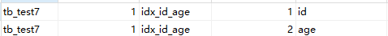
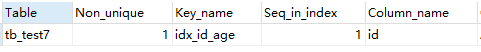
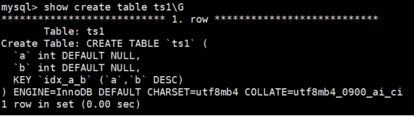
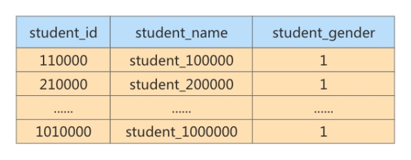

# 索引的创建与设计原则

## 1. 索引的声明与使用

### **1.1** 索引的分类

MySQL的索引包括普通索引、唯一性索引、全文索引、单列索引、多列索引和空间索引等。

+ 从`功能逻辑` 上说，索引主要有 4 种，分别是普通索引、唯一索引、主键索引、全文索引。
+ 按照 `物理实现方式` ，索引可以分为 2 种：聚簇索引和非聚簇索引。

+ 按照 `作用字段个数` 进行划分，分成单列索引和联合索引。

#### **1.** **普通索引**

在创建普通索引时，不附加任何限制条件，只是用于提高查询效率。这类索引可以创建在任何数据类型中，其值是否唯一和非空，要由字段本身的完整性约束条件决定。建立索引以后，可以通过索引进行查询。例如，在表student的字段name上建立一个普通索引，查询记录时就可以根据该索引进行查询。

#### **2.** **唯一性索引**

使用UNIQUE参数可以设置索引为唯一性索引，在创建唯一性索引时，限制该索引的值必须是唯一的，但允许有空值。在一张数据表里可以有多个唯一索引。

例如，在表student的字段email中创建唯一性索引，那么字段email的值就必须是唯一的。通过唯一性索引，可以更快速地确定某条记录。

#### **3.** **主键索引**

主键索引就是一种特殊的唯一性索引，在唯一索引的基础上增加了不为空的约束，也就是NOT NULL+UNIQUE，一张表里最多只有一个主键索引。

Why? 这是由主键索引的物理实现方式决定的，因为数据存储在文件中只能按照一种顺序进行存储。

#### **4.** **单列索引**

在表中的单个字段上创建索引。单列索引只根据该字段进行索引。单列索引可以是普通索引，也可以是唯一性索引，还可以是全文索引。只要保证该索引只对应一个字段即可。一个表可以有多个单列索引。

#### **5.** **多列(组合、联合)索引**

多列索引是在表的多个字段组合上创建一个索引。该索引指向创建时对应的多个字段，可以通过这几个字段进行查询，但是只有查询条件中使用了这些字段中的第一个字段时才会被使用。例如，在表中的字段id、name和gender上建立一个多列索引idx_id_name_gender `，只有在查询条件中使用了字段id时该索引才会被使用。使用组合索引时遵循最左前缀集合。

#### **6.** **全文索引**

全文索引(也称全文检索)是目前搜索引擎使用的一种关键技术。它能够利用【分词技术】等多种算法智能分析出文本文字中关键词的频率和重要性，然后按照一定的算法规则智能地筛选出我们想要的搜索结果。全文索引非常适合大型数据集，对于小的数据集，它的用处比较小。

使用参数FULLTEXT可以设置索引为全文索引。在定义索引的列上支持值的全文查找，允许在这些索引列中插入重复值和空值。全文索引只能创建在CHAR、VARCHAR或TEXT类型及其系列类型的字段上，查询数据量较大的字符串类型的字段时，使用全文索引可以提高查询速度。例如，表student的字段information是TEXT类型，该字段包含了很多文字信息。在字段information上建立全文索引后，可以提高查询字段information的速度。

全文索引典型的有两种类型:自然语言的全文索引和布尔全文索引。

+ 自然语言搜索引擎将计算每一个文档对象和查询的相关度。这里，相关度是基于匹配的关键词的个数，以及关键词在文档中出现的次数。在整个索引中出现次数越少的词语，匹配时的相关度就越高。相反，非常常见的单词将不会被搜索，如果一个词语的在超过50%的记录中都出现了，那么自然语言的搜索将不会搜索这类词语。

MySQL数据库从3.23.23版开始支持全文索引，但MysQL5.6.4以前只有Myisam支持，5.6.4版本以后innodb才支持，但是官方版本不支持中文分词，需要第三方分词插件。在5.7.6版本，MySQL内置了ngram全文解析器，用来支持亚洲语种的分词。测试或使用全文索引时，要先看一下自己的MysQL版本、存储引擎和数据类型是否支持全文索引。

随着大数据时代的到来，关系型数据库应对全文索引的需求已力不从心，逐渐被solr、ElasticSearch等专门的搜索引擎所替代。

#### **7.** **补充：空间索引**

**小结：不同的存储引擎支持的索引类型也不一样**

**InnoDB** **：**支持 B-tree、Full-text 等索引，不支持 Hash 索引； 

**MyISAM** **：** 支持 B-tree、Full-text 等索引，不支持 Hash 索引；

**Memory** **：**支持 B-tree、Hash 等索引，不支持 Full-text 索引； 

**NDB** **：**支持 Hash 索引，不支持 B-tree、Full-text 等索引； 

**Archive** **：**不支持 B-tree、Hash、Full-text 等索引；

### **1.2** 创建索引

#### 1. 创建表的时候创建索引

举例：

```mysql
CREATE DATABASE db_test;
USE db_test;
-- 部门表
CREATE TABLE dept(
	dept_id INT PRIMARY KEY AUTO_INCREMENT,
	dname VARCHAR(20)
);

-- 员工表
CREATE TABLE emp(
	emp_id INT PRIMARY KEY AUTO_INCREMENT,
	ename VARCHAR(20) UNIQUE, 
	dept_id INT,
	CONSTRAINT emp_dept_id_fk FOREIGN KEY(dept_id) REFERENCES dept(dept_id)
);

-- 查看索引
SHOW INDEX FROM emp;
```

隐式创建索引，在声明有主键约束、唯一性约束、外键约束的字段上，会自动添加相关的索引。

但是，如果显式创建表时创建索引的话，基本语法格式如下：

```mysql
CREATE TABLE table_name (
    col_name data_type,...
	[UNIQUE | FULLTEXT | SPATIAL] [INDEX | KEY] [index_name] (col_name [length]) [ASC | DESC]
    )
```

+ UNIQUE 、 FULLTEXT 和 SPATIAL 为可选参数，分别表示唯一索引、全文索引和空间索引；

+ INDEX 与 KEY 为同义词，两者的作用相同，用来指定创建索引；

+ index_name 指定索引的名称，为可选参数，如果不指定，那么MySQL默认col_name为索引名；

+ col_name 为需要创建索引的字段列，该列必须从数据表中定义的多个列中选择； length 为可选参数，表示索引的长度，只有字符串类型的字段才能指定索引长度； ASC 或 DESC 指定升序或者降序的索引值存储。

##### **1.** **创建普通索引**

在book表中的year_publication字段上建立普通索引，SQL语句如下：

```mysql
CREATE TABLE book(
	book_id INT , 
    book_name VARCHAR(100), 
    authors VARCHAR(100), 
    info VARCHAR(100) ,
	comment VARCHAR(100), 
    year_publication YEAR,	-- 出版年 
    -- 声明索引
    INDEX(year_publication)
);
```

##### **2.** **创建唯一索引**

举例：

```mysql
CREATE TABLE tb_test1( 
    id INT NOT NULL,
    name varchar(30) NOT NULL, 
    UNIQUE INDEX uk_idx_id(id)
);
```

该语句执行完毕之后，使用SHOW CREATE TABLE查看表结构：

```mysql
SHOW INDEX FROM tb_test1 \G
```

##### **3.** **主键索引**

```mysql
CREATE TABLE student (
	id INT(10) UNSIGNED,
	student_no VARCHAR(200), 
    student_name VARCHAR(200), 
    PRIMARY KEY(id)
);
```

设定为主键后数据库会自动建立索引，innodb为聚簇索引，语法： 随表一起建索引：

删除主键索引：

```mysql
ALTER TABLE student drop PRIMARY KEY ;
```

修改主键索引：必须先删除掉(drop)原索引，再新建(add)索引

##### **4.** **创建单列索引**

举例：

```mysql
CREATE TABLE tb_est2(
    id INT NOT NULL, 
    name CHAR(50) NULL,
	INDEX single_idx_name(name(20))
);
```

该语句执行完毕之后，使用SHOW CREATE TABLE查看表结构：

```mysql
SHOW INDEX FROM tb_test2 \G
```

##### **5.** **创建组合索引**

举例：创建表test3，在表中的id、name和age字段上建立组合索引，SQL语句如下：

```mysql
CREATE TABLE tb_test3( 
   id INT(11) NOT NULL,
   name CHAR(30) NOT NULL, 
   age INT(11) NOT NULL, 
   info VARCHAR(255),
   INDEX multi_idx(id,name,age)
);
```

该语句执行完毕之后，使用SHOW INDEX 查看：

```mysql
SHOW INDEX FROM tb_test3 \G
```

由结果可以看到，id、name和age字段上已经成功建立了一个名为multi_idx的组合索引。

组合索引可起几个索引的作用，但是使用时并不是随便查询哪个字段都可以使用索引，而是遵从“最左前缀”原则。例如，索引可以搜索的字段组合为：（id, name, age） 、 （id, name）或者id。而（age）或者（name,age）组合不能使用索引查询。

在test3表中，查询id和name字段，使用EXPLAIN语句查看索引的使用情况：

```mysql
EXPLAIN SELECT * FROM tb_test3 WHERE id=100 AND name= 'maye';

+----+-------------+-------+------------+------+---------------+-----------+
| id | select_type | table | partitions | type | possible_keys | key       |
+----+-------------+-------+------------+------+---------------+-----------+
|  1 | SIMPLE      | test3 | NULL       | ref  | multi_idx     | multi_idx |
+----+-------------+-------+------------+------+---------------+-----------+
1 row in set, 1 warning (0.00 sec)
```

可以看到，查询id和name字段时，使用了名称为Multildx的索引，如果查询(name,age)组合或者单独查询name和age字段，会发现结果中possible_keys和key值为NULL，并没有使用在t3表中创建的索引进行查询。

```mysql
EXPLAIN SELECT * FROM teb_test3 WHERE `name`='maye' ;

+----+-------------+-------+------------+------+---------------+------+
| id | select_type | table | partitions | type | possible_keys | key  |
+----+-------------+-------+------------+------+---------------+------+
|  1 | SIMPLE      | test3 | NULL       | ALL  | NULL          | NULL |
+----+-------------+-------+------------+------+---------------+------+
1 row in set, 1 warning (0.00 sec)
```


##### **6.** **创建全文索引**

FULLTEXT全文索引可以用于全文搜索，并且只能为CHAR、VARCHAR和TEXT列创建索引。

举例1：创建表tb_test4，在表中的info字段上建立全文索引，SQL语句如下：

```mysql
CREATE TABLE tb_test4(
    id INT NOT NULL,
    name CHAR(30) NOT NULL, 
    age INT NOT NULL,
    info VARCHAR(255),
    FULLTEXT INDEX futxt_idx_info(info)
);
```

举例2：创建了一个给title和body字段添加全文索引的表。

```mysql
CREATE TABLE articles (
    id INT UNSIGNED AUTO_INCREMENT PRIMARY KEY, 
    title VARCHAR (200),
    body TEXT,
    FULLTEXT index (title, body)
);
```

不同于like方式的的查询：

 ```mysql
EXPLAIN SELECT * FROM tb_test4 WHERE info LIKE '%hello%';
 ```

全文索引用match+against方式查询：

```mysql
EXPLAIN SELECT * FROM tb_test4 WHERE MATCH(info) AGAINST('hello%');

EXPLAIN SELECT * FROM articles WHERE MATCH(title,body) AGAINST('hello%');
```

> 注意点
>
> 1. 使用全文索引前，搞清楚版本支持情况；
>
> 2. 全文索引比 like + % 快 N 倍（10倍以上），但是可能存在精度问题；
>
> 3. 如果需要全文索引的是大量数据，建议先添加数据，再创建索引。 

##### **7.** **创建空间索引**

空间索引创建中，要求空间类型的字段必须为 非空 。

举例：创建表test5，在空间类型为GEOMETRY的字段上创建空间索引，SQL语句如下：

```mysql
CREATE TABLE tb_test5( 
    geo GEOMETRY NOT NULL,
	SPATIAL INDEX spa_idx_geo(geo)
);
```

该语句执行完毕之后，使用SHOW CREATE TABLE查看表结构:

```mysql
SHOW INDEX FROM tb_test5;
```


可以看到，tb_test5表的geo字段上创建了名称为spa_idx_geo的空间索引。

#### **2.** **在已经存在的表上创建索引**

在已经存在的表中创建索引可以使用ALTER TABLE语句或者CREATE INDEX语句。

**1.** 使用ALTERTABLE语句创建索引ALTER TABLE语句创建索引的基本语法如下：

```mysql
ALTER TABLE table_name ADD [UNIQUE | FULLTEXT | SPATIAL] [INDEX | KEY]
[index_name] (col_name[length],...) [ASC | DESC]
```

例如：

```mysql
CREATE TABLE tb_test6(
    id INT NOT NULL,
    name CHAR(30) NOT NULL, 
	age INT NOT NULL,
    info VARCHAR(255)
);
SHOW INDEX FROM tb_test6;
```

添加索引：

```mysql
ALTER TABLE tb_test6 ADD INDEX idx_name(name);
ALTER TABLE tb_test6 ADD UNIQUE INDEX idx_age(age);
ALTER TABLE tb_test6 ADD INDEX idx_multi(id,name,age);
```

**2.** **使用CREATE INDEX创建索引** CREATE INDEX语句可以在已经存在的表上添加索引，在MySQL中， CREATE INDEX被映射到一个ALTER TABLE语句上，基本语法结构为：

 ```mysql
CREATE [UNIQUE | FULLTEXT | SPATIAL] INDEX index_name
ON table_name (col_name[length],...) [ASC | DESC] 
 ```

例如：

```mysql
CREATE TABLE tb_test7(
    id INT NOT NULL,
    name CHAR(30) NOT NULL, 
		age INT NOT NULL,
    info VARCHAR(255)
);

SHOW INDEX FROM tb_test7;
```

添加索引：

```mysql
CREATE INDEX idx_name ON tb_test7(name);
CREATE UNIQUE INDEX idx_age ON tb_test7(age);
CREATE INDEX idx_id_age ON tb_test7(id,age);
```

### 1.3 删除索引

MySQL中删除索引使用`ALTER TABLE`或者`DROP INDEX`语句，两者可实现相同的功能，DROP INDEX语句在内部被映射到一个ALTER TABLE语句中。

**1. 使用ALTER TABLE删除索引** 

ALTER TABLE删除索引的基本语法格式如下：

```mysql
ALTER TABLE table_name DROP INDEX index_name;
```

例如：删除tb_test7中的idx_name索引

```mysql
ALTER TABLE tb_test7 DROP INDEX idx_name;
```

语句执行完成之后，使用SHOW语句进行查看是否被删除。

```mysql
SHOW INDEX FROM tb_test7;
```

**2. 使用DROP INDEX...ON...语句删除索引** 

DROP INDEX删除索引的基本语法格式如下：

 ```mysql
DROP INDEX index_name ON table_name;
 ```

例如：删除tb_test7中的idx_age索引

```mysql
DROP INDEX idx_age ON tb_test7;
```

如果删除的字段建立了**联合索引**，则对应的索引会被删除掉。

删除字段之前的索引，有两个：

```mysql
ALTER TABLE tb_test7 DROP age;
```

删除字段之后的索引，只有一个：

> 提示 ：删除表中的列时，如果要删除的列为索引的组成部分，则该列也会从索引中删除。如果组成索引的所有列都被删除，则整个索引将被删除。

**主键：**

当字段是主键并且具有自增长约束时，不能直接删除主键索引！

```mysql
CREATE TABLE testkey
(
	id INT PRIMARY KEY AUTO_INCREMENT
);
```

尝试删除主键索引：

```mysql
ALTER TABLE testkey DROP PRIMARY KEY;
-- 报错如下：
> 1075 - Incorrect table definition; there can be only one auto column and it must be defined as a key
```

报错大概的意思是删除主键索引后，自增长列(AUTO_INCREMENT)没有依附的键了。因为自增长列约束必须是键列(主键列或唯一键列)。

所以必须先删除自增长约束，然后删除主键。

```mysql
-- 首先，删除自增长约束
ALTER TABLE testkey MODIFY id INT;
-- 然后，删除主键
ALTER TABLE testkey DROP PRIMARY KEY;
-- 添加主键
ALTER TABLE testkey ADD PRIMARY KEY(id);
```


## **2.** MySQL8.0 索引新特性

### **2.1** 支持降序索引

降序索引以降序存储键值。虽然在语法上，从MySQL4版本开始就已经支持降序索引的语法了，但实际上该DESC定义是被忽略的，直到MysQL 8.x版本才开始真正支持降序索引(仅限于InnoDB存储引擎)。

MysQL在**8.0版本之前创建的仍然是升序索引，使用时进行反向扫描，这大大降低了数据库的效率**。在某些场景下，降序索引意义重大。例如，如果一个查询，需要对多个列进行排序，且顺序要求不一致，那么使用降序索引将会避免数据库使用额外的文件排序操作，从而提高性能。

举例：分别创建两个表ts1、ts2，ts1不创建降序索引，ts2创建降序索引，结果如下：

```mysql
-- 测试没有降序索引的情况
CREATE TABLE ts1(	
    a INT,
		b INT,
		INDEX idx_a_b(a,b)
		);


-- 测试有降序索引的情况
CREATE TABLE ts2(	
    a INT,
		b INT,
		INDEX idx_a_b(a,b DESC)
		);
```

查看数据表ts1的结构，结果如下：

 

从结果可以看出，索引仍然是默认的升序。

查看数据表ts2的结构，结果如下：

 

从结果可以看出，索引已经是降序了。下面继续测试降序索引在执行计划中的表现。

在两表中分别插入800条随机数据，执行语句如下：

```mysql
DELIMITER //
CREATE PROCEDURE ts1_insert() 
BEGIN
	DECLARE i INT DEFAULT 1; -- 变量要定义在最开始
	START TRANSACTION;			 -- 开始事务要放在定义变量之后
	WHILE i <= 800 DO
		INSERT INTO ts1 SELECT RAND()*80000,RAND()*80000; 
		SET i = i + 1;
	END WHILE;
	COMMIT; 
END //
DELIMITER ;

#调用
CALL ts1_insert();
```

**查看数据表ts1的执行计划。**

```mysql
EXPLAIN SELECT * FROM ts1 ORDER BY a,b DESC LIMIT 5;
```

结果如下：


从结果可以看出，执行计划中扫描数为800，而且使用了Using filesort。

> 提示 Using  filesort是MySQL中一种速度比较慢的外部排序，能避免是最好的。多数情况下，管理员可以通过优化索引来尽量避免出现Using filesort，从而提高数据库执行速度。

**查看数据表ts2的执行计划。**

```mysql
EXPLAIN SELECT * FROM ts2 ORDER BY a,b DESC LIMIT 5;
```

结果如下。


从结果可以看出，执行计划中扫描数为5，而且没有使用Using filesort。

> 注意：降序索引只对查询中特定的排序顺序有效，如果使用不当，反而查询效率更低。例如，上述查询排序条件改为order by a desc, b desc，ts1表的执行计划要明显好于ts2。

将排序条件修改为order by a desc, b desc后，下面来对比ts1和ts2的效果。 查看数据表ts1的执行计划，结果如下：

```mysql
EXPLAIN SELECT * FROM ts1 ORDER BY a DESC,b DESC LIMIT 5;
```

ts1、ts2结果分别如下：

<center>ts1</center>


<center>ts2</center>


从结果可以看出，修改后ts1的执行计划要明显好于ts2。

### 2.2 隐藏索引

在MySQL  5.7版本及之前，只能通过显式的方式删除索引。此时，如果发现删除索引后出现错误，又只能通过显式创建索引的方式将删除的索引创建回来。如果数据表中的数据量非常大，或者数据表本身比较  大，这种操作就会消耗系统过多的资源，操作成本非常高。

从MySQL 8.x开始支持 隐藏索引（invisible indexes） ，只需要将待删除的索引设置为隐藏索引，使查询优化器不再使用这个索引（即使使用force index（强制使用索引），优化器也不会使用该索引）， 确认将索引设置为隐藏索引后系统不受任何响应，就可以彻底删除索引。这种通过先将索引设置为隐藏索引，再删除索引的方式就是软删除 。

同时，如果你想验证某个索引|删除之后的**查询性能影响**，就可以暂时先隐藏该索引。

索引默认是可见的，在使用CREATE TABLE，CREATE INDEX或者ALTER TABLE等语句时可以通过VISIBLE或者
INVISIBLE关键词设置索引的可见性。

**1.** **创建表时直接创建** 在MySQL中创建隐藏索引通过SQL语句INVISIBLE来实现，其语法形式如下：

```mysql
CREATE TABLE tablename(
	...
	INDEX [indexname](fieldname [(length)]) INVISIBLE
);
```

上述语句比普通索引多了一个关键字INVISIBLE，用来标记索引为不可见索引。

**2.** **在已经存在的表上创建**

可以为已经存在的表设置隐藏索引，其语法形式如下：

```mysql
CREATE INDEX indexname
ON tablename(fieldname[(length)]) INVISIBLE;
```

**3.** **通过ALTER TABLE语句创建**

语法形式如下：

 ```mysql
ALTER TABLE tablename
ADD INDEX indexname (fieldname [(length)]) INVISIBLE;
 ```

**4.** **切换索引可见状态** 已存在的索引可通过如下语句切换可见状态：

```mysql
ALTER TABLE tablename ALTER INDEX index_name INVISIBLE; #切换成隐藏索引
ALTER TABLE tablename ALTER INDEX index_name VISIBLE; #切换成非隐藏索引
```

如果将index_cname索引切换成可见状态，通过explain查看执行计划，发现优化器选择了index_cname索   引。

> 注意  当索引被隐藏时，它的内容仍然是和正常索引一样实时更新的。如果一个索引需要长期被隐藏，那么可以将其删除，因为索引的存在会影响插入、更新和删除的性能。

通过设置隐藏索引的可见性可以查看索引对调优的帮助。

**5.** **使隐藏索引对查询优化器可见**

在MySQL 8.x版本中，为索引提供了一种新的测试方式，可以通过查询优化器的一个开关（use_invisible_indexes）来打开某个设置，使隐藏索引对查询优化器可见。如果 use_invisible_indexes 设置为off(默认)，优化器会忽略隐藏索引。如果设置为on，即使隐藏索引不可见，优化器在生成执行划时仍会考虑使用隐藏索引。

（1） 在MySQL命令行执行如下命令查看查询优化器的开关设置。

```mysql
mysql> select @@optimizer_switch \G
```

在输出的结果信息中找到如下属性配置。

 ```mysql
use_invisible_indexes=off
 ```

此属性配置值为off，说明隐藏索引默认对查询优化器不可见。

（2） 使隐藏索引对查询优化器可见，需要在MySQL命令行执行如下命令： 

```mysql
mysql> set session optimizer_switch="use_invisible_indexes=on"; 
Query OK, 0 rows affected (0.00 sec)
```

SQL语句执行成功，再次查看查询优化器的开关设置。

```mysql
mysql> select @@optimizer_switch \G
*************************** 1. row *************************** @@optimizer_switch: index_merge=on,index_merge_union=on,index_merge_sort_union=on,index_merge_intersection=on,engine_condition_pushdown=on,index_condition_pushdown=on,mrr=on,mrr_cost_based=on,block_nested_loop=on,batched_key_access=off,materialization=on,semijoin=on,loosescan=on,firstmatch=on,duplicateweedout=on,subquery_materialization_cost_based=on,use_index_extensions=on,condition_fanout_filter=on,derived_merge=on,use_invisible_indexes=on,skip_scan=on,hash_join=on,subquery_to_derived=off,prefer_ordering_index=on,hypergraph_optimizer=off,derived_condition_pushdown=on,hash_set_operations=on
1 row in set (0.00 sec)
```

此时，在输出结果中可以看到如下属性配置。

 ```mysql
use_invisible_indexes=on
 ```

use_invisible_indexes属性的值为on，说明此时隐藏索引对查询优化器可见。

（3） 使用EXPLAIN查看以字段invisible_column作为查询条件时的索引使用情况。

```mysql
explain select * from classes where cname = '高一2班';
```

查询优化器会使用隐藏索引来查询数据。

（4） 如果需要使隐藏索引对查询优化器不可见，则只需要执行如下命令即可。

```mysql
mysql> set session optimizer_switch="use_invisible_indexes=off"; 
Query OK, 0 rows affected (0.00 sec)
```

再次查看查询优化器的开关设置。 

```mysql
mysql> select @@optimizer_switch \G
```

此时，use_invisible_indexes属性的值已经被设置为“off”。

## **3.** 索引的设计原则

为了使索引的使用效率更高，在创建索引时，必须考虑在哪些字段上创建索引和创建什么类型的索引。**索引设计不合理或者缺少索引都会对数据库和应用程序的性能造成障碍**。高效的索引对于获得良好的性能非常重要。设计索引时，应该考虑相应准则。

### **3.1** 数据准备

**第1步：创建数据库、创建表**

```mysql
CREATE DATABASE db_dunkai; 
USE db_dunkai;
#1.创建学生表和课程表
-- 学生表
CREATE TABLE `student_info` (
`id` INT(11) NOT NULL AUTO_INCREMENT,
`student_id` INT NOT NULL ,
`name` VARCHAR(20) DEFAULT NULL,
`course_id` INT NOT NULL ,
`class_id` INT(11) DEFAULT NULL,
`create_time` DATETIME DEFAULT CURRENT_TIMESTAMP ON UPDATE CURRENT_TIMESTAMP, PRIMARY KEY (`id`)
) ENGINE=INNODB AUTO_INCREMENT=1 DEFAULT CHARSET=utf8;
-- 课程表
CREATE TABLE `course` (
`id` INT(11) NOT NULL AUTO_INCREMENT,
`course_id` INT NOT NULL ,
`course_name` VARCHAR(40) DEFAULT NULL, PRIMARY KEY (`id`)
) ENGINE=INNODB AUTO_INCREMENT=1 DEFAULT CHARSET=utf8;
```

**第2步：创建模拟数据必需的存储函数**

```mysql
#函数1：创建随机产生字符串函数
SET GLOBAL log_bin_trust_function_creators = 1;
DELIMITER //
CREATE FUNCTION rand_string(n INT)
RETURNS VARCHAR(255) #该函数会返回一个字符串
BEGIN
	DECLARE chars_str VARCHAR(100) DEFAULT'abcdefghijklmnopqrstuvwxyzABCDEFJHIJKLMNOPQRSTUVWXYZ'; 
	DECLARE return_str VARCHAR(255) DEFAULT '';
	DECLARE i INT DEFAULT 0; 
	WHILE i < n DO
		SET return_str =CONCAT(return_str,SUBSTRING(chars_str,FLOOR(1+RAND()*52),1)); 			SET i = i + 1;
	END WHILE;
	RETURN return_str; 
END //
DELIMITER ;

#函数2：创建随机数函数
DELIMITER //
CREATE FUNCTION rand_num (from_num INT ,to_num INT) 
RETURNS INT(11) 
BEGIN
	DECLARE i INT DEFAULT 0;
	SET i = FLOOR(from_num +RAND()*(to_num - from_num+1))	; 
	RETURN i;
END // 
DELIMITER ;
```

创建函数，假如报错：

 ```mysql
This function has none of DETERMINISTIC......
 ```

由于开启过慢查询日志bin-log, 我们就必须为我们的function指定一个参数。

主从复制，主机会将写操作记录在bin-log日志中。从机读取bin-log日志，执行语句来同步数据。如果使用函数来操作数据，会导致从机和主键操作时间不一致。所以，默认情况下，mysql不开启创建函数设置。

查看mysql是否允许创建函数：

```mysql
show variables like 'log_bin_trust_function_creators';
```

命令开启：允许创建函数设置：

```mysql
set global log_bin_trust_function_creators=1;	
```

mysqld重启，上述参数又会消失。永久方法： 

+ windows下：my.ini[mysqld]加上：

```mysql
log_bin_trust_function_creators=1
```

linux下：/etc/my.cnf下my.cnf[mysqld]加上：

```mysql
log_bin_trust_function_creators=1
```

第3步：创建插入模拟数据的存储过程

```mysql
# 存储过程1：创建插入课程表存储过程
DELIMITER //
CREATE PROCEDURE insert_course( max_num INT ) 
BEGIN
	DECLARE i INT DEFAULT 0;
	SET autocommit = 0;	#设置手动提交事务
	REPEAT #循环
	SET i = i + 1; #赋值
	INSERT INTO course (course_id, course_name ) VALUES (rand_num(10000,10100),rand_string(6));
	UNTIL i = max_num
	END REPEAT;
	COMMIT; #提交事务
	END //
DELIMITER ;

# 存储过程2：创建插入学生信息表存储过程
DELIMITER //
CREATE PROCEDURE insert_stu( max_num INT ) 
BEGIN
	DECLARE i INT DEFAULT 0;
	SET autocommit = 0;	#设置手动提交事务
	REPEAT #循环
	SET i = i + 1; #赋值
	INSERT INTO student_info (course_id, class_id ,student_id ,NAME ) VALUES (rand_num(10000,10100),rand_num(10000,10200),rand_num(1,200000),rand_string(6));
	UNTIL i = max_num END REPEAT;
	COMMIT; #提交事务
END // 
DELIMITER ;
```

第4步：调用存储过程

```mysql
CALL insert_course(100);

CALL insert_stu(500000);
```

### **3.2 哪些情况适合创建索引**

**1. 字段的数值有唯一性的限制**

索引本身可以起到约束的作用，比如唯一索引、 主键索引都是可以起到唯一性约束的， 因此在我们的数据表中，如果某个字段是唯一性的， 就可以直接创建唯一性索引， 或者主键索引。这样可以更快速地通过该索引来确定某条记录。

例如，学生表中学号是具有唯一性的字段，为该字段建立唯一性索引可以很快确定某个学生的信息，如果使用姓名的话，可能存在同名现象，从而降低查询速度。

> 业务上具有唯一特性的字段，即使是组合字段，也必须建成唯一索引。（来源：Alibaba）
>
> 说明：不要以为唯一索引影响了 insert 速度，这个速度损耗可以忽略，但提高查找速度是明显的。 

**2.** **频繁作为** **WHERE** **查询条件的字段**

某个字段在SELECT语句的 WHERE  条件中经常被使用到，那么就需要给这个字段创建索引了。尤其是在数据量大的情况下，创建普通索引就可以大幅提升数据查询的效率。

比如student_info数据表（含100万条数据），假设我们想要查询 student_id=123110 的用户信息。

如果没有对student_id字段创建索引，进行如下查询：

```mysql
SELECT course_id,class_id,create_time,student_id FROM student_info WHERE student_id = 123110;

> 查询时间: 0.188s
```

添加索引：

```mysql
-- 给student_id添加索引
ALTER TABLE student_info ADD INDEX idx_sid(student_id);
```

对student_id字段创建索引后，进行查询：

```mysql
> 查询时间: 0.002s
```

**3.** **经常** **GROUP** **BY** **和** **ORDER** **BY** **的列**

索引就是让数据按照某种顺序进行存储或检索，因此当我们使用 GROUP BY 对数据进行分组查询，或者使用 ORDER BY 对数据进行排序的时候，就需要对分组或者排序的字段进行索引 。如果待排序的列有多个，那么可以在这些列上建立 组合索引 。

比如，按照student_ jid 对学生选修的课程进行分组,显示不同的student_id 和课程数量，显示100个即可。

student_ id有索引时，执行下面的SQL语句:

```mysql
SELECT student_id,COUNT(*) AS num FROM student_info GROUP BY student_id LIMIT 100000;
> 查询时间: 0.001s
```

student_id没有索引时，执行语句：

```mysql
-- 删除索引(隐藏索引也行)
ALTER TABLE student_info DROP INDEX idx_sid;
-- 隐藏索引
ALTER TABLE student_info ALTER INDEX idx_sid INVISIBLE;

-- 查询
SELECT student_id,COUNT(*) AS num FROM student_info GROUP BY student_id LIMIT 100000;
> 查询时间: 1.863s
```

没有索引和有索引查询效率真的是天差地别啊！！

**再测试GROUP BY和ORDER BY同时出现的情况：**

```mysql
SELECT student_id,COUNT(*) AS num FROM student_info 
GROUP BY student_id
ORDER BY create_time DESC
LIMIT 100;
```

如果报错，则需要设置一下sql_mode变量。

```mysql
SELECT @@sql_mode;
SET @@sql_mode='STRICT_TRANS_TABLES,NO_ZERO_IN_DATE,NO_ZERO_DATE,ERROR_FOR_DIVISION_BY_ZERO,NO_ENGINE_SUBSTITUTION'
```

先查看一下索引，如果student_id有索引，可以先删除或者隐藏！

```mysql
-- 查看索引
SHOW INDEX FROM student_info;
-- 隐藏索引
ALTER TABLE student_info ALTER INDEX idx_sid VISIBLE;
```

当student_id没有索引时，执行耗时为`2.883s`。

当student_id有索引时，执行耗时为`1.263s`。

当student_id和create_time有联合索引时，执行耗时为`0.323s`。


**4. UPDATE、DELETE 的 WHERE 条件列**

当我们对某条数据进行UPDATE或者DELETE操作的时候，是否也需要对WHERE的条件列创建索引呢?

我们先看一下对数据进行UPDATE的情况：我们想要把name为462eed7ac6e791292a79对应的student_id 修改为10002，当我们没有对name进行索引的时候，执行SQL语句:

```mysql
UPDATE student_info SET student_id = 1002
WHERE name='462eed7ac6e791292a79';
```

运行时间为`0.541s`。

你能看到效率不高，但如果我们对name字段创建了索引，然后执行类似的SQL语句：

```mysql
UPDATE student_info SET student_id = 1001
WHERE name='462eed7ac6e791292a79';
```

运行时间仅为`0.002s`，效率有了极大的提升。

对数据按照某个条件进行查询后再进行 UPDATE 或 DELETE 的操作，如果对 WHERE 字段创建了索引，就能大幅提升效率。原理是因为我们需要先根据 WHERE 条件列检索出来这条记录，然后再对它进行更新或删除。**如果进行更新的时候，更新的字段是非索引字段，提升的效率会更明显，这是因为非索引字段更**  **新不需要对索引进行维护。**

**5.** **DISTINCT** **字段需要创建索引**

有时候我们需要对某个字段进行去重，使用  DISTINCT，那么对这个字段创建索引，也会提升查询效率。比如，我们想要查询课程表中不同的 student_id 都有哪些，如果我们没有对 student_id 创建索引，执行

SQL 语句：

```mysql
SELECT DISTINCT(student_id) FROM `student_info`;
```

运行结果（600637 条记录，运行时间0.683s）。

如果我们对 student_id 创建索引，再执行 SQL 语句：

 ```mysql
SELECT DISTINCT(student_id) FROM `student_info`;
 ```

运行结果（600637 条记录，运行时间	0.010）：

你能看到 SQL 查询效率有了提升，同时显示出来的 student_id 还是按照 递增的顺序 进行展示的。这是因为索引会对数据按照某种顺序进行排序，所以在去重的时候也会快很多。

**6.** **多表** **JOIN** **连接操作时，创建索引注意事项**

首先， `连接表的数量尽量不要超过 3 张` ，因为每增加一张表就相当于增加了一次嵌套的循环，数量级增长会非常快，严重影响查询的效率。

其次， `对 WHERE 条件创建索引 `，因为 WHERE 才是对数据条件的过滤。如果在数据量非常大的情况下， 没有 WHERE 条件过滤是非常可怕的。

最后， `对用于连接的字段创建索引` ，并且该字段在多张表中的 类型必须一致 。比如 course_id 在

student_info 表和 course 表中都为 int(11) 类型，而不能一个为 int 另一个为 varchar 类型。

举个例子，如果我们只对 student_id 创建索引，执行 SQL 语句：

```mysql
SELECT course_id, name, student_info.student_id, course_name FROM student_info JOIN course
ON student_info.course_id = course.course_id WHERE name = '462eed7ac6e791292a79';
```

运行结果（1 条数据，运行时间	0.189s）：

这里我们对 name 创建索引，再执行上面的 SQL 语句，运行时间为	。

**7.** **使用列的类型小的创建索引**

我们这里所说的类型大小指的就是该类型表示的数据范围的大小。

我们在定义表结构的时候要显式的指定列的类型,以整数类型为例，有TINYINT、MEDIUMINT、 INT、
BIGINT等,它们占用的存储空间依次递增，能表示的整数范围当然也是依次递增。如果我们想要对某个整数列
建立索引的话，在表示的整数范围允许的情况下，尽量让索引列使用较小的类型,比如我们能使用INT就不要使
用BIGINT,能使用MEDIUMINT就不要使用INT。这是因为:

+ 数据类型越小,在查询时进行的比较操作越快
+ 数据类型越小，索引占用的存储空间就越少,在一个数据页内就可以放下更多的记录，从而减少磁盘I/0带
  来的性能损耗，也就意味着可以把更多的数据页缓存在内存中，从而加快读写效率。

这个建议对于表的主键来说更加适用，因为不仅是聚簇索引中会存储主键值，其他所有的二级索引|的节点处都会存储一-份记录的主键值，如果主键使用更小的数据类型,也就意味着节省更多的存储空间和更高效的/0。

**8.** **使用字符串前缀创建索引**

创建一张商户表，因为地址字段比较长，在地址字段上建立前缀索引

```mysql
create table shop(address varchar(120) not null);

alter table shop add index(address(12));
```

问题是，截取多少呢？截取得多了，达不到节省索引存储空间的目的；截取得少了，重复内容太多，字  段的散列度(选择性)会降低。**怎么计算不同的长度的选择性呢？**

先看一下字段在全部数据中的选择度：

 ```mysql
select count(distinct address) / count(*) from shop;
 ```

通过不同长度去计算，与全表的选择性对比：

公式：

```mysql
count(distinct left(列名, 索引长度))/count(*)
```

例如： 

```mysql
select count(distinct left(address,10)) / count(*) as sub10, -- 截取前10个字符的选择度count(distinct left(address,15)) / count(*) as sub11, -- 截取前15个字符的选择度count(distinct left(address,20)) / count(*) as sub12, -- 截取前20个字符的选择度count(distinct left(address,25)) / count(*) as sub13 -- 截取前25个字符的选择度
from shop;
```

**引申另一个问题：索引列前缀对排序的影响拓展**

【 强制 】在 varchar 字段上建立索引时，必须指定索引长度，没必要对全字段建立索引，根据实际文本区分度决定索引长度。

说明：索引的长度与区分度是一对矛盾体，一般对字符串类型数据，长度为 20 的索引，区分度会高达

90% 以上 ，可以使用 count(distinct left(列名, 索引长度))/count(*)的区分度来确定。

**9.** **区分度高(散列性高)的列适合作为索引**

**10.** **使用最频繁的列放到联合索引的左侧**

这样也可以较少的建立一些索引。同时，由于"最左前缀原则"，可以增加联合索引的使用率。

**11.** **在多个字段都要创建索引的情况下，联合索引优于单值索引**

### **3.3 限制索引的数目**

### **3.4 哪些情况不适合创建索引**

**1.** **在where中使用不到的字段，不要设置索引**


**2.** **数据量小的表最好不要使用索引**

举例：创建表1：

 ```mysql
CREATE TABLE t_without_index(
a INT PRIMARY KEY AUTO_INCREMENT, b INT
);
 ```

提供存储过程1：

```mysql
#创建存储过程DELIMITER //
CREATE PROCEDURE t_wout_insert() 
BEGIN
	DECLARE i INT DEFAULT 1; 
	WHILE i <= 900 DO
		INSERT INTO t_without_index(b) SELECT RAND()*10000; SET i = i + 1;
	END WHILE;
	COMMIT;
END // 
DELIMITER ;

#调用
CALL t_wout_insert();
```

创建表2：

```mysql
CREATE TABLE t_with_index(
a INT PRIMARY KEY AUTO_INCREMENT, b INT,
INDEX idx_b(b)
);
```

创建存储过程2：

```mysql
#创建存储过程DELIMITER //
CREATE PROCEDURE t_with_insert() BEGIN
DECLARE i INT DEFAULT 1; WHILE i <= 900
DO
INSERT INTO t_with_index(b) SELECT RAND()*10000; SET i = i + 1;
END WHILE; COMMIT;
END // DELIMITER ;

#调用
CALL t_with_insert();
```

查询对比：

```mysql
mysql> select * from t_without_index where b = 9879;
+------+------+
| a	| b	|
+------+------+
| 1242 | 9879 |
+------+------+
1 row in set (0.00 sec)

mysql> select * from t_with_index where b = 9879;
+-----+------+
| a	| b	|
+-----+------+
| 112 | 9879 |
+-----+------+
1 row in set (0.00 sec)
```

你能看到运行结果相同，但是在数据量不大的情况下，索引就发挥不出作用了。

> 结论：在数据表中的数据行数比较少的情况下，比如不到 1000 行，是不需要创建索引的。 

**3.** **有大量重复数据的列上不要建立索引**

举例1：要在 100 万行数据中查找其中的 50 万行（比如性别为男的数据），一旦创建了索引，你需要先

访问 50 万次索引，然后再访问 50 万次数据表，这样加起来的开销比不使用索引可能还要大。

举例2：假设有一个学生表，学生总数为 100 万人，男性只有 10 个人，也就是占总人口的 10 万分之 1。

学生表 student_gender 结构如下。其中数据表中的 student_gender 字段取值为 0 或 1，0 代表女性，1 代表男性。

```mysql
CREATE TABLE student_gender( student_id INT(11) NOT NULL, student_name VARCHAR(50) NOT NULL, student_gender TINYINT(1) NOT NULL, PRIMARY KEY(student_id)
)ENGINE = INNODB;
```

如果我们要筛选出这个学生表中的男性，可以使用：

 ```mysql
SELECT * FROM student_gender WHERE student_gender = 1
 ```

运行结果（10 条数据，运行时间	0.696s）：



**4.** **避免对经常更新的表创建过多的索引**

 

**5.** **不建议用无序的值作为索引**

例如身份证、UUID(在索引比较时需要转为ASCII，并且插入时可能造成页分裂)、MD5、HASH、无序长字  符串等。

**6.** **删除不再使用或者很少使用的索引**

 

**7.** **不要定义冗余或重复的索引**

**① 冗余索引**

举例：建表语句如下

```mysql
CREATE TABLE person_info(
id INT UNSIGNED NOT NULL AUTO_INCREMENT, name VARCHAR(100) NOT NULL,
birthday DATE NOT NULL, phone_number CHAR(11) NOT NULL, country varchar(100) NOT NULL, PRIMARY KEY (id),
KEY idx_name_birthday_phone_number (name(10), birthday, phone_number), KEY idx_name (name(10))
);
```

我们知道，通过 idx_name_birthday_phone_number 索引就可以对 name 列进行快速搜索，再创建一个专门针对 name 列的索引就算是一个 冗余索引 ，维护这个索引只会增加维护的成本，并不会对搜索有什么好处。

**② 重复索引**

另一种情况，我们可能会对某个列 重复建立索引 ，比方说这样：

```mysql
CREATE TABLE repeat_index_demo ( col1 INT PRIMARY KEY,
col2 INT,
UNIQUE uk_idx_c1 (col1), INDEX idx_c1 (col1)
);
```

我们看到，col1  既是主键、又给它定义为一个唯一索引，还给它定义了一个普通索引，可是主键本身就会生成聚簇索引，所以定义的唯一索引和普通索引是重复的，这种情况要避免。