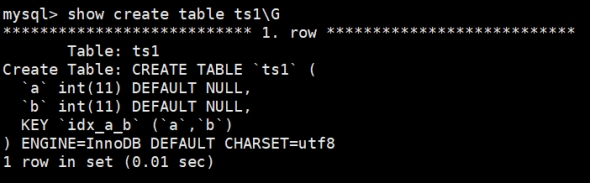

# 索引

## 1. 索引概述

### 1.1 为什么需要索引？

在数据库的世界里，索引就像是一张精心制作的地图，能够帮助我们快速定位到所需的数据。想象一下，你身处一个巨大的图书馆，里面藏书数百万册。如果没有索引，想要找到某一本特定的书，你可能需要逐架逐本地翻阅，耗费大量的时间和精力。但如果有了索引，你只需要根据书名、作者或者分类等信息，就能迅速定位到书籍所在的位置，大大提高了查找效率。数据库中的索引也是如此，它通过特定的数据结构，将数据进行有序排列，使得数据库在执行查询操作时，能够避免全表扫描，直接定位到符合条件的数据行，从而极大地提高了查询速度。

总的来说索引是数据库中用于加速数据检索的一种数据结构。

### 1.2 索引的作用

**加速查询**：索引最主要的作用就是加速查询。以 MySQL 常用的 B + 树索引为例，B + 树是一种平衡多路查找树，所有叶子节点都在同一层，且叶子节点之间通过链表连接 。当我们执行查询语句时，数据库可以利用 B + 树的结构，从根节点开始，通过比较索引值，快速地向下遍历树结构，定位到包含目标数据的叶子节点，从而大大减少了磁盘 I/O 次数，提高了查询性能。比如在一个存储用户信息的表中，如果我们经常根据用户 ID 查询用户信息，为用户 ID 列创建索引后，查询速度会得到显著提升。

**强制唯一性**：主键索引和唯一索引可以确保数据的唯一性和完整性。主键索引是一种特殊的唯一索引，每个表只能有一个主键，主键列的值不能重复且不能为空 。唯一索引则保证索引列的值在表中是唯一的，但可以包含多个 NULL 值。例如，在用户表中，我们可以将用户 ID 设置为主键索引，确保每个用户都有唯一的标识；同时，为邮箱列创建唯一索引，保证每个用户的邮箱地址是唯一的，这样可以有效避免数据的重复插入，维护数据的质量。

**优化排序与分组**：当我们对数据进行排序（ORDER BY）或分组（GROUP BY）操作时，如果相关列上有索引，数据库可以直接利用索引的有序性，减少内存排序的开销，从而提高操作效率 。例如，在统计每个部门的员工人数时，如果按照部门 ID 进行分组，为部门 ID 列创建索引后，分组操作会更加高效。

### 1.3 索引的代价

索引如此强大，但并不是没有任何代价的，主要代价如下：

**存储空间**：索引需要占用额外的存储空间。

**写操作性能**：索引会降低插入、更新和删除操作的性能，因为每次写操作都需要更新索引。

## 2. 索引分类

MySQL可以按照四个角度来分类索引。

+ 按「数据结构」分类：**B+tree索引、Hash索引、Full-text索引**。
+ 按「物理存储」分类：**聚簇索引（主键索引）、二级索引（辅助索引）**。
+ 按「字段特性」分类：**主键索引、唯一索引、普通索引、前缀索引**。
+ 按「字段个数」分类：**单列索引、联合索引**。

接下来，按照这些角度来说说各类索引的特点。

### 2.1 按数据结构分类

从数据结构的角度来看，MySQL 常见索引有 B+Tree 索引、HASH 索引、Full-Text 索引。

每一种存储引擎支持的索引类型不一定相同，我在表中总结了 MySQL 常见的存储引擎 InnoDB、MyISAM 和 Memory 分别支持的索引类型。

| 索引类型      | InnoDB引擎 | MyISAM引擎 | Memory引擎 |
| ------------- | ---------- | ---------- | ---------- |
| B+Tree索引    | Yes        | Yes        | Yes        |
| HASH索引      | No         | No         | Yes        |
| Full-Text索引 | Yes        | Yes        | No         |

注意，关于InnoDB引擎支不支持哈希索引，有很多争论，其实确切的说法应该如下：

（1）**InnoDB 用户无法手动创建哈希索引**，这一层上说，InnoDB 确实不支持哈希索引；

（2）InnoDB 会自调优 (self-tuning)，如果判定建立自适应哈希索引 (Adaptive Hash Index, AHI)，能够提升查询效率，**InnoDB 自己会建立相关哈希索引**，这一层上说，InnoDB 又是支持哈希索引的；

全文索引(也称全文检索)是目前搜索引擎使用的一种关键技术。它能够利用【分词技术】等多种算法智能分析出文本文字中关键词的频率和重要性，然后按照一定的算法规则智能地筛选出我们想要的搜索结果。全文索引非常适合大型数据集，对于小的数据集，它的用处比较小。

随着大数据时代的到来，关系型数据库应对全文索引的需求已力不从心，逐渐被solr、ElasticSearch等专门的搜索引擎所替代。

### 2.2 按物理存储分类

从物理存储的角度来看，索引分为**聚簇索引（主键索引）、二级索引（辅助索引**）。

#### 聚簇索引

聚簇索引（**Clustered Index**）它指的是**数据与索引存储在一起**的索引结构，索引的叶子节点直接保存整行数据，因此查询时无需再通过指针或主键回表获取数据。

**注意：**

- 每张表**只能有一个**聚簇索引，因为数据物理上只能按一种顺序存储。
- 在 **InnoDB** 中，主键索引就是聚簇索引；如果没有主键，会选择一个唯一非空索引作为聚簇索引；若都没有，则自动生成隐藏 *row_id* 作为聚簇索引。
- **MyISAM** 引擎不支持聚簇索引，其索引与数据分开存储。

#### 非聚簇索引(二级索引)

除了聚簇索引之外的其它索引都属于辅助索引（**Secondary Index**），也被称为二级索引或非聚簇索引。创建的主键索引和二级索引默认使用的是 B+Tree 索引。

#### 适用场景

**聚簇索引**：适合主键查询、范围查询、排序，因为数据物理上有序，I/O 连续且高效。

**非聚簇索引**：适合按非主键列查询，通过覆盖索引可避免回表，提高性能。

在 MySQL InnoDB 中，主键索引默认就是聚簇（聚集）索引，数据与索引紧密绑定，查询效率高，但插入和更新需要维护数据顺序，成本相对较高。

因此，一张表可以有多个非聚簇索引，但只能有一个聚簇索引。

### 2.3 按字段特性分类

从字段特性的角度来看，索引分为**主键索引、唯一索引、普通索引、前缀索引。**

#### 主键索引

主键索引就是建立在主键字段上的索引，通常在创建表的时候一起创建，一张表最多只有一个主键索引，索引列的值不允许有空值。

#### 唯一索引

唯一索引建立在 UNIQUE 字段上的索引，一张表可以有多个唯一索引，索引列的值必须唯一，但是允许有空值。

#### 普通索引

普通索引就是建立在普通字段上的索引，既不要求字段为主键，也不要求字段为 UNIQUE。

#### 前缀索引

前缀索引是指对字符类型字段的前几个字符建立的索引，而不是在整个字段上建立的索引，前缀索引可以建立在字段类型为 char、 varchar、binary、varbinary 的列上。

使用前缀索引的目的是为了减少索引占用的存储空间，提升查询效率。

### 2.4 按字段个数分类

从字段个数的角度来看，索引分为单列索引、联合索引（复合索引）。

- 建立在单列上的索引称为单列索引，比如主键索引；
- 建立在多列上的索引称为联合索引；

通过将多个字段组合成一个索引，该索引就被称为联合索引。

### 2.5 最左匹配原则

#### 最左匹配原则的定义‌

最左匹配原则是指在联合索引中，查询条件必须从索引的最左端开始，按照索引列的顺序依次匹配。如果查询条件没有从最左端开始，或者中间有列未匹配，索引将无法完全生效或部分失效。

#### 联合索引的结构与匹配过程

联合索引的底层是B+树，其节点按照索引列的顺序存储数据。例如，联合索引(a, b, c)的B+树会先按a排序，a相同的情况下按b排序，b相同的情况下再按c排序。查询时，数据库会依次匹配a、b、c，如果某列未匹配，后续列的索引将无法使用。

#### 最左匹配原则的应用场景

‌完全匹配‌：查询条件包含联合索引的所有列，且顺序一致。例如，索引(a, b, c)的查询WHERE a=1 AND b=2 AND c=3会完全利用索引。
‌部分匹配‌：查询条件从最左端开始，但未包含所有列。例如，WHERE a=1 AND b=2会利用索引的前两列，而WHERE a=1 AND c=3只能利用a列，c列无法通过索引加速。

‌范围查询‌：如果查询条件中包含范围查询（如>、<、BETWEEN），范围查询之后的列将无法使用索引。例如，WHERE a=1 AND b>2 AND c=3只能利用a和b列，c列无法通过索引加速。

## 3. 索引的创建与使用

### 3. 1 查看索引

查看MySQL索引的方法有多种，以下是几种常用的方法。

#### 使用SHOW INDEX

`SHOW INDEX`命令是查看MySQL数据库中表索引的最直接和常用的方法。它可以获取表中所有索引的详细信息，包括索引的名称、类型、列名、唯一性等。

```sql
SHOW INDEX FROM emp;
```

执行上述命令后，MySQL将返回一个结果集，其中包含表中所有索引的详细信息。


以下是 `SHOW INDEX` 命令输出字段含义的表格形式总结：

| 字段名            | 含义                           | 示例值解释                         |
| :---------------- | :----------------------------- | :--------------------------------- |
| **Table**         | 索引所属的表名                 | `emp`：表示这是 emp 表的索引       |
| **Non_unique**    | 索引是否允许重复值             | `0`：唯一索引（不允许重复值）      |
| **Key_name**      | 索引的名称                     | `PRIMARY`：主键索引                |
| **Seq_in_index**  | 索引中列的序号（从1开始）      | `1`：该索引只包含一列              |
| **Column_name**   | 索引涉及的列名                 | `empno`：索引建立在 empno 列上     |
| **Collation**     | 列在索引中的排序方式           | `A`：升序（ASC）                   |
| **Cardinality**   | 索引中唯一值数量的估计值       | `19`：估计有19个不同的 empno 值    |
| **Sub_part**      | 索引前缀长度                   | `NULL`：整个列被索引，不是部分索引 |
| **Packed**        | 索引是否被压缩                 | `NULL`：未压缩                     |
| **Null**          | 索引列是否允许 NULL 值         | 空字符串：不允许 NULL 值           |
| **Index_type**    | 索引的数据结构类型             | `BTREE`：使用 B+ 树结构            |
| **Comment**       | 索引的注释信息（创建时可添加） | 空：无注释                         |
| **Index_comment** | 索引的额外注释                 | 空：无注释                         |
| **Visible**       | 索引对优化器是否可见           | `YES`：优化器会考虑此索引          |
| **Expression**    | 索引是否基于表达式             | `NULL`：基于列本身，不是表达式索引 |

#### 使用EXPLAIN命令

`EXPLAIN`命令主要用于分析查询的执行计划，但它也可以用来查看查询中使用的索引。通过*EXPLAIN*命令，我们可以了解查询优化器选择了哪些索引，以及这些索引在查询中是如何被使用的。

```sql
EXPLAIN SELECT * FROM emp WHERE empno = 7369;
```

执行上述命令后，MySQL将返回一个结果集，其中包含查询执行计划的详细信息。

关于EXPLAN结果，我们后面再介绍！！！

#### 使用INFORMATION_SCHEMA数据库

`INFORMATION_SCHEMA`是MySQL的系统数据库，包含了关于数据库对象（如表、列、索引等）的元数据。通过查询`INFORMATION_SCHEMA`数据库中的相关表，可以获取数据库中所有索引的详细信息。

```sql
SELECT * FROM INFORMATION_SCHEMA.STATISTICS WHERE TABLE_SCHEMA = 'hdy' AND TABLE_NAME = 'emp';
```

执行上述查询后，MySQL将返回一个结果集，其中包含表中所有索引的详细信息。

这些方法各有优缺点，选择合适的方法可以帮助我们高效地查看和管理数据库索引。

### 3. 2 普通索引

普通索引是最常见的索引类型，用于加速对表中数据的查询。

#### 创建索引（CREATE INDEX）

使用 **CREATE INDEX** 语句可以创建普通索引，语法如下：

```sql
CREATE INDEX index_name
ON table_name (column1 [ASC|DESC], column2 [ASC|DESC], ...);
```

- `CREATE INDEX`: 用于创建普通索引的关键字。
- `index_name`: 指定要创建的索引的名称。索引名称在表中必须是唯一的。
- `table_name`: 指定要在哪个表上创建索引。
- `(column1, column2, ...)`: 指定要索引的表列名。你可以指定一个或多个列作为索引的组合。这些列的数据类型通常是数值、文本或日期。
- `ASC`和`DESC`（可选）: 用于指定索引的排序顺序。默认情况下，索引以升序（ASC）排序。

#### 添加索引（ALTER TABLE）

我们可以使用 **ALTER TABLE** 命令可以在已有的表中创建索引。ALTER TABLE 允许你修改表的结构，包括添加、修改或删除索引。

语法如下：

```sql
ALTER TABLE table_name
ADD INDEX index_name (column1 [ASC|DESC], column2 [ASC|DESC], ...);
```

#### 创建表时直接指定索引

们可以在创建表的时候，你可以在 **CREATE TABLE** 语句中直接指定索引，以创建表和索引的组合。

语法如下：

```sql
CREATE TABLE table_name (
  column1 data_type,
  column2 data_type,
  ...,
  INDEX index_name (column1 [ASC|DESC], column2 [ASC|DESC], ...)
);
```

### 3. 3 唯一索引

唯一索引确保索引中的值是唯一的，不允许有重复值。

#### 创建索引（CREATE INDEX）

使用 **CREATE INDEX** 语句可以创建普通索引，语法如下：

```sql
CREATE UNIQUE INDEX index_name
ON table_name (column1 [ASC|DESC], column2 [ASC|DESC], ...);
```

#### 添加索引（ALTE TABLE）

我们可以使用 **ALTER TABLE** 命令可以在已有的表中创建索引。ALTER TABLE 允许你修改表的结构，包括添加、修改或删除索引。

语法如下：

```sql
ALTER TABLE table_name
ADD UNIQUE idx_name(column1 [ASC|DESC], column2 [ASC|DESC], ...);
```

#### 创建表时直接指定索引

们可以在创建表的时候，你可以在 **CREATE TABLE** 语句中直接指定索引，以创建表和索引的组合。

语法如下：

```sql
CREATE TABLE table_name (
  column1 data_type,
  column2 data_type,
  ...,
  UNIQUE idx_name(column1 [ASC|DESC], column2 [ASC|DESC], ...)
);
```

### 3. 4 删除索引

有两种方法来删除索引：

#### 使用ALTER TABLE

这是最常用的方法，适用于普通索引、唯一索引和复合索引。

**步骤：**

- **查看现有索引** 在删除前，使用以下命令确认索引名称：

```sql
SHOW INDEX FROM table_name;
```

+ **删除指定索引** 使用 *ALTER TABLE* 删除索引：

```sql
ALTER TABLE table_name DROP INDEX index_name;
```

- **验证结果** 再次查看表的索引，确认是否已成功删除：

```sql
SHOW INDEX FROM table_name;
```

#### 使用DROP INDEX

此方法功能与 `ALTER TABLE` 相同，但语法略有不同。

**步骤：**

- **执行删除命令** 使用以下语法直接删除索引：

```sql
DROP INDEX index_name ON table_name;
```

- **验证结果** 确认索引已被成功移除：

```sql
SHOW INDEX FROM table_name;
```

> 删除表中的列时，如果要删除的列为索引的组成部分，则该列也会从索引中删除。如果组成索引的所有列都被删除，则整个索引将被删除。


### 3. 5 创建索引案例

举例：

```mysql
CREATE DATABASE db_test;
USE db_test;
-- 部门表
CREATE TABLE dept(
	dept_id INT PRIMARY KEY AUTO_INCREMENT,
	dname VARCHAR(20)
);

-- 员工表
CREATE TABLE emp(
	emp_id INT PRIMARY KEY AUTO_INCREMENT,
	ename VARCHAR(20) UNIQUE, 
	dept_id INT,
	CONSTRAINT emp_dept_id_fk FOREIGN KEY(dept_id) REFERENCES dept(dept_id)
);

-- 查看索引
SHOW INDEX FROM emp;
```

隐式创建索引，在声明有主键约束、唯一性约束、外键约束的字段上，会自动添加相关的索引。

但是，如果显式创建表时创建索引的话，基本语法格式如下：

```mysql
CREATE TABLE table_name (
    col_name data_type,...
	[UNIQUE | FULLTEXT | SPATIAL] [INDEX | KEY] [index_name] (col_name [length]) [ASC | DESC]
    )
```

+ UNIQUE 、 FULLTEXT 和 SPATIAL 为可选参数，分别表示唯一索引、全文索引和空间索引；

+ INDEX 与 KEY 为同义词，两者的作用相同，用来指定创建索引；

+ index_name 指定索引的名称，为可选参数，如果不指定，那么MySQL默认col_name为索引名；

+ col_name 为需要创建索引的字段列，该列必须从数据表中定义的多个列中选择； length 为可选参数，表示索引的长度，只有字符串类型的字段才能指定索引长度； ASC 或 DESC 指定升序或者降序的索引值存储。

#### **1.** **创建普通索引**

在book表中的year_publication字段上建立普通索引，SQL语句如下：

```mysql
CREATE TABLE book(
	book_id INT , 
    book_name VARCHAR(100), 
    authors VARCHAR(100), 
    info VARCHAR(100) ,
	comment VARCHAR(100), 
    year_publication YEAR,	-- 出版年 
    -- 声明索引
    INDEX(year_publication)
);
```

#### **2.** **创建唯一索引**

举例：

```mysql
CREATE TABLE tb_test1( 
    id INT NOT NULL,
    name varchar(30) NOT NULL, 
    UNIQUE INDEX uk_idx_id(id)
);
```

该语句执行完毕之后，使用SHOW CREATE TABLE查看表结构：

```mysql
SHOW INDEX FROM tb_test1 \G
```

#### **3.** **主键索引**

```mysql
CREATE TABLE student (
	id INT(10) UNSIGNED,
	student_no VARCHAR(200), 
    student_name VARCHAR(200), 
    PRIMARY KEY(id)
);
```

设定为主键后数据库会自动建立索引，innodb为聚簇索引，语法： 随表一起建索引：

删除主键索引：

```mysql
ALTER TABLE student drop PRIMARY KEY ;
```

修改主键索引：必须先删除掉(drop)原索引，再新建(add)索引

#### **4.** **创建单列索引**

举例：

```mysql
CREATE TABLE tb_est2(
    id INT NOT NULL, 
    name CHAR(50) NULL,
	INDEX single_idx_name(name(20))
);
```

该语句执行完毕之后，使用SHOW CREATE TABLE查看表结构：

```mysql
SHOW INDEX FROM tb_test2 \G
```

#### **5.** **创建组合索引**

举例：创建表test3，在表中的id、name和age字段上建立组合索引，SQL语句如下：

```mysql
CREATE TABLE tb_test3( 
   id INT(11) NOT NULL,
   name CHAR(30) NOT NULL, 
   age INT(11) NOT NULL, 
   info VARCHAR(255),
   INDEX multi_idx(id,name,age)
);
```

该语句执行完毕之后，使用SHOW INDEX 查看：

```mysql
SHOW INDEX FROM tb_test3 \G
```

由结果可以看到，id、name和age字段上已经成功建立了一个名为multi_idx的组合索引。

组合索引可起几个索引的作用，但是使用时并不是随便查询哪个字段都可以使用索引，而是遵从“最左前缀”原则。例如，索引可以搜索的字段组合为：（id, name, age） 、 （id, name）或者id。而（age）或者（name,age）组合不能使用索引查询。

在test3表中，查询id和name字段，使用EXPLAIN语句查看索引的使用情况：

```mysql
EXPLAIN SELECT * FROM tb_test3 WHERE id=100 AND name= 'maye';

+----+-------------+-------+------------+------+---------------+-----------+
| id | select_type | table | partitions | type | possible_keys | key       |
+----+-------------+-------+------------+------+---------------+-----------+
|  1 | SIMPLE      | test3 | NULL       | ref  | multi_idx     | multi_idx |
+----+-------------+-------+------------+------+---------------+-----------+
1 row in set, 1 warning (0.00 sec)
```

可以看到，查询id和name字段时，使用了名称为Multildx的索引，如果查询(name,age)组合或者单独查询name和age字段，会发现结果中possible_keys和key值为NULL，并没有使用在t3表中创建的索引进行查询。

```mysql
EXPLAIN SELECT * FROM teb_test3 WHERE `name`='maye' ;

+----+-------------+-------+------------+------+---------------+------+
| id | select_type | table | partitions | type | possible_keys | key  |
+----+-------------+-------+------------+------+---------------+------+
|  1 | SIMPLE      | test3 | NULL       | ALL  | NULL          | NULL |
+----+-------------+-------+------------+------+---------------+------+
1 row in set, 1 warning (0.00 sec)
```


#### **6.** **创建全文索引**

FULLTEXT全文索引可以用于全文搜索，并且只能为CHAR、VARCHAR和TEXT列创建索引。

举例1：创建表tb_test4，在表中的info字段上建立全文索引，SQL语句如下：

```mysql
CREATE TABLE tb_test4(
    id INT NOT NULL,
    name CHAR(30) NOT NULL, 
    age INT NOT NULL,
    info VARCHAR(255),
    FULLTEXT INDEX futxt_idx_info(info)
);
```

举例2：创建了一个给title和body字段添加全文索引的表。

```mysql
CREATE TABLE articles (
    id INT UNSIGNED AUTO_INCREMENT PRIMARY KEY, 
    title VARCHAR (200),
    body TEXT,
    FULLTEXT index (title, body)
);
```

不同于like方式的的查询：

 ```mysql
EXPLAIN SELECT * FROM tb_test4 WHERE info LIKE '%hello%';
 ```

全文索引用match+against方式查询：

```mysql
EXPLAIN SELECT * FROM tb_test4 WHERE MATCH(info) AGAINST('hello%');

EXPLAIN SELECT * FROM articles WHERE MATCH(title,body) AGAINST('hello%');
```

> 注意点
>
> 1. 使用全文索引前，搞清楚版本支持情况；
>
> 2. 全文索引比 like + % 快 N 倍（10倍以上），但是可能存在精度问题；
>
> 3. 如果需要全文索引的是大量数据，建议先添加数据，再创建索引。 

#### **7.** **创建空间索引**

空间索引创建中，要求空间类型的字段必须为 非空 。

举例：创建表test5，在空间类型为GEOMETRY的字段上创建空间索引，SQL语句如下：

```mysql
CREATE TABLE tb_test5( 
    geo GEOMETRY NOT NULL,
	SPATIAL INDEX spa_idx_geo(geo)
);
```

该语句执行完毕之后，使用SHOW CREATE TABLE查看表结构:

```mysql
SHOW INDEX FROM tb_test5;
```


可以看到，tb_test5表的geo字段上创建了名称为spa_idx_geo的空间索引。

## 4. MySQL8.0 索引新特性

### **4.1** 支持降序索引

降序索引以降序存储键值。虽然在语法上，从MySQL4版本开始就已经支持降序索引的语法了，但实际上该DESC定义是被忽略的，直到MysQL 8.x版本才开始真正支持降序索引(仅限于InnoDB存储引擎)。

MysQL在**8.0版本之前创建的仍然是升序索引，使用时进行反向扫描，这大大降低了数据库的效率**。在某些场景下，降序索引意义重大。例如，如果一个查询，需要对多个列进行排序，且顺序要求不一致，那么使用降序索引将会避免数据库使用额外的文件排序操作，从而提高性能。

举例：分别创建两个表ts1、ts2，ts1不创建降序索引，ts2创建降序索引，结果如下：

```mysql
-- 测试没有降序索引的情况
CREATE TABLE ts1(	
    a INT,
		b INT,
		INDEX idx_a_b(a,b)
		);


-- 测试有降序索引的情况
CREATE TABLE ts2(	
    a INT,
		b INT,
		INDEX idx_a_b(a,b DESC)
		);
```

查看数据表ts1的结构，结果如下：

 

从结果可以看出，索引仍然是默认的升序。

查看数据表ts2的结构，结果如下：

 

从结果可以看出，索引已经是降序了。下面继续测试降序索引在执行计划中的表现。

在两表中分别插入800条随机数据，执行语句如下：

```mysql
DELIMITER //
CREATE PROCEDURE ts1_insert() 
BEGIN
	DECLARE i INT DEFAULT 1; 	 -- 变量要定义在最开始
	START TRANSACTION;			 -- 开始事务要放在定义变量之后
	WHILE i <= 800 DO
		INSERT INTO ts1 SELECT RAND()*80000,RAND()*80000; 
		SET i = i + 1;
	END WHILE;
	COMMIT; 
END //
DELIMITER ;

#调用
CALL ts1_insert();
```

**查看数据表ts1的执行计划。**

```mysql
EXPLAIN SELECT * FROM ts1 ORDER BY a,b DESC LIMIT 5;
```

结果如下：


从结果可以看出，执行计划中扫描数为800，而且使用了Using filesort。

> 提示 Using  filesort是MySQL中一种速度比较慢的外部排序，能避免是最好的。多数情况下，管理员可以通过优化索引来尽量避免出现Using filesort，从而提高数据库执行速度。

**查看数据表ts2的执行计划。**

```mysql
EXPLAIN SELECT * FROM ts2 ORDER BY a,b DESC LIMIT 5;
```

结果如下。


从结果可以看出，执行计划中扫描数为5，而且没有使用Using filesort。

> 注意：降序索引只对查询中特定的排序顺序有效，如果使用不当，反而查询效率更低。例如，上述查询排序条件改为order by a desc, b desc，ts1表的执行计划要明显好于ts2。

将排序条件修改为order by a desc, b desc后，下面来对比ts1和ts2的效果。 查看数据表ts1的执行计划，结果如下：

```mysql
EXPLAIN SELECT * FROM ts1 ORDER BY a DESC,b DESC LIMIT 5;
```

ts1、ts2结果分别如下：

<center>ts1</center>


<center>ts2</center>


从结果可以看出，修改后ts1的执行计划要明显好于ts2。

### 4.2 隐藏索引

在MySQL  5.7版本及之前，只能通过显式的方式删除索引。此时，如果发现删除索引后出现错误，又只能通过显式创建索引的方式将删除的索引创建回来。如果数据表中的数据量非常大，或者数据表本身比较  大，这种操作就会消耗系统过多的资源，操作成本非常高。

从MySQL 8.x开始支持 隐藏索引（invisible indexes） ，只需要将待删除的索引设置为隐藏索引，使查询优化器不再使用这个索引（即使使用force index（强制使用索引），优化器也不会使用该索引）， 确认将索引设置为隐藏索引后系统不受任何响应，就可以彻底删除索引。这种通过先将索引设置为隐藏索引，再删除索引的方式就是软删除 。

同时，如果你想验证某个索引|删除之后的**查询性能影响**，就可以暂时先隐藏该索引。

索引默认是可见的，在使用CREATE TABLE，CREATE INDEX或者ALTER TABLE等语句时可以通过VISIBLE或者
INVISIBLE关键词设置索引的可见性。

**1.** **创建表时直接创建** 在MySQL中创建隐藏索引通过SQL语句INVISIBLE来实现，其语法形式如下：

```mysql
CREATE TABLE tablename(
	...
	INDEX [indexname](fieldname [(length)]) INVISIBLE
);
```

上述语句比普通索引多了一个关键字INVISIBLE，用来标记索引为不可见索引。

**2.** **在已经存在的表上创建**

可以为已经存在的表设置隐藏索引，其语法形式如下：

```mysql
CREATE INDEX indexname
ON tablename(fieldname[(length)]) INVISIBLE;
```

**3.** **通过ALTER TABLE语句创建**

语法形式如下：

 ```mysql
ALTER TABLE tablename
ADD INDEX indexname (fieldname [(length)]) INVISIBLE;
 ```

**4.** **切换索引可见状态** 已存在的索引可通过如下语句切换可见状态：

```mysql
ALTER TABLE tablename ALTER INDEX index_name INVISIBLE; #切换成隐藏索引
ALTER TABLE tablename ALTER INDEX index_name VISIBLE; #切换成非隐藏索引
```

如果将index_cname索引切换成可见状态，通过explain查看执行计划，发现优化器选择了index_cname索   引。

> 注意  当索引被隐藏时，它的内容仍然是和正常索引一样实时更新的。如果一个索引需要长期被隐藏，那么可以将其删除，因为索引的存在会影响插入、更新和删除的性能。

通过设置隐藏索引的可见性可以查看索引对调优的帮助。

**5.** **使隐藏索引对查询优化器可见**

在MySQL 8.x版本中，为索引提供了一种新的测试方式，可以通过查询优化器的一个开关（use_invisible_indexes）来打开某个设置，使隐藏索引对查询优化器可见。如果 use_invisible_indexes 设置为off(默认)，优化器会忽略隐藏索引。如果设置为on，即使隐藏索引不可见，优化器在生成执行划时仍会考虑使用隐藏索引。

（1） 在MySQL命令行执行如下命令查看查询优化器的开关设置。

```mysql
mysql> select @@optimizer_switch \G
```

在输出的结果信息中找到如下属性配置。

 ```mysql
use_invisible_indexes=off
 ```

此属性配置值为off，说明隐藏索引默认对查询优化器不可见。

（2） 使隐藏索引对查询优化器可见，需要在MySQL命令行执行如下命令： 

```mysql
mysql> set session optimizer_switch="use_invisible_indexes=on"; 
Query OK, 0 rows affected (0.00 sec)
```

SQL语句执行成功，再次查看查询优化器的开关设置。

```mysql
mysql> select @@optimizer_switch \G
*************************** 1. row *************************** @@optimizer_switch: index_merge=on,index_merge_union=on,index_merge_sort_union=on,index_merge_intersection=on,engine_condition_pushdown=on,index_condition_pushdown=on,mrr=on,mrr_cost_based=on,block_nested_loop=on,batched_key_access=off,materialization=on,semijoin=on,loosescan=on,firstmatch=on,duplicateweedout=on,subquery_materialization_cost_based=on,use_index_extensions=on,condition_fanout_filter=on,derived_merge=on,use_invisible_indexes=on,skip_scan=on,hash_join=on,subquery_to_derived=off,prefer_ordering_index=on,hypergraph_optimizer=off,derived_condition_pushdown=on,hash_set_operations=on
1 row in set (0.00 sec)
```

此时，在输出结果中可以看到如下属性配置。

 ```mysql
use_invisible_indexes=on
 ```

use_invisible_indexes属性的值为on，说明此时隐藏索引对查询优化器可见。

（3） 使用EXPLAIN查看以字段invisible_column作为查询条件时的索引使用情况。

```mysql
explain select * from classes where cname = '高一2班';
```

查询优化器会使用隐藏索引来查询数据。

（4） 如果需要使隐藏索引对查询优化器不可见，则只需要执行如下命令即可。

```mysql
mysql> set session optimizer_switch="use_invisible_indexes=off"; 
Query OK, 0 rows affected (0.00 sec)
```

再次查看查询优化器的开关设置。 

```mysql
mysql> select @@optimizer_switch \G
```

此时，use_invisible_indexes属性的值已经被设置为“off”。

## **5.** 索引的设计原则

为了使索引的使用效率更高，在创建索引时，必须考虑在哪些字段上创建索引和创建什么类型的索引。**索引设计不合理或者缺少索引都会对数据库和应用程序的性能造成障碍**。高效的索引对于获得良好的性能非常重要。设计索引时，应该考虑相应准则。

### **5.1** 数据准备

#### **第1步：创建数据库、创建表**

```mysql
DROP DATABASE IF EXISTS db_hdy;
CREATE DATABASE db_hdy; 
USE db_hdy;

-- 学生表
CREATE TABLE `student_info` (
	`id` INT(11)  AUTO_INCREMENT,
	`student_id` INT NOT NULL ,
	`name` VARCHAR(20) DEFAULT NULL,
	`course_id` INT NOT NULL ,
	`class_id` INT(11) DEFAULT NULL,
	`create_time` DATETIME DEFAULT CURRENT_TIMESTAMP ON UPDATE CURRENT_TIMESTAMP, 
  PRIMARY KEY (`id`)
) ENGINE=INNODB AUTO_INCREMENT=1 DEFAULT CHARSET=utf8 COMMENT '学生表';

-- 课程表
CREATE TABLE `course` (
	`id` INT(11) NOT NULL AUTO_INCREMENT,
	`course_id` INT NOT NULL ,
	`course_name` VARCHAR(40) DEFAULT NULL, 
  PRIMARY KEY (`id`)
) ENGINE=INNODB AUTO_INCREMENT=1 DEFAULT CHARSET=utf8 COMMENT '课程表';
```

#### **第2步：创建模拟数据必需的存储函数**

```mysql
#函数1：创建随机产生字符串函数
DELIMITER //
CREATE FUNCTION rand_string(n INT)
RETURNS VARCHAR(255) #该函数会返回一个字符串
COMMENT '随机生成字符串数函数'
READS SQL DATA
BEGIN
	DECLARE chars_str VARCHAR(100) DEFAULT'abcdefghijklmnopqrstuvwxyzABCDEFJHIJKLMNOPQRSTUVWXYZ'; 
	DECLARE return_str VARCHAR(255) DEFAULT '';
	DECLARE i INT DEFAULT 0; 
	WHILE i < n DO
		SET return_str =CONCAT(return_str,SUBSTRING(chars_str,FLOOR(1+RAND()*52),1)); 			
		SET i = i + 1;
	END WHILE;
	RETURN return_str; 
END //
DELIMITER ;

#函数2：创建随机数函数
DELIMITER //
CREATE FUNCTION rand_num (from_num INT ,to_num INT) 
RETURNS INT(11) 
COMMENT '随机生成数字串数函数'
BEGIN
	DECLARE i INT DEFAULT 0;
	SET i = FLOOR(from_num +RAND()*(to_num - from_num+1)); 
	RETURN i;
END // 
DELIMITER ;
```

创建函数，假如报错：

 ```mysql
This function has none of DETERMINISTIC......
 ```

设置一下`log_bin_trust_function_creators`变量的值为`1`即可！查看mysql是否允许创建函数：

```mysql
show variables like 'log_bin_trust_function_creators';
```

命令开启：允许创建函数设置：

```mysql
set global log_bin_trust_function_creators=1;	
```

#### 第3步：创建插入模拟数据的存储过程

```mysql
# 存储过程1：创建插入课程表存储过程
DELIMITER //
CREATE PROCEDURE insert_course( max_num INT ) 
COMMENT '随机插入课程表存储过程'
BEGIN
	DECLARE i INT DEFAULT 0;
	SET autocommit = 0;	#设置手动提交事务
	REPEAT #循环
	SET i = i + 1; #赋值
	INSERT INTO course (course_id, course_name ) VALUES (rand_num(10000,10100),rand_string(6));
	UNTIL i = max_num
	END REPEAT;
	COMMIT; #提交事务
	END //
DELIMITER ;

# 存储过程2：创建插入学生信息表存储过程
DELIMITER //
CREATE PROCEDURE insert_stu( max_num INT ) 
COMMENT '随机插入学生信息表存储过程'
BEGIN
	DECLARE i INT DEFAULT 0;
	SET autocommit = 0;	#设置手动提交事务
	REPEAT #循环
	SET i = i + 1; #赋值
	INSERT INTO student_info (course_id, class_id ,student_id ,NAME ) VALUES (rand_num(10000,10100),rand_num(10000,10200),rand_num(1,200000),rand_string(6));
	UNTIL i = max_num END REPEAT;
	COMMIT; #提交事务
END // 
DELIMITER ;
```

#### 第4步：调用存储过程

```mysql
CALL insert_course(100);

CALL insert_stu(500000);		-- 50万条数据，时间稍微有点长，我用了 97.141s
```

### **5.2 哪些情况适合创建索引**

#### 1. 字段的数值有唯一性的限制

索引本身可以起到约束的作用，比如唯一索引、 主键索引都是可以起到唯一性约束的， 因此在我们的数据表中，如果某个字段是唯一性的， 就可以直接创建唯一性索引， 或者主键索引。这样可以更快速地通过该索引来确定某条记录。

例如，学生表中**学号**是具有唯一性的字段，为该字段建立唯一性索引可以很快确定某个学生的信息，如果使用姓名的话，可能存在同名现象，从而降低查询速度。

> 业务上具有唯一特性的字段，即使是组合字段，也必须建成唯一索引。（来源：Alibaba）
>
> 说明：不要以为唯一索引影响了 insert 速度，这个速度损耗可以忽略，但提高查找速度是明显的。 

#### **2.** 频繁作为 WHERE 查询条件的字段

某个字段在SELECT语句的 WHERE  条件中经常被使用到，那么就需要给这个字段创建索引了。尤其是在数据量大的情况下，创建普通索引就可以大幅提升数据查询的效率。

比如student_info数据表（含100万条数据），假设我们想要查询 student_id=123110 的用户信息。

如果没有对student_id字段创建索引，进行如下查询：

```mysql
SELECT course_id,class_id,create_time,student_id FROM student_info WHERE student_id = 123110;
> 查询时间: 0.220s
```

给`student_id`字段添加索引：

```mysql
ALTER TABLE student_info ADD INDEX idx_sid(student_id);
> 查询时间: 4.018s
```

对student_id字段创建索引后，进行查询：

```mysql
> 查询时间: 0.009s
```

根据结果可以看出，添加索引之后效率提高了很多`0.220/0.009=24.444`。

#### 3. 经常GROUPBY和ORDER BY 的列

索引就是让数据按照某种顺序进行存储或检索，因此当我们使用 GROUP BY 对数据进行分组查询，或者使用 ORDER BY 对数据进行排序的时候，就需要对分组或者排序的字段进行索引 。如果待排序的列有多个，那么可以在这些列上建立 组合索引 。

比如，按照`student_ id` 对学生选修的课程进行分组，显示不同的`student_id`和课程数量，显示100个即可。

现在`student_ id`有索引，执行下面的SQL语句，查看一下性能:

```mysql
SELECT student_id,COUNT(*) AS num FROM student_info GROUP BY student_id LIMIT 100000;
> 查询时间: 0.038s
```

当`student_id`没有索引时，执行语句：

```mysql
-- 先删除索引(隐藏索引也行)
ALTER TABLE student_info DROP INDEX idx_sid;
-- 隐藏索引
ALTER TABLE student_info ALTER INDEX idx_sid INVISIBLE;

-- 查询
SELECT student_id,COUNT(*) AS num FROM student_info GROUP BY student_id LIMIT 100000;
> 查询时间: 0.537s
```

可以看到没有索引和有索引查询效率真的是天差地别啊！！

**再测试GROUP BY和ORDER BY同时出现的情况：**

```mysql
SELECT student_id,COUNT(*) AS num FROM student_info 
GROUP BY student_id
ORDER BY create_time DESC
LIMIT 100;
```

如果报错，则需要设置一下sql_mode变量。

```mysql
SELECT @@sql_mode;
SET @@sql_mode='STRICT_TRANS_TABLES,NO_ZERO_IN_DATE,NO_ZERO_DATE,ERROR_FOR_DIVISION_BY_ZERO,NO_ENGINE_SUBSTITUTION'
```

先查看一下索引，如果student_id有索引，可以先删除或者隐藏！

```mysql
-- 查看索引
SHOW INDEX FROM student_info;
-- 隐藏索引
ALTER TABLE student_info ALTER INDEX idx_sid VISIBLE;
```

当student_id没有索引时，执行耗时为`0.664s`。

当student_id有索引时，执行耗时为`2.073s`。

为什么有索引，反而效率更低呢？因为使用索引需要全表扫描+回表：

- **额外I/O**：扫描索引后还需要回表读取数据
- **索引更分散**：索引的物理存储可能比表数据更分散，导致更多随机I/O
- **内存占用**：需要维护索引扫描和表数据的双重访问

接下来给`student_id`和`create_time`创建联合索引：

```sql
ALTER TABLE student_info ADD INDEX idx_sid_create_time(student_id,create_time DESC);
```

当`student_id`和`create_time`有联合索引时，执行耗时为`0.272s`。

#### 4. UPDATE、DELETE 的 WHERE 条件列

当我们对某条数据进行UPDATE或者DELETE操作的时候，是否也需要对WHERE的条件列创建索引呢?

我们先看一下对数据进行UPDATE的情况：我们想要把name为462eed7ac6e791292a79对应的student_id 修改为10002，当我们没有对name进行索引的时候，执行SQL语句:

```mysql
UPDATE student_info SET student_id = 10002
WHERE name='462eed7ac6e791292a79';
```

运行时间为`0.662s`。

你能看到效率不高，但如果我们对name字段创建了索引，然后执行类似的SQL语句：

```mysql
ALTER TABLE student_info ADD INDEX idx_name(name);

UPDATE student_info SET student_id = 10001
WHERE name='462eed7ac6e791292a79';
```

运行时间仅为`0.000s`，效率有了极大的提升。

对数据按照某个条件进行查询后再进行 UPDATE 或 DELETE 的操作，如果对 WHERE 字段创建了索引，就能大幅提升效率。原理是因为我们需要先根据 WHERE 条件列检索出来这条记录，然后再对它进行更新或删除。**如果进行更新的时候，更新的字段是非索引字段，提升的效率会更明显，这是因为非索引字段更**  **新不需要对索引进行维护。**

#### 5. DISTINCT字段需要创建索引

有时候我们需要对某个字段进行去重，使用  DISTINCT，那么对这个字段创建索引，也会提升查询效率。比如，我们想要查询课程表中不同的 student_id 都有哪些，如果我们没有对 student_id 创建索引，执行

SQL 语句：

```mysql
SELECT DISTINCT(student_id) FROM `student_info`;
```

运行结果（197449条记录，运行时间`0.430s`）。

如果我们对 student_id 创建索引，再执行 SQL 语句：

 ```mysql
SELECT DISTINCT(student_id) FROM `student_info`;
 ```

运行结果（197449条记录，运行时间`0.002s`）：

你能看到 SQL 查询效率有了提升，同时显示出来的 student_id 还是按照递增的顺序进行展示的。这是因为索引会对数据按照某种顺序进行排序，所以在去重的时候也会快很多。

#### 6. 多表 JOIN连接操作时，创建索引注意事项

首先， `连接表的数量尽量不要超过 3 张` ，因为每增加一张表就相当于增加了一次嵌套的循环，数量级增长会非常快，严重影响查询的效率。

其次， `对 WHERE 条件创建索引 `，因为 WHERE 才是对数据条件的过滤。如果在数据量非常大的情况下， 没有 WHERE 条件过滤是非常可怕的。

最后， `对用于连接的字段创建索引` ，并且该字段在多张表中的 类型必须一致 。比如 course_id 在student_info 表和 course 表中都为 int(11) 类型，而不能一个为 int 另一个为 varchar 类型。

举个例子，如果WHERE条件没有索引，执行 SQL 语句：

```mysql
SELECT c.course_id, name, si.student_id, course_name FROM student_info si JOIN course c
ON si.course_id = c.course_id WHERE name = 'wTdJmj';
```

运行结果（1 条数据，运行时间`0.207s`）。

这里我们对 name 创建索引，再执行上面的 SQL 语句，运行时间为`0.000s`。

```sql
ALTER TABLE student_info ALTER INDEX idx_name VISIBLE;
```

#### 7. 使用列的类型小的创建索引

我们这里所说的类型大小指的就是该类型表示的数据范围的大小。

我们在定义表结构的时候要显式的指定列的类型,以整数类型为例，有TINYINT、MEDIUMINT、 INT、BIGINT等,它们占用的存储空间依次递增，能表示的整数范围当然也是依次递增。如果我们想要对某个整数列建立索引的话，在表示的整数范围允许的情况下，尽量让索引列使用较小的类型,比如我们能使用INT就不要使用BIGINT,能使用MEDIUMINT就不要使用INT。这是因为:

+ 数据类型越小,在查询时进行的比较操作越快
+ 数据类型越小，索引占用的存储空间就越少,在一个数据页内就可以放下更多的记录，从而减少磁盘I/0带来的性能损耗，也就意味着可以把更多的数据页缓存在内存中，从而加快读写效率。

这个建议对于表的主键来说更加适用，因为不仅是聚簇索引中会存储主键值，其他所有的二级索引|的节点处都会存储一-份记录的主键值，如果主键使用更小的数据类型,也就意味着节省更多的存储空间和更高效的/0。

#### 8. 使用字符串前缀创建索引

创建一张商户表，因为地址字段比较长，在地址字段上建立前缀索引

```mysql
create table shop(
    address varchar(120) not null
);

alter table shop add index(address(12));
```

问题是，截取多少呢？截取得多了，达不到节省索引存储空间的目的；截取得少了，重复内容太多，字段的散列度(选择性)会降低。**怎么计算不同的长度的选择性呢？**

先看一下字段在全部数据中的选择度：

 ```mysql
select count(distinct address) / count(*) from shop;
 ```

通过不同长度去计算，与全表的选择性对比：

公式：

```mysql
count(distinct left(列名, 索引长度))/count(*)
```

例如： 

```mysql
select count(distinct left(address,10)) / count(*) as sub10, -- 截取前10个字符的选择度
count(distinct left(address,15)) / count(*) as sub11, -- 截取前15个字符的选择度
count(distinct left(address,20)) / count(*) as sub12, -- 截取前20个字符的选择度
count(distinct left(address,25)) / count(*) as sub13 -- 截取前25个字符的选择度
from shop;
```

**引申另一个问题：索引列前缀对排序的影响拓展**

如果使用了索引列前缀，比方说前边只把address列的前12个字符放到了二级索引中，下边这个查询可能就有点儿尴尬了：

```sql
SELECT * FROM shop
ORDER BY address
LIMIT 12;
```

因为二级索引中不包含完整的address列信息，所以无法对前12个字符相同，后边的字符不同的记录进行排序，也就是使用索引列前缀的方式**无法支持使用索引排序**，只能使用文件排序。


**拓展：阿里巴巴开发手册**

【 强制 】在 varchar 字段上建立索引时，必须指定索引长度，没必要对全字段建立索引，根据实际文本区分度决定索引长度。

说明：索引的长度与区分度是一对矛盾体，一般对字符串类型数据，长度为 20 的索引，区分度会高达90% 以上 ，可以使用 `count(distinct left(列名, 索引长度))/count(*)`的区分度来确定。

#### 9.  区分度高(散列性高)的列适合作为索引

**列的基数**指的是某一列中不重复数据的个数，比方说某个列包含值`2,5,8,2,5,8,2,5,8`，虽然有9条记录，但该列的基数却是3。也就是说，**在记录行数一定的情况下，列的基数越大，该列中的值越分散；列的基数越小，该列中的值越集中**。这个列的基数指标非常重要，直接影响我们是否能有效的利用索引。最好为列的基数大的列建立索引，为基数太小列的建立索引效果可能不好。

可以使用公式`select count(distinct a)/count(*) from t1`计算区分度，越接近1越好，一般超过33%就算是比较高效的索引了。

**拓展：联合索引把区分度高（散列性高）的列放在前面。**

#### 10. 使用最频繁的列放到联合索引的左侧

这样也可以较少的建立一些索引。同时，由于"最左前缀原则"，可以增加联合索引的使用率。

#### 11. 在多个字段都要创建索引的情况下，联合索引优于单值索引


### 5.3 限制索引的数目

在实际工作中，我们也需要注意平衡，索引的数目不是越多越好。我们需要限制每张表上的索引数量，建议单张表索引数量不超过6个。原因：

+ 每个索引都需要占用磁盘空间，索引越多，需要的磁盘空间就越大。
+ 索引会影响INSERT、DELETE、UPDATE等语句的性能，因为表中的数据更改的同时，索引也会进行调整和更新，会造成负担。
+ 优化器在选择如何优化查询时，会根据统计信息，对每一个可以用到的索引来进行评估，以生成出一个最好的执行计划，如果同时有很多个索引都可以用于查询，会增加MySQL优化器生成执行计划时间，降低查询性能。

### 5.4 哪些情况不适合创建索引

#### 1. 在where中使用不到的字段，不要设置索引

WHERE条件（包括GROUP BY、ORDER BY）里用不到的字段不需要创建索引，索引的价值是快速定位，如果起不到定位的字段通常是不需要创建索引的。

#### 2. 数据量小的表最好不要使用索引

如果表记录太少，比如少于1000个，那么是不需要创建索引的。表记录太少，是否创建索引对查询效率的影响并不大。甚至说，查询花费的时间可能比遍历索引的时间还要短，索引可能不会产生优化效果。

举例：创建表1：

 ```mysql
CREATE TABLE t_without_index(
	a INT PRIMARY KEY AUTO_INCREMENT, 
    b INT
);
 ```

提供存储过程1：

```mysql
#创建存储过程DELIMITER //
CREATE PROCEDURE t_wout_insert() 
BEGIN
	DECLARE i INT DEFAULT 1; 
	WHILE i <= 900 DO
		INSERT INTO t_without_index(b) SELECT RAND()*10000; 
		SET i = i + 1;
	END WHILE;
	COMMIT;
END // 
DELIMITER ;

#调用
CALL t_wout_insert();
```

创建表2：

```mysql
CREATE TABLE t_with_index(
a INT PRIMARY KEY AUTO_INCREMENT, b INT,
INDEX idx_b(b)
);
```

创建存储过程2：

```mysql
#创建存储过程DELIMITER //
CREATE PROCEDURE t_with_insert() 
BEGIN
	DECLARE i INT DEFAULT 1; WHILE i <= 900
	DO
		INSERT INTO t_with_index(b) SELECT RAND()*10000; 
		SET i = i + 1;
	END WHILE; 
	COMMIT;
END // DELIMITER ;

#调用
CALL t_with_insert();
```

查询对比：

```mysql
mysql> select * from t_without_index where b = 9879;
+------+------+
| a	| b	|
+------+------+
| 1242 | 9879 |
+------+------+
1 row in set (0.00 sec)

mysql> select * from t_with_index where b = 9879;
+-----+------+
| a	| b	|
+-----+------+
| 112 | 9879 |
+-----+------+
1 row in set (0.00 sec)
```

你能看到运行结果相同，但是在数据量不大的情况下，索引就发挥不出作用了。

> 结论：在数据表中的数据行数比较少的情况下，比如不到 1000 行，是不需要创建索引的。 

#### 3. 有大量重复数据的列上不要建立索引

在条件表达式中经常用到的不同值较多的列上建立索引，但字段中如果有大量重复数据，也不用创建索引。比如在学生表的“性别”字段上只有“男”与“女”两个不同值，因此无须建立索引。如果建立索引，不但不会提高查询效率，反而会严重降低数据更新速度。

**举例1：**要在 100 万行数据中查找其中的 50 万行（比如性别为男的数据），一旦创建了索引，你需要先访问 50 万次索引，然后再访问 50 万次数据表，这样加起来的开销比不使用索引可能还要大。

**举例2：**假设有一个学生表，学生总数为 100 万人，男性只有 10 个人，也就是占总人口的 10 万分之 1。

学生表 student_gender 结构如下。其中数据表中的 student_gender 字段取值为 0 或 1，0 代表女性，1 代表男性。

```mysql
CREATE TABLE student_gender( 
    student_id INT(11) NOT NULL, 
    student_name VARCHAR(50) NOT NULL, 
    student_gender TINYINT(1) NOT NULL, 
    PRIMARY KEY(student_id)
)ENGINE = INNODB;
```

如果我们要筛选出这个学生表中的男性，可以使用：

 ```mysql
SELECT * FROM student_gender WHERE student_gender = 1;
 ```

运行结果（10 条数据，运行时间`0.696`s）：


你能看到在未创建索引的情况下，运行的效率并不高。如果针对student_gender字段创建索引呢？

```sql
SELECT * FROM student_gender WHERE student_gender = 1;
```

同样是10条数据，运行结果相同，时间却缩短到了`0.052s`，大幅提升了查询的效率。

其实通过这两个实验你也能看出来，索引的价值是帮你快速定位。如果想要定位的数据有很多，那么索引就失去了它的使用价值，比如通常情况下的性别字段。

> 结论：当数据重复度大，比如高于10%的时候，也不需要对这个字段使用索引。

#### 4. 避免对经常更新的表创建过多的索引

 第一层含义：频繁更新的字段不一定要创建索引。因为更新数据的时候，也需要更新索引，如果索引太多，在更新索引的时候也会造成负担，从而影响效率。

第二层含义：避免对经常更新的表创建过多的索引，并且索引中的列尽可能少。此时，虽然提高了查询速度，同时却会降低更新表的速度。

#### 5. 删除不再使用或者很少使用的索引

 表中的数据被大量更新，或者数据的使用方式被改变后，原有的一些索引可能不再需要。数据库管理员应当定期找出这些索引，将它们删除，从而减少索引对更新操作的影响。

#### 6. 不要定义冗余或重复的索引

**① 冗余索引**

举例：建表语句如下

```mysql
CREATE TABLE person_info(
	id INT UNSIGNED NOT NULL AUTO_INCREMENT, 
    name VARCHAR(100) NOT NULL,
	birthday DATE NOT NULL, 
    phone_number CHAR(11) NOT NULL, 
    country varchar(100) NOT NULL, 
    PRIMARY KEY (id),
	KEY idx_name_birthday_phone_number (name(10), birthday, phone_number), 
    KEY idx_name (name(10))
);
```

我们知道，通过 idx_name_birthday_phone_number 索引就可以对 name 列进行快速搜索，再创建一个专门针对 name 列的索引就算是一个 冗余索引 ，维护这个索引只会增加维护的成本，并不会对搜索有什么好处。

**② 重复索引**

另一种情况，我们可能会对某个列 重复建立索引 ，比方说这样：

```mysql
CREATE TABLE repeat_index_demo ( 
    col1 INT PRIMARY KEY,
	col2 INT,
	UNIQUE uk_idx_c1 (col1), 
    INDEX idx_c1 (col1)
);
```

我们看到，col1  既是主键、又给它定义为一个唯一索引，还给它定义了一个普通索引，可是主键本身就会生成聚簇索引，所以定义的唯一索引和普通索引是重复的，这种情况要避免。