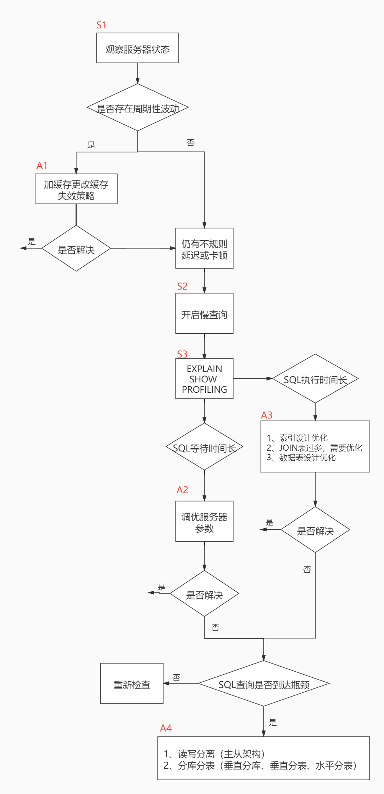

# 性能分析工具的使用

在数据库调优中，我们的目标就是`响应时间更快`，`吞吐量更大`。利用宏观的监控工具和微观的日志分析可以帮我们快速找到调优的思路和方式。

## 数据库服务器的优化步骤

当我们遇到数据库调优问题的时候，该如何思考呢？这里把思考的流程整理成下面这张图。

整个流程划分成了**观察（Show status）** 和 **行动（Action）**两个部分。字母 S 的部分代表观察（会使用相应的分析工具），字母 A 代表的部分是行动（对应分析可以采取的行动）。



调优成本与效果图：


## 查看服务器状态

在数据库运行时，监测其状态对性能调优和故障排除至关重要。SHOW STATUS 命令就是用来查看服务器状态的工具。SHOW STATUS 命令可以返回服务器的各种运行状态信息，包括线程、查询、表、缓存等的数量及其性能数据。通过这些状态信息，数据库管理员可以深入了解系统运行状况，以便于进行调优和维护。

在 MySQL 客户端中，你可以输入以下命令来查看服务器状态：

```sql
SHOW [GLOBAL|SESSION] STATUS [LIKE '参数'];
```

**其中：**

+ **[GLOBAL|SESSION]：**可选参数，用于查看全局或者回话级别的参数，不写默认会话级别；
+ **[LIKE '参数']：**可选参数，用于查看指定的参数状态，不写则查询所有。

### 常用的性能参数

+ Connections: 建立到 MySQL 服务器的连接总数。
+ Threads_created: 服务器创建的线程数量。
+ Threads_running: 当前运行的线程数量。
+ slow_queries：慢查询的次数。

+ Uptime：MySQL服务器上线时间(单位秒)。
+ Innodb_rows_read：SELECT查询返回的行数（服务器开启以来总数）。

+ Innodb_rows_inserted：执INSERT操作插入的总行数。
+ Innodb_rows_updated：执UPDATE操作插入的总行数。
+ Innodb_rows_deleted：执DELETED操作插入的总行数。

+ Com_select：查询操作次数。
+ Com_insert：插入操作次数。
+ Com_update：更新操作次数。
+ Com_delete：删除操作次数。

可以使用模糊查询，查看相关的指令：

```sql
SHOW STATUS LIKE 'Innodb_rows_%';
```

### 统计SQL查询成本

`last_query_cost` 是 MySQL 中的一个系统状态变量，用于显示 **服务器估算的上一条查询的执行成本**。

此变量的值是**估算值而非实际值**，基于统计信息（索引选择性、表大小等）的估算，**不是实际的执行时间或资源消耗**，单位是"随机数据页读取次数"。

仅对 `SELECT` 查询有效，且不适用于 `INSERT`、`UPDATE`、`DELETE` 等写操作，对于复杂查询（如子查询、UNION），可能显示部分成本。

我们依然使用上一节的 `student_info` 表为例，如果我们想要查询 id=900001 的记录，然后看下查询成本，我们可以直接在聚簇索引上进行查找：

```sql
use db_hdy;
SELECT * FROM student_info WHERE id = 900001;
```

运行结果（1 条记录，运行时间为 0.000s ）。

然后再看下查询优化器的成本，实际上我们只需要检索一个页即可：

```sql
mysql> SHOW STATUS LIKE 'last_query_cost';
+-----------------+----------+
| Variable_name   | Value    |
+-----------------+----------+
| Last_query_cost | 1.000000 |
+-----------------+----------+
1 row in set (0.00 sec)
```

如果我们想要查询 id 在 900001 到 900100 之间的学生记录呢？

```sql
SELECT * FROM student_info WHERE id BETWEEN 900001 AND 900100;
```

运行结果（1 条记录，运行时间为 0.000s ）。

然后再看下查询优化器的成本，这时我们大概需要进行 20 个页的查询。

```sql
mysql> SHOW STATUS LIKE 'last_query_cost';
+-----------------+----------+
| Variable_name   | Value    |
+-----------------+----------+
| Last_query_cost | 20.290751 |
+-----------------+----------+
1 row in set (0.00 sec)
```

你能看到页的数量是刚才的 20 倍，但是查询的效率并没有明显的变化，实际上这两个 SQL 查询的时间基本上一样，就是因为采用了顺序读取的方式将页面一次性加载到缓冲池中，然后再进行查找。虽然页数量（last_query_cost）增加了不少 ，但是通过缓冲池的机制，并 没有增加多少查询时间 。

**使用场景：**它对于比较开销是非常有用的，特别是我们有好几种查询方式可选的时候。

`last_query_cost` 是一个有用的诊断工具，但需要结合 `EXPLAIN`、执行时间监控和实际测试来全面评估查询性能。

>SQL查询是一个动态的过程，从页加载的角度来看，我们可以得到以下两点结论：
>
>1.**位置决定效率。**如果页就在数据库缓冲池中，那么效率是最高的，否则还需要从内存或者磁盘中进行读取，当然针对单个页的读取来说，如果页存在于内存中，会比在磁盘中读取效率高很多。
>
>2.**批量决定效率。**如果我们从磁盘中对单一页进行随机读，那么效率是很低的（差不多10ms），而采用顺序读取的方式，批量对页进行读取，平均一页的读取效率就会提升很多，甚至要快于单个页面在内存中的随机读取。
>
>所以说，遇到I/O并不用担心，方法找对了，效率还是很高的。我们首先要考虑数据存放的位置，如果是经常使用的数据就要尽量放到缓冲池中，其次我们可以充分利用磁盘的吞吐能力，一次性批量读取数据，这样单个页的读取效率也就得到了提升。

## 定位执行慢的SQL：慢查询日志

MySQL的慢查询日志，用来记录在MySQL中**响应时间超过阈值**的语句，具体指运行时间超过`long_query_time`值的SQL，则会被记录到慢查询日志中。`long_query_time`的默认值为10，意思是运行10秒以上（不含10秒）的语句，认为是超出了我们的最大忍耐时间值。

它的主要作用是，帮助我们发现那些执行时间特别长的SQL查询，并且有针对性地进行优化，从而提高系统的整体效率。当我们的数据库服务器发生阻塞、运行变慢的时候，检查一下慢查询日志，找到那些慢查询，对解决问题很有帮助。比如一条SQL执行超过5秒钟，我们就算慢SQL，希望能收集超过5秒的SQL，结合EXPLAIN进行全面分析。

默认情况下，MySQL数据库没有开启慢查询日志，需要我们手动来设置这个参数。**如果不是调优需要的话，一般不建议启动该参数**，因为开启慢查询日志会或多或少带来一定的性能影响。

慢查询日志支持将日志记录写入文件。

### 开启慢查询日志

#### 查看日志是否开启（slow_query_log）

先确认一下慢查询日志是否开启，顺便看下慢查询日志文件名：

```sql
mysql> SHOW VARIABLES LIKE'slow_query_log%';
+---------------------+------------------+
| Variable_name       | Value            |
+---------------------+------------------+
| slow_query_log      | ON               |
| slow_query_log_file | MAYE-PC-slow.log |
+---------------------+------------------+
2 rows in set, 1 warning (0.00 sec)
```

你能看到这时慢查询分析已经开启，同时文件保存在MySQL数据目录中的`MAYE-PC-slow.log` 文件中。

若果没有开启，可以使用如下语句开启，全局变量，必须使用GLOBAL：

```sql
SET @@GLOBAL.slow_query_log='ON';
```

#### 修改慢查询阈值（long_query_time）

接下来我们来看下慢查询的时间阈值设置，使用如下命令：

```sql
mysql> SHOW VARIABLES LIKE'long_query_time';
+-----------------+-----------+
| Variable_name   | Value     |
+-----------------+-----------+
| long_query_time | 10.000000 |
+-----------------+-----------+
1 row in set, 1 warning (0.00 sec)
```

这里如果我们想把时间缩短，比如设置为 1 秒，可以这样设置：

```sql
SET @@long_query_time=1;
```

### 查看慢查询数量

查看当前系统重有多少条慢查询记录：

```sql
mysql> SHOW GLOBAL STATUS LIKE 'Slow_queries';
+---------------+-------+
| Variable_name | Value |
+---------------+-------+
| Slow_queries  | 0     |
+---------------+-------+
1 row in set (0.00 sec)
```

可以看到，此时还没有慢查询记录。

### 案例演示

还是以上节课的`student_info`表为例，以下是一个超过1s的查询（记得把索引隐藏掉）：

```sql
WITH t AS (
  SELECT course_id,COUNT(*) FROM student_info GROUP BY course_id
)
SELECT * FROM student_info si LEFT JOIN t USING(course_id) 
JOIN course USING(course_id)
WHERE name IN('tfuJZd','YzFBSK') OR course_name IN('ZCNkLX','QCoMSe')
ORDER BY name
LIMIT 100;

WITH t AS (
  SELECT course_id,COUNT(*) FROM student_info GROUP BY course_id
)
SELECT * FROM student_info si LEFT JOIN t USING(course_id) 
JOIN course USING(course_id)
WHERE name IN('111','YzFBSK') OR course_name IN('1111','QCoMSe')
ORDER BY name
LIMIT 1000;
```

运行结果（1 条记录，运行时间为 `1.343s` ）。

从上面的结果可以看出来，查询已经达到了秒的数量级，说明目前查询效率是比较低的，下面我们分析一下原因。

然后再查询一下慢查询记录：

```sql
mysql> SHOW GLOBAL STATUS LIKE 'Slow_queries';
+---------------+-------+
| Variable_name | Value |
+---------------+-------+
| Slow_queries  | 1     |
+---------------+-------+
1 row in set (0.00 sec)
```

此时，超过1s的sql查询就被记录为慢查询了！

### 慢查询日志分析工具（mysqldumpslow）

`mysqldumpslow` 是 MySQL 自带的慢查询日志分析工具，用来对 **slow query log（慢查询日志）** 进行归类、合并、排序，快速发现数据库性能瓶颈。

使用`--help`选项可以查看命令帮助：

```bash
$> mysqldumpslow --help
```

#### 命令帮助

查看命令的帮助信息：

```bash
root@maye-vm-pc:/opt/mysql# mysqldumpslow --help
Usage: mysqldumpslow [ OPTS... ] [ LOGS... ]

Parse and summarize the MySQL slow query log. Options are

  --verbose    verbose
  --debug      debug
  --help       write this text to standard output

  -v           verbose
  -d           debug
  -s ORDER     what to sort by (al, at, ar, c, l, r, t), 'at' is default
                al: average lock time
                ar: average rows sent
                at: average query time
                 c: count
                 l: lock time
                 r: rows sent
                 t: query time  
  -r           reverse the sort order (largest last instead of first)
  -t NUM       just show the top n queries
  -a           don't abstract all numbers to N and strings to 'S'
  -n NUM       abstract numbers with at least n digits within names
  -g PATTERN   grep: only consider stmts that include this string
  -h HOSTNAME  hostname of db server for *-slow.log filename (can be wildcard),
               default is '*', i.e. match all
  -i NAME      name of server instance (if using mysql.server startup script)
  -l           don't subtract lock time from total time
```

🛠️**mysqldumpslow 常用参数表：**

| 参数             | 含义说明                                                     | 常用示例                     |
| :--------------- | :----------------------------------------------------------- | :--------------------------- |
| **-s SORT_TYPE** | **指定结果的排序方式**，是核心参数。具体选项见下方排序参数表。 | `-s t` (按执行时间排序)      |
| **-t NUM**       | 仅显示最前面的 N 条结果。**默认显示10条**。                  | `-t 5` (只显示前5条)         |
| **-a**           | 不将 SQL 中的数字和字符串自动抽象为 `N` 和 `S`。**便于查看具体值**，但会减少归类。 | `-a`                         |
| **-n NUM**       | 将数字抽象为 `N` 时，设定一个阈值。小于此值的数字会被保留原值，**用于精细控制归类粒度**。 | `-n 10` (小于10的数字不替换) |
| **-r**           | 将排序结果**逆序（反转）输出**。通常与 `-s` 联用。           | `-s c -r` (按次数倒序)       |
| **-g PATTERN**   | 使用正则表达式**过滤**，只显示匹配该模式的 SQL 语句。        | `-g "SELECT.*FROM users"`    |

📊 **排序（-s）参数详解表**

此表说明了 `-s` 参数后可跟的具体字母及其排序依据。

| 排序参数 | 排序依据                           | 适用场景                             |
| :------- | :--------------------------------- | :----------------------------------- |
| **t**    | **平均查询时间** (Avg query time)  | 找出**执行最慢**的查询类型。         |
| **l**    | **平均锁等待时间** (Avg lock time) | 分析**锁竞争**严重的查询。           |
| **r**    | **平均返回行数** (Avg rows sent)   | 找出**返回数据量巨大**的查询。       |
| **c**    | **累计执行次数** (Count)           | 找出**最频繁执行**的查询。           |
| **at**   | **总查询时间** (总耗时)            | 找出对系统**总负载影响最大**的查询。 |
| **al**   | **总锁等待时间**                   | 分析**锁阻塞总时长**最长的查询。     |
| **ar**   | **总返回行数**                     | 找出**总共传输数据量最大**的查询。   |

**💡 使用示例与建议**

你可以组合这些参数来满足不同的分析需求：

- **找到最耗时的慢查询**：`mysqldumpslow -s t slow.log`
- **找到执行最频繁的慢查询**：`mysqldumpslow -s c slow.log`
- **找到总耗时最长的查询（综合影响最大）**：`mysqldumpslow -s at slow.log`
- **只查看前5条最慢的查询，并显示具体参数**：`mysqldumpslow -s t -t 5 -a slow.log`
- **查找涉及特定表的慢查询**：`mysqldumpslow -g "users" slow.log`

#### 案例

+ 找到最耗时的慢查询

```bash
root@maye-vm-pc# mysqldumpslow -s t /var/lib/mysql/maye-vm-pc-slow.log

Reading mysql slow query log from /var/lib/mysql/maye-vm-pc-slow.log
Count: 1  Time=2.80s (2s)  Lock=0.00s (0s)  Rows=4.0 (4), root[root]@[192.168.1.200]
  WITH t AS (
  SELECT course_id,COUNT(*) FROM student_info GROUP BY course_id
  )
  SELECT * FROM student_info si LEFT JOIN t USING(course_id) 
  JOIN course USING(course_id)
  WHERE name IN('S','S') OR course_name IN('S','S')
  ORDER BY name
  LIMIT N
```


## 执行计划：EXPLAIN

> [MySQL :: MySQL 8.4 Reference Manual :: 10.8.2 EXPLAIN Output Format](https://dev.mysql.com/doc/refman/8.4/en/explain-output.html)

### 概述

定位了查询慢的SQL之后，我们就可以使用EXPLAIN或DESCRIBE工具做针对性的分析查询语句。DESCRIBE语句的使用方法与EXPLAIN语句是一样的，并且分析结果也是一样的。

MySQL中有专门负责优化SELECT语句的优化器模块，主要功能：通过计算分析系统中收集到的统计信息，为客户端请求的Query提供它认为最优的**执行计划**（他认为最优的数据检索方式，但不见得是DBA认为是最优的，这部分最耗费时间）。

这个执行计划展示了接下来具体执行查询的方式，比如多表连接的顺序是什么，对于每个表采用什么访问方法来具体执行查询等等。MySQL为我们提供了EXPLAIN语句来帮助我们查看某个查询语句的具体执行计划，大家看懂EXPLAIN语句的各个输出项，可以有针对性的提升我们查询语句的性能。

#### 能做什么？

+ 表的读取顺序
+ 数据读取操作的操作类型
+ 哪些索引可以使用
+ 哪些索引被实际使用
+ 表之间的引用
+ 每张表有多少行被优化器查询

### 基本语法

EXPLAIN 或 DESCRIBE语句的语法形式如下：

```sql
EXPLAIN SELECT select_options;
或者
DESCRIBE SELECT select_options;
```

如果我们想看看某个查询的执行计划的话，可以在具体的查询语句前边加一个 EXPLAIN ，就像这样：

```sql
mysql> EXPLAIN SELECT 1;
+----+-------------+-------+------------+------+---------------+------+---------+------+------+----------+----------------+
| id | select_type | table | partitions | type | possible_keys | key  | key_len | ref  | rows | filtered | Extra          |
+----+-------------+-------+------------+------+---------------+------+---------+------+------+----------+----------------+
|  1 | SIMPLE      | NULL  | NULL       | NULL | NULL          | NULL | NULL    | NULL | NULL |     NULL | No tables used |
+----+-------------+-------+------------+------+---------------+------+---------+------+------+----------+----------------+
1 row in set, 1 warning (0.00 sec)
```

输出的上述信息就是所谓的执行计划。在这个执行计划的辅助下，我们需要知道应该怎样改进自己的查询语句以使查询执行起来更高效。其实除了以SELECT开头的查询语句，其余的DELETE、INSERT、REPLACE以及UPDATE语句等都可以加上EXPLAIN，用来查看这些语句的执行计划，只是平时我们对SELECT语句更感兴趣。

> 注意：执行EXPLAIN时并没有真正的执行该后面的语句，因此可以安全的查看执行计划。

### 输出结果字段描述

输出结果，每个字段作用如下：

| 字段名            | 作用说明            | 可能的值/含义                                                |
| :---------------- | :------------------ | :----------------------------------------------------------- |
| **id**            | 查询标识符          | 1. 简单查询为 1 <br/>2. 复杂查询：子查询的执行顺序编号 <br/>3. 相同 id 表示同一执行层级 |
| **select_type**   | 查询类型            | 1. **SIMPLE**：简单 SELECT（不含子查询或 UNION）<br/> 2. **PRIMARY**：最外层查询 <br/>3. **SUBQUERY**：子查询<br/> 4. **DERIVED**：派生表（FROM 子句中的子查询）<br/> 5. **UNION**：UNION 中的第二个或后续查询 <br/>6. **UNION RESULT**：UNION 的结果 |
| **table**         | 访问的表名          | 1. 实际表名<br/> 2. `<derivedN>`：派生表（N 为 id）<br/> 3. `<unionM,N>`：UNION 结果（M,N 为 id）<br/> 4. **NULL**：未访问任何表 |
| **partitions**    | 匹配的分区          | 1. 分区表显示具体分区 <br>2. NULL：非分区表或未分区          |
| **type**          | 连接类型/访问类型   | 1. **system**：表只有一行 <br/>2. **const**：通过主键或唯一索引一次找到 <br/>3. **eq_ref**：关联查询中主键/唯一索引匹配 <br/>4. **ref**：非唯一索引查找 <br/>5. **range**：索引范围扫描<br/> 6. **index**：全索引扫描<br/> 7. **ALL**：全表扫描<br/> 8. **NULL**：未访问表 |
| **possible_keys** | 可能使用的索引      | 1. 列出查询可能用到的索引<br/> 2. NULL：没有可用索引         |
| **key**           | 实际使用的索引      | 1. 实际选择的索引名<br/> 2. NULL：未使用索 引                |
| **key_len**       | 使用索引的长度      | 1. 索引字段的总字节数<br/> 2. 可判断使用了索引的哪些部分     |
| **ref**           | 与索引比较的列/常量 | 1. const：常量值<br/> 2. 列名：关联查询中的列<br/> 3. NULL：未使用引用 |
| **rows**          | 预估扫描行数        | 1. MySQL 估计要检查的行数<br/> 2. 越小越好                   |
| **filtered**      | 条件过滤百分比      | 1. 0-100%：WHERE 条件过滤后剩余行的百分比<br/> 2. 100%：无 WHERE 条件或全部保留 |
| **Extra**         | 额外信息            | 1. **Using index**：覆盖索引<br/> 2. **Using where**：使用 WHERE 过滤 <br/>3. **Using temporary**：使用临时表<br/> 4. **Using filesort**：需要额外排序<br/> 5. **No tables used**：未使用表）<br/> 6. 其他多种优化器提示 |

### EXPLAIN 四种输出格式

这里谈谈EXPLAIN的输出格式。EXPLAIN可以输出四种格式： 传统格式 ， JSON格式 ， TREE格式 以及 可视化输出 。用户可以根据需要选择适用于自己的格式。

#### 传统格式

传统格式简单明了，输出是一个表格形式，概要说明查询计划。

#### JSON格式

JSON格式：在EXPLAIN单词和真正的查询语句中间加上`FORMAT=JSON` 。

```sql
EXPLAIN FORMAT=JSON SELECT * FROM emp;
```

输出信息如下：

```json
{
  "query_block": {
    "select_id": 1,
    "cost_info": {
      "query_cost": "2.90"
    },
    "table": {
      "table_name": "emp",
      "access_type": "ALL",
      "rows_examined_per_scan": 19,
      "rows_produced_per_join": 19,
      "filtered": "100.00",
      "cost_info": {
        "read_cost": "1.00",
        "eval_cost": "1.90",
        "prefix_cost": "2.90",
        "data_read_per_join": "3K"
      },
      "used_columns": [
        "empno",
        "ename",
        "job",
        "mgr",
        "hiredate",
        "sal",
        "comm",
        "deptno",
        "dname"
      ]
    }
  }
}
```

成本字段介绍：

| 字段                     | 含义解读                                                     | 优化关注点                                                   |
| :----------------------- | :----------------------------------------------------------- | :----------------------------------------------------------- |
| **`read_cost`**          | **读取数据的估算成本**。主要包括： 1. **I/O成本**：从磁盘或缓存读取数据页。 2. **CPU成本**：扫描行、解压数据等。 | 数值高通常意味着需要**扫描大量数据**。优化方向：**优化索引**，减少扫描行数。 |
| **`eval_cost`**          | **计算与判断的估算成本**。主要包括： 1. **CPU成本**：进行条件判断（WHERE）、计算表达式、比较操作等。 | 数值高通常意味着**复杂的表达式、函数计算**或**大量行比较**。优化方向：简化查询条件，避免在WHERE中使用函数。 |
| **`prefix_cost`**        | **当前及之前所有步骤的总成本**。即：`read_cost + eval_cost + 之前步骤的prefix_cost`。 | 代表了**到当前操作完成时的累计成本**，是衡量“代价”的主要指标。 |
| **`data_read_per_join`** | **为完成本次联接（Join），预估需要读取的数据量**。           | 一个**非常直观的“工作量”指标**。数值越大，说明需要处理的数据越多，越可能成为瓶颈。 |

**🛠️ 如何利用这些信息进行优化？**

当您发现某个操作的 `prefix_cost` 或 `data_read_per_join` 特别高时，就找到了优化关键点。您可以对照下表采取针对性措施：

| 优化场景                      | 可能原因                                  | 优化策略                                                     |
| :---------------------------- | :---------------------------------------- | :----------------------------------------------------------- |
| **`read_cost` 过高**          | 全表扫描、索引效率低（如回表多）。        | 1. **创建更合适的索引**（覆盖索引、复合索引）。 2. 优化查询条件，利用索引的**最左前缀原则**。 |
| **`eval_cost` 过高**          | WHERE子句中有复杂表达式、函数或类型转换。 | 1. **避免在WHERE中对字段使用函数**（如 `WHERE YEAR(date) = 2024`）。 2. 简化条件，使用等值查询。 |
| **`data_read_per_join` 过大** | 联接的表数据量大，或联接条件选择性差。    | 1. **在联接字段上建立索引**。 2. 优化联接顺序，让结果集小的表先联接。 3. 考虑是否真的需要所有数据，**增加筛选条件**。 |

#### TREE格式

TREE格式是8.0.16版本之后引入的新格式，主要根据查询的 各个部分之间的关系 和 各部分的执行顺序 来描述如何查询。

```sql
mysql> EXPLAIN FORMAT=TREE SELECT * FROM emp LEFT JOIN dept USING(deptno) WHERE empno = 7369;
+-------------------------------------------------------+
| EXPLAIN                                               |
+-------------------------------------------------------+
| -> Rows fetched before execution  (cost=0..0 rows=1)
 |
+-------------------------------------------------------+
1 row in set (0.03 sec)
```
