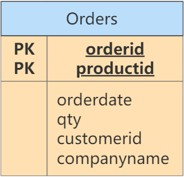
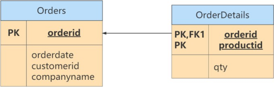
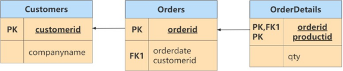
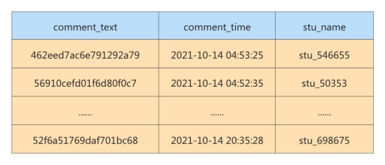
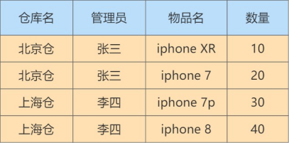

# 数据库的设计规范

## **1.** 为什么需要数据库设计  

**我们在设计数据表的时候，要考虑很多问题。**比如:

+ 用户都需要什么数据?需要在数据表中保存哪些数据?
+ 如何保证数据表中数据的正确性，当插入、删除、更新的时候该进行怎样的约束检查?。
+ 如何降低数据表的数据冗余度，保证数据表不会因为用户量的增长而迅速扩张?
+ 如何让负责数据库维护的人员更方便地使用数据库?
+ 使用数据库的应用场景也各不相同，可以说针对不同的情况，设计出来的数据表可能千差万别。

**现实情况中，面临的场景:**

+ 当数据库运行了一段时间之后，我们才发现数据表设计的有问题。重新调整数据表的结构，就需要做数据迁移，还有可能影响程序的业务逻辑，以及网站正常的访问。

**如果是糟糕的数据库设计可能会造成以下问题:**

+ 数据冗余、信息重复，存储空间浪费
+ 数据更新、插入、删除的异常
+ 无法正确表示信息
+ 丢失有效信息。
+ 程序性能差

**良好的数据库设计则有以下优点:**

+ 节省数据的存储空间
+ 能够保证数据的完整性Ⅰ
+ 方便进行数据库应用系统的开发

总之，开始设置数据库的时候，我们就需要重视数据表的设计。为了建立冗余较小、结构合理的数据库，设计数据库时必须遵循一定的规则。

## 2. 范 式

### **2.1** 范式简介

**在关系型数据库中，关于数据表设计的基本原则、规则就称为范式。**可以理解为，一张数据表的设计结  构需要满足的某种设计标准的级别 。要想设计一个结构合理的关系型数据库，必须满足一定的范式。

### 2.2 范式都包括哪些

目前关系型数据库有六种常见范式，按照范式级别，从低到高分别是：**第一范式（1NF）、第二范式（2NF）、第三范式（3NF）、巴斯科德范式（BCNF）、第四范式(4NF）和第五范式（5NF，又称完美范式。

### 2.3 键和相关属性的概念

**举例：**

这里有两个表：

球员表：球员编号 | 姓名 | 身份证号 | 年龄 | 球队编号

球队表(team) ：球队编号 | 主教练 | 球队所在地

+ 超键 ：对于球员表来说，超键就是包括球员编号或者身份证号的任意组合，比如（球员编号）（球员编号，姓名）（身份证号，年龄）等。
+ 候选键 ：就是最小的超键，对于球员表来说，候选键就是（球员编号）或者（身份证号）。
+ 主键 ：我们自己选定，也就是从候选键中选择一个，比如（球员编号）。
+ 外键 ：球员表中的球队编号。
+ 主属性 、 非主属性 ：在球员表中，主属性是（球员编号）（身份证号），其他的属性（姓名）

（年龄）（球队编号）都是非主属性。

### 2.4 第一范式(1stNF)

**举例**：

假设一家公司要存储员工的姓名和联系方式。它创建一个如下表：


该表不符合 1NF ，因为规则说“表的每个属性必须具有原子（单个）值”，lisi和zhaoliu员工的

emp_mobile 值违反了该规则。为了使表符合 1NF ，我们应该有如下表数据：


**举例2：**

user 表的设计不符合第一范式


| **字段名称** | **字段类型** | **是否是主键** | **说明**                            |
| ------------ | ------------ | -------------- | ----------------------------------- |
| id           | INT          | 是             | 主键id                              |
| username     | VARCHAR(30)  | 否             | 用户名                              |
| password     | VARCHAR(50)  | 否             | 密码                                |
| user_info    | VARCHAR(255) | 否             | 用户信息 (包含真实姓名、电话、住址) |

其中，user_info字段为用户信息，可以进一步拆分成更小粒度的字段，不符合数据库设计对第一范式的  要求。将user_info拆分后如下：

| **字段名称** | **字段类型** | **是否是主键** | **说明** |
| ------------ | ------------ | -------------- | -------- |
| id           | INT          | 是             | 主键id   |
| username     | VARCHAR(30)  | 否             | 用户名   |
| password     | VARCHAR(50)  | 否             | 密码     |
| real_name    | VARCHAR(30)  | 否             | 真实姓名 |
| phone        | VARCHAR(12)  | 否             | 联系电话 |
| address      | VARCHAR(100) | 否             | 家庭住址 |

 

**举例3：**

属性的原子性是主观的 。例如，Employees关系中雇员姓名应当使用1个（fullname）、2个（firstname 和lastname）还是3个（firstname、middlename和lastname）属性表示呢？答案取决于应用程序。如果应   用程序需要分别处理雇员的姓名部分（如：用于搜索目的），则有必要把它们分开。否则，不需要。

表1：

| **姓名** | **年龄** | **地址**               |
| -------- | -------- | ---------------------- |
| 张三     | 20       | 广东省广州市三元里78号 |
| 李四     | 24       | 广东省深圳市龙华新区   |

表2：

| **姓名** | **年龄** | **省** | **市** | **地址**   |
| -------- | -------- | ------ | ------ | ---------- |
| 张三     | 20       | 广东   | 广州   | 三元里78号 |
| 李四     | 24       | 广东   | 深圳   | 龙华新区   |

### 2.5 第二范式(2nd NF)

#### 举例1：

成绩表 （学号，课程号，成绩）关系中，（学号，课程号）可以决定成绩，但是学号不能决定成绩，课程号也不能决定成绩，所以“（学号，课程号）→成绩”就是 完全依赖关系 。

#### **举例2：**

比赛表 player_game ，里面包含球员编号、姓名、年龄、比赛编号、比赛时间和比赛场地等属性，这里候选键和主键都为（球员编号，比赛编号），我们可以通过候选键（或主键）来决定如下的关系：

> (球员编号, 比赛编号) → (姓名, 年龄, 比赛时间, 比赛场地，得分)

但是这个数据表不满足第二范式，因为数据表中的字段之间还存在着如下的对应关系：

> (球员编号) → (姓名，年龄)
>
>  
>
> (比赛编号) → (比赛时间, 比赛场地)

对于非主属性来说，并非完全依赖候选键。这样会产生怎样的问题呢？

1. 数据冗余 ：如果一个球员可以参加 m 场比赛，那么球员的姓名和年龄就重复了 m-1 次。一个比赛也可能会有 n 个球员参加，比赛的时间和地点就重复了 n-1 次。

2. 插入异常 ：如果我们想要添加一场新的比赛，但是这时还没有确定参加的球员都有谁，那么就没法插入。

3. 删除异常 ：如果我要删除某个球员编号，如果没有单独保存比赛表的话，就会同时把比赛信息删除掉。

4. 更新异常 ：如果我们调整了某个比赛的时间，那么数据表中所有这个比赛的时间都需要进行调整，否则就会出现一场比赛时间不同的情况。

为了避免出现上述的情况，我们可以把球员比赛表设计为下面的三张表。 

| **表名**                    | **属性（字段）**                   |
| --------------------------- | ---------------------------------- |
| 球员 player 表              | 球员编号、姓名和年龄等属性         |
| 比赛 game 表                | 比赛编号、比赛时间和比赛场地等属性 |
| 球员比赛关系 player_game 表 | 球员编号、比赛编号和得分等属性     |

这样的话，每张数据表都符合第二范式，也就避免了异常情况的发生。

> 1NF 告诉我们字段属性需要是原子性的，而 2NF 告诉我们一张表就是一个独立的对象，一张表只表达一个意思。


#### **举例3：**

定义了一个名为 Orders 的关系，表示订单和订单行的信息：




违反了第二范式，因为有非主键属性仅依赖于候选键（或主键）的一部分。例如，可以仅通过orderid找  到订单的 orderdate，以及 customerid 和 companyname，而没有必要再去使用productid。

修改：

Orders表和OrderDetails表如下，此时符合第二范式。




### 2.6 第三范式(3rd NF)

#### **举例：**

部门信息表 ：每个部门有部门编号（dept_id）、部门名称、部门简介等信息。

员工信息表 ：每个员工有员工编号、姓名、部门编号。列出部门编号后就不能再将部门名称、部门简介等与部门有关的信息再加入员工信息表中。

如果不存在部门信息表，则根据第三范式（3NF）也应该构建它，否则就会有大量的数据冗余。

#### **举例2：**

| **字段名称**  | **字段类型**  | **是否是主键** | **说明**            |
| ------------- | ------------- | -------------- | ------------------- |
| id            | INT           | 是             | 商品主键id （主键） |
| category_id   | INT           | 否             | 商品类别id          |
| category_name | VARCHAR(30)   | 否             | 商品类别名称        |
| goods_name    | VARCHAR(30)   | 否             | 商品名称            |
| price         | DECIMAL(10,2) | 否             | 商品价格            |

商品类别名称依赖于商品类别编号，不符合第三范式。修改：

表1：符合第三范式的 商品类别表 的设计

| **字段名称**  | **字段类型** | **是否是主键** | **说明**       |
| ------------- | ------------ | -------------- | -------------- |
| id            | INT          | 是             | 商品类别主键id |
| category_name | VARCHAR(30)  | 否             | 商品类别名称   |

表2：符合第三范式的 商品表 的设计

| **字段名称** | **字段类型**  | **是否是主键** | **说明**   |
| ------------ | ------------- | -------------- | ---------- |
| id           | INT           | 是             | 商品主键id |
| category_id  | VARCHAR(30)   | 否             | 商品类别id |
| goods_name   | VARCHAR(30)   | 否             | 商品名称   |
| price        | DECIMAL(10,2) | 否             | 商品价格   |

商品表goods通过商品类别id字段（category_id）与商品类别表goods_category进行关联。

#### **举例3：**

球员player表 ：球员编号、姓名、球队名称和球队主教练。现在，我们把属性之间的依赖关系画出来，如下图所示：


 

 

你能看到球员编号决定了球队名称，同时球队名称决定了球队主教练，非主属性球队主教练就会传递依  赖于球员编号，因此不符合 3NF 的要求。

如果要达到 3NF 的要求，需要把数据表拆成下面这样：

| **表名** | **属性（字段）**         |
| -------- | ------------------------ |
| 球员表   | 球员编号、姓名和球队名称 |
| 球队表   | 球队名称、球队主教练     |

#### **举例4：**

修改第二范式中的举例3。

此时的Orders关系包含 orderid、orderdate、customerid 和 companyname 属性，主键定义为 orderid。customerid  和companyname均依赖于主键——orderid。例如，你需要通过orderid主键来查找代表订单中客户的customerid，同样，你需要通过 orderid 主键查找订单中客户的公司名称（companyname）。然而， customerid和companyname也是互相依靠的。为满足第三范式，可以改写如下：



> 符合3NF后的数据模型通俗地讲，2NF和3NF通常以这句话概括：“每个非键属性依赖于键，依赖于  整个键，并且除了键别无他物”。

## **3.** 反范式化

### **3.1** 概述

####  vs性能

> 1. 为满足某种商业目标 , 数据库性能比规范化数据库更重要
>
> 2. 在数据规范化的同时 , 要综合考虑数据库的性能
>
> 3. 通过在给定的表中添加额外的字段，以大量减少需要从中搜索信息所需的时间
>
> 4. 通过在给定的表中插入计算列，以方便查询


### 3.2 应用举例

**举例1：

员工的信息存储在 employees 表 中，部门信息存储在departments表中。通过 employees 表中的

department_id字段与 departments 表建立关联关系。如果要查询一个员工所在部门的名称：

```mysql
select employee_id,department_name from employees e join departments d
on e.department_id = d.department_id;
```

如果经常需要进行这个操作，连接查询就会浪费很多时间。可以在 employees 表中增加一个冗余字段

department_name，这样就不用每次都进行连接操作了。

#### **举例2：**

反范式化的 goods商品信息表 设计如下：

| **字段名称**  | **字段类型**  | **是否是主键** | **说明**        |
| ------------- | ------------- | -------------- | --------------- |
| id            | INT           | 是             | 商品id （主键） |
| category_id   | VARCHAR(30)A  | 否             | 商品类别id      |
| category_name | VARCHAR(30)   | 否             | 商品类别名称    |
| goods_name    | VARCHAR(30)   | 否             | 商品名称        |
| price         | DECIMAL(10,2) | 否             | 商品价格        |

**举例3**： 我们有 2 个表，分别是 商品流水表（atguigu.trans ）和商品信息表（atguigu.goodsinfo） 。商品流水表里有 400 万条流水记录，商品信息表里有 2000 条商品记录。

商品流水表：


商品信息表：


 

新的商品流水表如下所示：


 

#### **举例：**

课程评论表 class_comment ，对应的字段名称及含义如下：


 

学生表 student ，对应的字段名称及含义如下：


 

在实际应用中，我们在显示课程评论的时候，通常会显示这个学生的昵称，而不是学生  ID，因此当我们想要查询某个课程的前 1000 条评论时，需要关联 class_comment 和 student这两张表来进行查询。

#### **实验数据：模拟两张百万量级的数据表**

为了更好地进行 SQL  优化实验，我们需要给学生表和课程评论表随机模拟出百万量级的数据。我们可以通过存储过程来实现模拟数据。

#### **反范式优化实验对比**

如果我们想要查询课程 ID 为 10001 的前 1000 条评论，需要写成下面这样：

```mysql
SELECT p.comment_text, p.comment_time, stu.stu_name FROM class_comment AS p LEFT JOIN student AS stu
ON p.stu_id = stu.stu_id WHERE p.class_id = 10001 ORDER BY p.comment_id DESC
LIMIT 1000;
```

运行结果（1000 条数据行）：

 

运行时长为?秒，对于网站的响应来说，这已经很慢了，用户体验会非常差。

如果我们想要提升查询的效率，可以允许适当的数据冗余，也就是在商品评论表中增加用户昵称字段，  在 class_comment 数据表的基础上增加 stu_name 字段，就得到了 class_comment2 数据表。

这样一来，只需单表查询就可以得到数据集结果：

```mysql
SELECT comment_text, comment_time, stu_name FROM class_comment2
WHERE class_id = 10001
ORDER BY class_id DESC LIMIT 1000;
```

运行结果（1000 条数据）：

 

优化之后只需要扫描一次聚集索引即可，运行时间为0.039秒，查询时间是之前的 1/10，在数据量大的情况下，查询效率会有显著的提升。

### **3.3** 反范式的新问题

+ 存储空间变大了

+ 一个表中字段做了修改，另一个表中冗余的字段也需要做同步修改，否则 数据不一致

+ 若采用存储过程来支持数据的更新、删除等额外操作，如果更新频繁，会非常 消耗系统资源

+ 在 数据量小 的情况下，反范式不能体现性能的优势，可能还会让数据库的设计更加 复杂

### 3.4 反范式的适用场景

当冗余信息有价值或者能 大幅度提高查询效率 的时候，我们才会采取反范式的优化。

### 1. 增加冗余字段的建议

**2.** **历史快照、历史数据的需要**

在现实生活中，我们经常需要一些冗余信息，比如订单中的收货人信息，包括姓名、电话和地址等。每  次发生的 订单收货信息 都属于 历史快照 ，需要进行保存，但用户可以随时修改自己的信息，这时保存这些冗余信息是非常有必要的。

反范式优化也常用在 数据仓库 的设计中，因为数据仓库通常 存储历史数据 ，对增删改的实时性要求不强，对历史数据的分析需求强。这时适当允许数据的冗余度，更方便进行数据分析。

## 4. BCNF(巴斯范式)

#### **1.** 案例

我们分析如下表的范式情况：



在这个表中，一个仓库只有一个管理员，同时一个管理员也只管理一个仓库。我们先来梳理下这些属性  之间的依赖关系。

仓库名决定了管理员，管理员也决定了仓库名，同时（仓库名，物品名）的属性集合可以决定数量这个  属性。这样，我们就可以找到数据表的候选键。

候选键 ：是（管理员，物品名）和（仓库名，物品名），然后我们从候选键中选择一个作为 主键 ，比如（仓库名，物品名）。

主属性 ：包含在任一候选键中的属性，也就是仓库名，管理员和物品名。

非主属性 ：数量这个属性。

#### 2. 是否符合三范式

如何判断一张表的范式呢？我们需要根据范式的等级，从低到高来进行判断。首先，数据表每个属性都是原子性的，符合 1NF 的要求；

其次，数据表中非主属性”数量“都与候选键全部依赖，（仓库名，物品名）决定数量，（管理员，物品  名）决定数量。因此，数据表符合 2NF 的要求；

最后，数据表中的非主属性，不传递依赖于候选键。因此符合 3NF 的要求。


#### 3. 存在的问题

既然数据表已经符合了 3NF 的要求，是不是就不存在问题了呢？我们来看下面的情况：

1. 增加一个仓库，但是还没有存放任何物品。根据数据表实体完整性的要求，主键不能有空值，因  此会出现 插入异常 ；

2. 如果仓库更换了管理员，我们就可能会 修改数据表中的多条记录 ；

3. 如果仓库里的商品都卖空了，那么此时仓库名称和相应的管理员名称也会随之被删除。

你能看到，即便数据表符合 3NF 的要求，同样可能存在插入，更新和删除数据的异常情况。

#### 4. 问题解决

首先我们需要确认造成异常的原因：主属性仓库名对于候选键（管理员，物品名）是部分依赖的关系，  这样就有可能导致上面的异常情况。因此引入BCNF，**它在** **3NF** **的基础上消除了主属性对候选键的部分依赖或者传递依赖关系**。

如果在关系R中，U为主键，A属性是主键的一个属性，若存在A->Y，Y为主属性，则该关系不属于BCNF。

根据 BCNF 的要求，我们需要把仓库管理关系 warehouse_keeper 表拆分成下面这样：

仓库表 ：（仓库名，管理员）

库存表 ：（仓库名，物品名，数量）

这样就不存在主属性对于候选键的部分依赖或传递依赖，上面数据表的设计就符合  BCNF。再举例：

有一个 学生导师表 ，其中包含字段：学生ID，专业，导师，专业GPA，这其中学生ID和专业是联合主键。

| **StudentId** | **Major** | **Advisor** | **MajGPA** |
| ------------- | --------- | ----------- | ---------- |
| 1             | 人工智能  | Edward      | 4.0        |
| 2             | 大数据    | William     | 3.8        |
| 1             | 大数据    | William     | 3.7        |
| 3             | 大数据    | Joseph      | 4.0        |

这个表的设计满足三范式，但是这里存在另一个依赖关系，“专业”依赖于“导师”，也就是说每个导师只  做一个专业方面的导师，只要知道了是哪个导师，我们自然就知道是哪个专业的了。

所以这个表的部分主键Major依赖于非主键属性Advisor，那么我们可以进行以下的调整，拆分成2个表：  学生导师表：

| **StudentId** | **Advisor** | **MajGPA** |
| ------------- | ----------- | ---------- |
| 1             | Edward      | 4.0        |
| 2             | William     | 3.8        |
| 1             | William     | 3.7        |
| 3             | Joseph      | 4.0        |

导师表：

| **Advisor** | **Major** |
| ----------- | --------- |
| Edward      | 人工智能  |
| William     | 大数据    |
| Joseph      | 大数据    |

## 5. 数据表的设计原则

综合以上内容，总结出数据表设计的一般原则："三少一多"

**1.数据表的个数越少越好**

**2.数据表中的字段个数越少越好**

**3.数据表中联合主键的字段个数越少越好**

**4.使用主键和外键越多越好**

>  注意：这个原则并不是绝对的，有时候我们需要牺牲数据的冗余度来换取数据处理的效率。 


### 5.1 数据库对象编写建议

#### 10.1 关于库

1.  【强制】库的名称必须控制在32个字符以内，只能使用英文字母、数字和下划线，建议以英文字 母开头。

2. 【强制】库名中英文 一律小写 ，不同单词采用 下划线 分割。须见名知意。

3. 【强制】库的名称格式：业务系统名称_子系统名。

4. 【强制】库名禁止使用关键字（如type,order等）。

5. 【强制】创建数据库时必须	显示指定字符集，并且字符集只能是utf8或者utf8mb4。创建数据库SQL举例：CREATE DATABASE crm_fund DEFAULT CHARACTER SET 'utf8' ;

6. 【建议】对于程序连接数据库账号，遵循权限最小原则，使用数据库账号只能在一个DB下使用，不准跨库。程序使用的账号 原则上不准有drop权限 。

7. 【建议】临时库以tmp_为前缀，并以日期为后缀；

8. 备份库以bak_为前缀，并以日期为后缀。


**10.2** **关于表、列**

1. 【强制】表和列的名称必须控制在32个字符以内，表名只能使用英文字母、数字和下划线，建议以英文字母开头

2. 【强制】 表名、列名一律小写 ，不同单词采用下划线分割。须见名知意。

3. 【强制】表名要求有模块名强相关，同一模块的表名尽量使用 统一前缀 。比如：crm_fund_item

4. 【强制】创建表时必须显示指定字符集	为utf8或utf8mb4。

5. 【强制】表名、列名禁止使用关键字（如type,order等）。

6. 【强制】创建表时必须 显式指定表存储引擎 类型。如无特殊需求，一律为InnoDB。

7. 【强制】建表必须有comment。

8. 【强制】字段命名应尽可能使用表达实际含义的英文单词或 缩写 。如：公司 ID，不要使用corporation_id, 而用corp_id 即可。

9. 【强制】布尔值类型的字段命名为 is_描述 。如member表上表示是否为enabled的会员的字段命名为 is_enabled。

10. 【强制】禁止在数据库中存储图片、文件等大的二进制数据通常文件很大，短时间内造成数据量快速增长，数据库进行数据库读取时，通常会进行大量的随  机IO操作，文件很大时，IO操作很耗时。通常存储于文件服务器，数据库只存储文件地址信息。

11. 【建议】建表时关于主键：必须有主键	

    ​	(1)强制要求主键为id，类型为int或bigint，且为auto_increment 建议使用unsigned无符号型。  

    ​	(2)标识表里每一行主体的字段不要设为主键，建议设为其他字段如user_id，order_id等，并建立unique  key索引。因为如果设为主键且主键值为随机插入，则会导致innodb内部页分裂和大量随机I/O，性能下降。

12. 【建议】核心表（如用户表）必须有行数据的 创建时间字段 （create_time）和最后跟新字段（update_time），便于查问题。

13. 【建议】表中所有字段尽量都是 NOT NULL 属性，业务可以根据需要定义 DEFAULT值 。 因为使用NULL值会存在每一行都会占用额外存储空间、数据迁移容易出错、聚合函数计算结果偏差等问  题。

14. 【建议】所有存储相同数据的 列名和列类型必须一致 （一般作为关联列，如果查询时关联列类型不一致会自动进行数据类型隐式转换，会造成列上的索引失效，导致查询效率降低）。

15. 【建议】中间表（或临时表）用于保留中间结果集，名称以tmp_开头。

    备份表用于备份或抓取源表快照，名称以 bak_ 开头。中间表和备份表定期清理。

16. 【示范】一个较为规范的建表语句：

```mysql
CREATE TABLE user_info (
`id` int unsigned NOT NULL AUTO_INCREMENT COMMENT '自增主键',
`user_id` bigint(11) NOT NULL COMMENT '用户id',
`username` varchar(45) NOT NULL COMMENT '真实姓名',
`email` varchar(30) NOT NULL COMMENT '用户邮箱',
`nickname` varchar(45) NOT NULL COMMENT '昵称',
`birthday` date NOT NULL COMMENT '生日',
`sex` tinyint(4) DEFAULT '0' COMMENT '性别',
`short_introduce` varchar(150) DEFAULT NULL COMMENT '一句话介绍自己，最多50个汉字',
`user_resume` varchar(300) NOT NULL COMMENT '用户提交的简历存放地址',
`user_register_ip` int NOT NULL COMMENT '用户注册时的源ip',
`create_time` timestamp NOT NULL DEFAULT CURRENT_TIMESTAMP COMMENT '创建时间',
`update_time` timestamp NOT NULL DEFAULT CURRENT_TIMESTAMP ON UPDATE CURRENT_TIMESTAMP COMMENT '修改时间',
`user_review_status` tinyint NOT NULL COMMENT '用户资料审核状态，1为通过，2为审核中，3为未通过，4为还未提交审核',
    PRIMARY KEY (`id`),
UNIQUE KEY `uniq_user_id` (`user_id`), KEY `idx_username`(`username`),
KEY `idx_create_time_status`(`create_time`,`user_review_status`)
) ENGINE=InnoDB DEFAULT CHARSET=utf8 COMMENT='网站用户基本信息'
```

17. 【建议】创建表时，可以使用可视化工具。这样可以确保表、字段相关的约定都能设置上。  实际上，我们通常很少自己写 DDL 语句，可以使用一些可视化工具来创建和操作数据库和数据表。

    可视化工具除了方便，还能直接帮我们将数据库的结构定义转化成 SQL  语言，方便数据库和数据表结构的导出和导入。

#### **10.3** 关于索引

1. 【强制】InnoDB表必须主键为id int/bigint auto_increment，且主键值 禁止被更新 。

2. 【强制】InnoDB和MyISAM存储引擎表，索引类型必须为 BTREE 。

3. 【建议】主键的名称以`pk_`开头，唯一键以`uni_`或 `uk_` 开头，普通索引以`idx_`开头，一律使用小写格式，以字段的名称或缩写作为后缀。

4. 【建议】多单词组成的columnname，取前几个单词首字母，加末单词组成column_name。如: sample 表 member_id 上的索引：idx_sample_mid。

5. 【建议】单个表上的索引个数 不能超过6个 。

6. 【建议】在建立索引时，多考虑建立联合索引 ，并把区分度最高的字段放在最前面。

7. 【建议】在多表 JOIN 的SQL里，保证被驱动表的连接列上有索引，这样JOIN 执行效率最高。

8. 【建议】建表或加索引时，保证表里互相不存在冗余索引 。 比如：如果表里已经存在key(a,b)， 则key(a)为冗余索引，需要删除。

#### 10.4 SQL编写

1. 【强制】程序端SELECT语句必须指定具体字段名称，禁止写成 。

2. 【建议】程序端insert语句指定具体字段名称，不要写成INSERT INTO t1 VALUES(…)。

3. 【建议】除静态表或小表（100行以内），DML语句必须有WHERE条件，且使用索引查找。

4. 【建议】INSERT INTO…VALUES(XX),(XX),(XX).. 这里XX的值不要超过5000个。 值过多虽然上线很快，但会引起主从同步延迟。

5. 【建议】SELECT语句不要使用UNION，推荐使用UNION  ALL，并且UNION子句个数限制在5个以内。

6. 【建议】线上环境，多表 JOIN 不要超过5个表。

7. 【建议】减少使用ORDER BY，和业务沟通能不排序就不排序，或将排序放到程序端去做。ORDER BY、GROUP BY、DISTINCT 这些语句较为耗费CPU，数据库的CPU资源是极其宝贵的。

8. 【建议】包含了ORDER BY、GROUP BY、DISTINCT 这些查询的语句，WHERE 条件过滤出来的结果集请保持在1000行以内，否则SQL会很慢。

9. 【建议】对单表的多次alter操作必须合并为一次

   对于超过100W行的大表进行alter table，必须经过DBA审核，并在业务低峰期执行，多个alter需整合在一起。 因为alter table会产生 表锁 ，期间阻塞对于该表的所有写入，对于业务可能会产生极大影响。

10. 【建议】批量操作数据时，需要控制事务处理间隔时间，进行必要的sleep。

11. 【建议】事务里包含SQL不超过5个。

    因为过长的事务会导致锁数据较久，MySQL内部缓存、连接消耗过多等问题。

12. 【建议】事务里更新语句尽量基于主键或UNIQUE KEY，如UPDATE… WHERE id=XX;否则会产生间隙锁，内部扩大锁定范围，导致系统性能下降，产生死锁。