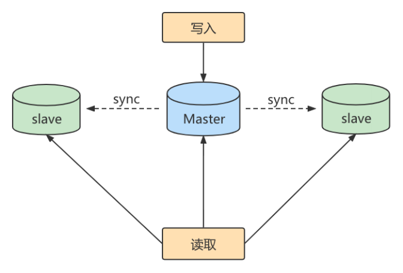

# 主从复制

## 1. 主从复制概述

### 1.1 如何提升数据库并发能力

在实际工作中，我们常常将**Redis**作为缓存与MySQL配合来使用，当有请求的时候，首先会从缓存中进行查找，如果存在就直接取出。如果不存在再访问数据库，这样就提升了读取的效率，也减少了对后端数据库的访问压力。Redis的缓存架构是高并发架构中非常重要的一环。


此外，一般应用对数据库而言都是**“ 读多写少 ”**，也就说对数据库读取数据的压力比较大，有一个思路就是采用数据库集群的方案，做**主从架构** 、进行**读写分离** ，这样同样可以提升数据库的并发处理能力。但并不是所有的应用都需要对数据库进行主从架构的设置，毕竟设置架构本身是有成本的。

如果我们的目的在于提升数据库高并发访问的效率，那么首先考虑的是如何**优化SQL和索引** ，这种方式简单有效；其次才是采用缓存的策略 ，比如使用 Redis将热点数据保存在内存数据库中，提升读取的效率；最后才是对数据库采用**主从架构** ，进行读写分离。

### 1.2. 主从复制作用

主从同步设计不仅可以提高数据库的吞吐量，还有以下3个方面的作用。

#### 读写分离

我们可以通过主从复制的方式来同步数据，然后通过读写分离提高数据库并发处理能力。




其中一个是Master主库，负责写入数据，我们称之为：写库。

其它都是Slave从库，负责读取数据，我们称之为：读库。

当主库进行更新的时候，会自动将数据复制到从库中，而我们在客户端读取数据的时候，会从从库中进行读取。

面对“读多写少”的需求，采用读写分离的方式，可以实现更高的并发访问。同时，我们还能对从服务器进行负载均衡，让不同的读请求按照策略均匀地分发到不同的从服务器上，让读取更加顺畅。读取顺畅的另一个原因，就是减少了锁表的影响，比如我们让主库负责写，当主库出现写锁的时候，不会影响到从库进行SELECT的读取。

#### 数据备份

我们通过主从复制将主库上的数据复制到了从库上，相当于是一种热备份机制，也就是在主库正常运行的情况下进行的备份，不会影响到服务。

#### 高可用

数据备份实际上是一种冗余的机制，通过这种冗余的方式可以换取数据库的高可用性，也就是当服务器出现故障或右机的情况下，可以切换到从服务器上，保证服务的正常运行。

## 2. 主从复制原理

Slave 会从 Master 读取 binlog 来进行数据同步。

### 2.1 原理剖析

**三个线程**

实际上主从同步的原理就是基于 binlog 进行数据同步的。在主从复制过程中，会基于**3 个线程**来操作，一个主库线程，两个从库线程。


**二进制日志转储线程** （Binlog dump thread）是一个主库线程。当从库线程连接的时候， 主库可以将二进制日志发送给从库，当主库读取事件（Event）的时候，会在 Binlog 上 加锁 ，读取完成之后，再将锁释放掉。

**从库 I/O 线程**会连接到主库，向主库发送请求更新 Binlog。这时从库的 I/O 线程就可以读取到主库的二进制日志转储线程发送的 Binlog 更新部分，并且拷贝到本地的中继日志 （Relay log）。

**从库 SQL 线程**会读取从库中的中继日志，并且执行日志中的事件，将从库中的数据与主库保持同步。


**复制三步骤**

步骤1： Master 将写操作记录到二进制日志（ binlog ）。

步骤2： Slave 将 Master 的binary log events拷贝到它的中继日志（ relay log ）；

步骤3： Slave 重做中继日志中的事件，将改变应用到自己的数据库中。 MySQL复制是异步的且串行化

的，而且重启后从 接入点 开始复制。

**复制的问题**

复制的最大问题： 延时

### 2.2 复制的基本原则

每个 Slave 只有一个 Master

每个 Slave 只能有一个唯一的服务器ID

每个 Master 可以有多个 Slave

## 3. 一主一从架构搭建

### 3.1 准备工作

准备两台主机

### 3.2 主机配置文件

建议mysql版本一致(或者从机版本大于等于主机)且后台以服务运行，主从所有配置项都配置在`[mysqld]`节点下，且都是小写字母。

具体参数配置如下：

**必选**

```ini
#[必须]主服务器唯一ID
server-id=1

#[必须]启用二进制日志,指名路径。比如：自己本地的路径/log/mysqlbin
log-bin=hdy-bin
```


**可选**

```ini
#[可选] 0（默认）表示读写（主机），1表示只读（从机）
read-only=0

#设置日志文件保留的时长，单位是秒
binlog_expire_logs_seconds=6000

#控制单个二进制日志大小。此参数的最大和默认值是1GB
max_binlog_size=200M

#[可选]设置不要复制的数据库
binlog-ignore-db=test
binlog-ignore-db=other

#[可选]设置需要复制的数据库,默认全部记录。比如：binlog-do-db=hdy_master_slave
binlog-do-db=需要复制的主数据库名字

#[可选]设置binlog格式
binlog_format=ROW
```

### 3.3 从机配置文件

**必选**

```ini
#[必须]从服务器唯一ID
server-id=2
```

**可选**

```ini
#[可选]启用中继日志
relay-log=hdy-relay
```

### 3.4 主机：创建账户并授权

+ 创建一个用户，给从机使用

```sql
CREATE USER 'slave1'@'%' IDENTIFIED  WITH mysql_native_password BY '123456';
```

> 使用`mysql_native_password`插件，必须要加载插件，在配置文件中加上配置即可`default_authentication_plugin=mysql_native_password`

+ 然后授权

```sql
GRANT REPLICATION SLAVE ON *.* TO 'slave1'@'%';
```

+ 接着查看正在使用的binlog日志状态

```sql
mysql> SHOW BINARY LOG STATUS;
+----------------+----------+------------------+------------------+-------------------+
| File           | Position | Binlog_Do_DB     | Binlog_Ignore_DB | Executed_Gtid_Set |
+----------------+----------+------------------+------------------+-------------------+
| hdy-bin.000006 |      158 | hdy_master_slave |                  |                   |
+----------------+----------+------------------+------------------+-------------------+
1 row in set (0.00 sec)
```

### 3.5 从机：配置需要复制的主机

**步骤1：**从机上复制主机的命令

```sql
CHANGE REPLICATION SOURCE TO
	SOURCE_HOST='主机地址',
	SOURCE_USER='用户名',
	SOURCE_PASSWORD='密码',
	SOURCE_LOG_FILE='hdy-bin.xxxxxx',
	SOURCE_LOG_POS=pos;
```

例如：

```sql
CHANGE REPLICATION SOURCE TO
	SOURCE_HOST='192.168.1.202',
	SOURCE_USER='slave1',
	SOURCE_PASSWORD='123456',
	SOURCE_LOG_FILE='hdy-bin.000006',
	SOURCE_LOG_POS=158;
```


**步骤2：**启用同步

```sql
mysql> START REPLICA;
Query OK, 0 rows affected (0.20 sec)
```

指令表：

| 操作     | 新语法 (MySQL 8.0.22+)         | 旧语法 (MySQL 8.0.21及之前) |
| :------- | :----------------------------- | :-------------------------- |
| 启动复制 | `START REPLICA`                | `START SLAVE`               |
| 停止复制 | `STOP REPLICA`                 | `STOP SLAVE`                |
| 重置复制 | `RESET REPLICA`                | `RESET SLAVE`               |
| 查看状态 | `SHOW REPLICA STATUS`          | `SHOW SLAVE STATUS`         |
| 配置复制 | `CHANGE REPLICATION SOURCE TO` | `CHANGE MASTER TO`          |

