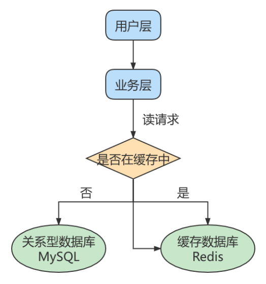
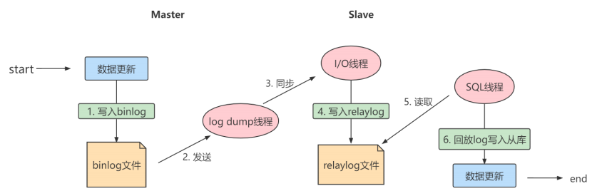

# 主从复制

## 1. 主从复制概述

**主从复制**是 MySQL 数据库中一种常见的高可用架构，用于实现数据同步、读写分离和数据备份。通过主从复制，主库（Master）负责处理写操作，从库（Slave）同步主库的数据并处理读操作，从而提升系统性能和数据安全性。

### 1.1 如何提升数据库并发能力

在实际工作中，我们常常将**Redis**作为缓存与MySQL配合来使用，当有请求的时候，首先会从缓存中进行查找，如果存在就直接取出。如果不存在再访问数据库，这样就提升了读取的效率，也减少了对后端数据库的访问压力。Redis的缓存架构是高并发架构中非常重要的一环。



此外，一般应用对数据库而言都是**“ 读多写少 ”**，也就说对数据库读取数据的压力比较大，有一个思路就是采用数据库集群的方案，做**主从架构** 、进行**读写分离** ，这样同样可以提升数据库的并发处理能力。但并不是所有的应用都需要对数据库进行主从架构的设置，毕竟设置架构本身是有成本的。

如果我们的目的在于提升数据库高并发访问的效率，那么首先考虑的是如何**优化SQL和索引** ，这种方式简单有效；其次才是采用缓存的策略 ，比如使用 Redis将热点数据保存在内存数据库中，提升读取的效率；最后才是对数据库采用**主从架构** ，进行读写分离。

### 1.2. 主从复制作用

主从同步设计不仅可以提高数据库的吞吐量，还有以下3个方面的作用。

#### 读写分离

我们可以通过主从复制的方式来同步数据，然后通过读写分离提高数据库并发处理能力。


其中一个是Master主库，负责写入数据，我们称之为：写库。

其它都是Slave从库，负责读取数据，我们称之为：读库。

当主库进行更新的时候，会自动将数据复制到从库中，而我们在客户端读取数据的时候，会从从库中进行读取。

面对“读多写少”的需求，采用读写分离的方式，可以实现更高的并发访问。同时，我们还能对从服务器进行负载均衡，让不同的读请求按照策略均匀地分发到不同的从服务器上，让读取更加顺畅。读取顺畅的另一个原因，就是减少了锁表的影响，比如我们让主库负责写，当主库出现写锁的时候，不会影响到从库进行SELECT的读取。

#### 数据备份

我们通过主从复制将主库上的数据复制到了从库上，相当于是一种热备份机制，也就是在主库正常运行的情况下进行的备份，不会影响到服务。

#### 高可用

数据备份实际上是一种冗余的机制，通过这种冗余的方式可以换取数据库的高可用性，也就是当服务器出现故障或右机的情况下，可以切换到从服务器上，保证服务的正常运行。

## 2. 主从复制原理

Slave 会从 Master 读取 binlog 来进行数据同步。

### 2.1 原理剖析

**三个线程**

实际上主从同步的原理就是基于 binlog 进行数据同步的。在主从复制过程中，会基于**3 个线程**来操作，一个主库线程，两个从库线程。



**二进制日志转储线程** （Binlog dump thread）是一个主库线程。当从库线程连接的时候， 主库可以将二进制日志发送给从库，当主库读取事件（Event）的时候，会在 Binlog 上 加锁 ，读取完成之后，再将锁释放掉。

**从库 I/O 线程**会连接到主库，向主库发送请求更新 Binlog。这时从库的 I/O 线程就可以读取到主库的二进制日志转储线程发送的 Binlog 更新部分，并且拷贝到本地的中继日志 （Relay log）。

**从库 SQL 线程**会读取从库中的中继日志，并且执行日志中的事件，将从库中的数据与主库保持同步。


**复制三步骤**

步骤1： Master 将写操作记录到二进制日志（ binlog ）。

步骤2： Slave 将 Master 的binary log events拷贝到它的中继日志（ relay log ）；

步骤3： Slave 重做中继日志中的事件，将改变应用到自己的数据库中。 MySQL复制是异步的且串行化

的，而且重启后从 接入点 开始复制。

**复制的问题**

复制的最大问题： 延时

### 2.2 复制的基本原则

每个 Slave 只有一个 Master

每个 Slave 只能有一个唯一的服务器ID

每个 Master 可以有多个 Slave

### 2.3 复制过滤规则

当主库上存在多个database，但从库只需要同步一部分的话就需要用到MySQL的复制过滤功能。比如一个主库承载多个业务数据库，需要将不同业务数据库复制到不同的从库进行查询的场景。通过过滤复制可以灵活的指定哪些库和表需要复制，哪些库不需要同步。通常建议在从服务器上配置过滤复制，可以减轻主库的负载。

#### 主库静态配置

- **binlog_do_db：**白名单，只对指定数据库进行binlog记录与复制，多个数据库设置可以写多行
- **binlog_ignore_db：**黑名单，此选项中指定的数据库将不进行binlog记录和复制，多个数据库设置可以写多行

```ini
[mysqld]
...
binlog_do_db=hdy
binlog_ignore_db=hdy_chat
...
```

#### 从库静态配置

+ **replicate_do_db：**数据库白名单列表，多个数据库用逗号分隔，该选项指定的数据库会执行主从复制操作
+ **replicate_ignore_db：**数据库黑名单列表，该选项指定的数据库将不会被复制
+ **replicate_do_table：**表级别的白名单
+ **replicate_ignore_table：**表级别的黑名单
+ **replicate_wild_do_table：**可以使用通配符进行指定表，如`%`代表所有
+ **replicate_wild_ignore_table：**同上

#### 从库在线配置复制过滤

```sql
mysql> STOP REPLICA SQL_THREAD;
Query OK, 0 rows affected (0.00 sec)

mysql> CHANGE REPLICATION FILTER replicate_ignore_db = (`hdy`,manager,yellowriver),replicate_do_db=(hdy_master_slave);
Query OK, 0 rows affected (0.00 sec)

mysql> START REPLICA SQL_THREAD;
Query OK, 0 rows affected (0.03 sec)
```

#### 查看过滤规则

通过`SHOW REPLICA STATUS\G`命令即可查看过滤规则！

```sql
mysql> SHOW REPLICA STATUS\G
*************************** 1. row ***************************
             Replica_IO_State: Waiting for source to send event
                  Source_Host: 192.168.1.200
                  Source_User: slave1
                  Source_Port: 3306
                Connect_Retry: 60
              Source_Log_File: MAYE-PC-bin.000280
          Read_Source_Log_Pos: 4539
               Relay_Log_File: maye-vm-pc-relay-bin.000002
                Relay_Log_Pos: 852
        Relay_Source_Log_File: MAYE-PC-bin.000280
           Replica_IO_Running: Yes
          Replica_SQL_Running: No
              Replicate_Do_DB: hdy_master_slave
          Replicate_Ignore_DB: hdy,manager,yellowriver
           Replicate_Do_Table: 
       Replicate_Ignore_Table: 
      Replicate_Wild_Do_Table: 
  Replicate_Wild_Ignore_Table: 
```

## 3. 一主一从架构搭建

### 3.1 准备工作

准备两台主机

### 3.2 主机配置文件

建议mysql版本一致(或者从机版本大于等于主机)且后台以服务运行，主从所有配置项都配置在`[mysqld]`节点下，且都是小写字母。

具体参数配置如下：

**必选**

```ini
#[必须]主服务器唯一ID
server-id=1

#[必须]启用二进制日志,指名路径。比如：自己本地的路径/log/mysqlbin
log-bin=hdy-bin
```


**可选**

```ini
#[可选] 0（默认）表示读写（主机），1表示只读（从机）
read-only=0

#设置日志文件保留的时长，单位是秒
binlog_expire_logs_seconds=6000

#控制单个二进制日志大小。此参数的最大和默认值是1GB
max_binlog_size=200M

#[可选]设置不要复制的数据库
binlog-ignore-db=test
binlog-ignore-db=other

#[可选]设置需要复制的数据库,默认全部记录。比如：binlog-do-db=hdy_master_slave
binlog-do-db=需要复制的主数据库名字

#[可选]设置binlog格式
binlog_format=ROW
```

### 3.3 从机配置文件

**必选**

```ini
#[必须]从服务器唯一ID
server-id=2
```

**可选**

```ini
#[可选]启用中继日志
relay-log=hdy-relay
#[可选]从服务器是否将接收到的复制事件写入自己的二进制日志
log_slave_updates=ON
```

### 3.4 主机：创建账户并授权

+ 创建一个用户，给从机使用

```sql
CREATE USER 'slave1'@'%' IDENTIFIED BY '123456';
```

+ 然后授权

```sql
GRANT REPLICATION SLAVE ON *.* TO 'slave1'@'%';
```

+ 接着查看正在使用的binlog日志状态

```sql
mysql> SHOW BINARY LOG STATUS;
+----------------+----------+------------------+------------------+-------------------+
| File           | Position | Binlog_Do_DB     | Binlog_Ignore_DB | Executed_Gtid_Set |
+----------------+----------+------------------+------------------+-------------------+
| hdy-bin.000006 |      158 | hdy_master_slave |                  |                   |
+----------------+----------+------------------+------------------+-------------------+
1 row in set (0.00 sec)
```

+ 还可以显示当前在主服务器上注册的从机列表。

```sql
mysql> SHOW REPLICAS;
+-----------+------+------+-----------+--------------------------------------+
| Server_Id | Host | Port | Source_Id | Replica_UUID                         |
+-----------+------+------+-----------+--------------------------------------+
|         1 |      | 3306 |         2 | 0061c3ce-ed2d-11f0-b3a4-080027d238ad |
+-----------+------+------+-----------+--------------------------------------+
1 row in set (0.00 sec)
```

### 3.5 从机：配置需要复制的主机

**步骤1：**从机上复制主机的命令

```sql
CHANGE REPLICATION SOURCE TO
	SOURCE_HOST='主机地址',
	SOURCE_USER='用户名',
	SOURCE_PASSWORD='密码',
	SOURCE_LOG_FILE='hdy-bin.xxxxxx',
	SOURCE_LOG_POS=pos;
```

例如：

```sql
CHANGE REPLICATION SOURCE TO
	SOURCE_HOST='192.168.1.202',
	SOURCE_USER='slave1',
	SOURCE_PASSWORD='123456',
	SOURCE_LOG_FILE='hdy-bin.000010',
	SOURCE_LOG_POS=127;
```


**步骤2：**启用同步复制

```sql
mysql> START REPLICA;
Query OK, 0 rows affected (0.20 sec)
```

**步骤3：**查看复制状态

```sql
mysql> SHOW REPLICA STATUS\G
*************************** 1. row ***************************
             Replica_IO_State: Connecting to source
                  Source_Host: 192.168.1.202
                  Source_User: slave1
                  Source_Port: 3306
                Connect_Retry: 60
              Source_Log_File: hdy-bin.000006
          Read_Source_Log_Pos: 158
               Relay_Log_File: maye-vm-pc-relay-bin.000001
                Relay_Log_Pos: 4
        Relay_Source_Log_File: hdy-bin.000006
           Replica_IO_Running: Connecting
          Replica_SQL_Running: Yes
              Replicate_Do_DB: 
          Replicate_Ignore_DB: 
           Replicate_Do_Table: 
       Replicate_Ignore_Table: 
      Replicate_Wild_Do_Table: 
  Replicate_Wild_Ignore_Table: 
                   Last_Errno: 0
                   Last_Error: 
                 Skip_Counter: 0
          Exec_Source_Log_Pos: 158
              Relay_Log_Space: 158
              Until_Condition: None
               Until_Log_File: 
                Until_Log_Pos: 0
           Source_SSL_Allowed: No
           Source_SSL_CA_File: 
           Source_SSL_CA_Path: 
              Source_SSL_Cert: 
            Source_SSL_Cipher: 
               Source_SSL_Key: 
        Seconds_Behind_Source: NULL
Source_SSL_Verify_Server_Cert: No
                Last_IO_Errno: 2061
                Last_IO_Error: Error connecting to source 'slave1@192.168.1.202:3306'. This was attempt 1/10, with a delay of 60 seconds between attempts. Message: Authentication plugin 'caching_sha2_password' reported error: Authentication requires secure connection.
               Last_SQL_Errno: 0
               Last_SQL_Error: 
  Replicate_Ignore_Server_Ids: 
             Source_Server_Id: 0
                  Source_UUID: 
             Source_Info_File: mysql.slave_master_info
                    SQL_Delay: 0
          SQL_Remaining_Delay: NULL
    Replica_SQL_Running_State: Replica has read all relay log; waiting for more updates
           Source_Retry_Count: 10
                  Source_Bind: 
      Last_IO_Error_Timestamp: 260121 13:41:13
     Last_SQL_Error_Timestamp: 
               Source_SSL_Crl: 
           Source_SSL_Crlpath: 
           Retrieved_Gtid_Set: 
            Executed_Gtid_Set: 
                Auto_Position: 0
         Replicate_Rewrite_DB: 
                 Channel_Name: 
           Source_TLS_Version: 
       Source_public_key_path: 
        Get_Source_public_key: 0
            Network_Namespace: 
1 row in set (0.00 sec)
```

其中`Last_IO_Error`字段有错误，说的是验证插件问题！

```bash
Last_IO_Error: Error connecting to source 'slave1@192.168.1.202:3306'. This was attempt 1/10, with a delay of 60 seconds between attempts. Message: Authentication plugin 'caching_sha2_password' reported error: Authentication requires secure connection.
```

我们需要指定用户插件为`mysql_native_password`，默认插件是`caching_sha2_password`。

```sql
ALTER USER 'slave1'@'%' IDENTIFIED  WITH mysql_native_password BY '123456';
```

但是有可能会执行报错，`mysql_native_password`插件未加载：

```bash
ERROR 1524 (HY000): Plugin 'mysql_native_password' is not loaded
```

如何加载插件请看[MySQL身份认证插件](#MySQL身份认证插件)。

指令表：

| 操作     | 新语法 (MySQL 8.0.22+)         | 旧语法 (MySQL 8.0.21及之前) |
| :------- | :----------------------------- | :-------------------------- |
| 启动复制 | `START REPLICA`                | `START SLAVE`               |
| 停止复制 | `STOP REPLICA`                 | `STOP SLAVE`                |
| 重置复制 | `RESET REPLICA [ALL]`          | `RESET SLAVE`               |
| 查看状态 | `SHOW REPLICA STATUS`          | `SHOW SLAVE STATUS`         |
| 配置复制 | `CHANGE REPLICATION SOURCE TO` | `CHANGE MASTER TO`          |

配置成功，能看到如下图所示两个配置都是Yes。


### 3.6 测试主从复制

#### 主服务器

因为我们在主服务器中配置了只复制`hdy_master_slave`数据库，所以我们来创建这个数据库吧！

```sql
mysql> CREATE DATABASE hdy_master_slave;
Query OK, 1 row affected (0.01 sec)

mysql> SHOW DATABASES;
+--------------------+
| Database           |
+--------------------+
| hdy                |
| hdy_master_slave   |
| information_schema |
| mysql              |
| performance_schema |
| sys                |
+--------------------+
6 rows in set (0.03 sec)

mysql> USE hdy_master_slave;
Database changed
```

数据库创建好了后，来创建表！

```sql
mysql> CREATE TABLE IF NOT EXISTS emp (
    -> empno SMALLINT  PRIMARY KEY AUTO_INCREMENT,
    -> ename VARCHAR(10),
    -> job VARCHAR(9),
    -> mgr SMALLINT,
    -> hiredate DATE,
    -> sal DECIMAL(7,2),
    -> comm SMALLINT,
    -> deptno SMALLINT
    -> );
Query OK, 0 rows affected (0.04 sec)
```

然后插入一些数据：

```sql
INSERT INTO emp(ename,job,hiredate,sal,deptno) VALUES('maye','teacher','2024-06-04',60000,20);
INSERT INTO emp(ename,job,hiredate,sal,deptno) VALUES('ZC','teacher','2024-10-15',8000,20);
```

查看一下：

```sql
mysql> SELECT * FROM emp;
+-------+-------+---------+------+------------+----------+------+--------+
| empno | ename | job     | mgr  | hiredate   | sal      | comm | deptno |
+-------+-------+---------+------+------------+----------+------+--------+
|     1 | maye  | teacher | NULL | 2024-06-04 | 60000.00 | NULL |     20 |
|     2 | ZC    | teacher | NULL | 2024-10-15 |  8000.00 | NULL |     20 |
+-------+-------+---------+------+------------+----------+------+--------+
2 rows in set (0.00 sec)
```

#### 从服务器

然后检查从服务器是否复制成功！

首先，查看表，可以看到确实已经复制了`hdy_master_slave`数据库！

```sql
mysql> SHOW DATABASES;
+---------------------+
| Database            |
+---------------------+
| book_manager        |
| db_hdy              |
| hdy                 |
| hdy_master_slave    |
| information_schema  |
| mysql               |
| performance_schema  |
| sys                 |
+---------------------+
12 rows in set (0.01 sec)
```

然后，选择数据库，查看一下表：

```sql
mysql> USE hdy_master_slave;
Database changed
mysql> SHOW TABLES;
+----------------------------+
| Tables_in_hdy_master_slave |
+----------------------------+
| emp                        |
+----------------------------+
1 row in set (0.00 sec)
```

最后，查看一下数据：

```sql
mysql> SELECT * FROM emp;
+-------+-------+---------+------+------------+----------+------+--------+
| empno | ename | job     | mgr  | hiredate   | sal      | comm | deptno |
+-------+-------+---------+------+------------+----------+------+--------+
|     1 | maye  | teacher | NULL | 2024-06-04 | 60000.00 | NULL |     20 |
|     2 | ZC    | teacher | NULL | 2024-10-15 |  8000.00 | NULL |     20 |
+-------+-------+---------+------+------------+----------+------+--------+
2 rows in set (0.00 sec)
```

至此，主从同步就完成~

## 4. 主从切换

在MySQL数据库管理中，主从切换是一项常见的操作，用于在主服务器出现故障时将从服务器提升为新的主服务器，或者在进行维护和升级时无缝迁移服务。也就是**计划内切换**和**故障切换**。

### 计划切换

计划内切换是在主库正常运行时，手动将从库提升为主库的过程。

+ **停止主库写入：**在主库上停止所有写入操作，确保数据同步完成。

```sql
mysql> FLUSH TABLES WITH READ LOCK;
Query OK, 0 rows affected (0.00 sec)
```

命令会锁定所有表，确保没有新的写入。

+ **检查从库同步状态：**在从库上检查同步状态，确保数据已经完全同步。

```sql
mysql> SHOW REPLICA STATUS\G;
```

主要关注三个字段：

```ini
Replica_IO_Running: Yes		确保为yes
Replica_SQL_Running: Yes	确保为yes
Seconds_Behind_Source: 0	确保为 0，表示从库已完全同步。
```

+ **停止从库复制：**在从库上停止复制进程。

```sql
mysql> STOP REPLICA;
Query OK, 0 rows affected (0.09 sec)
```

+ **将从库提升为主库：**在从库上执行以下命令，使其成为新的主库。

```sql
mysql> RESET REPLICA ALL;
Query OK, 0 rows affected (0.37 sec)
```

该命令会清除从库的复制信息，使其成为独立的主库。

+ **解锁原主库：**如果原主库需要继续使用，解锁表并允许写入。

```sql
mysql> UNLOCK TABLES;
Query OK, 0 rows affected (0.00 sec)
```

+ **修改应用配置：**将应用的数据库连接配置指向新的主库。

### 故障切换

当主库宕机时，需要快速将从库提升为主库，确保服务可用。

+ **检查从库同步状态：**在从库上检查同步状态，确保数据已经完全同步。

```sql
mysql> SHOW REPLICA STATUS\G;
```

主要关注三个字段：

```ini
Replica_IO_Running: Yes		确保为yes
Replica_SQL_Running: Yes	确保为yes
Seconds_Behind_Source: 0	确保为 0，表示从库已完全同步。
```

+ **停止从库复制：**在从库上停止复制进程。

```sql
mysql> STOP REPLICA;
Query OK, 0 rows affected (0.09 sec)
```

+ **将从库提升为主库：**在从库上执行以下命令，使其成为新的主库。

```sql
mysql> RESET REPLICA ALL;
Query OK, 0 rows affected (0.37 sec)
```

该命令会清除从库的复制信息，使其成为独立的主库。

+ **修改应用配置：**将应用的数据库连接配置指向新的主库。

+ **修复原主库：**如果原主库恢复，可以将其设置为新主库的从库。

  + 首先，新的主库中要有用于同步的用户：

    ```sql
    CREATE USER 'slave1'@'%' IDENTIFIED  WITH mysql_native_password BY '123456';
    ```

    必须授权：

    ```sql
    GRANT REPLICATION SLAVE ON *.* TO 'slave1'@'%';
    ```

  + 然后，就可以配置从库了：

    + 从库先配置需要复制的数据库

      ```ini
      [mysqld]
      replicate_do_db=hdy_master_slave
      ```

    + 接着就可以修改复制源了

    ```sql
    CHANGE REPLICATION SOURCE TO
    	SOURCE_HOST='主机地址',
    	SOURCE_USER='用户名',
    	SOURCE_PASSWORD='密码',
    	SOURCE_LOG_FILE='新主库binlog文件',
    	SOURCE_LOG_POS=新主库的binlog位置;
    ```

    如：

    ```sql
    CHANGE REPLICATION SOURCE TO
    	SOURCE_HOST='192.168.1.200',
    	SOURCE_USER='slave1',
    	SOURCE_PASSWORD='123456',
    	SOURCE_LOG_FILE='MAYE-PC-bin.000280',
    	SOURCE_LOG_POS=4017;
    ```

    

## 5. 可能遇到错误

### MySQL身份认证插件

在MySQL 8.0.4及以后的版本中，默认的身份验证插件从以前的`mysql_native_password`更改为`caching_sha2_password`。`mysql_native_password`插件基于传统的密码哈希方法实现身份验证，而`caching_sha2_password`提供了更强的安全性。

如果需要将MySQL服务器配置为使用`mysql_native_password`，则需要进行设置：

#### 查看插件

使用`SHOW PLUGINS;`语句查看所有插件。

```sql
mysql> SHOW PLUGINS;
+----------------------------------+----------+--------------------+---------+---------+
| Name                             | Status   | Type               | Library | License |
+----------------------------------+----------+--------------------+---------+---------+
| binlog                           | ACTIVE   | STORAGE ENGINE     | NULL    | GPL     |
...
| mysqlx_cache_cleaner             | ACTIVE   | AUDIT              | NULL    | GPL     |
| mysqlx                           | ACTIVE   | DAEMON             | NULL    | GPL     |
| mysql_native_password            | DISABLED | AUTHENTICATION     | NULL    | GPL     |
+----------------------------------+----------+--------------------+---------+---------+
48 rows in set (0.00 sec)
```

从插件结果中可以看出`mysql_native_password`插件是DISABLE禁用状态。

#### 启用插件

+ 在`my.ini`或`mysqld.conf`配置文件中加入该插件启动命令，在`[mysqld]`段添加`mysql_native_password=ON`。

```bash
vim /etc/mysql/mysql.conf.d/mysqld.cnf
```

配置如下：

```ini
[mysqld]
mysql_native_password=ON
```

+ 重启MySQL服务。然后登录mysql再`show plugins;`可以看到`mysql_native_password`是`ACTIVE`状态

```bash
systemctl restart mysql
```

查看插件结果如下：

```sql
mysql> SHOW plugins;
ERROR 2013 (HY000): Lost connection to MySQL server during query
No connection. Trying to reconnect...
Connection id:    15
Current database: *** NONE ***

+----------------------------------+----------+--------------------+---------+---------+
| Name                             | Status   | Type               | Library | License |
+----------------------------------+----------+--------------------+---------+---------+
| binlog                           | ACTIVE   | STORAGE ENGINE     | NULL    | GPL     |
...
| mysqlx_cache_cleaner             | ACTIVE   | AUDIT              | NULL    | GPL     |
| mysqlx                           | ACTIVE   | DAEMON             | NULL    | GPL     |
| mysql_native_password            | ACTIVE   | AUTHENTICATION     | NULL    | GPL     |
+----------------------------------+----------+--------------------+---------+---------+
48 rows in set (0.00 sec)
```

#### 修改用户身份认证插件

```sql
mysql> ALTER USER 'slave1'@'%' IDENTIFIED  WITH mysql_native_password BY '123456';
Query OK, 0 rows affected (0.05 sec)
```

Ok，成功解决~

### 主从服务器ID相同

当你在 MySQL 主从复制中遇到 `Fatal error: the replica I/O thread stops because source and replica have equal mysql server ids` 错误时，意味着主库和从库的 `server-id` 相同。为了使复制正常工作，主库和从库的 `server-id` 必须不同。

#### 查看服务器ID

使用` SHOW VARIABLES LIKE 'server%'`语句查看服务器ID。

+ 从服务器

```sql
mysql> SHOW VARIABLES LIKE 'server%';
+----------------+--------------------------------------+
| Variable_name  | Value                                |
+----------------+--------------------------------------+
| server_id      | 1                                    |
| server_id_bits | 32                                   |
| server_uuid    | 74f8cf64-c874-11ef-99b9-0c9d92c7793a |
+----------------+--------------------------------------+
3 rows in set, 1 warning (0.00 sec)
```

+ 主服务器

```sql
mysql> SHOW VARIABLES LIKE 'server%';
+----------------+--------------------------------------+
| Variable_name  | Value                                |
+----------------+--------------------------------------+
| server_id      | 1                                    |
| server_id_bits | 32                                   |
| server_uuid    | 0061c3ce-ed2d-11f0-b3a4-080027d238ad |
+----------------+--------------------------------------+
3 rows in set (0.03 sec)
```

通过主从服务器输出结果看，确实是一样的哦！修改一下！

#### 修改服务器ID

这里我们直接把从服务器的ID改为`2`即可！

在配置文件中加入如下配置即可：

```ini
[mysqld]
...
server-id=2
```

> 注意：有可能配置文件中本来就有这个配置，找到修改即可！

修改之后重启服务器，然后在查看服务器id:

```sql
mysql> SHOW VARIABLES LIKE 'server%';
+----------------+--------------------------------------+
| Variable_name  | Value                                |
+----------------+--------------------------------------+
| server_id      | 2                                    |
| server_id_bits | 32                                   |
| server_uuid    | 74f8cf64-c874-11ef-99b9-0c9d92c7793a |
+----------------+--------------------------------------+
3 rows in set, 1 warning (0.03 sec)
```

这个时候，发现从服务器ID已经变了，ok可以继续主从复制了！

### 执行事务ANONYMOUS时失败

当开始复制时遇到如下错误：

```sql
Last_SQL_Error: Coordinator stopped because there were error(s) in the worker(s). The most recent failure being: Worker 1 failed executing transaction 'ANONYMOUS' at source log hdy-bin.000009, end_log_pos 442. See error log and/or performance_schema.replication_applier_status_by_worker table for more details about this failure or others, if any.
```

这是一个并行复制错误，通常是由于从服务器在应用主服务器的二进制日志时出现冲突或不一致导致的。让我们逐步解决这个问题：

首先，错误消息告诉我们，具体的错误原因放到了`performance_schema.replication_applier_status_by_worker`表中，我们需要查看一下：

```sql
mysql> SELECT
           WORKER_ID,
           LAST_ERROR_NUMBER,
           LAST_ERROR_MESSAGE,
           LAST_ERROR_TIMESTAMP
       FROM performance_schema.replication_applier_status_by_worker
       WHERE LAST_ERROR_NUMBER != 0\G
*************************** 1. row ***************************
           WORKER_ID: 1
   LAST_ERROR_NUMBER: 1524
  LAST_ERROR_MESSAGE: Worker 1 failed executing transaction 'ANONYMOUS' at source log hdy-bin.000009, end_log_pos 442; Error 'Plugin 'mysql_native_password' is not loaded' on query. Default database: ''. Query: 'ALTER USER 'slave1'@'%' IDENTIFIED WITH 'mysql_native_password' AS '*6BB4837EB74329105EE4568DDA7DC67ED2CA2AD9''
LAST_ERROR_TIMESTAMP: 2026-01-21 14:29:35.515288
1 row in set (0.00 sec)
```

问题明确了！这是**主服务器上修改了复制用户的认证方式**，但从服务器没有加载 `mysql_native_password` 插件。也就是说，从服务器也要启用一下`mysql_native_password`身份认证插件。

```sql
[mysqld]
mysql_native_password=ON
```

