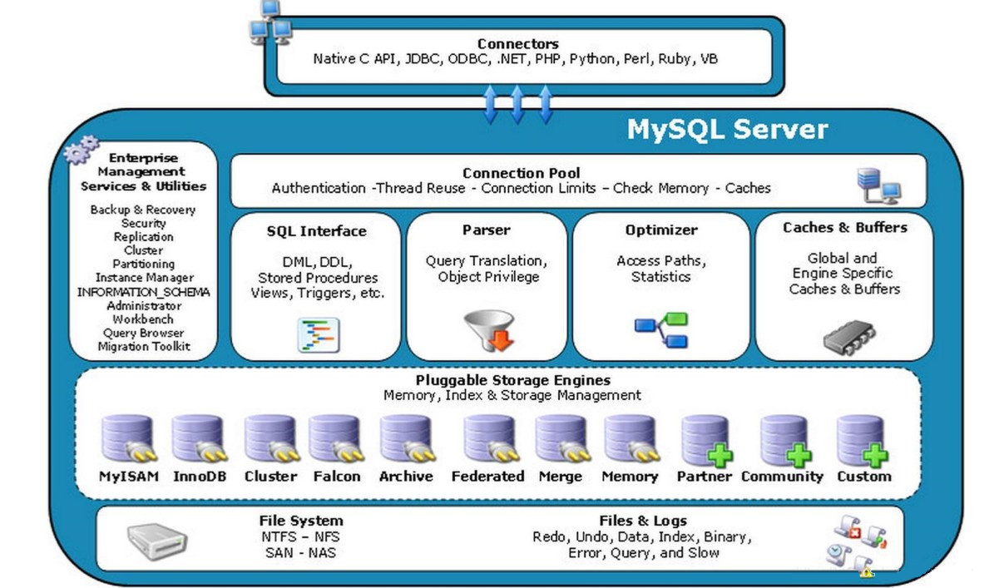
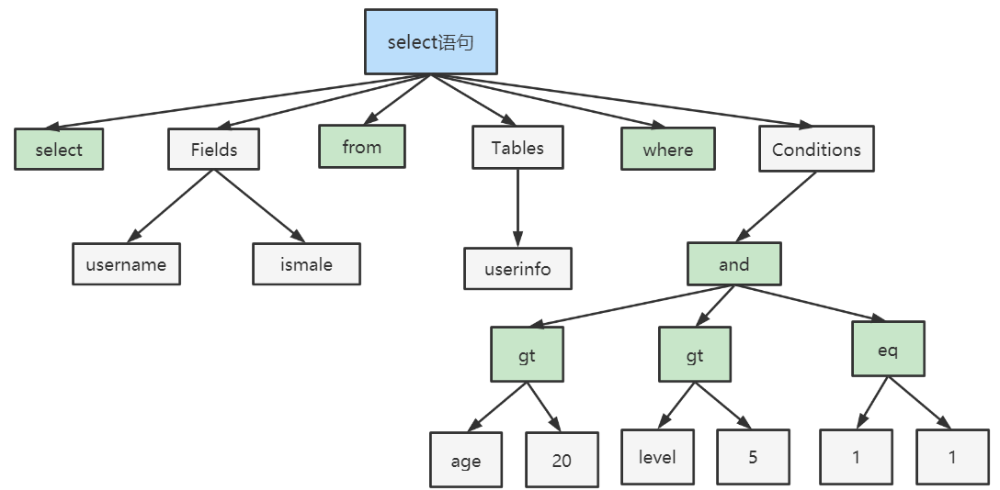
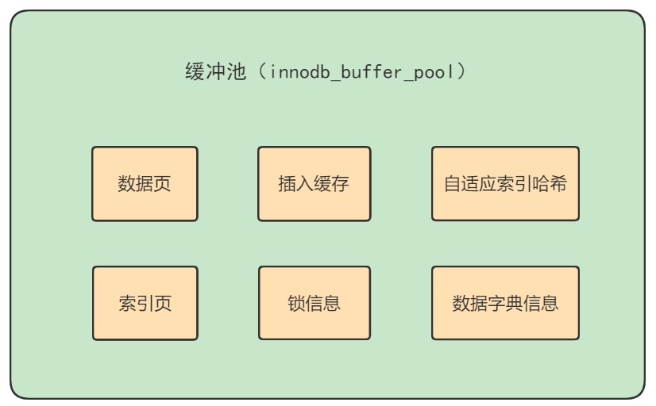
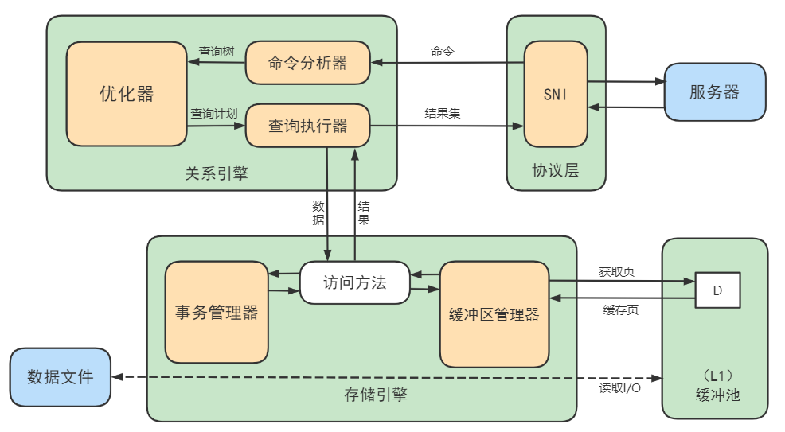

# 逻辑架构

## 逻辑架构剖析

### MySQL分层架构

MySQL 采用分层架构设计，主要包括连接层、服务层和存储引擎层。这种设计使得 MySQL 在性能、扩展性和灵活性之间取得了良好的平衡。

#### 层次图（简图）


**连接层**是 MySQL 的最上层，负责处理客户端与服务器之间的交互。它包括用户认证、连接管理和线程处理等功能。通过支持多种通信协议（如 TCP/IP 和 Unix Socket），连接层为后续的查询和操作提供了安全性和资源管理。

**服务层**是 MySQL 的核心部分，负责 SQL 查询的逻辑处理。它包括查询解析、查询优化和执行等功能。查询解析器将 SQL 转换为解析树，查询优化器选择最优的执行路径，而执行器根据优化后的计划调用存储引擎完成操作。此外，服务层通过统一的存储引擎接口实现了与底层存储的解耦。

**存储引擎层** 负责数据的存储和提取，是 MySQL 架构中最灵活的一部分。常见的存储引擎包括 InnoDB 和 MyISAM。InnoDB 支持事务、行级锁和多版本并发控制，适合高并发场景；MyISAM 则适合读多写少的场景。用户可以根据具体需求选择合适的存储引擎。

**物理文件层** 主要是将数据存储在运行于设备的文件系统之上，并完成与存储引擎的交互。

> 实际上MySQL最核心的划分是**三层**，这是最简洁且官方的划分：连接层、服务层(SQL层)、存储引擎层；在一些更详细的架构分析中，会把“物理文件层”单独列出，因为存储引擎关注**如何访问**数据，文件层关注**数据如何物理存储**

这种分层架构使得 MySQL 能够满足高并发请求，同时提供灵活的存储方案，广泛应用于各种业务场景。

#### 架构图（完整结构图）



##### **1. Connectors**

不同语言中与 MySQL 服务端进行交互的客户端，如 php、java、python 等。各种语言有自己的实现。

##### **2. Management Serveices & Utilities：**

各类系统管理和控制工具，如配置相关服务、集群相关服务、数据迁移工具、备份及恢复工具、服务端资源管理工具、通用日志模块等。

##### **3. Connection Pool**

管理服务端的连接、会话、线程等需要缓存的重型资源。连接池负责监听对 MySQL 服务端的各种请求，每当接收到连接请求，会进行身份验证、连接安全检查。如验证通过，便将其转发到线程管理模块。线程管理模块会为每一个连接请求分配（或创建）一个连接线程为其单独服务。而连接线程的主要工作就是负责 MySQL 服务端与客户端的通信、接受客户端的命令请求、传递服务端的结果信息等。线程管理模块还要负责管理维护这些连接线程，包括线程的创建、线程的缓存等。

##### **4. SQL Interface**

执行器，接收客户端的 SQL，并且返回需要查询的结果。提供包括执行 DDL、DML、存储过程、视图、触发器之类的功能。

##### **5. Parser**

SQL 传递到解析器的时候会被解析器验证和解析。

主要功能： a. 将 SQL 语句进行词法、语法、语义分析，分解成语法树，然后按照不同的操作类型进行分发，以后SQL语句的传递和处理就是基于这个结构的。 b. 如果在解析中遇到错误，中断流程并返回错误信息

##### **6. Optimizer**

SQL 语句在查询之前会使用查询优化器对查询进行优化。结合客户端请求的 SQL 语句和数据库的统计信息，分析得出一个最优的执行计划，告诉后面的流程如何取得这个 SQL 语句的结果。

##### **7. Cache & Buffer**

查询缓存：将客户端提交给 MySQL 的 Select 请求的返回结果集缓存到内存中，与该请求的 hash 值做映射。该请求的数据来源表发生任何数据变化后， MySQL 会自动使该请求的的查询缓存失效。在读多写少时，查询缓存对性能的提高是非常显著的，当然内存消耗也很大。如果查询缓存有命中的查询结果，会直接中断流程返回给客户端，节省大量时间。这个缓存机制是由一系列小缓存组成的。比如表缓存，记录缓存，字段缓存，权限缓存等。

##### **8. 存储引擎接口**

封装各类存储引擎，将数据处理的特殊实现封装为统一的接口对查询层开放，也提供了一系列标准的管理和服务支持，这些标准与存储引擎本身无关。借助它 MySQL 可以实现其底层数据存储引擎的插件式管理。这个模块实际上只是 一个抽象类，但正是因为它成功地将各种数据处理高度抽象化，才成就了今天 MySQL 可插拔存储引擎的特色。**注意：存储引擎是基于表的，而不是数据库。**

通过`SHOW ENGINES;`语句能查看所有存储引擎。

### 小结

MySQL架构图本节开篇所示。下面为了熟悉SQL执行流程方便，我们可以简化如下：

 

简化为三层结构：

1. 连接层：客户端和服务器端建立连接，客户端发送 SQL 至服务器端；
2. SQL 层（服务层）：对 SQL 语句进行查询处理；与数据库文件的存储方式无关；
3. 存储引擎层：与数据库文件打交道，负责数据的存储和读取。

## SQL执行流程

以下是执行流程图：


### 建立连接

客户端建立与 MySQL 服务端的连接，是由 Connectors 来完成的。Connectors 负责跟客户端建立连接、获取权限、维持和管理连接。每当接收到一个新的客户端连接请求，Connectors 都会基于用户名、主机信息和密码先对其进行身份验证。用户身份验证通过后，Connectors 还会到系统权限表里查出该用户拥有的权限，之后这个连接的权限判断都将依赖于此时读到的权限，**一个用户成功建立连接后，即使管理员对这个用户的权限做了修改，也不会影响已经存在连接的权限，修改完后，只有再新建的连接才会使用新的权限设置**。连接完成后，如果你没有后续的动作，这个连接就处于空闲状态，Connectors 会负责维持连接，直到达到由 **wait_timeout** 参数设置的连接超时上限时间。每个客户端连接成功后，都会在服务端进程中拥有一个线程，该连接的查询只会在这个单独的线程中执行，同时每个线程服从系统调度，只能轮流使用 CPU。服务器会负责维护线程，始终会保持一定数量的线程，避免每次新建/断开连接时都需要重新新建/销毁线程。

**MySQL 客户端/服务端通信方式：**

MySQL 客户端/服务端通信协议是半双工的，即在任一时刻，要么是服务器向客户端发送数据，要么是客户端向服务器发送数据，这两个动作不能同时发生。**半双工的优势在于使得通信方式变得更简单高效。但缺陷在于无法进行流量控制**，一旦一端开始发送消息，另一端必须要接收完整个消息才能响应它，无法将一个消息切成小块独立发送。

客户端用一个单独的数据包将查询请求发送给服务器，所以当查询语句很长的时候，需要调整 **max_allowed_packet** 参数，默认 4M，避免因查询过大，服务端拒绝接收更多数据并抛出异常。

而服务器响应给用户的数据通常会很多，由多个数据包组成。但是当服务器响应客户端请求时，客户端必须完整的接收整个返回结果，而不能简单的只取前面几条结果，然后让服务器停止发送。因而在实际开发中，尽量保持查询简单且只返回必需的数据，减小通信间数据包的大小和数量，避免客户端因接收过多的无效数据长时间卡顿，这也是**查询中尽量避免使用 SELECT \* 以及加上 LIMIT 限制的原因之一。**

**长连接和短连接：**

长连接是指连接成功后，如果客户端持续有请求，则一直使用同一个连接；短连接则是指每次执行完很少的几次查询就断开连接，下次查询再重新建立一个。

建立连接的过程通常是比较复杂的，建议在使用中要尽量减少建立连接的动作，尽量使用长连接。但**全部使用长连接后，MySQL 内存占用会涨得特别快**，这是因为 MySQL 在执行过程中临时使用的内存是管理在连接对象里的。这些资源会在连接断开的时候才释放。所以如果长连接累积下来，可能会导致OOM(内存溢出)，被系统强行杀掉，MySQL 异常重启。通常会使用两个办法解决长连接内存占用问题：

1. 定期断开长连接。**使用一段时间，或者程序里面判断执行过一个占用内存的大查询后，断开连接**，之后要查询再重连。
2. MySQL 5.7 以上版本，可以在每次执行一个比较大的操作后，**通过执行 mysql_reset_connection 来重新初始化连接资源**。这个过程不需要重连和重新做权限验证，但是会将连接恢复到刚刚创建完时的状态。

### **2.2.2 查询缓存**

在正式解析一个查询语句前，如果开启了查询缓存，MySQL 会先检查查询缓存中是否包含这个查询。如果存在，会在检查用户权限通过后直接返回缓存中的结果，以此提升查询速度。**查询缓存是一个引用表，类似于 Dict 或 HashMap，通过一个哈希值（这个哈希值结合查询本身、当前要查询的数据库、客户端协议版本号等一些可能影响结果的信息计算得来）作为 key，查询结果作为 value 存储在内存中。所以两个查询在任何字符上的不同 (例如 : 空格、注释、大小写)，都会导致缓存不会命中。同时如果查询中包含任何用户自定义函数、存储函数、用户变量、临时表、MySQL 库中的系统表，其查询结果都不会被缓存，**因为无法预测函数的执行结果是否为幂等的，比如 NOW()、CONNECION_ID()。而且查询缓存仅服务于查询语句，非查询语句不会走查询缓存，也不会存储结果。

MySQL 查询缓存系统会跟踪查询中涉及的每个表，如果这些表在数据或结构上发生变化，那么和这张表相关的所有缓存数据都将失效。如果查询缓存非常大或者碎片很多，这个操作就可能带来很大的系统开销，甚至导致系统僵死，而且查询缓存对系统的额外消耗也不仅仅在写操作，读操作也不例外：

1. 任何的查询语句在开始之前都必须经过检查，即使这条 SQL 语句永远不会命中缓存
2. 如果查询结果可以被缓存，那么执行完成后，会将结果存入缓存
3. 两个 SQL 语句，只要相差哪怕是一个字符，那么两个 SQL 都会写入到查询缓存，且 value 一样。

**最终 MySQL 8.0 版本移除了查询缓存，因为：**

1. 查询缓存的失效非常频繁，只要有对一个表的更新，这个表上所有的查询缓存都会被清空。清空后再查询又要重新构建缓存
2. 普遍情况下，查询缓存的命中率非常低，其资源消耗和收益不成正比
3. 查找查询缓存和将结果存入到查询缓存都需要额外的性能消耗

### **2.2.3** SQL 解析器

**词法分析：**MySQL 会以空格来对 SQL 语句进行分词，识别出其中包含的关键字和非关键字，然后校验这些词语的正确性。如果发现错误，则中断流程并返回错误信息。

**语法分析：**根据词法分析的结果，语法分析器会根据语法规则，判断你输入的这 SQL 语句是否满足 MySQL 语法，比如是否包含必要的关键字、关键字的顺序是否正确、运算符是否使用正确等。如果发现错误，则中断流程并返回错误信息。

**语义分析：**通过语法分析后，MySQL 会对 SQL 语句进行语义分析，了解用户希望在哪个库、哪张表、哪些字段上执行查询、有哪些查询条件、是否需要分组去重排序、需要返回几条结果等操作。最终 SQL 语句会被转化为 MySQL 定义的语法树。如果发现错误，则中断流程并返回错误信息。

```sql
select department_id,job_id,avg(salary) from employees group by department_id;
```

如果SQL语句正确，则会生成一个这样的语法树：



### 2.2.4 SQL 预处理器

预处理器在接收到语法树后，会先根据连接中存储的用户权限进行检查、解析名字和别名、检查列引用没有歧义、校验目标库、表、字段是否存在以及当前连接是否具有目标库、表、字段的对应操作权限。如果发现错误，则中断流程并返回错误信息。

### **2.2.5** SQL 优化器

优化器会将语法树转化成**查询计划**。一条查询往往有很多种执行方式，最后都返回相应的结果**。**优化器的作用就是找到这其中最好的执行计划。MySQL 使用基于成本的优化器，它会尝试预测一个查询使用某种执行计划时的成本，并选择其中成本最小的执行计划。由于生成执行计划的过程会消耗较多的时间，优化器还会缓存语句的执行计划，当相似的语句再次进入优化器时，就可以直接使用已缓存的执行计划，从而跳过本次生成执行计划的整个过程，提高执行速度。

**查询成本**是指：要做多少页的随机查询才能得到最后的查询结果，MySQL 会根据一些列的统计信息计算得到，这些统计信息包括：每张表或者索引的页面个数、索引的条数、索引和数据行的长度、索引的分布情况等。

**静态优化和动态优化：**

查询优化器是非常复杂的，它使用了很多优化方式将查询语句转换成为一个查询执行计划。总体来说有两种优化方式：静态优化和动态优化。

**静态优化**可以简单地通过检查语法树进行。如将表达式转化为常量值。执行一次后会一直有效。可以理解成“编译时优化”。

**动态优化**是基于具体的情景的，并依赖于多种因素。如 WHERE 条件中的值或索引中对应的数据行数。这个过程在每次查询都需要重新估计，可以理解为是“运行时优化”。

**优化器可能执行的优化策略：**

1. 在表里面有多个索引的时候，决定使用哪个索引
2. 联合查询时重新定义表的关联顺序：如多张表关联查询时，并不一定按照 SQL 中指定的顺序进行。**如果关联表太多，则无法搜完所有结果，因为算法复杂度为 O(n!)。此时 MySQL 会采用贪心算法。 是否使用贪心算法的边界值可以根据 optimizer_search_depth 去指定。也可以通过 STRAIGHT_JOIN 手动指定关联顺序**
3. 外连接可能会变为内连接：如果 WHERE 条件和数据表结构可以将外连接查询等价于内连接，MySQL 可以识别这些情况，并重写联合查询。
4. 等效传递：表关联时，如果 WHERE 条件同时适用于左右表，会把左表的查询条件拿给右表一起用，减少右表的结果扫描
5. 应用数学等价公式简化条件表达式，可以展开和减少常量，并排除不可能的情况和常量表达式：如 5=5 AND a>5 被简化成 a>5
6. 当发现某个查询或者表达式的结果是可以提前计算出来的时候，就会优化成常数
7. 优化 COUNT()、MIN() 和 MAX() 函数：如寻找某列的最小值，如果该列有索引，只需要查找 B+Tree 索引最左端，反之则可以找到最大值。而 COUNT() 查询在没有指定 WHERE 条件时也可以在某些存储引擎下被优化，如 MyISAM 会一直保存数据表的准确行数
8. 优化 IN() 条件：对于很多数据库来说，IN 查询等价于多个 OR 条件组合。但 MySQL 中 **IN 查询不是简单遍历判断，优化器会先将 IN() 条件中的值进行排序，后续会用二分法去判断数据是否存在于 IN() 条件中。算法复杂度会从 O(n) 降低为 O(log n)**
9. 尝试进行索引覆盖：如果能做到索引覆盖，就不用花费额外的磁盘 IO 读取数据
10. 子查询优化：尝试将一些子查询转换为更有效的变体形式，从而简化它们为索引查询而不是相互独立的查询
11. 提前终止查询：如使用 LIMIT、DISTINCT、NOT EXISTS 时，查找到满足数量的结果集后会立即终止查询。或检测到后续数据均不可能满足某个条件后，如主键已超出指定范围，中止整个查询
12. 优化排序：**如果排序结果的量小，就用内存进行快速排序，如果排序结果的量大，就用文件进行排序。**
    1. **老版本 MySQL 会使用两次传输排序，即先读取行序号和需要排序的字段在内存中对其排序，然后再根据排序结果去读取数据行。优点是排序时占用内存小，缺点是排序完成后需要根据行序号进行随机读取数据，较慢。**
    2. **新版本采用的是单次传输排序，也就是一次读取所有的数据行，然后根据给定的列排序。优点是数据顺序读取，很快，缺点是可能会占用大量内存，甚至需要使用文件排序。**但对于 I/O 密集型应用，单次传输排序的效率会高很多**。**

### 2.2.6 SQL 执行器

截止到现在，还没有真正去读写真实的表，仅仅只是产出了一个执行计划。于是就进入了执行器阶段；在执行之前需要判断该用户是否具备权限 。如果没有，就会返回权限错误。如果具备权限，执行器会根据执行计划给出的指令逐步执行得出结果。整个执行过程的大部分操作均是通过调用存储引擎 API 来完成，即 handler API。查询过程中的每一张表由一个 handler 实例表示。MySQL 在 SQL 优化阶段就为查询所涉及到的每一张表都创建了一个 handler 实例，优化器可以根据这些实例的接口来获取表的相关信息，包括表的所有列名、索引统计信息等。存储引擎 API 提供了非常丰富的功能，它们组合完成一次查询的大部分操作，如全表扫描 API、读取索引 API、条件判断 API 等。

数据库的慢查询日志中有 **rows_examined** 字段，表示这个语句执行过程中扫描了多少行。这个值就是在执行器每次调用引擎获取数据行次数。但在有些场景下，执行器调用一次，在引擎内部却扫描了多行，因此**引擎实际扫描行数跟 rows_examined 其实并不完全相同。**

### 2.2.7 返回结果

查询执行的最后一个阶段就是将结果返回给客户端。即使查询不到数据，MySQL 仍然会返回这个查询的相关信息，比如该查询影响到的行数以及执行时间等。如果查询缓存被打开且这个查询可以被缓存，MySQL也会将结果存放到缓存中。

结果集返回客户端是一个增量且分步返回的过程。有可能 **MySQL 在生成第一条结果时，就开始向客户端逐步返回结果集。这样服务端就无须存储太多结果而消耗过多内存，也可以让客户端第一时间获得返回结果**。需要注意的是，结果集中的每一行都会以一个满足客户端/服务器通信协议的数据包发送，再通过 TCP 协议进行传输，如果结果过大，会对数据包进行缓存然后批量发送。

至此，这个语句就执行完成了。对于有索引的表，执行的逻辑也差不多。

SQL 语句在 MySQL 中的流程是： SQL语句→查询缓存→解析器→优化器→执行器 。


## 数据库缓冲池

`InnoDB`存储引擎是以页为单位来管理存储空间的，我们进行的增删改查操作其实本质上都是在访问页面（包括读页面、写页面、创建新页面等操作）。而磁盘 I/O 需要消耗的时间很多，而在内存中进行操作，效率则会高很多，为了能让数据表或者索引中的数据随时被我们所用， DBMS 会申请占用内存来作为数据缓冲池，在真正访问页面之前，需要把在磁盘上的页缓存到内存中的`Buffer Pool`之后才可以访问。

这样做的好处是可以让磁盘活动最小化，从而**减少与磁盘直接进行I/O的时间**。要知道，这种策略对提升 SQL 语句的查询性能来说至关重要。如果索引的数据在缓冲池里，那么访问的成本就会降低很多。

### 缓冲池简介

首先我们需要了解在 InnoDB 存储引擎中，缓冲池都包括了哪些。

在 InnoDB 存储引擎中有一部分数据会放到内存中，缓冲池则占了这部分内存的大部分，它用来存储各种数据的缓存，如下图所示：



从图中，你能看到 InnoDB 缓冲池包括了数据页、索引页、插入缓冲、锁信息、自适应 Hash 和数据字典信息等。

**缓存池的重要性：**

`位置` 、 `频次` 这个原则，可以帮我们对 I/O 访问效率进行优化。

首先，位置决定效率，提供缓冲池就是为了在内存中可以直接访问数据。

其次，频次决定优先级顺序。因为缓冲池的大小是有限的，比如磁盘有 200G，但是内存只有 16G，缓冲池大小只有 1G，就无法将所有数据都加载到缓冲池里，这时就涉及到优先级顺序，会优先对使用频次高的热数据进行加载 。

### 缓冲池如何读取数据

缓冲池管理器会尽量将经常使用的数据保存起来，在数据库进行页面读操作的时候，首先会判断该页面是否在缓冲池中，如果存在就直接读取，如果不存在，就会通过内存或磁盘将页面存放到缓冲池中再进行读取。

缓存在数据库中的结构和作用如下图所示：



**如果我们执行SQL语句的时候更新了缓存池中的数据，那么这些数据会马上同步到磁盘上吗？**

### 缓冲池大小(buffer_pool_size)

如果你使用的是 InnoDB 存储引擎，可以通过查看 `innodb_buffer_pool_size` 变量来查看缓冲池的大小。命令如下：

```sql
mysql> select @@innodb_buffer_pool_size;
+---------------------------+
| @@innodb_buffer_pool_size |
+---------------------------+
|                 134217728 |
+---------------------------+
1 row in set (0.00 sec)
```

你能看到此时 InnoDB 的缓冲池大小只有 `134217728/1024/1024=128MB`。我们可以修改缓冲池大小，比如改为`256MB`，方法如下：

```sql
mysql> SET @@innodb_buffer_pool_size = 268435456;
ERROR 1229 (HY000): Variable 'innodb_buffer_pool_size' is a GLOBAL variable and should be set with SET GLOBAL
```

提示，变量是一个全局变量，应该被全局设置才行：

```sql
mysql> SET @@GLOBAL.innodb_buffer_pool_size = 268435456;
Query OK, 0 rows affected (0.00 sec)
```

或者使用配置文件设置：

```ini
[mysqld]
innodb_buffer_pool_size=268435456
```

然后再来看下修改后的缓冲池大小，此时已成功修改成了 256 MB：

```sql
mysql> select @@innodb_buffer_pool_size;
+---------------------------+
| @@innodb_buffer_pool_size |
+---------------------------+
|                 268435456 |
+---------------------------+
1 row in set (0.00 sec)
```

为了充分利用 Buffer Pool，建议根据服务器内存大小合理配置 `innodb_buffer_pool_size` 参数，通常设置为总内存的 60%-80%。

### 缓冲池实例(buffer_pool_instances)

对于高并发场景，可以启用多个 Buffer Pool 实例（`innodb_buffer_pool_instances`），以减少线程竞争。

可以通过查看 `innodb_buffer_pool_instances` 变量来查看缓冲池的实例个数。命令如下：

```sql
mysql> select @@innodb_buffer_pool_instances;
+--------------------------------+
| @@innodb_buffer_pool_instances |
+--------------------------------+
|                              1 |
+--------------------------------+
1 row in set (0.00 sec)
```

我们可以修改变量的大小，但是这个变量是个只读变量，只能在配置文件中进行修改，否则会报错：

```sql
mysql> set @@global.innodb_buffer_pool_instances = 2;
ERROR 1238 (HY000): Variable 'innodb_buffer_pool_instances' is a read only variable
```

必须使用配置文件设置：

```ini
[mysqld]
innodb_buffer_pool_instances=2
```

然后再来看下修改后的缓冲池的个数，此时已成功修改成了 `2`：

```sql
mysql> select @@innodb_buffer_pool_instances;
+--------------------------------+
| @@innodb_buffer_pool_instances |
+--------------------------------+
|                              2 |
+--------------------------------+
1 row in set (0.00 sec)
```

> 但是我修改之后不知道为啥没生效！

通过理解和优化 Buffer Pool 的工作机制，可以显著提升 MySQL 的查询和更新性能，同时避免全表扫描等操作对缓存的破坏。