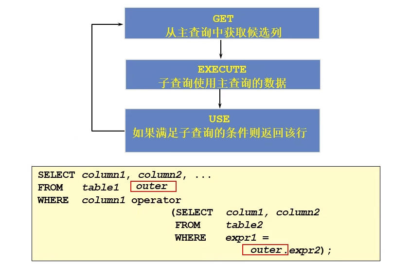

# 子查询

## 子查询概念

子查询指一个查询语句嵌套在另一个查询语句内部的查询，这个特性从 MySQL 4.1 开始引入。

在特定情况下，一个查询语句的条件需要另一个查询语句来获取，内层查询（inner query）语句的查询结果，可以为外层查询（outer query）语句提供查询条件。

> 内层查询即子查询，外层查询即主查询，只是叫法不同而已。

### **查询需求**

+ 查询公司之中工资最低的员工信息
  + 工资最低是多少？
  + 工资最低的员工是谁？

```mysql
SELECT * FROM emp WHERE sal=(SELECT MIN(sal) FROM emp);
```

### 子查询规范

1. 子查询必须放在小括号中
2. 子查询一般放在比较操作符的右边，以增强代码可读性
3. 子查询可以出现在几乎所有的SELECT字句中（如：SELECT、FROM、WHERE、ORDER BY、HAVING子句）


### 子查询分类

**根据子查询返回的数据分类**：

+ 标量子查询(scalar subquery)：返回1行1列一个值
+ 行子查询(row subquery)：返回的结果集是 1 行 N 列
+ 列子查询(column subquery)：返回的结果集是 N 行 1列
+ 表子查询(table subquery)：返回的结果集是 N 行 N 列

> 子查询可以返回一个标量(就一个值)、一个行、一个列或一个表，这些子查询分别称之为标量、行、列和表子查询。


**根据子查询和主查询之间是否有条件关联分类：**

+ 相关子查询：两个查询之间有一定的条件关联(相互联系)
+ 不相关子查询：两个查询之间没有条件关联(相互独立)


为了方便，对于在何处使用子查询给大家给出几点个人建议：

+ 子查询出现在**WHERE**子句中：此时子查询返回的结果一般都是单列单行、单行多列、多行单列
+ 子查询出现在**HAVING**子句中：此时子查询返回的都是单行单列数据，同时为了使用统计函数操作
+ 子查询出现在**FROM**子句中：此时子查询返回的结果图一般都是多行多列，可以按照一张数据表(临时表)的形式操作


## 标量子查询

> 子查询返回的是单行单列的数据，就是一个值

+ 查询出基本工资比ALLEN低的全部员工信息

```mysql
SELECT * FROM emp WHERE sal<(SELECT sal FROM emp WHERE eanme='ALLEN');
```

+ 查询基本工资高于公司平均工资的全部员工信息

```mysql
SELECT * FROM emp WHERE sal>(SELECT AVG(sal) FROM emp);
```

+ 查询出与ALLEN从事同一工作，并且基本工资高于员工编号为7521的全部员工信息

```mysql
SELECT * FROM emp WHERE job=(SELECT job FROM emp WHERE ename='ALLEN') 
AND sal>(SELECT sal FROM emp WHERE empno=7521)
#把ALLEN自己去掉
AND ename<>'ALLEN';
```


## 单行子查询

> 子查询返回的是单行多列的数据，就是一条记录

+ 查询与SCOTT从事统一工作且工资相同的员工信息

```mysql
SELECT * FROM emp WHERE (job,sal)=(SELECT job,sal FROM emp WHERE ename='SCOTT')
AND ename<>'SCOTT';
```

+ 查询与员工编号为7566从事统一工作且领导相同的全部员工信息

```mysql
SELECT * FROM emp WHERE (job,mgr)=(SELECT job,mgr FROM emp WHERE empno=7566)
AND emp<>7566;
```


## 列子查询(多行子查询)

> 子查询返回的是多行单列的数据，就是一列数据。多行子查询也称为集合比较子查询，

在使用多行子查询需要使用多行比较操作符：

| 操作符 | 含义                                                         |
| ------ | ------------------------------------------------------------ |
| IN     | 等于列表中的任意一个                                         |
| ANY    | 需要和单行比较操作符一起使用(>、<、=、<>...)，与子查询结果中任何一个值比较，一个成立 |
| ALL    | 需要和单行比较操作符一起使用(>、<、=、<>...)，和子查询返回的所有值比较，同时成立 |
| SOME   | 实际上是ANY的别名，作用相同，一般用ANY                       |

### IN操作符

IN 运算符用来判断表达式的值是否位于给出的列表中；如果是，返回值为 1，否则返回值为 0。

NOT IN 的作用和 IN 恰好相反，NOT IN 用来判断表达式的值是否不存在于给出的列表中；如果不是，返回值为 1，否则返回值为 0。

+ 查询出与每个部门中最低工资相同的员工信息
  + 按照部门分组，统计每个部门的最低工资
  + 根据最低工资查询出员工信息

```mysql
SELECT * FROM emp WHERE sal IN(SELECT MIN(sal) FROM emp GROUP BY deptno)
AND deptno IS NOT NULL;
```


### ANY操作符

ANY关键字是一个MySQL运算符，如果子查询条件中ANY的比较结果为TRUE，则它会**返回布尔值TRUE** 。

+ 查询工资比任何管理工资都要高的员工信息
  + 查找出每个管理的薪资
  + 每个员工的薪资与每个管理的薪资比较

```mysql
SELECT * FROM emp WHERE sal >ANY(
SELECT MIN(sal) FROM emp WHERE job='MANAGER' GROUP BY deptno);
```


### ALL操作符

ALL关键字是一个MySQL运算符，如果子查询条件中ALL的比较结果为TRUE，则它会**返回布尔值TRUE** 。

+ 案例同ANY操作符


## 表子查询

> 子查询返回的是多行多列的数据，就是一个表格
>
> 必须使用 IN、ANY 和 ALL 操作符对子查询返回的结果进行比较

+ 在emp表中，得到与10号部门任何一个员工入职日期和领导相同的员工信息(用在where子句中)

```mysql
SELECT * FROM emp
WHERE (DATE_FORMAT(hiredate,'%Y'),mgr) IN (SELECT DATE_FORMAT(hiredate,'%Y') hiryear,mgr FROM emp WHERE deptno=10);
```

+ 查询出每个部门的编号、名称、位置、部门人数、平均工资（用在from子句中）

```mysql
#以前学的多表联合查询
SELECT d.deptno,d.dname,d.loc,COUNT(e.deptno),ROUND(AVG(sal),2) FROM
dept d LEFT JOIN emp e
ON e.deptno=d.deptno
GROUP BY d.deptno,d.dname,d.loc;

#用子查询联合查询
SELECT dept.deptno,dept.dname,dept.loc,d.count,d.avgsal FROM dept LEFT JOIN 
(SELECT deptno,COUNT(*) count,AVG(sal) avgsal  FROM emp GROUP BY deptno) d
ON dept.deptno=d.deptno;
```

+ 查询出所有在'SALES'部门工作的员工编号、姓名、基本工资、奖金、职位、雇佣日期、部门的最高和最低工资。(where和from子句同时使用)

```mysql
#1
SELECT e.empno,e.ename,e.sal,e.comm,e.job,e.hiredate,minsal,maxsal,e.deptno  
FROM emp e JOIN 
(SELECT deptno,MIN(sal) minsal,MAX(sal) maxsal FROM emp GROUP BY deptno) td
ON e.deptno=td.deptno AND e.deptno=(SELECT deptno FROM dept WHERE dname='SALES');

#2
SELECT e.empno,e.ename,e.sal,e.comm,e.job,e.hiredate,minsal,maxsal,e.deptno  
FROM emp e JOIN 
(SELECT deptno,MIN(sal) minsal,MAX(sal) maxsal FROM emp GROUP BY deptno
HAVING deptno=(SELECT deptno FROM dept WHERE dname='SALES')) td
ON e.deptno=td.deptno;
```


+ 查询出比‘ALLEN’或‘CLACRK’薪资多的所有员工的编号、姓名、基本工资、部门名称、领导姓名、部门人数。

```mysql
#隐式方式
SELECT e.empno,e.ename,e.sal,d.dname,me.ename 领导,temp.count FROM emp e,dept d,emp me,
(SELECT deptno,COUNT(deptno) count FROM emp e GROUP BY deptno) temp
WHERE e.deptno=d.deptno AND e.mgr=me.empno AND temp.deptno=e.deptno
AND e.sal >ANY(SELECT sal FROM emp WHERE ename IN('ALLEN','CLARK'))
AND e.ename NOT IN('ALLEN','CLARK');

#显示方式
SELECT e.empno,e.ename,e.sal,d.dname,me.ename 领导,temp.count 
FROM emp e 
JOIN dept d ON e.deptno=d.deptno
LEFT JOIN emp me ON e.mgr=me.empno
JOIN (SELECT deptno,COUNT(deptno) count FROM emp e GROUP BY deptno) temp ON temp.deptno=e.deptno
AND e.sal >ANY(SELECT sal FROM emp WHERE ename IN('ALLEN','CLARK'))
AND e.ename NOT IN('ALLEN','CLARK');
```


+ 列出公司各个部门的经理(假设每个部门只有一个经理，job为‘MANAGER’)的姓名、薪资、部门名称、部门人数、部门平均工资。

```mysql
#隐式方式
SELECT e.ename,e.sal,d.dname,temp.count,temp.avgsal
FROM emp e,dept d,(SELECT deptno, COUNT(deptno) count,AVG(sal) avgsal FROM emp GROUP BY deptno) temp
 WHERE job='MANAGER' AND e.deptno=d.deptno AND temp.deptno=e.deptno;
 
 #显示方式
SELECT e.ename,e.sal,d.dname,temp.count,temp.avgsal
FROM emp e 
JOIN dept d ON e.deptno=d.deptno 
JOIN (SELECT deptno, COUNT(deptno) count,AVG(sal) avgsal FROM emp GROUP BY deptno) temp ON temp.deptno=e.deptno
 AND job='MANAGER';
```

+ 查询出所有薪资高于公司平均薪资的员工编号、姓名、基本工资、职位、雇佣日期、所在部门名称、部门位置、上级领导姓名、工资等级、部门人数、平均工资、平均服务年限。

```mysql
#隐式方式
SELECT e.empno,e.ename,e.sal,e.job,e.hiredate,d.dname,d.loc,me.ename 领导,s.grade,temp.count,temp.avgsal,temp.avgyear
FROM emp e,dept d,emp me,salgrade s,(SELECT deptno,COUNT(deptno) count,AVG(sal) avgsal,AVG(TIMESTAMPDIFF(MONTH,hiredate,CURDATE())/12) avgyear FROM emp GROUP BY deptno) temp 
WHERE e.deptno=d.deptno AND e.sal>(SELECT AVG(sal) FROM emp)
AND e.mgr=me.empno
AND e.sal BETWEEN s.losal AND s.hisal
AND temp.deptno=e.deptno;

#显示方式
SELECT e.empno,e.ename,e.sal,e.job,e.hiredate,d.dname,d.loc,me.ename 领导,s.grade,temp.count,temp.avgsal,temp.avgyear
FROM emp e 
JOIN dept d ON e.deptno=d.deptno AND e.sal>(SELECT AVG(sal) FROM emp)
LEFT JOIN emp me ON e.mgr=me.empno
JOIN salgrade s ON e.sal BETWEEN s.losal AND s.hisal
JOIN (SELECT deptno,COUNT(deptno) count,AVG(sal) avgsal,AVG(TIMESTAMPDIFF(MONTH,hiredate,CURDATE())/12) avgyear FROM emp GROUP BY deptno) temp ON temp.deptno=e.deptno;
```

## 在HAVING子句中使用子查询

+ 查询部门编号、员工人数、平均工资，并且要求这些部门的平均工资高于公司平均薪资。

```mysql
SELECT deptno,COUNT(deptno) cnt,AVG(sal) avgsal 
FROM emp 
GROUP BY deptno
HAVING avgsal>
(
	SELECT AVG(sal) FROM emp
);
```

+ 查询出所有部门中平均工资最高的部门名称及平均工资

```mysql
SELECT e.deptno,d.dname,ROUND(AVG(sal),2) avgsal
FROM emp e,dept d
WHERE e.deptno=d.deptno
GROUP BY e.deptno
HAVING avgsal>
(
    #查询出所有部门平均工资中最高的薪资
	 SELECT MAX(avgsal) FROM 
		(SELECT AVG(sal) avgsal FROM emp GROUP BY deptno) AS temp
)
```


## 在SELECT字句中使用子查询

+ 查询出公司每个部门的编号、名称、位置、部门人数、平均工资

```mysql
#1多表查询
SELECT d.deptno,d.dname,d.loc,COUNT(e.deptno),AVG(e.sal)
FROM emp e,dept d
WHERE e.deptno=d.deptno
GROUP BY e.deptno;
#2
SELECT d.deptno,d.dname,d.loc,temp.cnt,temp.avgsal
FROM dept d,(SELECT deptno,COUNT(deptno) cnt,AVG(sal) avgsal FROM emp GROUP BY deptno) temp
WHERE d.deptno=temp.deptno;
#3 关联子查询
SELECT d.deptno,d.dname,d.loc,
(SELECT COUNT(deptno) FROM emp WHERE deptno=d.deptno GROUP BY deptno) cnt,
(SELECT AVG(sal) FROM emp WHERE deptno=d.deptno GROUP BY deptno) avgsal
FROM dept d;
```

# 相关子查询

如果子查询的执行依赖外部查询，通常情况下都是因为子查询中的表用到了外部的表，并进行了条件关联，因此每执行一次外部查询，子查询都要重新计算一次，这样的子查询就成为关联子查询。

相关子查询按照一行接一行的顺序指针，主查询的每一行都指向一次子查询。



## 查询需求

+ 查询员工中工资大于本部门平均工资的员工的部门编号、姓名、薪资

```mysql

```


# 其他语句

## WITH字句

+ 查询每个部门的编号、名称、位置、部门平均工资、人数

```mysql
-- 多表查询
SELECT d.deptno,d.dname,d.loc,AVG(e.sal) avgsal ,COUNT(e.deptno) cnt
FROM dept d,emp e
WHERE d.deptno=e.deptno
GROUP BY e.deptno;

-- 子查询
SELECT d.deptno,d.dname,d.loc,temp.avgsal,temp.cnt
FROM dept d,(
							SELECT deptno,AVG(sal) avgsal,COUNT(deptno) cnt
							FROM emp
							GROUP BY deptno
						)temp
WHERE d.deptno=temp.deptno;

-- 使用with
WITH temp AS(
							SELECT deptno,AVG(sal) avgsal,COUNT(deptno) cnt
							FROM emp
							GROUP BY deptno
						)
SELECT d.deptno,d.dname,d.loc,temp.avgsal,temp.cnt
FROM dept d,temp
WHERE d.deptno=temp.deptno;
									
```

+ 查询每个部门工资最高的员工编号、姓名、职位、雇佣日期、工资、部门编号、部门名称，显示的结果按照部门编号进行排序

```mysql
-- 相关子查询
SELECT e.empno,e.ename,e.job,e.hiredate,e.sal,e.deptno,d.dname
FROM emp e,dept d
WHERE e.deptno=d.deptno
AND e.sal=(SELECT MAX(sal) FROM emp WHERE deptno=e.deptno)
ORDER BY e.deptno;
-- 表子查询
SELECT e.empno,e.ename,e.job,e.hiredate,e.sal,e.deptno,d.dname
FROM emp e,dept d,(SELECT deptno,MAX(sal) maxsal FROM emp GROUP BY deptno) temp
WHERE e.deptno=d.deptno
AND e.sal=temp.maxsal
AND e.deptno = temp.deptno
ORDER BY e.deptno;
```


## EXISTS/NOT EXISTS

在SQL中提供了一个exixts结构用于判断子查询是否有数据返回。如果子查询中有数据返回，exists结构返回true，否则返回false。

+ 查询公司管理者的编号、姓名、工作、部门编号

```mysql
-- 多表查询
SELECT DISTINCT e.empno,e.ename,e.job,e.deptno
FROM emp e JOIN emp mgr
ON e.empno=mgr.mgr;
-- 使用EXISTS
SELECT e.empno,e.ename,e.job,e.deptno
FROM emp e
WHERE EXISTS (SELECT * FROM emp WHERE e.empno=mgr);
```

+ 查询部门表中，不存在于员工表中的部门信息

```mysql
-- 多表查询
SELECT e.deptno,d.deptno,d.dname,d.loc
FROM emp e RIGHT JOIN dept d
ON e.deptno=d.deptno
WHERE e.deptno IS NULL;

-- 使用EXISTS
SELECT d.deptno,d.dname,d.loc
FROM  dept d
WHERE NOT EXISTS (SELECT deptno FROM emp WHERE deptno=d.deptno);
```


[简单易懂教你学会SQL关联子查询](https://zhuanlan.zhihu.com/p/41844742)

[查询](https://www.cnblogs.com/geaozhang/p/6756825.html)

