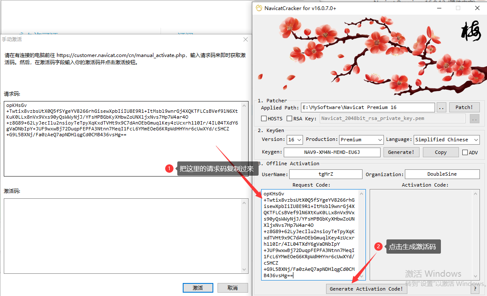

# 安装Navicat  Primium 16

Navicat Premium 是一套可创建多个连接的数据库开发工具，让你从单一应用程序中同时连接 MySQL、Redis、MariaDB、MongoDB、SQL Server、Oracle、PostgreSQL 和 SQLite 。它与 GaussDB 主备版、OceanBase 数据库及 Amazon RDS、Amazon Aurora、Amazon Redshift、Amazon ElastiCache、Microsoft Azure、Oracle Cloud、MongoDB Atlas、Redis Enterprise Cloud、阿里云、腾讯云和华为云等云数据库兼容。你可以快速轻松地创建、管理和维护数据库。

**1.下载Navicat  Primium 16**

**2.下载NavicatCracker.exe**

**3.安装Navicat  Primium**

按步骤安装即可，安装完毕后先不要打开软件，断开网络连接，一定要断开！！！

然后将激活工具复制到Navicat安装路径下，如下图所示。

右键选择“以管理员身份运行”NavicatCracker.exe，Patcher选择Navicat16安装目录，然后点击Patch按钮

然后在弹出的对话框中，点击是按钮。

接下来点击generate生成！

打开Navicat Premium 16，点击注册！

肯定会激活失败的，因为咱们已经断网了，点击手动激活即可！

ok！激活成功！

