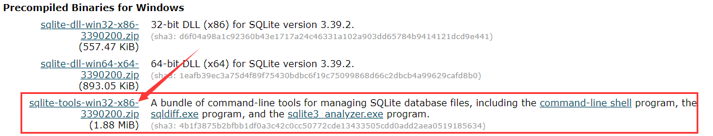
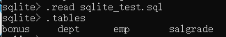
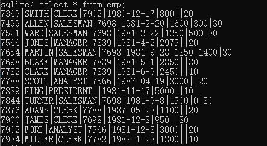
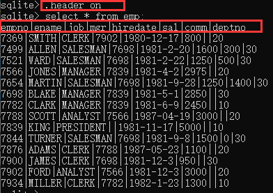
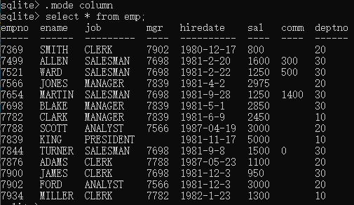
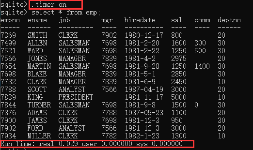
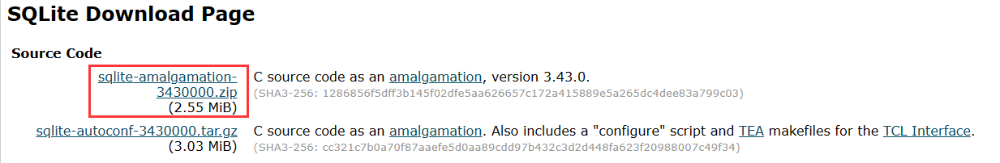
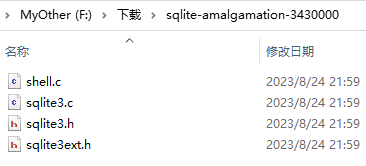

# SQLite 教程

## SQLite 介绍

### 什么是 SQLite？

SQLite 是一个软件库，实现了自给自足的、无服务器的、零配置的、事务性的 SQL 数据库引擎。SQLite 是在世界上最广泛部署的 SQL 数据库引擎。SQLite 源代码不受版权限制。

它是一个零配置的数据库，这意味着与其他数据库不一样，您不需要在系统中配置。SQLite 引擎不是一个独立的进程，可以按应用程序需求进行静态或动态连接。SQLite 直接访问其存储文件。

### 为什么要用 SQLite？

- 不需要一个单独的服务器进程或操作的系统（无服务器的）。
- SQLite 不需要配置，这意味着不需要安装或管理。
- 一个完整的 SQLite 数据库是存储在一个单一的跨平台的磁盘文件。
- SQLite 是非常小的，是轻量级的，完全配置时小于 400KiB，省略可选功能配置时小于250KiB。
- SQLite 是自给自足的，这意味着不需要任何外部的依赖。
- SQLite 事务是完全兼容 ACID 的，允许从多个进程或线程安全访问。
- SQLite 支持 SQL92（SQL2）标准的大多数查询语言的功能。
- SQLite 使用 ANSI-C 编写的，并提供了简单和易于使用的 API。
- SQLite 可在 UNIX（Linux, Mac OS-X, Android, iOS）和 Windows（Win32, WinCE, WinRT）中运行。

### SQLite 局限性

在 SQLite 中，SQL92 不支持的特性如下所示：

| 特性             | 描述                                                         |
| :--------------- | :----------------------------------------------------------- |
| RIGHT OUTER JOIN | 只实现了 LEFT OUTER JOIN。                                   |
| FULL OUTER JOIN  | 只实现了 LEFT OUTER JOIN。                                   |
| ALTER TABLE      | 支持 RENAME TABLE 和 ALTER TABLE 的 ADD COLUMN variants 命令，不支持 DROP COLUMN、ALTER COLUMN、ADD CONSTRAINT。 |
| Trigger 支持     | 支持 FOR EACH ROW 触发器，但不支持 FOR EACH STATEMENT 触发器。 |
| VIEWs            | 在 SQLite 中，视图是只读的。您不可以在视图上执行 DELETE、INSERT 或 UPDATE 语句。 |
| GRANT 和 REVOKE  | 可以应用的唯一的访问权限是底层操作系统的正常文件访问权限。   |

### SQLite 命令

与关系数据库进行交互的标准 SQLite 命令类似于 SQL。命令包括 CREATE、SELECT、INSERT、UPDATE、DELETE 和 DROP。这些命令基于它们的操作性质可分为以下几种：

#### DDL - 数据定义语言

| 命令   | 描述                                                   |
| :----- | :----------------------------------------------------- |
| CREATE | 创建一个新的表，一个表的视图，或者数据库中的其他对象。 |
| ALTER  | 修改数据库中的某个已有的数据库对象，比如一个表。       |
| DROP   | 删除整个表，或者表的视图，或者数据库中的其他对象。     |

#### DML - 数据操作语言

| 命令   | 描述           |
| :----- | :------------- |
| INSERT | 创建一条记录。 |
| UPDATE | 修改记录。     |
| DELETE | 删除记录。     |

#### DQL - 数据查询语言

| 命令   | 描述                           |
| :----- | :----------------------------- |
| SELECT | 从一个或多个表中检索某些记录。 |

## SQLite安装

SQLite 的一个重要的特性是零配置的，这意味着不需要复杂的安装或管理。

- 请访问 [SQLite 下载页面](http://www.sqlite.org/download.html)，从 Windows 区下载预编译的二进制文件。

  

- 创建文件夹 `F:\Tools\SQLite`，并在此文件夹下解压下载的压缩文件，将得到 sqldiff.exe、sqlite3.exe 和 sqlite3_analyzer.exe 文件。

- 添加  `F:\Tools\SQLite` 到 PATH 环境变量，最后在命令提示符下，使用 **sqlite3** 命令，将显示如下结果。

```sh
C:\Users\Maye>sqlite3
SQLite version 3.39.2 2022-07-21 15:24:47
Enter ".help" for usage hints.
Connected to a transient in-memory database.
Use ".open FILENAME" to reopen on a persistent database.
sqlite>
```

## 数据库管理

### 创建数据库

+ 使用`sqlite3`命令创建数据库

```sh
sqlite3 <database_name>
```

+ 另外我们也可以使用 **.open** 来建立新的数据库文件

```sh
sqlite>.open <database_name>
```

**示例：**

```sh
sqlite>.open test.db
```

上面的命令创建了数据库文件 test.db，位于 sqlite3 命令同一目录下。

打开已存在数据库也是用 **.open** 命令，以上命令如果 **test.db** 存在则直接会打开，不存在就创建它。

### 导入测试数据

要学习SQL查询语句，首先必须解决一个问题，数据问题。

为了方便大家学习，在视频目录中提供了一个test.sql文件。

打开Sqlite数据库，输入`.read sqlite_test.sq`导入sql文件，sql文件实际上是一个脚本文件，里面有多行SQL语句，通过.read命令可以批量执行。

执行成功后，可以使用`.tables`命令查看所有表。



可以发现有了四个表，这就是咱们需要的。

### SQLite命令

#### 简介

本章将向您讲解 SQLite 编程人员所使用的简单却有用的命令。这些命令被称为 SQLite 的点命令，这些命令的不同之处在于它们不以分号 **;** 结束。

让我们在命令提示符下键入一个简单的 **sqlite3** 命令，在 SQLite 命令提示符下，您可以使用各种 SQLite 命令。

```powershell
$ sqlite3
SQLite version 3.39.2 2022-07-21 15:24:47
Enter ".help" for usage hints.
Connected to a transient in-memory database.
Use ".open FILENAME" to reopen on a persistent database.
sqlite>
```

如需获取可用的点命令的清单，可以在任何时候输入 ".help"。例如：

```powershell
sqlite>.help
```

上面的命令会显示各种重要的 SQLite 点命令的列表，如下所示：

| 命令                  | 描述                                                         |
| :-------------------- | :----------------------------------------------------------- |
| .backup ?DB? FILE     | 备份 DB 数据库（默认是 "main"）到 FILE 文件。                |
| .bail ON\|OFF         | 发生错误后停止。默认为 OFF。                                 |
| .databases            | 列出数据库的名称及其所依附的文件。                           |
| .dump ?TABLE?         | 以 SQL 文本格式转储数据库。如果指定了 TABLE 表，则只转储匹配 LIKE 模式的 TABLE 表。 |
| .echo ON\|OFF         | 开启或关闭 echo 命令。                                       |
| .exit                 | 退出 SQLite 提示符。                                         |
| .explain ON\|OFF      | 开启或关闭适合于 EXPLAIN 的输出模式。如果没有带参数，则为 EXPLAIN on，即开启 EXPLAIN。 |
| .header(s) ON\|OFF    | 开启或关闭头部显示。                                         |
| .help                 | 显示消息。                                                   |
| .import FILE TABLE    | 导入来自 FILE 文件的数据到 TABLE 表中。                      |
| .indices ?TABLE?      | 显示所有索引的名称。如果指定了 TABLE 表，则只显示匹配 LIKE 模式的 TABLE 表的索引。 |
| .load FILE ?ENTRY?    | 加载一个扩展库。                                             |
| .log FILE\|off        | 开启或关闭日志。FILE 文件可以是 stderr（标准错误）/stdout（标准输出）。 |
| .mode MODE            | 设置输出模式，MODE 可以是下列之一：**csv** 逗号分隔的值**column** 左对齐的列**html** HTML 的 <table> 代码**insert** TABLE 表的 SQL 插入（insert）语句**line** 每行一个值**list** 由 .separator 字符串分隔的值**tabs** 由 Tab 分隔的值**tcl** TCL 列表元素 |
| .nullvalue STRING     | 在 NULL 值的地方输出 STRING 字符串。                         |
| .output FILENAME      | 发送输出到 FILENAME 文件。                                   |
| .output stdout        | 发送输出到屏幕。                                             |
| .print STRING...      | 逐字地输出 STRING 字符串。                                   |
| .prompt MAIN CONTINUE | 替换标准提示符。                                             |
| .quit                 | 退出 SQLite 提示符。                                         |
| .read FILENAME        | 执行 FILENAME 文件中的 SQL。                                 |
| .schema ?TABLE?       | 显示 CREATE 语句。如果指定了 TABLE 表，则只显示匹配 LIKE 模式的 TABLE 表。 |
| .separator STRING     | 改变输出模式和 .import 所使用的分隔符。                      |
| .show                 | 显示各种设置的当前值。                                       |
| .stats ON\|OFF        | 开启或关闭统计。                                             |
| .tables ?PATTERN?     | 列出匹配 LIKE 模式的表的名称。                               |
| .timeout MS           | 尝试打开锁定的表 MS 毫秒。                                   |
| .width NUM NUM        | 为 "column" 模式设置列宽度。                                 |
| .timer ON\|OFF        | 开启或关闭 CPU 定时器。                                      |

> 确保 sqlite> 提示符与点命令之间没有空格，否则将无法正常工作。

#### 格式化输出

我们来查询一下emp表中的数据。

```cpp
select * from emp;
```



##### 显示表头(.header on)

sqlite数据库使用sql查询，默认是不显示表头的。可以使用`.header on`开启表头显示，然后再次查询即可！



##### 按列显示(.mode column)

上面虽然把表头显示出来了，但表头和数据没有对齐，还是不太方便查看，怎么办呢？

可以使用`.mode column`指令来让数据按列的方式整齐的显示出来。



##### 显示执行时间(.timer on)

还可以使用`.timer on`指令来显示sql运行时间。



#### sqlite_master 表格

主表中保存数据库表的关键信息，并把它命名为 **sqlite_master**。如要查看表概要，可按如下操作：

```
sqlite>.schema sqlite_master
```

这将产生如下结果：

```
CREATE TABLE sqlite_master (
  type text,
  name text,
  tbl_name text,
  rootpage integer,
  sql text
);
```

### 查询

> 查询基本MySql一致，不再赘述，[菜鸟教程](https://www.runoob.com/sqlite/sqlite-tutorial.html)里有详细使用。


## C API

### 配置

前面我们使用的都是命令行工具，要在C语言中使用sqlite3，需要下载源代码。

+ 进入[SQLite Download Page](https://www.sqlite.org/download.html)，下载源码包



+ 下载完成之后解压，得到两个头文件和两个源文件



+ 只需要其中的sqlite3.c、sqlite.h即可！放到自己项目中即可使用。

### 打开和关闭

```c
#include"sqlite3/sqlite3.h"
#include<stdio.h>
int main()
{
```

先包含头文件，为了方便管理源代码，我将`sqlite3.h`和`sqlite3.c`放入了sqlite3文件夹。

```c
	sqlite3* db = NULL;
	sqlite3_open("student.db", &db);
```

使用`sqlite3_open`函数打开数据库文件，如果不存在会创建。第一个参数指定数据库名，一般以.db作为拓展名。第二个参数需要数据库连接句柄，在使用之前先定义，这是一个传出参数，所以需要传递二级指针。

```c
	sqlite3_close(db);
	return 0;
}
```

使用完毕之后需要使用`sqlite3_close`函数来关闭数据库连接。

### 执行SQL

#### 基本增删查改

打开sqlite数据库之后，可以执行SQL语句，进行增删查改。

```c
	int ret = 0;
	ret = sqlite3_exec(db, "CREATE TABLE students(id INT PRIMARY KEY,name VARCHAR(20),dept VARCHAR(30),chinese REAL,math REAL,english REAL)",
		NULL, NULL, NULL);
	if (ret != SQLITE_OK)
	{
		printf("%s\n", sqlite3_errmsg(db));
	}
```

使用`sqlite3_exec`在指定的连接上执行SQL语句，第二个参数是需要执行的SQL语句；第三个参数是执行SQL语句的回调，对于创建语句没有作用；第四个参数是用户自定义的数据；第五个参数是当执行语句发送错误时传出的错误字符串。

返回0表示成功，否则失败；失败后可以通过`sqlite3_errmsg`函数获取错误字符串。

查询、修改、删除案例代码如下：

```c
	//查询数据
	printf("SELECT\n");
	int number = 999;
	ret = sqlite3_exec(db, "SELECT * FROM students", callback, &number, NULL);
	if (ret != SQLITE_OK)
	{
		printf("%s\n", sqlite3_errmsg(db));
		return -1;
	}
	//修改数据
	printf("UPDATE\n");
	ret = sqlite3_exec(db, "UPDATE students SET name='maye' WHERE id=100",NULL, NULL, NULL);
	if (ret != SQLITE_OK) 
	{
		printf("%s\n", sqlite3_errmsg(db));
		return -1;
	}
	//删除数据
	printf("DELETE\n");
	ret = sqlite3_exec(db, "DELETE FROM students WHERE id=100",NULL, NULL, NULL);
	if (ret != SQLITE_OK)
	{
		printf("%s\n", sqlite3_errmsg(db));
		return -1;
	}
```

callback回调函数如下：

```c
int callback(void* arg, int colums, char** fileds, char** filedNames)
{
	//输出用户自定的数据以及查询到的列数
	printf("arg:%d colums：%d\n",*(int*)arg, colums);
	//输出字段名
	for (size_t i = 0; i < colums; i++)
	{
		printf("%s ", filedNames[i]);
	}
	printf("\n");
	//输出字段对应的值
	for (size_t i = 0; i < colums; i++)
	{
		printf("%s ", fileds[i]);
	}
	printf("\n");
	return 0;
}
```

#### 查询数据

SQLite还提供了另一种查询表的方式，即通过`sqlite3_get_table`函数。

```c
	char** result;	//结果集，字符串一维数组，先放字段，接着存放数据
	int rows;		//记录条数(不包含字段) 
	int columns;	//列数(字段数)
	char* errMsg;	//错误字符串
	rc = sqlite3_get_table(db, "SELECT * FROM students", &result, &rows, &columns, &errMsg);
	if (rc == SQLITE_OK)
	{
		//输出表头
		int idx = 0;
		for (; idx < columns; idx++)
		{
			printf("%s ", result[idx]);
		}
		//输出数据
		for (; idx < columns*(rows +1) ;idx++)
		{
			if (idx % columns == 0)
			{
				printf("\n");
			}
			printf("%s ", result[idx]);
		}
		sqlite3_free_table(result);
		sqlite3_free(errMsg);
	}

```

#### 插入数据

为此解决sqlite3_exec函数执行效率低的问题，就出现了其它更加高效的解决方式：**将sqlite3_exec的功能进行分解，由多个函数共同完成**。这就是本篇要介绍的：

- **sqlite3_prepare_v2()**函数：实现对sql语句(模板)的解析和编译，生成了可以被执行的 sql语句实例
- **sqlite3_stmt()**数据结构：可以理解为一种“准备语句对象”，它可以结合变量使用，进而实现相同操作的循环
- **sqlite3_bind_\*()** 函数：用于绑定赋值变量
- **sqlite3_step()** 函数：用于执行sql语句

相比较使用sqlite3_exec函数，现在这种方式，sql语句的解析和编译只执行了一次，而sqlite3_step执行多次，整体的效率势必大大提升。

```c
	const char* sql = "INSERT INTO students(id,name,dept,chinese,math,english) VALUES(?,?,?,?,?,?)";
	sqlite3_stmt* stmt;
	char* pzTail;
	int rc = sqlite3_prepare_v2(db, sql, strlen(sql), &stmt, &pzTail);
	if (rc == SQLITE_OK)
	{
```

先定义好要执行的SQL语句，要动态绑定的数据用`?`进行占位；

然后定义`sqlite3_stmt`准备语句代码块指针，下面会交给`sqlite3_prepare_v2`函数初始化。

`pzTail`是指向错误的sql语句位置，当发送错误时。

```c
		sqlite3_bind_int(stmt, 1, 103);
		sqlite3_bind_text(stmt, 2, "moying", 6, NULL);
		sqlite3_bind_text(stmt, 3, "土木工程", 12, NULL);
		sqlite3_bind_double(stmt, 4, 59.2);
		sqlite3_bind_double(stmt, 5, 98.5);
		sqlite3_bind_double(stmt, 6, 34);
```

接下来使用绑定语句对数据进行绑定，下标从1开始。

```c
		rc = sqlite3_step(stmt);
		if (SQLITE_DONE == rc)
		{
			printf("stmt 执行完毕~ %s\n", sqlite3_errmsg(db) );
		}
		else 
		{
			printf("stmt 执行失败~ %s\n", sqlite3_errmsg(db));
		}
```

`sqlite3_step`用来执行编译后的语句

```c
sqlite3_reset(stmt);
```


```c

		
		sqlite3_finalize(stmt);
	}
	else
	{
		printf("prepare failed:%s %s\n", sqlite3_errmsg(db),pzTail);
	}

```


## 加密拓展

[GitHub - utelle/SQLite3MultipleCiphers at v1.7.0](https://github.com/utelle/SQLite3MultipleCiphers/tree/v1.7.0)