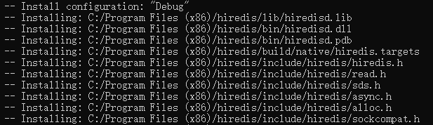
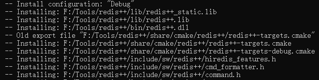

# hiredis

在 C 语言中，通常使用官方推荐的 **Hiredis** 库来连接和操作 Redis 数据库。

## 下载、编译与安装


从[github](https://github.com/redis/hiredis)拉取源码！

```cpp
git clone -b master https://github.com/redis/hiredis.git
```

拉去完毕进入hiredis目录。

```cpp
cd hiredis
```

然后执行cmake命令(把openssl的路径替换成你的,openssl的libcrypto.lib库所在的路径)

> openssl需要安装，[下载安装包](https://slproweb.com/download/Win64OpenSSL-3_3_1.exe)安装即可，在安装目录就有头文件和库文件目录

```sh
cmake -B build --install-prefix "F:/Tools/hiredis"
```

编译并安装(必须以管理员权限打开终端哟~)

```sh
cmake --build build --target INSTALL
#cmake --build build --target INSTALL --config [Debug|Release]
```

> 编译时间稍微有点长，请耐心等待！

库的安装位置如下图所示，可以自己把libhv目录剪切到其他位置



## 环境配置

### cmake

CMakeLists.txt

```cmake
cmake_minimum_required (VERSION 3.10)

project ("test_hiredis")

# 查找hiredis包
find_package(hiredis REQUIRED)

# 将源代码添加到此项目的可执行文件。
add_executable (test_hiredis  main.c)

# 将库链接到目标中
target_link_libraries(test_hiredis hiredis::hiredis)
```

main.c

```c
#include "hiredis/hiredis.h"
....
```

> 注意：在运行程序时，需要把hiredisd.dll拷贝到exe所在的目录中！

## 库使用

### 连接

要想在C语言中操作reids，先要连接到redis服务器。

```c
	//连接redis服务器
	redisContext* ctx = redisConnect("192.168.248.128", 6379);

	//如果上下文是NULL或者有错误，则连接失败
	if (ctx == NULL || ctx->err) {
		if (ctx != NULL) {
			printf("Error: %s\n", ctx->errstr);
		}
		else {
			printf("Can't allocate redis context\n");
		}
		exit(1);
	}
	
	//...redis操作

	//关闭连接
	redisFree(ctx);
```

redisConnect函数用于连接指定IP地址和端口号的redis服务，返回redisContext对象，此对象保存了连接相关信息，后续操作时需要此上下文对象。

在操作完毕后，需要调用redisFree释放上下文对象。

### 发送命令

操作redis需要构造命令并将它们发送到 Redis 服务器。

使用 `redisCommand()` 函数向服务器发送命令，函数原型如下：

```c
void *redisCommand(redisContext *c, const char *format, ...);
```

此函数接收一个 `redisContext` 指针和一个指向包含命令的字符串的指针。命令文本与 `redis-cli` 命令相同。例如，要发出命令：

```c
AUTH 123456
```

> 因为在使用`redisConnect`连接时，不能指定密码，所以必须通过AUTH命令来验证密码。

使用先前的 `redisContext* ctx` 执行以下命令：

```c
	//登录
	//执行redis命令
	redisReply* reply = (redisReply*)redisCommand(ctx, "AUTH 123456");
	printf("Reply: %s\n", reply->str);
```

redisCommand返回的是redisReply，表示一个服务器的响应，我们可以从响应对象中获取服务器响应的结果。

### 处理命令响应

响应可能会为NULL，也有可能你的命令有错误，所以在获取到响应之后必须进行检查。

例如：

```c
	//执行redis命令
	redisReply* reply = (redisReply*)redisCommand(ctx, "AUTH 123456");
	if (!reply || reply->type == REDIS_REPLY_ERROR) {
        if(reply)
			printf("Error: %s\n", reply->str);
        else      
			printf("Error: Unknown\n");
	}
	else {
		printf("Reply: %s\n", reply->str);
	}
	//释放redisReply对象
	freeReplyObject(reply);
	reply = NULL;
```

NULL 回复表示错误，因此应始终进行检查。如果发生错误，则 `redisContext` 对象的整型 `err` 字段将包含非零错误码，其 `errstr` 字段将包含错误的文本描述。

对于 `AUTH` 命令，成功调用将简单地返回一个“OK”字符串，您可以使用 `reply->str` 字段访问它。示例中的代码将其打印到控制台，但您应检查特定值以确保命令正确执行。

`redisCommand()` 调用为回复分配内存，因此在使用完回复后应始终使用 `freeReplyObject()` 释放它。如果想重复使用回复变量，最好在释放后将其设置为 `NULL`，以避免之后意外使用失效的指针。

#### 响应格式

Redis 的 [`RESP`](https://redis.ac.cn/docs/latest/develop/reference/protocol-spec/#resp-protocol-description) 协议支持多种不同的命令回复格式。可以使用回复对象的 `type` 字段来确定格式。此字段包含针对每种类型的不同整数值。`hiredis.h` 头文件为所有这些整数值定义了常量（例如 `REDIS_REPLY_STRING`）。

| 常量                  | 类型                                                         | `redisReply` 的相关字段                                      |
| :-------------------- | :----------------------------------------------------------- | :----------------------------------------------------------- |
| `REDIS_REPLY_STATUS`  | [简单字符串](https://redis.ac.cn/docs/latest/develop/reference/protocol-spec/#simple-strings) | `reply->str`：字符串值 (`char*`)<br>`reply->len`：字符串长度 (`size_t`) |
| `REDIS_REPLY_ERROR`   | [简单错误](https://redis.ac.cn/docs/latest/develop/reference/protocol-spec/#simple-errors) | `reply->str`：字符串值 (`char*`) <br/>`reply->len`：字符串长度 (`size_t`) |
| `REDIS_REPLY_INTEGER` | [整型](https://redis.ac.cn/docs/latest/develop/reference/protocol-spec/#integers) | `reply->integer`：整型值 (`long long`)                       |
| `REDIS_REPLY_NIL`     | [Null](https://redis.ac.cn/docs/latest/develop/reference/protocol-spec/#nulls) | 无数据                                                       |
| `REDIS_REPLY_STRING`  | [批量字符串](https://redis.ac.cn/docs/latest/develop/reference/protocol-spec/#bulk-strings) | `reply->str`：字符串值 (`char*`) <br/>`reply->len`：字符串长度 (`size_t`) |
| `REDIS_REPLY_ARRAY`   | [数组](https://redis.ac.cn/docs/latest/develop/reference/protocol-spec/#arrays) | `reply->elements`：元素数量 (`size_t`) <br/>`reply->element`：数组元素 (`redisReply`) |
| `REDIS_REPLY_DOUBLE`  | [双精度浮点数](https://redis.ac.cn/docs/latest/develop/reference/protocol-spec/#doubles) | `reply->str`：作为字符串的双精度浮点数值 (`char*`) <br/>`reply->len`：字符串长度 (`size_t`) |
| `REDIS_REPLY_BOOL`    | [布尔值](https://redis.ac.cn/docs/latest/develop/reference/protocol-spec/#booleans) | `reply->integer`：布尔值，0 或 1 (`long long`)               |
| `REDIS_REPLY_MAP`     | [Map](https://redis.ac.cn/docs/latest/develop/reference/protocol-spec/#maps) | `reply->elements`：元素数量 (`size_t`) <br/>`reply->element`：数组元素 (`redisReply`) |
| `REDIS_REPLY_SET`     | [Set](https://redis.ac.cn/docs/latest/develop/reference/protocol-spec/#sets) | `reply->elements`：元素数量 (`size_t`) <br/>`reply->element`：数组元素 (`redisReply`) |
| `REDIS_REPLY_PUSH`    | [Push](https://redis.ac.cn/docs/latest/develop/reference/protocol-spec/#pushes) | `reply->elements`：元素数量 (`size_t`) <br/>`reply->element`：数组元素 (`redisReply`) |
| `REDIS_REPLY_BIGNUM`  | [大整数](https://redis.ac.cn/docs/latest/develop/reference/protocol-spec/#big-numbers) | `reply->str`：作为字符串的数值 (`char*`) <br/>`reply->len`：字符串长度 (`size_t`) |
| `REDIS_REPLY_VERB`    | [原样字符串](https://redis.ac.cn/docs/latest/develop/reference/protocol-spec/#verbatim-strings) | `reply->str`：字符串值 (`char*`) <br/>`reply->len`：字符串长度 (`size_t`) <br/>`reply->vtype`：内容类型 (`char[3]`) |

为什么方便使用，我们把连接redis的代码封装成一个函数。

```c
redisContext* connectRedis(const char* host, int port, const char* password)
{
	//连接redis服务器
	redisContext* ctx = redisConnect(host,port);

	//如果上下文是NULL或者有错误，则连接失败
	if (ctx == NULL || ctx->err) {
		if (ctx != NULL) {
			printf("Error: %s\n", ctx->errstr);
		}
		else {
			printf("Can't allocate redis context\n");
		}
		return NULL;
	}

	//登录
	//执行redis命令
	redisReply* reply = (redisReply*)redisCommand(ctx, "AUTH %s",password);
	if (reply->type == REDIS_REPLY_ERROR) {
		printf("Error: %s\n", reply->str);
		return NULL;
	}
	else {
		printf("Reply: %s\n", reply->str);
	}
	//释放redisReply对象
	freeReplyObject(reply);
	return ctx;
}
```

#### string类型

```c
void test_string()
{
	redisContext* ctx = connectRedis("192.168.248.128", 6379, "123456");
	if (ctx == NULL) {
		exit(1);
	}

	redisReply* reply = (redisReply*)redisCommand(ctx, "GET num");
    //"nil" 表示键不存在或未设置值的情况。当我们尝试获取一个未设置值的键时，Redis 会返回 "nil"。
	if (reply->type == REDIS_REPLY_NIL) {
		printf("(nil)\n");
	}
    //"string" 表示键的值是一个字符串。当我们尝试获取一个字符串类型的键时，Redis 会返回该字符串。
	else if (reply->type == REDIS_REPLY_STRING) {
		printf("Reply: %s\n", reply->str);
	}
    //"error" 表示执行命令时发生了错误。当我们尝试执行一个错误的命令时，Redis 会返回该错误信息。
	else /*if (reply->type == REDIS_REPLY_ERROR)*/ {
		printf("Error: %s\n", reply->str);
	}
    freeReplyObject(reply);
    
    reply = (redisReply*)redisCommand(ctx, "SET num 123");
	//"status" 表示命令执行成功。当我们成功执行一个命令时，Redis 会返回"ok" 
	if (reply->type == REDIS_REPLY_STATUS) {
		printf("Reply: %s\n", reply->str);
	}
	else {
		printf("Error: %s\n", reply->str);
	}
    freeReplyObject(reply);
    
    reply = (redisReply*)redisCommand(ctx, "INCR num");
	//"integer" 表示命令执行成功，并且返回一个整数。当我们成功执行一个返回整数的命令时，Redis 会返回该整数。
	if (reply->type == REDIS_REPLY_INTEGER) {
		printf("Reply: %lld\n", reply->integer);
	}
	else {
		printf("Error: %s\n", reply->str);
	}
	freeReplyObject(reply);
    
  	redisFree(ctx);
}
```

#### list类型

```c
void test_list()
{
	redisContext* ctx = connectRedis("192.168.248.128", 6379, "123456");
	if (ctx == NULL) {
		exit(1);
	}

	redisReply* reply = redisCommand(ctx,"RPUSH list 1 2 3 4 5");
	//向list中添加中添加元素，返回list的长度
	if (reply->type == REDIS_REPLY_INTEGER) {
		printf("Reply list size: %lld\n", reply->integer);
	}
	freeReplyObject(reply);

	reply = redisCommand(ctx, "LRANGE list 0 -1");
	//lrange命令用于获取list中指定范围的元素，返回一个数组
	if (reply->type == REDIS_REPLY_ARRAY) {
		for (int i = 0; i < reply->elements; i++) {
			printf("Reply: %s\n", reply->element[i]->str);
		}
	}
	freeReplyObject(reply);

	redisFree(ctx);
}
```

#### hash类型

```c
void test_hash()
{
	redisContext* ctx = connectRedis("192.168.248.128", 6379, "123456");
	if (ctx == NULL) {
		exit(1);
	}

	//往hash表中插入表中插入数据，返回插入的键值对数量
	redisReply* reply = redisCommand(ctx, "HSET user name maye age 18");
	if (reply->type == REDIS_REPLY_INTEGER) {
		printf("Reply: %lld\n", reply->integer);
	}
	freeReplyObject(reply);

	//获取hash表中指定字段的值，返回一个字符串
	reply = redisCommand(ctx, "HGET user name");
	if (reply->type == REDIS_REPLY_STRING) {
		printf("Reply: %s\n", reply->str);
	}
	freeReplyObject(reply);

	//获取hash表中所有字段和值，返回一个数组
	reply = redisCommand(ctx, "HGETALL user");
	if (reply->type == REDIS_REPLY_ARRAY) {
		for (int i = 0;i < reply->elements;i+=2) {
			printf("%s:%s\n",reply->element[i]->str, reply->element[i + 1]->str);
		}
	}
	freeReplyObject(reply);

	redisFree(ctx);
}
```

#### set类型

```c
void test_set()
{
	redisContext* ctx = connectRedis("192.168.248.128", 6379, "123456");
	if (ctx == NULL) {
		exit(1);
	}

	//往set中添加元素，返回添加的元素数量
	redisReply* reply = redisCommand(ctx, "SADD set 1 2 3 4 5");
	if (reply->type == REDIS_REPLY_INTEGER) {
		printf("Reply: %lld\n", reply->integer);
	}

	//获取set中所有元素，返回一个数组
	reply = redisCommand(ctx, "SMEMBERS set");
	if (reply->type == REDIS_REPLY_ARRAY) {
		for (int i = 0; i < reply->elements; i++) {
			printf("%s ", reply->element[i]->str);
		}
		printf("\n");
	}

	//判断判断set中是否存在指定元素，返回1表示存在，0表示不存在
	reply = redisCommand(ctx, "SISMEMBER set 1");
	if (reply->type == REDIS_REPLY_INTEGER) {
		if (reply->integer)
			printf("1 in set\n");
		else
			printf("1 not in set\n");
	}

	redisFree(ctx);
}
```

#### zset类型

#### BitMap类型

#### HyperLogLog类型

#### Geospatial类型

#### Stream类型


## 连接池

Redis 是基于内存的高性能数据库，但频繁地创建和销毁连接会带来不必要的开销。连接池的作用是预先创建并维护一定数量的连接，供多个线程复用，从而减少连接的创建和销毁次数，提高应用性能。此外，连接池还可以限制最大连接数，防止因过多的并发连接导致 Redis 服务器过载。

### 池连接

池连接能再销毁时，自动把连接放入连接池。

```cpp
class ConnectionPool;
class PooledConnection {
public:
	PooledConnection(redisContext* context, std::function<void(redisContext*)> return_fn = {})
	: _context(context)
	, _return_fn(return_fn)
	{

	}

	~PooledConnection() {
		if (_context && _return_fn) {
			_return_fn(_context);
			_context = nullptr;
		}
	}
	// 禁止拷贝
	PooledConnection(const PooledConnection&) = delete;
	PooledConnection& operator=(const PooledConnection&) = delete;

	//允许移动
	PooledConnection(PooledConnection&& other) noexcept
		: _context(other._context)
		, _return_fn(std::move(other._return_fn)) {
		other._context = nullptr;
	}
	PooledConnection& operator=(PooledConnection&& other)noexcept {
		_context = other._context;
		_return_fn = std::move(other._return_fn);
		other._context = nullptr;
	}

	inline operator redisContext* () {
		return _context;
	}

	inline 	redisContext* get()const {
		return 	_context;
	}

	bool isValid()const {
		return _context != nullptr;
	}

	static bool validate(redisContext* context) {
		redisReply* reply = nullptr;
		reply = (redisReply*)redisCommand(context, "PING");
		//2. 先看底层 I/O 协议层有没有错
		if (context->err) {
			std::printf("Connection error: %s\n", context->errstr);
			if (reply) {
				freeReplyObject(reply);
			}

			redisFree(context);
			return false;
		}

		//3. 再看Redis自身返回的是不是ERROR
		if (!reply || reply->type == REDIS_REPLY_ERROR) {
			std::printf("reply is null,  redis ping failed\n");
			if (reply) {
				freeReplyObject(reply);
			}

			redisFree(context);
			return false;
		}

		//4.如果都没有问题，则把连接返回连接池
		//std::cout << "connection alive" << std::endl;
		freeReplyObject(reply);
		return true;
	}
private:
	redisContext* _context;
	std::function<void(redisContext*)> _return_fn;
};
```

### 连接池实现

```c
class ConnectionPool
{
public:
	ConnectionPool(const std::string& host, uint16_t port, const std::string& pwd, int poolSize)
		:_host(host)
		, _port(port)
		, _pwd(pwd)
		, _poolSize(poolSize)
		, _counter(0)
	{
		for (int i = 0; i < poolSize; i++) {
			auto* context = CreateConnection();
			if (!context) {
				continue;
			}
			_connections.push(context);
		}

		_check_thr = std::thread([this]() {
			while (!_b_stop) {
				_counter++;
				if (_counter >= 10) {
					checkThreadPro();
					_counter = 0;
				}

				std::this_thread::sleep_for(std::chrono::seconds(1)); // 每隔 30 秒发送一次 PING 命令
			}
			});

	}

	~ConnectionPool() {
		close();
		clearConnections();
	}

	void clearConnections() {
		std::lock_guard<std::mutex> lock(_mutex);
		while (!_connections.empty()) {
			auto* context = _connections.front();
			redisFree(context);
			_connections.pop();
		}
	}

	PooledConnection getConnection() {
		std::unique_lock<std::mutex> lock(_mutex);
		_cond.wait(lock, [this] {
			if (_b_stop) {
				return true;
			}
			return !_connections.empty();
			});
		//如果停止则直接返回空指针
		if (_b_stop) {
			return nullptr;
		}
		auto* context = _connections.front();
		_connections.pop();
		return PooledConnection(context, [this](redisContext* con_to_return) {
			std::printf("Return Connection~\n");
			this->returnConnection(con_to_return);
			});
	}

	PooledConnection getConNonBlock() {
		std::lock_guard<std::mutex> lock(_mutex);
		if (_b_stop) {
			return nullptr;
		}

		if (_connections.empty()) {
			return nullptr;
		}

		auto* context = _connections.front();
		_connections.pop();
		return context;
	}

	void returnConnection(redisContext* context) {
		std::lock_guard<std::mutex> lock(_mutex);
		if (_b_stop) {
			return;
		}
		_connections.push(context);
		_cond.notify_one();
	}

	void close() {
		_b_stop = true;
		_cond.notify_all();
		_check_thr.join();
	}
private:
	/** 创建新连接.  */
	redisContext* CreateConnection() {
		auto* context = redisConnect(_host.data(), _port);
		if (context == nullptr || context->err != 0) {
			if (context != nullptr) {
				redisFree(context);
			}
			return nullptr;
		}

		auto reply = (redisReply*)redisCommand(context, "AUTH %s", _pwd.data());
		if (reply->type == REDIS_REPLY_ERROR) {
			std::printf("认证失败：%s\n", reply->str);
			//执行释放操作
			freeReplyObject(reply);
			redisFree(context);
			return nullptr;
		}
		std::printf("认证成功\n");
		freeReplyObject(reply);
		return context;
	}
	void checkThreadPro() {
		size_t pool_size;
		{
			//先拿到当前的连接数
			std::lock_guard<std::mutex> lock(_mutex);
			pool_size = _connections.size();
		}

		//获取连接失效的数量
		for (int i = 0; i < pool_size && !_b_stop; i++) {
			redisContext* context = nullptr;
			//1 取出一个连接(持有锁)
			context = getConNonBlock();
			if (context == nullptr) {
				break;
			}

			//2,验证连接是否有效
			if (!PooledConnection::validate(context)) {
				redisFree(context);
				_fail_count++;
				continue;
			}
		
			//3.如果都没有问题，则把连接返回连接池
			std::printf("connection alive\n");
			returnConnection(context);
		}

		//执行重连操作
		while (_fail_count > 0) {
			auto res = reconnect();
			if (res) {
				_fail_count--;
			}
			else {
				//留给一次再尝试
				break;
			}
		}
	}

	bool reconnect() {
		auto* context = CreateConnection();
		if (!context) {
			return false;
		}
		returnConnection(context);
		return true;
	}
private:
	std::string _host;
	uint16_t _port;
	std::string _pwd;

	std::queue<redisContext*> _connections;
	size_t _poolSize;

	std::atomic<bool> _b_stop;
	std::mutex _mutex;
	std::condition_variable _cond;
	std::thread  _check_thr;
	int _counter;
	std::atomic<int> _fail_count;
};

```


# redis-plus-plus

在 C++ 语言中，我们可以使用`redis-plus-plus` 库来连接和操作 Redis 数据库。该库是基于hiredis开发，所以要确保先安装好`hiredis`库！

## 下载、编译与安装


从[github](https://github.com/sewenew/redis-plus-plus)拉取源码！

```cpp
git clone -b master https://github.com/sewenew/redis-plus-plus.git
```

拉去完毕进入redis-plus-plus目录。

```cpp
cd redis-plus-plus
```

> 打开CMakeLists.txt文件，把cmake_minimum_required(VERSION 3.10)命令，版本号改为3.5以上版本即可。

```sh
cmake -B build -DCMAKE_PREFIX_PATH="F:\Tools\hiredis" -DREDIS_PLUS_PLUS_BUILD_TEST=OFF --install-prefix "F:/Tools/redis++"
```

编译并安装(必须以管理员权限打开终端哟~)

```sh
cmake --build build --target INSTALL
#cmake --build build --target INSTALL --config [Debug|Release]
```

> 编译时间稍微有点长，请耐心等待！

库的安装位置如下图所示，可以自己把redis++目录剪切到其他位置。



## 环境配置

### cmake

CMakeLists.txt

```cmake
cmake_minimum_required (VERSION 3.10)

project ("test_redispp")

# 设置C++标准
set (CMAKE_CXX_STANDARD 17)
set (CMAKE_CXX_STANDARD_REQUIRED ON)

# 查找hiredis和redis++库
find_package (hiredis REQUIRED)
find_package (redis++ REQUIRED)

# 将源代码添加到此项目的可执行文件。
add_executable (${PROJECT_NAME} "test_redis++.cpp" )

target_link_libraries(${PROJECT_NAME} hiredis::hiredis redis++::redis++)
```

main.cpp

```cpp
#include "sw/redis++/redis++.h"
...
```

## 库使用

### 连接

```cpp
// 此时不会建立实际连接
sw::redis::Redis redis("tcp://192.168.248.128:6379");
```

注意：它在创建Redis对象时并不会立即连接，而是在第一次操作时进行连接。但是，我们可能需要确保连接是成功的，或者在某些情况下，我们希望在第一次使用前就建立连接。不过，根据sw::redis的设计，它是惰性连接，所以我们可以通过执行一个命令来触发连接，比如AUTH或PING。

```cpp
// 第一次执行命令时才真正连接
redis.command("AUTH","123456");
```

注意：由于连接可能会失败，所以我们需要处理异常。

验证示例：

```cpp
	try {
		sw::redis::Redis redis("tcp://192.168.248.128:6379");

		redis.command("AUTH","123456");

		printf("连接成功~\n");
	}
	catch (const std::exception& e) {
		printf("connect error: %s\n", e.what());
	}
```

### 发送命令

#### Redis::command

我们可以使用通用的 Redis::command 方法向 Redis 发送任何命令。与其他客户端库不同，Redis::command 不使用格式字符串将命令参数组合成命令字符串。相反，您可以直接将 StringView 类型或算术类型的命令参数作为 Redis:：command 的参数传递。

##### 返回ReplyUPtr

默认的`command`函数返回一个`ReplyUPtr`指针，该指针只是对hiredis中`redisReply*`的简单包装，如下所示：

```cpp
struct ReplyDeleter {
    void operator()(redisReply *reply) const {
        if (reply != nullptr) {
            freeReplyObject(reply);
        }
    }
};

using ReplyUPtr = std::unique_ptr<redisReply, ReplyDeleter>;
```

也就是说`ReplyUPtr`本质上是一个`std::unique_ptr`指针，只不过库实现了删除器而已，这样就能自动销毁Reply对象了！

###### 执行命令

```cpp
try{
    ...
    //如果有错误会抛异常，所以不用判断返回值
	redis.command("SET", "age", 18);

	//有错误抛异常，正常返回才需要获取值
	sw::redis::ReplyUPtr reply = redis.command("GET", "age");
	printf("Reply: %s\n", reply->str);
}
...
```

###### 获取结果

为了方便获取结果，我们可以使用库提供的一些函数，而不用自己通过访问reply来获取结果。

对于**返回单个值**的命令，可以使用`reply::parse<T>(redisReply&)` 来解析reply。

对于**返回数组的**命令，可以使用`void to_array(redisReply &reply, Output output) `来解析reply。

+ 结果是字符串

```cpp
		auto val = sw::redis::reply::parse<sw::redis::OptionalString>(*reply);
		if (val)
			std::cout << std::format("Reply: {}\n", *val) << std::endl;
```

如果key不存在，返回值是nil，所以必须使用OptionalString类型。不存在时val就不存在值，存在就返回key的值。

+ 结果是整型

```cpp
		reply = redis.command("INCRBY", "age", 2);
		auto num = sw::redis::reply::parse<long long>(*reply);
		std::cout << std::format("Reply: {}\n", num) << std::endl;
```

获取结果的类型必须是`long long`，不能是其他类型。

+ 结果是浮点型

```cpp
		reply = redis.command("INCRBYFLOAT", "age", 0.5);
		auto real= sw::redis::reply::parse<double>(*reply);
		std::cout << std::format("Reply: {}\n", real) << std::endl;
```

获取结果的类型必须是`double`，不能是其他类型。

+ 结果是数组

```cpp
		reply = redis.command("KEYS", "*");
		std::vector<sw::redis::OptionalString> keys;
		sw::redis::reply::to_array(*reply,std::back_inserter(keys));
		for (auto& val : keys) {
			if(val)
				std::cout << std::format("key: {} ", *val) << std::endl;
		}
```

+ 结果是map(比如HGETALL的返回结果)

```cpp
		redis.command("HSET", "user:1000", "name", "Tom", "age", 20);

		reply = redis.command("HGETALL", "user:1000");
		std::unordered_map<std::string, std::optional<std::string>> user_100;
		sw::redis::reply::to_array(*reply, std::inserter(user_100, user_100.begin()));
		for (auto& v : user_100) {
			std::cout << std::format("key: {}, value: {}\n", v.first, *v.second) << std::endl;
		}
```

+ command函数的参数还可以是一个字符串区间。

```cpp
		auto cmd_strs = {"GET","age"};
		reply = redis.command(cmd_strs.begin(), cmd_strs.end());
		val = sw::redis::reply::parse<sw::redis::OptionalString>(*reply);
		if(val)
			std::cout<< std::format("Reply: {}\n", *val) << std::endl;
```

##### 返回结果

使用函数能很方便的从reply中获取结果，但是还是不太方便，所以redis++库还提供了`command`重载版本，能直接返回结果！更加方便了！

```cpp
void test_command() {

	try {
		sw::redis::Redis redis("tcp://192.168.248.128:6379");

		redis.command("AUTH", "123456");

		printf("连接成功~\n");

		//结果为字符串
		auto val = redis.command<sw::redis::OptionalString>("GET", "age");
		if (val) {
			std::cout << std::format("Reply: {}", *val) << std::endl;
		}

		//结果为浮点数
		auto num = redis.command<double>("INCRBYFLOAT", "age", 0.5);
		std::cout << std::format("Reply: {}", num) << std::endl;

		//结果为数组
		auto keys = redis.command<std::vector<sw::redis::OptionalString>>("KEYS", "*");
		for (auto& key : keys) {
			if (key) {
				std::cout << std::format("key: {}", *key) << std::endl;
			}
		}

		//结果为数组(map解析为键值对)
		auto user_1000 = redis.command<std::unordered_map<std::string, std::optional<std::string>>>("HGETALL", "user:1000");
		for (auto& [key, value] : user_1000) {
			std::cout << std::format("key: {}, value: {}", key, *value) << std::endl;
		}

	}
	catch (const std::exception& e) {
		printf("connect error: %s\n", e.what());
	}
}
```

#### 专属命令

redis++提供了大量的命令函数，就是把命令包成了函数，能在编写代码时更方便。

所有命令都在`redis++\include\sw\redis++\redis.h`头文件中。

##### server命令

服务器相关命令大概从`218`行开始。

##### key命令

键相关的命令大概从`264`行开始。

##### string命令

字符串相关的命令大概从`626`行开始。

##### list命令

列表相关的命令大概从`1001`行开始。

##### hash命令

哈希表相关的命令大概从`1423`行开始。

##### set命令

集合相关的命令大概从`1795`行开始。

##### zset命令

有序集合相关的命令大概从`2140`行开始。

##### BitMap命令

位图相关的命令大概从`642`行开始。

##### HyperLogLog命令

基数统计相关的命令大概从`3125`行开始。

##### Geospatial命令

地理空间相关的命令大概从`3188`行开始。

##### Stream命令

流相关的命令大概从`3482`行开始。

##### Scripting命令

lua脚本相关的命令大概从`3331`行开始。

##### pub/sub命令

订阅发布模式相关的命令大概从`3463`行开始。

##### Transaction命令

事务相关的命令大概从`3469`行开始。

## 连接池

### 使用连接选项创建连接

除了前面直接在`sw::redis::Redis`类的构造函数中，指定连接url之外，还可以通过连接选项指定连接信息。

```cpp
sw::redis::Redis redis("tcp://192.168.248.128:6379");
```

通过连接选项连接。

```cpp
sw::redis::ConnectionOptions con_options;
con_options.host = "192.168.248.128";
con_options.port = 6379;
con_options.password = "123456";
con_options.db = 0;
con_options.connect_timeout = std::chrono::seconds(6);
auto redis = std::make_shared<sw::redis::Redis>(m_con_options);
```

### 指定连接池选项

```cpp
using namespace std::chrono;
sw::redis::ConnectionPoolOptions pool_options;
pool_options.size =  8;
pool_options.wait_timeout = 10s;
pool_options.connection_idle_time = 10min;
pool_options.connection_lifetime = 10min;
auto redis = std::make_shared<sw::redis::Redis>(con_options, pool_options);
```

指定连接池选项之后，后续就可以在多线程总使用redis，它内部会维护一个连接池，每次执行命令时，会自动从连接池中获取一个连接。

> 创建一个 `Redis` 对象并不便宜，因为它将创建到Redis服务器的新连接。因此，您最好尽可能重用 `Redis` 对象。同时，在多线程环境中调用 `Redis` '成员函数是安全的，并且可以在多线程中共享 `Redis` 对象。
