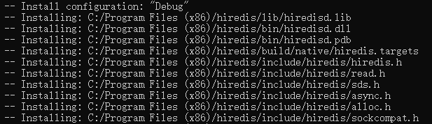
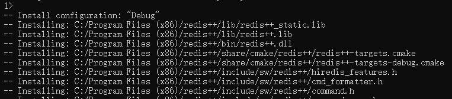

# hiredis

## 下载、编译与安装


从[github](https://github.com/redis/hiredis)拉取源码！

```cpp
git clone -b master https://github.com/redis/hiredis.git
```

拉去完毕进入hiredis目录。

```cpp
cd hiredis
```

然后执行cmake命令(把openssl的路径替换成你的,openssl的libcrypto.lib库所在的路径)

> openssl需要安装，[下载安装包](https://slproweb.com/download/Win64OpenSSL-3_3_1.exe)安装即可，在安装目录就有头文件和库文件目录

```sh
cmake -B build
```

编译并安装(必须以管理员权限打开终端哟~)

```sh
cmake --build build --target INSTALL
#cmake --build build --target INSTALL --config [Debug|Release]
```

> 编译时间稍微有点长，请耐心等待！

库的安装位置如下图所示，可以自己把libhv目录剪切到其他位置



# redis-plus-plus

## 下载、编译与安装


从[github](https://github.com/sewenew/redis-plus-plus)拉取源码！

```cpp
git clone -b master https://github.com/sewenew/redis-plus-plus.git
```

拉去完毕进入redis-plus-plus目录。

```cpp
cd redis-plus-plus
```

> 打开CMakeLists.txt文件，把cmake_minimum_required(VERSION 3.10)命令，版本号改为3.5以上版本即可。

```sh
cmake -B build -DCMAKE_PREFIX_PATH="F:\Tools\hiredis"
```

编译并安装(必须以管理员权限打开终端哟~)

```sh
cmake --build build --target INSTALL
#cmake --build build --target INSTALL --config [Debug|Release]
```

> 编译时间稍微有点长，请耐心等待！

库的安装位置如下图所示，可以自己把redis++目录剪切到其他位置

