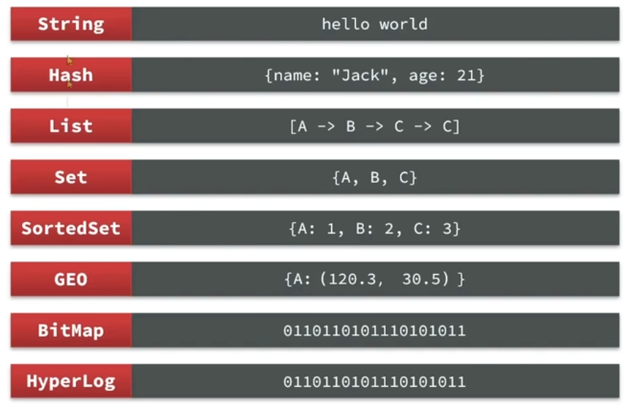
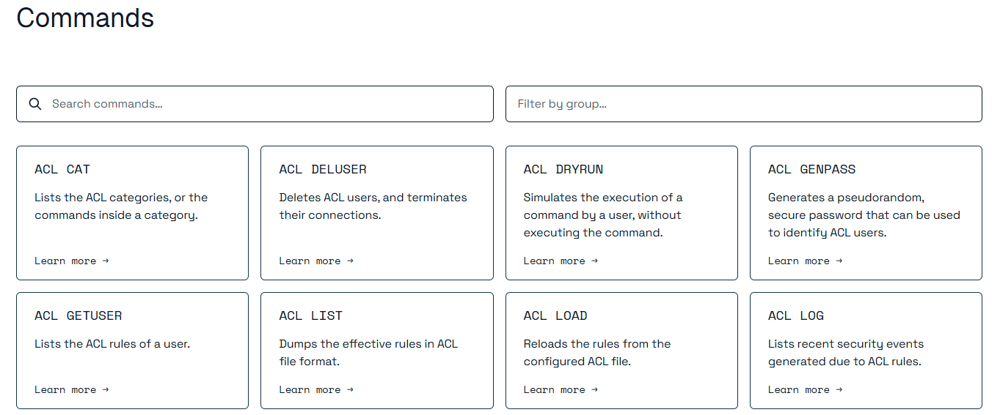
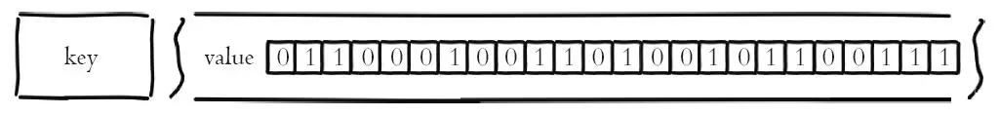

# Redis概述

![[python] redis 模块 -- 实现 python 与 Redis 数据库的结合-CSDN博客](./assets/OIP-C.webp)

**REmote DIctionary Server(Redis) 是一个由 Salvatore Sanfilippo 写的 key-value 存储系统，是跨平台的非关系型数据库。是一个开源的、基于内存的、键值对存储系统，它通常被用作数据库、缓存和消息中间件。**

> 简单来说，你可以把它想象成一个速度极快的、结构灵巧的“超级哈希表”。

Redis 是一个开源的使用 ANSI C 语言编写、遵守 BSD 协议、支持网络、可基于内存、分布式、可选持久性的键值对(Key-Value)存储数据库，并提供多种语言的 API。

Redis 通常被称为数据结构服务器，因为值（value）可以是字符串(String)、哈希(Hash)、列表(list)、集合(sets)和有序集合(sorted sets)等类型。

## 诞生背景

2008 年，Salvatore Sanfilippo（网上称为 antirez） 在开发一个实时统计系统（LLOOGG）时，发现传统数据库（如 MySQL）无法满足每秒数千次读写的需求。他设计了一个基于内存的键值存储系统，将数据存储在内存中以提升性能，并用 C 语言实现了原型。2009 年，他将该项目命名为 Redis 并开源。

Redis 的初始版本支持基本的键值操作和持久化功能，随后逐步发展为支持多种数据结构（如列表、集合、有序集合等）的强大数据库。


## NoSQL

**NoSQL**，即**Not Only SQL**，是一类广泛的持久化解决方案，不遵循传统的关系数据库模型，也不使用SQL作为查询语言。NoSQL数据库可以处理大规模数据，具有高性能和高可扩展性。

### NoSQL的优势

1. **高可扩展性**：NoSQL数据库去掉了关系型数据库的关系特性，数据之间无关系，易于扩展。
2. **高性能**：NoSQL数据库具有高读写性能，尤其在大数据量下表现优秀。
3. **灵活的数据模型**：NoSQL无需事先为数据建立字段，可以随时存储自定义的数据格式。
4. **高可用性**：NoSQL数据库可以方便地实现高可用架构。

### NoSQL不是替代SQL的

NoSQL 不是为了替代 MySQL，而是为了互补和搭配使用。

#### 为什么？

关系型数据库和 NoSQL 数据库是为解决不同问题而设计的工具，就像**螺丝刀和锤子**，各有各的用武之地。

| 特性         | MySQL (关系型数据库)         | NoSQL 数据库 (如 MongoDB, Redis) |
| :----------- | :--------------------------- | :------------------------------- |
| **数据模型** | 结构化，预定义模式           | 灵活，无模式或动态模式           |
| **事务支持** | **强** (ACID)                | **弱** (通常是最终一致性)        |
| **扩展方式** | 垂直扩展 (更强大的服务器)    | 水平扩展 (增加更多普通服务器)    |
| **查询能力** | 强大的 SQL，复杂连接查询     | 简单的 API，通常无连接查询       |
| **适用场景** | 需要高度一致性的核心业务数据 | 海量数据、高并发读写、灵活结构   |

#### 如何搭配使用？

在实际应用中，我们常常根据数据的不同特性和访问模式，将它们存放在不同类型的数据库中。


##### 缓存层：Redis + MySQL

这是最常见、最经典的搭配。

- **场景**：电商网站的商品详情页。
- **做法**：
  - **MySQL**：作为**源数据库**，存储所有商品的完整、持久化信息。
  - **Redis**：作为**缓存**，存储最热门、最常被访问的商品信息。
- **流程**：
  1. 用户请求商品信息时，应用首先查询快速的 **Redis**。
  2. 如果在 Redis 中找到（缓存命中），直接返回数据，性能极高。
  3. 如果没找到（缓存未命中），则去查询 **MySQL**，拿到数据后返回给用户，同时将这份数据写入 **Redis**，供后续请求使用。
- **好处**：极大减轻 MySQL 的读取压力，提升应用响应速度（可达毫秒级）。

##### 会话存储：Redis + MySQL

- **场景**：所有需要用户登录的网站。
- **做法**：
  - **MySQL**：存储永久的用户资料（用户名、密码哈希、邮箱等）。
  - **Redis**：存储用户的**会话信息**（Session）。用户登录后，生成一个 Session ID 存入 Redis，其中可以包含用户ID、登录状态、购物车信息等。
- **好处**：读取速度极快（比从MySQL读快得多），并且可以方便地设置过期时间，天然适合 Session 机制。


# Redis安装

## 安装

将存储库添加到APT索引，更新它，并安装Redis Open Source：

```shell
sudo apt-get install lsb-release curl gpg
curl -fsSL https://packages.redis.io/gpg | sudo gpg --dearmor -o /usr/share/keyrings/redis-archive-keyring.gpg
sudo chmod 644 /usr/share/keyrings/redis-archive-keyring.gpg
echo "deb [signed-by=/usr/share/keyrings/redis-archive-keyring.gpg] https://packages.redis.io/deb $(lsb_release -cs) main" | sudo tee /etc/apt/sources.list.d/redis.list
sudo apt-get update
sudo apt-get install redis
```

查看redis服务是否已经启动：

```shell
sudo systemctl status redis
```

如果没有启动可以设置开机自启并启动：

```shell
sudo systemctl enable redis-server
sudo systemctl start redis-server
```

## 配置

Redis配置文件在`/etc/redis`目录中，配置文件名为`/redis.conf`。

首先将配置文件备份一份：

```shell
cp redis.conf redis.conf.bak
```

然后就可以放心大胆的修改配置文件了。

**必须要修改**的一些配置如下：

```properties
#监听的地址，默认是127.0.0.1，也就是说只能在本地访问，修改为0.0.0.0，可以在任意IP访问。
bind 0.0.0.0 ::
#密码，设置密码后访问Redis必须输入密码。
requirepass 123456
```

其他常见配置：

```properties
#监听端口
port 6379
#工作目录，配置文件、日志、持久化文件都会存放在这里
dir /var/lib/redis
#设置数据库数量
databases 16
#设置redis能使用的最大内存
maxmemory 512mb
#设置日志文件名
logfile /var/log/redis/redis-server.log
```

修改配置之后需要重启服务：

```shell
sudo systemctl restart redis
```

# Redis客户端

安装完Reids后，我们就可以操作Redis了，这需要用到Redis客户端，包括：

+ 命令行客户端
+ 图形化客户端
+ 编程客户端

## 命令行客户端

`redis-cli`是跟随这Redis安装的命令行客户端，直接可以使用。

```shell
redis-cli [OPTIONS] [cmd]
```

常用选项如下：

+ `-h 127.0.0.1`：指定要连接的redis IP地址，默认是127.0.0.1
+ `-p 6379`：指定要连接的redis的端口，默认是6379
+ `-a 123456`：指定访问密码

登录Redis：

```shell
redis-cli -h localhost -p 6379 -a 123456
```

也可以在连接成功后，再输入密码：

```shell
localhost:6379> AUTH 123456 
```

使用`quit`命令退出。

## 图形化客户端

[Navicat | Free Download Navicat Premium Lite](https://www.navicat.com/en/download/navicat-premium-lite)

# Redis数据类型

## 数据类型介绍  

Redis拥有非常丰富的数据结构，这是 Redis 区别于其他简单键值存储的关键。它不仅仅支持简单的字符串（String），还支持：



- **String（字符串）**： 最基础的类型，可以存文本、数字甚至二进制数据。
- **Hash（哈希）**： 类似于编程语言中的 Map，可以存储一组字段-值对，非常适合存储对象（如用户信息）。
- **List（列表）**： 有序的字符串集合，支持从两端插入或弹出元素，可实现栈或队列。
- **Set（集合）**： 无序的、不重复的字符串集合，支持求交集、并集、差集。
- **Sorted Set（有序集合）**： 每个元素都关联一个分数（score），可以根据分数排序。非常适合排行榜、延迟队列等场景。
- **GEO（地理空间）**： 储地理位置，计算距离，查询附近点。
- **Bitmaps（位图）**和 **HyperLogLogs**： 用于处理位级操作和基数统计（估算集合中不重复元素的个数），非常节省空间。

## 通用命令

要使用redis，需要通过命令与redis服务器进行交互。

### 查看命令

[所有命令](https://redis.io/docs/latest/commands/)都可以在[redis官网](https://redis.io/docs)查看，也可以登录后通过`help <command>`进行查看。

**官网**



**help命令**

+ 查看指定组的所有命令

```
help @generic  
```

+ 查看指定命令

```shell
help set
```

### 通用命令

#### ping心跳命令

键入ping命令，会看到PONG响应，则说明该客户端与Redis的连接是正常的。

```shell
localhost:6379> ping
PONG
```

#### keys

`keys` 命令用于查找所有符合给定模式 `pattern` 的键。

##### 模式（Pattern）规则

模式 `pattern` 可以包含以下特殊字符：

- `*`： 匹配任意数量的任意字符（包括零个）。
  - 例如 `keys *` 匹配所有键。
  - `keys user*` 匹配所有以 `user` 开头的键。
  - `keys *:123` 匹配所有以 `:123` 结尾的键。
- `?`： 匹配一个任意字符。
  - 例如 `keys user?` 匹配 `user1`， `usera`， 但不匹配 `user10` 或 `user`。
- `[abc]`： 匹配括号内的任意一个字符。
  - 例如 `keys user[123]` 匹配 `user1`， `user2`， `user3`， 但不匹配 `user4`。
  - 可以使用短横线 `-` 表示一个范围，如 `[a-z]` 匹配任意小写字母。
- `\x`： 转义特殊字符。如果你需要匹配 `*`， `?` 这些字符本身，需要用反斜线转义。
  - 例如 `keys real\*key` 会匹配名为 `real*key` 的键。

#####  严重警告：生产环境慎用！

**`KEYS` 命令在生产环境中被强烈不建议使用，甚至在某些规范中被禁用。**

**原因：**

`KEYS` 命令在执行时，**会遍历数据库中的所有键**，然后与模式进行匹配。这个过程是 **O(N)** 的复杂度，其中 N 是数据库中的键总数。

- **性能问题**： 当数据库中有数百万甚至上亿个键时，执行一次 `KEYS *` 可能会**阻塞 Redis 服务器数秒甚至数分钟**。
- **单线程阻塞**： Redis 是单线程模型的。在执行 `KEYS` 命令期间，服务器无法处理任何其他请求（读、写、删除等），导致整个服务**不可用**，这被称为“灾难性命令”。

#### scan

为了解决 `KEYS` 命令的阻塞问题，Redis 提供了 `SCAN` 命令。

**`SCAN` 命令的特点：**

1. **非阻塞迭代**： `SCAN` 通过游标分批次遍历数据集，每次只返回一小部分元素。不会长时间阻塞服务器。
2. **可暂停和恢复**： 每次调用 `SCAN` 都会返回一个新的游标，下次调用时传入这个游标可以继续之前的迭代。
3. **可能重复**： 由于在迭代过程中数据集可能发生变化，`SCAN` 可能会返回重复的键，需要在客户端进行去重。

**`SCAN` 语法：**

```shell
SCAN cursor [MATCH pattern] [COUNT count]
```

- `cursor`： 游标，第一次调用时传入 `0`。
- `MATCH pattern`： 匹配模式，与 `KEYS` 的模式相同。
- `COUNT count`： 提示每次迭代返回多少元素，默认为 10。**这只是一个提示，返回的数量可能比 COUNT 多或少**。

> 永远不要在生产环境的代码中使用 `KEYS` 命令。如果你需要查找匹配模式的键，请务必使用 `SCAN` 命令及其相关命令（如 `SSCAN`， `HSCAN`， `ZSCAN` 用于遍历集合、哈希、有序集合的元素）。

#### type

`TYPE` 命令用于查看值的类型。

#### del/unlink 

`DEL` 命令用于删除一个或多个键。如果键不存在，则会被忽略。返回被删除的键的数量。

`UNLINK` 命令用于非阻塞删除一个或多个键(命令只是从键空间中解除键的链接。实际移除将在稍后异步发生)。如果键不存在，则会被忽略。返回被删除的键的数量。

#### exists

`EXISTS` 命令用于检查一个或多个键是否存在。返回存在的键的数量。

#### expire/ttl

`DEL` 是立即删除，而 `EXPIRE` 是设置一个过期时间，让 Redis 在未来的某个时间点自动删除键。你可以用 `TTL` 命令查看键的剩余生存时间。

```shell
127.0.0.1:6379> SET abc123 "user_data"
OK
127.0.0.1:6379> EXPIRE abc123 5  # 5 秒后自动删除
(integer) 1
127.0.0.1:6379> TTL abc123
(integer) 4
```

如果ttl返回的是-1，表示key永远不会过期，返回-2表示key不存在。

#### persist

删除 `key` 上的现有超时，key将不会自动过期。

#### select

`SELECT`命令用于切换数据库，默认数据库是0。

```shell
localhost:6379> select 1
localhost:6379[1]>
```

#### dbsize

`DBSIZE`命令用于查看当前数据库中key的数量。

#### flushdb/flushall

`FLUSHDB`命令用于清空当前数据库。

`FLUSHALL`命令用于清空所有数据库。

## 五大常用数据类型

### string类型

**String 类型**是最常用的数据类型，用于存储简单的键值对。

`string` 类型最大支持 **512 MB** 的数据（即 512 * 1024 * 1024 = 536,870,912 字节）。这个限制是 Redis 内核层面的硬限制，无论存储的是文本、二进制数据还是数字，只要字节数超过 512 MB，就会返回错误（如 `ERR string exceeds maximum allowed size (512MB)`）。

#### set

这是 Redis 中最基础、最常用的命令之一，用于为字符串类型的键设置值。

命令完整语法如下：

```bash
SET key value [NX|XX] [GET] [EX seconds|PX milliseconds|EXAT unix-time-seconds|PXAT unix-time-milliseconds|KEEPTTL]
```

##### 设置键值对

```bash
localhost:6379> set age 20
```

设置之后可以根据key获取对应的值。

```bash
localhost:6379> get age
"20"
```

##### 条件设置

这两个选项非常有用，常用于实现分布式锁、首次设置等场景。

+ 默认为不存在则设置，存在则覆盖。

- **`NX`**： **仅当键不存在时**才设置值。 (Not eXists)

  ```bash
  localhost:6379> set height 173
  OK  #设置成功，因为 height 之前不存在
  
  127.0.0.1:6379> SET height 188 NX
  (nil) # 设置失败，返回 nil，因为 height 已经存在
  ```

- **`XX`**： **仅当键已经存在时**才设置值。

  ```bash
  localhost:6379> set weight 120 XX
  (nil) 	# 设置失败，因为 weight 不已存在
  
  localhost:6379> set weight 120
  OK
  
  127.0.0.1:6379> SET weight 160 XX
  OK   #设置成功，因为 weight 存在
  ```

  

##### 设置过期时间

你可以直接在 `SET` 命令中为键设置过期时间，而无需再使用 `EXPIRE` 命令。

- **`EX seconds`**： 以**秒**为单位设置键的过期时间。

  ```bash
  localhost:6379> set name "maye" EX 10
  OK
  ```

  这条命令设置键 `name` 的值为 `"maye"`（值使用双引号包裹，也可以不用），并在 10 秒后自动过期。

- **`PX milliseconds`**： 以**毫秒**为单位设置键的过期时间。

  ```bash
  localhost:6379> set name "nihao" PX 5000
  OK
  ```

  这条命令设置的值将在 5000 毫秒（5秒）后过期。

- **`EXAT timestamp`**： 设置键在某个具体的 **Unix 时间戳（秒）** 过期。

  ```bash
  localhost:6379> set age 18 EXAT 1760604780
  OK
  ```

  该键将在 `1696147200` 这个时间点（北京时间 2023-10-01 00:00:00）过期。

- **`PXAT milliseconds-timestamp`**： 设置键在某个具体的 **Unix 时间戳（毫秒）** 过期。

  ```
  localhost:6379> set age 29 PXAT 1760604849817
  OK
  ```
  
  > [时间戳(Unix timestamp)转换工具 - 在线工具](https://tool.lu/timestamp/)

##### 保留 TTL

- **`KEEPTTL`**： 当你重新设置一个已经存在且带有过期时间的键时，保留其原有的生存时间。

  ```bash
  localhost:6379> set sex 1 EX 100
  OK
  localhost:6379> ttl sex
  (integer) 93	#还剩93秒
  localhost:6379> set sex 0
  OK				#修改成功
  localhost:6379> ttl sex
  (integer) -1	#TTL 被清除了，永不过期
  
  #使用 KEEPTTL
  localhost:6379> SET sex 1 EX 100
  OK
  localhost:6379> ttl sex
  (integer) 95
  localhost:6379> set sex 0 keepttl
  OK				#原有的ttl被保存了下来
  localhost:6379> ttl sex
  (integer) 83
  ```
  

#### mset/mget

`MGET` 是 Redis 中用于一次性获取多个键值的命令。如果某些键不存在或其值不是字符串类型，则返回特殊值 *nil*。

`MSET` 是 Redis 中用于一次性设置多个键值的命令。

```bash
localhost:6379> mset age 20 name maye
OK
localhost:6379> keys *
1) "name"
2) "age"
localhost:6379> mget age name
1) "20"
2) "maye"
```

`msetnx`只有在所有指定键均不存在的情况下，才会原子性地修改一个或多个键的字符串值。

```bash
localhost:6379> msetnx key1 "hello" key2 "world"
(integer) 1
localhost:6379> msetnx key2 "new" key3 "maye"
(integer) 0
localhost:6379> mget key1 key2 key3
1) "hello"
2) "world"
3) (nil)
```

#### append

将一个字符串添加到指定键的值中。如果该键不存在，则会创建该键。

```bash
localhost:6379> append str "I'm"
(integer) 3
localhost:6379> get str
"I'm"
localhost:6379> append str " maye"
(integer) 8
localhost:6379> get str
"I'm maye"
```

#### getrange

返回存储在某个键下的字符串的子字符串。

```bash
localhost:6379> set str "I'm tom!"
OK
localhost:6379> getrange str 0 3
"I'm "
localhost:6379> getrange str 0 -1
"I'm tom!"
```

#### setrange

通过偏移量用另一个字符串值覆盖部分字符串值。如果键不存在，则创建该键。

```bash
SETRANGE key offset value
```

案例：

```bash
localhost:6379> setrange str 4 maye
(integer) 8
localhost:6379> get str
"I'm maye"
```

#### strlen

获取字符串长度。

```bash
localhost:6379> strlen str
(integer) 8
```

#### 增加/减少

##### incr/incrby/incrbyfloat

incr将某个键的整数值增加 1。若该键不存在，则以 0 作为初始值。

```bash
localhost:6379> incr num
(integer) 1
localhost:6379> get num
"1"
localhost:6379> incr num
(integer) 2
```

incrby将某个键的整数值增加一个指定的数值。若该键不存在，则将初始值设为 0。

```bash
localhost:6379> incrby num 10
(integer) 15
```

incrbyfloat将某个键的浮点数值增加一个数值。若该键不存在，则以 0 作为初始值。

```bash
localhost:6379> incrbyfloat score 59.5 
"59.5"
localhost:6379> incrbyfloat score 1
"60.5"
```

##### decr/decrby

同上。

### list类型

list是一个简单的字符串列表，按照插入顺序排序。你可以在列表的头部（左边）或尾部（右边）添加元素。一个列表最多可以包含 2^32 - 1 个元素（超过40亿个元素）。

> 本质是一个双向链表。

#### 插入元素

你可以使用 *LPUSH* 和 *RPUSH* 命令在列表的头部或尾部插入元素。例如：

```bash
localhost:6379> lpush mlist 1 2 3 
(integer) 3  #插入之后列表中的元素顺序为 3 2 1

localhost:6379> rpush mlist 4 5
(integer) 5 #插入之后列表中的元素顺序为 3 2 1 4 5
```

LINSERT在列表中将一个元素插入到另一个元素之前或之后的位置。

```bash
LINSERT key BEFORE|AFTER pivot element
```

案例：在元素4的后面插入999。

```bash
localhost:6379> linsert mlist AFTER 4 999
(integer) 6
localhost:6379> lrange mlist 0 -1
1) "3"
2) "2"
3) "1"
4) "4"
5) "999"
6) "5"
```

#### 获取元素

lrange返回列表中的若干元素。

```bash
localhost:6379> lrange mlist 0 -1
1) "3"
2) "2"
3) "1"
4) "4"
5) "5"
```

lindex根据索引从列表中返回一个元素。

```bash
localhost:6379> lrange mlist 0 -1
1) "3"
2) "2"
3) "1"
4) "4"
5) "5"
```

llen获取列表长度。

```bash
localhost:6379> llen mlist
(integer) 8
```


#### 移除元素

你可以使用 *LPOP* 和 *RPOP* 命令从列表的头部或尾部移除元素。例如：

```bash
localhost:6379> lpop mlist
"3"
localhost:6379> lrange mlist 0 -1
1) "2"
2) "1"
3) "4"
4) "5"
localhost:6379> rpop mlist
"5"
localhost:6379> lrange mlist 0 -1
1) "2"
2) "1"
3) "4"
```

`lrem`从列表中移除元素。如果最后一个元素已被移除，则删除整个列表。

```bash
localhost:6379> rpush mlist 1 2 3 4 5 3 4 5 4 5 5 
(integer) 11
localhost:6379> lrange mlist 0 -1
 1) "1"
 2) "2"
 3) "3"
 4) "4"
 5) "5"
 6) "3"
 7) "4"
 8) "5"
 9) "4"
10) "5"
11) "5"
localhost:6379> lrem mlist 3 5
(integer) 3
localhost:6379> lrange mlist 0 -1
1) "1"
2) "2"
3) "3"
4) "4"
5) "3"
6) "4"
7) "4"
8) "5"
```

#### 修改元素

你可以使用 *LSET* 命令修改列表中指定索引的元素。例如：

```bash
localhost:6379> lset mlist 0 8999
OK				#把索引为0的元素修改为8999
```

### hash类型

hash 是一个 string 类型的 field（字段） 和 value（值） 的映射表，hash 特别适合用于存储对象。

下表列出了 redis hash 基本的相关命令：

| 命令                        | 描述                                                         |
| :-------------------------- | :----------------------------------------------------------- |
| HSET key field value ...    | 创建或修改哈希表中某的字段的值                               |
| HGET key field              | 返回哈希表中某一字段的值                                     |
| HMGET key field [field ...] | 返回指定的所有字段的值                                       |
| HGETALL key                 | 返回哈希表中 所有字段和对应的值                              |
| HKEYS key                   | 返回哈希表中所有字段                                         |
| HVALS key                   | 返回哈希表中的所有值                                         |
| HDEL key field [field ...]  | 从哈希表中删除一个或多个字段及其值。如果哈希表中不再有字段，则删除该哈希表。 |
| HINCRBY key field increment | 将哈希表中某个字段的整数值增加一个数。如果该字段不存在，则使用 0 作为初始值。 |
| HSETNX key field value      | 仅在哈希表中的字段不存在时设置其值。                         |

### set类型

Set 是一种无序且元素唯一的集合数据类型，它的主要特点是确保集合中不会出现重复的元素。Redis Set 的实现基于哈希表，因此它的主要操作，如添加、删除和查找的时间复杂度都是 O(1)，即常数时间内完成，这保证了即使是在包含数亿个元素的大型集合中，这些操作也能高效执行。

| 命令                               | 描述                                                         |
| ---------------------------------- | ------------------------------------------------------------ |
| SADD key member [member ...]       | 将一个或多个成员添加到集合中。若键不存在，则创建该键。       |
| SMEMBERS key                       | 返回集合的所有成员(元素)。                                   |
| SREM key member [member ...]       | 从集合中移除一个或多个成员。如果最后一个成员已被移除，则删除该集合。 |
| SCARD key                          | 返回集合中成员的数量                                         |
| SISMEMBER key member               | 判断一个成员是否属于某个集合。                               |
| SMISMEMBER key member [member ...] | 判断多个成员是否属于同一集合。                               |
| SINTER key [key ...]               | 返回多个集合的交集。                                         |
| SDIFF key [key ...]                | 返回多个集合的差集。                                         |
| SUNION key [key ...]               | 返回多个集合的并集。                                         |

### sortedSet类型

有序集合（Sorted Set）是一种特殊的集合，它不仅包含了不重复的字符串元素，还为每个元素关联了一个双精度浮点数的分数（score）。通过这个分数，Redis 可以对集合中的元素进行从小到大的排序。

| 命令                                                         | 描述                                                         |
| ------------------------------------------------------------ | ------------------------------------------------------------ |
| ZADD key score member [score member ...]                     | 向有序集合中添加一个或多个成员，或者更新它们的分数。如果键不存在，则创建该键。 |
| ZREM key member [member ...]                                 | 从有序集合中移除一个或多个成员。如果所有成员都被移除，则删除该有序集合。 |
| ZSCORE key member                                            | 返回有序集合中某个成员的得分。                               |
| ZRANK key member [WITHSCORE]                                 | 返回按升序分数排列的有序集合中某个成员的索引。               |
| ZCARD key                                                    | 返回有序集合中的成员数量。                                   |
| ZCOUNT key min max                                           | 返回一个有序集合中分数处于指定范围内的成员数量。             |
| ZINCRBY key increment member                                 | 增某个成员的分数。                                           |
| ZRANGE key start stop [BYSCORE\|BYLEX] [REV] [LIMIT offset count] [WITHSCORES] | 返回指定范围内索引值内的有序集合中的成员。                   |
| ZDIFF numkeys key [key ...] [WITHSCORES]                     | 返回多个已排序集合之间的差集。                               |
| ZDIFFSTORE destination numkeys key [key ...]                 | 返回多个已排序集合之间的差集，并存储到destination集合中      |
| ZINTER numkeys key [key ...] [WEIGHTS weight [weight ...]] [AGGREGATE SUM\|MIN\|MAX] [WITHSCORES] | 返回多个已排序集合的交集。                                   |
| ZINTERSTORE destination numkeys key [key ...] [WEIGHTS weight [weight ...]] [AGGREGATE SUM\|MIN\|MAX] | 返回多个已排序集合的交集，并存储到destination集合中          |
| ZUNION numkeys key [key ...] [WEIGHTS weight [weight ...]] [AGGREGATE SUM\|MIN\|MAX] [WITHSCORES] | 返回多个已排序集合的并集。                                   |
| ZUNIONSTORE destination numkeys key [key ...] [WEIGHTS weight [weight ...]] [AGGREGATE SUM\|MIN\|MAX] | 返回多个已排序集合的并集，并存储到destination集合中          |

> 59.5 maye 62 jack 80 tom 98 jerry 56 rose 32 cheng 88 zoi

#### ZRANGE

**ZRANGE返回已排序集合中存储在 `<key>` 的指定范围的元素：可以执行不同类型的范围查询：按索引（排名）、按分数或按字典顺序查询** 

+ 按索引查询指定范围的元素

```bash
localhost:6379> zrange stus 0 3 WITHSCORES
1) "cheng"
2) "42"
3) "rose"
4) "56"
5) "jack"
6) "62"
7) "tom"
8) "80"
```

+ 按照分数升序查询所有元素

```bash
localhost:6379> zrange stus 60 100 BYSCORE WITHSCORES
1) "jack"
2) "62"
3) "tom"
4) "80"
5) "zoi"
6) "88"
7) "jerry"
8) "98"
```

+ 分数查询区间：按分数查询默认是闭区间的，如果你想要开区间，可以通过`(`进行排除。

```bash
localhost:6379> zrange stus 80 100 BYSCORE
1) "tom"
2) "zoi"
3) "jerry"

localhost:6379> zrange stus (80 100 BYSCORE
1) "zoi"
2) "jerry"
```

+ 降序：大的分数必须在前面，才能保证不是空结果

```bash
localhost:6379> zrange stus 100 80 BYSCORE REV
1) "jerry"
2) "zoi"
3) "tom"
```

+ 限制查询数量

```bash
localhost:6379> zrange stus 100 80 BYSCORE REV LIMIT 1 2 
1) "zoi"
2) "tom"
```

#### ZINTER

`ZINTER` 命令用于计算多个有序集合的交集。默认情况下，结果集中某个成员的分数值是所有给定集下该成员分数值之和。

```bash
localhost:6379> zadd stus 62 jack 80 tom 98 jerry 56 rose 32 cheng 88 zoi
(integer) 6

localhost:6379> zadd others 32 rose 88 zoi 66 maye
(integer) 3
```

+ 求交集

  ```bash
  localhost:6379> zinter 2 others stus WITHSCORES
  1) "rose"
  2) "88"
  3) "zoi"
  4) "176"
  ```

+ 带权重的交集(指定权重之后，计算式会对原集合中的分数乘以权重再相加，权重默认为1)

  ```bash
  localhost:6379> zinter 2 others stus WEIGHTS 1 2 WITHSCORES
  1) "rose"
  2) "144"
  3) "zoi"
  4) "264"
  ```

+ 指定交集结果的聚合方式。默认是 sum（求和）

  ```bash
  localhost:6379> zinter 2 others stus AGGREGATE min WITHSCORES
  1) "rose"
  2) "32"
  3) "zoi"
  4) "88"
  ```


## 四大特殊数据类型

Redis提供了四种特殊的数据类型：**BitMap、HyperLogLog、Geospatial、Stream。**

### BitMap

#### 概述

`Bitmap`，即位图，是一串连续的二进制数组（0和1），可以通过偏移量（offset）定位元素。BitMap通过最小的单位bit来进行`0|1`的设置，表示某个元素的值或者状态，时间复杂度为O(1)。

由于 bit 是计算机中最小的单位，使用它进行储存将非常节省空间，特别适合一些数据量大且使用**二值统计的场景**。



可以直接把BitMap当做一个数组来使用，只不过这个数组的大小是有限制的，因为使用字符串存储，而字符串的最大长度是 512M，所以 `BitMap` 的 offset 值也是有上限的，其最大值是：

```bash
8 * 1024 * 1024 * 512  =  2^32
```

#### 常用命令

| 命令                                                         | 描述                                                 |
| ------------------------------------------------------------ | ---------------------------------------------------- |
| SETBIT key offset value                                      | 设置或清除字符串值偏移处的位。如果键不存在则创建该键 |
| GETBIT key offset                                            | 按偏移量返回一个位值。                               |
| BITCOUNT key [start end [BYTE\|BIT]]                         | 计算字符串中设置位（值为1）的数量。                  |
| BITOP AND\|OR\|XOR\|NOT\|DIFF\|DIFF1\|ANDOR\|ONE destkey key [key ...] | 对多个字符串执行位运算，并将结果存储起来。           |
| BITPOS key bit [start [end [BYTE\|BIT]]]                     | 在字符串中找到第一个“1”位或“0”位。                   |

#### 命令使用

+ 设置/获取位数据。

```bash
localhost:6379> setbit bits 0 1		#将bits第一个位(偏移量为0)设置为1
(integer) 0
localhost:6379> getbit bits 0		#获取bits第一个位(偏移量为0)的值
(integer) 1
localhost:6379> strlen bits			#获取字符串长度(只占一个字节)
(integer) 1
localhost:6379> setbit bits 1 1		#将bits第二个位(偏移量为1)设置为1
(integer) 0
localhost:6379> getbit bits 1		#获取bits第一个位(偏移量为0)的值
(integer) 1
localhost:6379> strlen bits			#获取字符串长度(依旧只占一个字节)
(integer) 1
localhost:6379> setbit bits 8 1		#将bits第9个位(偏移量为8)设置为1
(integer) 0
localhost:6379> getbit bits 8		#获取值
(integer) 1
localhost:6379> strlen bits			#长度为2个字节
(integer) 2
```

通过上面的实验我们可以看出，`BitMap` 占用的空间，就是底层字符串占用的空间。

+ 统计值为1的位数量。

```bash
# 获取指定范围内值为 1 的个数
# start 和 end 以字节为单位
# BITCOUNT key [start end [BYTE|BIT]]

localhost:6379> bitcount bits 0 16
(integer) 3
localhost:6379> bitcount bits 0 1 BYTE
(integer) 3
```

#### 应用场景

##### 签到统计

在签到打卡的场景中，我们只用记录签到（1）或未签到（0），所以它就是非常典型的二值状态。

签到统计时，每个用户一天的签到用 1 个 bit 位就能表示，一个月（假设是 31 天）的签到情况用 31 个 bit 位就可以，而一年的签到也只需要用 365 个 bit 位，根本不用太复杂的集合类型。

假设我们要统计 ID 100 的用户在 2025 年 10 月份的签到情况，就可以按照下面的步骤进行操作。

第一步，记录该用户 10 月 30 号已签到。

```bash
setbit uid:sign:100:202510 29 1
```

第二步，检查该用户 10 月 30 日是否签到。

```bash
getbit uid:sign:100:202510 29
```

第三步，统计该用户在 10 月份的签到次数。

```bash
bitcount uid:sign:100:202510
```

这样，我们就知道该用户在 6 月份的签到情况了。

##### 判断用户登录状态

只需要一个 key = login_status 表示存储用户登陆状态集合数据， 将用户 ID 作为 offset，在线就设置为 1，下线设置 0。通过 `GETBIT` 判断对应的用户是否在线。 50000 万用户只需要 6 MB 的空间。

假如我们要判断 ID = 10086 的用户的登陆情况：

第一步，执行以下指令，表示用户已登录。

```bash
setbit login_status 10086 1
```

第二步，检查该用户是否登陆，返回值 1 表示已登录。

```bash
getbit login_status 10086
```

第三步，登出，将 offset 对应的 value 设置成 0。

```bash
SETBIT login_status 10086 0
```

### HyperLogLog

#### 概述

`HyperLogLog` 是一种用于**近似统计集合中唯一元素数量（基数统计）** 的数据类型，它的核心优势是**用极少的内存空间（约 12KB）处理海量数据**，非常适合需要统计独立访客（UV）、独立 IP 等场景。

但要注意，`HyperLogLog` 是统计规则是基于概率完成的，不是非常准确，**标准误算率是 0.81%**。

所以，简单来说 `HyperLogLog` **提供不精确的去重计数**。

`HyperLogLog` 的优点是，在输入元素的数量或者体积非常非常大时，计算基数所需的内存空间总是固定的、并且是很小的。

在 Redis 里面，**每个 `HyperLogLog` 键只需要花费 12 KB 内存，就可以计算接近 2^64 个不同元素的基数**，和元素越多就越耗费内存的 `Set` 和 `Hash` 类型相比，`HyperLogLog` 就非常节省空间。

#### 常用命令

| 命令                                        | 描述                                                      |
| ------------------------------------------- | --------------------------------------------------------- |
| PFADD key [element [element ...]]           | 向“HyperLogLog”键中添加元素。如果该键不存在，则创建该键。 |
| PFCOUNT key [key ...]                       | 返回由 HyperLogLog 键所观测到的集合的近似基数。           |
| PFMERGE destkey [sourcekey [sourcekey ...]] | 将一个或多个 HyperLogLog 值合并为一个单一的键。           |

#### 案例

比如将所有访问过接口的用户，都添加到HyperLogLog中，然后会自动去重，统计访问数量。

```bash
localhost:6379> pfadd uv:20251030 100 100 100 100 101 102 103 104 104
(integer) 1
localhost:6379> pfcount uv:20251030
(integer) 5
```

### Geospatial

#### 概述

`Geospatial`主要用于存储和操作地理位置信息。它可以用来存储经纬度，并计算两个位置之间的距离、获取指定范围内的地理位置集合等。

在日常生活中，我们越来越依赖搜索 “附近的餐馆”、在打车软件上叫车，这些都离不开基于位置信息服务（Location-Based Service，LBS）的应用。LBS 应用访问的数据是和人或物关联的一组经纬度信息，而且要能查询相邻的经纬度范围，GEO 就非常适合应用在 LBS 服务的场景中。

> GEO 本身并没有设计新的底层数据结构，而是直接使用了 Sorted Set 集合类型。
>
> GEO 类型使用 GeoHash 编码方法实现了经纬度到 Sorted Set 中元素权重分数的转换，这其中的两个关键机制就是「对二维地图做区间划分」和「对区间进行编码」。一组经纬度落在某个区间后，就用区间的编码值来表示，并把编码值作为 Sorted Set 元素的权重分数。
>
> 这样一来，我们就可以把经纬度保存到 Sorted Set 中，利用 Sorted Set 提供的“按权重进行有序范围查找”的特性，实现 LBS 服务中频繁使用的“搜索附近”的需求。

#### 经纬度

纬线和经线一样是人类为度量方便而假设出来的辅助线。

经度（longitude）范围为[-180,180]

纬度（latitude）范围为[-90,90]

> "在标准地理学中，纬度范围确实是[-90,90]。**但在基于墨卡托投影的地图系统（包括Redis GEO使用的投影方式）中**，实际使用的有效纬度范围是[-85.05112878, 85.05112878]。这个限制不是Redis独有的，而是由投影数学本身决定的。
>
> 如果存储的经纬度超出这个范围，Redis会返回错误。

#### 常用命令

| 命令                                                         | 描述                                                         |
| ------------------------------------------------------------ | ------------------------------------------------------------ |
| GEOADD key [NX\|XX] [CH] longitude latitude member [longitude latitude member ...] | 向地理空间索引添加一个或多个成员。如果键不存在，则创建该键。 |
| GEOPOS key [member [member ...]]                             | 返回地理空间索引中成员的经度和纬度。                         |
| GEOHASH key [member [member ...]]                            | 从地理空间索引中返回成员作为地理哈希字符串。                 |
| GEODIST key member1 member2 [M\|KM\|FT(英尺)\|MI(英里)]      | 返回地理空间索引中两个成员之间的距离。                       |
| GEOSEARCH key FROMMEMBER member\|FROMLONLAT longitude latitude BYRADIUS radius M\|KM\|FT\|MI\|BYBOX width height M\|KM\|FT\|MI [ASC\|DESC] [COUNT count [ANY]] [WITHCOORD] [WITHDIST] [WITHHASH] | 查询地理空间索引中位于矩形区域或圆形区域内成员的信息。       |
| GEOSEARCHSTORE destination source FROMMEMBER member\|FROMLONLAT longitude latitude BYRADIUS radius M\|KM\|FT\|MI\|BYBOX width height M\|KM\|FT\|MI [ASC\|DESC] [COUNT count [ANY]] [STOREDIST] | 查询地理空间索引以获取位于矩形或圆形区域内成员的相关信息，可选择将结果存储起来。 |

#### 命令使用

+ 添加经纬度和地点信息。

```bash
geoadd station 112.892255 28.190727 麓云路 112.894126 28.189903 新佳宜 112.881916 28.185842 梅溪湖西 112.923598 28.1865 岳麓山西门
```

使用高德地图可以查看经纬度:[坐标拾取器 | 高德地图API](https://lbs.amap.com/tools/picker)

+ 查看geo类型

```bash
localhost:6379> type station
zset
#因为geo就是zset类型，所以可以直接使用zset的命令
localhost:6379> zrange station 0 -1
1) "\xe6\xa2\x85\xe6\xba\xaa\xe6\xb9\x96\xe8\xa5\xbf"
2) "\xe6\x96\xb0\xe4\xbd\xb3\xe5\xae\x9c"
3) "\xe9\xba\x93\xe4\xba\x91\xe8\xb7\xaf"
4) "\xe5\xb2\xb3\xe9\xba\x93\xe5\xb1\xb1\xe8\xa5\xbf\xe9\x97\xa8"
```

中文输出的是底层的字节码，想要直接输出中文，在登录redis时加上`--raw`选项即可！

```bash
 redis-cli -h localhost -p 6379 -a 123456 --raw
```

+ 查看地点的经纬度

```bash
localhost:6379> geopos station 麓云路
112.89225429296494
28.190726425325515

#查看地点经纬度的哈希值（Base64表示）
localhost:6379> geohash station 梅溪湖西
wt022en47m0
```

+ 计算两个位置的距离

```bash
localhost:6379> geodist station 梅溪湖西 岳麓山西门
4086.9812			#默认单位为米

localhost:6379> geodist station 梅溪湖西 岳麓山西门 KM
4.0870				#可以指定单位
```

##### GEOSEARCH

**GEOSEARCH** 命令用于在 Redis 中查询地理空间索引，返回位于指定形状区域内的成员。除了支持圆形区域搜索外，还支持矩形区域搜索。

命令格式：

```bash
GEOSEARCH key <FROMMEMBER member | FROMLONLAT longitude latitude>
 <BYRADIUS radius <M | KM | FT | MI> | BYBOX width height <M | KM | FT | MI>>
 [ASC | DESC] [COUNT count [ANY]] [WITHCOORD] [WITHDIST] [WITHHASH]
```

参数说明

- **key**: 存储地理空间数据的键。
- **FROMMEMBER member**: 使用已存在成员的位置作为查询中心。
- **FROMLONLAT longitude latitude**: 使用指定的经纬度作为查询中心。
- **BYRADIUS radius <M | KM | FT | MI>**: 根据给定半径进行圆形区域搜索。
- **BYBOX width height <M | KM | FT | MI>**: 根据给定宽度和高度进行矩形区域搜索。
- **ASC**: 按距离从近到远排序。
- **DESC**: 按距离从远到近排序。
- **COUNT count [ANY]**: 限制返回的成员数量，使用 ANY 表示尽快返回足够数量的匹配项。
- **WITHCOORD**: 返回匹配项的经纬度。
- **WITHDIST**: 返回匹配项与中心点的距离。
- **WITHHASH**: 返回匹配项的 Geohash 值。

示例：

+ 使用经纬度作为中心，按半径搜索，并返回距离

  ```bash
  localhost:6379> geosearch station FROMLONLAT 112.889501 28.188043 BYRADIUS 600 M ASC COUNT 5 WITHDIST
  麓云路
  402.4145
  新佳宜
  498.4020
  ```

+ 使用经纬度作为中心，按矩形搜索，并返回经纬度和距离

  ```bash
  localhost:6379> geosearch station FROMLONLAT 112.889501 28.188043 BYBOX 1000 1000 M ASC WITHCOORD WITHDIST WITHHASH
  麓云路
  402.4145
  4050889802435587
  112.89225429296494
  28.190726425325515
  新佳宜
  498.4020
  4050889802103800
  112.89412647485733
  28.189902640948723
  ```

  

### Stream

Redis Stream 是 Redis 5.0 版本新增的数据结构，主要用于消息队列（Message Queue, MQ）。它解决了 Redis 发布订阅（pub/sub）无法持久化消息的问题，确保即使在网络断开或 Redis 宕机的情况下，消息也不会丢失。Redis Stream 提供了消息的持久化、主备复制功能，允许客户端访问任何时刻的数据，并记录每个客户端的访问位置。


[Redis 消息队列的终极解决方案 Stream - 万明珠 - 博客园](https://www.cnblogs.com/wan-ming-zhu/p/18080644)

[【Redis】四大特殊的数据类型之 BitMap-腾讯云开发者社区-腾讯云](https://cloud.tencent.com/developer/article/2320426)