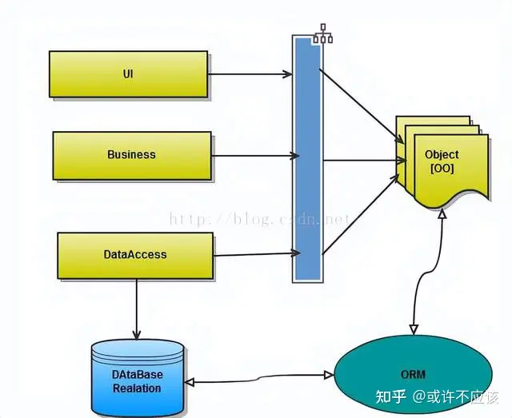
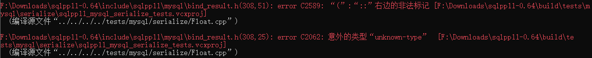
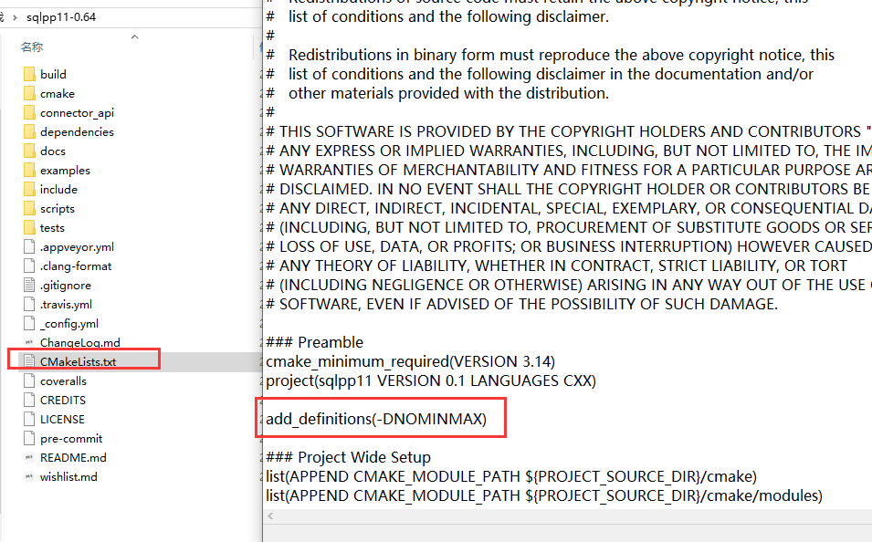
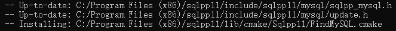
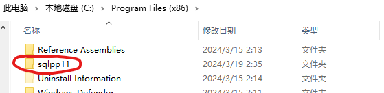
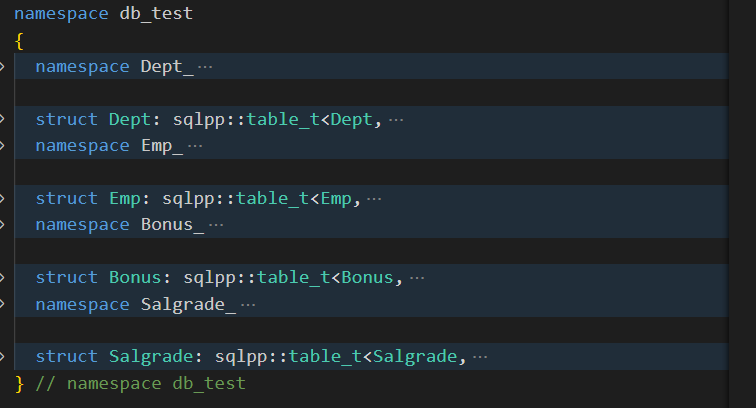

## ORM

### 1、什么是ORM

ORM，即Object-Relational Mapping（对象关系映射），它的作用是在关系型数据库和业务实体对象之间作一个映射，这样，我们在具体的操作业务对象的时候，就不需要再去和复杂的SQL语句打交道，只需简单的操作对象的属性和方法。

### 2、为什么会出现ORM思想

先从项目中数据流存储形式这个角度说起.简单拿MVC这种分层模式.来说. Model作为数据承载实体. 在用户界面层和业务逻辑层之间数据实现面向对象OO形式传递. 当我们需要通过Control层分发请求把数据持久化时我们会发现. 内存中的面向对象的OO如何持久化成关系型数据中存储一条实际数据记录呢？

面向对象是从软件工程基本原则(如耦合、聚合、封装)的基础上发展起来的，而关系数据库则是从数学理论发展而来的. 两者之间是不匹配的.而ORM作为项目中间件形式实现数据在不同场景下数据关系映射. 对象关系映射（Object Relational Mapping，简称ORM）是一种为了解决面向对象与关系数据库存在的互不匹配的现象的技术.ORM就是这样而来的.





需要更多的学习资料私信小编（需要）即可免费领取

### 3、优缺点

**优势**

第一：隐藏了数据访问细节，“封闭”的通用数据库交互，ORM的核心。他使得我们的通用数据库交互变得简单易行，并且完全不用考虑该死的SQL语句。快速开发，由此而来。

第二：ORM使我们构造固化数据结构变得简单易行。在ORM年表的史前时代，我们需要将我们的对象模型转化为一条一条的SQL语句，通过直连或是DB helper在关系数据库构造我们的数据库体系。而现在，基本上所有的ORM框架都提供了通过对象模型构造关系数据库结构的功能。这，相当不错。

**缺点**

第一：无可避免的，自动化意味着映射和关联管理，代价是牺牲性能（早期，这是所有不喜欢ORM人的共同点）。现在的各种ORM框架都在尝试使用各种方法来减轻这块（LazyLoad，Cache），效果还是很显著的。

第二：面向对象的查询语言(X-QL)作为一种数据库与对象之间的过渡,虽然隐藏了数据层面的业务抽象,但并不能完全的屏蔽掉数据库层的设计,并且无疑将增加学习成本.

第三：对于复杂查询，ORM仍然力不从心。虽然可以实现，但是不值的。视图可以解决大部分calculated column，case ，group，having,order by, exists，但是查询条件(a and b and not c and (d or d))。

世上没有驴是不吃草的(又想好又想巧,买个老驴不吃草)，任何优势的背后都隐藏着缺点，这是不可避免的。问题在于，我们是否能容忍缺点。

## sqlpp11

[sqlpp11](https://github.com/rbock/sqlpp11) 是 C++ 的类型安全 SQL 模版库，是一个挺好用的ORM框架。

### 下载构建配置

从[Tags · rbock/sqlpp11 (github.com)](https://github.com/rbock/sqlpp11/tags)下载并解压最新版本。

在目录中执行以下命令：

```shell
cmake -B build -DBUILD_MYSQL_CONNECTOR=ON
cmake --build build --target install
```

最后一步将构建库并在系统范围内安装它，因此它可能需要管理员权限。

> 前置条件：
>
> 1. 必须安装git以自动拉取 [Howard Hinnant 的日期库](https://github.com/HowardHinnant/date)
> 2. 必须安装python3，并且还得安装`pyparsing`模块。
>    + 安装pyparsing ：`pip install pyparsing`
>    + 可能需要更新pip：`python -m pip install --upgrade pip`
>    + 如果在使用pip时，提示`moduleNotFoundError:No module named 'pip'`，则需要先安装pip：`python -m ensurepip`
> 3. 必须配置好mysql开发环境(配置好环境变量)

如果在执行`cmake --build build --target install`有报错，部分报错截图如下：



则需要在sqlpp11中的CMakeLists.txt中添加NOMINMAX宏，如下图所示：



添加好之后，重新执行cmake命令：

```shell
cmake -B build -DBUILD_MYSQL_CONNECTOR=ON
cmake --build build --target install
```

构建成功后，库将安装到如下位置。





接下来把如下两个路径配置到环境变量path：

```css
C:\Program Files (x86)\sqlpp11
C:\Program Files (x86)\sqlpp11\bin
```

OK！至此，sqlpp11配置完成！

### CMake项目配置 

把你要操作的表的创建语句，放到sql文件中，如[test.sql](./assets/test.sql)：

```sql
-- 创建数据表
CREATE TABLE IF NOT EXISTS dept (
	deptno		SMALLINT  PRIMARY KEY,
	dname		VARCHAR(14) ,
	loc			VARCHAR(13) ) ;
	
CREATE TABLE IF NOT EXISTS emp (
	empno		SMALLINT  PRIMARY KEY,
	ename		VARCHAR(10),
	job			VARCHAR(9),
	mgr			SMALLINT,
	hiredate	DATE,
	sal			DECIMAL(7,2),
	comm		SMALLINT,
	deptno		SMALLINT  REFERENCES DEPT );
	
CREATE TABLE IF NOT EXISTS bonus (
	enamE		VARCHAR(10),
	job			VARCHAR(9) ,
	sal			DECIMAL(7,2),
	comm		SMALLINT ) ;
	
CREATE TABLE IF NOT EXISTS salgrade ( 
	grade		SMALLINT,
	losal		SMALLINT,
	hisal		SMALLINT );
```

然后打开cmd，并进入mtest.sql目录，执行如下命令：(会根据sql中的创建语句，生成头文件)

```shell
python "C:\Program Files (x86)\sqlpp11\bin\sqlpp11-ddl2cpp" test.sql mytest db_test
```

+ python 必须为python3
+ "C:\Program Files (x86)\sqlpp11\bin\sqlpp11-ddl2cpp" 是一个python脚本文件
+ test.sql 你要使用的sql文件，里面包含需要操作的表的创建语句。
+ mytest 为生成的头文件名称
+ db_test 数据库名称(对应到头文件中的命名空间名)

生成的mytest.h头文件大概内容如下图所示：



Dept_明明空间中定义了dept表中所有字段的声明。

Dept 结构体定义了dept表的结构。


CMakeLists.txt文件如下：

```cmake
cmake_minimum_required(VERSION 3.5.0)

project(sqlpp11_demo_1 VERSION 0.1.0 LANGUAGES C CXX)
# 强制要求支持C++17标准
set(CMAKE_CXX_STANDARD 17)
set(CMAKE_CXX_STANDARD_REQUIRED ON)
# 取消C语言标准的 min max宏
add_definitions(-DNOMINMAX)
# MySQL头文件目录
include_directories("F:/Tools/MySQL/MySQL Server 8.3/include")
# MySQL库文件目录
link_directories("F:/Tools/MySQL/MySQL Server 8.3/lib")
# 查找sqlpp11库(配置环境变量之后才能查找到)
find_package(sqlpp11 REQUIRED)
# 在当前目录，查找所有源文件，并保存到SOURCE_FILES变量中
aux_source_directory(. SOURCE_FILES)
# 指定项目源文件
add_executable(${PROJECT_NAME} ${SOURCE_FILES})
# 把sqlpp11库 和libmysql库连接到可执行程序
target_link_libraries(${PROJECT_NAME} PRIVATE sqlpp11::sqlpp11 libmysql)
```


然后创建`app.cpp`文件，写入main函数，后续代码，都在此文件中进行编写。


### sqlpp11使用

#### 1. 连接数据库

sqlpp11支持**mysql、sqlite3、postgresql**三种数据库，所以连接的时候，需要选择对应的连接器。不同的连接器所属的命名空间不同。

##### 普通连接

要连接MYSQL，需要包含头文件：

```cpp
#include "sqlpp11/mysql/mysql.h"
```

接着就可以通过连接配置对象来配置连接相关信息：

```cpp
int main(int argc, char const *argv[])
{    
	sql::connection_config config;
    config.host = "127.0.0.1";
    config.port = 33061;
    config.user = "root";
    config.password = "123456";
    config.database = "test";
```

`sql`是`sqlpp::mysql`的别名，是为了免去每次都写`sqlpp::mysql`这么长的命名空间的烦恼：

```cpp
namespace sql = sqlpp::mysql;
```

接下来就可以正式连接数据库了：

```cpp
    try
    {
        sql::connection db(config);
    }
    catch (const std::exception &e)
    {
        std::cerr << e.what() << '\n';
    }

    return 0;
}
```

`sql::connection`是一个连接类型，把连接配置传入连接对象即可建立连接。

> 注意：sqlpp11库是通过抛出异常来进行错误处理的，所以每一步操作都必须使用try语句进行异常捕获。

##### 连接池连接

普通的连接应该单线程程序足够了，但是在多线程程序中，每个线程必须有一个独立的连接。而数据库连接的创建和销毁是比较耗时，所以可以使用连接池**提高性能、优化资源分配、提高系统的稳定性和响应速度**。

- 提高性能。数据库连接池通过在应用程序启动时初始化一部分数据库连接，避免了每次进行CRUD操作时创建和销毁数据库连接的开销，从而提高了系统的性能。

> CRUD 是指在做计算处理时的增加(Create)、读取(Read)、更新(Update)和删除(Delete)几个单词的首字母简写

- 优化资源分配。在多应用共享同一数据库的系统中，通过数据库连接池的配置，可以限制每个应用的最大可用数据库连接数，避免某个应用独占所有数据库资源。

- 提高系统的稳定性。在高并发情况下，直接创建数据库连接可能导致系统无法创建更多连接，从而引发系统崩溃。而使用连接池可以有效地控制并发请求的数量，保证系统的稳定性。

- 提高响应速度。使用连接池可以减少等待数据库连接的时间，因为连接池已经预先创建了一些连接对象供用户使用。用户需要连接数据库时，只需从连接池中获取一个连接进行使用，使用完毕后归还给连接池，这样实现了资源的重用，节省了频繁创建和销毁连接的时间，从而提升了系统的响应速度。

为了使用连接池，先把配置对象改为智能指针对象：

```cpp
auto config = std::make_shared<sql::connection_config>();
```

接着将config传入`sql::connection_pool`连接池对象：

```cpp
sql::connection_pool pool(config,10);
```

需要数据库连接时，调用pool的`get()`方法即可：

```cpp
    try
    {
        sql::pooled_connection db =  pool.get();
    }
    catch (const std::exception &e)
    {
        std::cerr << e.what() << '\n';
    }
```

> 注意：池连接和普通连接的类型不一样，普通连接类型为`sql::connection`，而池连接为`sql::pooled::connection`。

#### 2.查询

##### 2.1 基本查询

首先，需要定义一个表对象，用来进行查询。

```cpp
void test_select(sql::connection_pool &pool)
{
   //定义表对象 
   db_test::Emp emp{};
```

然后，从连接池中获取连接。

```cpp
   auto &db = pool.get();
```

接着，就可以进行查询了。

```cpp
   //查询emp表
   auto& result = db(sqlpp::select(all_of(emp))
                     .from(emp)
                     .unconditionally());
```

> select函数需要包含头文件 ==> #include "sqlpp11/sqlpp11.h"
>
> + select 函数需要传入查询的字段，返回查询对象，以进行链式操作。all_of表示所有字段。
> + from 函数需要传入表对象
> + unconditionally 函数表示没有查询(where)条件

最后，遍历结果集，拿到每条记录；而每条记录的所有字段都可以直接通过row的成员拿到。

```cpp
   //遍历结果集，获取每条记录
   for(auto& row : result)
   {
	   std::cout << row.ename << "\t" << row.sal << "\t" << row.hiredate << "\t" << row.deptno << std::endl;
   }
}
```

通过row获取到的数据是字段类型，如果需要获取底层类型的数据，可以通过vlaue函数访问。

```cpp
	   std::cout 
           << row.ename.value() << "\t" 
           << row.sal.value() << "\t" 
           << row.hiredate << "\t" 
           << row.deptno.value() << std::endl;
```

> 可以通过typeid获取具体的类型名：   typeid(row.ename.value()).name();

```cpp
	   std::cout 
           << typeid(row.ename.value()).name() << "\t" 		//std::string
           << typeid(row.sal.value()).name() << "\t" 		//double
           << typeid(row.hiredate.value()).name()<< "\t" 
           << typeid(row.deptno.value()).name() << std::endl;//uint64_t
```

在上面的代码中，发现hiredate并没有通过value取值，因为hiredate是日期类型，获取之后通过cout输出不了。

但是可以通过字符串流`std::stringstream`转成字符串。

```cpp
 std::stringstream ss;
 ss << row.hiredate;
 std::cout << ss.str();
```

##### 2.2 别名

###### 查询指定字段

在上面的代码中我们使用`all_of()`查询了emp表的所有字段，如果只想查询指定的字段，只需要在`select()`函数中写入指定字段即可！

```cpp
auto &result = db(sqlpp::select(emp.ename,emp.sal,emp.hiredate,emp.deptno)
                          .from(emp)
                          .unconditionally());
```

###### 给字段取别名

sqlpp11给我们提供了一些内置别名(a~z，left，right)共28个，通过字段的`as()`函数即可使用这些别名。

当然也可以自定义别名，使用`SQLPP_ALIAS_PROVIDER()`带参宏定义别名。

```cpp
SQLPP_ALIAS_PROVIDER(emp_sal)	//自定义别名，不能放到函数内部
    
void test_alias_select(sql::connection_pool& pool)
{
    // 定义表对象
    db_test::Emp emp{};
    // 查询emp表
    auto &db = pool.get();

    auto &result = db(sqlpp::select(emp.ename.as(sqlpp::alias::a)  //这里使用内置别名
                                   ,emp.sal.as(emp_sal)		//这里写入自定义的别名
                                   ,emp.hiredate
                                   ,emp.deptno)
                          .from(emp)
                          .unconditionally());
    // 遍历结果集，获取每条记录
    for (auto &row : result)
    {
        std::cout << row.a<< "\t" 		//这里使用别名a
            << row.emp_sal << "\t" 		//这里使用别名emp_sal
            << row.hiredate << "\t" 
            << row.deptno << std::endl;
    }
}
```

对于未命名的字段，必须使用别名才好处理。

+ 把`(e.sal * 12)`取别名为`e.sal`，访问时直接使用row.sal即可获得年薪

```cpp
	for (auto& row : db(sqlpp::select(e.ename, (e.sal * 12).as(e.sal))
		.from(e)
		.unconditionally()))
	{
		std::cout << row.ename << "\t" << row.sal << std::endl;
	}
```

+ 当然，如果你还需要查看月薪，那必须换一种方式

```cpp
SQLPP_ALIAS_PROVIDER(year_sal)
...    
for (auto& row : db(sqlpp::select(e.ename,e.sal, (e.sal * 12).as(year_sal))
		.from(e)
		.unconditionally()))
	{
		std::cout << row.ename << "\t" << row.sal<<"\t"<<row.year_sal << std::endl;
	}
```


###### 给表取别名

```cpp
    //给表取别名
    auto mgr = emp.as(sqlpp::alias::a);

	for (const auto& row : db(
           select(emp.ename,mgr.ename.as(mgr_name))
           .from(emp.join(mgr).on(emp.empno == mgr.empno))
           .unconditionally()
		))
	{
		std::cout << row.ename<< "\t" << row.mgr_name<< std::endl;
	}
```

##### 2.3 条件查询

+ 查询工资等于3000的员工

```cpp
	for (auto& row : db(sqlpp::select(sqlpp::all_of(emp))
		.from(emp)
		.where(emp.sal == 3000)))
	{
		std::cout << row.ename << "\t" << row.sal << std::endl;
	}
```

+ 查询工资在1200到1800之间的员工(包含1200和1800)

```cpp
	for (auto& row : db(sqlpp::select(sqlpp::all_of(emp))
		.from(emp)
		.where(emp.sal >= 1200 && emp.sal <= 1800))) {
		std::cout << row.ename << "\t" << row.sal << std::endl;
	}
```

+ 查询姓名中包含`L`的员工

```cpp
	for (auto& row : db(sqlpp::select(sqlpp::all_of(emp))
		.from(emp)
		.where(emp.ename.like("%L%")))) {
		std::cout << row.ename << "\t" << row.sal << std::endl;
	}
```

+ 查询没有奖金的员工

```cpp
	for (auto& row : db(sqlpp::select(sqlpp::all_of(emp))
		.from(emp)
		.where(sqlpp::is_null(emp.comm)))) {
		std::cout << row.ename << "\t" << row.sal << std::endl;
	}
```

+ 查询工资为800 或 3000 或 5000的员工

```cpp
	for (auto& row : db(sqlpp::select(sqlpp::all_of(emp))
		.from(emp)
		.where(emp.sal.in(800,3000,5000)))) {
		std::cout << row.ename << "\t" << row.sal << std::endl;
	}
```


##### 2.4. 排序查询

在`where()`或者`  unconditionally()`函数后面使用`order_by()`函数即可指定排序字段和方式。

```cpp
    auto &result = db(sqlpp::select(emp.ename, emp.sal, emp.hiredate, emp.deptno)
                          .from(emp)
                          .unconditionally()
                          .order_by(emp.deptno.asc(),emp.sal.desc())
                          );
```


##### 2.5. 分页查询

分页子句必须放到语句的最后面，`limit()`指定显示的记录条数、`offset()`指定偏移量。`limit`函数可以单独使用，也可以搭配`offset`函数使用。

**limit单独使用**

单独使用，offset默认为0，也就是说从第一条数据开始显示，共显示5u条。

<font color=red>注意：limit和offset的参数类型必须为无符号整型(unsigned int)</font>

```cpp
    auto &result = db(sqlpp::select(emp.ename, emp.sal, emp.hiredate, emp.deptno)
                          .from(emp)
                          .unconditionally()
                          .limit(5u));			//从第1条数据开始，共显示5条
```

**搭配offset使用**

搭配offset使用，表示从offset条数据开始显示，共显示limit条。

```cpp
    auto &result = db(sqlpp::select(emp.ename, emp.sal, emp.hiredate, emp.deptno)
                          .from(emp)
                          .unconditionally()
                          .limit(5u).offset(2u));	//从第2条数据开始，共显示5条
```


##### 2.6. 聚合函数

###### count

count函数用来统计记录条数，有两种使用方式。

```cpp
sqlpp::count('*');
sqlpp::count(emp.empno));

for (auto &row : result)
{
    std::cout << row.count << std::endl;	//通过row.count访问
}
```

如果在一个查询中，调用多次`count()`函数，则必须取别名，否则多个个的字段名都是count，会发生冲突。

```cpp
SQLPP_ALIAS_PROVIDER(total_count)
SQLPP_ALIAS_PROVIDER(total_size)

void test_func_1_select(sql::connection_pool &pool)
{
    // 定义表对象
    db_test::Emp emp{};
    // 查询emp表
    auto &db = pool.get();
    
    auto &result = db(sqlpp::select(
        sqlpp::count('*').as(total_count), 			//取别名
        sqlpp::count(emp.empno).as(total_size))		//取别名
                          .from(emp)
                          .unconditionally());

    // 遍历结果集，获取每条记录
    for (auto &row : result)
    {
        //通过别名访问
        std::cout << row.total_count << " " << row.total_size << std::endl;
    }
}
```

###### avg

求平均值。

```cpp
    std::cout << "===agv===" << std::endl;
	{
        auto &result = db(sqlpp::select(sqlpp::avg(emp.sal))
                              .from(emp)
                              .unconditionally());

        // 遍历结果集，获取每条记录
        for (auto &row : result){
            std::cout << "agv:" << row.avg << std::endl;
        }
    }
```

###### max

求最大值。

```cpp
    std::cout << "===max===" << std::endl;
	{
        auto &result = db(sqlpp::select(sqlpp::max(emp.sal))
                              .from(emp)
                              .unconditionally());

        // 遍历结果集，获取每条记录
        for (auto &row : result){
            std::cout << row.max<< std::endl;
        }
    }
```

###### min

求最小值。

```cpp
    std::cout << "===min===" << std::endl;
	{
        auto &result = db(sqlpp::select(sqlpp::min(emp.sal))
                              .from(emp)
                              .unconditionally());

        // 遍历结果集，获取每条记录
        for (auto &row : result){
            std::cout << row.min<< std::endl;
        }
    }
```

###### sum

求总和。

```cpp
    std::cout << "===sum===" << std::endl;
	{
        auto &result = db(sqlpp::select(sqlpp::sum(emp.sal))
                              .from(emp)
                              .unconditionally());

        // 遍历结果集，获取每条记录
        for (auto &row : result){
            std::cout  << row.sum<< std::endl;
        }
    }
```


##### 2.7. 分组查询

+ 统计每个部门人数，输出部门编号和人数。

```cpp
    auto &result = db(sqlpp::select(emp.deptno,sqlpp::count('*'))
                          .from(emp)
                          .unconditionally()
                          .group_by(emp.deptno)     
    );

    // 遍历结果集，获取每条记录
    for (auto &row : result)    
    {
        std::cout << row.deptno << "\t" << row.count << std::endl;
    }
```

+ 输出部门平均薪资大于1500的部门。

```cpp
    auto &result = db(sqlpp::select(emp.deptno,sqlpp::avg(emp.sal))
                          .from(emp)
                          .unconditionally()
                          .group_by(emp.deptno)
                          .having(sqlpp::avg(emp.sal) > 1500)
    );
```

这里使用having语句在group by分支之后进行筛选，值得注意的是having中使用了平均薪资字段`sqlpp::avg(emp.sal)>1500`，形式比较复杂。

可以提前保存avg函数的结果，方便使用。

```cpp
    auto& avg_sal = sqlpp::avg(emp.sal);
    auto &result = db(sqlpp::select(emp.deptno,avg_sal)
                          .from(emp)
                          .unconditionally()
                          .group_by(emp.deptno)
                          .having(avg_sal > 2000)
    );
```

> 注意：这里并没有别名，指定别名可以用如下代码：`    auto& avg_sal = sqlpp::avg(emp.sal).as(avg_sal);`

##### 2.8. 多表查询

先来看一个有问题的查询。

```cpp
	for (const auto& row : db(
		select(emp.deptno,dept.deptno)
		.from(emp.join(dept).on(emp.deptno == dept.deptno))
		.unconditionally()))
	{
		std::cout << row.deptno << std::endl;
	}
```

当你连接表并且有个相同名称的列时，会产生编译错误。因为在一个查询中不能有两个相同的字段名称。

```css
 error C2385: 对“deptno”的访问不明确。
```

使用别名也很方便。

```cpp
SQLPP_ALIAS_PROVIDER(dept_dno)
select(emp.deptno,dept.deptno.as(dept_dno));
std::cout << row.deptno << "\t" << row.dept_dno << std::endl;
```

+ 查看员工姓名、薪资以及所在部门名称

```cpp
	for (const auto& row : db(
		select(emp.ename, emp.sal, dept.dname)
		.from(emp.join(dept).on(emp.deptno == dept.deptno))
		.unconditionally()))
	{
		std::cout << row.ename << " \t " << row.sal << " \t " << row.dname << std::endl;
	}
```

+ 查看员工姓名、薪资以及薪资等级

```cpp
	for (const auto& row : db(
		select(emp.ename, emp.sal, salgrade.grade)
		.from(emp.join(salgrade).on(emp.sal >= salgrade.losal && emp.sal <= salgrade.hisal))
		.unconditionally()))
	{
		std::cout << row.ename << " " << row.sal << " " << row.grade << std::endl;
	}
```

+ 查看员工姓名以及领导的姓名

```cpp
    //给表取别名
    auto mgr = emp.as(sqlpp::alias::a);

	for (const auto& row : db(
           select(emp.ename,mgr.ename.as(mgr_name))
           .from(emp.join(mgr).on(emp.empno == mgr.empno))
           .unconditionally()
		))
	{
		std::cout << row.ename<< "\t" << row.mgr_name<< std::endl;
	}
```


##### 2.9. 子查询

+ 查询工资比`ALLEN`的工资高的员工。

```cpp
    auto e1 = emp.as(sqlpp::alias::a);
    for (auto& row : db(
        select(emp.ename,emp.sal)
        .from(emp)
        .where(emp.sal > select(e1.sal).from(e1).where(e1.ename == "ALLEN"))
    ))
    {
        std::cout << row.ename << "\t" << row.sal << std::endl;
    }
```

或者

```cpp
   auto e1 = emp.as(sqlpp::alias::a);
   //先定义子查询
   auto subquery = select(e1.sal).from(e1).where(e1.ename == "ALLEN");
   for (auto& row : db(
       select(emp.ename,emp.sal)
       .from(emp)
       .where(emp.sal > subquery)
   ))
   {
       std::cout << row.ename << "\t" << row.sal << std::endl;
   }
```

+ 查询工资比任何管理工资都要高的员工信息

```cpp
        auto e1 = emp.as(sqlpp::alias::a);
        auto subquery = select(e1.sal).from(e1).where(e1.ename == "ALLEN");
        for (auto& row : db(
            select(emp.ename,emp.sal)
            .from(emp)
            .where(emp.sal > subquery)
        ))
        {
            std::cout << row.ename << "\t" << row.sal << std::endl;
        }
```

