# 线性表

**线性表**是数据结构里**最简单的**一种存储结构，没有之一。数据结构中的很多种存储结构，包括串、广义表、树、图等，学习它们都必须有线性表的知识基础，只有玩转线性表，后续再学习复杂的存储结构才能事半功倍。

根据数据在物理内存中的存储状态，线性表又可以细分成**顺序表（顺序存储结构）**和**链表（链式存储结构）**。顺序表和链表还有很多变体，包括静态链表、循环链表、双向链表等。

## 简介

线性表又称线性存储结构，是最简单的一种存储结构，专门用来存储逻辑关系为“一对一”的数据。

在一个数据集中，如果每个数据的左侧都有且仅有一个数据和它有关系，数据的右侧也有且仅有一个数据和它有关系，那么这些数据之间就是“一对一“的逻辑关系。

举个简单的例子：

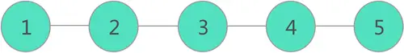

如上图所示，在 {1,2,3,4,5} 数据集中，每个数据的左侧都有且仅有一个数据和它紧挨着（除 1 外），右侧也有且仅有一个数据和它紧挨着（除 5 外），这些数据之间就是“一对一“的关系。

使用线性表存储具有“一对一“逻辑关系的数据，不仅可以将所有数据存储到内存中，还可以将“一对一”的逻辑关系也存储到内存中。

线性表存储数据的方案可以这样来理解，先用一根线将所有数据按照先后次序“串”起来，如下图所示：

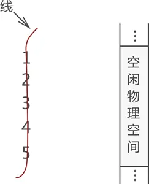

图 中，左侧是“串”起来的数据，右侧是空闲的物理空间。将这“一串儿”数据存放到物理空间中，有以下两种方法：

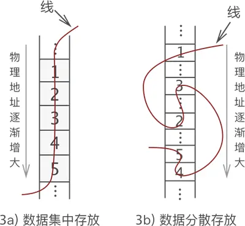

两种存储方式都可以将数据之间的关系存储起来，从线的一头开始捋，可以依次找到每个数据，且数据的前后位置没有发生改变。

像上图这样，用一根线将具有“一对一”逻辑关系的数据存储起来，这样的存储方式就称为线性表或者线性存储结构。

**顺序存储结构和链式存储结构**

从图 3 不难看出，线性表存储数据的实现方案有两种，分别是：

1. 像图 3a) 那样，不破坏数据的前后次序，将它们连续存储在内存空间中，这样的存储方案称为顺序存储结构（简称顺序表）；
2. 像图 3b) 那样，将所有数据分散存储在内存中，数据之间的逻辑关系全靠“一根线”维系，这样的存储方案称为链式存储结构（简称链表）。

也就是说，使用线性表存储数据，有两种真正可以落地的存储方案，分别是顺序表和链表。

**前驱和后继**

在具有“一对一“逻辑关系的数据集中，每个个体习惯称为数据元素（简称元素）。例如，图 1 显示的这组数据集中，一共有 5 个元素，分别是 1、2、3、4 和 5。

此外，很多教程中喜欢用前驱和后继来描述元素之间的前后次序：

- 某一元素的左侧相邻元素称为该元素的“直接前驱”，此元素左侧的所有元素统称为该元素的“前驱元素”；
- 某一元素的右侧相邻元素称为该元素的“直接后继”，此元素右侧的所有元素统称为该元素的“后继元素”；

以图 1 数据中的元素 3 来说，它的直接前驱是 2 ，此元素的前驱元素有 2 个，分别是 1 和 2；同理，此元素的直接后继是 4 ，后继元素也有 2 个，分别是 4 和 5。

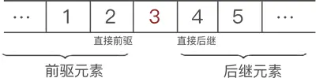

## 顺序表

**顺序表又称顺序存储结构**，是线性表的一种，专门存储逻辑关系为“一对一”的数据。

顺序表存储数据的具体实现方案是：将数据全部存储到一整块内存空间中，数据元素之间按照次序挨个存放。

举个简单的例子，将 {1,2,3,4,5} 这些数据使用顺序表存储，数据最终的存储状态如下图所示：

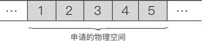

> **顺序表底层用数组实现，但额外维护了长度、容量等信息，并提供插入、删除、查找等封装好的操作，比原始数组更安全、更易用。**

### 顺序表实现

#### 创建

使用顺序表存储数据，除了存储数据本身的值以外，通常还会记录以下两样数据：

- 顺序表的最**大存储容量**：顺序表最多可以存储的数据个数；
- 顺序表的**长度**：当前顺序表中存储的数据个数。

C 语言中，可以定义一个结构体来表示顺序表：

```c
#include <stdint.h>

//给元素类型取别名，为了让数据结构在"类型"这个维度上能被抽象，实现"类型参数化"
typedef int ElemType;

/** 定义顺序表结构 */
typedef struct SeqList {
	ElemType* data;		// 指向动态数组的指针
	size_t capacity;	// 当前顺序表的容量
	size_t size;		// 当前顺序表中的元素个数
}SeqList;
```

#### 初始化/销毁

有了顺序表结构，还需要对结构进行初始化才能使用，比如结构中的data指针，需要动态分配内存。

```c
#include <malloc.h>
#include <stdio.h>
#include <stdlib.h>
#include <string.h>

bool seq_list_init(SeqList* list, size_t capacity)
{
	//判断传入的指针是否为空
	if (!list) {
		printf("list is null\n");
		return false;
	}

	//判断传入的容量是否为0,如果为0则设置为1
	capacity = max(capacity, 1);

	//分配内存空间
	list->data = (ElemType*)malloc(sizeof(ElemType) * capacity);
	if (!list->data) {
		printf("malloc failed\n");
		return false;
	}

	//初始化
	list->size = 0;
	list->capacity = capacity;
	return true;
}

void seq_list_destroy(SeqList* list)
{
	if (!list) {
		printf("list is null\n");
		return false;
	}

	//释放内存空间
	free(list->data);

	//重置
	memset(list, 0, sizeof(SeqList));
}
```

#### 顺序表插入元素

向已有顺序表中插入数据元素，根据插入位置的不同，可分为以下 3 种情况：

1. 插入到顺序表的表头；
2. 在表的中间位置插入元素；
3. 尾随顺序表中已有元素，作为顺序表中的最后一个元素；

虽然数据元素插入顺序表中的位置有所不同，但是都使用的是同一种方式去解决，即：通过遍历，找到数据元素要插入的位置，然后做如下两步工作：

- 将要插入位置元素以及后续的元素整体向后移动一个位置；
- 将元素放到腾出来的位置上；

例如，在 {1,2,3,4,5} 的第 3 个位置上插入元素 6，实现过程如下：

- 遍历至顺序表存储第 3 个数据元素的位置，如下图所示：

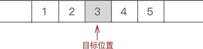

<center>找到目标元素位置</center>

- 将元素 3、4 和 5 整体向后移动一个位置，如下图所示：

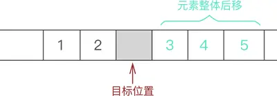

<center>将插入位置腾出</center>

- 将新元素 6 放入腾出的位置，如下图所示：

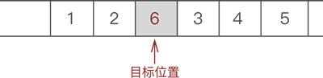

<center>插入目标元素</center>

因此，顺序表插入数据元素的 C 语言实现代码如下：

```c
bool seq_list_insert(SeqList* list, size_t pos, ElemType value)
{
	if (!list) {
		printf("list is null\n");
		return false;
	}

	if (pos > list->size || pos < 0) {
		printf("pos is invalid\n");
		return false;
	}

	//确保有足够的容量来容纳元素
	if (list->size == list->capacity && !seq_list_expand(list)) {
		printf("list is full\n");
		return false;
	}

	//从后往前移动元素
	for (int i = list->size - 1; i >= (int)pos; i--) {
		list->data[i + 1] = list->data[i];
	}

	//插入元素
	list->data[pos] = value;

	//更新size
	list->size++;

	return true;
}

bool seq_list_push_back(SeqList* list, ElemType value)
{
	return seq_list_insert(list, list->size, value);
}

bool seq_list_push_front(SeqList* list, ElemType value)
{
	return seq_list_insert(list, 0, value);
}
```

其中，`seq_list_expand`函数用来进行扩容，扩容策略为2倍增：

```c
static bool seq_list_expand(SeqList* list) {
	if (!list) {
		printf("list is null\n");
		return false;
	}
	ElemType* tmp = (ElemType*)realloc(list->data, sizeof(ElemType) * (list->capacity * 2));
	if (!tmp) {
		printf("realloc failed\n");
		return false;
	}
	list->data = tmp;
	list->capacity *= 2;
	return true;
}
```

除此之外，为了让我们能测试看到结果，还需要添加一个打印顺序表的函数：

```c
void seq_list_print(SeqList* list)
{
	if (!list) {
		printf("list is null\n");
		return;
	}

	for (int i = 0; i < list->size; i++) {
		printf("%d ", list->data[i]);
	}
	printf("\n");
}
```

#### 测试插入

让我们来测试一下：

```c
#include "SeqList.h"

int main()
{
	SeqList list;
	seq_list_init(&list, 3);

	for (size_t i = 0; i < 5; i++) {
		seq_list_insert(&list, 0, i);
	}
	seq_list_print(&list);

	seq_list_destroy(&list);
	return 0;
}

```

输出结果如下：

```c
4 3 2 1 0
```

#### 顺序表查找元素

顺序表中查找目标元素，可以使用多种查找算法实现，比如说二分查找算法、插值查找算法等。

这里，我们选择顺序查找算法，具体实现代码为：

```c
/**
 * 顺序表查找.
 * @param list 顺序表
 * @param value 要查找的元素
 * @return 返回元素的下标，如果没找到则返回-1
 */
int seq_list_find(SeqList* list, ElemType value)
{
	if (!list) {
		printf("list is null\n");
		return -1;
	}

	for (int i = 0; i < list->size; i++) {
		if (list->data[i] == value) {
			return i;
		}
	}

	return -1;
}
```


#### 顺序表删除元素

从顺序表中删除指定元素，实现起来非常简单，只需找到目标元素，并将其后续所有元素整体前移 1 个位置即可。

后续元素整体前移一个位置，会直接将目标元素删除，可间接实现删除元素的目的。

例如，从 {1,2,3,4,5} 中删除元素 3 的过程如下图所示：

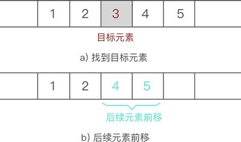

<center>顺序表删除元素的过程示意图</center>

因此，顺序表删除元素的 C 语言实现代码为：

```c
void seq_list_remove_at(SeqList* list, size_t pos)
{
	if (!list) {
		printf("list is null\n");
		return;
	}

	if (pos > list->size || pos < 0) {
		printf("pos is invalid\n");
		return;
	}

	for (int i = pos; i < list->size - 1; i++) {
		list->data[i] = list->data[i + 1];
	}

	list->size--;
}
```

除此之外还有其他删除元素版本:

```c
/**
 * 从pos位置开始删除len个元素.
 * @param list 顺序表
 * @param pos 要删除的起始位置
 * @param len 要删除的元素个数
 */
void seq_list_remove(SeqList* list, size_t pos, size_t len)
{
	if (!list) {
		printf("list is null\n");
		return;
	}

	if (pos > list->size || pos < 0) {
		printf("pos is invalid\n");
		return;
	}

	//校准len
	if (len == 0) {
		printf("len is 0\n");
		return;
	}
	len = min(len, list->size - pos);

	//从pos开始，将后面的元素往前移动
	for (int i = pos; i < list->size - 1; i++) {
		list->data[i] = list->data[i + len];
	}

	list->size -= len;
}

void seq_list_remove_back(SeqList* list)
{	
	seq_list_remove_at(list, list->size - 1);
}

void seq_list_remove_front(SeqList* list)
{	
	seq_list_remove_at(list, 0);
}
/**
 * 删除第一个value元素.
 */
bool seq_list_remove_one(SeqList* list, ElemType value)
{
	int pos = seq_list_find(list, value);
	if (pos == -1) {
		return false;
	}

	seq_list_remove_at(list, pos);
	return true;
}
/**
 * 删除所有value元素.
 * @return 返回删除的元素个数
 */
int seq_list_remove_all(SeqList* list, ElemType value)
{
	if (!list) {
		printf("list is null\n");
		return -1;
	}

	int count = 0;		//记录删除的元素个数
	int write_pos = 0;	//记录写入的位置

	for (size_t i = 0; i < list->size; i++) {
		if (list->data[i] != value) {
			if (i != write_pos) {
				list->data[write_pos] = list->data[i];
			}
			write_pos++;
		}
		else {
			count++;
		}
	}

	list->size -= count;

	return count;
}
```

#### 获取元素

从顺序表中获取指定元素，实现起来非常简单，只需根据位置直接获取值即可。

根据返回值的不同，可分为以下 2 种情况：

1. 直接获取元素的拷贝；
2. 获取元素的地址，方便修改。

```c
ElemType seq_list_at(SeqList* list, size_t pos)
{
	return *seq_list_at_ref(list, pos);
}

ElemType* seq_list_at_ref(SeqList* list, size_t pos)
{
	if (!list) {
		printf("list is null\n");
		return NULL;
	}

	if (pos > list->size || pos < 0) {
		printf("pos is invalid\n");
		return NULL;
	}

	return list->data + pos;
}
```

#### 帮助函数

再实现一些帮助函数，方便使用，比如判空、获取大小以及获取容量。

```c
bool seq_list_empty(SeqList* list)
{
	if (!list) {
		printf("list is null\n");
		return false;
	}

	return list->size == 0;
}

size_t seq_list_size(SeqList* list)
{
	if (!list) {
		printf("list is null\n");
		return -1;
	}

	return list->size;
}

size_t seq_list_capacity(SeqList* list)
{
	if (!list) {
		printf("list is null\n");
		return -1;
	}

	return list->capacity;
}
```

#### 遍历帮助宏

如果需要自己遍历顺序表，需要使用如下代码：

```c
	for (size_t i = 0; i < seq_list_size(&list);i++)
	{
		ElemType val = seq_list_at(&list, i);
		printf("%d ", val);
	}
```

比较麻烦是不，所以我们可以封装成宏，更加方便遍历：

```c
#define seq_list_foreach(type,var,list)\
	for(size_t _i = 0,_cnt = 0; _i < seq_list_size(list);_i++,_cnt = 0)\
		for(type var = seq_list_at(list,_i); _cnt < 1; _cnt++)

#define seq_list_foreach_ref(type,var,list)\
	for(size_t _i = 0,_cnt = 0; _i < seq_list_size(list);_i++,_cnt = 0)\
		for(type var = (type)seq_list_at_ref(list,_i); _cnt < 1; _cnt++)
```

调用遍历宏进行遍历：

```c
	seq_list_foreach(int, val, &list, ) {
		printf("%d ", val);
	}

	seq_list_foreach_ref(int*, val, &list, ) {
		printf("%d ", *val);
	}
```


## 链表

链表是一种常见的数据结构，由一系列节点组成，每个节点包含数据和指向下一个节点的指针。

和顺序表不同，使用链表存储数据，不强制要求数据在内存中集中存储，各个元素可以分散存储在内存中。例如，使用链表存储 {1,2,3}，各个元素在内存中的存储状态可能是：

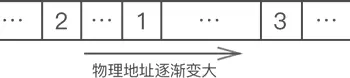

可以看到，数据不仅没有集中存放，在内存中的存储次序也是混乱的。那么，链表是如何存储数据间逻辑关系的呢？

链表存储数据间逻辑关系的实现方案是：为每一个元素配置一个指针，每个元素的指针都指向自己的直接后继元素，如下图所示：

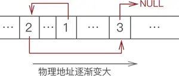

显然，我们只需要记住元素 1 的存储位置，通过它的指针就可以找到元素 2，通过元素 2 的指针就可以找到元素 3，以此类推，各个元素的先后次序一目了然。

像图 2 这样，数据元素随机存储在内存中，通过指针维系数据之间“一对一”的逻辑关系，这样的存储结构就是链表。

### 结点（节点）

> 很多教材中，也将“结点”写成“节点”，它们是一个意思。

在链表中，每个数据元素都配有一个指针，这意味着，链表上的每个“元素”都长下图这个样子：


数据域用来存储元素的值，指针域用来存放指针。数据结构中，通常将上图这样的整体称为结点。

也就是说，链表中实际存放的是一个一个的结点，数据元素存放在各个结点的数据域中。举个简单的例子，将序列 {1,2,3} 用链表存储，表示如下图所示：

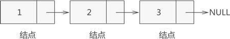

在 C 语言中，可以用**结构体**表示链表中的结点，例如：

```c
typedef struct link{
    char elem; 			//代表数据域
    struct link * next; //代表指针域，指向直接后继元素
}Link;
```

> 我们习惯将结点中的指针命名为 next，因此指针域又常称为“Next 域”。

### 头结点、头指针和首元结点

一个完整的链表应该由以下几部分构成：

1. **头指针：**一个和结点类型相同的指针，它的特点是：永远指向链表中的第一个结点。上文提到过，我们需要记录链表中第一个元素的存储位置，就是用头指针实现。

2. **结点：**链表中的节点又细分为**头结点**、**首元结点**和**其它结点**：

   + **头结点：**某些场景中，为了方便解决问题，会故意在链表的开头放置一个空结点，这样的结点就称为头结点。也就是说，头结点是位于链表开头、数据域为空（不利用）的结点。

   - 首元结点：指的是链表开头第一个存有数据的结点。
   - **其他节点：**链表中其他的节点。

也就是说，一个完整的链表是由头指针和诸多个结点构成的。每个链表都必须有头指针，但头结点不是必须的。

例如，创建一个包含头结点的链表存储 {1,2,3}，如下图所示：

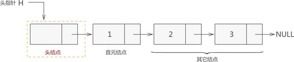

再次强调，头指针永远指向链表中的第一个结点。换句话说，如果链表中包含头结点，那么头指针指向的是头结点，反之头指针指向首元结点。

### 有头结点单链表

某些场景中，为了方便解决问题，会故意在链表的开头放置一个空结点，主要有如下优缺点：

**优点**：

- ✅ 统一处理空和非空情况，代码简洁
- ✅ 删除操作无需单独处理头节点
- ✅ 插入操作逻辑一致
- ✅ 头结点作为哨兵，简化边界条件

**缺点**：

- ❌ 多占用一个头结点的内存
- ❌ 尾插和尾删效率低（需遍历）

#### 时间复杂度表

| 操作     | 时间复杂度 | 说明               |
| :------- | :--------- | :----------------- |
| 头插     | O(1)       | 直接操作head->next |
| 头删     | O(1)       | 直接操作head->next |
| 尾插     | O(n)       | 需遍历到尾部       |
| 尾删     | O(n)       | 需找倒数第二个节点 |
| 按值删除 | O(n)       | 需遍历查找         |
| 按位查找 | O(n)       | 需遍历到第i个      |

#### 创建

先创建节点结构体：

```c
```


### 无头结束点单链表

### 带尾指针的单链表

### 单向循环链表

### 双向链表

### 双向循环链表

