# 数据结构与算法绪论

## 简介

如果你已经掌握了一门编程语言，马上要开始学习数据结构，或者已经学了一部分数据结构，但学得云里雾里，那么推荐你跟着文章走，它能加深你对数据结构的认知，帮助你快速入门数据结构。

对于刚刚接触数据结构的人，经常会问以下几个问题，我将会给大家解答：

1. **数据结构是什么？**
2. **数据结构到底学什么？**
3. **数据结构和算法，傻傻分不清楚，它们之间有什么区别和关系？**
4. 数学、英语基础不好，能学数据结构吗，对学数据结构有影响吗？
5. 学好数据结构，有什么用？

接下来，我就结合这几个问题，给大家展开讲讲数据结构。

## 数据结构是什么

### 众说纷纭

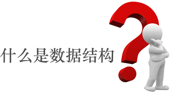

发展至今，数据结构也**没有标准的定义**，仁者见仁智者见智。市面上有很多讲解数据结构的书籍和视频，关于数据结构是什么，一些专家给出的答案是：

+ 数据结构是指带结构的数据元素的集合。
+ 数据结构是一门研究非数值计算的程序设计问题中计算机的操作对象以及它们之间的关系和操作等的学科。
+ 数据结构是相互之间存在一种或多种特定关系的数据元素的集合。

每一种回答都试图从**不同的视角**诠释对“数据结构”的理解，但遗憾地是，只有具备一定数据结构功底的人才能领悟这些话的含义。对于从未接触过数据结构的读者来说，根本不知道在说什么，打死也不可能理解。

### 举例说明

很多人学了长时间的数据结构，仍然一脸问号，不知道学数据结构有什么用，归根结底就是没有搞清楚数据结构是什么。

接下来，我就用通俗易懂的语言回答“**数据结构是什么**”这个问题。

**数据结构作为一门独立的学科**，是从 1968 年才开始的。在这之前，数据结构的内容散布在其他的计算机课程中，比如编译原理、操作系统等。

数据结构没有想象得那么复杂，它就教会你一件事：如何有效地存储数据。

在数据结构中，所有能被计算机处理的信息都称为数据，比如数值、字符、图像、音频、视频等。

很多人觉得，存储数据是一件很简单的事情，各个编程语言都提供有存储数据的方法，比如常见的变量、数组等，甚至还可以将数据存储到文件中。如果只是单纯地存储数据，的确不是很难。真正的难点在于，存储数据的同时还能将数据之间的关系也存储起来。

举个简单的例子，每家每户都有家谱或者族谱，记录着一个家族世系繁衍的信息，比如图 1 这张**家谱图**：

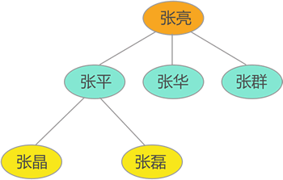

存储这张图时，只存储 `{张亮 , 张平 , 张晶 , 张磊 , 张华 , 张群} `这些人名是不行的，还要将他们之间的关系也存储起来，比如张亮是张平的父辈、是张磊的祖辈等等。

再比如，大家肯定用过导航软件（比如高德、腾讯地图等），要想实现精确导航，软件必须存储大量的数据，包括各个省、市、区、县的道路、建筑物、红绿灯等位置信息，以及每个地区的天气信息、高速路况信息等等。


这些信息都是数据，而且数据之间的关系错综复杂，能否正确存储这些关系，直接决定着软件导航的精准度。

类似家谱图、道路信息这样的场景，存储数据本身并不难，真正的难点在于如何存储数据之间的关系。通过学习数据结构，你将 get 到很多存储数据的方案，实现在存储数据的同时，还能正确存储数据之间的关系。

### 总结

数据结构是什么，在我看来，它是一门学科，教你如何存储那些具有复杂关系的数据。

数据结构存储数据的思路（思维、思想），可以用任意一种编程语言实现。换句话说，无论你掌握哪种编程语言，也无论你从事什么开发工作，只要你和数据打交道，就一定会用到数据结构

## 数据结构到底学什么？

数据结构是一门**研究数据存储方式**的学科，在数据结构看来，数据的存储方式要从以下两个角度来综合分析：

- **物理结构**：在内存中，数据可以选择集中存放，也可以选择分散存放；
- **逻辑结构**：数据之间的逻辑关系有四种，分别是`无关系`、`“一对一”`关系、`“一对多”`关系和`“多对多”`关系。

数据的物理结构有 2 种，逻辑结构有 4 种，它们可以随意组合。例如，无关系的数据可以选择集中存放，也可以选择分散存放。针对具有不同物理结构和逻辑结构的数据，数据结构都会给出最恰当的存储方案。学习数据结构，实际上就是学习这些存储数据的方案。

下面是一张数据结构的知识图谱，几乎涵盖了数据结构中所有的存储方案：

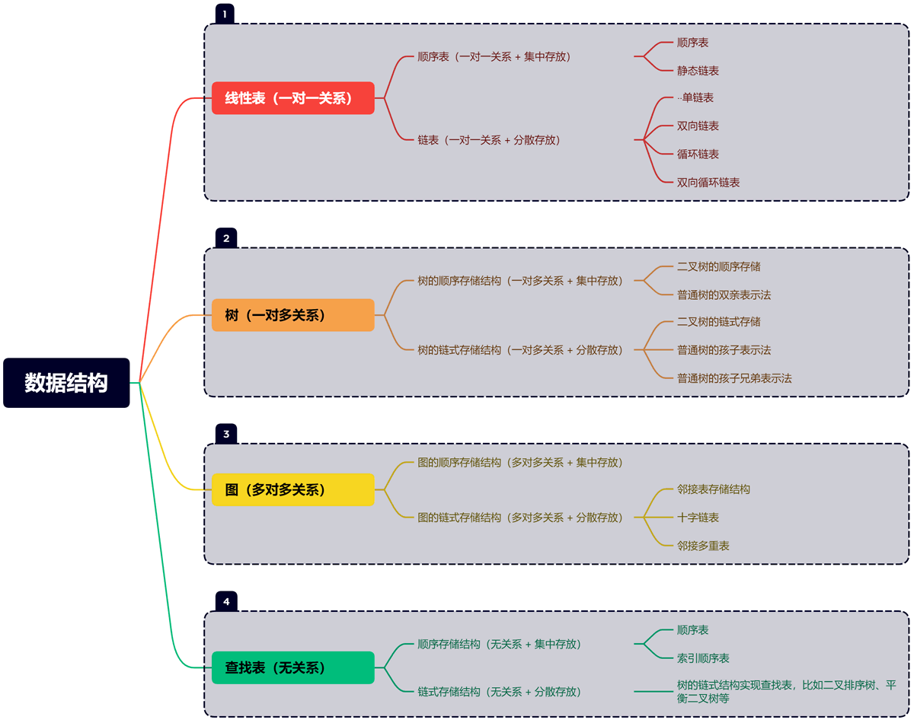

注意，想彻底玩转上图中罗列的这些存储方案也是不容易的，除了掌握各个存储方案本身，还要学会在各个存储方案中完成对数据的“增删改查”操作，以及用这些存储方案解决一些常见的实际问题（例如字符串的模式匹配、矩阵转置、最小生成树、最短路径等）。庆幸地是，这些知识在数据结构中都会讲到。

数据结构和算法是紧密相关的，学习数据结构的过程中，还要掌握一些常用的算法。

### 总结

学习数据结构，就是学习各种存储数据的方案。玩转数据结构，实际开发中遇到的各类数据存储问题都难不倒你。

## 数据的逻辑结构和存储(物理)结构

数据结构教我们有效地存储数据，既要存储数据本身，还要存储数据之间的关系。

存储数据本身，也就是将数据存储到内存里。数据在内存中的存储状态，就称为数据的存储结构，也叫物理结构。

数据结构中，将数据之间的关系称为数据的逻辑结构。以下图所示的家谱图为例，数据之间存在很多关系，比如张亮是张平的父辈、是张静的祖辈等，所有这些关系就构成了数据的逻辑结构。


### 数据的存储结构

在内存中，数据的存储结构无非有以下两种情况：

1) **集中存储**：所有数据存储在一整块内存空间中，数据之间紧挨着存放，如下图所示：

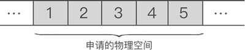

2) **分散存储**：各个数据随机存储在内存空间中，如下图所示：

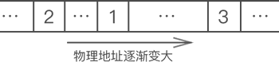

两种存储结构各有优势，将数据集中存储，方便后续查找数据；将数据分散存储，方便后续增加或者删除数据。

> 数据结构中，用顺序存储结构（顺序表）实现数据的集中存储，用链式存储结构（链表）实现数据的分散存储。有关这两种存储结构，我们会在后续章节中做详细讲解。

### 数据的逻辑结构

数据之间可能存在的关系，有以下 4 种情况：

#### 1) 无关系

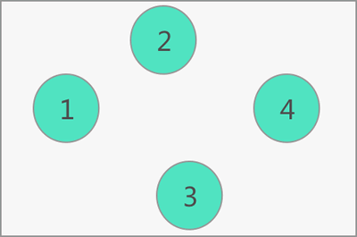

<center>“无关系”的逻辑结构</center>

所谓“无关系”，即数据之间不存在任何关系。例如上图中，{1,2,3,4} 中各个数据之间就没有任何关系。

#### 2) 一对一


<center> “一对一”的逻辑结构</center>

上图的数据集中，每个数据的左侧有且仅有一个数据与其相邻（除 1 外）；同样，每个数据的右侧也只有一个数据与其相邻（除 n 外），所有的数据都是如此，数据之间就是“一对一”的逻辑结构；

#### 3) 一对多

前面所示的“家谱图”中，数据之间就是“一对多”的逻辑结构。

以“张平”为例，他的父辈是“张亮”；他有两个孩子，分别是“张晶”和“张磊”。“张平”和其它数据之间就是“一对多”的关系，整个数据集呈现“一对多”的逻辑结构。

#### 4) 多对多

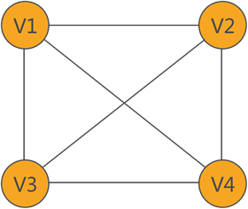

<center> “多对多”的逻辑结构<center>

{V1,V2,V3,V4} 数据之间就具有“多对多”的逻辑结构。

例如，从 V1 出发可以到达 V2、V3、V4；同样，从 V2、V3、V4 也可以到达 V1。V1 和其它数据之间就是“多对多”的逻辑关系。

多对多关系和一对多关系的区别在于：一对多关系中不存在环路，而多对多关系中存在环路，比如`V1->V3->V2->V1`就是一个环路。

针对每一种逻辑结构的数据，数据结构都提供了存储它们的方案：

- 查找表存储结构：专门存储无逻辑结构的数据；
- 线性存储结构：专门存储具有“一对一”逻辑结构的数据；
- 树存储结构：专门存储具有“一对多”逻辑结构的数据；
- 图存储结构：专门用来存储具有“多对多”关系的数据；

以上这些存储结构，后续会一一做详细地讲解。

### 总结

关于数据结构，与其说它是一门研究存储数据以及数据之间关系的学科，还可以这样概括：它是一门研究数据存储结构和逻辑结构的学科。通过研究数据的物理结构，可以掌握存储数据的方法；通过研究数据的逻辑结构，可以掌握存储数据之间关系的方法。

数据的存储结构有 2 种，分别是集中存储和分散存储。如果想集中存储数据，就选择顺序存储结构；如果想分散存储数据，就择链式存储结构。

数据的逻辑结构有 4 种，分别是“无关系”、“一对一”、“一对多”和“多对多”。无逻辑关系的数据可以选用查找表存储结构；具有“一对一”关系的数据可以选用线性存储结构；具有“一对多”关系的数据可以选用树存储结构；具有“多对多”关系的数据可以选用图存储结构

实际场景中，确定了数据的存储结构和逻辑结构，就可以敲定数据的存储方案。比如，数据呈现“一对多”关系，想分散存储，那么就选用【树的链式存储结构】。

## 算法是什么？

算法（Algorism）一词最初出现在 12 世纪，是用于表示十进制算术运算的规则。18 世纪，算法 Algorism 演变为 Algorithm，算法概念有了更广的含义。任何定义明确的计算步骤都可称为算法，或者说算法是合乎逻辑、简捷的一系列步骤。

简单来说，**算法**（Algorithm）是解决问题的一系列清晰指令，它代表着用系统的方法描述解决问题的策略机制。算法不仅是计算的核心，而且是计算机程序的基础。在计算机科学与数学中，算法的核心特征包括**有穷性**、**确切性**、**输入**、**输出**和**可行性**。

**算法的核心特征**

- **有穷性**：算法必须在执行有限步骤后终止。
- **确切性**：算法的每一步骤必须有确切的定义。
- **输入**：算法有0个或多个输入，以刻画运算对象的初始情况。
- **输出**：算法有一个或多个输出，以反映对输入数据加工后的结果。
- **可行性**：算法中的每个计算步骤都必须是可行的，即每个步骤都能在有限时间内完成。

## 算法的表示

算法可以用**自然语言**、**程序框图**、**N-S 图**、**伪代码**、**计算机语言表示**。

比如，找出计算机软件专业录取的新生中高考总分的最高分。分别用不用表示方式进行描述。

### 1) 自然语言

这个问题等价于求有限整数序列中最大值的算法，可采取以下步骤。

- 将序列中第一个整数设为临时最大值（max）；
- 将序列中下一个整数与临时最大值比较，如果这个数大于临时最大值，临时最大值更新为这个整数；
- 重复第（2）步，一直比较到序列中最后一个数时停止。此时临时最大值就是序列中的最大整数。

在此算法中，输入是软件专业所有新生的高考成绩，输出是高考最高分，算法过程从序列第一项开始，并把序列第一项设为临时最大值的初始值，接着逐项检查，如果有一项超过最大值，就把最大值更新为这一项的值，检查到序列的最后一项结束。

算法每进行一步，要么是比较最大值和这项的大小，要么是更新最大值的值，所以每一步的操作都是确定的，能保证最大值是已检查过的最大整数，结果是正确的。

如果序列包含 n 个整数，经过 n-1 次比较就结束，所以算法步骤是有限的、有效的。这个算法可以用于求任何有限整数序列问题的最大元素，所以它是通用的。

### 2)  程序框图

程序框图又叫流程图，是由一些规定的图形、流程线和文字说明来直观描述算法的图形。程序框及其说明如下表所示。

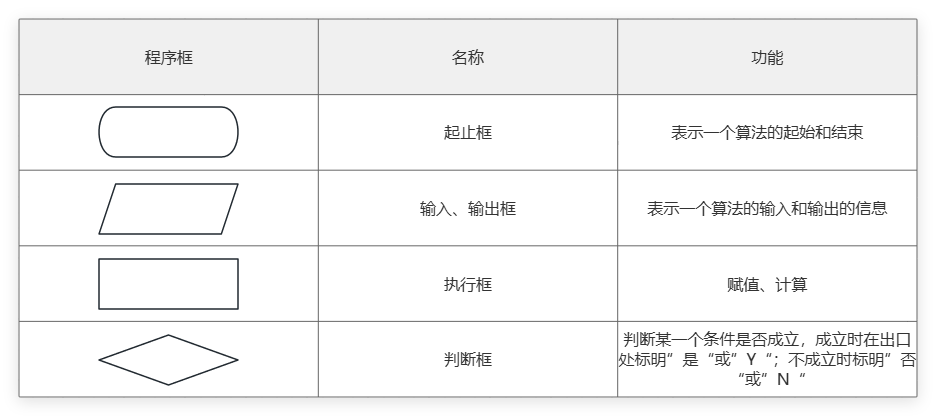

例如，画出实例 1 的算法流程图。

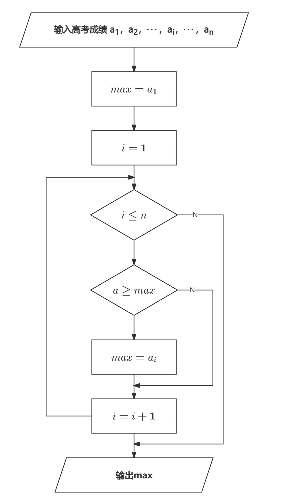

### 3)  N-S图

流程图由一些特定意义的图形、流程线及简要的文字说明构成，它能清晰、明确地表示程序的运行过程。因为在使用过程中发现流程线不是必需的，人们设计了一种新的流程图，它把整个程序写在一个大框内，这个大框图由若干个小的基本框图构成，这种流程图简称 N-S 图。

N-S图是无线的流程图，又称盒图，在 1973 年由美国两位学者 I.Nassi 和 B.Shneiderman 提出。

例如，下面是实例 1 算法的 N-S 图。

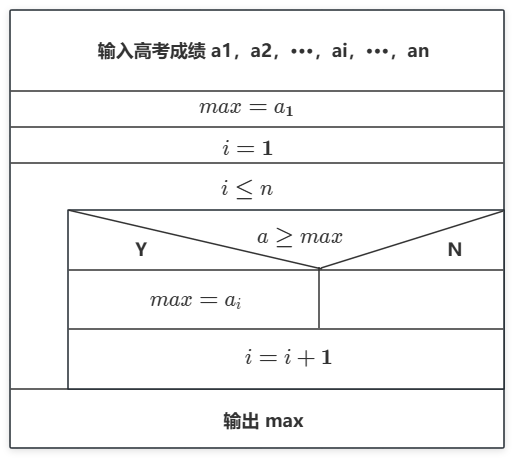

### 4) 伪代码（Pseudocode）

伪代码是一种介于自然语言与编程语言之间的算法描述语言，便于理解，并不依赖于语言，它用来表示程序执行过程，而不一定能编译运行的代码。使用伪代码的目的是为了使被描述的算法可以容易地以任何一种编程语言实现。

例如：

```css
IF 九点以前 THEN
做私人事务；
ELSE 9点到18点 THEN
工作；
ELSE
下班；
END
```

### 5) 计算机语言（Computer Language）

计算机语言的种类非常多，总的来说可以分成机器语言、汇编语言、高级语言三大类。

计算机所能识别的语言只有机器语言，即由 0 和 1 构成的代码。但通常人们编程时，并不采用机器语言，因为它非常难于记忆和识别。汇编语言的实质和机器语言是相同的，都是直接对硬件操作，只不过指令采用了英文缩写的标识符，更容易识别和记忆。

高级语言是目前绝大多数编程者的选择，它并不是特指某一种具体的语言，而是包括了很多编程语言，如目前流行的 C、C++、C#、Java、VB、VC、FoxPro、Delphi 等，这些语言的语法、命令格式都各不相同。

例如，下面是实例 1 算法的C语言程序。

```c
#include <stdio.h>

int main()
{
    int a[100],i,n,max;
    scanf("%d", &n);
    for(i=0;i<n;i++){
        scanf("%d",&a[i]);
    }
    max=a[0];
    for(i=1;i<=n-1;i++)
    {
        if(a[i]>=max)
        {
            max=a[i];
        }
    }
    printf("%d",max);
    return 0;
}
```

## 算法分类

算法分类是一个广泛的主题，因为存在许多不同类型的算法，它们各自服务于不同的目的和领域。然而，以下是一些常见的算法分类方式：

### 基本算法分类

- 搜索算法：如线性搜索、二分搜索、哈希搜索、深度优先搜索（DFS）、广度优先搜索（BFS）等。
- 排序算法：如冒泡排序、插入排序、选择排序、快速排序、归并排序、基数排序、堆排序等。
- 图算法：如最短路径算法（Dijkstra、Floyd-Warshall、Bellman-Ford）、最小生成树算法（Prim、Kruskal）、拓扑排序、图的遍历算法等。
- 动态规划：用于解决具有重叠子问题和最优子结构性质的问题。
- 分治算法：将问题分解为更小、更简单的子问题，然后递归地解决这些子问题。
- 回溯算法：通过探索所有可能的候选解来找出所有的解。

### 应用领域分类

- 计算几何算法：用于解决几何问题的算法，如凸包、碰撞检测、最近点对等。
- 字符串算法：如字符串匹配算法（KMP、Boyer-Moore、Rabin-Karp）、字符串搜索算法（Trie、后缀数组、后缀树）、字符串压缩算法等。
- 密码学算法：如加密算法（AES、RSA、DES）、哈希函数、数字签名算法等。
- 数值分析算法：如线性方程组求解、插值、逼近、数值积分等。
- 机器学习算法：如决策树、支持向量机、神经网络、聚类算法、推荐算法等。

### 算法设计策略分类

- 贪心算法：在每一步选择中都采取最好或最优（即最有利）的选择，从而希望导致结果是全局最好或最优的算法。
- 随机化算法：在算法中引入随机性，使得算法的行为不再完全确定，但可能具有更好的平均性能或更高的成功概率。
- 近似算法：在无法找到精确解的情况下，找到一个接近精确解的算法。
- 元启发式算法：如遗传算法、模拟退火、蚁群算法、粒子群优化等，这些算法通常用于优化问题。

### 并行和分布式算法

- 并行算法：设计用于在多处理器或多核计算机上同时执行以加速计算速度的算法。
- 分布式算法：设计用于在分布式系统（如计算机网络）上运行的算法，其中数据和计算资源分布在多个节点上。

### 数据结构相关算法

- 与链表、栈、队列、树（二叉树、平衡树、B树、B+树等）、图等数据结构相关的操作算法。

### 优化算法

- 线性规划、整数规划、非线性规划、动态规划、约束满足问题（CSP）和约束优化问题（COP）等。

### 算法复杂度分类

- 根据时间复杂度和空间复杂度，算法可以分为常数时间复杂度、对数时间复杂度、线性时间复杂度、多项式时间复杂度、指数时间复杂度等。

这只是一些常见的算法分类方式，实际上，算法的分类方式还有很多，具体取决于算法的特性和应用领域。

## 算法的效率衡量

算法的效率通常通过**时间复杂度**和**空间复杂度**来衡量。时间复杂度是指执行算法所需要的计算工作量，而空间复杂度指算法需要消耗的内存空间。这两个复杂度都用渐近性来表示，以描述算法随着输入规模增加的增长率。

### 大O表示法

两者通常用**大O表示法**表示，关注的是数据规模 *n* 趋向无穷大时的渐进性能。

我们这里以一个很简单的嵌套循环为例，在分析这种简单算法的复杂度时，我们通常计算其中 **关键步骤的执行次数** 作为此算法的时间复杂度。

```cpp
for (int i = 0; i < n; i++) {
		for (int j = i; j < n; j++) {
			...		// 关键步骤
		}
	}
```

该算法外层执行了 n 次循环，如果内层也是 n 次循环，我们便可知道该算法时间复杂度为 n^2，但是该算法内层执行的循环次数会随着外层循环的进行依次减少，最大为n。所以，我们便可以确定该算法的时间复杂度有一个上界 n^2，即T(n) = O(n^2)

> **T(n) 表示**算法处理规模为 *n* 的输入时，实际执行的基本操作次数（或实际运行时间的函数）。
>
> - **T** 通常代表 **Time**（时间）
> - **(n)** 表示输入数据的规模

根据之前的介绍：即双重for循环的最差执行次数为 n^2，也就是O(n^2)。

**常见的时间复杂度如图所示：**

| 常见阶     | 非正式术语叫法 | 描述                                                         |
| :--------- | :------------- | :----------------------------------------------------------- |
| O(1)       | 常数阶         | 是最低的时空复杂度，耗时/耗空间与输入数据大小无关。哈希算法就是典型例子。 |
| O(n)       | 线性阶         | 数据量增大几倍，耗时也增大几倍。比如常见的遍历算法。         |
| O(n²)      | 平方阶         | 数据量增大 n 倍时，耗时增大 n 的平方倍。比如冒泡排序。       |
| O(log n)   | 对数阶         | 数据增大 n 倍时，耗时增大 log n 倍（通常以2为底）。二分查找是典型例子：256个数据只需查找8次。 |
| O(n log n) | 线性对数阶     | n 乘以 log n。当数据增大256倍时，耗时增大 256×8=2048 倍。归并排序、快速排序（平均情况）都是这个复杂度。 |
| O(n³)      | 立方阶         | 数据量增大 n 倍时，耗时增大 n 的立方倍。比如三层嵌套循环的算法，或某些朴素的矩阵乘法。 |
| O(2ⁿ)      | 指数阶         | 数据量增大 n 倍时，耗时以 2 的 n 次方增长。增长极快，通常只适用于 n 很小的情况（如 n ≤ 20）。典型例子：递归求解斐波那契数列（无优化）、子集枚举。 |
| O(n!)      | 阶乘阶         | 数据量增大 n 倍时，耗时按 n 的阶乘增长。比指数阶还要恐怖，通常只适用于 n ≤ 10 的情况。典型例子：旅行商问题的暴力解法（枚举所有排列）。 |
| O(nᵏ)      | k 次方阶       | 这是多项式时间复杂度的通用形式。当 k 为固定常数时，属于可接受范围（k 通常 ≤ 3）。比如 O(n⁴)、O(n⁵) 等。k 越大，增长越快。 |

> 如果 a<sup>x</sup> = N（a>0，且 a≠1），那么数 x 叫做以 a 为底的 N 的对数（Logarithm）， 记作 x = logaN 。 其中，a 叫做对数的底数，N 叫做真数。
>
> 比如：*log*<sub>2</sub>8=3，表示2<sup>3</sup>=8，也就是求以2为底的8的对数。

所耗时间从小到大依次是：

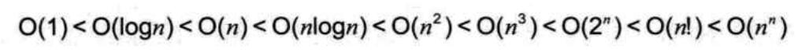

我们可以画一个函数图像清晰的看每个复杂度的时间对比：

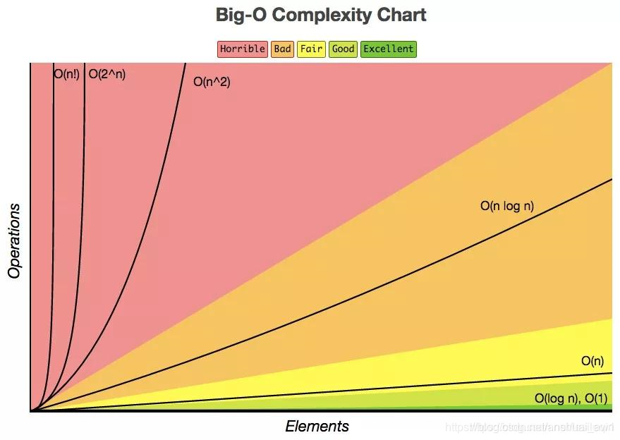

### 评价与目标对照表

| 等级          | 对应复杂度（常见情况） | 评价 | 工程目标                                                 | 数据规模参考 (n≈10⁵) |
| :------------ | :--------------------- | :--- | :------------------------------------------------------- | :------------------- |
| **Excellent** | **O(1)** **O(log n)**  | 极优 | **最理想**。常数时间或对数时间，数据增长几乎不影响性能。 | 1 次 / ~17 次        |
| **Good**      | **O(n)**               | 优秀 | **必须达到**（针对大部分业务）。只需线性扫描一遍。       | ~100,000 次          |
| **Fair**      | **O(n log n)**         | 合理 | **常用的优秀排序上限**。一般排序算法的天花板。           | ~1.7M 次             |
| **Bad**       | **O(n²)**              | 较差 | **勉强可用**（仅限小数据）。数据稍大性能急剧下降。       | 10^10 次（不可接受） |
| **Horrible**  | **O(2ⁿ)** **O(n!)**    | 极差 | **不可用**（除 n < 20）。指数级爆炸。                    | 天文数字             |

### 一般要达到哪种？

根据不同的应用场景，目标不同：

#### 🟢 竞赛/大厂面试（严格要求）

- **目标：Good 到 Excellent**
- 大部分题目要求 **O(n)** 或 **O(n log n)**。
- 如果写出 **O(n²)**，通常只能过 30% 以下的测试点（n 稍大就超时）。
- **O(log n)** 常出现在二分查找或高级数据结构操作中。

#### 🟡 普通业务开发（实用性优先）

- **目标：Fair 到 Good**
- 默认争取 **O(n)**。
- 如果业务逻辑复杂，**O(n log n)** 完全可以接受（服务器排序几万条数据没问题）。
- **O(n²)** 只在确定数据量很小（如数组长度 < 1000）时允许。

#### 🔴 极端性能场景（底层库、高频交易）

- **目标：Excellent**
- 极力追求 **O(1)** 或 **O(log n)**。
- 即使是 **O(n)** 也要看常数大小，甚至考虑 CPU 缓存命中率。

------

### 一个经验法则（针对 10⁵ 左右的数据量）

- **O(log n)** ~ **O(n)**：👍 完美
- **O(n log n)**：👌 不错
- **O(n²)**：❌ 太慢（10^10 次操作，假设 CPU 1秒处理 10⁸ 次，也要 100 秒）
- **O(2ⁿ)**：💀 绝望（n=50 时已远超宇宙原子总数）

### 总结

**一般要努力达到 “Good” 或 “Fair”**，也就是 **O(n)** 或 **O(n log n)**。**O(n²)** 只在数据量确定很小（< 2000）时作为“偷懒”的备选，否则就是 “Bad”。
如果能写出 **O(log n)** 或 **O(1)**，那就是 “Excellent”。

## 算法分析

接下来我们要学习有关算法时间耗费和算法空间耗费的描述和分析。有关算法时间耗费分析，我们称之为算法的时间复杂度分析，有关算法的空间耗费分析，我们称之为算法的空间复杂度分析。

### 算法时间复杂度分析

### 算法控件复杂度分析


[2-数组代码输出一_ev_哔哩哔哩_bilibili](https://www.bilibili.com/video/BV1FT421k7LL?spm_id_from=333.788.videopod.episodes&vd_source=d798f4dc7fdb9ca6a80baf9f4d394acb&p=5)