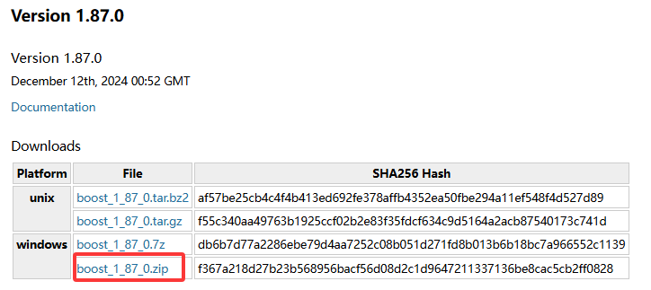
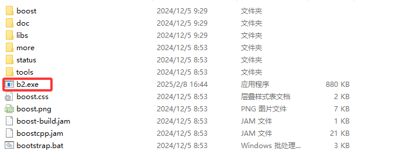

# Boost

## 简介

Boost是一个广泛使用的C++库，它是由C++标准委员会库工作自成员发起，它提供了各种功能强大的工具和库来扩展C++的功能。Boost库包括了许多模块，每个模块都针对不同的编程需求，例如文件系统、智能指针、正则表达式、线程、网络等。

### 特点

**广泛的功能：**Boost库涵盖了从基础数据结构到高级算法和工具的广泛功能。主要包含一下几个大类：字符串及文本处理、容器、迭代子(Iterator)、算法、函数对象和高阶编程、泛型编程、模板元编程、预处理元编程、并发编程、数学相关、纠错和测试、数据结构、输入/输出、跨语言支持、内存相关、语法分析、杂项。 有一些库是跨类别包含的，就是既属于这个类别又属于那个类别。

**高质量和性能：**Boost库经过严格的测试和优化，具有高性能和高质量的保证。这些库中的代码通常是经过大量实际使用验证的，确保了其稳定性和可靠性。
兼容性：Boost库与C++标准兼容，这意味着你可以在不改变现有代码的情况下使用这些库。Boost库通常会遵循C++标准库的设计模式，从而提供一致的编程体验。

**开源和跨平台：**Boost是一个开源项目，支持多种平台，包括Windows、Linux、macOS等。你可以自由地使用、修改和分发这些库。

**模块化设计：**Boost库是模块化的，你可以根据需要选择使用不同的模块，而无需引入整个库。这种设计使得Boost在集成到现有项目时非常灵活。

## 使用教程

### 下载Boost库

官网：[Boost C++ Libraries](https://www.boost.org/)

目前最近新版是1.87.0，直接下载zip版本即可！



下载完成之后，解压出来(Linux 下载.tar.gz版本，然后使用`tar zxvf boost_1_87_0.tar.gz`命令解压)。

<center>压缩包</center>


<center>解压后的文件夹</center>


### 编译库

进入解压之后的文件夹，运行如下命令，先生成b2构建工具。

> `b2.exe` 是 Boost 库的构建工具，类似于 Make、CMake 或其他构建系统。它是 Boost.Build 系统的一部分，用于编译和安装 Boost 库及其组件。`b2.exe` 提供了灵活且强大的配置选项，允许开发者根据需要定制构建过程。

```sh
bootstrap.bat
```



Boost某些库不需要编译，包含头文件就可以使用，有些需要编译后才能使用。

进入解压之后的文件夹，然后使用命令查看那些库需要单独编译：

```sh
b2 --show-libraries
```


## asio

[asio文档](./asio/asio.md)

## beast

[beast文档](./beast/beast.md)