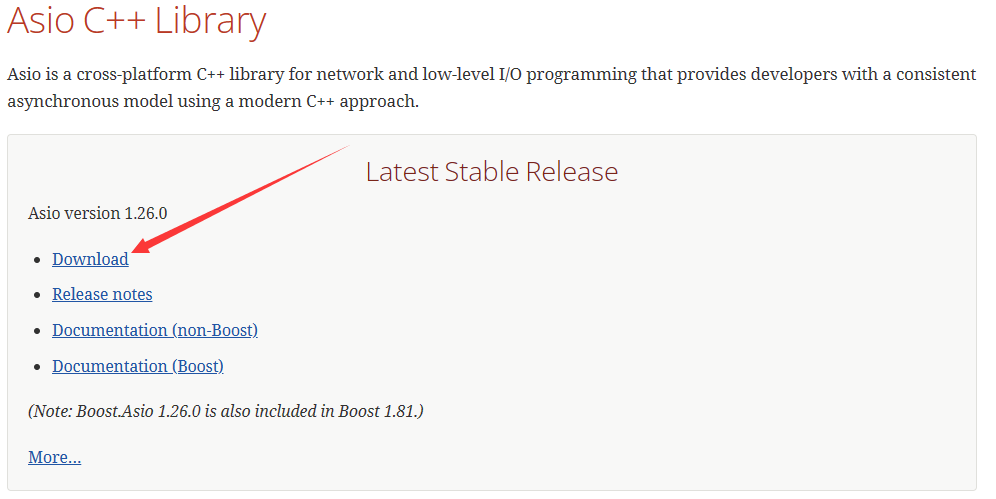
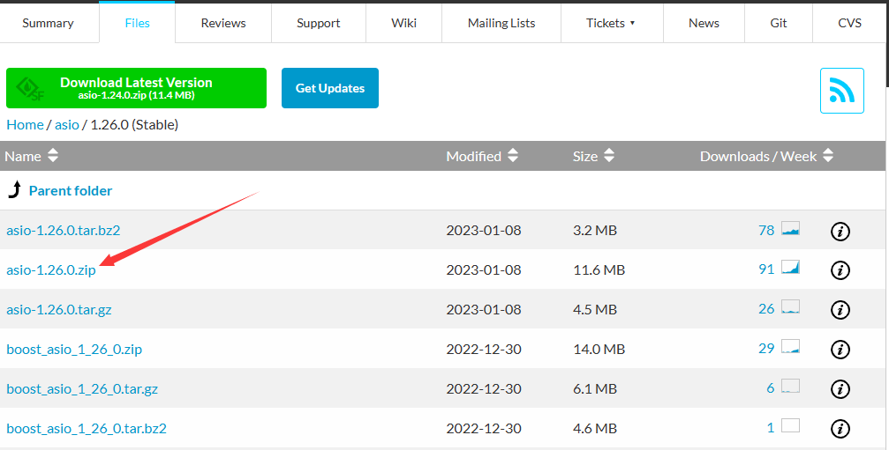

# 1. asio环境配置

## 1.1 简介

Asio 是一个跨平台的 C++ 库，常用于网络编程、底层的 I/O 编程等 (low-level I/O)，其结构框架如下：


## 1.2 使用

### 下载

Asio 库分为 Boost 版和 non-Boost 版，后者的下载地址为： http://think-async.com/ 

> 下载较慢，直接使用下载好的[压缩包](assets/asio-1.26.0.zip)





下载完成后，直接解压到合适位置即可。

### 配置

Asio只有头文件，只需要在你的代码中，包含头文件即可使用！

解压之后，进入include目录，把该路径配置到VS的包含目录。


### 走起

```cpp
#include<asio.hpp>

int main()
{
	asio::io_service io;
	io.run();
	return 0;
}
```

没毛病~


# 参考

## 知乎

+ [C++ 网络编程 asio 使用总结](https://zhuanlan.zhihu.com/p/583533338)


### 解析地址

```cpp
		asio::io_context ioc;
		asio::ip::tcp::resolver resolver(ioc);
		resolver.resolve("localhost",7);
```

`resolve(host,service)`函数用于解析端点，host是主机名或 IP 地址，service服务名称或端口号；可以是服务名称（例如 `"http"`、`"ftp"`）或直接的端口号（例如 `"80"`、`"21"`），服务名称需要系统中存在对应的服务名称到端口的映射（通常在windows：`%SystemRoot%\system32\drivers\etc\services`;linux：`/etc/services` 文件中定义）。


## 其他

+ [W3Cschool](https://www.w3cschool.cn/nlzbw/nlzbw-rs6a25yc.html)