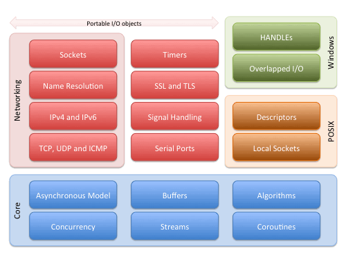
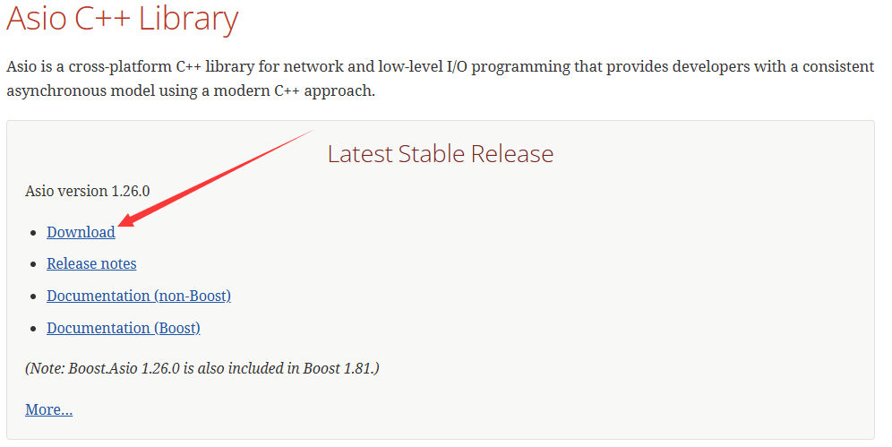
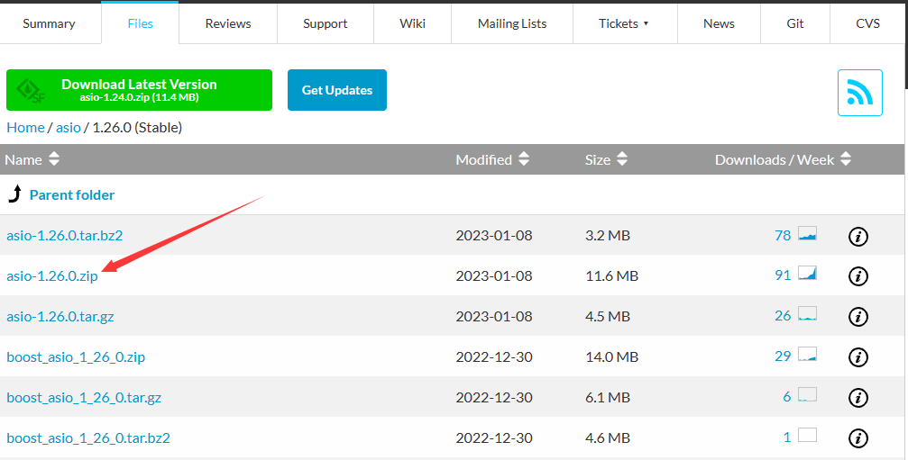
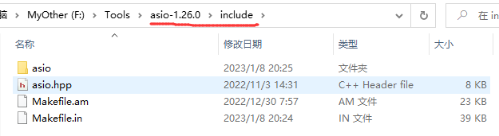
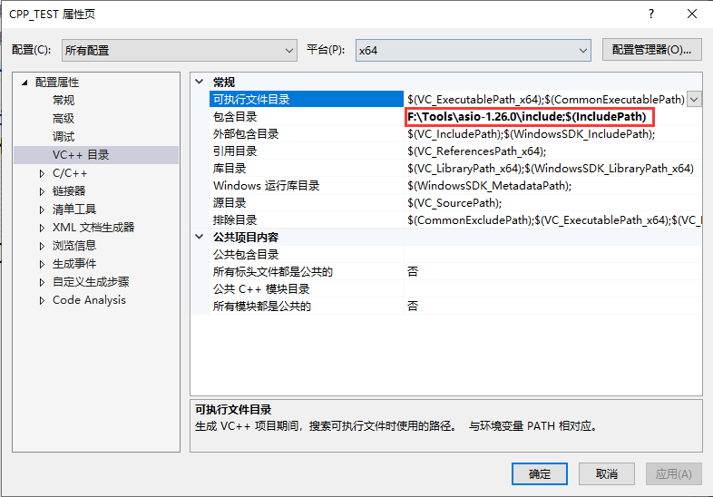

# 1. asio环境配置

## 1.1 简介

Asio 是一个跨平台的 C++ 库，常用于网络编程、底层的 I/O 编程等 (low-level I/O)，其结构框架如下：



## 1.2 使用

### 下载

Asio 库分为 Boost 版和 non-Boost 版，后者的下载地址为： http://think-async.com/ 

> 下载较慢，直接使用下载好的[压缩包](assets/asio-1.26.0.zip)





下载完成后，直接解压到合适位置即可。

### 配置

Asio只有头文件，只需要在你的代码中，包含头文件即可使用！

解压之后，进入include目录，把该路径配置到VS的包含目录。






### 走起

```cpp
#include<asio.hpp>

int main()
{
	asio::io_service io;
	io.run();
	return 0;
}
```

没毛病~


# 参考

## 知乎

+ [C++ 网络编程 asio 使用总结](https://zhuanlan.zhihu.com/p/583533338)


## 其他

+ [W3Cschool](https://www.w3cschool.cn/nlzbw/nlzbw-rs6a25yc.html)