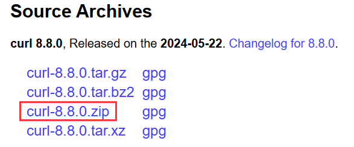
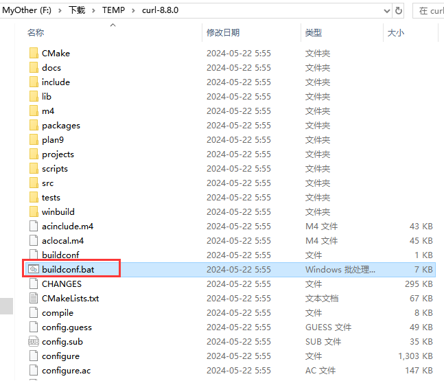
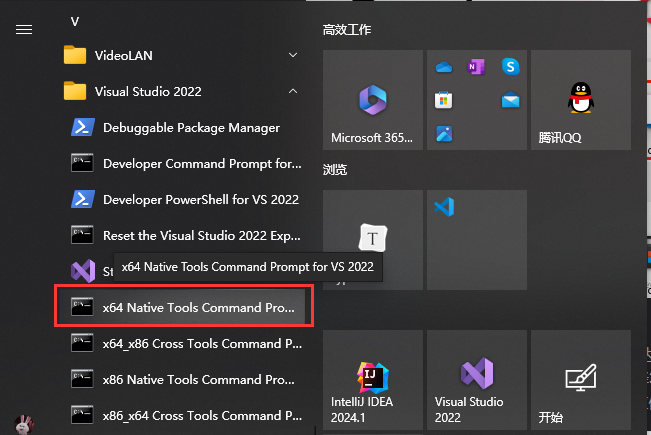
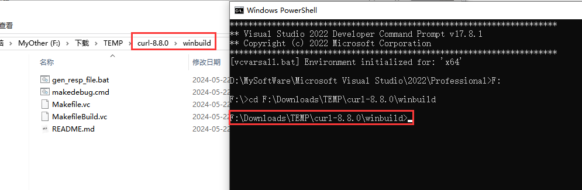
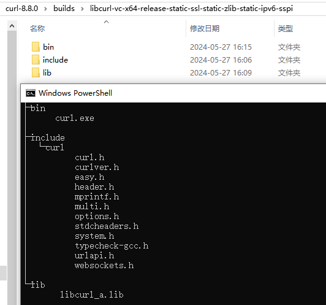

## [libcurl](https://curl.se/)

libcurl是一个跨平台的网络协议库，支持http、 https、 ftp等多种协议。libcurl同样支持HTTPS证书授权，HTTP POST、 HTTP PUT、FTP 上传、HTTP基本表单上传、代理、cookies和用户认证。

### 先决条件

+ [zlib](https://www.zlib.net/) 用于数据解压缩
+ [openssl](https://slproweb.com/products/Win32OpenSSL.html) 用于加密的安全传输

### 库下载编译

 1）进入官网[curl - Download](https://curl.se/download.html)，下载最新版本的压缩包，自己编译的好处是可以随时掌握最新库，感受前沿技术。



2）解压压缩包，进入curl-8.8.0文件夹，运行**buildconf.bat**，这一步是为了后续编译作预备工作。注意：错过该步骤，后续编译可能会有异常。

大概错误如下：

```css
NMAKE : fatal error U1073: 不知道如何生成“..\src\tool_hugehelp.c”
Stop.
NMAKE : fatal error U1077: “"D:\MySoftWare\Microsoft Visual Studio\2022\Professional\VC\Tools\MSVC\14.38.33130\bin\HostX64\x64\nmake.exe" /NOLOGO /F MakefileBuild.vc”: 返回代码“0x2”
Stop.
```



​    3）在开始菜单栏，找到VS，以管理员身份运行x64本机工具命令提示。



4）然后，在终端中切换到`curl-8.8.0/winbuild`目录。



5）接着输入如下命令进行编译：把命令中的路径修改为你自己的路径哦！

```shell
nmake /f Makefile.vc mode=static MACHINE=x64  WITH_SSL=static WITH_ZLIB=static  SSL_PATH=F:\Tools\OpenSSL-Win64 ZLIB_PATH=F:\Tools\zlib\lib 

#更详细的命令
#nmake /f Makefile.vc mode=static VC=17 MACHINE=x64 DEBUG=no WITH_SSL=static WITH_ZLIB=static WITH_PREFIX=D:\CPP_INCLUDE\curl\x64\ SSL_PATH=F:\Tools\OpenSSL-Win64 ZLIB_PATH=F:\Tools\zlib\lib

#注意：openssl和zlib头文件和库文件路径必须为如下结构：如果不一致则会有错误，请自行调整库
openssl
	-include
		-openssl
			-ssl.h
			-...
	- lib
		-libssl.lib
		-libcrypto.lib
		-...
		
zlib
	-include
		-zlib.h
		-zconf.h
	-lib
		-zlib.lib
		-zlibstatic.lib
		
#以下为可能出现的错误		
LINK : fatal error LNK1181: 无法打开输入文件“libeay32.lib”		
NMAKE : fatal error U1077: “"D:\MySoftWare\Microsoft Visual Studio\2022\Professional\VC\Tools\MSVC\14.38.33130\bin\HostX64\x64\nmake.exe" /NOLOGO /F MakefileBuild.vc”: 返回代码“0x2”
Stop.
```

选项说明：

+ **mode=<static/dll>**：编译静态/动态库
+ **VC=<10/11/12/14/15/16>**：Visual Studio版本
+ **MACHINE=<x86/x64>**：生成32/64位库
+ **DEBUG=<yes/no>**：生成debug/release版本
+ **WITH_SSL=<static/dll>**：openssl的库类型
+ **WITH_ZLIB=<static/dll>**：zlib的库类型
+ **WITH_PREFIX=<path>**：编译结果输出路径。必须以反斜杠\结尾
+ **SSL_PATH=<path>**：openssl路径
+ **ZLIB_PATH=<path>**：zlib路径

**Visual Studio版本号对照表**

| VC版本 | _MSC_VER宏的值 | VS版本 | MSVC toolset version |
| ------ | -------------- | ------ | -------------------- |
|VC6.0	|1200|	VS 6.0|	|
|VC7.0	|1300|	VS2002|	|
|VC7.1	|1310|	VS2003|	|
|VC8.0	|1400|	VS2005|	80|
|VC9.0	|1500|	VS2008|	90|
|VC10.0|	1600|	VS2010|	100|
|VC11.0|	1700|	VS2012|	110|
|VC12.0|	1800|	VS2013|	120|
|VC14.0|	1900|	VS2015|	140|
|VC15.0|	[ 1910 , 1916 ]| 	VS2017|	141|
|VC17.0|	[1930,)	|VS2022|	143|
|VC16.0|	[ 1920 , 1929 ]|	VS2019|	142|

6）编译完成后，回到`curl-8.8.0`目录，找到**builds**目录，如下所示。可以找到头文件和库文件。



### 库使用

#### CMakeLists.txt

```cmake
cmake_minimum_required(VERSION 3.11)

project(test_libcurl)

include_directories("F:/Tools/libcurl-8.8.0/include" "F:/Tools/zlib/include" "F:/Tools/OpenSSL-Win64/include")
link_directories("F:/Tools/libcurl-8.8.0/lib"  "F:/Tools/zlib/lib" "F:/Tools/OpenSSL-Win64/lib/VC/x64/MT")

add_definitions(-DCURL_STATICLIB)

add_executable(${PROJECT_NAME} main.c)
#连接需要的所有库
target_link_libraries(${PROJECT_NAME} libcurl_a ws2_32 zlibstatic Crypt32 wldap32 normaliz libssl_static libcrypto_static)
```

#### main.c

```c
#include <string.h>
#include <stdlib.h>
#include <stdio.h>

#include <curl/curl.h>

struct memory {
	char* response;
	size_t size;
};

static size_t callback(void* data, size_t size, size_t nmemb, void* userp) {
	size_t realsize = size * nmemb;
	struct memory* mem = (struct memory*)userp;

	char* ptr = (char*)realloc((void*)mem->response, mem->size + realsize + 1);
	if (ptr == NULL) {
		return 0;  /* out of memory! */
	}

	mem->response = ptr;
	memcpy(&(mem->response[mem->size]), data, realsize);
	mem->size += realsize;
	mem->response[mem->size] = '\0';

	return realsize;
}

int main() {
    /*如果中文显示乱码，取消下面这行的注释*/
    //system("chcp 65001");
	/* 1. 初始化 */
	CURL* curl = curl_easy_init();
	if (!curl) {
		printf("curl_easy_init failed\n");
		return 1;
	}

	struct memory chunk = { 0 };
	chunk.response = NULL;
	chunk.size = 0;

	/* 2. 发送请求 */
	curl_easy_setopt(curl, CURLOPT_URL, "https://www.baidu.com");
	curl_easy_setopt(curl, CURLOPT_WRITEFUNCTION, callback);
	curl_easy_setopt(curl, CURLOPT_WRITEDATA, (void*)&chunk);
	curl_easy_setopt(curl, CURLOPT_SSL_VERIFYHOST, 0L);
	curl_easy_setopt(curl, CURLOPT_SSL_VERIFYPEER, 0L);
	curl_easy_setopt(curl, CURLOPT_SSL_VERIFYSTATUS, 0L);
	curl_easy_perform(curl);

	/* 3. 查看请求返回结果 */
	printf("%s\n", chunk.response);

	/* 4. 清理 */
	if (chunk.response) {
		free(chunk.response);
		chunk.response = NULL;
		chunk.size = 0;
	}
	curl_easy_cleanup(curl);
	curl = NULL;

	return 0;
}
```

#### 注意

CMakeLists.txt中链接了很多需要的库。

```cmake
target_link_libraries(${PROJECT_NAME} libcurl_a ws2_32 zlibstatic Crypt32 wldap32 normaliz libssl_static libcrypto_static)
```

在MSVC编译器下，也可以直接在代码中进行链接。

```css
/*win32*/
#pragma comment (lib, "ws2_32.lib")
#pragma comment (lib, "wldap32.lib")
#pragma comment (lib, "normaliz.lib")
#pragma comment (lib, "crypt32.lib")
/*openssl*/
#pragma comment (lib, "libssl_static.lib")
#pragma comment (lib, "libcrypto_static.lib")
/*zlib*/
#pragma comment (lib, "zlibstatic.lib")
/*libcurl*/
#pragma comment (lib, "libcurl_a.lib")
```

还有，libcurl库是静态编译的，还必须添加 **CURL_STATICLIB**宏定义，否则会出现如下报错。

```css
error LNK2019: 无法解析的外部符号 __imp_curl_easy_init，函数 main 中引用了该符号
error LNK2019: 无法解析的外部符号 __imp_curl_easy_setopt，函数 main 中引用了该符号
error LNK2019: 无法解析的外部符号 __imp_curl_easy_perform，函数 main 中引用了该符号
error LNK2019: 无法解析的外部符号 __imp_curl_easy_cleanup，函数 main 中引用了该符号
```

