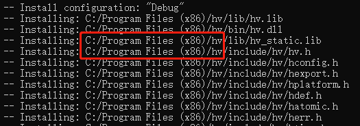

# 关于libhv

`libhv`是一个类似于`libevent、libev、libuv`的跨平台网络库，提供了带非阻塞IO和定时器的事件循环。libhv的名称也正是继承此派，寓意高性能的事件循环`High-performance event loop library`。

**libhv能干什么**

- 编写跨平台c/c++程序；
- 基于TCP/UDP/SSL开发自定义协议网络程序；
- 编写HTTP客户端/服务端程序；
- 编写WebSocket客户端/服务端程序；
- 学习实践网络编程；

## 下载、编译与安装


从[github](https://github.com/ithewei/libhv)拉取源码！

```cpp
git clone -b master https://github.com/ithewei/libhv.git
```

拉去完毕进入zlib目录。

```cpp
cd libhv
```

然后执行cmake命令(把openssl的路径替换成你的,openssl的libcrypto.lib库所在的路径)

> openssl需要安装，[下载安装包](https://slproweb.com/download/Win64OpenSSL-3_3_1.exe)安装即可，在安装目录就有头文件和库文件目录

```sh
cmake -B build -DWITH_OPENSSL=ON -DOPENSSL_ROOT_DIR=F:\Tools\OpenSSL-Win64\lib\VC\x64\MTd
```

编译并安装(必须以管理员权限打开终端哟~)

```sh
cmake --build build --target INSTALL
#cmake --build build --target INSTALL --config [Debug|Release]
```

> 编译时间稍微有点长，请耐心等待！

库的安装位置如下图所示，可以自己把libhv目录剪切到其他位置。



## 链库与使用

### VS2022+libhv+openssl

1. 创建一个Vs的空项目，新建cpp文件，如`test_libhv.cpp`，并输入如下代码：

```cpp
#include "hv/requests.h"

int main() {
    system("chcp 65001");//切换控制台代码页，以ut8编码解析打印的数据
    //下面的网址可替换成任意网址
    auto resp = requests::get("https://588ku.com/");
    if (resp == NULL) {
        printf("request failed!\n");
    }
    else {
        printf("%s\n", resp->body.c_str());
    }

    return 0;
}
```

2. 添加libhv头文件和库文件目录，以及openssl库目录


3. 添加链接库

   ```css
   hv_static.lib
   libcrypto_static.lib
   libssl_static.lib
   Crypt32.lib
   ```

   

4. 因为都是使用的静态库，还需要添加两个宏

```css
HV_STATICLIB
OPENSSL_STATIC
```


5. 运行程序，能在控制台上看到一个网页，表示环境配置完成啦！


### CMake+libhv+openssl

**CMakeLists.txt**文件配置如下。

```cmake
cmake_minimum_required(VERSION 3.20)

project(test_libhv)

#头文件包含目录
include_directories("F:/Tools/hv/include")
#库目录
link_directories("F:/Tools/hv/lib" "F:/Tools/OpenSSL-Win64/lib/VC/x64/MTd")
#使用静态库必须添加的两个宏
add_compile_definitions(HV_STATICLIB OPENSSL_STATIC)

add_executable(test_libhv "test_libhv.cpp")

#把库链接到可执行程序上
target_link_libraries(test_libhv hv_static libcrypto_static libssl_static Crypt32)
```

