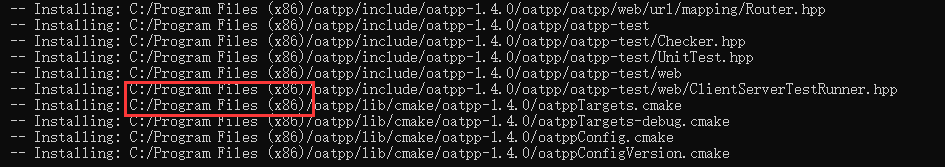

# 关于Oat++

Oat++ 是一个开源 C++ Web 框架，用于高度可扩展和资源高效的 Web 应用程序。

它具有零依赖性、易于移植和高性能。

+ [oat++官网](https://oatpp.io/)

+ [oat++ github](https://github.com/oatpp/oatpp)

## 下载与安装


从[github](https://github.com/oatpp/oatpp)拉取源码！

```cpp
git clone -b master https://github.com/oatpp/oatpp.git
```

拉去完毕进入zlib目录。

```cpp
cd oatpp
```

创建build目录并进入

```sh
mkdir build
cd build
```

然后执行cmake，同时设置安装路径

```sh
cmake .. -DCMAKE_INSTALL_PREFIX="../install_oatpp" -DOATPP_BUILD_TESTS=OFF
```

编译并安装(必须以管理员权限打开终端哟~)

```sh
cmake --build . --target INSTALL --config [Debug|Release]
```

> 编译时间稍微有点长，请耐心等待！

库的安装位置如下图所示，可以自己把oatpp目录剪切到其他位置。




## CMake配置oat++

**CMakeLists.txt**

```cmake
cmake_minimum_required(VERSION 3.20)

project(oatpp_cmake_env)

set(CMAKE_PREFIX_PATH "F:/Tools/oatpp")

find_package(oatpp REQUIRED)

add_executable(oatpp_cmake_env "App.cpp")

target_link_libraries(oatpp_cmake_env oatpp::oatpp)
```

**App.cpp**

```cpp
#include <iostream>
#include "oatpp/Environment.hpp"


int main(int argc, char* argv[])
{
	oatpp::Environment::init();
	std::cout << "hello oatpp!" << std::endl;
	return 0;
}
```

## VS配置oat++

+ 头文件目录 `F:\Tools\oatpp\include\oatpp-1.4.0\oatpp`
+ 库文件目录 `F:\Tools\oatpp\lib\oatpp-1.4.0`
+ 库文件 `oatpp.lib ws2_32.lib`

如果不加`ws2_32.lib`库文件，则会报错：

```css
1>oatpp.lib(Environment.obj) : error LNK2019: 无法解析的外部符号 __imp_WSAStartup，函数 "public: static void __cdecl oatpp::Environment::init(class std::shared_ptr<class oatpp::Logger> const &)" (?init@Environment@oatpp@@SAXAEBV?$shared_ptr@VLogger@oatpp@@@std@@@Z) 中引用了该符号
    
1>oatpp.lib(Environment.obj) : error LNK2019: 无法解析的外部符号 __imp_WSACleanup，函数 "public: static void __cdecl oatpp::Environment::destroy(void)" (?destroy@Environment@oatpp@@SAXXZ) 中引用了该符号
```

## 开始使用

### Environment

在使用前需要初始化环境，结束后需要清理环境。

```cpp
#include <iostream>
#include "oatpp/Environment.hpp"
#include "oatpp/base/Log.hpp"

void run()
{
	//打印oatpp版本
	oatpp::Environment::printCompilationConfig();

	//获取计数器(单位微秒)
	OATPP_LOGi("microTickCount", "{}微妙", oatpp::Environment::getMicroTickCount());
}

int main(int argc, char* argv[])
{
	//初始化环境
	oatpp::Environment::init();

	try
	{
		run();
	}
	catch (const std::exception& e)
	{
		std::cout << e.what() << std::endl;
	}

	//清理环境
	oatpp::Environment::destroy();
	return 0;
}
```

## moudles

### oatpp-sqlite

从[github](https://github.com/oatpp/oatpp-sqlite)拉取源码！

```cpp
git clone -b master https://github.com/oatpp/oatpp-sqlite.git
```

拉去完毕进入zlib目录。

```cpp
cd oatpp-sqlite
```

创建build目录并进入

```sh
mkdir build
cd build
```

然后执行cmake，同时设置安装路径

```sh
cmake -B build -DOATPP_BUILD_TESTS=OFF -DCMAKE_PREFIX_PATH="F:\Tools\oatpp" -DOATPP_SQLITE_AMALGAMATION=ON
```

编译并安装(必须以管理员权限打开终端哟~)

```sh
cmake --build . --target INSTALL --config [Debug|Release]
```

> 编译时间稍微有点长，请耐心等待！

库的安装位置如下图所示，可以自己把oatpp目录剪切到其他位置。