## 阳光值修改

### 阳光值地址

1. 打开**植物大战僵尸**游戏，记住阳光值，接下来进入CE！

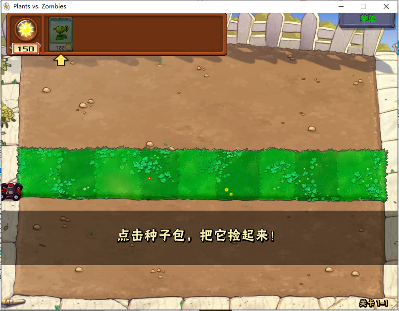

2. 在CE中打开**植物大战僵尸**进程，操作如下：

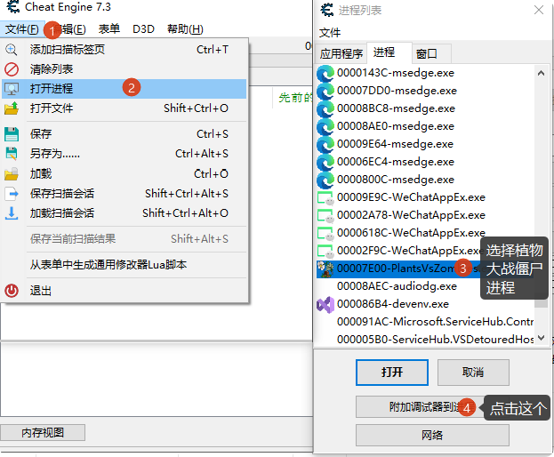

3. 输入阳光值，进行地址查找，如下图，找出了所有值为150的内存地址

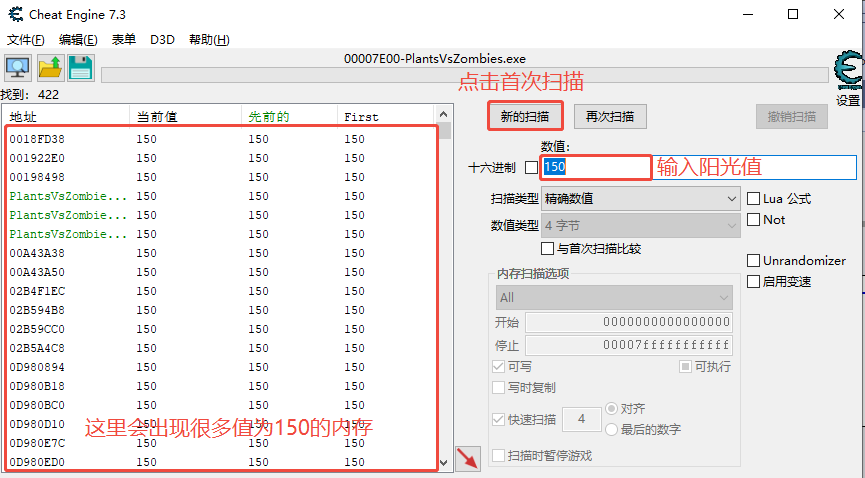

4. 接下来，进入游戏，修改一下阳光值(拾取阳光或使用卡片，只要能让阳光值改变都行)，这里我种了一个豌豆射手！


5. 再次到CE中输入新的阳光值，这里为50，点击再次扫描，这样就得到了唯一一个值为50的地址，这就是我们要找的阳光值的地址！(双击一下左边的唯一地址，让他出现到下面，这里会一直保留着，方便查看)

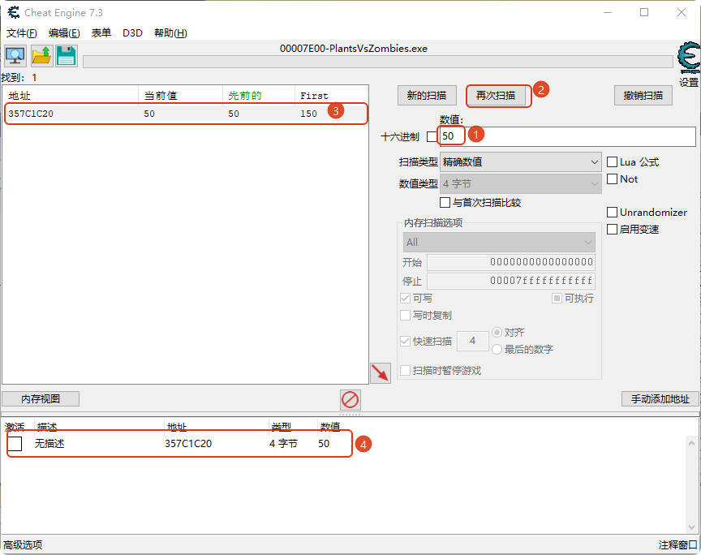

6. 修改一下，这个地址中的数据，看游戏中的阳光值是否会发生变化！

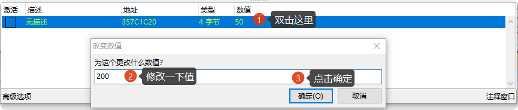

在游戏中看一下:


结果是，游戏中的阳光值发生了改变，nice！

### 阳光值基地址

以上方式找出来的只是，阳光值的临时地址，每次重启游戏地址都不一样，如果想要用`C/C++`去操作阳光值，我们必须得出一个不变的地址，这个地址就是基地址！

当然基地址还需要加上一级或二级偏移地址，才能找到实际的阳光值地址，原理图如下！

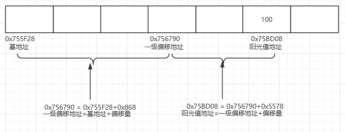

来，接下来，开始寻找偏移量和基地址！

1. 右击刚才找到的唯一地址，然后在弹出的菜单中点击`找出是什么访问这个地址`，然后在弹出的窗口中找到`mov`汇编指令！

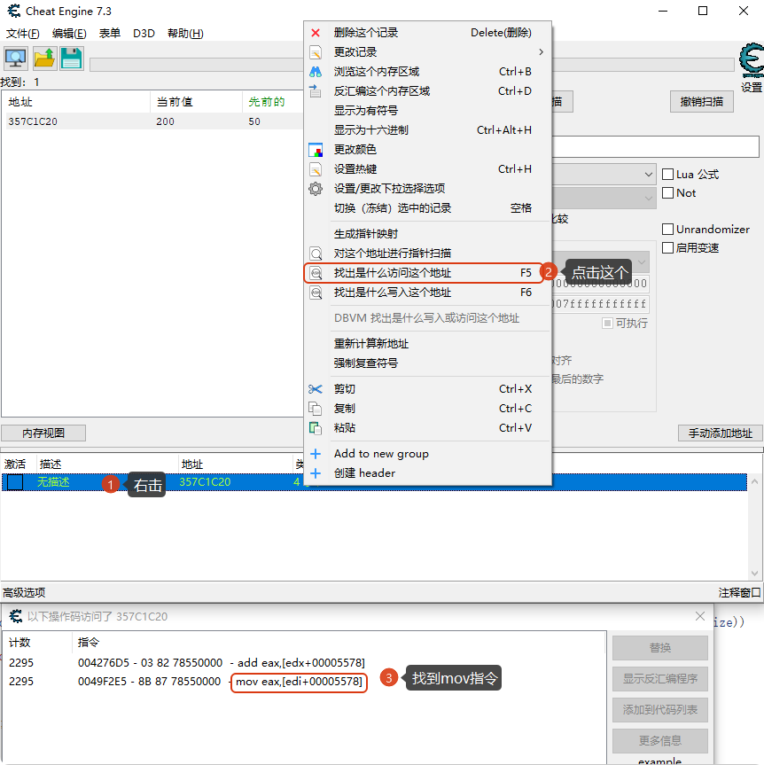

2. 在上面的操作中我们找到了move指令`mov eax,[edi+00005578]`，先记住这个**5578**，他就是二级偏移量。

   然后按照如下操作，找到EDI寄存器的值(这个值也是一个地址)，地址为**357BC6A8**

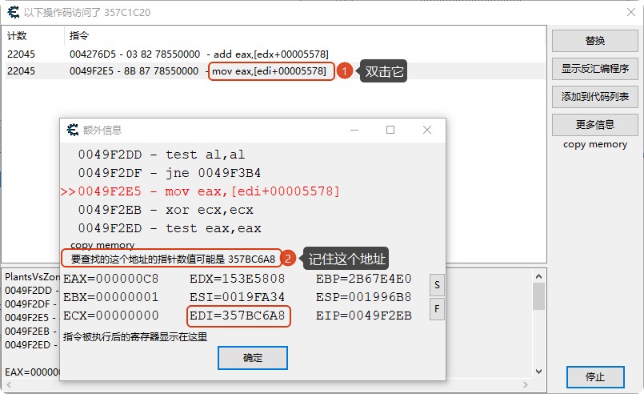

3. 接下来在CE中查找**357BC6A8**这个地址！

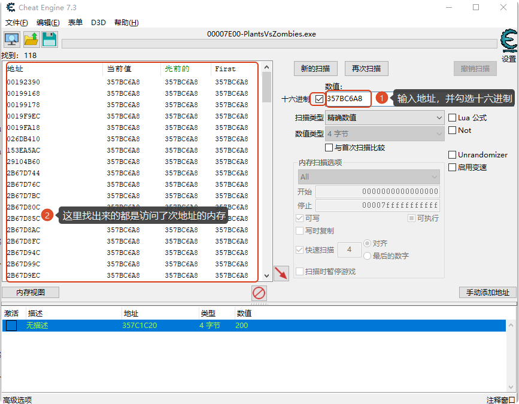

4. 接下来就是麻烦的时间了，我们需要从这里面一个一个找，直到找到类似于`mov edi,[esi+00000868]`的指令！也就是说edi的值来自于哪里，这里是来自于esi，那么我们需要找到esi的值，此时还需要记住**868**这个一级偏移地址！

   然后重复上面查找地址的操作，查找ESI中**026DABA8**这个地址。

   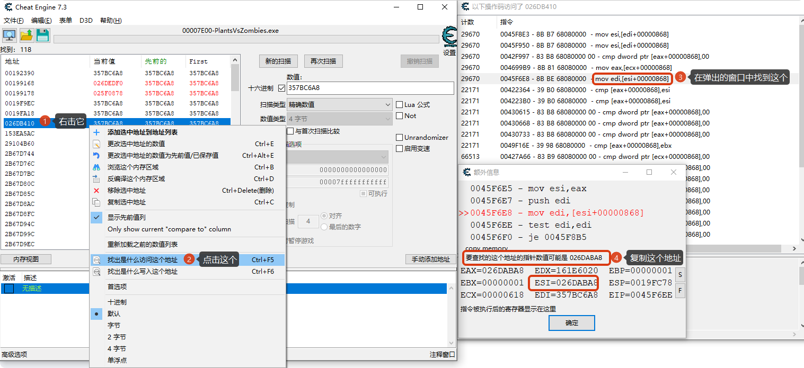

5. oh！尴尬，我这里电脑关机了，接着继续吧！地址变了，但不影响！搜索上面找到的地址，然后搜索，可以在右边找到出现的几个绿色的地址，然后找出是什么访问了地址！

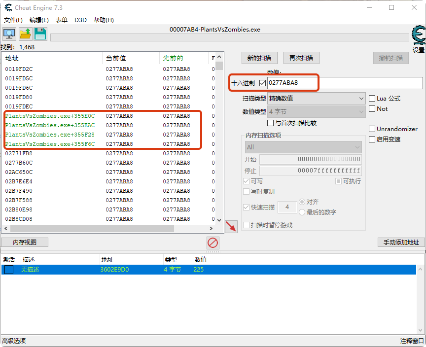

6. 每个都要查找一下，直到找到基地址，如下图所示

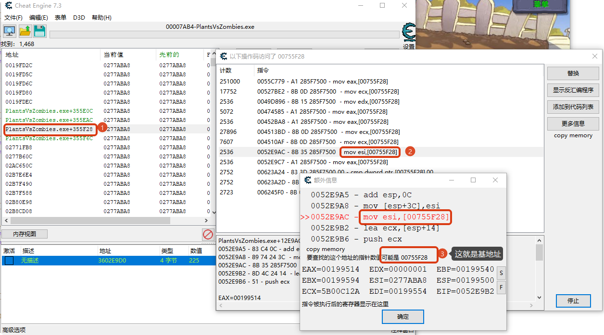

### C语言代码修改

先包含头文件：

```c
#include <stdio.h>
#include <Windows.h>
```

然后查找**植物大战僵尸**窗口：

```c
int main(){
	//查找植物大战僵尸游戏
	HWND hWnd = FindWindow(L"MainWindow", L"Plants vs. Zombies");
	if (hWnd == NULL){
		printf("没有运行游戏.\n");
		return 0;
	}
```

接着根据窗口句柄，获取进程句柄：

```c
	//根据窗口句柄来获取进程ID
	long dwPID;
	GetWindowThreadProcessId(hWnd, &dwPID);
	if (dwPID == 0){
		printf("获取进程PID失败.\n");
		return 0;
	}

	//根据进程ID获取进程句柄
	HANDLE hProcess = OpenProcess(PROCESS_ALL_ACCESS, FALSE, dwPID);
	if (hProcess == NULL){
		printf("打开进程失败.\n");
		return 0;
	}
```

下一步，根据基地址获取进程内的实际地址：

```c
	unsigned long SunshineBaseAddress = 0x00755F28;	//基地址
	unsigned long SunshineBaseAddressValue = 0;		//接受实际地址
	unsigned long dwSize = 0;						//实际读取的字节数

	if (FALSE == ReadProcessMemory(hProcess, (void*)SunshineBaseAddress, &SunshineBaseAddressValue, sizeof(unsigned long), &dwSize)){
		printf("静态地址获取失败.错误代号:%d\n", GetLastError());
		return 0;
	}
```

下一步，根据一级偏移量，获取偏移后的内存数据：

```c
	unsigned long SunshineOffsetFirst = 0x868;		//偏移量
	unsigned long SunshineOffsetFirstValue = 0;		//偏移后内存中的值

	if (FALSE == ReadProcessMemory(hProcess, (void*)(SunshineBaseAddressValue + SunshineOffsetFirst), &SunshineOffsetFirstValue, sizeof(unsigned long), &dwSize))
	{
		printf("一级偏移失败.错误代号:%d\n", GetLastError());
		return 0;
	}
```

下一步，根据二级偏移量，获取阳光值的实际地址：

```c
	unsigned long SunshineOffsetSecond = 0x5578;
	unsigned long SunshineNum = 0;
	
	if (FALSE == ReadProcessMemory(hProcess, (void*)(SunshineOffsetFirstValue + SunshineOffsetSecond), &SunshineNum, sizeof(unsigned long), &dwSize))
	{
		printf("二级偏移失败.错误代号:%d\n", GetLastError());
		return 0;
	}
```

最后，可以获取当前阳光值，并修改阳光值。

```c
	printf("阳光值：%d\n", SunshineNum);

	printf("请输入新的阳光值：\n");

	int nNewSunshineNum;
	scanf("%d", &nNewSunshineNum);

	//写入数据
	if (FALSE == WriteProcessMemory(hProcess, (void*)(SunshineOffsetFirstValue + SunshineOffsetSecond), &nNewSunshineNum, sizeof(unsigned long), &dwSize))
	{
		printf("写入阳光值失败.错误代号:%d\n", GetLastError());
		return 0;
	}

	printf("修改阳光值成功.\n");

	return 0;
}
```

