# 音视频小白入门

## 音视频到底是什么

### 视频(Video)是什么？

**视频**，本质上是一系列**静态图像**（称为“**帧**”）在极短的时间内连续播放，利用人眼的**视觉暂留**效应，从而产生动态画面的技术。

#### 动画书

不知道大家小时候是否玩过一种动画小人书，连续翻动的时候，小人书的画面就会变成一个动画，类似现在的 gif 格式图片。请注意：**翻动速度一定要够快**。本来是一本静态的小人书，通过翻动以后，就会变成一个有趣的小动画，如果**画面够多，翻动速度够快**的话，这其实就是一个**小视频**。

而**视频的原理**正是如此，由于人类眼睛的特殊结构，画面快速切换时，画面会有残留（**视觉暂留**），感觉起来就是连贯的动作。所以**，视频就是由一系列图片构成的。**

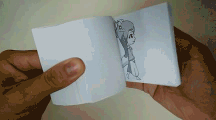

#### 帧（frame）

**帧**是视频中的最小单位，相当于电影胶片上的每一格画面。每一帧都是一个静止的图像，通过快速连续播放这些帧，可以形成动态视觉效果。这种现象利用了人眼的**视觉暂留**特性，使得静止的图像看起来像是连续运动的。

> **视觉暂留**（Persistence of vision）是指当光信号传入大脑神经后，即使光的作用结束，视觉形象仍会保留一段时间。这种现象也被称为“余晖效应”。

帧的数量通常用**帧数**来表示，指的是在一定时间内生成或播放的帧的总数。例如，如果一个视频在两秒内显示了60帧画面，那么其帧数为60。

#### 帧率（fps）

**帧率**是描述帧生成或播放速度的指标，通常以每秒帧数（Frames Per Second，简称FPS）来衡量。帧率越高，画面越流畅。例如，60 FPS的视频每秒播放60帧，能够提供更平滑的视觉体验。

在计算机图形学、游戏和视频领域，高帧率通常意味着更好的视觉效果和更低的延迟感。然而，当帧率超过显示器的刷新率（例如60Hz）时，多余的帧可能会被浪费，甚至导致画面撕裂问题。通过启用垂直同步（VSync）技术，可以解决这一问题。

> 画面撕裂是指当游戏的帧率超过显示器的刷新率时，显示器一次只能显示一部分帧，这就导致画面在垂直方向上的不连续，看起来就像画面被“撕裂”了一样。
>
> 垂直同步就是为了解决这个问题。当开启垂直同步后，显卡会根据显示器的刷新率来限制游戏的帧率。例如，如果你的显示器的刷新率是60Hz，那么显卡就会限制游戏的帧率不超过60帧/秒。这样，每次显示器刷新时，显卡都会输出一个完整的帧，从而避免了画面撕裂。

总结来说，帧是静态图像，帧数是一定时间内的帧总量，帧率是帧播放的速度，而FPS是帧率的具体数值表达方式。

根据视觉暂留，人对于中等亮度的光刺激，视觉暂留时间约为0.1至0.4秒。这意味着当物体在快速运动时，人眼仍能继续保留其影像0.1-0.4秒左右。故此，帧率达到25，人眼就会感觉到很流畅了~

```bash
1000ms / 40ms = 25		#很流畅
1000ms / 10ms = 100		#非常丝滑，游戏中感觉尤为明显。
```

帧率的一般以下几个典型值：

+ 1）24/25 fps：1 秒 24/25 帧，一般的电影帧率；

+ 2）30/60 fps：1 秒 30/60 帧，游戏的帧率，30 帧可以接受，60 帧会感觉更加流畅逼真。

85 fps 以上人眼基本无法察觉出来了，所以更高的帧率在视频里没有太大意义。

#### 图像分辨率（Image resolution）

分辨率（Resolution）是图像的宽度和高度的像素数，例如1920×1080表示图像的宽度为1920像素，高度为1080像素。分辨率越高，图像的**细节**和**清晰度**就越好。分辨率的单位可以是像素每英寸（PPI）或每英寸点数（DPI），这两者在不同的应用场景中有不同的意义。

> - **PPI**： 每英寸像素数。主要用来描述**屏幕**的清晰度。比如手机屏幕有400 PPI以上，意味着在一英寸（2.51cm）的长度上排布了400个像素点，PPI越高，屏幕显示越细腻。
> - **DPI**： 每英寸点数。主要用来描述**打印机**的打印精度。DPI越高，打印出来的图片越精细。

**与物理尺寸的关系**

- **同一屏幕下**：分辨率越高，像素密度（PPI，Pixels Per Inch）越大，图像越细腻。例如，4K 屏幕（3840×2160）比 1080p 屏幕（1920×1080）显示更多细节。
- **打印时** ：分辨率与打印尺寸和清晰度相关。例如，300 DPI（每英寸点数）的图像在 10x10 英寸纸张上需要 `3000×3000` 像素的分辨率
  - 所需的像素宽度 = 打印宽度（英寸） × DPI
    所需的像素高度 = 打印高度（英寸） × DPI
  - 为什么是300 DPI？300 DPI是一个常见的打印标准，因为在这个分辨率下，人眼在正常的阅读距离（大约25-30厘米）很难看到单独的像素点，因此图像看起来非常清晰。如果DPI过低，比如72 DPI，那么打印出来的图像就会显得模糊或有颗粒感。

#### 像素值（Color）

##### RGB颜色空间

每个像素的**亮度或颜色** 由像素值表示。在 8 位灰度图像中，像素值范围是 `0-255`（0=黑色，255=白色）；在 24 位彩色图像中，每个像素由红、绿、蓝（RGB）三个通道的值组合而成，每个通道的范围也是 `0-255`。因此，三种颜色组合起来可以产生16777216（256*256*256）种颜色。

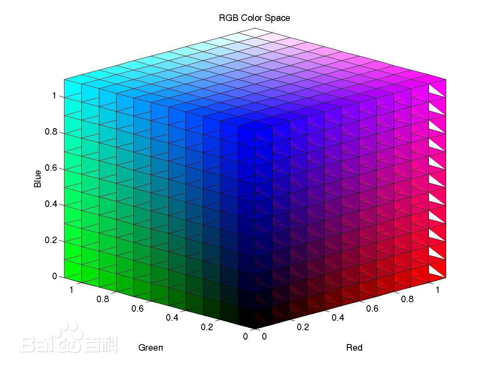

RGB模型广泛应用于电子显示设备，如电视、电脑显示器和手机屏幕等。每个像素由RGB三个子像素组成，通过调节每个子像素的亮度来显示不同的颜色。

除了RGB，还有其他颜色模型，如CMYK（用于印刷）、HSV（色相、饱和度、明度）等。

##### 位深（bit depth）

说的直白一些，图片可以看成是一个2维数组组成的矩形结构。每个格子里存放的是图片在此坐标处的像素的取值，即这一点的颜色值。

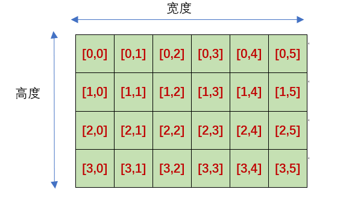

而如何表示这个像素中的数据，也就是RGB值这就有许多种方式了！

###### 1. “黑白” -> 位图模式 (1位深度)

- **位深度**： **1位/像素**
- **颜色数量**： 21=221=2 种颜色（纯黑和纯白）。
- **描述**： 这不是灰度，而是非黑即白，没有过渡。每个像素只能用1个二进制位表示，0是黑，1是白。

###### 2. “彩色” -> 索引颜色模式 (通常为8位深度)

- **位深度**： **8位/像素**
- **颜色数量**： 28=25628=256 种颜色。
- **描述**： 图像本身不包含所有颜色值，而是包含一个**颜色索引表（调色板）**。每个像素的值（0-255）是这个表的索引号，对应一种特定颜色。**GIF格式**就是典型的索引颜色图像。它能有效减小文件大小，但颜色丰富度有限。

###### 3. “真彩色” -> RGB颜色模式 (通常为24位深度)

- **位深度**： **24位/像素**
- **颜色数量**： 224=16,777,216224=16,777,216 种颜色（约1670万色）。
- **描述**： 这是最常见的“真彩色”定义。每个像素由**红(R)、绿(G)、蓝(B)** 三个通道混合而成，**每个通道占8位**（8 bits × 3 channels = 24 bits/像素）。每个通道有256级（0-255）亮度，组合起来就能产生极其丰富的色彩，足以骗过人眼。

###### 4. “真彩色 + 透明通道” -> RGB颜色模式 + Alpha通道 (通常为32位深度)

- **位深度**： **32位/像素**
- **描述**： 这是在24位真彩色的基础上，增加了一个**8位的Alpha通道**（8 bits × 4 channels = 32 bits/像素）。Alpha通道专门用于存储每个像素的**不透明度**信息（0为完全透明，255为完全不透明）。这使得图像可以具有平滑的渐变透明效果，用于合成、网页设计（PNG格式支持）。

#### 图像大小

图像大小（File Size）是存储图像所需的数据量，通常以 **KB、MB**为单位。它由以下因素决定：

1. **分辨率**：像素越多，数据量越大。
2. **位深**：每个像素占用的比特数。
3. **压缩算法**：如 JPEG 有损压缩 vs. PNG 无损压缩。

未压缩的图像大小可通过公式计算：

```css
图像大小（字节）= 分辨率（宽 × 高） × 位深（比特/像素） / 8
```

例如：

- `1920×1200` 的 8 位灰度图像：
  `1920×1200 × 8 / 8 = 2,304,000 字节 ≈ 2.2MB`。
- 同分辨率的 24 位彩色图像：
  `1920×1200 × 24 / 8 = 6,912,000 字节 ≈ 6.6MB`。

#### YUV颜色空间

##### YUV

**YUV** 是一种颜色编码系统，它将亮度信息与颜色信息**分离开来**。它不是为了描述“什么颜色”，而是为了更高效地传输和压缩图像数据而设计的。

**核心思想**：人眼对**亮度的变化**比对**颜色的变化**更敏感。

YUV 将图像信息分为三个独立的分量：

1. **Y（亮度）**：
   - 代表图像的**明暗信息**，也就是我们常说的“灰度图”。它包含了所有的细节和轮廓信息。
   - 人眼对Y分量最为敏感。
   - 其取值范围为 **0到255**。其中，0表示最暗的黑色，255表示最亮的白色。Y分量的值越高，表示图像越明亮。
2. **U（蓝色差）**：
   - 代表**蓝色** 与 **亮度Y** 之间的差异。`U = B - Y`
   - 表示图像的蓝色饱和度，U和V的取值范围为 **-128到127**。
3. **V（红色差）**：
   - 代表**红色** 与 **亮度Y** 之间的差异。`V = R - Y`
   - 表示图像的红色饱和度，U和V的取值范围为 **-128到127**。

**一个简单的比喻：黑白照片和彩色滤镜**

- **Y分量** 就像一张**清晰的黑白照片**，包含了所有的细节。
- **U和V分量** 就像两张**透明的彩色滤镜**，一张偏蓝（U），一张偏红（V）。
- 当把这两张彩色滤镜叠加到黑白照片上时，就得到了完整的彩色图像。

如果输出Y'CbCr三个分量的值，那么会是这样的：


**为什么需要YUV？—— 与RGB的对比**

| 特性         | RGB                                                    | YUV                                                          |
| :----------- | :----------------------------------------------------- | :----------------------------------------------------------- |
| **设计理念** | 面向**显示设备**（如何用光混合出颜色）                 | 面向**信号传输与压缩**（如何符合人眼特性）                   |
| **数据冗余** | 高。三个分量同等重要，改变任何一个都会影响亮度和颜色。 | **低**。将最重要的亮度（Y）和相对不重要的色度（UV）分离。    |
| **压缩效率** | 相对较低                                               | **非常高**。可以利用人眼特性，对UV分量进行“下采样”，大幅减少数据量。 |

**核心优势：色度下采样**

因为人眼对颜色细节不敏感，我们可以**减少UV分量的分辨率，而几乎不损失主观画质**。这就是YUV模型中最重要的实践：**色度下采样**。

它的表示法通常是 `YUV 4:x:y`：

- **YUV 4:4:4**

  - **无下采样**。每一个Y像素都有自己对应的U和V值。
  - 质量最高，数据量与RGB相同。
  - **数据关系**： `[Y][U][V] [Y][U][V] [Y][U][V] [Y][U][V]` （4组YUV）

  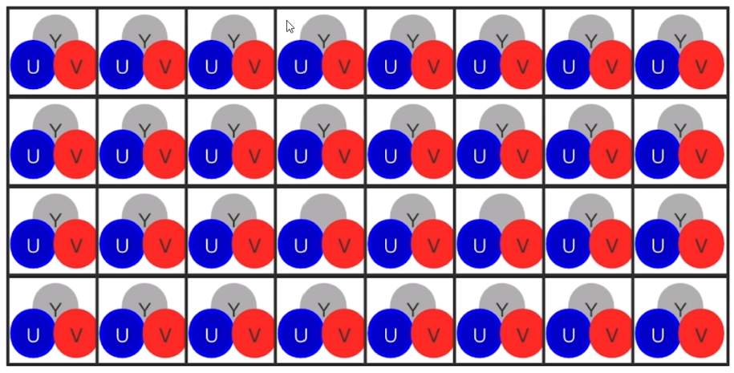

- **YUV 4:2:2**

  - **水平方向2:1下采样**。每两个**水平相邻**的Y像素**共享一组**U和V值。
  - 常用于专业视频制作。
  - **数据关系**： `[Y][U] [Y][V] [Y][U] [Y][V]` （4个Y，对应2个U和2个V）

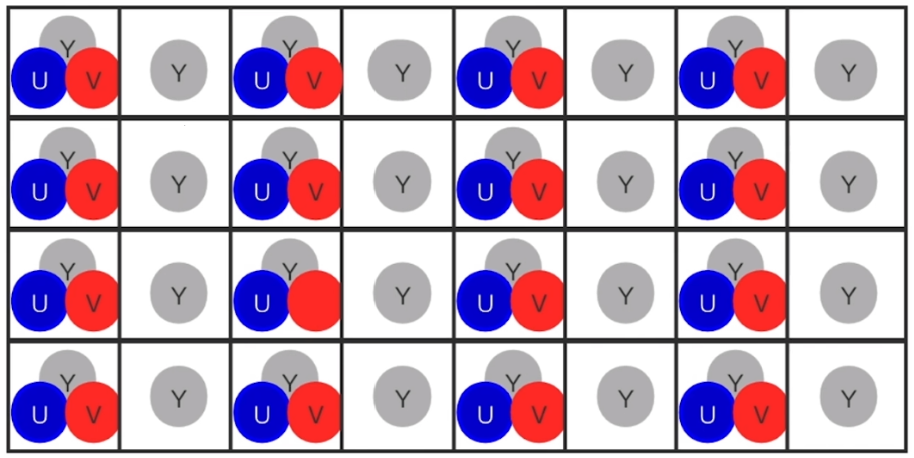

- **YUV 4:2:0**
  - **水平和垂直方向均2:1下采样**。每2x2共**四个**Y像素**共享一组**U和V值。
  - **这是最常用的格式！** 广泛用于DVD、蓝光、网络视频（MPEG, H.264, HEVC）、电视广播。
  - 数据量比4:4:4减少了整整**一半**，而视觉损失极小。

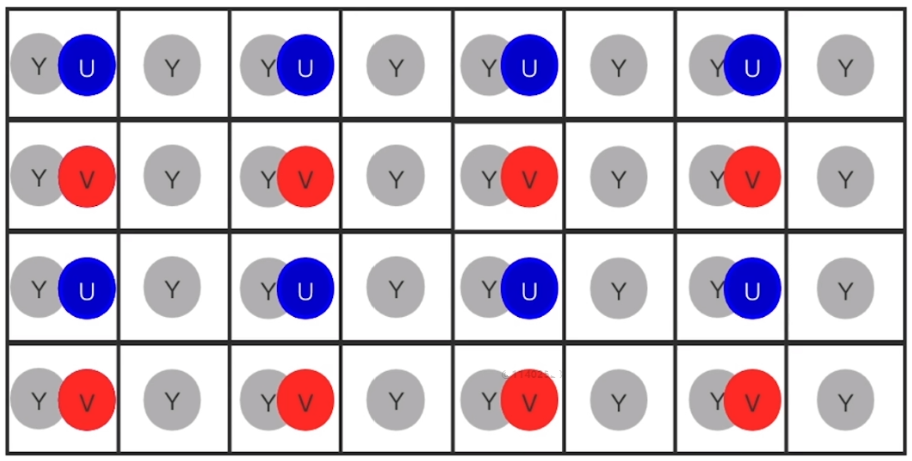

##### YUV 与 RGB 的转换

在渲染时，不支持直接渲染YUV数据，底层都是转为RGB。

YUV和RGB之间可以通过数学公式相互转换。存在多个标准（如BT.601, BT.709, BT.2020），这里给出最常用的**BT.601**标准公式：

###### RGB 转 YUV

```css
Y = 0.299 * R + 0.587 * G + 0.114 * B
U = -0.147 * R - 0.289 * G + 0.436 * B
V = 0.615 * R - 0.515 * G - 0.100 * B 
```

###### YUV 转 RGB

```CSS
R = Y + 1.14 * v
G = Y - 0.395 * U - 0.581 * V
B = Y + 2.032 * U
```

##### YUV存储格式

YUV的存储方式（也称为**格式**或**平面格式**）多种多样，主要区别在于**Y、U、V三个分量是如何在内存中排列的**，以及**是否进行了色度下采样**。

**三种主要的存储布局：**

###### 1. Packed（打包格式）

- **描述**：Y、U、V分量像RGB一样，**交错排列**存储。每个像素的数据都紧挨在一起。

- **类比**：像一串彩灯，红、绿、蓝灯一个接一个地交替排列。

- **格式**：

  - YUYV（属于 Packed, 4:2:2下采样）：别名YUY2，每两个水平相邻的像素（Y0和Y1）**共享一组U0 V0**色度值。宏像素为4字节，包含2个像素的信息。

  - **内存布局示意图**，假设图像宽度为4像素

    ```css
    // 第1行： [Y00 U00 Y01 V00]   [Y02 U02 Y03 V02]
    // 第2行： [Y10 U10 Y11 V10]   [Y12 U12 Y13 V12]
    // ...
    ```

###### 2. Planar（平面格式）

- **描述**：Y、U、V三个分量被分别存储在**三个独立、连续的内存块（平面）** 中。
- **类比**：像三张透明的幻灯片，一张全是亮度（Y），一张全是蓝色差（U），一张全是红色差（V）。叠在一起形成完整图像。
- **格式**：
  - I420（属于 Planar, 4:2:0下采样） ：别名YUV420P，先存储**所有Y**，然后存储**所有U**，最后存储**所有V**。这是最常用、最标准的YUV420格式。每2x2的4个Y像素**共享一个U和一个V**。
  - YV12（属于 Planar, 4:2:0下采样）：和I420类似，只不过是先存储**所有Y**，然后存储**所有V**，最后存储**所有U**。

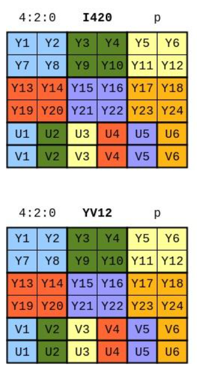

###### 3. Semi-Planar（半平面格式）

- **描述**：亮度分量Y单独一个平面，而**色度分量U和V交错打包**在另一个平面。
- **类比**：一张亮度幻灯片（Y），另一张幻灯片上是蓝、红、蓝、红...交错排列的色点（UV）。
- **格式**：
  - NV12（属于 Semi-Planar, 4:2:0下采样），先存储**所有Y**，然后存储**U和V交错**的平面。
  - NV21（属于 Semi-Planar, 4:2:0下采样），与NV12类似，但UV平面的顺序是**VU交错**

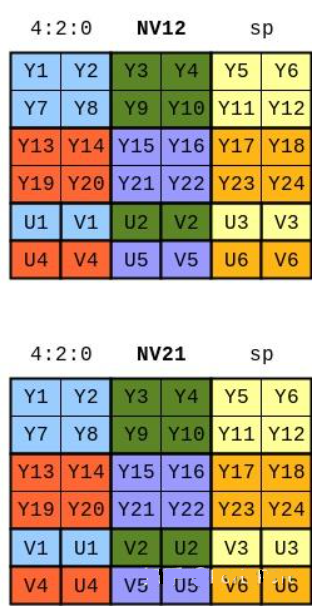

###### 为什么存储格式如此重要？

1. **性能优化**：
   - **硬件加速**：NV12等格式被设计为与GPU内存布局兼容，便于零拷贝传输和硬件编解码，极大提升性能。
   - **软件处理**：I420格式便于单独对Y平面（亮度）进行快速处理（如锐化、边缘检测）。
2. **兼容性**：
   - 不同的API和平台偏好不同的格式。例如，OpenCV默认使用BGR，但读入视频时会将其转换为I420进行处理。安卓相机输出NV21，而iOS可能输出NV12。
3. **数据转换**：
   - 在音视频处理管线中，经常需要在不同YUV格式之间、或在YUV与RGB之间进行转换，这是一个常见的性能和精度考量点。

**简单来说，理解YUV的存储方式，就是理解了YUV数据在计算机内存中的“物理形态”，这对于进行高效的视频编程和问题排查至关重要。**

#### 码率

**视频码率**，也叫**比特率**，指的是**视频文件在单位时间内所使用的数据量**。

- **单位**：通常用 **bps** 表示，如：
  - kbps（千比特每秒）
  - Mbps（兆比特每秒）
- **简单理解**：码率就像是给视频数据分配的 **“带宽预算”**。这个预算越高，就能记录越多的画面细节和颜色信息，视频质量就越好；预算越低，就必须舍弃更多信息，导致画质下降。

**一个完美的比喻：快递包裹**

- **高码率**：像一个**大箱子**，你可以把物品（视频细节）精心包装，完好无损地寄出。
- **低码率**：像一个**小盒子**，你必须把物品（视频细节）用力挤压、甚至拆掉一些不必要的部分才能塞进去，导致收到时物品可能已经变形或破损。

##### 码率如何影响视频？

###### 1. 码率与视频质量

这是最直接的关系。在**相同的编码格式和分辨率下**，码率与质量成正相关。

- **码率不足**会导致明显的**压缩瑕疵**：
  - **块状模糊**：图像中出现马赛克一样的色块。
  - **色带**：原本平滑的颜色渐变区域出现一层层的色带。
  - **噪声和颗粒**：尤其是在暗光场景下。
  - **动态模糊**：快速运动的物体变得模糊不清。
- **码率充足**时，视频会显得：
  - **清晰、锐利**
  - **颜色过渡平滑**
  - **动态画面流畅**

**注意**：存在一个 **“收益递减”** 点。超过这个点后，再增加码率，人眼将几乎无法察觉画质提升，但文件体积会线性增长。

###### 2. 码率与文件大小

这是一个简单的数学关系：

**文件大小 ≈ 码率 × 时长**

- **举例**：一个10分钟（600秒）的视频：
  - 用 4 Mbps 的码率：`4 Mbit/s × 600 s = 2400 Mbit = 300 MByte`
  - 用 8 Mbps 的码率：文件大小直接翻倍，约为 `600 MByte`

###### 3. 码率与传输/播放

码率直接决定了播放视频所需的**网络带宽**或**存储设备读取速度**。

- **流媒体**：如果你的网络带宽低于视频的码率，就会导致**卡顿、缓冲**。
- **本地播放**：如果你的硬盘或U盘读取速度跟不上，视频也会卡顿。

### 视频编码

#### 为什么需要编码？

**视频编码**的本质是**压缩**。它的存在是为了解决一个根本矛盾：**原始视频数据量极其庞大**与**存储和传输带宽极其有限**之间的矛盾。

**一个惊人的例子：**

- 一段1分钟、未压缩的1080p（1920x1080）、30帧/秒的视频：
  - 每帧像素：1920 × 1080 = 2,073,600 像素
  - 每个像素的RGB信息占3字节
  - 总数据量 = 2,073,600 × 3 × 30 fps × 60秒 ≈ **10.7 GB**
- **问题**：一张单层DVD容量仅4.7GB，连1分钟的视频都存不下！网络传输更是天方夜谭。

**视频编码的目的**：运用复杂的算法，在**保证主观观看质量**的前提下，将原始视频数据**压缩到几百分之一甚至几千分之一**的大小。

#### 视频编码如何实现压缩？

编码器通过寻找并消除以下三种**冗余**来实现压缩：

##### 1. 空间冗余（帧内压缩）

- **是什么**：同一帧图像内，相邻的像素点在颜色和亮度上往往非常相似。
- **怎么办**：使用**帧内预测**。不直接记录每个像素的值，而是将图像分成小块，只记录**当前块与预测块的差异**。
- **比喻**：描述一幅蓝天图片，不说“第1个像素是天蓝，第2个像素是天蓝...”，而是说“从这里开始，连续1000个像素都是天蓝”。

##### 2. 时间冗余（帧间压缩）

- **是什么**：视频序列中，相邻帧之间的内容变化通常很小（如静止的背景）。
- **怎么办**：使用**运动估计与补偿**。
  - **运动估计**：分析当前帧中的块在参考帧（前/后帧）中最匹配的位置，并记录其**运动矢量**。
  - **运动补偿**：只记录**当前块与参考块之间的差异（残差）**。
- **比喻**：制作动画时，不重画每一帧，只画出移动的部分，并告诉动画师“这个角色从A点移动到了B点”。

##### 3. 统计冗余（熵编码）

- **是什么**：在压缩后的数据中，某些二进制码出现的概率远高于其他码。
- **怎么办**：使用**熵编码**（如CABAC, CAVLC）。为**出现频率高的模式分配短的二进制码**，为**出现频率低的模式分配长的二进制码**。
- **比喻**：像摩斯电码，常见的字母“E”用最短的点（·）表示，而罕见的“Q”用较长的“--·-”表示。

#### 关键概念与帧类型

##### 帧类型

- **I帧（关键帧）**：
  - **编码方式**：仅使用**帧内压缩**，不依赖其他帧。
  - **作用**：完整的独立帧，是视频的“锚点”和随机访问的入口。解码器可以从I帧开始独立解码。
  - **特点**：压缩率低，但必不可少。
- **P帧（预测帧）**：
  - **编码方式**：使用**帧间压缩**，参考**前面的** I帧或P帧。
  - **作用**：通过参考前一帧，只记录变化的部分（运动矢量和残差）。
  - **特点**：压缩率比I帧高。
- **B帧（双向预测帧）**：
  - **编码方式**：使用**帧间压缩**，可以同时参考**前面和后面**的帧。
  - **作用**：利用前后信息，获得最高的压缩率。
  - **特点**：压缩率最高，但编码复杂、延迟高。

##### 理解

 I帧自身可以通过视频解压算法解压成一张单独的完整视频画面， 所以I帧去掉的是视频帧在空间维度上的冗余信息。 P帧需要参考其前面的一个I帧或者P帧来解码成一张完整的视频画面。 B帧则需要参考其前一个I帧或者P帧及其后面的一个P帧来生成一 张完整的视频画面，所以P帧与B帧去掉的是视频帧在时间维度上的冗余信息。

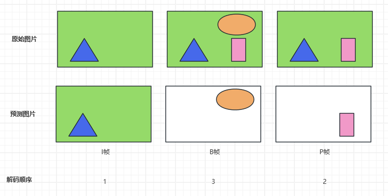

I帧记录的就是完整的信息，这里不用多说。看一下I帧与P帧的关系。首先我们看原始的图片，P帧比I帧多了一个小方块。所以P帧最后的存储的就只是一个小方块的信息。**可以理解为I帧与P帧组合起来就得到原始的图片了。**

同理，来看一下B帧。可以看到B帧与I帧，p帧的组合才会形成原始图片。

##### GOP（图像组）

- **定义**：从一个I帧开始，到下一个I帧之前结束的一组连续帧。
- **GOP长度**：GOP越长（I帧间隔越远），压缩效率越高，但随机搜索和错误恢复能力越差。

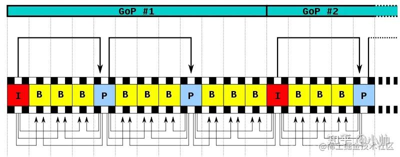

#### PTS和DTS

通过上面的描述可以看出：P帧需要参考前面的I帧或P帧才可以生成一张完整的图片，而B帧则需要参考前面I帧或P帧及其后面的一个P帧才可以生成一张完整的图片。这样就带来了一个问题：在视频流中，先到来的 B 帧无法立即解码，需要等待它依赖的后面的 I、P 帧先解码完成，这样一来播放时间与解码时间不一致了，顺序打乱了，那这些帧该如何播放呢？这时就引入了另外两个概念：DTS 和 PTS。

DTS（Decoding Time Stamp）：即**解码时间戳**，这个时间戳的意义在于告诉播放器该在什么时候解码这一帧的数据。 

PTS（Presentation Time Stamp）：即**显示时间戳**，这个时间戳用来告诉播放器该在什么时候显示这一帧的数据。

> 虽然 DTS、PTS 是用于指导播放端的行为，**但它们是在编码的时候由编码器生成的**。

在视频采集的时候是录制一帧就编码一帧发送一帧的，在编码的时候会生成 PTS，这里需要特别注意的是 frame（帧）的编码方式，在通常的场景中，编解码器编码一个 I 帧，然后向后跳过几个帧，用编码 I 帧作为基准帧对一个未来 P 帧进行编码，然后跳回到 I 帧之后的下一个帧。编码的 I 帧和 P 帧之间的帧被编码为B 帧。之后，编码器会再次跳过几个帧，使用第一个 P 帧作为基准帧编码另外一个 P 帧，然后再次跳回，用 B 帧填充显示序列中的空隙。这个过程不断继续，每 12 到 15 个 P 帧和 B 帧内插入一个新的 I 帧。P 帧由前一个 I 帧或 P 帧图像来预测，而 B 帧由前后的两个 P 帧或一个I帧和一个P帧来预测，因而编解码和帧的显示顺序有所不同，如下所示：

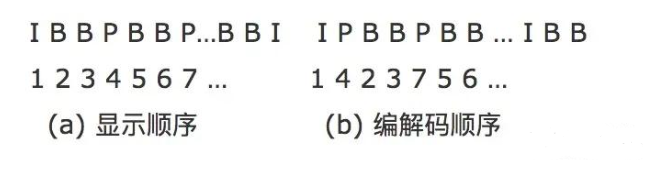

#### 主流视频编码标准 

视频编码标准是一套公认的“语法规则”，确保编码器压缩的视频能被符合标准的解码器正确解压。

| 标准           | 发布年份 | 核心特点                                                     | 主要应用                                                     |
| :------------- | :------- | :----------------------------------------------------------- | :----------------------------------------------------------- |
| **H.264/AVC**  | 2003     | **兼容性之王**。在相同画质下，比MPEG-2压缩率提高一倍。       | Blu-ray Disc， 网络视频（YouTube， B站）， 视频会议， 广播电视。 |
| **H.265/HEVC** | 2013     | 压缩效率比H.264**再提高约50%**。支持4K/8K， 但专利授权复杂。 | 4K超高清电视， 高端在线流媒体（如Netflix 4K）。              |
| **AV1**        | 2018     | **开源、免费**。由谷歌、苹果、微软等组成的联盟开发。压缩效率与H.265相当或更好。 | YouTube， Netflix， Facebook等追求带宽节省的流媒体平台。     |
| **H.266/VVC**  | 2020     | 压缩效率比H.265**再提高约50%**。专为4K/8K、360°全景视频、HDR设计。 | 未来的8K流媒体、沉浸式通信。                                 |

**视频编码的完整流程：**

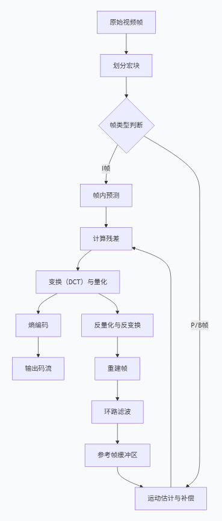

**简化解释**：

1. **分割**：将一帧图像分割成块（如16x16的宏块）。
2. **预测**：
   - **帧内预测**：利用当前帧内已编码部分预测当前块。
   - **帧间预测**：利用其他帧预测当前块（运动估计）。
3. **变换与量化**：
   - **变换**：将残差数据从空间域转换到频率域（常用DCT），将能量集中，便于压缩。
   - **量化**：有损压缩的关键步骤，通过降低数据精度来大幅减小数据量（心理视觉模型决定丢弃哪些人眼不敏感的信息）。
4. **熵编码**：对量化后的数据进行无损压缩。
5. **重建**：编码器内部会模拟解码过程，将压缩后的数据解码重建，作为后续帧的参考，确保编码器和解码器端的参考帧一致。

**简单来说，视频编码就是一场在“画质”、“体积”和“计算复杂度”之间不断寻求最佳平衡的伟大工程与艺术。** 它通过模仿人眼视觉系统和利用视频信号的内在规律，巧妙地“欺骗”了我们的大脑，让我们在有限的数据下享受到了无限的视觉盛宴。


### 音频是什么？

#### 基本知识

声音（sound）是由物体振动产生的声波，通过任何介质（空气或固体、液体）传播并能被人或动物听觉器官所感知的波动现象。最初发出振动（震动）的物体叫声源。

**音频**是指人耳可以听到的声音频率范围，通常在**20Hz到20kHz**之间的声波，包括音乐、语音和各种噪音等。音频不仅指声音本身，还可以指存储声音内容的文件，如通过数字音乐软件处理的录音或CD。在日常生活中，音频是信息获取的重要方式，其本质是声音的采集、存储和播放。

从物理本质上讲，声音是由物体振动产生的**机械波**，通过空气等介质传播，引起我们耳膜的振动，最终被大脑感知为“声音”。

#### 音频三个层面

##### 1. 物理层面：声音是如何产生的？

- **振动源**：任何振动物体，如吉他弦、人的声带、音箱的纸盆。
- **声波**：振动导致周围空气分子发生疏密相间的变化，形成像水波一样向外传播的机械波。
- **关键属性**：
  - **频率**：每秒振动的次数，单位是赫兹（Hz）。它决定了声音的**音调**。频率高，声音尖锐；频率低，声音低沉。人耳能听到的范围大约是 **20Hz 到 20,000Hz**。
  - **振幅**：声波振动的大小。它决定了声音的**响度**（音量）。振幅大，声音响；振幅小，声音轻。

##### 2. 生理与心理层面：我们是如何感知声音的？

人耳是一个精密的接收器，大脑则是一个强大的处理器。

- **听觉**：声波引起耳膜振动，经由听小骨传递到耳蜗，最终转换成神经电信号传给大脑。
- **心理声学**：这是音频技术的核心依据。它研究人耳的主观听觉特性，例如：
  - **听觉掩蔽**：一个强声音会掩盖同时存在的弱声音。**MP3等有损压缩格式正是利用这一点来剔除人耳听不到的信息**，从而减小文件体积。
  - **对频率的敏感度**：人耳对中频（比如人声）最敏感，对极高和极低频相对不敏感。

##### 3. 技术层面：如何将声音“数字化”？

这是我们今天接触到的几乎所有音频的形态。这个过程叫做 **“模拟-数字转换”**。

- **采样**：在连续的声音波形上，**每隔固定时间测量一次振幅**。每秒采样的次数称为**采样率**（如44.1kHz）。根据奈奎斯特定理，采样率至少需要是目标频率的两倍才能准确记录。CD标准的44.1kHz就是为了捕捉最高20kHz的人耳听觉极限。
- **量化**：将每次采样得到的振幅值，**近似为一个最接近的数字值**。这个数字的精度由**位深度**决定（如16-bit）。位深度越高，能表示的动态范围越广，记录的声音细节越多，噪声越低。

**一个生动的比喻：**
把模拟声音信号变成数字音频，就像用**乐高积木**来搭建一个**光滑的滑梯**。

- **采样率**决定了你**沿着滑梯长度方向每隔多远放一块积木**。积木放得越密（采样率越高），滑梯的形状就越精确。
- **位深度**决定了你**有多少种不同高度的积木**。积木的高度种类越多（位深度越高），你搭建出来的滑梯坡度就越平滑，越接近原始形状。

经过采样和量化，连续的声波就变成了一串离散的数字序列，可以被计算机存储和处理。

#### 音频采集以及模数转换

声波是一种在时间和振幅上连续的模拟量，麦克风就是一种采集声波并将其转换成模拟电压信号输出的装置，有了声波的模拟电压信号，下一步需要将模拟信号数字化，即将模拟信号通过模数转换器（A/D）后转换成数字信号，最常见的模数转换方式就是脉冲编码调制[PCM](https://zhida.zhihu.com/search?content_id=240656053&content_type=Article&match_order=1&q=PCM&zhida_source=entity)（Pulse Code Modulation），CM中的声音数据没有被压缩，它**是由模拟信号经过采样、量化、编码转换成的标准的数字音频数据**。

##### 采样率

**采样率表示音频信号每秒的数字快照数**。该速率决定了音频文件的频率范围。采样率越高，数字波形的形状越接近原始模拟波形。

低采样率会限制可录制的频率范围，这可导致录音表现原始声音的效果不佳。

根据**奈奎斯特采样定理**，为了重现给定频率，采样率必须至少是该频率的两倍。

例如，一般CD唱片的采样率为每秒 44,100 个采样，因此可重现最高为 22,050 Hz 的频率，此频率刚好超过人类的听力极限 20,000 Hz。

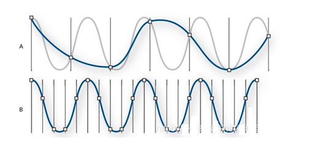

图中A是低采样率的音频信号，其效果已经将原始声波进行了扭曲，B则是完全重现原始声波的高采样率的音频信号。

数字音频常用的采样率如下：

| 采样率   | 品质级别                     | 频率范围   |
| -------- | ---------------------------- | ---------- |
| 11025 Hz | 较差的AM电台（低端多媒体）   | 0-5512 Hz  |
| 22050 Hz | 接近FM电台 (高端多媒体)      | 0-11025 Hz |
| 32000 Hz | 好于FM电台（标准广播采样率） | 0-16000 Hz |
| 44100 Hz | CD                           | 0-22050 Hz |
| 48000 Hz | 标准DVD                      | 0-24000 Hz |
| 96000 Hz | 蓝光DVD                      | 0-48000 Hz |

##### 采样位数

**采样位数**，也称为**位深度** 或**量化精度**，指的是在模数转换过程中，用于表示**每一个采样点振幅**的**二进制位数**。它决定了音频的动态范围（即最弱和最强声音之间的差异）。

**一个完美的比喻：测量身高的尺子**

- **低采样位数**：像一把只有**厘米**刻度的尺子。你只能测量到“大约175厘米”。
- **高采样位数**：像一把有**毫米**刻度的尺子。你能精确测量到“175.3厘米”。

采样位数就是音频的“刻度尺”，它决定了记录声音振幅的精确度。

**采样位数如何工作？**

当模拟声音信号被采样后，需要将连续的振幅值转换为离散的数字值。这个过程叫做**量化**。

- **量化等级**：一个 `n` 位的采样位数可以表示 2n2*n* 个不同的量化等级。
- **量化误差**：由于模拟信号是连续的，而数字值是离散的，转换过程中必然会产生四舍五入的误差。这个误差就是**量化噪声**。

**采样位数越高，量化等级越多，量化误差（噪声）就越小，记录的声音就越接近原始模拟信号。**

**常见采样位数标准**

| 采样位数         | 量化等级数    | 动态范围（约） | 主要应用与特点                                               |
| :--------------- | :------------ | :------------- | :----------------------------------------------------------- |
| **8-bit**        | 256           | 48 dB          | 质量很低，动态范围窄，常用于早期电脑游戏和电话语音。         |
| **16-bit**       | 65,536        | **96 dB**      | **CD音质标准**。动态范围足够覆盖大部分音乐，是几十年来的消费级音频基准。 |
| **24-bit**       | 16,777,216    | **144 dB**     | **专业录音和高分辨率音频标准**。提供了巨大的“净空”，能捕捉极其微弱的细节，同时本底噪声极低。 |
| **32-bit float** | 4,294,967,296 | 理论上近乎无限 | **专业音频工作站内部处理**。几乎不可能出现削波失真，因为其动态范围远超任何模拟或数字设备。 |

动态范围指系统能处理的**最响亮声音**与**最安静声音**之间的差值，是采样位数最核心的作用。

- **计算公式**：动态范围 ≈ **6.02 × 位深度 + 1.76** dB
  - 对于16-bit： `6.02 × 16 + 1.76 ≈ 96 dB`
  - 对于24-bit： `6.02 × 24 + 1.76 ≈ 144 dB`

##### 声道数

**声道**，通俗来讲，就是指**独立的声音轨道**。一个音频信号中包含几个“声道”，就意味着它有几条可以独立播放、记录不同信息的音频流。

您可以把它想象成一条多车道的公路：

- **单声道** 只有一条轨道。所有扬声器都会播放完全相同的声音。
- **立体声** 有两条独立的轨道——左声道和右声道。这创造了基本的左右声场和宽度感。
- **多声道** 
  - **5.1声道** 有**六条**独立的轨道：
    - 左前、右前、中置、左环绕、右环绕（这5个是“.1”前面的“5”）
    - 低频效果声道（这就是“.1”，专门负责低音炮）
  - **7.1声道、杜比全景声等**：拥有更多（甚至包括头顶）的独立轨道。

##### PCM编码过程

如下图所示：

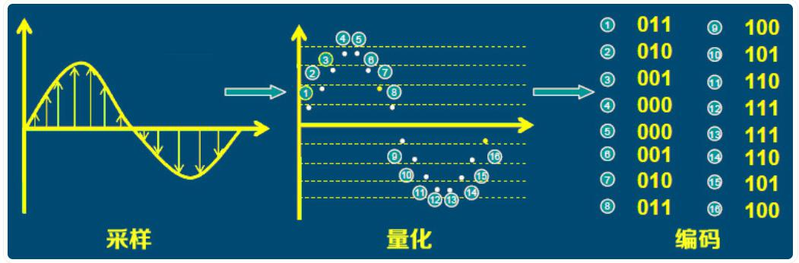

从上图中可以看到PCM编码主要有三个过程：**采样、量化、编码**。

**(1)采样**

将时间连续的模拟信号按照**采样率**提取样值，变为时间轴上离散的抽样信号的过程。采样率是每秒从模拟信号中提取样值的次数。Nyquist–Shannon(奈奎斯特-香农)采样定律表明如果至少以模拟信号最高频率2倍的采样率对模拟信号进行均匀采样，那么原始模拟信号才能不失真的从采样产生的离散值中完全恢复。人耳可以听到的声波频率范围是 20Hz～22.05kHz，因此44.1kHz/16bit的音频数据被认为是无损音频。

**(2)量化**

抽样信号虽然是时间轴上离散的信号，但仍然是模拟信号，其样值在一定的取值范围内，可有无限多个值。显然，对无限个样值给出数字码组来对应是不可能的。为了实现以数字码表示样值，必须采用“四舍五入”的方法把样值分级“取整”，使一定取值范围内的样值由无限多个值变为有限个值。这一过程称为量化。

量化后的抽样信号与量化前的抽样信号相比较，当然有所失真，且不再是模拟信号。这种量化失真在接收端还原模拟信号时表现为噪声，并称为[量化噪声](https://zhida.zhihu.com/search?content_id=240656053&content_type=Article&match_order=1&q=量化噪声&zhida_source=entity)。量化噪声的大小取决于把样值分级“取整”的方式，分的级数越多，即量化级差或间隔越小，量化噪声也越小。

**(3)编码**

量化后的抽样信号就转化为按抽样时序排列的一串十进制数字码流，即十进制数字信号。简单高效的数据系统是二进制码系统，因此应将十进制数字代码变换成二进制编码。这种把量化的抽样信号变换成**给定字长(采样位数)**的二进制码流的过程称为编码,经过上面的PCM编码过程得到的数字信号就是 **PCM音频数据**。

在PCM编码过程中主要用3个参数表现PCM音频数据：**采样率**、**采样位数**以及**声道数**，其中采样率、采样位数上面已经讲解过，通道数即采集声音的通道数，有单声道（mono）和立体声（双声道stereo）等，声道数越多越能体现声音的空间立体效果。

##### PCM存储格式

音频数据的存储方式，主要有两种：交错（Interleaved）和平面（Planar）。

这两种模式描述的是**多声道音频数据**（如立体声的左、右声道）在内存中的排列方式。

- **交错存储**：将多个声道的数据**交替、混合**排列。
- **平面存储**：将多个声道的数据**分开、连续**排列。

**一个完美的比喻：整理两副扑克牌（红色代表左声道，黑色代表右声道）**

- **交错存储**：像洗牌一样，将两副牌混合成一摞。顺序是：`[红A], [黑A], [红2], [黑2], [红3], [黑3]...`
- **平面存储**：将两副牌完全分开，放成两摞。第一摞全是红牌：`[红A], [红2], [红3]...`；第二摞全是黑牌：`[黑A], [黑2], [黑3]...`

###### 交错存储

**原理**

交错存储将每个采样点的所有声道数据依次排列，然后再存储下一个采样点的所有声道数据。

- **格式**： `[样本1-左], [样本1-右], [样本2-左], [样本2-右], [样本3-左], [样本3-右], ...`

**详细解析（以16-bit立体声为例）**

假设我们有3个立体声采样点，其值如下：

- 采样点1: 左 = 0x1000， 右 = 0x2000
- 采样点2: 左 = 0x3000， 右 = 0x4000
- 采样点3: 左 = 0x5000， 右 = 0x6000

在内存中的**交错布局**将是：

```
[0x1000] [0x2000] [0x3000] [0x4000] [0x5000] [0x6000] ...
|<-采样1->|<-采样2->|<-采样3->|
| L | R  | L | R  | L | R  |
```

**特点：**

- **优点**：
  - 符合音频播放的天然顺序，因为声卡需要同时获取左右声道的数据进行播放。
  - 对于需要同时处理所有声道的操作（如写入文件、网络传输），效率很高。
- **缺点**：
  - 如果只想处理某一个声道（如只对左声道应用均衡器），需要在内存中**跳跃访问**，对CPU缓存不友好，效率较低。

**常见应用：**

- **WAV文件** 中的PCM数据。
- **标准API**：如Windows Wave API、Core Audio的某些模式。
- **CD音频**。

------

###### 平面存储

**原理**

平面存储为每个声道分配一个独立的、连续的内存区域。所有声道的采样点按顺序存放在各自的地盘里。

- **格式**：
  - **左声道平面**： `[样本1-左], [样本2-左], [样本3-左], ...`
  - **右声道平面**： `[样本1-右], [样本2-右], [样本3-右], ...`

**详细解析（同样以16-bit立体声为例）**

使用同样的3个采样点，在内存中的**平面布局**将是：

**左声道缓冲区：**

```
[0x1000] [0x3000] [0x5000] ...
|<-采样1->|<-采样2->|<-采样3->|
```

**右声道缓冲区：**

```
[0x2000] [0x4000] [0x6000] ...
|<-采样1->|<-采样2->|<-采样3->|
```

**特点：**

- **优点**：
  - 对**单声道处理极其高效**。如果你想对左声道进行降噪，你可以直接在左声道缓冲区内线性遍历，充分利用CPU缓存。
  - 非常适合于需要分别处理每个声道的**高级音频算法和音频编辑软件**。
- **缺点**：
  - 在需要播放或传输时，通常需要先“交织”成一个交错缓冲区，增加了一次数据重组的开销。

### 音频编码

#### 为什么需要音频编码？

**音频编码**的本质是**压缩**。它的存在是为了解决原始音频数据量过大，不便于存储和传输的问题。

**一个惊人的例子：**

- 一首4分钟的CD音质（44.1kHz, 16-bit, 立体声）的**未压缩**歌曲：
  - 数据量 = 44100 (采样/秒) × 2 (字节/采样，16-bit=2字节) × 2 (声道) × 240 (秒) ≈ **40.5 MB**
- **问题**：一张700MB的CD只能存约17首歌！通过互联网传输一首歌需要很长时间。

**音频编码的目的**：运用复杂的算法，在**保证人耳主观听感质量**的前提下，将原始音频数据**压缩到原来的1/2到1/12甚至更小**。

#### 音频编码基本原理

编码器通过寻找并消除以下两种**冗余**来实现压缩：

##### 1. 统计冗余

- **原理**：在数据中，某些二进制模式出现的概率远高于其他模式。
- **方法**：使用**熵编码**（如霍夫曼编码）。为**出现频率高的模式分配短的二进制码**，为**出现频率低的模式分配长的二进制码**。
- **比喻**：像摩斯电码，常见的字母“E”用最短的点（·）表示，而罕见的“Q”用较长的“--·-”表示。
- **应用**：**无损压缩和有损压缩都会使用此技术**。

##### 2. 感知冗余（心理声学模型）

- **原理**：这是**有损压缩的核心**。它利用**人耳的听觉特性（心理声学）**，剔除那些人耳**听不见或不易察觉**的声音信息。
- **关键特性**：
  - **听觉掩蔽**：
    - **频域掩蔽**：一个强声音（如低音鼓）会掩盖附近频率的弱声音。编码器会丢弃这些被掩盖的弱声音。
    - **时域掩蔽**：一个强声音出现前后瞬间，人耳会暂时“失聪”，听不到弱声音。编码器会利用这个瞬间进行更激进的压缩。
  - **绝对听阈**：人耳对不同频率的敏感度不同，对极低和极高频率不敏感。编码器会忽略低于听阈的声音。

##### 编码的三种主要类型

| 类型         | 核心原理                                                     | 音质                   | 压缩比                                           | 常见格式                |
| :----------- | :----------------------------------------------------------- | :--------------------- | :----------------------------------------------- | :---------------------- |
| **无损压缩** | 利用**统计冗余**，通过算法压缩数据，可**100%还原**原始PCM数据。 | **完美**               | 较低 (通常 2：1 到 3：1)                         | **FLAC, ALAC, APE**     |
| **有损压缩** | 利用**统计冗余**和**感知冗余**，**永久性删除**人耳不敏感的信息。 | **有损**，信息不可恢复 | 高 (通常 10：1 到 12：1)                         | **MP3, AAC, OGG, Opus** |
| **无压缩**   | WAV 文件保留原始音频数据，没有任何压缩                       | **完美**               | 增加了文件头，大于pcm，但是pcm一般不能直接播放。 | **wav**                 |

##### 主流音频编码格式

| 格式     | 类型 | 主要特点与适用场景                                           |
| :------- | :--- | :----------------------------------------------------------- |
| **MP3**  | 有损 | **兼容性之王**。虽然技术上已落后，但支持最广泛。             |
| **AAC**  | 有损 | **MP3的继任者**。在相同比特率下音质更好。是iTunes、YouTube、iOS、Android的标准格式。 |
| **Opus** | 有损 | **极其灵活高效**。在语音和音乐上都表现优异，**延迟极低**，是WebRTC的强制标准，适用于实时通信和游戏语音。 |
| **FLAC** | 无损 | **开源免费**，兼容性广，是目前最流行的无损格式。             |
| **ALAC** | 无损 | 苹果的无损格式，音质和压缩率与FLAC相当，在苹果生态中有最佳兼容性。 |

### 容器格式

**容器格式**，也叫**封装格式**，是一个“**包装盒**”或“**多媒体信封**”。它将不同的数据流——主要是**视频流**、**音频流**，以及**字幕**、**元数据**（如标题、作者）、**章节信息**等——按照特定的规则打包在一起，形成一个单一的文件。

**一个完美的比喻：货运集装箱**

- **视频流**和**音频流**就像是不同的货物（如电视和音响）。
- **容器格式**（如MP4）就像是一个标准化的**货运集装箱**。
- 它规定了如何将这些货物安全地、有序地装进箱子，并附上一张**清单（元数据）**，说明箱子里有什么、怎么摆放。
- 最终，这个集装箱（.mp4文件）可以通过卡车（网络）或轮船（U盘）运输。

**关键点：容器 ≠ 编码**

- **编码格式**：是**压缩数据的技术**（如H.264视频编码，AAC音频编码）。它决定了货物本身是如何被“真空压缩”的。
- **容器格式**：是**打包和组织的技术**。它决定了用什么“箱子”来装这些压缩后的货物。

**一个容器可以容纳多种不同编码格式的音视频流！**

#### 容器格式的主要功能

1. **多路复用**：将独立的视频、音频、字幕等流交织成一个单一的数据流，以便顺序播放。
2. **同步**：包含**时间戳**信息，确保音频和视频在播放时完美同步，避免“口型对不上”的问题。
3. **存储元数据**：保存文件的标题、艺术家、专辑封面、创建日期、章节等信息。
4. **容错与流式传输**：一些容器格式为网络流媒体做了优化，支持快速 seeking 和部分文件下载。

#### 主流容器格式详解

| 容器格式 | 文件扩展名             | 主要特点与优势                                               | 典型应用场景                                                 |
| :------- | :--------------------- | :----------------------------------------------------------- | :----------------------------------------------------------- |
| **MP4**  | `.mp4`                 | **通用性最强**。基于QuickTime文件格式，兼容性极佳。支持绝大多数现代编码格式（H.264, H.265, AV1视频；AAC音频）。 | 网络视频（YouTube, B站）、移动设备、本地存储。**所有领域的万金油**。 |
| **MKV**  | `.mkv`                 | **功能极其强大、灵活且开源**。几乎可以封装**任何**编码格式的视频和音频。支持高级功能如章节、菜单、多音轨、多字幕。 | 高清电影收藏、粉丝自制视频、动漫、需要复杂字幕或音轨的场景。 |
| **AVI**  | `.avi`                 | **古老但曾非常流行**。由微软开发。技术陈旧，不支持现代功能（如H.265编码、流媒体）。 | 早期的Windows系统视频文件，现已逐渐被淘汰。                  |
| **MOV**  | `.mov`                 | **苹果公司的QuickTime容器**。与MP4在技术上非常相似。在苹果生态系统中无缝兼容。 | Mac和iOS设备上的视频编辑和播放。                             |
| **TS**   | `.ts`, `.mts`, `.m2ts` | **传输流**。专为**实时传输**设计，抗错误能力强。即使数据有部分损坏，也能继续播放。 | 数字电视广播、蓝光光盘（BDMV使用M2TS）、实时流媒体。         |
| **WebM** | `.webm`                | **为Web而生**。由谷歌主导，**开源且免费**。专门用于封装VP9/AV1视频和Opus/Vorbis音频。 | HTML5视频、YouTube、以及其他追求免专利费的网络应用。         |
| **FLV**  | `.flv`                 | **Flash Video**。曾经的网络视频霸主。随着Flash的淘汰而迅速衰落。 | 旧的在线视频网站（如早期的YouTube，优酷）。                  |

------

#### 容器、视频编码、音频编码的常见组合

一个文件的扩展名（容器）不能完全决定其内部的编码格式，但通常有惯例组合：

| 你看到的文件    | 容器格式  | 内部视频编码（可能） | 内部音频编码（可能）      |
| :-------------- | :-------- | :------------------- | :------------------------ |
| `电影.mp4`      | MP4       | H.264, H.265         | AAC                       |
| `高清电影.mkv`  | MKV       | H.265, AV1, VP9      | DTS, AC3, AAC, FLAC, Opus |
| `手机拍摄.MOV`  | MOV       | H.265, H.264         | AAC                       |
| `蓝光原盘.m2ts` | M2TS (TS) | H.264, H.265         | DTS-HD MA, Dolby TrueHD   |
| `网络视频.webm` | WebM      | VP9, AV1             | Opus, Vorbis              |

------

#### 如何选择合适的容器格式？

选择取决于你的**目标**：

- **为了最大兼容性（上传到网络、发给朋友）**：**MP4** 是最安全、最普遍的选择。
- **为了存档和收藏（保留最高质量、多音轨/字幕）**：**MKV** 是不二之选，因为它无比灵活。
- **为了苹果生态系统（在Final Cut Pro中编辑）**：**MOV** 是原生选择。
- **为了现代Web开发**：**WebM** 和 **MP4** 是HTML5视频标签的黄金组合。
- **为了实时流媒体广播**：**TS** 是行业标准。


## 工具使用

### VLC

[VLC](https://www.videolan.org/vlc/index.zh_CN.html) 是一款自由、开源的跨平台多媒体播放器及框架，可播放大多数多媒体文件，以及 DVD、音频 CD、VCD 及各类流媒体协议。

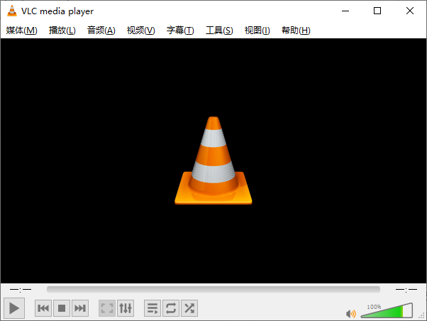

#### 直播流

[rtsp、rtmp、m3u8、flv、mkv、3gp、mp4直播流测试地址_flv测试地址-CSDN博客](https://blog.csdn.net/u014696856/article/details/134444974)


### MediaInfo

### FlvAnalyser

### Elecard

### FFmpeg

