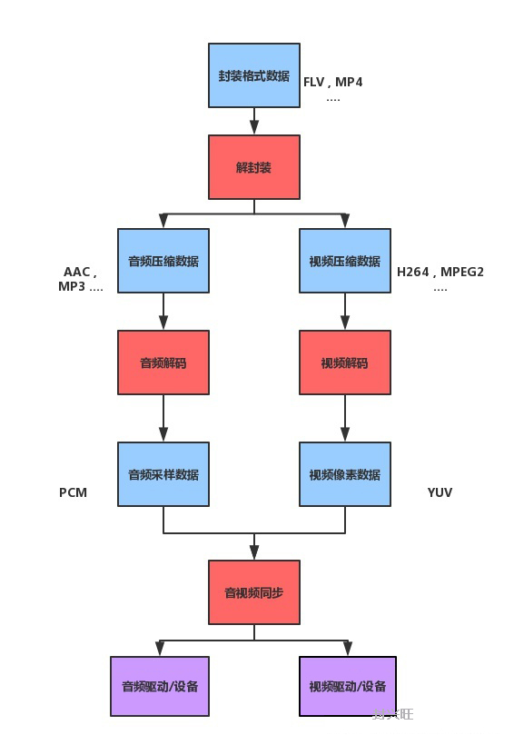
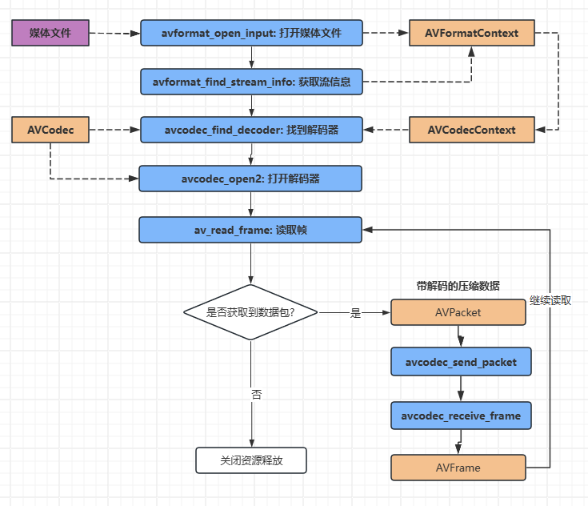

# FFmpeg开发环境搭建

## windows

### 下载编译好的ffmpeg包

进去[Releases · ShiftMediaProject/FFmpeg](https://github.com/ShiftMediaProject/FFmpeg/releases)下载VS开发包。


### 配置Vs

1. 创建项目，并将头文件目录添加到<右键项目 → 属性 → **C/C++ → 常规 → 附加包含目录**>中：

```css
F:\Tools\ffmpeg-8.0.1-full_build-shared\include
```

2. 将库文件目录添加到<属性 → **链接器 → 常规 → 附加库目录**>中：

```css
F:\Tools\ffmpeg-8.0.1-full_build-shared\lib
```

3. 将库文件添加到<属性 → **链接器 → 输入 → 附加依赖项**>中：

```css
avformat.lib
avcodec.lib
avutil.lib
swresample.lib
swscale.lib
avfilter.lib
avdevice.lib
```

也可以使用`#pragma comment`直接在代码中加载库：

```css
#pragma comment(lib, "avformat.lib")
#pragma comment(lib, "avcodec.lib")
#pragma comment(lib, "avdevice.lib")
#pragma comment(lib, "avutil.lib")
#pragma comment(lib, "swscale.lib")
#pragma comment(lib, "avfilter.lib")
```

4. 因为库是动态库，所以还需要将bin目录配置到环境变量`PATH`中，这样运行时就可以直接找到`.dll`文件了（如果要将程序发给别人，则需要拷贝bin中的dll拷贝到exe同级目录中）！

```css
F:\Tools\ffmpeg-8.0.1-full_build-shared\bin
```

5. **测试代码**

```c
#include <stdio.h>

//extern "C" {
#include "libavformat/avformat.h"
//}

#pragma comment(lib, "avformat.lib")
#pragma comment(lib, "avcodec.lib")
#pragma comment(lib, "avdevice.lib")
#pragma comment(lib, "avutil.lib")
#pragma comment(lib, "swscale.lib")
#pragma comment(lib, "avfilter.lib")

int main()
{
	printf("%s",av_version_info());

	return 0;
}
```

注意：如果在C++中测试，需要使用`extern "C" {}`将ffmpeg的头文件包括起来。

# ffmpeg库

## 八大库

ffmpeg提供了“八大金刚” 核心开发库，用于实现对音视频的各种操作。

| 库         | 介绍                                                     |
| :--------- | :------------------------------------------------------- |
| avcodec    | 音视频编解码核心库                                       |
| avformat   | 音视频容器格式的封装和解析                               |
| avutil     | 核心工具库                                               |
| swscale    | 图像格式转换的模块                                       |
| swresample | 音频重采样                                               |
| avfilter   | 音视频滤镜库，如视频加水印、音频变声                     |
| avdevice   | 输入输出设备库，提供设备数据的输入与输出，和硬件设备交互 |

## ffmpeg播放流程

通常情况下，视频文件如 MP4，MKV、FLV 等都属于封装格式，就是将已经压缩编码的视频数据和音频数据按照一定的格式放到一起。当我们播放一个媒体文件时，通常需要经过以下几个步骤：



可以看到这个视频播放器的实现需要涉及到以下内容：

- **解封装(Demuxing)**：就是将输入的封装格式的数据，分离成为音频流压缩编码数据和视频流压缩编码数据。例如，FLV 格式的数据，经过解封装操作后，输出 H.264 编码的视频码流和 AAC 编码的音频码流。
- **软硬件解码(Decode)**：就是将视频/音频压缩编码数据，解码成为非压缩的视频/音频原始数据。通过解码，将压缩编码的视频数据 H.264，MPEG2 解码成为非压缩的颜色数据，例如 YUV 等等；将压缩编码的音频数据 AAC，MP3 解码成为非压缩的音频抽样数据，例如 PCM 数据。解码分为硬编码和软编码。
- **像素格式转换**：将 YUV 数据格式转换成 RGB 数据格式。
- **重采样**：对音频重新采样。
- **dts/pts**：dts 是解码的时间戳，而 pts 是显示的时间戳。pts 用于获取当前播放进度。进度条移动需要用到`av_seek_frame`函数。
- **音视频同步**：就是根据解封装模块处理过程中获取到的参数信息，同步解码出来的音频和视频数据，并将音视频频数据送至系统的显卡和声卡播放出来（Render）。

其中解码是最重要的，下面介绍一下解码的流程以及用到的 API 和结构体。

## ffmpeg解码流程

### 流程图



### ffmpeg API说明

#### avformat_alloc_context()

用于初始化 AVFormatContext 对象。其原型如下：

```c
AVFormatContext *avformat_alloc_context(void)
```

- 因为AVFormatContext 必须初始化为 NULL 或者用`avformat_alloc_context()`进行初始化。

#### avformat_open_input()

打开媒体文件，并获得解封装上下文。其原型如下：

```c
int avformat_open_input(AVFormatContext **ps, const char *url,
                        const AVInputFormat *fmt, AVDictionary **options);
```

- `ps`：AVFormatContext 二级指针，函数调用成功之后将解封装上下文赋值给 ps。
- `url`：可以是 rtsp、http 网络流地址，或者本地视频文件路径。
- `fmt`：指定输入音视频的封装格式，一般情况下可以设置为 nullptr，则会自动探索。
- `options`：附加的一些选项，一般情况下可以设置为 nullptr，但有时候播放 rtsp 时需要设置下。

#### avformat_find_stream_info()

探测获取流信息。其原型如下：

```c
int avformat_find_stream_info(AVFormatContext *ic, AVDictionary **options)
```

- 因为在一些格式当中没有头部信息，如 flv 格式，h264 格式，调用`avformat_open_input()`在打开文件之后就没有参数，也就无法获取到里面的信息。
- 这个时候就可以调用此函数，因为它会试着去探测文件的格式，但是如果格式当中没有头部信息，那么它只能获取到编码、宽高这些信息，还是无法获得总时长。
- 如果总时长无法获取到，则需要把整个文件读一遍，获取一下它的总帧数来计算。

#### avcodec_find_decoder()

查找解码器。函数的参数是所要用解码器的ID，成功返回查找到的解码器（没有找到就返回 NULL）。其原型如下：

```c
AVCodec *avcodec_find_decoder(enum AVCodecID id);
```

- `id`：查找到的解码器

#### avcodec_open2()

用于初始化一个音视频编解码器的 AVCodecContext，声明位于 `libavcodec/avcodec.h`。其原型如下：

```c
int avcodec_open2(AVCodecContext *avctx, const AVCodec *codec, AVDictionary **options)
```

- `avctx`：需要初始化的 AVCodecContext。
- `codec`：输入的AVCodec。
- `options`：一些选项。例如使用 libx264 编码的时候，“preset”，“tune” 等都可以通过该参数设置。

#### av_read_frame()

读取码流中的音频若干帧或者视频一帧。例如，解码视频的时候，每解码一个视频帧，需要先调用`av_read_frame()`获得一帧视频的压缩数据，然后才能对该数据进行解码。其原型如下：

```c
int av_read_frame(AVFormatContext *s, AVPacket *pkt)
```

- `s`：解封装上下文。
- `pkt`：存储一帧视频的压缩数据。

#### avcodec_send_packet()

将编码数据包（AVPacket）发送到解码器。输入一个压缩编码的结构体 AVPacket，后续通过`avcodec_receive_frame`函数接受解码后的数据。其原型如下：

```c
int avcodec_send_packet(AVCodecContext *s, const AVPacket *avpkt);
```

- `s`：解封装上下文。
- `avpkt`：传入一帧视频的压缩数据

#### avcodec_receive_frame()

从解码器中接收解码后的帧（AVFrame）。接受调用`avcodec_send_packet`函数之后，编码器返回的帧。

```c
int avcodec_receive_frame(AVCodecContext *s, AVFrame *frame);
```

- `s`：解封装上下文。
- `frame`：解码之后的帧

> 注意：一个packet可能会解码出多个frame（例如，一些编码格式如B帧可能会产生多个帧），所以我们需要循环接收直到没有数据为止。

#### avformat_close_input()

关闭释放解封装上下文，并且设置为 0。其原型如下：

```c
void avformat_close_input(AVFormatContext **s)
```

- `s`：解封装上下文。

### ffmpeg结构体说明

#### AVFormatContext

解封装上下文，是存储音视频封装格式中包含信息的结构体。

```c
char *url;			 	// 保存打开的url
unsigned int nb_streams // 音视频流的个数
AVStream **streams 		// 存储视频流、音频流、字幕流信息
int64_t duration 		// 媒体文件的总时长，单位是把 1 秒切成 AV_TIME_BASE（1000000）份，即单位。为 us，注意不一定每个视频都能获取到 duration
int64_t bit_rate 		// 比特率（单位bps，转换为kbps需要除以1000）
```

#### AVStream

AVStream 是存储每一个音频/视频流信息的结构体。其重要的变量如下所示：

```c
int index 				// 当前流在AVFormatContext中的索引
AVRational time_base 	// 时间基。通过该值可以把PTS，DTS转化为实际的时间（单位为秒s）
int64_t duration 		// 该视频/音频流时长，单位为 ms
AVRational avg_frame_rate 	// 帧率（注：对视频来说，这个挺重要的）
AVPacket attached_pic 		// 附带的图片。比如说一些 MP3，AAC 音频文件附带的专辑封面
AVCodecParameters *codecpar // 音视频参数，新增用来替换AVCodecContext *codec
```

#### AVCodecContext

AVCodecContext 是一个描述编解码器上下文的结构体，包含了众多编解码器需要的参数信息。下面挑一些关键的变量来看看（这里只考虑解码）。

```c
enum AVMediaType codec_type 	// 编解码器的类型（视频，音频...）
struct AVCodec  *codec 			// 采用的解码器AVCodec（H.264,MPEG2...）    
enum AVCodecID codec_id 		// 标示特定的编解码器（H.264,MPEG2...）
int format 						// 视频像素格式/音频采样数据格式
int width, height 				// 表示视频的宽和高
int bit_rate 					// 平均比特率    
AVChannelLayout ch_layout;		// (仅音频)通道布局和通道数
int sample_rate 				// 采样率（音频）
AVRational time_base; 			// 时基。通过该值可以把PTS，DTS转化为实际的时间（单位为秒s）
uint8_t *extradata; int extradata_size; // 针对特定编码器包含的附加信息（例如对于H.264解码器来说，存储SPS，PPS等）
```

#### AVCodec

AVCodec 是存储编码器信息的结构体。其重要的变量如下所示：

```c
const char *name; 			// 编解码器的名字的简称
const char *long_name; 		// 编解码器名字的全称
enum AVMediaType type; 		// 指明了类型，是视频，音频，还是字幕
enum AVCodecID id; 			// ID，不重复
```

#### AVCodecParameters

新增用来替换`AVCodecContext *codec`。因为 AVCodecContext 结构体包含的参数太多，AVCodecParameters 将编码器的参数从 AVCodecContext 分离出来，AVCodecParameters 结构体中部分重要的参数如下：

```c
enum AVMediaType codec_type 	// 编解码器的类型（视频，音频...）   
enum AVCodecID codec_id 		// 标示特定的编解码器（H.264,MPEG2...）
int format 						// 视频像素格式/音频采样数据格式
int width, height 				// 表示视频的宽和高
int bit_rate					// 平均比特率    
AVChannelLayout ch_layout;		// (仅音频)通道布局和通道数
int sample_rate 				// (仅音频)采样率
uint8_t *extradata; int extradata_size; // 针对特定编码器包含的附加信息（例如对于H.264解码器来说，存储SPS，PPS等）
```

可以看到两者的成员基本一致。

#### AVPacket

AVPacket 是存储压缩编码数据相关信息的结构体。其重要的变量如下所示：

```c
uint8_t *data; 			// 压缩编码的数据。
/* 例如对于H.264来说。1个AVPacket的data通常对应一个NAL。
注意：在这里只是对应，而不是一模一样。他们之间有微小的差别：使用FFMPEG类库分离出多媒体文件中的H.264码流。因此在使用FFMPEG进行音视频处理的时候，常常可以将得到的AVPacket的data数据直接写成文件，从而得到音视频的码流文件。*/
int size; 			// data的大小
int64_t pts; 		// 显示时间戳
int64_t dts; 		// 解码时间戳
int stream_index; 	// 标识该AVPacket所属的视频/音频流。
```

#### AVFrame

AVFrame 结构体一般用于存储原始数据（即非压缩数据，例如对视频来说是 YUV，RGB，对音频来说是 PCM），此外还包含了一些相关的信息。比如说，解码的时候存储了宏块类型表，QP 表，运动矢量表等数据。编码的时候也存储了相关的数据。因此在使用 FFmpeg 进行码流分析的时候，AVFrame 是一个很重要的结构体。

下面看几个主要变量的作用（在这里考虑解码的情况）：

```c
uint8_t *data[AV_NUM_DATA_POINTERS]; 	// 解码后原始数据（对视频来说是YUV，RGB，对音频来说是PCM）
int linesize[AV_NUM_DATA_POINTERS]; 	// data中“一行”数据的大小。注意：未必等于图像的宽，一般大于图像的宽。
int width, height; 						// 视频帧宽和高（1920x1080,1280x720...）
int nb_samples; 						// 音频的一个AVFrame中可能包含多个音频帧，在此标记包含了几个
int format; 							// 解码后原始数据类型（YUV420，YUV422，RGB24...）
int key_frame; 							// 是否是关键帧
enum AVPictureType pict_type; 			// 帧类型（I,B,P...）
AVRational sample_aspect_ratio;		 	// 宽高比（16:9，4:3...）
int64_t pts; 							// 显示时间戳
```

# ffmpeg SDK开发

SDK（Software Development Kit）即软件开发工具包，是一系列软件工具、库、文档和示例代码的集合，旨在帮助开发者针对特定平台、系统或服务创建应用程序。

## 日志系统

通过FFmpeg日志系统可以控制FFmpeg警告或错误输出内容和方式。

### av_log

av_log()是FFmpeg中输出日志的函数。随便打开一个FFmpeg的源代码文件，就会发现其中遍布着av_log()函数。一般情况下FFmpeg类库的源代码中是不允许使用printf()这种的函数的，所有的输出一律使用av_log()。

函数原型如下：

```c
void av_log(void *avcl, int level, const char *fmt, ...)
```

- void* avcl：指向任意结构的指针，指定该log所属的结构体，例如AVFormatContext、AVCodecContext等等。
- int level：输出日志内容的等级
- const char *fmt：指定后续参数如何转换为输出的格式字符串（printf 兼容）。
- 函数最后一个参数是“…”。在C语言中，在函数参数数量不确定的情况下使用“…”来代表参数

### 日志级别

日志等级用于表示日志信息的重要性和详细程度，不同的等级适用于不同的场景。ffmpeg中定义了如下日志级别：

| 级别           | 描述                                   |
| -------------- | -------------------------------------- |
| AV_LOG_QUIET   | 不打印任何输出                         |
| AV_LOG_PANIC   | 严重问题，程序退出                     |
| AV_LOG_FATAL   | 出现了无法恢复的问题                   |
| AV_LOG_ERROR   | 错误日志                               |
| AV_LOG_WARNING | 警告日志                               |
| AV_LOG_INFO    | 信息日志                               |
| AV_LOG_VERBOSE | 详细日志                               |
| AV_LOG_DEBUG   | 调试日志(给发发人员自己看的)           |
| AV_LOG_TRACE   | 非常详细的调试日志(给发发人员自己看的) |

打印不同级别的日志：

```c
	av_log(NULL, AV_LOG_QUIET,		"Hello, QUIET!\n");
	av_log(NULL, AV_LOG_PANIC,		"Hello, PANIC!\n");
	av_log(NULL, AV_LOG_FATAL,		"Hello, FATAL!\n");
	av_log(NULL, AV_LOG_ERROR,		"Hello, ERROR!\n");
	av_log(NULL, AV_LOG_WARNING,	"Hello, WARNING!\n");
	av_log(NULL, AV_LOG_INFO,		"Hello, INFO!\n");
	av_log(NULL, AV_LOG_VERBOSE,	"Hello, VERBOSE!\n");
	av_log(NULL, AV_LOG_DEBUG,		"Hello, DEBUG!\n");
	av_log(NULL, AV_LOG_TRACE,		"Hello, TRACE!\n");
```

输入如下：

```c
Hello, QUIET!
Hello, PANIC!
Hello, FATAL!
Hello, ERROR!
Hello, WARNING!
Hello, INFO!
```

发现`VERBOSE`、`DEBUG`、`TRACE`级别的日志没有输出！为啥呢？因为ffmpeg默认的日志级别是`INFO`级别的，只打印级别大于等于`INFO`级别的日志。

可以通过`av_log_set_level`设置日志级别：

```c
av_log_set_level(AV_LOG_DEBUG);
```

这样就可以打印`VERBOSE`、`DEBUG`级别的日志了！通过`av_log_get_level`还可以获取当前日志级别哟~

### 日志回调

可以使用`av_log_set_callback`自己设置日志回调函数，自定义日志输出格式和位置。

```c
/**
 * 获取日志级别字符串.
 * 
 * \param level 级别
 * \return  返回级别字符串.
 */
const char* get_level_string(int level) {
	switch (level) {
	case AV_LOG_QUIET:
		return "QUIET";
	case AV_LOG_PANIC:
		return "PANIC";
	case AV_LOG_FATAL:
		return "FATAL";
	case AV_LOG_ERROR:
		return "ERROR";
	case AV_LOG_WARNING:
		return "WARNING";
	case AV_LOG_INFO:
		return "INFO";
	case AV_LOG_VERBOSE:
		return "VERBOSE";
	case AV_LOG_DEBUG:
		return "DEBUG";
	case AV_LOG_TRACE:
		return "TRACE";
	}
	return "UNKNOW";
}

/**
 * 获取日志字符串.
 * 
 * \param level 日志级别
 * \param log   日志内容
 * \return		返回日志字符串.
 */
const char* get_log_string(int level, const char* log) {
	static char buf[1024];

	const char* level_str = get_level_string(level);
	switch (level) {
	case AV_LOG_QUIET:
	case AV_LOG_PANIC:
	case AV_LOG_FATAL:
	case AV_LOG_ERROR:
		sprintf(buf, "\033[31m [%-7s] %s\033[0m", level_str, log);
		break;
	case AV_LOG_WARNING:
		sprintf(buf, "\033[33m [%-7s] %s\033[0m", level_str, log);
		break;
	case AV_LOG_INFO:
		sprintf(buf, "\033[37m [%-7s] %s\033[0m", level_str, log);
		break;
	case AV_LOG_VERBOSE:
	case AV_LOG_DEBUG:
		sprintf(buf, "\033[32m [%-7s] %s\033[0m", level_str, log);
		break;
	case AV_LOG_TRACE:
		sprintf(buf, "\033[90m [%-7s] %s\033[0m", level_str, log);
		break;
	}
	return buf;
}

void custom_log_callback(void* avcl, int level, const char* fmt, va_list vl) {

	static char buf[1024];
	vsnprintf(buf, sizeof(buf), fmt, vl);

	printf(get_log_string(level, buf));
}
```

测试：

```c
void test()
{
	av_log_set_level(AV_LOG_TRACE);

	av_log_set_callback(custom_log_callback);

	av_log(NULL, AV_LOG_QUIET, "Hello, QUIET!\n");
	av_log(NULL, AV_LOG_PANIC, "Hello, PANIC!\n");
	av_log(NULL, AV_LOG_FATAL, "Hello, FATAL!\n");
	av_log(NULL, AV_LOG_ERROR, "Hello, ERROR!\n");
	av_log(NULL, AV_LOG_WARNING, "Hello, WARNING!\n");
	av_log(NULL, AV_LOG_INFO, "Hello, INFO!\n");
	av_log(NULL, AV_LOG_VERBOSE, "Hello, VERBOSE!\n");
	av_log(NULL, AV_LOG_DEBUG, "Hello, DEBUG!\n");
	av_log(NULL, AV_LOG_TRACE, "Hello, TRACE!\n");
}
```

## I/O操作（AVIO*）

> #include "libavformat/avformat.h"

### 文件I/O

### 目录I/O

### 网络I/O

## 词典（AVDictionary）

## 选项（AVOption）

> #include "libavutil/opt.h"