# OBS源码下载与编译

### 先决条件

- Windows 10 1909+ (or Windows 11)
- Visual Studio 2022 (at least Community Edition)
  - Windows 10 SDK (minimum 10.0.20348.0)
  - C++ ATL for latest v143 build tools (x86 & x64)
- [Git for Windows](https://git-scm.com/downloads)
- [CMake 3.24 or newer](https://cmake.org/)

### 配置和构建项目

1. 克隆包含子模块的存储库：

   `git clone --recursive https://github.com/obsproject/obs-studio.git`

2. 设置当前目录到`obs-studio`

   `cd obs-studio`

3. 检查可用的CMake预设：`cmake --list-presets`

4. 选择`windows-x64`预设：`cmake --preset windows-x64`

   + 可用和支持的体系结构有：x64
     + 不再支持X86(32位)版本的obs-studio
   + 任何其他CMake变量都可以像往常一样提供，如果必要的话，也可以覆盖由预设设置的变量

### 详细流程

+ 执行`git clone --recursive https://github.com/obsproject/obs-studio.git`命令，克隆仓库到本地(若下载不成功，请在[网盘下载](https://pan.baidu.com/s/1sR9Nfvp1zZuaSfEd0D3UyQ?pwd=6y8a))。

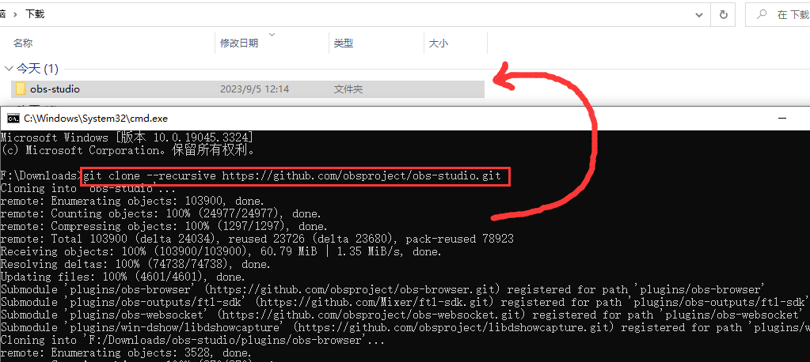

+ 切换到`obs-studio`目录

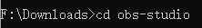

+ 查看CMake有效预设

  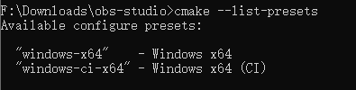

+ 选择CMake预设并构建

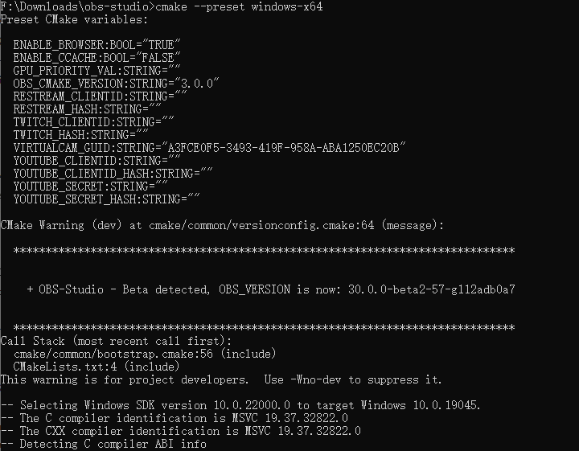

#### 包不能下载?

在构建项目时，会自动下载需要的依赖包，如下，总共四个


但是由于各种原因，会导致下载卡顿、缓慢甚至错误，所以，需要我们自己去下载。

> 只需要复制提示的下载链接然后使用迅雷就可以快速下载了！如果不行，我提供了[网盘已经下载好的包]()！

下载完成后放到指定位置，`obs-studio/.deps/`，<font color=red>注意：不用解压，也不能解压，他会自动给你解压的！</font>

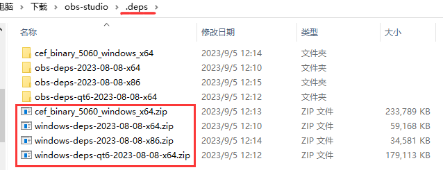

确保无误之后，重新执行`cmake --preset windows-x64`命令，成功后进入`build_x64`目录。

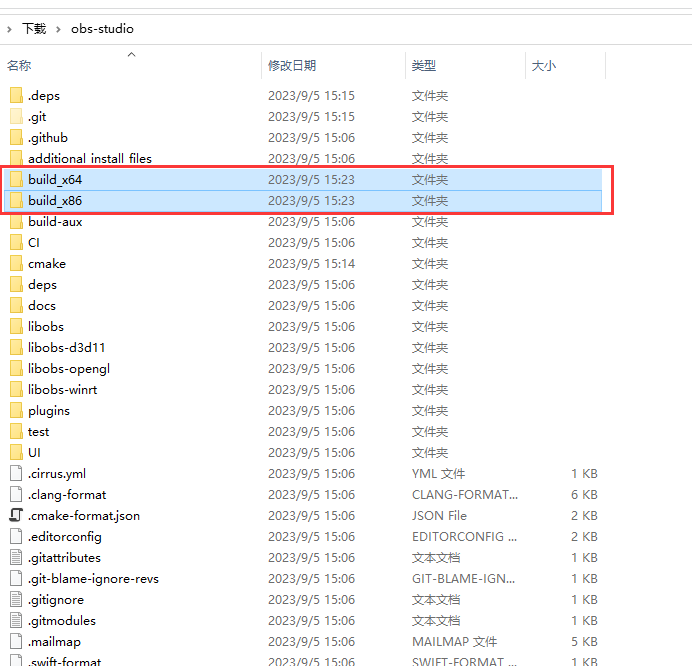

然后打开工程，编译

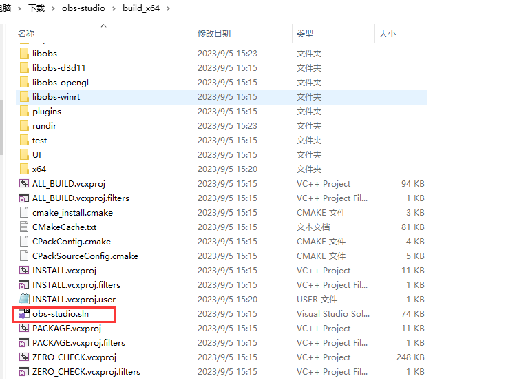

ok，成功啦！

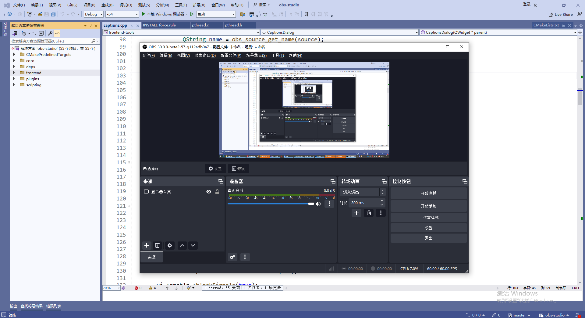

# OBS开发

## 获取运行程序需要的依赖

能正常看到obs界面之后，按照如下图所示进行安装(把exe和需要的dll放在合适的位置)。

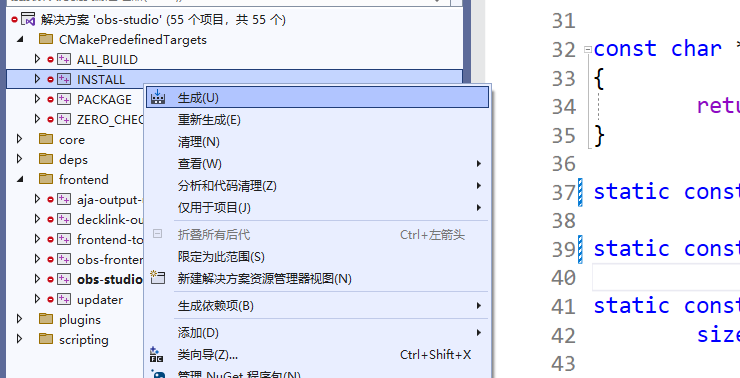

如果出现如下图所示的错误，则需要配置一下安装目录(这个错误是因为默认安装到C盘，但是没有权限，所以失败了)

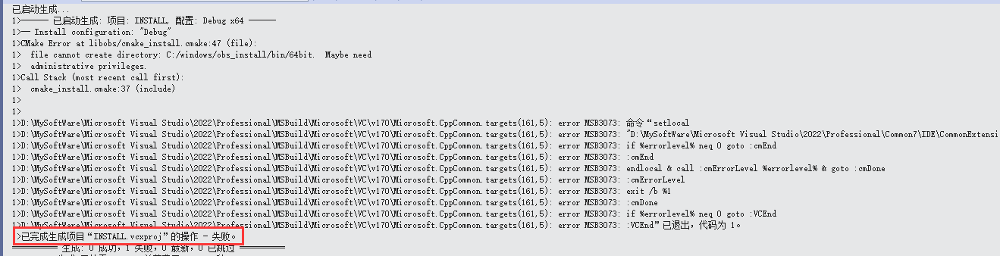

**修改配置方法如下所示：**

首先，进入obs-studio目录，找到build_x64并进入。

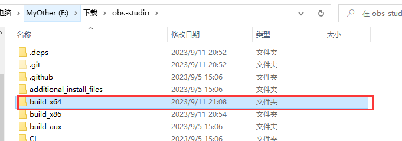**

然后找到cmake_install.cmake文件，打开修改第五行的路径为`../obs_install`，然后保存退出即可！

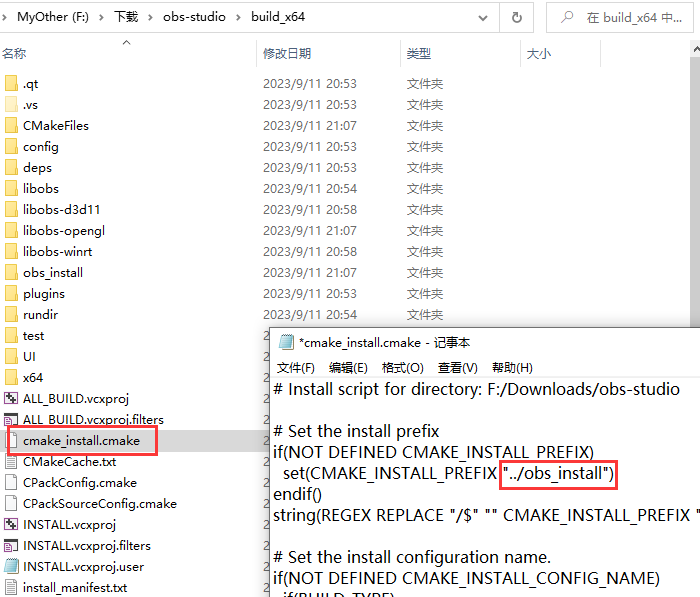

然后重新安装即可！

安装完成之后，obs_install就出现在obs_studio目录了！obs_install内容如下

```txt
.
├── bin
│   └── 64bit
├── data
│   ├── libobs
│   ├── obs-plugins
│   ├── obs-scripting
│   └── obs-studio
└── obs-plugins
    └── 64bit
```

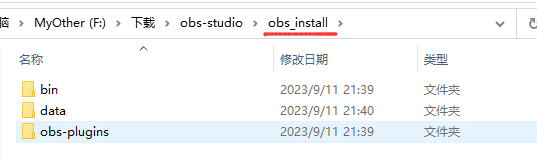

+ bin obs.exe所在的目录，以及直接的依赖
+ data 运行程序所需要的一些数据
+ obs-plugins 插件

## 修改源码

现在我们要把data和obs-plugins和obs.exe放在一起。

直接把data和obs-plugins剪切到 bin/63bit中去。

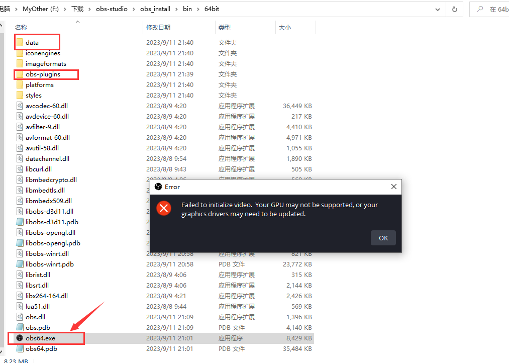

拷贝进来之后，运行obs64.exe，发现有错误，这是因为刚我直接把data和obs-plugins剪切进来了，exe运行的时候找不到这两个个目录所以失败了，所以我们需要通过修改源码，来支持这个操作(让exe在当前路径查找data和obs-plugins目录)。

找到`core/libobs/Source Files/obs-windows.c`文件，把37、39、56行修改为如下：

```cpp
static const char *module_bin[] = {"./obs-plugins/64bit"};

static const char *module_data[] = {"./data/obs-plugins/%module%"};

	if (check_path(file, "./data/libobs/", &path))
```

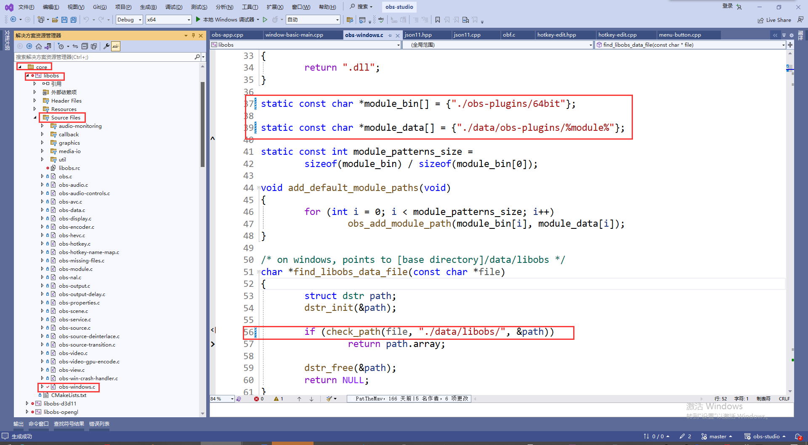

修改完毕之后，重新执行安装即可！

## CMake配置libobs开发环境

首先，按照如下图所示，找到obs.lib

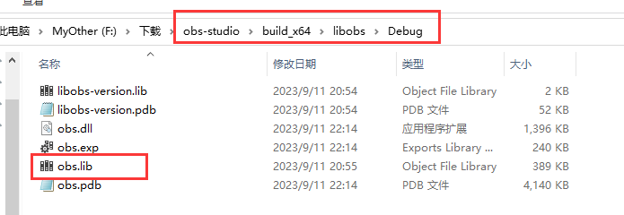

然后，找到obs-studio目录下面的`libobs`目录，这里面有需要的所有头文件。

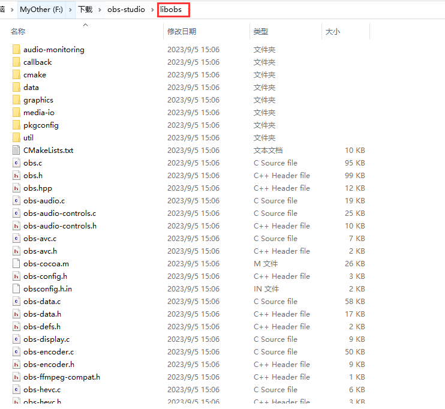

结合上面生成的依赖库，组织成如下结构：

```text
.
├── bin
│   └── 64bit
├── include
│   ├── audio-monitoring
│   ├── callback
│   ├── cmake
│   ├── CMakeLists.txt
│   ├── ... 
└── lib
    └── obs.lib
```

+ bin/64bit  里面的内容需要复制到可执行文件同级目录中去
+ include     是由libobs直接改名而来
+ lib               在使用时需要链接进程序

  在CMake中使用代码如下所示：

```cmake
set(CMAKE_AUTOMOC ON)
set(CMAKE_AUTOUIC ON)
set(CMAKE_AUTORCC ON)

find_package(Qt6 COMPONENTS Widgets)

include_directories(${CMAKE_CURRENT_LIST_DIR}/obs_sdk/include)	#添加头文件包含路径

link_directories(${CMAKE_CURRENT_LIST_DIR}/obs_sdk/lib)	#添加库文件查找路径

set(SOURCE_FILES 
	"DesktopRec.cpp" 
	"DesktopRec.h"
	ObsWrapper.h
	ObsWrapper.cpp
 "main.cpp")

add_executable (DesktopRec ${SOURCE_FILES})

target_link_libraries(DesktopRec Qt6::Widgets obs)	#把obs.lib 链接到目标
```

注意！注意！注意！一定要把bin/64bit中所有的内容复制到你的exe目录总

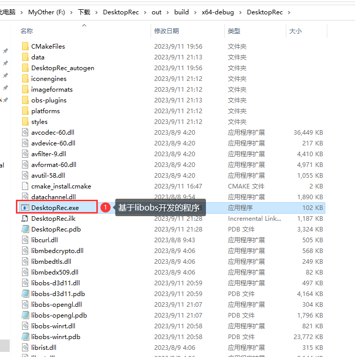

<font color=red>以上库和程序都是基于x64 Debug版本，如果有其他版本需求，请自行编译，流程一模一样。</font>