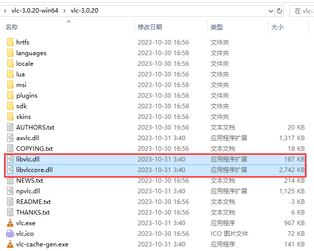

## 直播流测试地址

[rtsp、rtmp、m3u8、flv、mkv、3gp、mp4直播流测试地址](https://blog.csdn.net/u014696856/article/details/134444974)

## VLC

进入[VLC库下载](https://download.videolan.org/pub/videolan/vlc/last/)网站。


进去win64目录，下载`vlc-3.0.20-win64.7z`。


下载完后解压，可以看到有`plugins`和`sdk`目录，这两个都是需要的。

+ `plugins`是所有插件目录
+ `sdk`中有`include`头文件目录和`lib`库目录


还有两个`dll`文件也是必须要的。



为了方便开发，我们需要自行组织一下目录结构。

+ 新建`libvlc`目录
+ 把`sdk`目录中的所有文件都拷贝到`libvlc`中
+ 然后在`libvlc`目录中创建bin目录，再把`libvlc.dll`、`libvlccore.dll`和`plugins`全部拷贝到bin目录中

```css
libvlc
   ├─activex
   ├─bin
   │  ├─plugins
   |  ├─libvlc.dll 
   |  ├─libvlccore.dll
   ├─include
   └─lib
```

这样，我们就可以愉快的开始基于libvlc进行开发了！

>**注意：**配置好开发环境，包含头文件`<vlc/vlc.h>`运行，如果报错如下：
>
>```
>F:\Tools\libvlc\include\vlc\libvlc_media.h(368): error C2065: “libvlc_media_read_cb”: 未声明的标识符
>F:\Tools\libvlc\include\vlc\libvlc_media.h(368): error C4430: 缺少类型说明符 - 假定为 int。注意: C++ 不支持默认 int
>F:\Tools\libvlc\include\vlc\libvlc_media.h(368): error C2513: “int”: 在“=”前没有声明变量
>F:\Tools\libvlc\include\vlc\libvlc_media.h(368): error C2143: 语法错误: 缺少“;”(在“(”的前面)
>F:\Tools\libvlc\include\vlc\libvlc_media.h(368): error C2062: 意外的类型“void”
>F:\Tools\libvlc\include\vlc\libvlc_media.h(478): error C2061: 语法错误: 标识符“libvlc_media_read_cb”
>```
>
>则在包含头文件`<vlc/vlc.h>`之前加上`typedef long long int ssize_t;`即可！
>
>也可以加到vlc.h头文件中去。

### 库使用

[开发文档](https://videolan.videolan.me/vlc/)